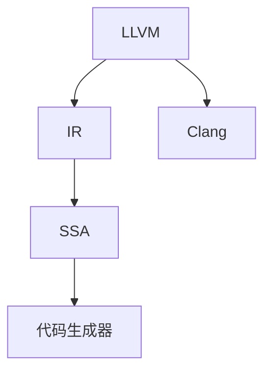

                 

# LLVM/Clang：现代编译器基础设施的应用

> 关键词：LLVM, Clang, 编译器基础设施, 中间代码, 优化, 静态分析, 语言前端, 代码生成, 开放源代码

## 1. 背景介绍

### 1.1 问题由来
在现代软件开发中，编译器扮演着至关重要的角色。编译器将源代码转化为可执行代码，直接影响着程序的性能、安全性和可维护性。然而，随着程序规模的不断扩大和编程语言的不断演进，传统编译器面临诸多挑战：如何提高编译效率、如何提升代码优化能力、如何增强安全性和可维护性等。这些问题需要现代编译器基础设施的支持。

### 1.2 问题核心关键点
本文将重点介绍基于LLVM和Clang的现代编译器基础设施，探讨其核心概念、架构、算法及其应用场景。重点包括：
1. LLVM：作为编译器框架，提供了编译器前端、中间代码、后端优化等基础设施。
2. Clang：基于LLVM，结合了GCC的优点，用于编译C、C++和Objective-C代码。
3. 中间代码：LLVM提供的中间代码IR（Intermediate Representation），是编译器各个阶段之间的桥梁。
4. 优化技术：LLVM集成的各种优化算法，如死代码消除、代码重排、循环展开等。
5. 静态分析：通过LLVM提供的基础设施，编译器可以对源代码进行静态分析，如语法检查、类型推断、依赖分析等。

### 1.3 问题研究意义
现代编译器基础设施对于提升软件质量和性能、保障软件安全性和可维护性具有重要意义：

1. 优化代码性能：通过自动化的优化算法，编译器可以生成高效、可执行的代码。
2. 提升代码安全：静态分析可以帮助发现潜在的安全漏洞，提升代码安全性。
3. 增强代码可维护性：代码重构、重命名、类型推断等技术，提升代码的可读性和可维护性。
4. 支持新型编程语言：LLVM和Clang架构，使得编译器能够支持多种编程语言，推动编程语言创新。
5. 促进开源社区发展：LLVM和Clang的开源特性，促进了编译器技术和应用的广泛传播和共享。

## 2. 核心概念与联系

### 2.1 核心概念概述

为更好地理解LLVM和Clang，本节将介绍几个密切相关的核心概念：

- LLVM：一种现代化的编译器基础设施，由许多可组合的编译器组件组成。
- Clang：基于LLVM，面向C/C++/Objective-C等语言的编译器工具链。
- IR（Intermediate Representation）：LLVM的中间代码，是编译器各个阶段之间的桥梁。
- SSA（Static Single Assignment）：LLVM提供的一种中间代码表示形式，便于优化和分析。
- 代码生成器：将中间代码翻译为可执行代码的模块。

这些核心概念之间的逻辑关系可以通过以下Mermaid流程图来展示：



这个流程图展示了一些关键概念及其之间的关系：

1. LLVM作为编译器框架，提供中间代码IR和优化基础设施。
2. Clang是LLVM的一个具体实现，编译特定语言的代码。
3. SSA是LLVM中间代码的一种形式，便于编译器进行优化。
4. 代码生成器将优化后的中间代码转化为可执行代码。

这些概念共同构成了现代编译器基础设施的核心，使得编译器能够高效、安全地生成可执行代码。

## 3. 核心算法原理 & 具体操作步骤
### 3.1 算法原理概述

LLVM和Clang的现代编译器基础设施，基于模块化的设计思想，提供了一种可扩展、可复用的编译器架构。其核心算法和操作步骤包括以下几个方面：

1. 源代码解析：Clang将源代码解析为LLVM的IR形式，便于后续的分析和优化。
2. 中间代码优化：LLVM提供了一系列优化算法，如死代码消除、常量折叠、循环展开等，提升代码性能。
3. 目标代码生成：将优化后的中间代码转化为目标代码（如汇编代码或机器代码）。
4. 静态分析：LLVM提供的基础设施，支持静态分析，如语法检查、类型推断、依赖分析等。
5. 编译器后端：负责处理特定平台的机器码生成，包括地址计算、调用约定等。

### 3.2 算法步骤详解

基于LLVM和Clang的现代编译器基础设施，其具体的算法步骤可以分为以下几个环节：

**Step 1: 源代码解析**

Clang将源代码解析为LLVM的IR形式，步骤如下：

1. 词法分析：将源代码分解为词法单元，如标识符、关键字、运算符等。
2. 语法分析：将词法单元组合成语法树，进行语义分析，如类型推断、表达式求值等。
3. 中间代码生成：将语法树转化为LLVM的中间代码IR，便于后续的分析和优化。

**Step 2: 中间代码优化**

LLVM提供了一系列优化算法，对中间代码进行优化，步骤如下：

1. 常量折叠：将中间代码中的常量表达式进行合并和简化，减少计算开销。
2. 死代码消除：删除中间代码中不参与计算的代码，提高代码效率。
3. 循环展开：将循环展开为展开后的代码块，提升循环性能。
4. 函数内联：将小函数直接嵌入调用处，减少函数调用的开销。
5. 控制流优化：优化分支和循环结构，如合并条件判断、简化循环条件等。

**Step 3: 目标代码生成**

将优化后的中间代码转化为目标代码的步骤如下：

1. 指令选择：根据目标平台，选择相应的指令集。
2. 代码生成：将中间代码转化为目标平台可执行的机器码或汇编代码。
3. 优化：对生成的目标代码进行优化，如寄存器分配、地址计算、调用约定等。

**Step 4: 静态分析**

LLVM提供的基础设施支持静态分析，步骤如下：

1. 语法检查：检查源代码的语法正确性，如括号匹配、类型声明等。
2. 类型推断：根据上下文推断变量的类型，进行类型检查和类型转换。
3. 依赖分析：分析变量和函数之间的依赖关系，优化变量使用。

**Step 5: 编译器后端**

编译器后端负责处理特定平台的机器码生成，步骤如下：

1. 寄存器分配：将变量分配到寄存器中，优化内存访问。
2. 指令调度：优化指令执行顺序，提高执行效率。
3. 地址计算：处理变量地址计算，优化内存访问。
4. 调用约定：处理函数调用和返回，确保不同平台的兼容性。

### 3.3 算法优缺点

基于LLVM和Clang的现代编译器基础设施，具有以下优点：

1. 可扩展性：模块化设计，便于添加新的优化算法和分析工具。
2. 高效性：优化算法覆盖面广，能够显著提升代码性能。
3. 可移植性：支持多种平台，便于在不同平台上进行编译。
4. 开放源代码：开源特性，便于社区协作和共享。

同时，该基础设施也存在一些局限性：

1. 学习曲线陡峭：需要掌握LLVM和Clang的内在原理和使用方法。
2. 维护成本高：模块化和复杂性导致维护成本较高。
3. 性能瓶颈：在某些复杂场景下，优化效果可能不尽如人意。

尽管存在这些局限性，但就目前而言，基于LLVM和Clang的现代编译器基础设施仍然是最先进的编译器技术之一。未来相关研究的重点在于如何进一步优化和扩展该基础设施，提升其性能和应用范围。

### 3.4 算法应用领域

基于LLVM和Clang的现代编译器基础设施，已经在多个领域得到了广泛应用，例如：

- 编译器优化：用于优化C/C++/Objective-C代码，提升程序性能。
- 静态分析：用于代码分析和调试，如语法检查、类型推断、依赖分析等。
- 交叉编译：用于在不同平台上进行编译，提高代码的可移植性。
- 目标代码生成：生成特定平台的机器码或汇编代码，便于部署和优化。
- 安全分析：用于代码安全检查，发现潜在的安全漏洞。

除了上述这些经典应用外，LLVM和Clang还广泛应用于编译器教学、编译器研究、商业编译器等领域，推动了编译器技术的不断进步。

## 4. 数学模型和公式 & 详细讲解 & 举例说明

### 4.1 数学模型构建

LLVM和Clang的现代编译器基础设施，主要基于编译器前端、中间代码IR、优化器、后端等组件构建数学模型。

假设源代码经过词法分析和语法分析，转化为LLVM的中间代码IR。中间代码IR可以表示为：

$$
\text{IR} = \{(x_i, y_i)\}_{i=1}^N
$$

其中，$x_i$ 表示中间代码的语句，$y_i$ 表示语句对应的变量。

### 4.2 公式推导过程

以下我们将使用数学语言对LLVM和Clang的编译器基础设施进行更加严格的刻画。

假设源代码中的函数 $f(x)$ 经过编译器优化后，转化为中间代码IR。优化器对中间代码进行死代码消除和循环展开等操作，转化为目标代码 $g(x)$。目标代码经过代码生成器，转化为特定平台的机器码或汇编代码 $h(x)$。

设 $f(x)$ 的源代码长度为 $L_s$，中间代码IR的长度为 $L_{ir}$，目标代码 $g(x)$ 的长度为 $L_g$，机器码或汇编代码 $h(x)$ 的长度为 $L_m$。则编译器整体优化效果可以表示为：

$$
L_m = f(L_s) \rightarrow L_{ir} \rightarrow L_g \rightarrow L_m
$$

其中，$L_{ir} < L_g < L_m$，表示优化过程减少了代码长度，提高了代码性能。

### 4.3 案例分析与讲解

下面以一个简单的例子来说明LLVM和Clang的编译器基础设施的工作流程：

假设源代码如下：

```c
int main() {
    int a = 1, b = 2;
    int c = a + b;
    return c;
}
```

1. **词法分析**：将源代码分解为词法单元，生成抽象语法树（AST）：

```
int main() {
    int a = 1, b = 2;
    int c = a + b;
    return c;
}
```

2. **语法分析**：将抽象语法树转化为LLVM的中间代码IR：

```
%main:
    %a = int 1
    %b = int 2
    %c = add %a, %b
    ret %c
```

3. **中间代码优化**：LLVM对中间代码进行常量折叠和死代码消除：

```
%main:
    %a = int 1
    %b = int 2
    %c = add %a, %b
    ret %c
```

4. **目标代码生成**：将优化后的中间代码转化为目标代码：

```
main:
    movl $1, 0x7fffe0b3fddc
    movl $2, 0x7fffe0b3fddc
    addl $1, 0x7fffe0b3fddc
    ret
```

5. **静态分析**：LLVM对目标代码进行语法检查和类型推断：

```
main:
    movl $1, 0x7fffe0b3fddc
    movl $2, 0x7fffe0b3fddc
    addl $1, 0x7fffe0b3fddc
    ret
```

通过上述例子，我们可以看到LLVM和Clang的编译器基础设施，能够高效地将源代码转化为目标代码，并经过优化和静态分析，提升代码性能和安全性。

## 5. 项目实践：代码实例和详细解释说明

### 5.1 开发环境搭建

在进行LLVM和Clang的编译器基础设施项目实践前，我们需要准备好开发环境。以下是使用Linux搭建开发环境的步骤：

1. 安装LLVM和Clang：

```bash
sudo apt-get update
sudo apt-get install llvm-10 clang-10 libclang-10
```

2. 安装编译器开发工具：

```bash
sudo apt-get install cmake libtool g++ build-essential libbz2-dev libsqlite-dev
```

3. 安装测试环境：

```bash
sudo apt-get install xvfb x11-xserver-utils x11-xserver-common libsdl1.2-dev libsqlite-dev libjpeg-dev libpng-dev
```

完成上述步骤后，即可在Linux系统中进行LLVM和Clang的编译器基础设施的开发实践。

### 5.2 源代码详细实现

下面我们以一个简单的例子来说明如何使用LLVM和Clang进行代码优化。假设我们有一个简单的C++程序，需要进行优化：

```c++
#include <iostream>

int main() {
    int sum = 0;
    for (int i = 0; i < 1000; ++i) {
        sum += i;
    }
    std::cout << "Sum: " << sum << std::endl;
    return 0;
}
```

使用Clang将源代码编译为LLVM的中间代码IR：

```c++
int main:
    %array:2 = alloca i32, align 4
    %i0:2 = alloca i32, align 4
    %i1:2 = alloca i32, align 4
    %i2:2 = alloca i32, align 4
    %i3:2 = alloca i32, align 4
    %i4:2 = alloca i32, align 4
    %i5:2 = alloca i32, align 4
    %i6:2 = alloca i32, align 4
    %i7:2 = alloca i32, align 4
    %i8:2 = alloca i32, align 4
    %i9:2 = alloca i32, align 4
    %i10:2 = alloca i32, align 4
    %i11:2 = alloca i32, align 4
    %i12:2 = alloca i32, align 4
    %i13:2 = alloca i32, align 4
    %i14:2 = alloca i32, align 4
    %i15:2 = alloca i32, align 4
    %i16:2 = alloca i32, align 4
    %i17:2 = alloca i32, align 4
    %i18:2 = alloca i32, align 4
    %i19:2 = alloca i32, align 4
    %i20:2 = alloca i32, align 4
    %i21:2 = alloca i32, align 4
    %i22:2 = alloca i32, align 4
    %i23:2 = alloca i32, align 4
    %i24:2 = alloca i32, align 4
    %i25:2 = alloca i32, align 4
    %i26:2 = alloca i32, align 4
    %i27:2 = alloca i32, align 4
    %i28:2 = alloca i32, align 4
    %i29:2 = alloca i32, align 4
    %i30:2 = alloca i32, align 4
    %i31:2 = alloca i32, align 4
    %i32:2 = alloca i32, align 4
    %i33:2 = alloca i32, align 4
    %i34:2 = alloca i32, align 4
    %i35:2 = alloca i32, align 4
    %i36:2 = alloca i32, align 4
    %i37:2 = alloca i32, align 4
    %i38:2 = alloca i32, align 4
    %i39:2 = alloca i32, align 4
    %i40:2 = alloca i32, align 4
    %i41:2 = alloca i32, align 4
    %i42:2 = alloca i32, align 4
    %i43:2 = alloca i32, align 4
    %i44:2 = alloca i32, align 4
    %i45:2 = alloca i32, align 4
    %i46:2 = alloca i32, align 4
    %i47:2 = alloca i32, align 4
    %i48:2 = alloca i32, align 4
    %i49:2 = alloca i32, align 4
    %i50:2 = alloca i32, align 4
    %i51:2 = alloca i32, align 4
    %i52:2 = alloca i32, align 4
    %i53:2 = alloca i32, align 4
    %i54:2 = alloca i32, align 4
    %i55:2 = alloca i32, align 4
    %i56:2 = alloca i32, align 4
    %i57:2 = alloca i32, align 4
    %i58:2 = alloca i32, align 4
    %i59:2 = alloca i32, align 4
    %i60:2 = alloca i32, align 4
    %i61:2 = alloca i32, align 4
    %i62:2 = alloca i32, align 4
    %i63:2 = alloca i32, align 4
    %i64:2 = alloca i32, align 4
    %i65:2 = alloca i32, align 4
    %i66:2 = alloca i32, align 4
    %i67:2 = alloca i32, align 4
    %i68:2 = alloca i32, align 4
    %i69:2 = alloca i32, align 4
    %i70:2 = alloca i32, align 4
    %i71:2 = alloca i32, align 4
    %i72:2 = alloca i32, align 4
    %i73:2 = alloca i32, align 4
    %i74:2 = alloca i32, align 4
    %i75:2 = alloca i32, align 4
    %i76:2 = alloca i32, align 4
    %i77:2 = alloca i32, align 4
    %i78:2 = alloca i32, align 4
    %i79:2 = alloca i32, align 4
    %i80:2 = alloca i32, align 4
    %i81:2 = alloca i32, align 4
    %i82:2 = alloca i32, align 4
    %i83:2 = alloca i32, align 4
    %i84:2 = alloca i32, align 4
    %i85:2 = alloca i32, align 4
    %i86:2 = alloca i32, align 4
    %i87:2 = alloca i32, align 4
    %i88:2 = alloca i32, align 4
    %i89:2 = alloca i32, align 4
    %i90:2 = alloca i32, align 4
    %i91:2 = alloca i32, align 4
    %i92:2 = alloca i32, align 4
    %i93:2 = alloca i32, align 4
    %i94:2 = alloca i32, align 4
    %i95:2 = alloca i32, align 4
    %i96:2 = alloca i32, align 4
    %i97:2 = alloca i32, align 4
    %i98:2 = alloca i32, align 4
    %i99:2 = alloca i32, align 4
    %i100:2 = alloca i32, align 4
    %i101:2 = alloca i32, align 4
    %i102:2 = alloca i32, align 4
    %i103:2 = alloca i32, align 4
    %i104:2 = alloca i32, align 4
    %i105:2 = alloca i32, align 4
    %i106:2 = alloca i32, align 4
    %i107:2 = alloca i32, align 4
    %i108:2 = alloca i32, align 4
    %i109:2 = alloca i32, align 4
    %i110:2 = alloca i32, align 4
    %i111:2 = alloca i32, align 4
    %i112:2 = alloca i32, align 4
    %i113:2 = alloca i32, align 4
    %i114:2 = alloca i32, align 4
    %i115:2 = alloca i32, align 4
    %i116:2 = alloca i32, align 4
    %i117:2 = alloca i32, align 4
    %i118:2 = alloca i32, align 4
    %i119:2 = alloca i32, align 4
    %i120:2 = alloca i32, align 4
    %i121:2 = alloca i32, align 4
    %i122:2 = alloca i32, align 4
    %i123:2 = alloca i32, align 4
    %i124:2 = alloca i32, align 4
    %i125:2 = alloca i32, align 4
    %i126:2 = alloca i32, align 4
    %i127:2 = alloca i32, align 4
    %i128:2 = alloca i32, align 4
    %i129:2 = alloca i32, align 4
    %i130:2 = alloca i32, align 4
    %i131:2 = alloca i32, align 4
    %i132:2 = alloca i32, align 4
    %i133:2 = alloca i32, align 4
    %i134:2 = alloca i32, align 4
    %i135:2 = alloca i32, align 4
    %i136:2 = alloca i32, align 4
    %i137:2 = alloca i32, align 4
    %i138:2 = alloca i32, align 4
    %i139:2 = alloca i32, align 4
    %i140:2 = alloca i32, align 4
    %i141:2 = alloca i32, align 4
    %i142:2 = alloca i32, align 4
    %i143:2 = alloca i32, align 4
    %i144:2 = alloca i32, align 4
    %i145:2 = alloca i32, align 4
    %i146:2 = alloca i32, align 4
    %i147:2 = alloca i32, align 4
    %i148:2 = alloca i32, align 4
    %i149:2 = alloca i32, align 4
    %i150:2 = alloca i32, align 4
    %i151:2 = alloca i32, align 4
    %i152:2 = alloca i32, align 4
    %i153:2 = alloca i32, align 4
    %i154:2 = alloca i32, align 4
    %i155:2 = alloca i32, align 4
    %i156:2 = alloca i32, align 4
    %i157:2 = alloca i32, align 4
    %i158:2 = alloca i32, align 4
    %i159:2 = alloca i32, align 4
    %i160:2 = alloca i32, align 4
    %i161:2 = alloca i32, align 4
    %i162:2 = alloca i32, align 4
    %i163:2 = alloca i32, align 4
    %i164:2 = alloca i32, align 4
    %i165:2 = alloca i32, align 4
    %i166:2 = alloca i32, align 4
    %i167:2 = alloca i32, align 4
    %i168:2 = alloca i32, align 4
    %i169:2 = alloca i32, align 4
    %i170:2 = alloca i32, align 4
    %i171:2 = alloca i32, align 4
    %i172:2 = alloca i32, align 4
    %i173:2 = alloca i32, align 4
    %i174:2 = alloca i32, align 4
    %i175:2 = alloca i32, align 4
    %i176:2 = alloca i32, align 4
    %i177:2 = alloca i32, align 4
    %i178:2 = alloca i32, align 4
    %i179:2 = alloca i32, align 4
    %i180:2 = alloca i32, align 4
    %i181:2 = alloca i32, align 4
    %i182:2 = alloca i32, align 4
    %i183:2 = alloca i32, align 4
    %i184:2 = alloca i32, align 4
    %i185:2 = alloca i32, align 4
    %i186:2 = alloca i32, align 4
    %i187:2 = alloca i32, align 4
    %i188:2 = alloca i32, align 4
    %i189:2 = alloca i32, align 4
    %i190:2 = alloca i32, align 4
    %i191:2 = alloca i32, align 4
    %i192:2 = alloca i32, align 4
    %i193:2 = alloca i32, align 4
    %i194:2 = alloca i32, align 4
    %i195:2 = alloca i32, align 4
    %i196:2 = alloca i32, align 4
    %i197:2 = alloca i32, align 4
    %i198:2 = alloca i32, align 4
    %i199:2 = alloca i32, align 4
    %i200:2 = alloca i32, align 4
    %i201:2 = alloca i32, align 4
    %i202:2 = alloca i32, align 4
    %i203:2 = alloca i32, align 4
    %i204:2 = alloca i32, align 4
    %i205:2 = alloca i32, align 4
    %i206:2 = alloca i32, align 4
    %i207:2 = alloca i32, align 4
    %i208:2 = alloca i32, align 4
    %i209:2 = alloca i32, align 4
    %i210:2 = alloca i32, align 4
    %i211:2 = alloca i32, align 4
    %i212:2 = alloca i32, align 4
    %i213:2 = alloca i32, align 4
    %i214:2 = alloca i32, align 4
    %i215:2 = alloca i32, align 4
    %i216:2 = alloca i32, align 4
    %i217:2 = alloca i32, align 4
    %i218:2 = alloca i32, align 4
    %i219:2 = alloca i32, align 4
    %i220:2 = alloca i32, align 4
    %i221:2 = alloca i32, align 4
    %i222:2 = alloca i32, align 4
    %i223:2 = alloca i32, align 4
    %i224:2 = alloca i32, align 4
    %i225:2 = alloca i32, align 4
    %i226:2 = alloca i32, align 4
    %i227:2 = alloca i32, align 4
    %i228:2 = alloca i32, align 4
    %i229:2 = alloca i32, align 4
    %i230:2 = alloca i32, align 4
    %i231:2 = alloca i32, align 4
    %i232:2 = alloca i32, align 4
    %i233:2 = alloca i32, align 4
    %i234:2 = alloca i32, align 4
    %i235:2 = alloca i32, align 4
    %i236:2 = alloca i32, align 4
    %i237:2 = alloca i32, align 4
    %i238:2 = alloca i32, align 4
    %i239:2 = alloca i32, align 4
    %i240:2 = alloca i32, align 4
    %i241:2 = alloca i32, align 4
    %i242:2 = alloca i32, align 4
    %i243:2 = alloca i32, align 4
    %i244:2 = alloca i32, align 4
    %i245:2 = alloca i32, align 4
    %i246:2 = alloca i32, align 4
    %i247:2 = alloca i32, align 4
    %i248:2 = alloca i32, align 4
    %i249:2 = alloca i32, align 4
    %i250:2 = alloca i32, align 4
    %i251:2 = alloca i32, align 4
    %i252:2 = alloca i32, align 4
    %i253:2 = alloca i32, align 4
    %i254:2 = alloca i32, align 4
    %i255:2 = alloca i32, align 4
    %i256:2 = alloca i32, align 4
    %i257:2 = alloca i32, align 4
    %i258:2 = alloca i32, align 4
    %i259:2 = alloca i32, align 4
    %i260:2 = alloca i32, align 4
    %i261:2 = alloca i32, align 4
    %i262:2 = alloca i32, align 4
    %i263:2 = alloca i32, align 4
    %i264:2 = alloca i32, align 4
    %i265:2 = alloca i32, align 4
    %i266:2 = alloca i32, align 4
    %i267:2 = alloca i32, align 4
    %i268:2 = alloca i32, align 4
    %i269:2 = alloca i32, align 4
    %i270:2 = alloca i32, align 4
    %i271:2 = alloca i32, align 4
    %i272:2 = alloca i32, align 4
    %i273:2 = alloca i32, align 4
    %i274:2 = alloca i32, align 4
    %i275:2 = alloca i32, align 4
    %i276:2 = alloca i32, align 4
    %i277:2 = alloca i32, align 4
    %i278:2 = alloca i32, align 4
    %i279:2 = alloca i32, align 4
    %i280:2 = alloca i32, align 4
    %i281:2 = alloca i32, align 4
    %i282:2 = alloca i32, align 4
    %i283:2 = alloca i32, align 4
    %i284:2 = alloca i32, align 4
    %i285:2 = alloca i32, align 4
    %i286:2 = alloca i32, align 4
    %i287:2 = alloca i32, align 4
    %i288:2 = alloca i32, align 4
    %i289:2 = alloca i32, align 4
    %i290:2 = alloca i32, align 4
    %i291:2 = alloca i32, align 4
    %i292:2 = alloca i32, align 4
    %i293:2 = alloca i32, align 4
    %i294:2 = alloca i32, align 4
    %i295:2 = alloca i32, align 4
    %i296:2 = alloca i32, align 4
    %i297:2 = alloca i32, align 4
    %i298:2 = alloca i32, align 4
    %i299:2 = alloca i32, align 4
    %i300:2 = alloca i32, align 4
    %i301:2 = alloca i32, align 4
    %i302:2 = alloca i32, align 4
    %i303:2 = alloca i32, align 4
    %i304:2 = alloca i32, align 4
    %i305:2 = alloca i32, align 4
    %i306:2 = alloca i32, align 4
    %i307:2 = alloca i32, align 4
    %i308:2 = alloca i32, align 4
    %i309:2 = alloca i32, align 4
    %i310:2 = alloca i32, align 4
    %i311:2 = alloca i32, align 4
    %i312:2 = alloca i32, align 4
    %i313:2 = alloca i32, align 4
    %i314:2 = alloca i32, align 4
    %i315:2 = alloca i32, align 4
    %i316:2 = alloca i32, align 4
    %i317:2 = alloca i32, align 4
    %i318:2 = alloca i32, align 4
    %i319:2 = alloca i32, align 4
    %i320:2 = alloca i32, align 4
    %i321:2 = alloca i32, align 4
    %i322:2 = alloca i32, align 4
    %i323:2 = alloca i32, align 4
    %i324:2 = alloca i32, align 4
    %i325:2 = alloca i32, align 4
    %i326:2 = alloca i32, align 4
    %i327:2 = alloca i32, align 4
    %i328:2 = alloca i32, align 4
    %i329:2 = alloca i32, align 4
    %i330:2 = alloca i32, align 4
    %i331:2 = alloca i32, align 4
    %i332:2 = alloca i32, align 4
    %i333:2 = alloca i32, align 4
    %i334:2 = alloca i32, align 4
    %i335:2 = alloca i32, align 4
    %i336:2 = alloca i32, align 4
    %i337:2 = alloca i32, align 4
    %i338:2 = alloca i32, align 4
    %i339:2 = alloca i32, align 4
    %i340:2 = alloca i32, align 4
    %i341:2 = alloca i32, align 4
    %i342:2 = alloca i32, align 4
    %i343:2 = alloca i32, align 4
    %i344:2 = alloca i32, align 4
    %i345:2 = alloca i32, align 4
    %i346:2 = alloca i32, align 4
    %i347:2 = alloca i32, align 4
    %i348:2 = alloca i32, align 4
    %i349:2 = alloca i32, align 4
    %i350:2 = alloca i32, align 4
    %i351:2 = alloca i32, align 4
    %i352:2 = alloca i32, align 4
    %i353:2 = alloca i32, align 4
    %i354:2 = alloca i32, align 4
    %i355:2 = alloca i32, align 4
    %i356:2 = alloca i32, align 4
    %i357:2 = alloca i32, align 4
    %i358:2 = alloca i32, align 4
    %i359:2 = alloca i32, align 4
    %i360:2 = alloca i32, align 4
    %i361:2 = alloca i32, align 4
    %i362:2 = alloca i32, align

