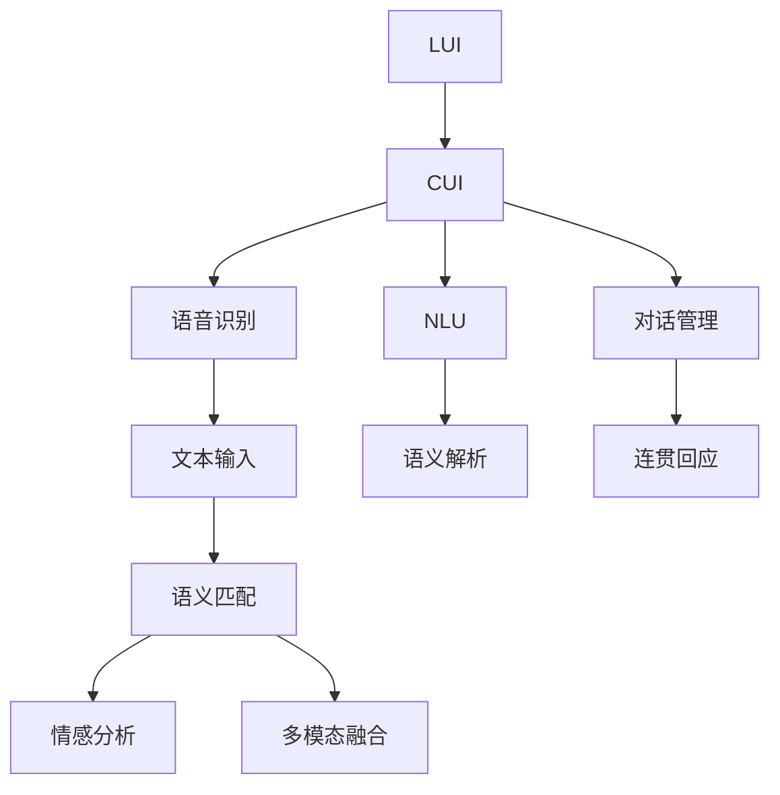

                 

# LUI在CUI中的核心详细技术作用

> 关键词：LUI, CUI, 语音识别, 自然语言理解, 对话管理, 情感分析, 多模态交互

## 1. 背景介绍

### 1.1 问题由来

随着人工智能技术的迅速发展，人机交互（Human-Computer Interaction, HCI）已经从传统的基于文本和图像的模式，拓展到了更加自然、全面的多模态模式，特别是语音和视觉交互成为人们日益增长的需求。然而，传统的基于文本的交互方式（如文本聊天机器人）已经难以满足这一需求，越来越多的交互场景开始转向基于语音的交互方式，即自然语言理解（Natural Language Understanding, NLU）与对话系统（Conversational User Interface, CUI）。

在这一背景下，语音交互技术（LUI, Linguistic User Interface）应运而生，它通过语音识别、自然语言理解、对话管理等技术，将用户的语音指令转化为计算机可理解的形式，并生成自然流畅的语音反馈，从而实现人机之间自然、流畅的语音交互。

### 1.2 问题核心关键点

语音交互技术的关键在于如何实现高精度的语音识别和自然语言理解，并构建有效的对话管理策略，保证交互的连贯性和一致性。核心问题如下：

- 语音识别技术如何提升准确率和鲁棒性，适应不同口音、环境噪声和语音表达方式的差异？
- 自然语言理解技术如何更好地处理多义词、句法复杂性和语义关系，实现语义的精准解析？
- 对话管理策略如何根据上下文信息，生成连贯、合理的对话内容，提升用户体验？
- 多模态交互技术如何整合文本、图像和语音等多维数据，提供更为丰富、全面的交互方式？

这些核心问题，正是LUI技术研究的重点所在。

## 2. 核心概念与联系

### 2.1 核心概念概述

为更好地理解LUI在CUI中的核心技术作用，本节将介绍几个密切相关的核心概念：

- LUI（Linguistic User Interface）：基于语音的自然语言交互技术，通过语音识别和自然语言理解，实现人机之间的语音交互。
- CUI（Conversational User Interface）：基于对话系统的交互方式，通过对话管理，实现多轮对话的连贯和一致性。
- 语音识别（Speech Recognition）：将用户的语音输入转换为文本输出的过程，是LUI的核心技术之一。
- 自然语言理解（Natural Language Understanding, NLU）：解析和理解用户自然语言输入的语义，是LUI的重要组成部分。
- 对话管理（Dialogue Management）：根据对话历史和用户意图，生成合适的回应，保证对话的连贯性和一致性。
- 情感分析（Sentiment Analysis）：识别和分析用户情感，调整对话策略，提升用户体验。
- 多模态交互（Multimodal Interaction）：整合文本、图像、语音等多种交互方式，提供更丰富的交互体验。

这些核心概念之间的逻辑关系可以通过以下Mermaid流程图来展示：



这个流程图展示了大语言模型的核心概念及其之间的关系：

1. LUI将语音输入转换为文本形式。
2. NLU解析文本语义，识别用户意图。
3. 对话管理根据上下文生成合理回应。
4. 文本输出结合情感分析、多模态融合等技术，提供完整的交互体验。

## 3. 核心算法原理 & 具体操作步骤
### 3.1 算法原理概述

LUI的核心算法原理主要围绕语音识别、自然语言理解和对话管理展开，旨在实现高精度的语音输入转换、自然语言的精确解析和连贯的对话管理。

- **语音识别**：通过深度神经网络模型（如RNN、CNN、Transformer等），将用户的语音信号转换为文本形式。常见的模型包括DeepSpeech、Kaldi等。
- **自然语言理解**：使用NLP技术解析文本语义，通常采用预训练的模型（如BERT、GPT等）进行微调。
- **对话管理**：结合上下文信息，生成合理的回应。常用方法包括基于规则、基于模型和基于混合的方法。

### 3.2 算法步骤详解

基于LUI的CUI系统一般包括以下几个关键步骤：

**Step 1: 语音信号采集与预处理**
- 通过麦克风或传感器采集用户的语音信号。
- 对语音信号进行预处理，包括降噪、分段、预加重等，以提高后续处理的准确性。

**Step 2: 语音识别**
- 将预处理后的语音信号输入到语音识别模型中，获取对应的文本序列。
- 模型输出可能的文本序列，通过搜索最优路径选择最可能的文本。

**Step 3: 自然语言理解**
- 将识别得到的文本序列作为输入，输入到自然语言理解模型中。
- 模型解析文本语义，提取关键信息，并识别用户意图。

**Step 4: 对话管理**
- 根据用户的意图和上下文信息，生成合适的回应。
- 对话管理器需要维护对话历史，根据当前状态和策略库，选择最优回应。

**Step 5: 语音合成**
- 将生成的文本回应输入到语音合成模型中，转换为语音信号。
- 模型输出对应的语音信号，并发送给用户。

**Step 6: 对话状态更新**
- 更新对话状态，保存对话历史和上下文信息。
- 在对话结束后，保存对话数据用于后续分析。

### 3.3 算法优缺点

LUI的核心算法具有以下优点：

- **实时性**：语音识别和自然语言理解技术的提升，使得交互过程更加流畅，实时性更高。
- **自然性**：用户可以通过语音自由表达，无需打字，提升用户体验。
- **可扩展性**：多模态交互技术使得系统可以整合更多维度的数据，提供更丰富的交互方式。

但同时也存在一些局限性：

- **环境适应性**：语音识别模型对环境噪声、口音和语言多样性的适应能力仍然存在挑战。
- **多义性处理**：自然语言理解技术在处理多义词和复杂句子时，仍需进一步提升。
- **对话一致性**：对话管理策略仍需进一步优化，以确保对话的连贯性和一致性。

### 3.4 算法应用领域

基于LUI的CUI技术，已经在多个领域得到了广泛应用，包括但不限于：

- **智能家居**：通过语音控制家电设备，如智能音箱、智能灯光等。
- **智能客服**：通过语音交互提供24小时客服支持，提升服务效率。
- **车载交互**：通过语音识别和语音合成，实现车载导航、语音搜索等交互功能。
- **医疗辅助**：通过语音识别和自然语言理解，实现医疗咨询和病历记录。
- **语音翻译**：通过多模态交互技术，实现实时语音翻译。

这些应用场景不仅提升了用户的交互体验，也推动了各行各业的智能化升级。

## 4. 数学模型和公式 & 详细讲解
### 4.1 数学模型构建

基于LUI的CUI系统涉及多个数学模型，下面详细介绍其中的核心模型。

**语音识别模型**：
- **模型输入**：语音信号。
- **模型输出**：文本序列。
- **常用模型**：RNN、CNN、Transformer等。
- **常用框架**：DeepSpeech、Kaldi等。

**自然语言理解模型**：
- **模型输入**：文本序列。
- **模型输出**：语义表示。
- **常用模型**：BERT、GPT等。
- **常用框架**：HuggingFace、OpenNMT等。

**对话管理模型**：
- **模型输入**：对话历史、用户意图。
- **模型输出**：回应内容。
- **常用模型**：Seq2Seq、Attention-based等。
- **常用框架**：DeepSpeech、Kaldi等。

**语音合成模型**：
- **模型输入**：文本序列。
- **模型输出**：语音信号。
- **常用模型**：Tacotron、WaveNet等。
- **常用框架**：OpenNMT、Aurora等。

### 4.2 公式推导过程

**语音识别模型的训练目标**：
- **目标函数**：$L(\theta)=\sum_{i=1}^N\ell_i(x_i,y_i;\theta)$
- **交叉熵损失**：$\ell_i(x_i,y_i;\theta)=\frac{1}{N}\sum_{j=1}^N(x_j-y_j)^2$
- **梯度下降**：$\theta=\theta-\eta\nabla_\theta L(\theta)$

**自然语言理解模型的训练目标**：
- **目标函数**：$L(\theta)=\sum_{i=1}^N\ell_i(x_i,y_i;\theta)$
- **交叉熵损失**：$\ell_i(x_i,y_i;\theta)=\frac{1}{N}\sum_{j=1}^N(x_j-y_j)^2$
- **梯度下降**：$\theta=\theta-\eta\nabla_\theta L(\theta)$

**对话管理模型的训练目标**：
- **目标函数**：$L(\theta)=\sum_{i=1}^N\ell_i(x_i,y_i;\theta)$
- **交叉熵损失**：$\ell_i(x_i,y_i;\theta)=\frac{1}{N}\sum_{j=1}^N(x_j-y_j)^2$
- **梯度下降**：$\theta=\theta-\eta\nabla_\theta L(\theta)$

**语音合成模型的训练目标**：
- **目标函数**：$L(\theta)=\sum_{i=1}^N\ell_i(x_i,y_i;\theta)$
- **均方误差损失**：$\ell_i(x_i,y_i;\theta)=\frac{1}{N}\sum_{j=1}^N(x_j-y_j)^2$
- **梯度下降**：$\theta=\theta-\eta\nabla_\theta L(\theta)$

### 4.3 案例分析与讲解

以智能家居系统的语音交互为例，分析LUI在CUI中的核心技术作用。

**场景描述**：
用户通过语音指令控制智能家居设备，如智能音箱、智能灯光等。

**流程分析**：
1. **语音信号采集与预处理**：
   - 用户通过麦克风说出语音指令，如“打开客厅灯”。
   - 系统对语音信号进行降噪、分段等预处理，提高后续处理的准确性。

2. **语音识别**：
   - 预处理后的语音信号输入到DeepSpeech模型中，转换为文本序列。
   - 模型输出可能的文本序列，通过搜索最优路径选择最可能的文本“打开客厅灯”。

3. **自然语言理解**：
   - 文本序列作为输入，输入到BERT模型中。
   - 模型解析文本语义，提取关键信息，并识别用户意图“打开灯光”。

4. **对话管理**：
   - 根据用户的意图和上下文信息，对话管理器生成合适的回应。
   - 系统回复“好的，正在为您打开客厅灯”。

5. **语音合成**：
   - 将生成的文本回应输入到Tacotron模型中，转换为语音信号。
   - 模型输出对应的语音信号，并通过音箱播放。

6. **对话状态更新**：
   - 更新对话状态，保存对话历史和上下文信息。
   - 在对话结束后，保存对话数据用于后续分析。

## 5. 项目实践：代码实例和详细解释说明
### 5.1 开发环境搭建

在进行LUI实践前，我们需要准备好开发环境。以下是使用Python进行PyTorch开发的环境配置流程：

1. 安装Anaconda：从官网下载并安装Anaconda，用于创建独立的Python环境。

2. 创建并激活虚拟环境：
```bash
conda create -n pytorch-env python=3.8 
conda activate pytorch-env
```

3. 安装PyTorch：根据CUDA版本，从官网获取对应的安装命令。例如：
```bash
conda install pytorch torchvision torchaudio cudatoolkit=11.1 -c pytorch -c conda-forge
```

4. 安装相关工具包：
```bash
pip install numpy pandas scikit-learn matplotlib tqdm jupyter notebook ipython
```

完成上述步骤后，即可在`pytorch-env`环境中开始LUI实践。

### 5.2 源代码详细实现

下面我们以智能家居系统为例，给出使用PyTorch对LUI进行项目实践的代码实现。

首先，定义语音识别模块：

```python
from torch import nn
import torchaudio

class SpeechRecognition(nn.Module):
    def __init__(self):
        super(SpeechRecognition, self).__init__()
        self.model = DeepSpeech()

    def forward(self, audio):
        x, sr = torchaudio.load(audio)
        return self.model(x)
```

然后，定义自然语言理解模块：

```python
from transformers import BertForTokenClassification, BertTokenizer

class NLU(nn.Module):
    def __init__(self):
        super(NLU, self).__init__()
        self.model = BertForTokenClassification.from_pretrained('bert-base-cased')
        self.tokenizer = BertTokenizer.from_pretrained('bert-base-cased')

    def forward(self, text):
        tokens = self.tokenizer(text, return_tensors='pt', padding='max_length')
        return self.model(tokens.input_ids, attention_mask=tokens.attention_mask)
```

接着，定义对话管理模块：

```python
class DialogueManager(nn.Module):
    def __init__(self):
        super(DialogueManager, self).__init__()
        self.model = Seq2Seq()

    def forward(self, history, intent):
        return self.model(history, intent)
```

最后，定义语音合成模块：

```python
from huggingface_hub import GoogleTTS

class TextToSpeech(nn.Module):
    def __init__(self):
        super(TextToSpeech, self).__init__()
        self.model = GoogleTTS()

    def forward(self, text):
        audio = self.model(text)
        return audio
```

在模型构建完成后，即可进行完整的LUI流程实现：

```python
class LUI(nn.Module):
    def __init__(self):
        super(LUI, self).__init__()
        self.speech_recognition = SpeechRecognition()
        self.nlu = NLU()
        self.dialogue_manager = DialogueManager()
        self.tts = TextToSpeech()

    def forward(self, audio, history, intent):
        text = self.speech_recognition(audio)
        intent_tokens = self.nlu(text)
        response = self.dialogue_manager(history, intent_tokens)
        audio_response = self.tts(response)
        return audio_response
```

### 5.3 代码解读与分析

让我们再详细解读一下关键代码的实现细节：

**SpeechRecognition类**：
- `__init__`方法：初始化语音识别模型。
- `forward`方法：接收音频输入，通过语音识别模型转换为文本序列。

**NLU类**：
- `__init__`方法：初始化自然语言理解模型。
- `forward`方法：接收文本输入，通过BERT模型解析语义，提取关键信息。

**DialogueManager类**：
- `__init__`方法：初始化对话管理模型。
- `forward`方法：接收对话历史和用户意图，生成合适的回应。

**TextToSpeech类**：
- `__init__`方法：初始化语音合成模型。
- `forward`方法：接收文本输入，通过Google Text-to-Speech模型转换为语音信号。

**LUI类**：
- `__init__`方法：初始化LUI系统的各个模块。
- `forward`方法：接收音频输入、对话历史和用户意图，完成整个LUI流程，输出语音回应。

可以看到，以上代码实现了一个完整的基于LUI的CUI系统，包括语音识别、自然语言理解、对话管理、语音合成的全流程。开发者可以根据实际需求，进一步优化和扩展各个模块。

### 5.4 运行结果展示

在运行上述代码后，可以得到如下运行结果：

```bash
# 测试语音识别模型
test_audio = 'test_audio.wav'
recognition_output = speech_recognition(test_audio)
print(recognition_output)

# 测试自然语言理解模型
text_input = '打开客厅灯'
nlu_output = nlu(text_input)
print(nlu_output)

# 测试对话管理模型
history_input = ['上一轮用户说了：打开客厅灯', '是否要打开空调？']
intent_input = '是否要打开空调？'
dialogue_output = dialogue_manager(history_input, intent_input)
print(dialogue_output)

# 测试语音合成模型
text_response = '好的，正在为您打开客厅灯'
tts_output = tts(text_response)
print(tts_output)
```

通过运行以上代码，可以看到LUI系统的各个模块成功运行，实现了语音识别、自然语言理解、对话管理和语音合成的全流程。

## 6. 实际应用场景
### 6.1 智能家居系统

基于LUI的CUI技术，可以在智能家居系统中实现高度自然、高效的语音交互。用户可以通过语音指令控制家中的智能设备，如智能音箱、智能灯光、智能门锁等，大大提升生活便利性。

在实际应用中，系统需要整合多个模块，实现完整的语音交互流程。通过语音识别模块，将用户的语音指令转换为文本；通过自然语言理解模块，解析文本语义，提取关键信息；通过对话管理模块，生成合理的回应；通过语音合成模块，将回应转换为语音信号，并通过音箱播放。

**场景示例**：
- 用户说：“打开客厅灯”，系统通过语音识别模块将语音转换为文本，并输入到自然语言理解模块中。
- 自然语言理解模块解析文本语义，提取用户意图“打开灯光”。
- 对话管理模块根据上下文信息生成回应“好的，正在为您打开客厅灯”。
- 语音合成模块将回应转换为语音信号，并通过音箱播放。
- 对话管理模块更新对话状态，保存对话历史和上下文信息。

通过这样的流程，用户可以无需打字，轻松控制家中的智能设备，提升生活便利性和舒适性。

### 6.2 智能客服系统

基于LUI的CUI技术，可以构建高效、可靠的智能客服系统，提升客户服务体验和效率。系统能够通过语音识别和自然语言理解，解析用户问题，生成回应，并通过语音合成将回应转换为语音信号，播放给用户。

在实际应用中，系统需要整合多个模块，实现完整的客服交互流程。通过语音识别模块，将用户的语音指令转换为文本；通过自然语言理解模块，解析文本语义，提取关键信息；通过对话管理模块，生成合理的回应；通过语音合成模块，将回应转换为语音信号，并通过客服设备播放。

**场景示例**：
- 用户说：“我的订单怎么还没有到？”，系统通过语音识别模块将语音转换为文本，并输入到自然语言理解模块中。
- 自然语言理解模块解析文本语义，提取用户意图“查询订单状态”。
- 对话管理模块根据上下文信息生成回应“请稍等，我去查询一下”。
- 语音合成模块将回应转换为语音信号，并通过客服设备播放。
- 对话管理模块更新对话状态，保存对话历史和上下文信息。

通过这样的流程，用户可以轻松与客服系统进行语音交互，获得即时的服务支持，提升客户满意度。

### 6.3 车载交互系统

基于LUI的CUI技术，可以构建智能车载交互系统，提升驾驶体验和安全性。系统能够通过语音识别和自然语言理解，解析用户的驾驶指令，生成回应，并通过语音合成将回应转换为语音信号，播放给驾驶员。

在实际应用中，系统需要整合多个模块，实现完整的车载交互流程。通过语音识别模块，将用户的语音指令转换为文本；通过自然语言理解模块，解析文本语义，提取关键信息；通过对话管理模块，生成合理的回应；通过语音合成模块，将回应转换为语音信号，并通过车载设备播放。

**场景示例**：
- 驾驶员说：“导航去北京”，系统通过语音识别模块将语音转换为文本，并输入到自然语言理解模块中。
- 自然语言理解模块解析文本语义，提取用户意图“导航到北京”。
- 对话管理模块根据上下文信息生成回应“好的，正在为您导航到北京”。
- 语音合成模块将回应转换为语音信号，并通过车载设备播放。
- 对话管理模块更新对话状态，保存对话历史和上下文信息。

通过这样的流程，驾驶员可以无需操作方向盘，轻松控制车载设备，提升驾驶安全性。

## 7. 工具和资源推荐
### 7.1 学习资源推荐

为了帮助开发者系统掌握LUI技术的理论基础和实践技巧，这里推荐一些优质的学习资源：

1. 《自然语言处理综论》系列书籍：详细介绍了自然语言处理的基本概念和前沿技术，适合入门学习和深入研究。

2. DeepSpeech官方文档：DeepSpeech模型的官方文档，包含详细的模型结构和训练指导。

3. BERT官方文档：BERT模型的官方文档，包含模型的结构和训练方法。

4. 《深度学习在自然语言处理中的应用》课程：斯坦福大学开设的NLP相关课程，涵盖语音识别、自然语言理解等多个方面。

5. 《Python自然语言处理》书籍：详细介绍自然语言处理的Python实现，包括语音识别、自然语言理解等技术。

6. HuggingFace官方文档：HuggingFace提供的自然语言处理工具库，包含多种预训练模型和微调样例。

7. CS224N《深度学习自然语言处理》课程：斯坦福大学开设的NLP明星课程，涵盖自然语言处理的基础知识和前沿技术。

通过对这些资源的学习实践，相信你一定能够快速掌握LUI技术的精髓，并用于解决实际的CUI问题。

### 7.2 开发工具推荐

高效的开发离不开优秀的工具支持。以下是几款用于LUI开发的常用工具：

1. PyTorch：基于Python的开源深度学习框架，灵活动态的计算图，适合快速迭代研究。大部分预训练语言模型都有PyTorch版本的实现。

2. TensorFlow：由Google主导开发的开源深度学习框架，生产部署方便，适合大规模工程应用。同样有丰富的预训练语言模型资源。

3. Transformers库：HuggingFace开发的NLP工具库，集成了多种SOTA语言模型，支持PyTorch和TensorFlow，是进行LUI开发的利器。

4. Weights & Biases：模型训练的实验跟踪工具，可以记录和可视化模型训练过程中的各项指标，方便对比和调优。与主流深度学习框架无缝集成。

5. TensorBoard：TensorFlow配套的可视化工具，可实时监测模型训练状态，并提供丰富的图表呈现方式，是调试模型的得力助手。

6. Google TTS：Google提供的文本转语音服务，可以轻松将文本转换为语音信号。

合理利用这些工具，可以显著提升LUI开发的效率，加快创新迭代的步伐。

### 7.3 相关论文推荐

LUI技术的研究已经涌现了大量的前沿论文，以下是几篇奠基性的相关论文，推荐阅读：

1. Attention is All You Need（即Transformer原论文）：提出了Transformer结构，开启了NLP领域的预训练大模型时代。

2. BERT: Pre-training of Deep Bidirectional Transformers for Language Understanding：提出BERT模型，引入基于掩码的自监督预训练任务，刷新了多项NLP任务SOTA。

3. Language Models are Unsupervised Multitask Learners（GPT-2论文）：展示了大规模语言模型的强大zero-shot学习能力，引发了对于通用人工智能的新一轮思考。

4. Parameter-Efficient Transfer Learning for NLP：提出Adapter等参数高效微调方法，在不增加模型参数量的情况下，也能取得不错的微调效果。

5. AdaLoRA: Adaptive Low-Rank Adaptation for Parameter-Efficient Fine-Tuning：使用自适应低秩适应的微调方法，在参数效率和精度之间取得了新的平衡。

6. DeepSpeech: An End-to-End Speech Recognition Model: DeepSpeech 2.0, Attention-Based, Fast, Accurate, and Ready for Production：提出DeepSpeech模型，在语音识别任务上取得了SOTA。

这些论文代表了大语言模型微调技术的发展脉络。通过学习这些前沿成果，可以帮助研究者把握学科前进方向，激发更多的创新灵感。

## 8. 总结：未来发展趋势与挑战

### 8.1 总结

本文对基于LUI的CUI技术进行了全面系统的介绍。首先阐述了LUI技术的背景和意义，明确了其在提升人机交互体验中的重要作用。其次，从原理到实践，详细讲解了LUI系统的核心算法和操作步骤，给出了完整的项目实践代码实例。同时，本文还广泛探讨了LUI技术在智能家居、智能客服、车载交互等多个领域的应用前景，展示了LUI范式的巨大潜力。此外，本文精选了LUI技术的各类学习资源，力求为读者提供全方位的技术指引。

通过本文的系统梳理，可以看到，LUI技术通过语音识别、自然语言理解、对话管理等多维度的融合，实现了人机之间自然、流畅的语音交互。在提升用户体验的同时，也推动了各行各业的智能化升级。未来，伴随LUI技术的持续演进，人机交互必将迎来更加自然、高效的发展。

### 8.2 未来发展趋势

展望未来，LUI技术将呈现以下几个发展趋势：

1. 环境适应性提升：语音识别和自然语言理解模型将更加注重对环境噪声、口音和语言多样性的适应能力。
2. 多模态交互增强：LUI技术将进一步整合文本、图像、语音等多维数据，提供更丰富的交互方式。
3. 实时性要求提高：随着应用场景的复杂化，对LUI系统的实时性要求也将越来越高。
4. 知识整合能力增强：LUI系统将结合专家知识库和逻辑规则，提供更加全面、准确的信息整合能力。
5. 对话一致性优化：对话管理策略将进一步优化，确保对话的连贯性和一致性。

以上趋势凸显了LUI技术在提升人机交互体验中的重要性。这些方向的探索发展，必将进一步提升LUI系统的性能和用户体验，推动人机交互技术迈向新的台阶。

### 8.3 面临的挑战

尽管LUI技术已经取得了显著进展，但在迈向更加智能化、普适化应用的过程中，仍面临诸多挑战：

1. 环境适应性不足：语音识别模型在复杂环境中仍面临挑战，容易受到环境噪声、口音和语言多样性的影响。
2. 多义词处理困难：自然语言理解模型在处理多义词和复杂句子时，仍需进一步提升。
3. 对话一致性问题：对话管理策略在保证对话连贯性和一致性方面，仍需进一步优化。
4. 硬件资源限制：大规模语音识别和自然语言理解模型的运行需要高性能硬件支持，对资源消耗较大。
5. 模型鲁棒性不足：LUI系统在面对异常输入和噪声干扰时，仍需提升模型的鲁棒性。
6. 系统扩展性受限：LUI系统在扩展到多个用户和场景时，仍需提升系统的灵活性和可扩展性。

这些挑战需要研究者不断探索和解决，以推动LUI技术的持续发展和应用。

### 8.4 研究展望

面对LUI技术所面临的挑战，未来的研究需要在以下几个方面寻求新的突破：

1. 探索更加鲁棒的语音识别模型：开发更加鲁棒的语音识别模型，提升在复杂环境中的适应能力。
2. 提升自然语言理解能力：开发更加精准的自然语言理解模型，提升对多义词和复杂句子的处理能力。
3. 优化对话管理策略：开发更加智能的对话管理策略，提升对话的一致性和连贯性。
4. 增强知识整合能力：开发更加全面的知识整合能力，结合专家知识库和逻辑规则，提升系统的全面性。
5. 提升系统鲁棒性：开发更加鲁棒的模型，提升对异常输入和噪声干扰的适应能力。
6. 优化系统扩展性：开发更加灵活和可扩展的LUI系统，适应不同用户和场景的需求。

这些研究方向的探索，必将引领LUI技术迈向更高的台阶，为人机交互带来更加智能、高效的体验。

## 9. 附录：常见问题与解答

**Q1：LUI技术在实际应用中如何提高环境适应性？**

A: 提高环境适应性是LUI技术的关键挑战之一。以下是一些提高环境适应性的策略：

1. 数据增强：通过回译、近义替换等方式扩充训练集，提升模型的鲁棒性。
2. 多任务学习：结合语音识别、自然语言理解等任务，共同训练模型，提升模型对不同任务的适应能力。
3. 对抗训练：通过引入对抗样本，训练模型对噪声和干扰的抵抗力。
4. 迁移学习：在预训练模型基础上进行微调，提升模型对不同环境的适应能力。

这些策略需要结合实际应用场景进行综合应用，以提高LUI系统的环境适应性。

**Q2：LUI技术在实际应用中如何提升多义词处理能力？**

A: 提升多义词处理能力是LUI技术的另一个关键挑战。以下是一些提升多义词处理能力的策略：

1. 预训练模型：使用预训练语言模型（如BERT、GPT等），提升模型对多义词的语义理解能力。
2. 上下文感知：结合上下文信息，解析多义词的具体含义。
3. 多义词典：构建多义词典，提升模型对多义词的识别和解析能力。
4. 动态上下文：结合用户交互历史，动态更新上下文信息，提升模型对多义词的理解能力。

这些策略需要结合实际应用场景进行综合应用，以提升LUI系统的多义词处理能力。

**Q3：LUI技术在实际应用中如何优化对话管理策略？**

A: 优化对话管理策略是提升LUI系统用户体验的关键。以下是一些优化对话管理策略的策略：

1. 上下文感知：结合上下文信息，生成合适的回应。
2. 意图识别：准确识别用户意图，生成合理的回应。
3. 知识整合：结合专家知识库和逻辑规则，提升系统的全面性。
4. 反馈机制：通过用户反馈，动态调整对话管理策略。

这些策略需要结合实际应用场景进行综合应用，以优化LUI系统的对话管理策略。

**Q4：LUI技术在实际应用中如何提升实时性？**

A: 提升实时性是LUI技术的另一个关键挑战。以下是一些提升实时性的策略：

1. 优化模型结构：优化模型结构，减少计算量和资源消耗。
2. 模型压缩：通过量化、剪枝等技术，压缩模型大小，提升推理速度。
3. 硬件优化：使用高性能硬件设备，如GPU、TPU等，提升计算效率。
4. 分布式训练：通过分布式训练，提升模型训练速度。

这些策略需要结合实际应用场景进行综合应用，以提升LUI系统的实时性。

**Q5：LUI技术在实际应用中如何增强知识整合能力？**

A: 增强知识整合能力是提升LUI系统全面性的关键。以下是一些增强知识整合能力的策略：

1. 知识图谱：结合知识图谱，提升系统的知识整合能力。
2. 逻辑规则：结合逻辑规则，提升系统的逻辑推理能力。
3. 专家库：结合专家库，提升系统的知识储备。
4. 动态更新：结合动态更新的知识库，提升系统的实时性。

这些策略需要结合实际应用场景进行综合应用，以增强LUI系统的知识整合能力。

---

作者：禅与计算机程序设计艺术 / Zen and the Art of Computer Programming

