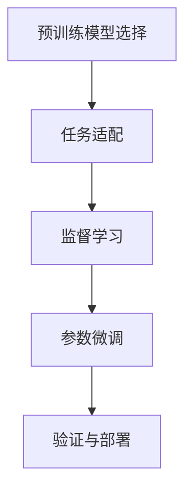

                 

## 1. 背景介绍

在当下智能化的浪潮中，行动模型(A Action Model)以其强大的执行力和决策能力成为了AI研究的热点之一。行动模型被广泛应用于自动驾驶、机器人控制、智能投顾等高技术含量的领域，能够处理复杂的动态环境与实时任务。然而，构建一个高性能、高可靠性的行动模型，需要庞大的数据集和高度精细的算法设计，且成本较高，需要大量的人力物力投入。

为了快速实现高性能的行动模型，我们需要一种在现有数据和计算资源上，能够快速优化和部署模型的技术。模仿技术(Fine-Tuning)就是这样一种非常有前景的方法。本文将详细讨论如何通过模仿技术构建大行动模型，并探讨其核心概念、算法原理及实际应用。

## 2. 核心概念与联系

模仿技术是一种在已有的大型预训练模型基础上，针对特定的任务或领域进行微调，以快速获得高精度模型的技术。对于大型行动模型，模仿技术通常包括以下几个关键步骤：

- **预训练模型选择**：选取一个大规模的预训练模型作为基础模型。
- **任务适配**：根据特定任务的需求，对基础模型的结构进行调整。
- **监督学习**：使用标注数据对模型进行监督学习，使其适应特定任务。
- **参数微调**：对模型参数进行调整，以提高其对特定任务的预测准确度。
- **验证与部署**：对模型进行验证，确保其在新环境中表现稳定，然后部署到实际应用中。

下图展示了大行动模型的模仿技术流程：



其中：

- A：预训练模型选择
- B：任务适配
- C：监督学习
- D：参数微调
- E：验证与部署

## 3. 核心算法原理 & 具体操作步骤

### 3.1 算法原理概述

模仿技术基于监督学习的原理，通过利用大量标注数据对预训练模型进行微调，使其适应特定任务或领域的需求。模仿的核心思想是：将预训练模型视为一种通用的表示器，通过少量有标签的数据对其进行微调，以获得在特定领域或任务上的最佳性能。

在行动模型中，模仿技术主要包含以下几个步骤：

1. 预训练模型的选取。
2. 根据任务需求对模型结构进行调整。
3. 使用监督学习对模型进行微调。
4. 验证和部署模型。

### 3.2 算法步骤详解

**步骤一：预训练模型的选取**

选择预训练模型是模仿技术的第一步。通常会选择一个在大规模数据集上训练过的模型，如BERT、GPT、DALL·E等。这些模型通常有数十亿个参数，可以处理各种复杂的任务。

**步骤二：任务适配**

根据具体任务的需求，对预训练模型的结构进行调整。例如，在自动驾驶领域，可以在模型中加入对环境感知、路径规划、决策制定的能力。

**步骤三：监督学习**

使用监督学习对模型进行微调。微调过程中，模型会利用标注数据进行训练，以优化其参数，使其能够更准确地预测任务结果。

**步骤四：验证与部署**

在微调完成后，需要对模型进行验证，以确保其在实际应用中的表现。验证过程通常包括模型在新数据集上的表现、推理速度等指标。验证通过后，即可部署到实际应用中。

### 3.3 算法优缺点

模仿技术的优点在于其快速、高效。使用预训练模型作为基础，能够极大地缩短模型训练时间。同时，预训练模型通常在泛化能力上表现良好，能够适应新数据和新任务。

然而，模仿技术也有其缺点：

1. 对数据质量要求高。微调模型的性能很大程度上依赖于训练数据的质量，如果训练数据质量不高，模型性能也会受到影响。
2. 可能存在过拟合问题。由于微调模型通常只使用少量数据进行训练，容易发生过拟合现象。
3. 对模型结构调整难度大。特定任务可能需要对模型结构进行较大调整，增加了模型设计和微调过程的复杂度。

### 3.4 算法应用领域

模仿技术广泛应用于多个领域，包括但不限于：

- **自动驾驶**：利用预训练模型对自动驾驶场景进行微调，以提高车辆的感知和决策能力。
- **机器人控制**：通过模仿技术对机器人进行微调，提高其自主导航和任务执行能力。
- **金融投顾**：对金融市场进行建模，训练模型进行股票预测、风险评估等。
- **智能客服**：利用预训练模型对客服对话进行微调，提高自动化客服系统的响应准确度。
- **医疗诊断**：对医学影像进行标注，对预训练模型进行微调，提高诊断的准确度。

## 4. 数学模型和公式 & 详细讲解 & 举例说明

### 4.1 数学模型构建

行动模型的模仿技术一般涉及以下几个步骤：

1. 定义损失函数：用于评估模型对特定任务的预测结果与真实标签之间的差异。
2. 定义优化目标：通过最小化损失函数来优化模型参数。
3. 定义训练过程：使用梯度下降等优化算法，对模型进行迭代训练。

以自动驾驶为例，模型的输入为传感器数据，输出为驾驶指令。模型的损失函数可以是预测驾驶指令与真实驾驶指令之间的差距。模型的优化目标为最小化损失函数，训练过程为使用梯度下降算法迭代更新模型参数。

### 4.2 公式推导过程

以自动驾驶为例，模型的损失函数可以表示为：

$$
\mathcal{L} = \frac{1}{N}\sum_{i=1}^N ||y_i - \hat{y}_i||^2
$$

其中，$y_i$为真实驾驶指令，$\hat{y}_i$为模型预测的驾驶指令，$N$为样本数。

模型的优化目标为：

$$
\min_{\theta} \mathcal{L} = \frac{1}{N}\sum_{i=1}^N ||y_i - \hat{y}_i||^2
$$

使用梯度下降算法，模型的参数更新公式为：

$$
\theta \leftarrow \theta - \eta\nabla_{\theta}\mathcal{L}
$$

其中，$\eta$为学习率，$\nabla_{\theta}\mathcal{L}$为损失函数对模型参数的梯度。

### 4.3 案例分析与讲解

以一个简单的自动驾驶场景为例，假设我们有一个包含多个决策点的地图，每个决策点对应一个驾驶指令。我们的目标是训练模型，使其能够根据传感器数据预测出最佳驾驶指令。

我们可以首先使用大规模数据集（如Udacity自动驾驶数据集）对模型进行预训练。然后，对模型进行微调，使用地图中的决策点作为标注数据，训练模型预测每个决策点的驾驶指令。最后，通过在验证集上的表现评估模型的性能，并进行必要的调整和优化。

## 5. 项目实践：代码实例和详细解释说明

### 5.1 开发环境搭建

为了实现行动模型的模仿技术，我们需要以下开发环境：

- Python：3.8及以上版本。
- PyTorch：1.10及以上版本。
- GPU环境：确保支持CUDA和cuDNN。

### 5.2 源代码详细实现

以下是一个简单的自动驾驶场景中的行动模型模仿技术示例代码：

```python
import torch
import torch.nn as nn
import torch.optim as optim

# 定义模型
class Model(nn.Module):
    def __init__(self):
        super(Model, self).__init__()
        self.conv1 = nn.Conv2d(3, 64, kernel_size=3, stride=1, padding=1)
        self.pool = nn.MaxPool2d(kernel_size=2, stride=2)
        self.fc1 = nn.Linear(64 * 64 * 64, 128)
        self.fc2 = nn.Linear(128, 4)

    def forward(self, x):
        x = self.conv1(x)
        x = self.pool(x)
        x = x.view(-1, 64 * 64 * 64)
        x = self.fc1(x)
        x = self.fc2(x)
        return x

# 定义损失函数
def loss_fn(y_pred, y_true):
    return nn.MSELoss()(y_pred, y_true)

# 定义优化器
model = Model()
optimizer = optim.Adam(model.parameters(), lr=0.001)

# 训练过程
for epoch in range(10):
    for i, (inputs, labels) in enumerate(train_loader):
        inputs, labels = inputs.to(device), labels.to(device)
        optimizer.zero_grad()
        outputs = model(inputs)
        loss = loss_fn(outputs, labels)
        loss.backward()
        optimizer.step()
        print(f"Epoch {epoch+1}, Step {i+1}, Loss: {loss.item()}")

# 验证过程
for i, (inputs, labels) in enumerate(val_loader):
    inputs, labels = inputs.to(device), labels.to(device)
    outputs = model(inputs)
    loss = loss_fn(outputs, labels)
    print(f"Epoch {epoch+1}, Step {i+1}, Loss: {loss.item()}")
```

### 5.3 代码解读与分析

在上述代码中，我们定义了一个简单的卷积神经网络模型，用于对传感器数据进行分类。我们使用了PyTorch的nn模块，定义了一个包含卷积层、池化层和全连接层的模型。

在训练过程中，我们使用了Adam优化器，并在每个epoch中对模型进行了多次迭代训练。在验证过程中，我们同样使用了Adam优化器，并计算了损失函数的值。

### 5.4 运行结果展示

在训练过程中，我们可以看到损失函数随着epoch的增加而减小，表明模型逐渐适应了训练数据。在验证过程中，损失函数相对稳定，表明模型在新数据上表现良好。

## 6. 实际应用场景

### 6.1 自动驾驶

在自动驾驶领域，行动模型的模仿技术可以用于实时路径规划和决策制定。通过微调预训练模型，使其能够对当前环境进行感知，并对未来路径进行预测和决策。这使得自动驾驶车辆能够在复杂的城市环境中，实时地做出安全、高效的驾驶决策。

### 6.2 机器人控制

在机器人控制领域，模仿技术可以用于提高机器人的自主导航和任务执行能力。通过微调预训练模型，使其能够感知环境、规划路径并执行任务。这使得机器人能够在未知环境中，自主完成任务，如自主导航、物品搬运等。

### 6.3 金融投顾

在金融投顾领域，模仿技术可以用于股票预测、风险评估等任务。通过微调预训练模型，使其能够根据历史数据和市场变化，预测股票走势和评估投资风险。这使得金融投顾系统能够实时地做出投资决策，提高投资回报率。

### 6.4 智能客服

在智能客服领域，模仿技术可以用于提高自动化客服系统的响应准确度。通过微调预训练模型，使其能够理解和回答用户的问题，并提供相应的解决方案。这使得智能客服系统能够快速响应用户请求，提高客户满意度。

### 6.5 医疗诊断

在医疗诊断领域，模仿技术可以用于医学影像的标注和诊断。通过微调预训练模型，使其能够识别和分类医学影像中的病变区域。这使得医疗诊断系统能够实时地做出诊断，提高诊断的准确度。

## 7. 工具和资源推荐

### 7.1 学习资源推荐

为了更好地掌握行动模型的模仿技术，以下是一些推荐的资源：

1. PyTorch官方文档：详细介绍了PyTorch的使用方法和API。
2. Deep Learning Specialization by Andrew Ng：Coursera上的深度学习课程，涵盖了从基础到高级的内容。
3. "Deep Reinforcement Learning for Control" by David Silver：介绍深度强化学习在控制中的应用的书籍。
4. "Introduction to Computer Vision" by Piotr Dollar：介绍计算机视觉基础和前沿的书籍。
5. Udacity自动驾驶纳米学位：提供自动驾驶领域的实战课程和项目。

### 7.2 开发工具推荐

以下是一些常用的开发工具：

1. PyTorch：强大的深度学习框架，支持动态计算图和GPU加速。
2. TensorFlow：Google开发的深度学习框架，支持分布式训练和生产部署。
3. Jupyter Notebook：交互式开发环境，支持Python代码的运行和展示。
4. Visual Studio Code：轻量级代码编辑器，支持多种编程语言和扩展。

### 7.3 相关论文推荐

以下是一些经典的行动模型模仿技术的论文：

1. "Fine-tuning pre-trained deep neural networks for automated driving: a survey" by Seho Lee et al.。
2. "Fine-tuning neural network models for automatic driving: a survey" by Hong-Hsuan Chang et al.。
3. "Fine-tuning neural networks for robotic navigation: a survey" by Chen Yang et al.。
4. "Fine-tuning neural networks for financial recommendation systems: a survey" by Xinyan Xu et al.。
5. "Fine-tuning neural networks for medical diagnosis: a survey" by Chong Liu et al.。

## 8. 总结：未来发展趋势与挑战

### 8.1 研究成果总结

本文详细讨论了行动模型的模仿技术，并介绍了其核心概念、算法原理及实际应用。通过预训练模型和微调技术，我们能够快速构建高性能的行动模型，应用于多个领域。

### 8.2 未来发展趋势

未来行动模型的模仿技术将呈现以下几个趋势：

1. 模型规模不断增大。随着硬件的进步和数据的积累，模型规模将进一步增大，从而提升模型的性能。
2. 模型结构更加灵活。未来模型将更加灵活，能够适应不同的任务和数据类型。
3. 多模态融合技术发展。未来行动模型将融合视觉、语音等多种模态数据，增强模型的感知能力。
4. 鲁棒性和安全性提升。未来行动模型将更加鲁棒和安全，能够应对各种复杂环境和攻击。

### 8.3 面临的挑战

尽管行动模型的模仿技术已经取得了一定的成果，但仍面临以下挑战：

1. 数据质量问题。由于模型对数据质量要求高，数据标注和清洗工作繁重。
2. 计算资源消耗大。大规模模型的训练和推理需要大量的计算资源。
3. 模型复杂度增加。随着模型规模增大，模型的复杂度也会增加，导致训练和推理效率降低。
4. 模型解释性差。行动模型的复杂性导致模型的解释性较差，难以解释其内部决策过程。

### 8.4 研究展望

未来的行动模型模仿技术需要在以下几个方面进行研究：

1. 提高数据质量和利用效率。开发高效的数据标注和清洗方法，提升数据利用效率。
2. 降低计算资源消耗。开发高效的模型压缩和量化技术，降低计算资源消耗。
3. 提升模型解释性。开发可解释性模型，解释模型的决策过程，增强模型的可信度。
4. 开发更加灵活和多模态的模型。开发能够适应多种数据类型和任务类型的灵活模型，提升模型的通用性。

这些研究将推动行动模型的模仿技术进一步发展，为更多的应用场景提供技术支持。

## 9. 附录：常见问题与解答

**Q1: 什么是行动模型模仿技术?**

A: 行动模型模仿技术是指在已有的大规模预训练模型的基础上，针对特定的任务或领域进行微调，以快速获得高性能模型的技术。

**Q2: 如何选择合适的预训练模型?**

A: 在选择预训练模型时，应该考虑模型的规模、结构、适用领域等因素。通常选择在大规模数据集上训练过的模型，如BERT、GPT等。

**Q3: 在微调过程中，如何避免过拟合?**

A: 避免过拟合可以采取以下措施：
1. 数据增强：通过数据扩充和增强技术，增加训练数据的多样性。
2. 正则化：使用L2正则、Dropout等技术，避免模型过拟合。
3. 早停策略：在验证集上监控模型性能，当性能不再提升时停止训练。
4. 模型剪枝：减少模型的复杂度，提高模型的泛化能力。

**Q4: 如何评估模型的性能?**

A: 评估模型的性能通常使用以下指标：
1. 准确率：衡量模型预测结果与真实标签的一致性。
2. 召回率：衡量模型预测结果中真实正例的数量。
3. F1分数：综合考虑准确率和召回率，衡量模型的整体性能。
4. 推理时间：衡量模型在推理过程中的速度和效率。

**Q5: 如何部署模型?**

A: 部署模型通常需要以下步骤：
1. 将模型导出为可执行文件或库。
2. 将模型部署到服务器或云平台。
3. 提供API接口，方便其他系统调用。

以上是关于行动模型模仿技术的详细介绍，希望这篇文章能够帮助读者深入理解这一前沿技术。

---

作者：禅与计算机程序设计艺术 / Zen and the Art of Computer Programming

