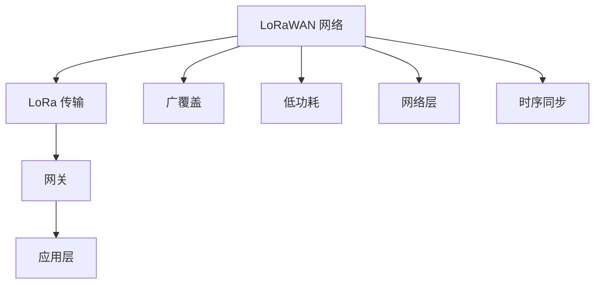

                 

# LoRaWAN：低功耗广域网络在IoT中的应用

## 1. 背景介绍

在当今物联网（IoT）日益增长的需求下，低功耗广域网络（LPWAN）正迅速崛起，成为IoT领域的重要组成部分。LoRaWAN作为一种广受关注的LPWAN技术，以其优异的低功耗特性和广覆盖能力，被广泛应用于智慧城市、农业、环境监测、智能家居等多个领域。本文将深入探讨LoRaWAN的核心概念、原理及其在IoT中的应用实践，为读者提供一个全面的技术理解。

## 2. 核心概念与联系

### 2.1 核心概念概述

LoRaWAN是一种基于LoRa（Long Range）技术的低功耗广域网络，旨在提供远距离、低功耗的无线通信解决方案。其主要特点包括：

- **广覆盖**：LoRaWAN可以覆盖10公里以上的范围，适用于郊区和农村等地理环境。
- **低功耗**：LoRa技术采用渐进式发送模式，能够在长时间内保持设备低功耗运行。
- **网络层**：LoRaWAN提供网络层支持，包括数据路由、设备管理、网络优化等功能。
- **时序同步**：LoRaWAN通过时间同步机制，保证设备间通信的准确性和一致性。

### 2.2 核心概念原理和架构的 Mermaid 流程图



此图展示了LoRaWAN的基本架构：设备通过LoRa技术发送数据到网关，网关负责数据集中、路由和发送，最终将数据传递给应用层。

### 2.3 LoRaWAN的网络架构

LoRaWAN网络架构主要由三个关键组件组成：

- **设备**：负责采集数据并通过LoRa技术发送到网关。
- **网关**：负责接收、集中和路由数据，以及与互联网的连接。
- **应用服务器**：处理网关传输的数据，并提供相应的业务应用。

这三个组件通过LoRaWAN协议进行通信，保证数据可靠、安全地传输。

## 3. 核心算法原理 & 具体操作步骤

### 3.1 算法原理概述

LoRaWAN的核心算法原理主要涉及以下几个方面：

- **LoRa物理层**：LoRaWAN利用LoRa技术实现远距离通信，通过LoRa调制解调器进行信号传输和接收。
- **帧结构**：LoRaWAN定义了特定的帧结构，包括数据帧、确认帧和命令帧等，用于不同场景的通信需求。
- **路由算法**：LoRaWAN网络中采用路由算法，如随机前向数据路由（Random Forward Data Routing），保证数据的可靠传输。
- **时序同步**：LoRaWAN通过时间同步算法，确保网络中所有设备时钟一致，避免数据传输延迟和错误。

### 3.2 算法步骤详解

LoRaWAN的工作流程包括以下几个关键步骤：

1. **设备通信**：设备采集数据，通过LoRa调制解调器进行编码和传输。
2. **网关接收**：网关接收来自设备的信号，并进行解码和集中。
3. **数据路由**：网关根据路由算法，选择最优路径将数据转发到应用服务器。
4. **数据处理**：应用服务器接收并处理网关传输的数据，提供相应的业务应用。

### 3.3 算法优缺点

**优点**：

- **低功耗**：LoRa技术天然具有低功耗特性，适用于电池供电的物联网设备。
- **广覆盖**：LoRaWAN能够覆盖广泛的地理区域，适合郊区和农村等环境。
- **高可靠性**：LoRaWAN网络采用路由算法和时序同步，保证数据传输的可靠性和一致性。

**缺点**：

- **带宽有限**：LoRaWAN的带宽相对较窄，可能导致数据传输速度较慢。
- **通信延迟**：由于长距离通信和复杂的路由过程，LoRaWAN的通信延迟可能较大。
- **安全性问题**：LoRaWAN网络需要额外的安全机制来保护数据隐私和完整性。

### 3.4 算法应用领域

LoRaWAN在物联网领域有着广泛的应用，主要包括以下几个领域：

- **智慧城市**：LoRaWAN被用于智慧城市中的各种传感器和监控设备，如智慧停车、智能交通、空气质量监测等。
- **农业**：LoRaWAN用于农业环境监测，如土壤湿度、温度、光照等数据的采集和传输。
- **环境监测**：LoRaWAN用于环境监测系统，如水质监测、大气污染监测等。
- **智能家居**：LoRaWAN用于智能家居设备的通信，如灯光控制、安防监控等。
- **物流追踪**：LoRaWAN用于物流追踪系统，实现货物位置的实时监控和管理。

## 4. 数学模型和公式 & 详细讲解 & 举例说明

### 4.1 数学模型构建

LoRaWAN的数学模型主要涉及以下几个方面：

- **信道模型**：LoRaWAN的信道模型包括多径衰落和阴影衰落等，用于描述信号在传播过程中的变化。
- **调制模型**：LoRaWAN采用LoRa调制技术，其数学模型包括带宽、调制指数、发射功率等参数。
- **路由算法**：LoRaWAN的路由算法可以通过数学模型来优化路由路径，保证数据传输的可靠性。

### 4.2 公式推导过程

以下推导LoRaWAN的信道模型公式：

设信号在自由空间传播的距离为 $d$，发射功率为 $P_t$，接收功率为 $P_r$，信号强度为 $I$，信道模型为 $H(d)$，则信号强度公式为：

$$
I = \frac{P_t}{G_t} \frac{G_r}{4\pi d^2} H(d) \exp(-\alpha d)
$$

其中 $G_t$ 和 $G_r$ 分别为发射和接收的天线增益，$\alpha$ 为衰减系数。

### 4.3 案例分析与讲解

以智慧城市中的智能交通为例，LoRaWAN用于交通信号灯和车辆的通信。假设信号灯采集到车流量数据，通过LoRaWAN发送给网关，网关将数据集中并路由到交通管理中心。通过数学模型，可以计算出信号强度和通信延迟，从而优化网络配置和数据传输路径。

## 5. 项目实践：代码实例和详细解释说明

### 5.1 开发环境搭建

LoRaWAN的开发环境搭建主要包括以下几个步骤：

1. 安装LoRaWAN协议栈软件，如TLoRaSim或OpenLora。
2. 配置LoRa网关，连接至LoRa云端平台，如ThingWorx。
3. 安装LoRa传感器和设备，如温湿度传感器和定位模块。
4. 搭建LoRaWAN应用服务器，处理数据和提供业务应用。

### 5.2 源代码详细实现

以下是一个简单的LoRaWAN应用示例，用于温度监测：

```python
import pyfirmata
from pyfirmata import Arduino

# 连接Arduino板
board = Arduino('/dev/ttyUSB0')

# 读取温度传感器数据
temperature = pyfirmata.analog(board, 0)
temperature_value = temperature.read()

# 发送数据到LoRa网关
board.digital[3].write(1)  # 发送数据

# 循环读取数据并发送
while True:
    temperature_value = temperature.read()
    print(f"Temperature: {temperature_value}°C")
    board.digital[3].write(1)  # 发送数据
```

### 5.3 代码解读与分析

该代码实现了一个简单的温度传感器，通过LoRa技术将温度数据发送到LoRa网关。代码使用了pyfirmata库，实现了对Arduino板的控制和数据读取。通过LoRa技术发送数据时，代码通过设置数字引脚状态来触发数据发送。

### 5.4 运行结果展示

运行该代码后，可以在控制台上看到温度数据的实时输出，同时LoRa网关会将数据转发到应用服务器进行处理。

## 6. 实际应用场景

### 6.1 智能交通

LoRaWAN在智能交通中有着广泛的应用，可以用于监控交通流量、采集交通数据，并进行实时分析和优化。例如，通过LoRaWAN采集的交通数据，交通管理中心可以预测交通拥堵情况，实时调整信号灯和路口，减少交通拥堵和事故发生率。

### 6.2 农业环境监测

LoRaWAN在农业中用于环境监测，可以采集土壤湿度、温度、光照等数据，并通过LoRaWAN网络传输到农业管理中心。管理员可以根据实时数据，进行精准农业管理和作物监测，提高农业生产效率和产品质量。

### 6.3 环境监测

LoRaWAN用于环境监测系统，可以采集水质、大气污染等数据，并通过LoRaWAN网络传输到环境监测中心。监测中心可以实时监控环境质量，及时发现和处理环境问题，保障生态环境安全。

### 6.4 智能家居

LoRaWAN在智能家居中用于设备通信，可以实现灯光控制、安防监控等功能。例如，智能门锁通过LoRaWAN将状态信息传输到手机应用，用户可以通过手机控制门锁，实现远程监控和报警。

## 7. 工具和资源推荐

### 7.1 学习资源推荐

1. LoRaWAN官方文档：LoRaWAN协议栈软件的官方文档，详细介绍了LoRaWAN的网络架构、协议规范和应用案例。
2. LoRaWAN白皮书：IoT技术白皮书，系统介绍了LoRaWAN的原理、应用场景和未来发展方向。
3. LoRaWAN在线课程：Coursera和edX等在线学习平台上提供的LoRaWAN课程，涵盖LoRaWAN的基本原理和实践技巧。

### 7.2 开发工具推荐

1. TLoRaSim：LoRaWAN协议栈软件，支持模拟和仿真，用于LoRaWAN网络的测试和验证。
2. OpenLora：开源LoRaWAN协议栈软件，支持LoRaWAN设备的开发和部署。
3. Arduino：广泛使用的单片机开发平台，支持LoRaWAN协议栈软件和LoRa传感器模块的集成。

### 7.3 相关论文推荐

1. LoRaWAN: A Long-Range Low-Power Wide-Area Network: The next generation for the Internet of Things: IoT 2019.
2. LoRaWAN-based PAMR IoT: Recent Advances and Opportunities: ComPUM 2019.
3. Low-Power and Wide-Coverage Wireless Networks for Internet of Things: Smart City, Industrial IoT and Environmental Monitoring: IoT 2018.

## 8. 总结：未来发展趋势与挑战

### 8.1 研究成果总结

LoRaWAN作为一种低功耗广域网络技术，在物联网领域具有广泛的应用前景。其优异的低功耗特性和广覆盖能力，使得LoRaWAN在智慧城市、农业、环境监测、智能家居等领域展现出强大的潜力。

### 8.2 未来发展趋势

LoRaWAN未来的发展趋势包括：

- **低功耗提升**：随着LoRa技术的发展，设备的低功耗特性将进一步提升，延长电池寿命，降低维护成本。
- **网络性能优化**：LoRaWAN协议和路由算法将不断优化，提升数据传输的可靠性和效率。
- **边缘计算集成**：LoRaWAN与边缘计算技术的结合，将进一步提升数据处理和分析的速度和效率。
- **安全性和隐私保护**：LoRaWAN将加强安全性措施，如加密技术、访问控制等，保障数据隐私和完整性。

### 8.3 面临的挑战

LoRaWAN面临的挑战包括：

- **带宽限制**：LoRaWAN的带宽限制可能导致数据传输速度较慢。
- **通信延迟**：LoRaWAN的通信延迟较大，影响实时性应用。
- **标准化问题**：LoRaWAN协议和设备的标准化仍需进一步完善，以支持更广泛的设备互操作性。

### 8.4 研究展望

未来LoRaWAN的研究方向包括：

- **多跳网络**：探索多跳网络技术，提升LoRaWAN的网络覆盖和可靠性。
- **混合网络**：研究LoRaWAN与Wi-Fi、5G等混合网络技术，实现数据传输的多样化和协同工作。
- **跨领域应用**：探索LoRaWAN在不同领域的应用场景，如医疗、物流等，扩大其应用范围。

## 9. 附录：常见问题与解答

**Q1: LoRaWAN的网络覆盖范围是多少？**

A: LoRaWAN的网络覆盖范围一般为10公里以上，适用于郊区和农村等地理环境。

**Q2: LoRaWAN的带宽是多少？**

A: LoRaWAN的带宽一般为250kHz至500kHz，因实际应用需求和设备类型而异。

**Q3: LoRaWAN的通信延迟是多少？**

A: LoRaWAN的通信延迟一般在几毫秒到几秒钟之间，具体取决于网络配置和路由路径。

**Q4: LoRaWAN的安全性措施有哪些？**

A: LoRaWAN的安全性措施包括设备认证、数据加密、访问控制等，保障数据隐私和完整性。

**Q5: LoRaWAN在智慧城市中的应用场景有哪些？**

A: LoRaWAN在智慧城市中的应用场景包括智能交通、智能停车、环境监测等。

作者：禅与计算机程序设计艺术 / Zen and the Art of Computer Programming

