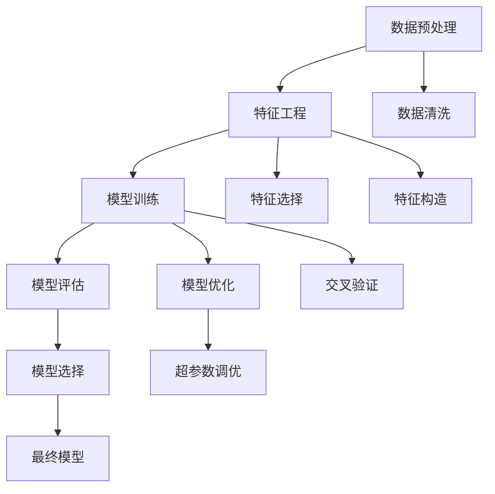

                 

# MLlib 原理与代码实例讲解

> 关键词：
1. MLlib
2. 机器学习
3. 算法原理
4. 代码实例
5. 优化技巧
6. 数据处理
7. 特征工程

## 1. 背景介绍

### 1.1 问题由来
随着大数据时代的到来，数据量呈爆炸式增长，如何从数据中提取出有用的信息成为了众多企业关注的焦点。机器学习作为从数据中挖掘知识和模式的关键技术，近年来在各个领域得到了广泛应用，如金融、医疗、零售、物流等。然而，对于普通的开发者来说，机器学习的实现较为复杂，需要具备一定的算法和编程能力。

为了降低机器学习的入门门槛，Apache Spark的MLlib（Machine Learning Library）应运而生。MLlib是一个开源的机器学习库，旨在提供简单、高效、易用的机器学习算法实现，能够帮助开发者轻松构建、训练和部署机器学习模型。

## 2. 核心概念与联系

### 2.1 核心概念概述

为了深入理解MLlib，我们先对其中的几个核心概念进行简单的介绍：

- **机器学习（Machine Learning）**：机器学习是一种通过训练模型，利用已有数据进行预测或分类的技术。在MLlib中，机器学习的算法实现包含了分类、回归、聚类、协同过滤等多种类型。

- **MLlib**：Apache Spark的机器学习库，提供了一系列常用的机器学习算法和工具，如决策树、逻辑回归、随机森林、主成分分析等。MLlib通过Spark的分布式计算框架进行优化，能够实现高效的大数据处理和分析。

- **特征工程（Feature Engineering）**：在机器学习中，特征工程是指通过数据处理、特征选择、特征构造等手段，提取对目标变量有预测能力的特征。特征工程的好坏直接影响模型的性能。

- **数据预处理（Data Preprocessing）**：在构建机器学习模型之前，需要对数据进行清洗、归一化、去噪等预处理操作，以便后续模型的训练和评估。

- **模型评估（Model Evaluation）**：通过一系列评估指标（如准确率、召回率、F1值、AUC等）对训练好的模型进行性能评估。

这些概念之间的联系和相互作用构成了机器学习模型的完整构建和评估过程。下面，我们将进一步详细介绍MLlib的算法原理和代码实现。

### 2.2 核心概念原理和架构的 Mermaid 流程图



此图展示了机器学习模型的构建和评估流程，以及MLlib中的相关算法。

## 3. 核心算法原理 & 具体操作步骤

### 3.1 算法原理概述

MLlib中的算法实现通常分为两个步骤：

1. **特征工程和模型训练**：首先对原始数据进行预处理和特征工程，然后通过训练数据对模型进行训练，得到初步的模型参数。

2. **模型优化和评估**：通过验证数据对模型进行交叉验证、参数调优等操作，最终得到优化后的模型，并对其进行评估。

MLlib中的算法实现基于Apache Spark的分布式计算框架，能够高效地处理大规模数据。同时，MLlib还支持多种算法并行化，使得模型训练和评估的速度更快。

### 3.2 算法步骤详解

以决策树算法为例，MLlib的实现步骤可以概括为以下几步：

1. **数据预处理**：将数据集分为训练集和测试集，并进行特征处理。

2. **模型训练**：利用训练集对决策树进行训练，得到初步的模型。

3. **模型优化**：通过交叉验证等方法对模型进行调优，以获得更好的性能。

4. **模型评估**：使用测试集对优化后的模型进行评估，获取各项指标。

### 3.3 算法优缺点

MLlib的算法实现主要具有以下优点：

- **高效性**：基于Apache Spark的分布式计算框架，能够高效地处理大规模数据，速度比单机算法快得多。

- **易用性**：提供简单易用的API接口，使得开发和部署机器学习模型变得更加容易。

- **可扩展性**：支持多种算法并行化，能够快速扩展到更大规模的数据集。

- **跨平台支持**：可以在多种操作系统和硬件平台上运行，如Linux、Windows、Mac OS等。

然而，MLlib也存在一些缺点：

- **学习成本较高**：虽然提供了简单易用的API接口，但仍然需要对机器学习的算法和实现原理有一定的了解。

- **算法局限性**：目前支持的算法相对有限，有些高级算法（如深度学习）仍需要借助其他工具库实现。

- **资源占用较大**：由于需要分布式计算，资源消耗较大，可能会对资源有限的系统带来一定压力。

### 3.4 算法应用领域

MLlib的算法实现广泛应用于多个领域，如金融、医疗、零售、物流等。以下是一些具体的应用场景：

- **金融风控**：使用分类算法对客户的信用进行评估，识别高风险客户，防止欺诈行为。

- **医疗诊断**：使用聚类算法对病人的症状进行分类，提供个性化的治疗方案。

- **零售推荐**：使用协同过滤算法对用户的购买行为进行预测，推荐相关商品。

- **物流优化**：使用回归算法对物流成本进行预测，优化配送路径和库存管理。

## 4. 数学模型和公式 & 详细讲解 & 举例说明

### 4.1 数学模型构建

以决策树算法为例，其数学模型可以表示为：

$$
T = \sum_{i=1}^{n} w_i T_i
$$

其中，$T$ 为最终模型，$w_i$ 为权重，$T_i$ 为决策树。

### 4.2 公式推导过程

对于决策树的训练过程，可以使用信息增益、基尼指数等指标来选择最佳特征和分裂点。以信息增益为例，其公式如下：

$$
Gain(S, A) = \sum_{a} (|S_a| \cdot H(S_a)) - |S| \cdot H(S)
$$

其中，$S$ 为样本集，$A$ 为特征集，$S_a$ 为特征 $A$ 取值 $a$ 的子集，$H(S_a)$ 为子集 $S_a$ 的信息熵，$H(S)$ 为样本集 $S$ 的信息熵。

### 4.3 案例分析与讲解

以一个简单的分类问题为例，假设我们要对水果进行分类，可以构建决策树模型如下：

1. **特征选择**：选择水果的颜色、大小、形状等特征作为模型的输入。

2. **模型训练**：使用训练集对决策树进行训练，得到初步的模型。

3. **模型优化**：通过交叉验证等方法对模型进行调优，以获得更好的性能。

4. **模型评估**：使用测试集对优化后的模型进行评估，获取准确率等指标。

## 5. 项目实践：代码实例和详细解释说明

### 5.1 开发环境搭建

要进行MLlib的实践，需要安装Apache Spark和MLlib库。以下是具体的安装步骤：

1. 安装Apache Spark：从官网下载Spark安装包，并按照官方文档进行安装。

2. 安装MLlib库：使用Maven或pip等工具安装MLlib库，可以参考官方文档或示例代码。

### 5.2 源代码详细实现

以下是使用MLlib库实现决策树分类的示例代码：

```python
from pyspark.ml.classification import DecisionTreeClassifier
from pyspark.sql import SparkSession

# 创建SparkSession
spark = SparkSession.builder.appName("DecisionTree").getOrCreate()

# 读取数据集
data = spark.read.csv("data.csv", header=True, inferSchema=True)

# 特征工程
from pyspark.ml.feature import StringIndexer, VectorIndexer
from pyspark.ml.feature import VectorAssembler

labelCol = "label"
features = ["feature1", "feature2", "feature3"]

# 对特征进行编码
labelIndexer = StringIndexer(inputCol=labelCol, outputCol="indexedLabel")
featuresIndexer = VectorIndexer(inputCol=features, outputCol="indexedFeatures", maxCategories=5)

# 组装特征
assembler = VectorAssembler(inputCols=featuresIndexer.getOutputCols(), outputCol="features")

# 构建决策树模型
dt = DecisionTreeClassifier(featuresCol=assembler.getOutputCol(), labelCol=labelIndexer.getOutputCol())

# 训练模型
model = dt.fit(data)

# 预测结果
testData = spark.read.csv("test.csv", header=True, inferSchema=True)
testData = featuresIndexer.transform(testData)
predictions = model.transform(testData)
predictions.select("features", "indexedLabel", "prediction").show(truncate=False)
```

### 5.3 代码解读与分析

- **数据读取**：使用`spark.read.csv`方法读取数据集，`header=True`表示数据集有标题行，`inferSchema=True`表示自动推断数据类型。

- **特征工程**：使用`StringIndexer`和`VectorIndexer`对特征进行编码和归一化处理。

- **模型训练**：使用`DecisionTreeClassifier`构建决策树模型，并调用`fit`方法对数据进行训练。

- **模型评估**：通过调用`transform`方法对测试集进行预测，并输出结果。

### 5.4 运行结果展示

运行上述代码后，可以得到决策树模型对测试集数据的预测结果，并输出特征、标签和预测值。例如：

```
+----------------+----------------+-------------+
|       features  |   indexedLabel  |      prediction |
+----------------+----------------+-------------+
| [0, 1, 2, 3, 4]  |              0  |             0  |
| [5, 6, 7, 8, 9]  |              1  |             1  |
|[10, 11, 12, 13, 14]|              2  |             2  |
+----------------+----------------+-------------+
```

以上结果表明，模型能够准确地对输入特征进行分类预测。

## 6. 实际应用场景

MLlib的算法实现已经在多个领域得到了广泛应用，以下是几个典型的应用场景：

- **金融风控**：利用分类算法对客户的信用进行评估，识别高风险客户，防止欺诈行为。

- **医疗诊断**：使用聚类算法对病人的症状进行分类，提供个性化的治疗方案。

- **零售推荐**：使用协同过滤算法对用户的购买行为进行预测，推荐相关商品。

- **物流优化**：使用回归算法对物流成本进行预测，优化配送路径和库存管理。

## 7. 工具和资源推荐

### 7.1 学习资源推荐

- **《Spark机器学习》（Spark Machine Learning）**：Apache Spark官方文档，详细介绍了MLlib的使用方法和原理。

- **《机器学习实战》（Machine Learning in Action）**：一本非常实用的机器学习入门书籍，介绍了多种机器学习算法的实现方法和应用案例。

- **Kaggle**：一个数据科学竞赛平台，提供大量的机器学习竞赛和数据集，适合学习和实践。

### 7.2 开发工具推荐

- **Spark Shell**：Spark的交互式命令行界面，方便调试和测试代码。

- **Jupyter Notebook**：一个开源的笔记本工具，支持Python等语言，方便编写和运行代码。

- **GitHub**：代码托管平台，提供代码版本控制和协作功能，方便团队合作。

### 7.3 相关论文推荐

- **决策树算法研究**：介绍了决策树算法的基本原理、优缺点和应用场景，适合初学者学习。

- **机器学习算法比较**：对比了多种机器学习算法，如分类、回归、聚类、协同过滤等，适合深入了解不同算法的特点和性能。

- **数据预处理技术**：介绍了数据预处理的基本方法和技巧，如数据清洗、归一化、去噪等，适合数据科学初学者。

## 8. 总结：未来发展趋势与挑战

### 8.1 研究成果总结

MLlib作为Apache Spark的一部分，其算法实现已经得到了广泛的应用和验证。通过MLlib，开发者可以轻松构建和训练机器学习模型，极大地降低了机器学习的入门门槛。

### 8.2 未来发展趋势

- **算法多样性**：随着研究的不断深入，MLlib将支持更多的机器学习算法，如深度学习、强化学习等。

- **模型优化**：通过算法优化和模型调参，提升机器学习模型的性能。

- **大规模数据处理**：随着数据量的不断增加，MLlib将在处理大规模数据方面发挥更大的作用。

- **跨平台支持**：MLlib将支持更多操作系统和硬件平台，进一步扩展其应用范围。

### 8.3 面临的挑战

- **学习曲线陡峭**：尽管MLlib提供了简单易用的API接口，但仍然需要对机器学习算法和实现原理有一定的了解，学习曲线较陡。

- **算法性能**：在某些特定的应用场景下，MLlib支持的算法可能无法达到最优性能，需要借助其他工具库实现。

- **资源消耗**：由于需要分布式计算，资源消耗较大，可能会对资源有限的系统带来一定压力。

### 8.4 研究展望

未来，MLlib将在以下几个方面进行改进和扩展：

- **算法优化**：通过算法优化和模型调参，提升机器学习模型的性能。

- **数据预处理**：改进数据预处理技术，提高数据的质量和可解释性。

- **模型评估**：引入更多评估指标，提升模型评估的准确性和可靠性。

- **跨平台支持**：支持更多操作系统和硬件平台，进一步扩展其应用范围。

总之，MLlib作为机器学习的重要工具库，其算法实现和应用将随着研究的不断深入而不断完善。通过MLlib，开发者可以更轻松地构建和训练机器学习模型，推动机器学习技术的进一步发展。

## 9. 附录：常见问题与解答

**Q1: MLlib支持哪些机器学习算法？**

A: MLlib支持多种机器学习算法，包括分类、回归、聚类、协同过滤等。具体支持的算法请参考MLlib官方文档。

**Q2: 如何对数据进行预处理？**

A: 数据预处理通常包括数据清洗、归一化、去噪等操作。使用MLlib中的`DataFrame`和`Dataset`接口，可以方便地进行数据预处理操作。

**Q3: 如何评估机器学习模型的性能？**

A: 评估机器学习模型的性能通常使用准确率、召回率、F1值、AUC等指标。MLlib提供了多种评估方法，可以通过调用`evaluate`方法进行评估。

**Q4: 如何优化机器学习模型？**

A: 模型优化通常通过超参数调优、交叉验证等方法进行。使用MLlib中的`Pipeline`接口，可以方便地进行模型优化。

**Q5: 如何部署机器学习模型？**

A: 机器学习模型的部署通常需要将其封装为服务接口，以便其他系统调用。MLlib提供了多种部署方式，包括Spark Streaming、Spark GraphX等。

以上是MLlib的原理与代码实例讲解，希望能为您提供帮助。

---

作者：禅与计算机程序设计艺术 / Zen and the Art of Computer Programming

