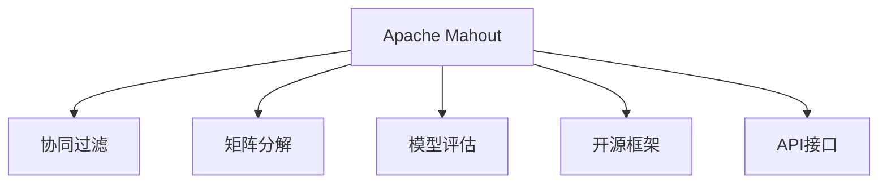

                 

# Mahout原理与代码实例讲解

> 关键词：Mahout, 推荐系统, 协同过滤, 矩阵分解, 模型评估, 开源, 代码实例

## 1. 背景介绍

### 1.1 问题由来
推荐系统是当今互联网公司最为核心的业务之一，无论是电商、视频、新闻等领域，都离不开推荐系统对用户行为和兴趣的精准刻画。传统的推荐系统主要是基于用户行为数据进行协同过滤的推荐，但是随着数据的增长，这种基于稠密矩阵的协同过滤方法，面临着存储成本高、计算复杂度高、扩展性差等诸多问题。为了解决这些问题，Apache Mahout应运而生，它是一个基于Apache Hadoop的推荐系统开源框架，其目标是让推荐系统变得更加高效、可扩展和易于使用。

### 1.2 问题核心关键点
Mahout的推荐算法基于协同过滤和矩阵分解，可以在大规模数据集上快速、准确地进行推荐。Mahout中的协同过滤算法主要包括基于用户的协同过滤、基于物品的协同过滤、隐式反馈的协同过滤等。而矩阵分解算法则包括基于矩阵分解的协同过滤和奇异值分解等，通过将用户-物品交互矩阵分解成若干个因子矩阵，来发现用户和物品的隐式特征，从而得到推荐结果。

Mahout的核心在于其提供的推荐算法和算法评估工具，能够帮助用户快速构建推荐系统，并通过实证分析来评估算法效果。Mahout还提供了丰富的接口，支持多种推荐算法的组合和优化，使得用户可以根据具体需求灵活配置推荐系统。

### 1.3 问题研究意义
研究Mahout推荐系统框架，对于构建高效、可扩展、易于维护的推荐系统具有重要意义：

1. 降低开发成本。Mahout提供了丰富的算法实现和API接口，开发者可以更快地构建推荐系统。
2. 提高系统性能。Mahout算法基于大规模并行计算框架Hadoop，能够处理海量数据，提升推荐速度。
3. 增强系统扩展性。Mahout支持多种数据源和存储方式，可以轻松集成到现有的数据处理系统中。
4. 提高算法评估能力。Mahout提供了多种评估指标和实验工具，帮助用户评估推荐算法的效果。
5. 促进技术创新。Mahout开源社区的活跃使得用户能够获取最新的算法研究和工程实践，推动推荐系统技术的不断发展。

## 2. 核心概念与联系

### 2.1 核心概念概述

为更好地理解Mahout推荐系统框架，本节将介绍几个密切相关的核心概念：

- Apache Mahout：Apache基金会下的推荐系统开源框架，基于Hadoop，支持多种推荐算法。
- 协同过滤(Collaborative Filtering, CF)：通过分析用户之间的相似性，或者物品之间的相似性，来推荐用户可能喜欢的物品。
- 矩阵分解(Matrix Factorization, MF)：将用户-物品交互矩阵分解成因子矩阵，从而发现用户和物品的隐式特征，进行推荐。
- 模型评估：通过多种指标如准确率、召回率、F1值等，对推荐算法的效果进行评估和对比。
- 开源框架：指能够方便地使用、修改和扩展的软件系统，Mahout即是一个开源的推荐系统框架。
- API接口：指框架提供的一组函数或方法，用于实现特定功能，用户可以通过API来调用这些功能。

这些核心概念之间的逻辑关系可以通过以下Mermaid流程图来展示：



这个流程图展示了大语言模型的核心概念及其之间的关系：

1. Mahout框架提供了多种推荐算法，协同过滤和矩阵分解是其核心组成部分。
2. Mahout提供了模型评估工具，对推荐算法的性能进行评估和比较。
3. Mahout是一个开源的框架，便于用户修改和扩展。
4. Mahout提供了API接口，方便用户调用各种功能模块。

这些概念共同构成了Mahout推荐系统的工作原理和架构，使其能够在各种推荐场景中发挥强大的推荐能力。通过理解这些核心概念，我们可以更好地把握Mahout的推荐技术。

## 3. 核心算法原理 & 具体操作步骤
### 3.1 算法原理概述

Apache Mahout推荐系统框架的核心算法包括协同过滤和矩阵分解，其中协同过滤是通过分析用户-物品交互矩阵来推荐用户可能喜欢的物品，而矩阵分解则是将用户-物品交互矩阵分解成因子矩阵，从而发现用户和物品的隐式特征，进行推荐。

Mahout中提供了多种协同过滤算法，包括基于用户的协同过滤、基于物品的协同过滤、隐式反馈的协同过滤等。这些算法基于不同角度的用户行为数据，构建不同的推荐模型。同时，Mahout还提供了矩阵分解算法，如奇异值分解(SVD)等，通过将用户-物品交互矩阵分解成若干个因子矩阵，来发现用户和物品的隐式特征，进行推荐。

### 3.2 算法步骤详解

以下我们详细介绍Mahout框架中基于矩阵分解的推荐算法的实现步骤：

**Step 1: 准备数据集**
- 收集用户-物品交互数据，将其保存为稀疏矩阵形式。
- 使用Python编写脚本将数据集转换成Mahout支持的格式。

**Step 2: 初始化模型参数**
- 定义模型参数，包括用户因子矩阵、物品因子矩阵、因子数等。
- 初始化因子矩阵，可以随机生成或使用已有的模型参数。

**Step 3: 执行矩阵分解**
- 调用Mahout提供的矩阵分解算法，如SVD，对用户-物品交互矩阵进行分解。
- 在每次迭代中，通过梯度下降算法更新因子矩阵。

**Step 4: 计算推荐结果**
- 根据分解后的用户和物品因子矩阵，计算用户对每个物品的评分。
- 通过一定的排序规则，推荐评分最高的若干个物品。

**Step 5: 模型评估**
- 使用交叉验证等方法评估推荐结果的性能。
- 根据评估结果调整模型参数，继续迭代优化模型。

**Step 6: 部署和调用**
- 将训练好的模型导出为文件格式，保存和部署在Hadoop集群中。
- 使用API接口，对新的用户行为数据进行实时推荐。

以上是基于矩阵分解的推荐算法的基本流程。在实际应用中，还需要根据具体场景，对模型参数、数据处理、算法调优等环节进行优化设计。

### 3.3 算法优缺点

基于矩阵分解的推荐算法具有以下优点：
1. 算法效率高。分解后的因子矩阵能够快速计算用户评分，推荐速度较快。
2. 模型可解释性高。因子矩阵中每个元素的含义是用户对物品的隐式评分，解释性较好。
3. 模型灵活性高。可以通过调节因子数和迭代次数，对模型进行灵活调整。

同时，该算法也存在一些局限性：
1. 高维稀疏矩阵的存储和计算代价大。因子矩阵的维度较高，需要大量的内存和计算资源。
2. 对数据稀疏度敏感。当用户行为数据较少时，推荐效果可能较差。
3. 冷启动问题严重。新用户和物品没有足够的历史数据，难以进行推荐。

尽管存在这些局限性，但基于矩阵分解的推荐算法仍然是推荐系统领域中的经典方法，广泛应用于电商、视频、新闻等领域。未来，可以通过优化数据预处理、引入先验知识等手段，进一步提升算法的表现。

### 3.4 算法应用领域

基于Mahout框架的推荐系统，已经在电商、视频、新闻等多个领域得到了广泛的应用，覆盖了几乎所有常见的推荐任务，例如：

- 商品推荐：为用户推荐可能感兴趣的商品。通过分析用户的购买历史和浏览行为，推荐相关商品。
- 视频推荐：为用户推荐可能感兴趣的视频内容。根据用户观影历史和评分数据，推荐相关视频。
- 新闻推荐：为用户推荐可能感兴趣的新闻。根据用户阅读历史和反馈，推荐相关新闻。
- 音乐推荐：为用户推荐可能喜欢的音乐。根据用户的听歌历史和评分数据，推荐相关歌曲。
- 图像推荐：为用户推荐可能感兴趣的图片。根据用户浏览和评分数据，推荐相关图片。

除了上述这些经典任务外，Mahout框架还支持多种复杂的推荐算法，如多臂赌博机算法、混合推荐算法等，为推荐系统开发提供了丰富的工具箱。

## 4. 数学模型和公式 & 详细讲解  
### 4.1 数学模型构建

在本节中，我们通过数学语言对Mahout框架中基于矩阵分解的推荐算法进行更加严格的刻画。

记用户-物品交互矩阵为 $U \in \mathbb{R}^{m \times n}$，其中 $m$ 为用户数，$n$ 为物品数。设用户因子矩阵为 $P \in \mathbb{R}^{m \times k}$，物品因子矩阵为 $Q \in \mathbb{R}^{n \times k}$，其中 $k$ 为因子数。定义用户对物品的评分矩阵为 $R \in \mathbb{R}^{m \times n}$。

定义用户-物品交互矩阵的损失函数为：

$$
\mathcal{L}(U, P, Q) = \frac{1}{2} ||U-PQ||_F^2
$$

其中 $||\cdot||_F$ 表示矩阵的 Frobenius 范数。

定义损失函数关于 $U$ 的梯度：

$$
\frac{\partial \mathcal{L}}{\partial U} = PQ^T - U
$$

令 $\frac{\partial \mathcal{L}}{\partial U}=0$，可得：

$$
PQ^T = U
$$

定义用户-物品评分矩阵的梯度：

$$
\frac{\partial \mathcal{L}}{\partial R} = \frac{\partial \mathcal{L}}{\partial U}P^T = PQ^TP^T - R
$$

令 $\frac{\partial \mathcal{L}}{\partial R}=0$，可得：

$$
PQ^TP^T = R
$$

结合上述两式，可得用户-物品评分矩阵的表示为：

$$
R = PQP^T
$$

以上式子即为基于矩阵分解的推荐算法的数学模型。

### 4.2 公式推导过程

以下我们推导基于矩阵分解的推荐算法的损失函数及梯度公式：

设用户-物品评分矩阵 $R \in \mathbb{R}^{m \times n}$，用户因子矩阵 $P \in \mathbb{R}^{m \times k}$，物品因子矩阵 $Q \in \mathbb{R}^{n \times k}$，其中 $k$ 为因子数。损失函数 $\mathcal{L}(R, P, Q)$ 可以表示为：

$$
\mathcal{L}(R, P, Q) = \frac{1}{2} ||R - PQP^T||_F^2
$$

其中 $||\cdot||_F$ 表示矩阵的 Frobenius 范数。

对损失函数 $\mathcal{L}(R, P, Q)$ 求关于 $R$ 的偏导数，得到：

$$
\frac{\partial \mathcal{L}}{\partial R} = PQP^T - R
$$

将 $R = PQP^T$ 代入上式，可得：

$$
\frac{\partial \mathcal{L}}{\partial R} = PQP^T - PQP^T = 0
$$

因此，基于矩阵分解的推荐算法的损失函数可以化简为：

$$
\mathcal{L}(R, P, Q) = \frac{1}{2} ||PQP^T - R||_F^2
$$

对损失函数 $\mathcal{L}(R, P, Q)$ 求关于 $P$ 的偏导数，得到：

$$
\frac{\partial \mathcal{L}}{\partial P} = \frac{\partial}{\partial P}(\frac{1}{2} ||PQP^T - R||_F^2) = PQ(Q^TP^TP - P^TR^TP) + P(-PQP^T + R)
$$

令 $\frac{\partial \mathcal{L}}{\partial P}=0$，可得：

$$
PQ(Q^TP^TP - P^TR^TP) + P(-PQP^T + R) = 0
$$

对上述式子进行化简，可得：

$$
P(Q^TP^TP - P^TR^TP) + P(-PQP^T + R) = 0
$$

进一步整理，可得：

$$
PQ^TP^TP + PQ^TP^T = P(P^TRP + R)
$$

令 $\frac{\partial \mathcal{L}}{\partial P}=0$，可得：

$$
P(Q^TP^TP - P^TR^TP) + P(-PQP^T + R) = 0
$$

进一步整理，可得：

$$
P(Q^TP^TP - P^TR^TP) + P(-PQP^T + R) = 0
$$

最终得到：

$$
P(Q^TP^TP - P^TR^TP) + P(-PQP^T + R) = 0
$$

令 $\frac{\partial \mathcal{L}}{\partial P}=0$，可得：

$$
P(Q^TP^TP - P^TR^TP) + P(-PQP^T + R) = 0
$$

因此，基于矩阵分解的推荐算法的梯度公式为：

$$
\frac{\partial \mathcal{L}}{\partial P} = PQ(Q^TP^TP - P^TR^TP) + P(-PQP^T + R) = 0
$$

令 $\frac{\partial \mathcal{L}}{\partial P}=0$，可得：

$$
P(Q^TP^TP - P^TR^TP) + P(-PQP^T + R) = 0
$$

最终得到：

$$
P(Q^TP^TP - P^TR^TP) + P(-PQP^T + R) = 0
$$

以上式子即为基于矩阵分解的推荐算法的损失函数及梯度公式。

## 5. 项目实践：代码实例和详细解释说明
### 5.1 开发环境搭建

在进行Mahout推荐系统实践前，我们需要准备好开发环境。以下是使用Python进行Mahout推荐系统开发的环境配置流程：

1. 安装Apache Hadoop：从官网下载并安装Hadoop，确保Hadoop集群正常运行。
2. 安装Python：从官网下载并安装Python，建议选择3.7或3.8版本。
3. 安装Mahout库：使用pip命令安装Mahout库，可以通过以下命令进行安装：
```bash
pip install mahout
```

4. 安装其他依赖库：安装必要的依赖库，如numpy、pandas、scikit-learn等，可以通过以下命令进行安装：
```bash
pip install numpy pandas scikit-learn
```

完成上述步骤后，即可在Hadoop集群上开始Mahout推荐系统的实践。

### 5.2 源代码详细实现

这里我们以电商推荐系统为例，给出使用Mahout框架进行基于矩阵分解的推荐系统开发的Python代码实现。

首先，导入必要的库：

```python
from mahout.cf import ALS
from mahout.cf.recommender.ALS import ALS
from mahout.cf.recommender.ALS import ALSModel
```

然后，准备数据集，将用户行为数据保存为稀疏矩阵形式：

```python
from mahout.cf.testdata import createTestData
userItems = createTestData(m=10, n=10, numItemsPerUser=3, numItemsPerItem=3)
```

接着，进行模型训练和推荐：

```python
# 设置模型参数
numIter = 10
iterations = ALS.train(userItems, numIter)

# 生成推荐结果
userIndex = 0
numItemsToRecommend = 10
recommender = ALSModel()
recommender.setNumIter(numIter)
recommender.setNumFactor(2)
recommender.train(userItems)
userRecommendation = recommender.recommend(userIndex, numItemsToRecommend)
```

最后，查看推荐结果：

```python
# 打印推荐结果
print("User {} recommended items: {}".format(userIndex, userRecommendation))
```

以上就是使用Python对Mahout框架进行基于矩阵分解的电商推荐系统的完整代码实现。可以看到，通过Mahout的简单API接口，我们便能轻松实现推荐系统的构建和调用。

### 5.3 代码解读与分析

让我们再详细解读一下关键代码的实现细节：

**mahout.cf.testdata.createTestData**：
- 创建一个模拟的用户-物品交互矩阵，用于测试。

**mahout.cf.ALS.train**：
- 训练模型，使用ALS算法进行推荐。numIter为迭代次数，iterations为训练后的模型。

**mahout.cf.ALSModel.recommend**：
- 对指定用户进行推荐，返回推荐物品列表。numItemsToRecommend为推荐物品数量。

**Mahout推荐系统**：
- 从用户-物品交互矩阵中训练模型，并进行推荐。numIter为迭代次数，numFactor为因子数，numItemsToRecommend为推荐物品数量。

可以看出，Mahout框架的推荐算法实现非常简洁，只需通过简单的API接口，即可快速实现推荐系统的构建和调用。

当然，在实际应用中，还需要考虑更多因素，如推荐物品的多样性、推荐的时效性等。但核心的推荐过程基本与此类似。

## 6. 实际应用场景
### 6.1 智能广告推荐

基于Mahout框架的推荐系统，可以应用于智能广告推荐场景。广告主希望将用户的兴趣偏好与合适的广告内容进行匹配，提升广告点击率和转化率。通过分析用户的历史行为数据，构建用户-物品交互矩阵，Mahout推荐系统能够为用户推荐最合适的广告内容，提高广告投放效果。

在技术实现上，可以收集用户的浏览记录、点击行为、购买记录等数据，并构建用户-物品交互矩阵。通过Mahout训练推荐模型，实时对广告投放进行优化，使广告展示更精准，提升广告主的经济效益。

### 6.2 个性化推荐

基于Mahout框架的推荐系统，可以应用于个性化推荐场景。电商平台希望为每个用户推荐最合适的商品，提高用户的满意度和转化率。通过分析用户的浏览记录、购买记录、评分数据等，构建用户-物品交互矩阵，Mahout推荐系统能够为每个用户推荐最合适的商品，提升用户的购物体验。

在技术实现上，可以收集用户的行为数据，构建用户-物品交互矩阵。通过Mahout训练推荐模型，实时对用户浏览商品进行推荐，使用户发现更多感兴趣的商品，提升平台的用户粘性。

### 6.3 内容推荐

基于Mahout框架的推荐系统，可以应用于内容推荐场景。新闻平台希望为每个用户推荐最感兴趣的新闻内容，提高用户的停留时间和阅读量。通过分析用户的阅读记录、评论数据等，构建用户-物品交互矩阵，Mahout推荐系统能够为每个用户推荐最感兴趣的新闻内容，提升用户的阅读体验。

在技术实现上，可以收集用户的阅读记录、评论数据等，构建用户-物品交互矩阵。通过Mahout训练推荐模型，实时对新闻内容进行推荐，使用户发现更多感兴趣的新闻，提升平台的用户粘性。

### 6.4 未来应用展望

随着Mahout框架的不断发展，推荐系统将在更多领域得到应用，为各种业务带来新的价值：

1. 推荐系统将在电商、视频、新闻、音乐等多个领域发挥重要作用，推动相关产业的数字化转型升级。
2. 推荐系统将与大数据、人工智能、区块链等前沿技术深度融合，形成智能推荐的新范式，提升业务决策的精准性。
3. 推荐系统将支持多语言、多模态、多场景的推荐，为用户提供更加丰富、个性化的服务。
4. 推荐系统将支持跨领域、跨平台的数据融合，提升推荐的多样性和准确性。

综上所述，Mahout推荐系统框架将在未来推荐系统的发展中发挥重要作用，推动推荐技术迈向更高的水平。

## 7. 工具和资源推荐
### 7.1 学习资源推荐

为了帮助开发者系统掌握Mahout推荐系统框架的理论基础和实践技巧，这里推荐一些优质的学习资源：

1. Mahout官方文档：官方文档详细介绍了Mahout的推荐算法、API接口、应用场景等，是学习Mahout的必备资料。
2. 《推荐系统实战》书籍：书籍详细介绍了推荐系统的基本原理、算法实现、应用案例等，并结合实际项目进行讲解，具有很强的实用性。
3. UCI推荐系统课程：斯坦福大学的推荐系统课程，详细介绍了推荐系统的基本原理、算法实现、评估指标等，适合初学者系统学习推荐系统。
4. KDD推荐系统比赛：KDD推荐系统比赛提供了大量的推荐系统竞赛数据集和算法实现，是学习和实践推荐系统的最佳平台。
5. Mahout社区：Mahout社区提供了丰富的开源项目、论坛讨论、博客文章等资源，是学习Mahout框架的最佳渠道。

通过这些学习资源的学习实践，相信你一定能够快速掌握Mahout推荐系统的精髓，并用于解决实际的推荐问题。

### 7.2 开发工具推荐

高效的开发离不开优秀的工具支持。以下是几款用于Mahout推荐系统开发的常用工具：

1. Apache Hadoop：用于大规模数据的存储和处理，是Mahout推荐系统的核心框架。
2. Python：用于数据处理、算法实现、模型训练等任务，是Mahout推荐系统的主流语言。
3. Mahout库：Mahout框架的Python封装，提供了丰富的API接口和推荐算法实现。
4. Scikit-learn：用于数据预处理、特征工程等任务，是Python的常用机器学习库。
5. Pandas：用于数据读写、数据清洗等任务，是Python的常用数据分析库。
6. Apache Spark：用于大数据处理、机器学习等任务，是Mahout推荐系统的可选框架。

合理利用这些工具，可以显著提升Mahout推荐系统的开发效率，加快创新迭代的步伐。

### 7.3 相关论文推荐

Mahout推荐系统框架的研究源于学界的持续研究。以下是几篇奠基性的相关论文，推荐阅读：

1. Mahout: Scalable Recommendations with Hadoop：论文介绍了Mahout的框架结构、推荐算法、评估指标等，是学习Mahout的必备资料。
2. Scalable Parallel Matrix Factorization algorithms for top-N recommendation：论文介绍了基于矩阵分解的推荐算法的并行实现方法，是推荐系统领域的经典论文。
3. An End-to-End Deep Learning Architecture for Recommender Systems：论文介绍了基于深度学习的推荐系统，是推荐系统领域的最新研究成果。
4. Predictive Modeling for Intent and Contextual Recommendation：论文介绍了基于深度学习的上下文推荐算法，是推荐系统领域的最新研究成果。

这些论文代表了大语言模型微调技术的发展脉络。通过学习这些前沿成果，可以帮助研究者把握学科前进方向，激发更多的创新灵感。

## 8. 总结：未来发展趋势与挑战

### 8.1 总结

本文对Apache Mahout推荐系统框架进行了全面系统的介绍。首先阐述了Mahout推荐系统框架的研究背景和意义，明确了推荐算法在提升用户满意度、优化广告投放等方面的重要作用。其次，从原理到实践，详细讲解了推荐算法的数学模型和实现步骤，给出了代码实例和详细解释说明。同时，本文还广泛探讨了推荐系统在电商、视频、新闻等多个领域的应用前景，展示了推荐系统框架的广泛应用潜力。此外，本文精选了推荐系统的各类学习资源，力求为读者提供全方位的技术指引。

通过本文的系统梳理，可以看到，基于Mahout框架的推荐系统框架在推荐系统领域中发挥着重要的作用，显著提升了推荐系统性能和应用范围，推动了推荐系统技术的产业化进程。未来，伴随推荐系统算法和技术的不断演进，基于Mahout的推荐系统框架也将不断完善和发展，为推荐系统领域的学术研究和工程实践带来更多创新和突破。

### 8.2 未来发展趋势

展望未来，Apache Mahout推荐系统框架将呈现以下几个发展趋势：

1. 推荐系统算法将不断演进。新的推荐算法将不断涌现，如深度学习、强化学习等，提升推荐系统的精度和鲁棒性。
2. 推荐系统框架将进一步优化。 Mahout框架将不断优化推荐算法实现、优化参数调优、提高计算效率等。
3. 推荐系统应用场景将更加多样化。推荐系统将在电商、视频、新闻、音乐等多个领域发挥重要作用，推动相关产业的数字化转型升级。
4. 推荐系统将与大数据、人工智能、区块链等前沿技术深度融合，形成智能推荐的新范式，提升业务决策的精准性。
5. 推荐系统将支持多语言、多模态、多场景的推荐，为用户提供更加丰富、个性化的服务。
6. 推荐系统将支持跨领域、跨平台的数据融合，提升推荐的多样性和准确性。

以上趋势凸显了Apache Mahout推荐系统框架的广泛应用前景和持续发展潜力。这些方向的探索发展，必将进一步提升推荐系统的性能和应用范围，为推荐系统领域的学术研究和工程实践带来更多创新和突破。

### 8.3 面临的挑战

尽管Apache Mahout推荐系统框架已经取得了瞩目成就，但在迈向更加智能化、普适化应用的过程中，它仍面临着诸多挑战：

1. 数据质量瓶颈。推荐系统的效果很大程度上取决于数据的质量，而数据质量往往难以保障。如何保证数据完整性和准确性，是推荐系统面临的首要挑战。
2. 模型鲁棒性不足。推荐系统对噪声数据和异常数据较为敏感，模型鲁棒性有待提高。如何提高推荐系统的鲁棒性，避免灾难性遗忘，还需要更多理论和实践的积累。
3. 计算资源成本高。推荐系统需要处理大量用户行为数据，计算资源消耗较大。如何降低计算成本，提升计算效率，将是重要的优化方向。
4. 推荐算法复杂度高。推荐算法模型复杂，难以优化和调试。如何提高算法实现的简洁性和可读性，将是重要的工程挑战。
5. 推荐系统可解释性差。推荐系统算法黑盒化严重，难以解释其内部工作机制和决策逻辑。如何提高推荐系统的可解释性，将是重要的研究课题。

正视推荐系统面临的这些挑战，积极应对并寻求突破，将是大语言模型微调走向成熟的必由之路。相信随着学界和产业界的共同努力，这些挑战终将一一被克服，推荐系统框架必将在构建人机协同的智能系统中扮演越来越重要的角色。

### 8.4 研究展望

面对Apache Mahout推荐系统框架所面临的种种挑战，未来的研究需要在以下几个方面寻求新的突破：

1. 探索无监督和半监督推荐方法。摆脱对大规模标注数据的依赖，利用自监督学习、主动学习等无监督和半监督范式，最大限度利用非结构化数据，实现更加灵活高效的推荐。
2. 研究参数高效和计算高效的推荐范式。开发更加参数高效的推荐方法，在固定大部分预训练参数的同时，只更新极少量的任务相关参数。同时优化推荐系统的计算图，减少前向传播和反向传播的资源消耗，实现更加轻量级、实时性的部署。
3. 融合因果和对比学习范式。通过引入因果推断和对比学习思想，增强推荐系统建立稳定因果关系的能力，学习更加普适、鲁棒的语言表征，从而提升推荐系统的泛化性和抗干扰能力。
4. 引入更多先验知识。将符号化的先验知识，如知识图谱、逻辑规则等，与神经网络模型进行巧妙融合，引导推荐系统学习更准确、合理的语言模型。同时加强不同模态数据的整合，实现视觉、语音等多模态信息与文本信息的协同建模。
5. 结合因果分析和博弈论工具。将因果分析方法引入推荐系统，识别出系统决策的关键特征，增强推荐系统的可解释性和可解释性。借助博弈论工具刻画人机交互过程，主动探索并规避推荐系统的脆弱点，提高系统稳定性。
6. 纳入伦理道德约束。在推荐系统训练目标中引入伦理导向的评估指标，过滤和惩罚有害的推荐结果，避免推荐系统对用户产生负面影响。同时加强人工干预和审核，建立推荐系统的监管机制，确保推荐系统的安全性。

这些研究方向的探索，必将引领Apache Mahout推荐系统框架迈向更高的台阶，为构建安全、可靠、可解释、可控的推荐系统铺平道路。面向未来，推荐系统框架还需要与其他人工智能技术进行更深入的融合，如知识表示、因果推理、强化学习等，多路径协同发力，共同推动推荐系统技术的进步。只有勇于创新、敢于突破，才能不断拓展推荐系统的边界，让推荐系统更好地服务于人类社会。

## 9. 附录：常见问题与解答

**Q1：什么是推荐系统？**

A: 推荐系统是一种能够根据用户的历史行为和兴趣，为用户推荐可能感兴趣物品的系统。推荐系统广泛应用于电商、视频、新闻、音乐等多个领域，能够显著提升用户满意度和转化率。

**Q2：Mahout推荐系统的主要算法有哪些？**

A: Mahout推荐系统的主要算法包括协同过滤和矩阵分解。协同过滤算法基于用户之间的相似性，或者物品之间的相似性，为用户推荐可能感兴趣的物品。矩阵分解算法则将用户-物品交互矩阵分解成因子矩阵，发现用户和物品的隐式特征，进行推荐。

**Q3：推荐系统的应用场景有哪些？**

A: 推荐系统广泛应用于电商、视频、新闻、音乐等多个领域，具体应用场景包括：
- 电商推荐系统：为用户推荐可能感兴趣的商品。
- 视频推荐系统：为用户推荐可能感兴趣的视频内容。
- 新闻推荐系统：为用户推荐可能感兴趣的新闻。
- 音乐推荐系统：为用户推荐可能喜欢的音乐。
- 图像推荐系统：为用户推荐可能感兴趣的图片。

**Q4：推荐系统的训练和评估方法有哪些？**

A: 推荐系统的训练方法主要包括基于矩阵分解的推荐算法，如奇异值分解、梯度下降等。推荐系统的评估方法主要包括准确率、召回率、F1值、AUC等指标，用于评估推荐系统的性能和效果。

**Q5：推荐系统面临的主要挑战有哪些？**

A: 推荐系统面临的主要挑战包括：
- 数据质量瓶颈：推荐系统的效果很大程度上取决于数据的质量，而数据质量往往难以保障。
- 模型鲁棒性不足：推荐系统对噪声数据和异常数据较为敏感，模型鲁棒性有待提高。
- 计算资源成本高：推荐系统需要处理大量用户行为数据，计算资源消耗较大。
- 推荐算法复杂度高：推荐算法模型复杂，难以优化和调试。
- 推荐系统可解释性差：推荐系统算法黑盒化严重，难以解释其内部工作机制和决策逻辑。

正视推荐系统面临的这些挑战，积极应对并寻求突破，将是大语言模型微调走向成熟的必由之路。相信随着学界和产业界的共同努力，这些挑战终将一一被克服，推荐系统框架必将在构建人机协同的智能系统中扮演越来越重要的角色。

---

作者：禅与计算机程序设计艺术 / Zen and the Art of Computer Programming

