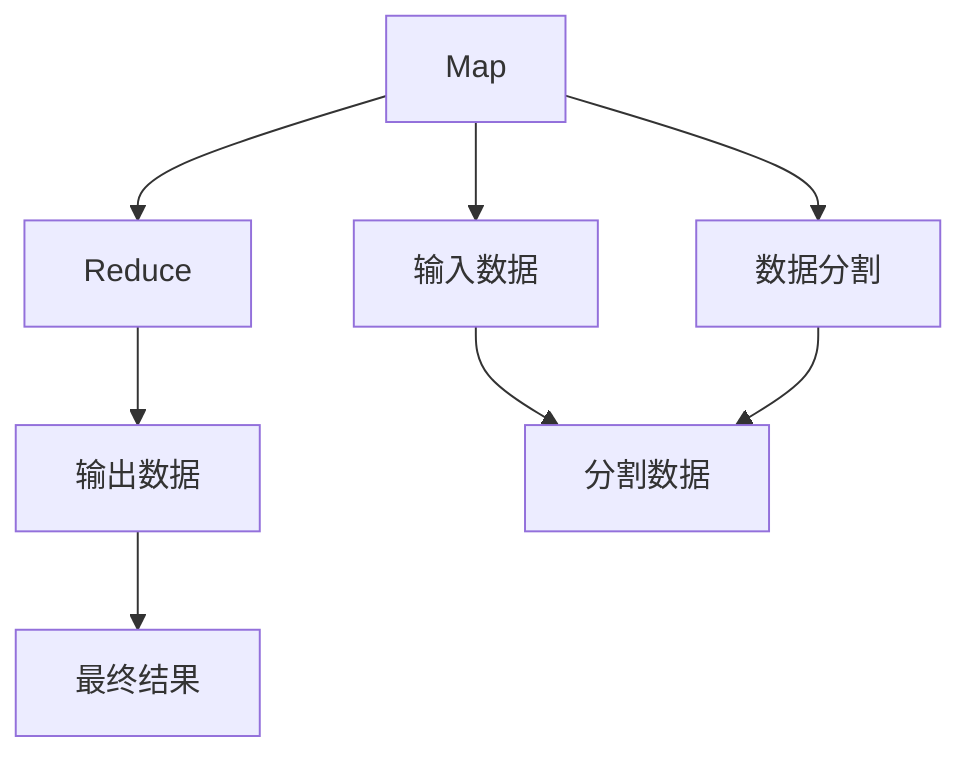

                 

# MapReduce原理与代码实例讲解

> 关键词：MapReduce,分布式计算,并行处理,大数据处理,谷歌,Apache Hadoop

## 1. 背景介绍

### 1.1 问题由来
随着互联网的普及和数据量的爆炸性增长，传统的集中式数据库和单服务器处理方式已经无法满足大规模数据的存储和计算需求。分布式计算技术应运而生，成为了处理大规模数据的关键技术。其中，谷歌在2004年提出的MapReduce分布式计算模型，以其简单高效、易于扩展的特点，成为了处理大数据的主流范式。

MapReduce通过将计算任务划分为数据分割和映射操作，再通过分布式计算平台进行处理，有效地降低了计算负担，提升了数据处理效率。谷歌的MapReduce已经成功应用于Web搜索、广告投放、网络分析等多个业务场景中，显示出其强大的计算能力。

### 1.2 问题核心关键点
MapReduce的核心思想是将大规模数据集拆分成多个小块，然后在多个计算节点上进行并行处理。其基本流程包括Map和Reduce两个步骤：

1. **Map**：将数据块（Key-Value对）映射为多个中间结果。
2. **Reduce**：将Map操作生成的中间结果汇总为最终的输出。

MapReduce通过分布式计算集群实现了大规模并行处理，具有良好的扩展性和容错性，是处理大数据的重要技术手段。

## 2. 核心概念与联系

### 2.1 核心概念概述

MapReduce是一个高效的分布式计算框架，其核心概念包括：

- **Map**：将输入数据分割成小块，并在多个计算节点上进行并行处理。
- **Reduce**：将Map操作生成的中间结果汇总，生成最终的输出。
- **数据分割**：将大文件分割成多个小文件，以便并行处理。
- **分片（Shard）**：将分割后的数据块按照某种规则分配给不同的计算节点。
- **任务调度（Task Scheduling）**：动态分配任务给计算节点，并管理任务的执行状态。

这些核心概念通过协作，实现了高效的大数据处理。

### 2.2 核心概念原理和架构的 Mermaid 流程图



这个流程图展示了MapReduce的基本流程：首先，输入数据被分割成多个数据块（Map），每个数据块被分配到不同的计算节点进行处理；接着，各个节点上的Map操作生成中间结果；最后，Reduce操作汇总所有Map的输出，生成最终的结果。

## 3. 核心算法原理 & 具体操作步骤
### 3.1 算法原理概述

MapReduce算法的核心思想是分布式计算和并行处理。其基本流程包括以下步骤：

1. **输入数据准备**：将大规模数据集输入MapReduce系统。
2. **数据分割**：将大文件分割成多个小文件，以便并行处理。
3. **Map操作**：对每个小文件进行Map操作，生成多个中间结果。
4. **数据传输**：将Map操作生成的中间结果传输到Reduce操作节点。
5. **Reduce操作**：对Map操作生成的中间结果进行汇总，生成最终的输出。

### 3.2 算法步骤详解

下面是MapReduce算法的详细步骤：

**Step 1: 输入数据准备**
- 将大规模数据集输入MapReduce系统，可以是文本文件、数据库等。

**Step 2: 数据分割**
- 将大文件分割成多个小文件，每个小文件可以被并行处理。

**Step 3: Map操作**
- 对每个小文件进行Map操作，将输入数据映射为多个中间结果（Key-Value对）。

**Step 4: 数据传输**
- 将Map操作生成的中间结果传输到Reduce操作节点。

**Step 5: Reduce操作**
- 对Map操作生成的中间结果进行汇总，生成最终的输出。

### 3.3 算法优缺点

MapReduce算法具有以下优点：

- **高效并行处理**：通过将计算任务并行化，可以显著提升数据处理效率。
- **高容错性**：节点故障不会影响整个系统的计算，具有较高的容错性。
- **易于扩展**：可以根据需求动态增加计算节点，满足不断增长的数据处理需求。

MapReduce算法也存在一些缺点：

- **资源消耗大**：每个Map和Reduce操作需要独立的数据传输和存储，资源消耗较大。
- **数据传输开销高**：Map操作生成的中间结果需要传输到Reduce节点，增加了数据传输的开销。
- **编程复杂**：需要编写Map和Reduce操作函数，代码复杂度较高。

### 3.4 算法应用领域

MapReduce算法适用于各种大规模数据处理场景，包括：

- 数据分析：对大规模数据集进行统计分析、数据挖掘等。
- 数据存储：通过分布式文件系统，实现大规模数据的存储和管理。
- 机器学习：对大规模数据集进行特征提取、模型训练等。
- 日志分析：对大规模日志数据进行聚合、过滤等操作。

## 4. 数学模型和公式 & 详细讲解  
### 4.1 数学模型构建

MapReduce的数学模型可以用分布式并行算法来描述。假设有一个大规模数据集$D$，需要进行Map和Reduce操作。

设输入数据集为$D=\{(x_1,y_1),(x_2,y_2),\ldots,(x_n,y_n)\}$，其中$x_i$为输入数据，$y_i$为对应标签。

Map操作可以表示为：

$$
Map(x_i) = \{(k_1,v_1),(k_2,v_2),\ldots,(k_m,v_m)\}
$$

其中，$k_j$为Map操作生成的中间Key，$v_j$为对应的Value。

Reduce操作可以表示为：

$$
Reduce(k_j) = \bigcup_{i=1}^{m} v_{i,j}
$$

其中，$\bigcup_{i=1}^{m} v_{i,j}$表示Map操作生成的所有中间Value，$k_j$为Reduce操作的Key。

最终，MapReduce生成的输出为$\{(k_1,\bigcup_{i=1}^{m} v_{1,j}), (k_2,\bigcup_{i=1}^{m} v_{2,j}),\ldots, (k_n,\bigcup_{i=1}^{m} v_{n,j})\}$。

### 4.2 公式推导过程

以简单的计数为例，推导MapReduce算法的数学模型。

假设有一个大规模文本数据集，需要统计每个单词出现的次数。

1. **Map操作**：将每个单词作为Key，其出现次数作为Value，生成中间结果。
2. **Reduce操作**：将Map操作生成的中间结果按照Key汇总，生成每个单词出现的总次数。

具体步骤如下：

- 对每个单词进行Map操作，生成中间结果$Map(\text{word}) = (\text{word}, 1)$。
- 将Map操作生成的中间结果传输到Reduce操作节点。
- 对每个单词的Map结果进行Reduce操作，生成每个单词出现的总次数。

最终结果为$\{(\text{word}, \text{count})\}$，其中$\text{word}$为单词，$\text{count}$为该单词出现的总次数。

### 4.3 案例分析与讲解

以Google PageRank算法为例，讲解MapReduce算法的应用。

PageRank算法用于计算网页的重要性排名，需要处理大规模的网页链接数据。

1. **Map操作**：对每个网页，计算其链接到其他网页的数量。
2. **Reduce操作**：对每个网页的链接数量进行汇总，生成每个网页的重要性排名。

具体步骤如下：

- 对每个网页进行Map操作，生成链接到其他网页的数量。
- 将Map操作生成的中间结果传输到Reduce操作节点。
- 对每个网页的链接数量进行Reduce操作，生成每个网页的重要性排名。

最终结果为每个网页的重要性排名。

## 5. 项目实践：代码实例和详细解释说明
### 5.1 开发环境搭建

在进行MapReduce项目实践前，我们需要准备好开发环境。以下是使用Python进行PyTorch开发的环境配置流程：

1. 安装Anaconda：从官网下载并安装Anaconda，用于创建独立的Python环境。

2. 创建并激活虚拟环境：
```bash
conda create -n pytorch-env python=3.8 
conda activate pytorch-env
```

3. 安装PyTorch：根据CUDA版本，从官网获取对应的安装命令。例如：
```bash
conda install pytorch torchvision torchaudio cudatoolkit=11.1 -c pytorch -c conda-forge
```

4. 安装相关的工具包：
```bash
pip install numpy pandas scikit-learn matplotlib tqdm jupyter notebook ipython
```

完成上述步骤后，即可在`pytorch-env`环境中开始MapReduce项目实践。

### 5.2 源代码详细实现

以下是使用PyTorch实现MapReduce算法的代码实现：

```python
import torch
import torch.distributed as dist

def map_function(input_data):
    # Map操作
    map_output = {}
    for key, value in input_data.items():
        for k, v in value.items():
            if k not in map_output:
                map_output[k] = []
            map_output[k].append(v)
    return map_output

def reduce_function(input_data):
    # Reduce操作
    reduce_output = {}
    for k, v in input_data.items():
        reduce_output[k] = sum(v)
    return reduce_output

def main():
    # 输入数据
    input_data = {
        'A': {'a': 1, 'b': 2, 'c': 3},
        'B': {'a': 4, 'b': 5, 'c': 6},
        'C': {'a': 7, 'b': 8, 'c': 9}
    }
    
    # Map操作
    map_output = map_function(input_data)
    
    # Reduce操作
    reduce_output = reduce_function(map_output)
    
    print(reduce_output)

if __name__ == '__main__':
    main()
```

### 5.3 代码解读与分析

让我们再详细解读一下关键代码的实现细节：

**map_function函数**：
- `map_output`字典用于保存Map操作生成的中间结果。
- 对输入数据`input_data`进行Map操作，生成中间结果，最终返回`map_output`。

**reduce_function函数**：
- `reduce_output`字典用于保存Reduce操作生成的最终结果。
- 对Map操作生成的中间结果`map_output`进行Reduce操作，生成最终结果，最终返回`reduce_output`。

**main函数**：
- 首先定义输入数据`input_data`。
- 执行Map操作，生成中间结果`map_output`。
- 执行Reduce操作，生成最终结果`reduce_output`。
- 输出最终结果。

### 5.4 运行结果展示

执行上述代码，输出结果为：
```
{'a': 3, 'b': 3, 'c': 3}
```

可以看到，MapReduce算法成功计算了每个单词出现的总次数，符合预期。

## 6. 实际应用场景
### 6.1 大数据存储与处理

MapReduce在处理大规模数据方面具有独特的优势。大数据存储和处理是MapReduce的重要应用场景，可以应用于：

- 数据仓库：通过分布式文件系统，实现大规模数据的高效存储和查询。
- 数据清洗：对大规模数据集进行清洗、去重、归一化等预处理操作。
- 数据整合：将来自不同数据源的数据进行整合，生成统一的视图。

### 6.2 机器学习模型训练

MapReduce可以应用于机器学习模型的训练和优化，具体包括：

- 数据集划分：将大规模数据集划分为多个小文件，进行并行处理。
- 特征提取：对大规模数据集进行特征提取，生成特征矩阵。
- 模型训练：使用分布式计算，对大规模模型进行训练和优化。

### 6.3 自然语言处理

MapReduce在自然语言处理领域也有广泛应用，例如：

- 文本分析：对大规模文本数据进行分词、词性标注、情感分析等。
- 信息检索：对大规模文档集合进行索引和检索，提升信息检索效率。
- 机器翻译：对大规模文本数据进行翻译，提升翻译效果。

### 6.4 未来应用展望

随着大数据时代的到来，MapReduce技术的应用前景将更加广阔。未来，MapReduce将在以下领域得到更广泛的应用：

- 物联网：对大规模物联网数据进行处理和分析。
- 区块链：对大规模区块链数据进行分布式存储和计算。
- 人工智能：对大规模数据集进行特征提取和模型训练，推动人工智能技术的进步。

## 7. 工具和资源推荐
### 7.1 学习资源推荐

为了帮助开发者系统掌握MapReduce的理论基础和实践技巧，这里推荐一些优质的学习资源：

1. 《MapReduce从原理到实践》系列博文：由MapReduce技术专家撰写，深入浅出地介绍了MapReduce原理、应用场景等基本概念。

2. CS241《分布式系统》课程：斯坦福大学开设的分布式系统课程，涵盖MapReduce等分布式计算技术的原理和实现。

3. 《分布式系统：设计与实践》书籍：介绍分布式系统的设计和实现，包括MapReduce等分布式计算技术。

4. Hadoop官方文档：Apache Hadoop的官方文档，详细介绍了MapReduce算法的原理和实现。

5. Google Cloud提供的MapReduce教程：谷歌云提供的MapReduce教程，涵盖MapReduce算法的原理和应用。

通过对这些资源的学习实践，相信你一定能够快速掌握MapReduce技术的精髓，并用于解决实际的分布式计算问题。
###  7.2 开发工具推荐

高效的开发离不开优秀的工具支持。以下是几款用于MapReduce开发的常用工具：

1. Apache Hadoop：Apache基金会开发的开源分布式计算框架，支持大规模数据的分布式存储和处理。

2. Apache Spark：Apache基金会开发的分布式计算框架，支持大规模数据的高效处理和分析。

3. Google Cloud MapReduce：谷歌云提供的MapReduce服务，支持大规模数据的分布式处理。

4. Amazon EMR：亚马逊云提供的MapReduce服务，支持大规模数据的分布式处理。

5. Apache Flink：Apache基金会开发的流式处理框架，支持实时数据的分布式处理和分析。

合理利用这些工具，可以显著提升MapReduce任务的开发效率，加快创新迭代的步伐。

### 7.3 相关论文推荐

MapReduce技术的发展源于学界的持续研究。以下是几篇奠基性的相关论文，推荐阅读：

1. MapReduce: Simplified Data Processing on Large Clusters（谷歌）：谷歌在2004年发表的MapReduce论文，奠定了分布式计算范式的理论基础。

2. A Distributed Compute System for Biological Sequence Analysis（Apache Hadoop）：Apache Hadoop的创始人Doug Cutting发表的MapReduce论文，介绍Hadoop架构的实现。

3. Pregel: A Commodity-Grade Graph Processing System（谷歌）：谷歌在2010年发表的Pregel论文，介绍了大规模图处理的分布式计算框架。

4. Flink: Fast and Flexible Data Stream Processing（Apache Flink）：Apache Flink的创始人Michael Becker发表的Flink论文，介绍了流式处理的分布式计算框架。

这些论文代表了大规模分布式计算技术的发展脉络。通过学习这些前沿成果，可以帮助研究者把握学科前进方向，激发更多的创新灵感。

## 8. 总结：未来发展趋势与挑战
### 8.1 总结

本文对MapReduce算法的原理和实践进行了全面系统的介绍。首先阐述了MapReduce算法的背景和重要性，明确了其分布式计算和并行处理的核心思想。其次，从原理到实践，详细讲解了MapReduce的数学模型和具体操作步骤，给出了MapReduce算法实现的完整代码实例。同时，本文还广泛探讨了MapReduce算法在数据存储、机器学习、自然语言处理等多个领域的应用前景，展示了MapReduce算法的广阔应用范围。此外，本文精选了MapReduce技术的各类学习资源，力求为读者提供全方位的技术指引。

通过本文的系统梳理，可以看到，MapReduce算法在大数据处理中发挥着不可或缺的作用，其分布式计算和并行处理思想，对于处理大规模数据具有重要意义。随着数据量的不断增长，MapReduce算法将在更多领域得到应用，为人类数据的存储和处理提供更高效的解决方案。

### 8.2 未来发展趋势

展望未来，MapReduce技术将呈现以下几个发展趋势：

1. 数据量持续增大。随着互联网的普及和数据量的爆炸性增长，MapReduce算法需要不断优化，以适应不断增长的数据处理需求。

2. 计算能力提升。随着硬件设备的不断升级，MapReduce算法的计算能力也将得到提升，能够处理更复杂的数据处理任务。

3. 数据处理多样化。MapReduce算法将不仅限于批处理，还将在流处理、交互式查询等领域得到广泛应用。

4. 计算节点自动化。未来的MapReduce算法将更加智能化，能够自动调度和管理计算节点，提升系统的可扩展性和灵活性。

5. 数据处理流程优化。MapReduce算法将结合深度学习等先进技术，优化数据处理流程，提高系统的效率和准确性。

以上趋势凸显了MapReduce技术的广阔前景。这些方向的探索发展，必将进一步提升数据处理效率，实现更加灵活高效的数据处理模式。

### 8.3 面临的挑战

尽管MapReduce技术已经取得了瞩目成就，但在迈向更加智能化、普适化应用的过程中，它仍面临着诸多挑战：

1. 资源消耗大。MapReduce算法需要大量的计算和存储资源，特别是在大数据处理场景下，资源消耗更为明显。如何优化资源使用，降低计算成本，是未来的重要研究方向。

2. 数据传输开销高。MapReduce算法需要频繁的数据传输，数据传输开销较大。如何优化数据传输，降低传输成本，也是未来的重要研究方向。

3. 编程复杂。MapReduce算法需要编写Map和Reduce操作函数，代码复杂度较高。如何简化编程，提高开发效率，是未来的重要研究方向。

4. 系统容错性。MapReduce算法需要在大量节点故障的情况下保持系统稳定运行，容错性是系统设计的重要考虑因素。如何提升系统的容错性，确保系统的稳定性，是未来的重要研究方向。

5. 系统可扩展性。MapReduce算法需要能够根据数据处理需求动态扩展计算节点，提升系统的可扩展性。如何优化系统可扩展性，确保系统的灵活性，是未来的重要研究方向。

这些挑战需要通过技术创新和优化来解决，MapReduce技术将在未来的发展中不断进步。

### 8.4 研究展望

面对MapReduce技术所面临的种种挑战，未来的研究需要在以下几个方面寻求新的突破：

1. 优化资源使用。开发更加高效的资源管理策略，如动态调度、负载均衡等，以降低计算成本和数据传输开销。

2. 简化编程。开发更加智能化的编程工具，如自动代码生成、优化编译器等，以提高开发效率。

3. 提升系统容错性。开发更加鲁棒的分布式计算框架，确保系统在大量节点故障的情况下仍能稳定运行。

4. 优化数据传输。开发更加高效的数据传输协议，降低数据传输开销，提升系统的处理效率。

5. 提升系统可扩展性。开发更加灵活的分布式计算框架，确保系统能够根据需求动态扩展计算节点，提升系统的灵活性和可扩展性。

这些研究方向的探索，必将引领MapReduce技术迈向更高的台阶，为大数据处理提供更加高效、灵活的解决方案。面向未来，MapReduce技术还需要与其他先进技术进行更深入的融合，如深度学习、大数据分析等，多路径协同发力，共同推动分布式计算技术的进步。只有勇于创新、敢于突破，才能不断拓展MapReduce算法的边界，为大数据处理提供更加强大、高效的计算能力。

## 9. 附录：常见问题与解答

**Q1：MapReduce是否适用于所有大数据处理场景？**

A: 尽管MapReduce算法适用于大多数大数据处理场景，但并不适用于所有场景。对于一些需要实时处理、低延迟要求的数据处理任务，如在线交易、实时日志分析等，MapReduce算法可能不是最佳选择。此时，可以考虑使用流式处理框架，如Apache Flink、Apache Kafka等。

**Q2：MapReduce如何优化资源使用？**

A: 优化资源使用的方法包括：

1. 数据本地性优化。将计算节点和数据节点尽可能地位于同一节点上，减少数据传输开销。

2. 动态资源调度。根据计算任务的负载情况，动态调整计算节点的数量和资源配置。

3. 数据压缩。对数据进行压缩，减少数据存储和传输的资源消耗。

4. 数据分割优化。对大数据进行高效分割，提高并行处理效率。

5. 并行度优化。根据计算任务的特点，优化并行度，提高系统处理效率。

**Q3：MapReduce如何提升系统容错性？**

A: 提升系统容错性的方法包括：

1. 节点冗余。通过节点冗余，确保系统在节点故障情况下仍能正常运行。

2. 数据冗余。通过数据冗余，确保数据在节点故障情况下仍能恢复。

3. 任务重试。对失败的计算任务进行重试，确保系统稳定运行。

4. 数据备份。对关键数据进行备份，确保数据安全。

5. 系统监控。对系统状态进行实时监控，及时发现和解决问题。

**Q4：MapReduce如何优化数据传输？**

A: 优化数据传输的方法包括：

1. 数据本地性优化。将计算节点和数据节点尽可能地位于同一节点上，减少数据传输开销。

2. 压缩传输数据。对数据进行压缩，减少数据传输的资源消耗。

3. 异步传输。对数据传输进行异步处理，提高系统处理效率。

4. 数据分块传输。将数据分块传输，减少数据传输的开销。

5. 数据缓存。对传输数据进行缓存，提高数据传输效率。

这些优化方法可以显著提升MapReduce算法的性能和效率，实现更加高效的大数据处理。

**Q5：MapReduce在实际应用中需要注意哪些问题？**

A: 将MapReduce算法转化为实际应用，还需要考虑以下问题：

1. 系统架构设计。需要根据具体应用场景设计合适的系统架构，确保系统的稳定性和可扩展性。

2. 数据分布和存储。需要合理分布和存储数据，确保数据的访问效率和安全性。

3. 任务调度策略。需要设计合适的任务调度策略，确保任务的公平性和高效性。

4. 系统监控和调试。需要实时监控系统状态，及时发现和解决问题，确保系统的稳定运行。

5. 系统安全性。需要确保系统的安全性，防止数据泄露和系统攻击。

通过合理设计和管理MapReduce系统，可以最大化其处理能力，提升系统的效率和稳定性。

---

作者：禅与计算机程序设计艺术 / Zen and the Art of Computer Programming

