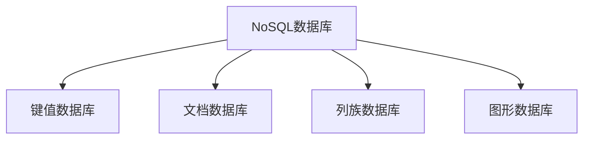

                 

# NoSQL数据库：处理非结构化数据的解决方案

> 关键词：NoSQL数据库,非结构化数据,键值数据库,文档数据库,列族数据库,图形数据库

## 1. 背景介绍

### 1.1 问题由来

在传统的关系型数据库中，数据被以表格的形式存储，并使用结构化的SQL语言进行查询和操作。然而，随着互联网和社交媒体的迅猛发展，数据类型和规模也变得越来越复杂，传统的关系型数据库已无法满足多样化的数据存储和处理需求。非结构化数据（Unstructured Data），如文本、图片、音频、视频等，成为新的数据存储热点，需要更加灵活高效的数据库管理系统来处理。

### 1.2 问题核心关键点

为了应对非结构化数据的存储和处理需求，NoSQL数据库应运而生。NoSQL数据库，即"Not Only SQL"，代表了一系列非关系型数据库的解决方案。其核心在于利用键值对、文档、列族、图等非结构化数据模型，支持分布式存储和弹性扩展，提供高可用性和高性能的数据管理能力。

## 2. 核心概念与联系

### 2.1 核心概念概述

为了更好地理解NoSQL数据库的原理和架构，本节将介绍几个关键概念：

- **NoSQL数据库**：泛指所有非关系型数据库，包括键值数据库、文档数据库、列族数据库、图形数据库等。与传统的SQL数据库相比，NoSQL数据库更灵活、更适用于大规模非结构化数据的存储和处理。

- **键值数据库（Key-Value Database）**：存储数据的模型为键值对（Key-Value Pair），通常用于存储简单的、结构不固定的数据。

- **文档数据库（Document Database）**：以文档为存储单位，类似于关系型数据库中的表，但每个文档可以包含复杂的结构和嵌套字段。

- **列族数据库（Column-Family Database）**：以列族（Column Family）的形式组织数据，每个列族包含一组相同的列，支持高效的读写操作。

- **图形数据库（Graph Database）**：存储数据的模型为图，由节点（Node）和边（Edge）构成，用于存储复杂的网络结构和关系型数据。

这些核心概念之间的逻辑关系可以通过以下Mermaid流程图来展示：



这个流程图展示了几类NoSQL数据库之间的联系和区别：

1. 所有的NoSQL数据库都支持分布式存储和弹性扩展，以应对大规模数据的存储需求。
2. 键值数据库和文档数据库适合存储半结构化数据，列族数据库适合存储半结构化到结构化数据，图形数据库适合存储复杂关系型数据。
3. NoSQL数据库均支持高可用性和高性能，提供丰富的数据管理工具和分析功能。

## 3. 核心算法原理 & 具体操作步骤
### 3.1 算法原理概述

NoSQL数据库的核心在于其数据存储和处理模型的灵活性。不同类型的NoSQL数据库，如键值数据库、文档数据库、列族数据库和图形数据库，其数据模型和操作方式各不相同，但都基于键值对的逻辑结构。

以文档数据库为例，其核心算法原理基于B+树索引结构，将文档数据组织为树状结构，通过树节点定位文档数据，支持高效的查询和更新操作。具体而言，文档数据库使用如下操作：

- **插入**：将新文档插入到B+树中。
- **查询**：根据文档的某个属性值，通过B+树索引定位文档。
- **更新**：修改文档的属性值，更新B+树索引。
- **删除**：从B+树中删除文档。

文档数据库的插入、查询、更新和删除操作均基于B+树索引结构进行，以确保高效和一致性。

### 3.2 算法步骤详解

以下是NoSQL数据库中文档数据库的具体操作步骤：

**步骤1: 数据模型设计**

设计文档数据库的数据模型时，需要考虑数据的存储结构、字段类型、索引策略等因素。一般而言，文档数据库的文档结构较为灵活，允许嵌套和数组等复杂数据类型。例如，一个用户文档可能包含基本信息（如姓名、性别）、联系信息（如电话、地址）、社交媒体信息（如Twitter、Facebook账号）等。

**步骤2: 数据插入**

数据插入操作是将新文档插入到B+树索引中。具体步骤如下：

1. 创建一个新的B+树节点，用于存储文档数据。
2. 将文档数据添加到节点中，并更新索引。
3. 如果节点已满，则将节点拆分为两个节点。

**步骤3: 数据查询**

数据查询操作是通过B+树索引定位文档。具体步骤如下：

1. 根据查询条件，定位到B+树索引的根节点。
2. 通过B+树索引的指针，定位到包含目标文档的节点。
3. 从节点中提取文档数据。

**步骤4: 数据更新**

数据更新操作是将文档的属性值修改为新值，并更新B+树索引。具体步骤如下：

1. 找到包含目标文档的节点。
2. 修改文档的属性值。
3. 更新B+树索引，以确保查询操作仍然高效。

**步骤5: 数据删除**

数据删除操作是将文档从B+树索引中删除。具体步骤如下：

1. 找到包含目标文档的节点。
2. 从节点中删除文档。
3. 更新B+树索引，以保持查询操作的效率。

### 3.3 算法优缺点

NoSQL数据库具有以下优点：

- **灵活性高**：支持多种数据模型，包括键值对、文档、列族、图形等，能够应对各种不同类型的数据。
- **高可用性**：通过分布式存储和冗余设计，保证数据的可靠性和可用性。
- **高性能**：支持水平扩展，能够高效处理大规模数据存储和查询操作。

同时，NoSQL数据库也存在一些缺点：

- **数据一致性问题**：部分NoSQL数据库的ACID一致性（Atomicity, Consistency, Isolation, Durability）不如传统SQL数据库，可能存在数据一致性问题。
- **复杂性高**：由于数据模型复杂多样，需要较高的技术水平和开发经验。
- **缺乏标准化**：不同的NoSQL数据库具有不同的数据模型和操作方式，难以统一。

### 3.4 算法应用领域

NoSQL数据库被广泛应用于各种数据存储和处理场景，包括：

- **日志存储**：日志数据具有高吞吐量、海量存储的需求，适合使用键值数据库或列族数据库。
- **内容管理系统**：文档数据库适合存储和检索文章、图片等半结构化数据。
- **社交网络**：图形数据库适合存储和分析用户关系和社交网络数据。
- **物联网**：传感器数据通常具有高并发、多设备的特点，适合使用列族数据库。
- **大数据分析**：非结构化数据的处理和分析，适合使用文档数据库和列族数据库。

## 4. 数学模型和公式 & 详细讲解 & 举例说明
### 4.1 数学模型构建

NoSQL数据库的数学模型主要基于数据存储和查询操作的逻辑结构。以下是几种常见NoSQL数据库的数学模型构建：

- **键值数据库**：键值对（Key-Value Pair）形式的数据存储，通过哈希表（Hash Table）实现高效的插入、查询、更新和删除操作。

- **文档数据库**：文档（Document）形式的数据存储，通过B+树索引（B+ Tree Index）实现高效的查询和更新操作。

- **列族数据库**：列族（Column Family）形式的数据存储，每个列族包含一组相同的列，通过列族索引（Column Family Index）实现高效的读写操作。

- **图形数据库**：图形（Graph）形式的数据存储，通过图数据库（Graph Database）实现高效的节点和边操作。

### 4.2 公式推导过程

以文档数据库为例，其核心算法为B+树索引，其公式推导如下：

- **插入操作**：假设B+树节点为$N$，插入操作需要分为两步：

  1. 将文档数据$D$插入到叶节点$L$。
  2. 如果叶节点$L$已满，将节点$L$拆分为两个新节点$L1$和$L2$，并更新索引。

  $$
  Insert(L, D) = 
  \begin{cases} 
  L + D, & \text{if } L < N \\
  (L1, L2), & \text{if } L \geq N \\
  \end{cases}
  $$

- **查询操作**：假设查询条件为$Q$，查询操作需要分为三步：

  1. 根据查询条件$Q$，定位到根节点$R$。
  2. 通过B+树索引的指针，定位到包含目标文档的节点$L$。
  3. 从节点$L$中提取文档数据。

  $$
  Query(R, Q) = 
  \begin{cases} 
  L, & \text{if } R \rightarrow L \text{ contains } Q \\
  \text{Not found}, & \text{otherwise}
  \end{cases}
  $$

- **更新操作**：假设需要更新文档数据$D$为$D'$，更新操作需要分为三步：

  1. 找到包含目标文档的节点$L$。
  2. 修改文档数据$D$为$D'$。
  3. 更新B+树索引，以确保查询操作仍然高效。

  $$
  Update(L, D', D) = 
  \begin{cases} 
  L - D + D', & \text{if } L \rightarrow D \text{ exists} \\
  \text{Not updated}, & \text{otherwise}
  \end{cases}
  $$

- **删除操作**：假设需要删除文档数据$D$，删除操作需要分为两步：

  1. 找到包含目标文档的节点$L$。
  2. 从节点$L$中删除文档数据$D$。
  3. 更新B+树索引，以保持查询操作的效率。

  $$
  Delete(L, D) = 
  \begin{cases} 
  L - D, & \text{if } L \rightarrow D \text{ exists} \\
  \text{Not deleted}, & \text{otherwise}
  \end{cases}
  $$

### 4.3 案例分析与讲解

以下以一个简单的文档数据库为例，展示其基本操作：

假设有一个文档数据库，存储了若干用户文档，每个用户文档包含姓名、性别、电话等字段。使用文档数据库的插入、查询、更新和删除操作如下：

**插入操作**：

1. 创建一个新的B+树节点，用于存储用户文档。
2. 将用户文档插入到节点中，并更新索引。

  $$
  Insert(L, \{姓名: '张三', 性别: '男', 电话: '123456789\}) = \{姓名: '张三', 性别: '男', 电话: '123456789\}, L
  $$

**查询操作**：

1. 根据查询条件，定位到B+树索引的根节点。
2. 通过B+树索引的指针，定位到包含目标文档的节点。
3. 从节点中提取文档数据。

  $$
  Query(R, \{姓名: '张三\}) = \{姓名: '张三', 性别: '男', 电话: '123456789\}
  $$

**更新操作**：

1. 找到包含目标文档的节点。
2. 修改文档的属性值。
3. 更新B+树索引，以确保查询操作仍然高效。

  $$
  Update(L, \{姓名: '李四\}, \{姓名: '张三\}) = \{姓名: '李四', 性别: '男', 电话: '123456789\}, L
  $$

**删除操作**：

1. 找到包含目标文档的节点。
2. 从节点中删除文档。
3. 更新B+树索引，以保持查询操作的效率。

  $$
  Delete(L, \{姓名: '张三\}) = \{姓名: '李四\}, L
  $$

## 5. 项目实践：代码实例和详细解释说明
### 5.1 开发环境搭建

在进行NoSQL数据库项目实践前，我们需要准备好开发环境。以下是使用MongoDB进行文档数据库开发的环境配置流程：

1. 安装MongoDB：从官网下载并安装MongoDB服务器和客户端工具。

2. 创建数据库和集合：在MongoDB shell中创建需要存储数据的库和集合。

3. 安装MongoDB驱动程序：根据需要使用的编程语言，安装相应的MongoDB驱动程序。例如，在Python中使用PyMongo库。

```python
pip install pymongo
```

完成上述步骤后，即可在本地搭建MongoDB文档数据库，并开始项目实践。

### 5.2 源代码详细实现

下面以MongoDB为例，给出使用Python进行文档数据库的代码实现。

首先，定义MongoDB数据库连接函数：

```python
from pymongo import MongoClient

def connect_db(host, port, dbname):
    client = MongoClient(host, port)
    db = client[dbname]
    return db
```

然后，定义插入、查询、更新和删除操作的函数：

```python
from pymongo import InsertOneError

def insert_doc(db, collection, doc):
    try:
        db[collection].insert_one(doc)
        return True
    except InsertOneError as e:
        print(f"Insertion failed: {e}")
        return False

def find_doc(db, collection, query, fields=None):
    if fields:
        return list(db[collection].find(query, fields))
    else:
        return list(db[collection].find(query))

def update_doc(db, collection, query, new_doc):
    db[collection].update_one(query, new_doc)

def delete_doc(db, collection, query):
    db[collection].delete_one(query)
```

最后，启动MongoDB服务器并执行实际操作：

```python
# 启动MongoDB服务器
mongod --port 27017 &

# 连接MongoDB数据库
db = connect_db('localhost', 27017, 'test')

# 插入数据
doc1 = {'name': '张三', 'gender': '男', 'phone': '123456789'}
doc2 = {'name': '李四', 'gender': '女', 'phone': '987654321'}
insert_doc(db, 'users', doc1)
insert_doc(db, 'users', doc2)

# 查询数据
result = find_doc(db, 'users', {'name': '张三'}, {'name': 1, 'gender': 1})
print(result)

# 更新数据
update_doc(db, 'users', {'name': '张三'}, {'phone': '135792468'})
result = find_doc(db, 'users', {'name': '张三'}, {'name': 1, 'gender': 1})
print(result)

# 删除数据
delete_doc(db, 'users', {'name': '张三'})
result = find_doc(db, 'users', {'name': '张三'}, {'name': 1, 'gender': 1})
print(result)
```

以上就是使用PyMongo进行MongoDB文档数据库的完整代码实现。可以看到，PyMongo库提供了丰富的接口函数，使得MongoDB文档数据库的开发变得简洁高效。

### 5.3 代码解读与分析

让我们再详细解读一下关键代码的实现细节：

**connect_db函数**：
- 定义了连接MongoDB数据库的函数，使用MongoClient创建数据库连接，返回数据库对象。

**insert_doc函数**：
- 使用insert_one方法将文档数据插入到指定的集合中。
- 如果插入失败，捕获异常并打印错误信息。

**find_doc函数**：
- 使用find方法查询符合条件的文档，并返回查询结果。
- 如果指定了查询字段，则只返回指定字段的数据。

**update_doc函数**：
- 使用update_one方法更新符合条件的文档。

**delete_doc函数**：
- 使用delete_one方法删除符合条件的文档。

**实际操作**：
- 启动MongoDB服务器，连接MongoDB数据库。
- 插入数据，查询数据，更新数据，删除数据，并打印结果。

通过上述代码，可以完整地操作MongoDB文档数据库，实现基本的CRUD操作。

## 6. 实际应用场景
### 6.1 日志存储

日志数据具有高吞吐量、海量存储的需求，适合使用键值数据库或列族数据库。以Apache HBase为例，其核心数据模型为列族（Column Family），支持大规模日志数据的存储和查询。

**场景描述**：

一家大型互联网公司需要存储和查询每天产生的大量日志数据，日志数据包括访问日志、错误日志、用户行为日志等。日志数据具有高吞吐量、海量存储的需求，同时需要支持实时查询和统计分析。

**解决方案**：

使用HBase构建分布式日志存储系统。将日志数据按照时间戳进行分片，每个时间片存储到一个HBase表（Table）中，每个时间片包含多个列族（Column Family），每个列族存储不同类型的日志数据。每个列族内部使用行键（Row Key）和列键（Column Key）进行数据组织，支持高效的读写和查询操作。

**代码实现**：

```python
import hbase

def put_log(log_data, table_name, column_family):
    hbase.put(log_data, table_name, column_family)

def get_log(log_key, table_name, column_family):
    return hbase.get(log_key, table_name, column_family)
```

### 6.2 内容管理系统

文档数据库适合存储和检索文章、图片等半结构化数据。以MongoDB为例，其核心数据模型为文档（Document），支持高效的查询和索引操作。

**场景描述**：

一家在线教育平台需要存储和检索大量文章、图片、视频等教学内容。平台上的用户可以通过搜索、标签、分类等方式查找所需的教学资源。

**解决方案**：

使用MongoDB构建内容管理系统。将文章、图片、视频等教学内容存储为文档，使用标签、分类等属性进行索引。使用全文搜索和倒排索引等技术，支持高效的文本和图片检索。

**代码实现**：

```python
from pymongo import IndexModel, ASCENDING

def insert_doc(doc, collection_name, index_fields):
    db = connect_db('localhost', 27017, 'content')
    db[collection_name].insert_one(doc)
    index = IndexModel([(index_fields, ASCENDING)])
    db[collection_name].create_index(index)

def find_doc(query, collection_name, fields):
    db = connect_db('localhost', 27017, 'content')
    result = db[collection_name].find(query, fields)
    return list(result)

# 插入文档
doc1 = {'title': 'Python基础教程', 'author': '张三', 'content': 'Python编程基础'}
insert_doc(doc1, 'articles', ['title', 'author'])

# 查询文档
result = find_doc({'title': 'Python基础教程'}, 'articles', ['title', 'author'])
print(result)
```

### 6.3 社交网络

图形数据库适合存储和分析用户关系和社交网络数据。以Neo4j为例，其核心数据模型为节点（Node）和边（Edge），支持高效的图遍历和查询操作。

**场景描述**：

一家社交媒体平台需要存储和分析用户关系和社交网络数据。用户可以发布动态、关注好友、加入群组等，同时可以搜索好友、查看群组动态、参与讨论等。

**解决方案**：

使用Neo4j构建社交网络分析系统。将用户、动态、群组等实体存储为节点，将关注、好友、加入等关系存储为边，使用图算法和查询语言进行用户行为分析和社交网络挖掘。

**代码实现**：

```python
from neo4j import GraphDatabase

def create_node(tx, node_name, props):
    tx.run(f"CREATE (n:{node_name} $props) RETURN n", props=props)

def create_relationship(tx, source_node, target_node, relationship_type, props):
    tx.run(f"MATCH (s:{source_node}) MERGE (s)-[:{relationship_type}]->(t:{target_node}) SET t+=$props RETURN t", props=props)

# 创建节点
session = GraphDatabase.driver('bolt://localhost:7687', auth=('neo4j', 'password'))
with session.session() as tx:
    create_node(tx, 'user', {'name': '张三', 'age': 20})
    create_node(tx, 'user', {'name': '李四', 'age': 30})

# 创建关系
with session.session() as tx:
    create_relationship(tx, 'user', 'user', 'FOLLOWED', {'date': '2022-01-01'})
    result = tx.run("MATCH (u:user)-[:FOLLOWED]->(v:user) RETURN u.name, v.name")
    print(list(result))

# 查询关系
with session.session() as tx:
    result = tx.run("MATCH (u:user)-[:FOLLOWED]->(v:user) RETURN u.name, v.name")
    print(list(result))
```

## 7. 工具和资源推荐
### 7.1 学习资源推荐

为了帮助开发者系统掌握NoSQL数据库的理论基础和实践技巧，这里推荐一些优质的学习资源：

1. 《NoSQL数据库设计与管理》系列博文：由NoSQL数据库专家撰写，深入浅出地介绍了NoSQL数据库的设计原理和实践经验。

2. MongoDB官方文档：MongoDB官方提供的详细文档，包括安装、配置、使用、优化等方面的内容，是学习MongoDB的重要资源。

3. Apache HBase官方文档：HBase官方提供的详细文档，包括架构、API、使用、优化等方面的内容，是学习HBase的重要资源。

4. Neo4j官方文档：Neo4j官方提供的详细文档，包括架构、API、使用、优化等方面的内容，是学习Neo4j的重要资源。

5. 《NoSQL数据管理》书籍：详细介绍NoSQL数据库的设计原理和应用实践，适合系统学习NoSQL数据库技术。

通过对这些资源的学习实践，相信你一定能够快速掌握NoSQL数据库的精髓，并用于解决实际的存储和处理需求。

### 7.2 开发工具推荐

高效的开发离不开优秀的工具支持。以下是几款用于NoSQL数据库开发的常用工具：

1. MongoDB：MongoDB是一种基于文档的NoSQL数据库，支持灵活的数据模型和高效的查询操作，适合存储和检索半结构化数据。

2. Apache HBase：HBase是一种基于列族的NoSQL数据库，支持大规模日志数据的存储和查询，适合高吞吐量的数据存储需求。

3. Neo4j：Neo4j是一种基于图的NoSQL数据库，支持高效的图遍历和查询操作，适合存储和分析复杂关系型数据。

4. Apache Cassandra：Cassandra是一种基于列族的NoSQL数据库，支持高可用性、分布式存储和弹性扩展，适合大规模数据的存储和查询。

5. Apache Kafka：Kafka是一种基于消息队列的数据流处理平台，支持高吞吐量、低延迟的数据处理和流式计算，适合实时数据处理和存储。

合理利用这些工具，可以显著提升NoSQL数据库的开发效率，加快创新迭代的步伐。

### 7.3 相关论文推荐

NoSQL数据库的研究发展迅猛，许多学术论文为该领域提供了深入的理论支持和实践指导。以下是几篇奠基性的相关论文，推荐阅读：

1. "A Survey of NoSQL" by Philip Cmidro：全面综述了NoSQL数据库的现状、特点、应用和技术，是学习NoSQL数据库的重要参考资料。

2. "Efficient Approaches to Schema-less Data Storage and Management" by Heiner Köplinger：介绍了NoSQL数据库在无模式数据存储和管理方面的方法和挑战。

3. "A New Approach for High-Speed Data Storage: Design and Implementation of the Berkeley Database" by Leigh KAFKA and Brendan O'Horo：介绍了一种高速度数据存储方法，为NoSQL数据库的设计提供了参考。

4. "Management of Persistent Data in Large-scale Distributed Databases: An Overview" by William T. Clancey and Paul M. Ngo：综述了大型分布式数据库的持久数据管理方法，为NoSQL数据库的分布式架构提供了理论支持。

5. "Graph-Based Retrieval of Metadata in Large Heterogeneous Databases" by Peter J. Haas et al.：介绍了一种基于图的元数据检索方法，为NoSQL数据库的图结构管理提供了新的思路。

这些论文代表了NoSQL数据库的研究前沿，通过学习这些前沿成果，可以帮助研究者把握学科前进方向，激发更多的创新灵感。

## 8. 总结：未来发展趋势与挑战

### 8.1 总结

本文对NoSQL数据库的原理和应用进行了全面系统的介绍。首先阐述了NoSQL数据库在传统关系型数据库的局限性下应运而生，介绍了其数据存储和处理模型的灵活性。其次，通过文档数据库、键值数据库、列族数据库和图形数据库等几种主流NoSQL数据库的具体操作，展示了NoSQL数据库的核心算法原理和具体操作步骤。最后，分析了NoSQL数据库的优缺点和实际应用场景，推荐了相应的学习资源和开发工具。

通过本文的系统梳理，可以看到，NoSQL数据库通过其多样化的数据模型和弹性扩展的架构，解决了传统关系型数据库在非结构化数据存储和处理方面的局限性。NoSQL数据库被广泛应用于各种数据存储和处理场景，为大规模数据的存储和处理提供了新的解决方案。

### 8.2 未来发展趋势

展望未来，NoSQL数据库将继续在以下几个方面发展：

1. **分布式技术**：随着大数据和云计算的发展，NoSQL数据库的分布式技术和水平扩展能力将进一步提升，能够更好地应对海量数据的存储和处理需求。

2. **多数据模型融合**：NoSQL数据库将更加灵活地支持多种数据模型，如键值对、文档、列族、图形等，能够更好地适应各种不同类型的数据。

3. **新功能引入**：NoSQL数据库将不断引入新的功能和优化，如时间序列数据存储、实时流处理、机器学习集成等，拓展其在实时数据处理和分析方面的能力。

4. **跨数据库集成**：NoSQL数据库将更好地支持跨数据库集成和数据交换，实现数据管理和分析的统一。

5. **自动化管理**：NoSQL数据库将更加自动化地进行数据备份、修复、迁移等操作，提高数据管理的效率和可靠性。

6. **安全性提升**：NoSQL数据库将更加注重数据安全性和隐私保护，引入更多的安全机制和加密技术。

### 8.3 面临的挑战

尽管NoSQL数据库已经取得了显著进展，但在迈向更加智能化、普适化应用的过程中，它仍面临诸多挑战：

1. **数据一致性问题**：部分NoSQL数据库的ACID一致性不如传统SQL数据库，可能存在数据一致性问题。

2. **复杂性高**：由于数据模型复杂多样，需要较高的技术水平和开发经验。

3. **缺乏标准化**：不同的NoSQL数据库具有不同的数据模型和操作方式，难以统一。

4. **性能瓶颈**：在高并发、大数据量的场景下，NoSQL数据库可能面临性能瓶颈。

5. **可扩展性不足**：在极端数据负载下，NoSQL数据库的扩展能力可能不足。

6. **安全性问题**：NoSQL数据库可能面临数据泄露、SQL注入等安全威胁。

### 8.4 研究展望

面对NoSQL数据库所面临的挑战，未来的研究需要在以下几个方面寻求新的突破：

1. **提高数据一致性**：引入更高级的分布式一致性协议，如Paxos、Raft等，提升NoSQL数据库的数据一致性。

2. **简化数据模型**：设计更简单、更标准化的数据模型，降低开发复杂度。

3. **标准化接口**：推动NoSQL数据库的接口标准化，促进跨数据库集成和数据交换。

4. **优化性能**：引入更高效的数据结构和算法，优化NoSQL数据库的性能和扩展能力。

5. **强化安全性**：引入更多的安全机制和加密技术，保障NoSQL数据库的数据安全性和隐私保护。

6. **自动化管理**：引入更智能的数据管理工具和自动化算法，提升NoSQL数据库的自动化管理能力。

这些研究方向的探索，必将引领NoSQL数据库迈向更高的台阶，为大规模数据的存储和处理提供更高效、更灵活、更安全的技术方案。面向未来，NoSQL数据库还需要与其他数据库技术进行更深入的融合，如传统SQL数据库、分布式文件系统、云存储等，多路径协同发力，共同推动数据管理技术的发展。只有勇于创新、敢于突破，才能不断拓展NoSQL数据库的边界，让数据存储和处理技术更好地服务于人类社会的数字化转型。

## 9. 附录：常见问题与解答

**Q1：NoSQL数据库是否适用于所有数据存储场景？**

A: NoSQL数据库适合存储非结构化数据，如文本、图片、音频、视频等，但对于一些结构化数据，如表格、事务型数据等，仍需要传统关系型数据库的支持。因此，NoSQL数据库适用于大部分非结构化数据存储场景，但对于特定需求，还需要结合关系型数据库进行数据管理。

**Q2：NoSQL数据库是否支持事务处理？**

A: 部分NoSQL数据库，如MongoDB、Cassandra等，支持ACID事务处理，可以保证数据一致性和可靠性。但部分NoSQL数据库，如Redis、Memcached等，只支持本地事务，无法保证全局一致性。

**Q3：NoSQL数据库如何进行数据备份和恢复？**

A: NoSQL数据库通常支持数据备份和恢复机制，如MongoDB使用mongodump和mongorestore命令进行备份和恢复，Cassandra使用sstable进行数据备份和恢复。此外，大多数NoSQL数据库也支持快照和日志记录，以确保数据的一致性和可用性。

**Q4：NoSQL数据库如何保证数据一致性？**

A: 部分NoSQL数据库，如MongoDB、Cassandra等，通过副本机制和冲突解决机制，保证数据一致性。副本机制将数据复制到多个节点，以防止单点故障。冲突解决机制在数据冲突时，选择最新的数据版本或合并冲突数据。

**Q5：NoSQL数据库如何进行数据优化？**

A: 数据优化是NoSQL数据库的重要研究方向。常见的数据优化方法包括索引优化、数据分片、查询优化、缓存策略等。索引优化通过建立合适的索引，提高查询效率。数据分片通过将数据分布在多个节点上，提高扩展性和负载均衡。查询优化通过优化查询语句和算法，减少查询时间和资源消耗。缓存策略通过将频繁访问的数据缓存在内存中，提高查询速度。

这些优化方法需要根据具体场景和需求进行灵活组合，以最大限度地提升NoSQL数据库的性能和可靠性。

---

作者：禅与计算机程序设计艺术 / Zen and the Art of Computer Programming

