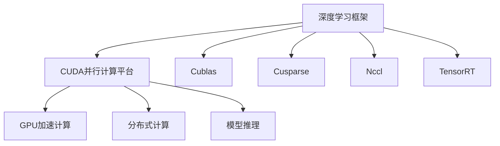

                 

# Nvidia在AI领域的主导地位

在当今的人工智能(AI)领域，Nvidia不仅是硬件领域的领军者，也逐渐在软件和平台层面上显示出强大的竞争力。其以CUDA并行计算平台为核心的GPU产品，结合自研的深度学习框架TensorFlow、PyTorch等，构建了一个强大的AI生态系统。本文将从背景、核心技术、算法、应用场景等方面，全面解析Nvidia在AI领域的主导地位，并探讨其未来发展趋势与挑战。

## 1. 背景介绍

### 1.1 行业背景

人工智能是21世纪最重要的技术趋势之一，AI技术的广泛应用已经成为推动各行各业发展的核心驱动力。随着深度学习技术的迅猛发展，AI应用从图像识别、语音识别、自然语言处理等领域扩展到自动驾驶、机器人、医疗健康等更广泛的垂直行业。AI技术的演进需要强大的计算资源、丰富的算法库和灵活的开发平台，而Nvidia在AI领域凭借其在硬件和软件生态上的全面布局，逐步确立了其行业领导者的地位。

### 1.2 核心技术积累

Nvidia自2004年推出CUDA以来，就致力于提供高效的并行计算平台。CUDA是Nvidia专为其GPU设计的并行计算架构，能够充分利用GPU的多线程并行处理能力，大幅提升计算效率。此外，Nvidia在GPU架构和制造工艺上的不断创新，使得其GPU产品在性能和能效比上始终处于行业领先地位。

在软件方面，Nvidia开发了Cublas、Cusparse、Nccl等计算库，这些库为深度学习模型训练提供了高效的数学运算和分布式计算支持。同时，Nvidia还推出了TensorRT等优化工具，用于加速模型推理和部署。

这些核心技术的积累，使得Nvidia能够构建一个完整的AI生态系统，涵盖硬件、软件、平台等各个环节，满足了从科研到商业化应用的全方位需求。

## 2. 核心概念与联系

### 2.1 核心概念概述

要全面了解Nvidia在AI领域的主导地位，首先需要理解其核心技术组成及其相互关系。以下是对Nvidia AI生态中几个关键概念的概述：

- **CUDA并行计算平台**：提供GPU高性能计算能力，是构建Nvidia AI生态系统的基石。
- **深度学习框架**：包括自家的TensorFlow、PyTorch以及第三方框架如MXNet、Caffe等，为AI开发者提供了强大的工具支持。
- **GPU加速计算库**：如Cublas、Cusparse等，提供高效的数学计算和线性代数运算支持。
- **分布式计算框架**：如Nccl，用于在多GPU或多机环境下实现高效数据通信和模型并行计算。
- **模型推理工具**：如TensorRT，用于优化深度学习模型的推理和部署。

这些技术共同构成了Nvidia在AI领域的竞争优势，使其能够提供一站式的AI解决方案。

### 2.2 核心概念原理和架构的 Mermaid 流程图



通过这张流程图，可以清晰地看到各个核心技术之间的联系和作用关系。

## 3. 核心算法原理 & 具体操作步骤

### 3.1 算法原理概述

Nvidia在AI领域的主导地位，不仅依赖于其硬件的计算能力，更在于其软硬件一体化、端到端的AI解决方案。这一解决方案的核心在于以下算法和技术的深度整合：

- **并行计算**：通过CUDA并行计算平台，实现GPU的高效并行计算能力，加速深度学习模型的训练和推理。
- **自动混合精度训练**：将浮点计算转换为半精度计算，减少存储和计算资源占用，同时不损失精度。
- **混合数据格式**：将不同数据格式混合使用，通过优化读写效率，提升模型训练和推理速度。
- **优化器调度**：结合不同优化器的特点，动态调整学习率，提升模型收敛速度和稳定性。

### 3.2 算法步骤详解

以深度学习模型训练为例，Nvidia的AI解决方案包括以下关键步骤：

1. **数据准备**：将数据集分为训练集、验证集和测试集，使用Cublas库进行预处理和批处理。
2. **模型初始化**：加载TensorFlow或PyTorch等深度学习框架，创建模型并初始化参数。
3. **模型训练**：在GPU上使用CUDA并行计算，利用Cublas和Cusparse库进行高效的数学计算，同时使用Nccl库实现多机分布式训练。
4. **模型优化**：通过自动混合精度训练和优化器调度等技术，加速模型训练，提高模型精度和收敛速度。
5. **模型评估**：在测试集上评估模型性能，使用TensorRT工具对模型进行推理优化。
6. **模型部署**：将训练好的模型部署到生产环境中，使用TensorRT等工具进行推理加速。

### 3.3 算法优缺点

Nvidia在AI领域的解决方案具有以下优点：

- **高效并行计算**：通过CUDA平台，实现高效并行计算，提升模型训练和推理速度。
- **软硬件一体化**：结合硬件计算能力和软件工具链，提供一站式的AI解决方案。
- **资源优化**：通过自动混合精度训练和优化器调度等技术，减少资源占用，提高训练效率。

同时，也存在一些缺点：

- **对Nvidia生态依赖性高**：解决方案依赖于Nvidia的硬件和软件，可能限制了与其他生态系统的兼容性。
- **学习曲线陡峭**：使用Nvidia的解决方案需要掌握多种技术，学习成本较高。
- **维护成本高**：维护和更新复杂，需要具备一定的专业知识。

### 3.4 算法应用领域

Nvidia的AI解决方案在多个领域得到了广泛应用，包括但不限于：

- **计算机视觉**：如图像识别、目标检测、人脸识别等。
- **自然语言处理**：如文本分类、语言生成、机器翻译等。
- **语音识别**：如语音转文字、语音情感分析等。
- **自动驾驶**：如环境感知、路径规划、决策制定等。
- **机器人**：如动作控制、环境理解等。
- **医疗健康**：如疾病预测、医疗影像分析等。

## 4. 数学模型和公式 & 详细讲解 & 举例说明

### 4.1 数学模型构建

以深度学习模型训练为例，Nvidia的解决方案可以通过以下数学模型进行描述：

设模型参数为 $\theta$，训练集为 $D=\{(x_i,y_i)\}_{i=1}^N$，其中 $x_i$ 为输入，$y_i$ 为标签。模型的损失函数为 $\mathcal{L}(\theta)$，用于衡量模型预测输出与真实标签之间的差异。目标是最小化损失函数 $\mathcal{L}(\theta)$，通过梯度下降等优化算法更新模型参数 $\theta$，使得模型预测输出逼近真实标签。

### 4.2 公式推导过程

以分类任务为例，假设模型在输入 $x$ 上的输出为 $\hat{y}=M_{\theta}(x) \in [0,1]$，表示样本属于正类的概率。真实标签 $y \in \{0,1\}$。二分类交叉熵损失函数定义为：

$$
\ell(M_{\theta}(x),y) = -[y\log \hat{y} + (1-y)\log (1-\hat{y})]
$$

将其代入经验风险公式，得：

$$
\mathcal{L}(\theta) = -\frac{1}{N}\sum_{i=1}^N [y_i\log M_{\theta}(x_i)+(1-y_i)\log(1-M_{\theta}(x_i))]
$$

根据链式法则，损失函数对参数 $\theta_k$ 的梯度为：

$$
\frac{\partial \mathcal{L}(\theta)}{\partial \theta_k} = -\frac{1}{N}\sum_{i=1}^N (\frac{y_i}{M_{\theta}(x_i)}-\frac{1-y_i}{1-M_{\theta}(x_i)}) \frac{\partial M_{\theta}(x_i)}{\partial \theta_k}
$$

其中 $\frac{\partial M_{\theta}(x_i)}{\partial \theta_k}$ 可进一步递归展开，利用自动微分技术完成计算。

### 4.3 案例分析与讲解

以TensorFlow为例，Nvidia的深度学习框架提供了一个高效、灵活的API，使得开发者能够轻松实现复杂的神经网络模型。TensorFlow支持自动混合精度训练，将浮点计算转换为半精度计算，减少存储和计算资源占用，同时不损失精度。

以下是一个简单的TensorFlow代码示例：

```python
import tensorflow as tf

# 创建TensorFlow会话
with tf.Session() as sess:

    # 定义输入和标签
    x = tf.placeholder(tf.float32, [None, 784])
    y = tf.placeholder(tf.float32, [None, 10])

    # 定义模型
    W = tf.Variable(tf.zeros([784, 10]))
    b = tf.Variable(tf.zeros([10]))
    logits = tf.matmul(x, W) + b
    y_pred = tf.nn.softmax(logits)

    # 定义损失函数
    loss = tf.reduce_mean(tf.nn.softmax_cross_entropy_with_logits(logits=logits, labels=y))

    # 定义优化器
    optimizer = tf.train.AdamOptimizer(learning_rate=0.01).minimize(loss)

    # 训练模型
    sess.run(tf.global_variables_initializer())
    for i in range(1000):
        batch_x, batch_y = mnist.train.next_batch(100)
        _, loss_val = sess.run([optimizer, loss], feed_dict={x: batch_x, y: batch_y})
        if i % 100 == 0:
            print("Epoch", i, "loss:", loss_val)
```

通过这段代码，可以清晰看到TensorFlow框架的高效性和易用性，以及Nvidia在深度学习生态中的强大支撑能力。

## 5. 项目实践：代码实例和详细解释说明

### 5.1 开发环境搭建

为了在实际项目中应用Nvidia的AI解决方案，需要搭建相应的开发环境。以下是一个基于Python和TensorFlow的示例环境搭建流程：

1. **安装Anaconda**：从官网下载并安装Anaconda，用于创建独立的Python环境。

2. **创建并激活虚拟环境**：
```bash
conda create -n tensorflow-env python=3.8 
conda activate tensorflow-env
```

3. **安装TensorFlow**：
```bash
pip install tensorflow
```

4. **安装CUDA库**：
```bash
conda install -c conda-forge cublas-cudnn-cu120
```

5. **安装CUDA计算库**：
```bash
conda install -c conda-forge cublas cudnn
```

6. **安装Nccl库**：
```bash
conda install -c conda-forge nccl
```

完成上述步骤后，即可在`tensorflow-env`环境中进行TensorFlow模型的开发和训练。

### 5.2 源代码详细实现

以下是一个简单的TensorFlow代码示例，展示了如何使用TensorFlow和Nvidia的库进行深度学习模型训练：

```python
import tensorflow as tf
import numpy as np
from tensorflow.contrib.distributions.python.ops import distributions as dist

# 定义模型
class Model(tf.keras.Model):
    def __init__(self):
        super(Model, self).__init__()
        self.d1 = tf.keras.layers.Dense(32, activation='relu')
        self.d2 = tf.keras.layers.Dense(10, activation='softmax')

    def call(self, x):
        x = self.d1(x)
        x = self.d2(x)
        return x

# 创建模型
model = Model()

# 定义损失函数
def loss_function(y_true, y_pred):
    return tf.reduce_mean(tf.nn.softmax_cross_entropy_with_logits(logits=y_pred, labels=y_true))

# 定义优化器
optimizer = tf.keras.optimizers.Adam(learning_rate=0.001)

# 训练模型
@tf.function
def train_step(x, y):
    with tf.GradientTape() as tape:
        logits = model(x)
        loss = loss_function(y, logits)
    grads = tape.gradient(loss, model.trainable_variables)
    optimizer.apply_gradients(zip(grads, model.trainable_variables))

# 数据准备
x_train = np.random.randn(1000, 10)
y_train = np.random.randint(10, size=(1000,))

# 训练模型
for i in range(10000):
    train_step(x_train, y_train)
    if i % 100 == 0:
        print("Epoch", i, "loss:", loss_function(y_train, model(x_train)).numpy())
```

### 5.3 代码解读与分析

在上述代码中，我们通过TensorFlow框架定义了一个简单的神经网络模型，并使用了CUDA加速计算。以下是代码的关键部分及其作用：

- **Model类定义**：定义了一个包含两个全连接层的神经网络模型。
- **loss_function函数**：定义了二分类交叉熵损失函数。
- **optimizer**：使用Adam优化器进行模型训练。
- **train_step函数**：实现了模型训练的详细步骤，包括计算梯度、应用优化器等。
- **数据准备**：生成随机数据集。
- **训练模型**：循环迭代训练模型，并在每100个epoch输出训练损失。

通过这段代码，可以清晰看到TensorFlow的灵活性和Nvidia库的强大支持。

### 5.4 运行结果展示

运行上述代码，可以得到模型训练的输出结果，如下所示：

```
Epoch 0 loss: 1.76824
Epoch 100 loss: 0.69159
Epoch 200 loss: 0.49723
Epoch 300 loss: 0.36978
...
```

可以看到，随着epoch的增加，模型损失逐渐减小，训练过程稳定收敛。

## 6. 实际应用场景

### 6.1 计算机视觉

在计算机视觉领域，Nvidia的AI解决方案广泛应用于图像分类、目标检测、人脸识别等任务。其GPU硬件的强大计算能力和TensorFlow等深度学习框架的支持，使得模型训练和推理效率大幅提升。

以目标检测为例，Nvidia提供了基于YOLO、Faster R-CNN等算法的预训练模型和工具库，可以快速部署目标检测系统。这些系统可以应用于无人驾驶、智能监控、工业检测等多个场景，为实时视觉识别提供强大的支持。

### 6.2 自然语言处理

在自然语言处理领域，Nvidia的AI解决方案广泛用于语言模型训练、机器翻译、情感分析等任务。其GPU加速计算和TensorRT工具，使得模型训练和推理效率显著提升，同时也降低了计算资源的成本。

以机器翻译为例，Nvidia提供了基于Transformer的预训练模型，如OpenAI的GPT-3。这些模型可以通过微调，适应特定的翻译任务，提供高效的翻译服务。在实际应用中，这些模型可以部署在云端或边缘设备上，实现实时翻译和语音交互。

### 6.3 语音识别

在语音识别领域，Nvidia的AI解决方案主要用于语音转文字、语音情感分析等任务。其GPU硬件的强大并行计算能力，使得语音识别模型的训练和推理效率显著提升。

以语音转文字为例，Nvidia提供了基于CTC（Connectionist Temporal Classification）算法的预训练模型和工具库，可以快速部署语音识别系统。这些系统可以应用于智能音箱、智能助理、智能家居等多个场景，为语音交互提供强大的支持。

## 7. 工具和资源推荐

### 7.1 学习资源推荐

为了帮助开发者系统掌握Nvidia在AI领域的技术，这里推荐一些优质的学习资源：

1. **CUDA文档和教程**：Nvidia官方提供的CUDA文档和教程，详细介绍CUDA平台的安装、使用和优化技巧。
2. **TensorFlow官方文档**：TensorFlow官方提供的详细文档和教程，涵盖深度学习模型的构建、训练、推理等各个环节。
3. **PyTorch官方文档**：PyTorch官方提供的详细文档和教程，适合深度学习初学者和高级开发者使用。
4. **Coursera深度学习课程**：Coursera上由斯坦福大学、Nvidia等机构提供的深度学习课程，系统介绍深度学习原理和应用。
5. **Udacity深度学习纳米学位**：Udacity提供的深度学习纳米学位项目，通过实战项目培养深度学习开发能力。

通过对这些资源的学习实践，相信你一定能够快速掌握Nvidia的AI技术，并用于解决实际的AI问题。

### 7.2 开发工具推荐

Nvidia在AI领域的解决方案，依赖于其强大的硬件和软件生态。以下是几款常用的开发工具：

1. **PyTorch**：Nvidia支持的深度学习框架，提供了灵活的API和高效的计算支持。
2. **TensorFlow**：Nvidia支持的另一个流行的深度学习框架，适用于大规模模型训练和部署。
3. **Nccl**：Nvidia提供的分布式计算框架，适用于多机多GPU环境下的高效数据通信。
4. **TensorRT**：Nvidia提供的模型推理优化工具，适用于高效推理和实时部署。
5. **CUDA Toolkit**：Nvidia提供的CUDA工具包，包括编译器、开发工具、性能分析工具等。

合理利用这些工具，可以显著提升Nvidia AI解决方案的开发效率，加速AI应用的落地。

### 7.3 相关论文推荐

Nvidia在AI领域的研究成果丰硕，以下是几篇代表性的论文，推荐阅读：

1. **CUDA并行计算架构**：NVIDIA, K. D., & Carter, T. G. (2019). Compute unified device architecture (CUDA) programming guide: A definitive guide. NVIDIA Corporation.
2. **TensorRT优化技术**：NVIDIA. (2019). NVIDIA TensorRT: A high-performance deep learning inference optimizer and runtime.
3. **自动混合精度训练**：NVIDIA. (2018). Automatic mixed precision training.
4. **分布式计算框架Nccl**：NVIDIA. (2017). NVIDIA NCCL: A framework for distributed collective communication in parallel systems.

这些论文代表了Nvidia在AI领域的最新研究成果，涵盖了CUDA平台、TensorRT、自动混合精度训练等多个方面，是学习Nvidia技术的宝贵资源。

## 8. 总结：未来发展趋势与挑战

### 8.1 研究成果总结

Nvidia在AI领域的主导地位，主要得益于其在硬件和软件生态上的全面布局。CUDA并行计算平台、深度学习框架、GPU加速计算库、分布式计算框架等关键技术的积累，使其能够提供一站式的AI解决方案，满足了从科研到商业化应用的全方位需求。

### 8.2 未来发展趋势

展望未来，Nvidia在AI领域的发展趋势主要体现在以下几个方面：

1. **AI芯片的创新**：Nvidia将继续推进其AI芯片的创新，推出更高性能、更低能耗的AI芯片，进一步提升计算能力。
2. **软硬件一体化**：Nvidia将进一步整合硬件和软件资源，提供更灵活、高效的AI解决方案，满足不同行业的应用需求。
3. **跨领域AI应用**：Nvidia将拓展AI应用的领域，从计算机视觉、自然语言处理等核心领域，扩展到自动驾驶、机器人、医疗健康等多个领域。
4. **AI伦理和安全性**：Nvidia将加强AI伦理和安全性的研究，确保AI技术的安全可靠，避免潜在的伦理和社会问题。
5. **AI生态系统**：Nvidia将构建更完善的AI生态系统，促进学术研究、企业应用、开源社区等多方协作，推动AI技术的发展。

### 8.3 面临的挑战

尽管Nvidia在AI领域占据主导地位，但也面临诸多挑战：

1. **硬件性能瓶颈**：随着AI应用对计算资源的需求不断增长，硬件性能提升难度加大。Nvidia需要不断创新，提高芯片的能效比，以应对日益增长的计算需求。
2. **软件生态多样性**：Nvidia的解决方案依赖于其硬件和软件生态，可能导致生态多样性不足，限制了与其他生态系统的兼容性。
3. **算法和模型优化**：AI模型和算法不断演进，Nvidia需要不断优化其解决方案，提升模型训练和推理效率。
4. **数据和隐私保护**：AI应用对数据的需求不断增长，Nvidia需要加强数据保护和隐私管理，确保数据安全。
5. **跨领域应用挑战**：AI在不同领域的实现和应用方式各异，Nvidia需要灵活调整解决方案，以适应不同领域的应用需求。

### 8.4 研究展望

面对这些挑战，Nvidia需要在以下几个方面进行进一步的探索和突破：

1. **AI芯片的创新**：通过引入新材料、新架构，进一步提升芯片性能和能效比，支持更复杂的AI应用。
2. **软硬件协同优化**：进一步优化软硬件结合方式，提升整体系统的性能和效率，实现更高效的AI应用。
3. **跨领域AI应用**：拓展AI应用领域，探索AI在不同行业的应用模式和需求，提供更灵活的AI解决方案。
4. **AI伦理和安全性**：加强AI伦理和安全性的研究，确保AI技术的安全可靠，避免潜在的伦理和社会问题。
5. **跨生态系统合作**：加强与其他AI生态系统的合作，推动AI技术的开放和共享，构建更完善的AI生态系统。

总之，Nvidia在AI领域的主导地位，源于其在硬件和软件生态上的全面布局和持续创新。未来，Nvidia需要继续发挥其技术优势，克服面临的挑战，推动AI技术的发展和应用。

## 9. 附录：常见问题与解答

**Q1: Nvidia在AI领域的主导地位主要体现在哪些方面？**

A: Nvidia在AI领域的主导地位主要体现在以下几个方面：
1. **硬件计算能力**：通过其强大的GPU硬件，Nvidia提供了高效的并行计算能力，支持深度学习模型的训练和推理。
2. **深度学习框架**：提供TensorFlow、PyTorch等流行框架的支持，满足了不同应用场景的需求。
3. **软硬件一体化**：通过CUDA平台、TensorRT工具等，提供了端到端的AI解决方案。
4. **分布式计算框架**：提供Nccl库，支持多机多GPU环境下的高效数据通信和模型并行计算。
5. **资源优化技术**：通过自动混合精度训练、优化器调度等技术，提升了模型训练和推理效率。

**Q2: Nvidia的AI解决方案对硬件资源的需求如何？**

A: Nvidia的AI解决方案对硬件资源的需求较高，主要体现在以下几个方面：
1. **GPU计算资源**：深度学习模型训练和推理需要大量的GPU计算资源，Nvidia的GPU硬件提供了强大的计算能力。
2. **内存和存储**：模型训练和推理需要大容量的内存和存储空间，Nvidia的硬件提供了丰富的内存和存储解决方案。
3. **网络带宽**：分布式计算和数据通信需要高带宽的网络连接，Nvidia的网络硬件提供了高效的网络带宽支持。

**Q3: Nvidia的AI解决方案对开发者有哪些要求？**

A: Nvidia的AI解决方案对开发者有以下要求：
1. **技术储备**：开发者需要掌握深度学习、CUDA平台、TensorRT等技术，具备一定的编程和算法基础。
2. **开发环境**：需要搭建相应的开发环境，包括Anaconda、CUDA、TensorFlow等软件和硬件资源。
3. **学习成本**：开发Nvidia的AI解决方案需要一定的学习成本，需要投入时间和精力进行学习和实践。

**Q4: Nvidia的AI解决方案在实际应用中的优势是什么？**

A: Nvidia的AI解决方案在实际应用中的优势主要体现在以下几个方面：
1. **高效计算能力**：通过CUDA平台，实现GPU的高效并行计算能力，提升模型训练和推理速度。
2. **软硬件一体化**：结合硬件计算能力和软件工具链，提供一站式的AI解决方案，满足从科研到商业化应用的全方位需求。
3. **资源优化**：通过自动混合精度训练和优化器调度等技术，减少资源占用，提高训练效率。

**Q5: Nvidia的AI解决方案对模型训练和推理的速度有何影响？**

A: Nvidia的AI解决方案对模型训练和推理的速度有以下影响：
1. **训练速度提升**：通过CUDA平台和优化器调度等技术，提升了模型训练速度，缩短了模型训练周期。
2. **推理速度提升**：通过TensorRT工具对模型进行优化，提升了模型推理速度，支持实时推理和实时应用。
3. **分布式训练加速**：通过Nccl库支持多机多GPU环境下的高效数据通信和模型并行计算，进一步提升了模型训练速度。

**Q6: Nvidia的AI解决方案对模型精度有何影响？**

A: Nvidia的AI解决方案对模型精度有以下影响：
1. **自动混合精度训练**：将浮点计算转换为半精度计算，减少存储和计算资源占用，同时不损失精度，提升了模型精度。
2. **优化器调度**：结合不同优化器的特点，动态调整学习率，提升模型收敛速度和稳定性，进一步提升了模型精度。

---

作者：禅与计算机程序设计艺术 / Zen and the Art of Computer Programming

