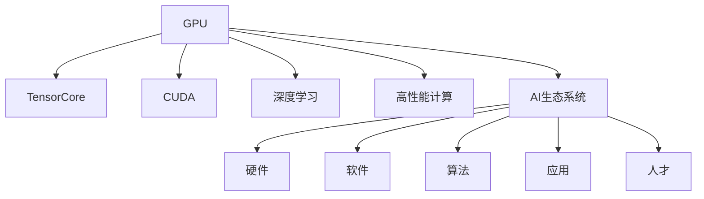

                 

## 1. 背景介绍

### 1.1 问题由来

随着人工智能(AI)技术的不断进步，GPU在AI计算中的地位日益重要。早在20世纪90年代，GPU就因其高并行性、低延迟和高效率而受到关注。最初，GPU主要用于图形渲染，但随着NVIDIA对GPU的不断优化，GPU开始涉足科学计算、机器学习等AI领域。

NVIDIA的GPU（图形处理单元）最早是作为图形处理芯片设计的，后来逐渐扩展到更广泛的计算任务。图形渲染需要使用大量的并行计算，而GPU正是由数千个计算单元组成的超大规模并行处理器。这种硬件设计使得GPU能够高效处理大量的矩阵乘法和浮点数运算。

### 1.2 问题核心关键点

NVIDIA GPU与AI发展的关键在于以下几个方面：

- **GPU架构创新**：NVIDIA不断优化GPU架构，提升其计算能力，使GPU成为AI计算的黄金搭档。
- **TensorCore和CUDA**：TensorCore专门用于AI计算，CUDA平台使得AI开发者能够高效利用GPU资源。
- **高性能计算**：通过深度学习等AI技术，GPU被应用于药物发现、基因组学、气象学、气候模拟等高性能计算领域。
- **AI生态建设**：NVIDIA通过硬件与软件的深度集成，推动了AI生态系统的构建，涵盖了从研究到应用的各个环节。

### 1.3 问题研究意义

研究NVIDIA GPU与AI的发展，对于理解AI计算硬件的基础架构、提升AI应用性能、推动AI生态系统建设具有重要意义：

- **优化计算资源**：通过了解GPU与AI的结合方式，可以更好地优化AI计算资源，提升算法执行效率。
- **推动技术应用**：掌握GPU与AI的协同效应，能够推动AI技术在各个领域的应用，如医疗、金融、交通等。
- **促进生态建设**：通过深度集成硬件与软件，加速AI技术的落地，构建更完整的AI生态系统。
- **增强竞争力**：随着AI在各行各业的重要性日益增加，掌握GPU与AI的发展趋势，有助于增强技术竞争力，推动企业创新。

## 2. 核心概念与联系

### 2.1 核心概念概述

为更好地理解NVIDIA GPU与AI的发展，本节将介绍几个核心概念：

- **GPU（图形处理单元）**：一种并行计算单元，主要用于图形渲染，但逐渐扩展到通用计算任务。
- **TensorCore**：NVIDIA GPU上的专门用于AI计算的硬件加速单元，支持高效的矩阵和向量运算。
- **CUDA（Compute Unified Device Architecture）**：NVIDIA开发的一种并行计算平台，使得开发者能够高效利用GPU资源。
- **深度学习**：一种基于神经网络的机器学习技术，能够处理复杂的非线性关系。
- **高性能计算**：通过使用并行计算加速技术，解决大规模科学计算问题。
- **AI生态系统**：包括硬件、软件、算法、应用和人才等环节，是AI技术实现完整闭环的系统。

这些核心概念之间的逻辑关系可以通过以下Mermaid流程图来展示：



这个流程图展示了大语言模型的核心概念及其之间的关系：

1. GPU是硬件基础，TensorCore提供专用AI计算加速。
2. CUDA平台使得开发者可以高效利用GPU资源。
3. 深度学习利用GPU的高效计算能力进行模型训练。
4. 高性能计算将GPU用于解决大规模科学计算问题。
5. AI生态系统包括GPU、CUDA、深度学习等关键组件。

## 3. 核心算法原理 & 具体操作步骤

### 3.1 算法原理概述

NVIDIA GPU与AI的结合主要依赖于TensorCore和CUDA平台。TensorCore提供了专门用于AI计算的硬件加速单元，而CUDA则提供了高效的软件平台，使得AI开发者能够利用GPU资源进行高效的计算。

基于GPU与AI的结合，NVIDIA提出了多层次的算法和模型优化策略，包括：

- **矩阵乘法加速**：利用TensorCore的矩阵运算加速，提升深度学习模型的训练和推理速度。
- **并行计算优化**：通过CUDA平台，将深度学习任务分解为多个并行子任务，提升计算效率。
- **模型压缩与量化**：减少深度学习模型的大小，降低计算复杂度，同时保持模型性能。
- **混合精度计算**：使用半精度浮点数进行计算，进一步提升训练速度和资源利用率。

### 3.2 算法步骤详解

基于GPU与AI的结合，NVIDIA的深度学习模型训练和推理步骤如下：

**Step 1: 数据准备**

1. **数据集准备**：收集和预处理训练数据集，通常包括图像、文本、音频等多种类型的数据。
2. **数据增强**：通过旋转、翻转、裁剪等方式，扩充数据集，提升模型泛化能力。
3. **数据划分**：将数据集划分为训练集、验证集和测试集，用于模型训练、调优和评估。

**Step 2: 模型构建**

1. **选择模型架构**：根据任务类型选择合适的深度学习模型，如卷积神经网络(CNN)、循环神经网络(RNN)、变分自编码器(VAE)等。
2. **配置TensorCore**：将深度学习模型的关键操作配置到TensorCore上，提升计算效率。
3. **编写CUDA程序**：使用CUDA编程语言编写模型计算程序，确保计算任务能够高效并行执行。

**Step 3: 训练与优化**

1. **设置超参数**：设置学习率、批大小、迭代轮数等训练参数。
2. **初始化模型参数**：随机初始化模型参数，或利用预训练模型进行初始化。
3. **进行训练**：将训练集数据分批次输入模型，前向传播计算损失函数，反向传播更新模型参数。
4. **调优与验证**：在验证集上评估模型性能，根据评估结果调整超参数，继续训练模型。
5. **测试与部署**：在测试集上评估模型性能，并将训练好的模型部署到生产环境。

**Step 4: 模型评估与优化**

1. **模型评估**：在测试集上评估模型性能，计算准确率、召回率、F1分数等指标。
2. **模型优化**：根据评估结果，调整模型结构、超参数等，进一步提升模型性能。
3. **部署与优化**：将优化后的模型部署到生产环境，并进行性能监控和优化。

### 3.3 算法优缺点

NVIDIA GPU与AI结合的算法具有以下优点：

- **计算效率高**：GPU的并行计算能力使得深度学习模型的训练和推理速度大幅提升。
- **资源利用率高**：通过TensorCore和CUDA平台，能够高效利用GPU资源，降低计算成本。
- **模型可扩展性强**：深度学习模型可以轻松扩展到多个GPU，提升计算能力。

同时，这种算法也存在一些缺点：

- **硬件成本高**：高端GPU价格昂贵，对企业的预算构成较大压力。
- **软件开发复杂**：使用CUDA编程需要一定的开发经验，对于新手较为困难。
- **兼容性问题**：部分软件和工具可能无法完全适配NVIDIA的GPU，需要额外适配工作。

### 3.4 算法应用领域

NVIDIA GPU与AI的结合已经在多个领域得到应用，包括：

- **计算机视觉**：用于图像分类、目标检测、图像分割等任务。
- **自然语言处理**：用于机器翻译、情感分析、文本生成等任务。
- **医疗健康**：用于疾病预测、药物发现、基因组学等任务。
- **自动驾驶**：用于图像识别、路径规划、环境感知等任务。
- **金融服务**：用于风险评估、市场预测、欺诈检测等任务。
- **气象与气候模拟**：用于气候模型构建、气象数据预测等任务。
- **能源与环境**：用于能源管理、环境监测、灾害预测等任务。

此外，NVIDIA GPU与AI的结合还应用于科学研究、工业自动化、智能家居等多个领域，展示了其广泛的应用前景。

## 4. 数学模型和公式 & 详细讲解 & 举例说明

### 4.1 数学模型构建

在深度学习模型中，计算图是表示模型计算流程的重要工具。计算图通常由节点和边组成，节点表示计算操作，边表示数据流。以下是基于GPU与AI的深度学习模型计算图的示例：

```
Layer 1 -> TensorCore1 -> Layer 2
             ^
             v
Layer 3 -> TensorCore2 -> Layer 4
```

其中，Layer表示神经网络层，TensorCore表示TensorCore加速计算。

### 4.2 公式推导过程

深度学习模型的计算过程可以通过矩阵乘法和矩阵加法来表示。以卷积神经网络(CNN)为例，假设输入数据为 $X$，卷积核为 $K$，输出特征图为 $Y$，则卷积操作可以表示为：

$$
Y = X \ast K
$$

其中，$\ast$ 表示卷积运算。具体到GPU和TensorCore的结合，卷积操作可以通过如下公式计算：

$$
Y = \frac{X \ast K}{n} + \text{bias}
$$

其中，$n$ 表示TensorCore的并行计算单元数，bias表示偏置项。通过优化计算流程，可以在TensorCore上高效实现卷积操作，提升计算速度和资源利用率。

### 4.3 案例分析与讲解

以下是一个简单的CNN模型训练过程：

1. **数据准备**：收集和预处理训练数据集。
2. **模型构建**：定义CNN模型结构，包括卷积层、池化层、全连接层等。
3. **TensorCore配置**：将卷积层配置到TensorCore上，进行并行计算。
4. **CUDA程序编写**：编写CUDA程序，实现CNN模型的前向传播和反向传播。
5. **模型训练**：将训练集数据分批次输入模型，前向传播计算损失函数，反向传播更新模型参数。
6. **模型评估**：在测试集上评估模型性能，计算准确率、召回率、F1分数等指标。

## 5. 项目实践：代码实例和详细解释说明

### 5.1 开发环境搭建

在进行GPU与AI的结合实践前，我们需要准备好开发环境。以下是使用Python进行CUDA开发的环境配置流程：

1. 安装CUDA工具包：从NVIDIA官网下载并安装CUDA工具包，确保CUDA版本与GPU驱动版本兼容。
2. 安装CUDNN库：从NVIDIA官网下载并安装CUDNN库，用于加速深度学习算法的计算。
3. 安装PyTorch：使用pip安装PyTorch，并确保PyTorch版本与CUDA版本兼容。
4. 安装相关依赖：安装TensorBoard、scikit-learn等Python库，用于模型训练和评估。

### 5.2 源代码详细实现

下面我们以卷积神经网络模型为例，给出使用CUDA编程语言对NVIDIA GPU进行卷积运算的PyTorch代码实现。

```python
import torch
import torch.nn as nn
import torchvision.transforms as transforms
import torchvision.datasets as datasets
import torch.nn.functional as F
from torchvision.models import vgg

# 定义CNN模型
class CNN(nn.Module):
    def __init__(self):
        super(CNN, self).__init__()
        self.conv1 = nn.Conv2d(3, 64, kernel_size=3, stride=1, padding=1)
        self.conv2 = nn.Conv2d(64, 128, kernel_size=3, stride=1, padding=1)
        self.pool = nn.MaxPool2d(kernel_size=2, stride=2)
        self.fc1 = nn.Linear(128*28*28, 512)
        self.fc2 = nn.Linear(512, 10)
        self.relu = nn.ReLU()

    def forward(self, x):
        x = self.relu(self.conv1(x))
        x = self.pool(x)
        x = self.relu(self.conv2(x))
        x = self.pool(x)
        x = x.view(-1, 128*28*28)
        x = self.relu(self.fc1(x))
        x = self.fc2(x)
        return x

# 加载数据集
train_dataset = datasets.CIFAR10(root='./data', train=True, download=True, transform=transforms.ToTensor())
test_dataset = datasets.CIFAR10(root='./data', train=False, download=True, transform=transforms.ToTensor())

# 定义模型、优化器和损失函数
model = CNN().cuda()
optimizer = torch.optim.SGD(model.parameters(), lr=0.01, momentum=0.9)
criterion = nn.CrossEntropyLoss()

# 定义训练函数
def train_model(model, data_loader, optimizer, criterion, n_epochs=10, device='cuda'):
    model.to(device)
    for epoch in range(n_epochs):
        model.train()
        for data, target in data_loader:
            data, target = data.to(device), target.to(device)
            optimizer.zero_grad()
            output = model(data)
            loss = criterion(output, target)
            loss.backward()
            optimizer.step()

# 定义测试函数
def test_model(model, data_loader, criterion, device='cuda'):
    model.eval()
    with torch.no_grad():
        correct = 0
        total = 0
        for data, target in data_loader:
            data, target = data.to(device), target.to(device)
            output = model(data)
            _, predicted = torch.max(output.data, 1)
            total += target.size(0)
            correct += (predicted == target).sum().item()
        accuracy = 100 * correct / total
        return accuracy

# 加载数据加载器
train_loader = torch.utils.data.DataLoader(train_dataset, batch_size=64, shuffle=True)
test_loader = torch.utils.data.DataLoader(test_dataset, batch_size=64, shuffle=False)

# 训练和测试模型
train_model(model, train_loader, optimizer, criterion)
accuracy = test_model(model, test_loader, criterion)
print(f'Accuracy: {accuracy:.2f}%')
```

### 5.3 代码解读与分析

让我们再详细解读一下关键代码的实现细节：

**CNN类定义**：
- `__init__`方法：初始化卷积层、池化层和全连接层。
- `forward`方法：定义前向传播过程，包括卷积、池化、全连接等操作。

**数据集加载**：
- 使用CIFAR-10数据集，进行数据预处理和加载。
- 将数据集划分为训练集和测试集。

**模型训练和测试**：
- 定义训练函数和测试函数，分别进行模型训练和测试。
- 使用CUDA将模型和数据加载到GPU上，进行高效的并行计算。

**训练函数**：
- 使用SGD优化器更新模型参数，定义损失函数为交叉熵损失。
- 在每个epoch内，对训练集数据进行迭代训练，更新模型参数。

**测试函数**：
- 在测试集上评估模型性能，计算准确率。
- 使用CUDA加速模型的推理过程，提升计算效率。

## 6. 实际应用场景

### 6.1 智能驾驶

NVIDIA的GPU与AI结合在智能驾驶领域有广泛应用。自动驾驶汽车需要实时处理大量的传感器数据，包括激光雷达、摄像头、雷达等，进行环境感知和决策。

具体应用场景包括：

- **环境感知**：使用深度学习模型对传感器数据进行语义分割，识别道路、车辆、行人等物体。
- **路径规划**：利用深度学习模型进行路径规划，生成最优行驶路线。
- **行为预测**：使用深度学习模型预测其他车辆和行人的行为，提高决策准确性。
- **异常检测**：利用深度学习模型检测传感器数据异常，确保行车安全。

### 6.2 医疗影像

在医疗影像领域，NVIDIA的GPU与AI结合也发挥了重要作用。医学影像的图像数据量大，计算复杂度高，NVIDIA的GPU提供了高效的计算能力。

具体应用场景包括：

- **图像分类**：使用深度学习模型对医学影像进行分类，如肿瘤检测、病变分析等。
- **图像分割**：利用深度学习模型对医学影像进行分割，提取感兴趣区域。
- **图像配准**：使用深度学习模型对医学影像进行配准，提高诊断准确性。
- **图像生成**：利用深度学习模型生成医学影像，用于教学和训练。

### 6.3 金融风控

在金融风控领域，NVIDIA的GPU与AI结合可以提高风险评估的准确性。金融数据的处理涉及大量的矩阵计算和向量计算，NVIDIA的GPU可以高效处理这些计算任务。

具体应用场景包括：

- **信用评估**：使用深度学习模型对用户数据进行分析，评估其信用风险。
- **欺诈检测**：利用深度学习模型对交易数据进行分析，检测异常行为。
- **市场预测**：使用深度学习模型对市场数据进行预测，提供投资建议。
- **资产定价**：利用深度学习模型对资产数据进行分析，评估其价值。

### 6.4 未来应用展望

随着NVIDIA GPU与AI结合技术的不断发展，未来将在更多领域得到应用，为各个行业带来新的变革：

- **工业自动化**：使用深度学习模型进行工业质检、故障诊断、设备维护等任务，提高生产效率。
- **智慧城市**：利用深度学习模型进行城市交通管理、环境监测、灾害预警等任务，提升城市管理水平。
- **智能家居**：使用深度学习模型进行智能家居控制、语音识别、场景感知等任务，提升家居体验。
- **农业智能**：利用深度学习模型进行农作物监测、病虫害检测、农产品质量分析等任务，提高农业生产效率。
- **智能能源**：使用深度学习模型进行能源管理、智能电网、分布式能源系统等任务，优化能源利用效率。

## 7. 工具和资源推荐

### 7.1 学习资源推荐

为了帮助开发者系统掌握NVIDIA GPU与AI结合的理论基础和实践技巧，这里推荐一些优质的学习资源：

1. **NVIDIA Deep Learning SDK**：NVIDIA提供的深度学习开发工具包，涵盖GPU加速计算、深度学习框架等。
2. **CUDA C++ Programming Guide**：NVIDIA官方编写的CUDA编程指南，介绍了CUDA编程的基础知识和最佳实践。
3. **CUDA Deep Learning Tutorial**：NVIDIA官方提供的深度学习教程，涵盖GPU加速计算和深度学习模型训练。
4. **PyTorch Deep Learning**：PyTorch官方文档，提供了丰富的深度学习模型和GPU加速计算的示例代码。
5. **TensorFlow GPU加速**：TensorFlow官方文档，提供了GPU加速计算的示例代码和最佳实践。
6. **Keras with TensorFlow GPU**：Keras官方文档，提供了深度学习模型和GPU加速计算的示例代码。

通过对这些资源的学习实践，相信你一定能够快速掌握NVIDIA GPU与AI结合的精髓，并用于解决实际的深度学习问题。

### 7.2 开发工具推荐

高效的开发离不开优秀的工具支持。以下是几款用于NVIDIA GPU与AI结合开发的常用工具：

1. **NVIDIA CUDA Toolkit**：NVIDIA提供的CUDA开发环境，支持CUDA编程和GPU加速计算。
2. **PyTorch**：开源深度学习框架，支持GPU加速计算和深度学习模型的训练。
3. **TensorFlow**：开源深度学习框架，支持GPU加速计算和深度学习模型的训练。
4. **Keras**：高层次深度学习框架，支持GPU加速计算和深度学习模型的训练。
5. **Jupyter Notebook**：开源的交互式计算环境，支持GPU加速计算和深度学习模型的训练。

合理利用这些工具，可以显著提升NVIDIA GPU与AI结合的开发效率，加快创新迭代的步伐。

### 7.3 相关论文推荐

NVIDIA GPU与AI结合的研究源于学界的持续研究。以下是几篇奠基性的相关论文，推荐阅读：

1. **CUDA-Accelerated Deep Neural Networks**：NVIDIA的研究团队发表的论文，介绍了CUDA加速深度学习模型训练的方法。
2. **Deep Learning with CUDA GPUs**：NVIDIA的研究团队发表的论文，介绍了GPU加速深度学习模型的训练和推理。
3. **NVIDIA Tesla T4 GPU: 专用于深度学习的GPU**：NVIDIA的研究团队发表的论文，介绍了T4 GPU在深度学习任务中的应用。
4. **AI Made Easy with CUDA**：NVIDIA的官方文档，介绍了如何使用CUDA进行深度学习模型的训练和推理。
5. **CUDA Best Practices**：NVIDIA官方文档，介绍了CUDA编程的最佳实践。

这些论文代表了大语言模型微调技术的发展脉络。通过学习这些前沿成果，可以帮助研究者把握学科前进方向，激发更多的创新灵感。

## 8. 总结：未来发展趋势与挑战

### 8.1 总结

本文对NVIDIA GPU与AI结合的发展进行了全面系统的介绍。首先阐述了GPU与AI结合的研究背景和意义，明确了GPU在AI计算中的重要作用。其次，从原理到实践，详细讲解了GPU与AI结合的数学原理和关键步骤，给出了GPU与AI结合的完整代码实例。同时，本文还广泛探讨了GPU与AI结合在智能驾驶、医疗影像、金融风控等多个领域的应用前景，展示了GPU与AI结合的巨大潜力。此外，本文精选了GPU与AI结合的学习资源，力求为读者提供全方位的技术指引。

通过本文的系统梳理，可以看到，NVIDIA GPU与AI结合的实践正成为AI计算硬件的重要组成部分，极大地提升了AI应用性能和计算效率。未来，伴随GPU与AI结合技术的不断发展，相信AI技术将在更多领域得到应用，为各个行业带来新的变革。

### 8.2 未来发展趋势

展望未来，NVIDIA GPU与AI结合将呈现以下几个发展趋势：

1. **计算能力持续增强**：随着NVIDIA GPU的不断优化，其计算能力将持续提升，推动AI计算的进一步发展。
2. **AI生态系统完善**：NVIDIA将进一步完善AI生态系统，涵盖硬件、软件、算法、应用等环节，加速AI技术的落地。
3. **混合AI计算模型**：将AI技术与传统计算技术相结合，构建混合AI计算模型，提升计算效率和性能。
4. **AI计算平台普及**：NVIDIA将推动AI计算平台的普及，让更多的开发者和企业能够方便地使用GPU加速计算。
5. **AI与边缘计算结合**：将AI技术与边缘计算结合，提升实时数据处理和决策能力，提高系统响应速度。
6. **AI伦理与安全**：随着AI技术的广泛应用，伦理与安全问题日益重要，NVIDIA将加强AI技术的伦理与安全研究，确保AI技术的安全可靠。

以上趋势凸显了NVIDIA GPU与AI结合技术的广阔前景。这些方向的探索发展，必将进一步提升AI技术的计算能力和应用范围，为各个行业带来新的变革。

### 8.3 面临的挑战

尽管NVIDIA GPU与AI结合技术已经取得了瞩目成就，但在迈向更加智能化、普适化应用的过程中，它仍面临着诸多挑战：

1. **硬件成本高**：高端GPU价格昂贵，对企业的预算构成较大压力。
2. **软件开发复杂**：使用CUDA编程需要一定的开发经验，对于新手较为困难。
3. **兼容性问题**：部分软件和工具可能无法完全适配NVIDIA的GPU，需要额外适配工作。
4. **模型复杂度高**：深度学习模型结构复杂，训练和推理过程耗时较长。
5. **资源优化困难**：在大规模深度学习任务中，GPU资源的优化配置和利用率提升仍是一大难题。
6. **性能瓶颈**：在大规模数据集和高精度计算任务中，GPU计算性能仍有瓶颈。

正视NVIDIA GPU与AI结合面临的这些挑战，积极应对并寻求突破，将使NVIDIA在AI计算领域的领先地位更加稳固。

### 8.4 研究展望

面对NVIDIA GPU与AI结合所面临的种种挑战，未来的研究需要在以下几个方面寻求新的突破：

1. **优化计算资源**：进一步优化GPU架构和计算流程，提升计算效率和资源利用率。
2. **降低开发门槛**：开发更加易用的开发工具和库，降低CUDA编程的难度，提高开发效率。
3. **提高模型压缩能力**：开发更加高效的模型压缩算法，减少模型大小，降低计算复杂度。
4. **优化资源配置**：研究更有效的资源优化策略，提升GPU资源的利用率和计算效率。
5. **开发混合计算模型**：将AI技术与传统计算技术相结合，构建混合计算模型，提升计算效率和性能。
6. **增强模型可解释性**：开发更加可解释的深度学习模型，提升模型的透明度和可信度。
7. **解决伦理与安全问题**：加强AI技术的伦理与安全研究，确保AI技术的安全可靠。

这些研究方向的探索，必将引领NVIDIA GPU与AI结合技术迈向更高的台阶，为构建安全、可靠、可解释、可控的智能系统铺平道路。面向未来，NVIDIA GPU与AI结合技术还需要与其他AI技术进行更深入的融合，如知识表示、因果推理、强化学习等，多路径协同发力，共同推动NVIDIA GPU与AI结合技术的进步。

## 9. 附录：常见问题与解答

**Q1：如何选择合适的GPU？**

A: 选择GPU时，需要考虑其计算能力、内存大小、功耗和价格等因素。NVIDIA提供了一系列不同型号的GPU，从入门级的到高性能的都有。通常来说，计算能力和内存大小越大，性能越高，但价格和功耗也相应增加。

**Q2：如何在模型训练中使用混合精度计算？**

A: 混合精度计算是指使用16位浮点数（半精度）进行计算，以提升训练速度和资源利用率。在PyTorch中，可以通过以下方式开启混合精度计算：

```python
model.to(device, dtype=torch.float16)
```

**Q3：如何在模型训练中使用TensorCore？**

A: 在PyTorch中，可以使用如下代码将模型配置到TensorCore上：

```python
model = model.cuda()
model = model.to(device)
```

这将模型转移到GPU上，并将模型参数复制到TensorCore上进行计算。

**Q4：如何优化深度学习模型的训练过程？**

A: 深度学习模型的训练过程可以通过以下方式进行优化：

1. **数据增强**：通过旋转、翻转、裁剪等方式扩充数据集，提升模型泛化能力。
2. **正则化**：使用L2正则、Dropout等方法，避免过拟合。
3. **学习率调度**：使用学习率调度器，如学习率衰减、学习率增长等，提高训练效率。
4. **模型压缩**：使用剪枝、量化等方法，减少模型大小，降低计算复杂度。
5. **混合精度计算**：使用混合精度计算，提升训练速度和资源利用率。
6. **并行计算**：使用CUDA平台，将深度学习任务分解为多个并行子任务，提升计算效率。

这些策略往往需要根据具体任务和数据特点进行灵活组合。只有在数据、模型、训练、推理等各环节进行全面优化，才能最大限度地发挥NVIDIA GPU与AI结合的威力。

**Q5：NVIDIA GPU与AI结合在哪些领域有应用？**

A: NVIDIA GPU与AI结合在多个领域有广泛应用，包括：

1. **计算机视觉**：用于图像分类、目标检测、图像分割等任务。
2. **自然语言处理**：用于机器翻译、情感分析、文本生成等任务。
3. **医疗影像**：用于图像分类、图像分割、图像配准等任务。
4. **智能驾驶**：用于环境感知、路径规划、行为预测等任务。
5. **金融风控**：用于信用评估、欺诈检测、市场预测等任务。
6. **气象与气候模拟**：用于气候模型构建、气象数据预测等任务。
7. **智能家居**：用于智能家居控制、语音识别、场景感知等任务。
8. **农业智能**：用于农作物监测、病虫害检测、农产品质量分析等任务。
9. **智能能源**：用于能源管理、智能电网、分布式能源系统等任务。

这些领域展示了NVIDIA GPU与AI结合的广泛应用前景。

---

作者：禅与计算机程序设计艺术 / Zen and the Art of Computer Programming

