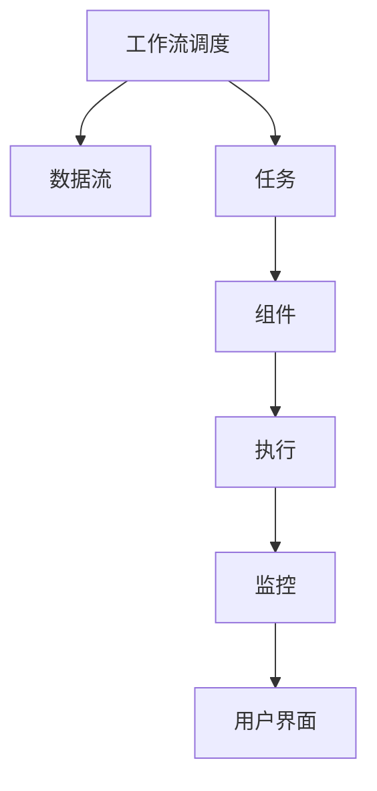

                 

# Oozie工作流调度原理与代码实例讲解

> 关键词：Oozie, Apache Hadoop,工作流调度,XML配置,数据流,任务,组件,执行,监控,用户界面

## 1. 背景介绍

在分布式计算环境中，任务调度与执行的自动化、可靠性及效率至关重要。随着大数据技术的迅速发展，越来越多的企业和组织使用Apache Hadoop生态系统进行数据处理和分析。Apache Hadoop作为一个高度可扩展的分布式计算平台，以其可扩展性和高可用性在数据处理领域占据了重要地位。然而，由于Hadoop生态系统由多个组件组成，这些组件之间需要紧密配合，才能高效地处理大规模数据。

Oozie是Apache Hadoop的重要组成部分，它提供了一种基于XML配置的工作流调度系统，可以协调和管理Hadoop生态系统中的各种数据处理任务。通过Oozie，用户可以定义、调度和管理复杂的数据流作业，使Hadoop集群的整体效率得以显著提升。

本文章将详细介绍Oozie的工作流调度原理，并结合实际案例，通过代码实例讲解如何使用Oozie进行数据流调度。

## 2. 核心概念与联系

### 2.1 核心概念概述

Oozie是一个开源的工作流调度系统，用于管理Hadoop生态系统中的作业调度。其核心概念包括以下几个方面：

- **工作流调度**：通过XML配置定义工作流，调度和管理Hadoop集群中的各种数据处理任务。
- **数据流**：定义数据在Hadoop集群中的流动路径，包括任务的依赖关系、输入输出、执行顺序等。
- **任务**：定义需要执行的具体数据处理任务，如MapReduce、Pig、Hive等。
- **组件**：定义任务的具体组件和执行步骤，包括任务的输入输出、参数、执行环境等。
- **执行**：通过Oozie Server控制任务的执行，提供任务的监控和管理功能。
- **用户界面**：Oozie Web UI提供可视化的工作流调度和管理界面，方便用户操作。

这些概念之间存在密切的联系，通过Oozie，用户可以将Hadoop生态系统中的各种任务以工作流的形式组织起来，形成可靠且高效的数据处理流程。

### 2.2 核心概念原理和架构的 Mermaid 流程图



该图表展示了Oozie工作流调度系统的主要组成部分及其相互关系。

## 3. 核心算法原理 & 具体操作步骤

### 3.1 算法原理概述

Oozie的工作流调度原理基于XML配置，通过定义工作流的逻辑结构，实现任务的调度和管理。其核心算法流程如下：

1. **定义工作流**：通过XML配置定义工作流的逻辑结构，包括任务、组件、依赖关系等。
2. **创建工作流实例**：根据定义的工作流，Oozie创建工作流实例，并开始调度任务。
3. **任务调度**：按照工作流的逻辑结构，Oozie调度每个任务，并监控任务执行状态。
4. **任务执行**：Oozie通过执行器（如Yarn Scheduler）执行各个任务。
5. **任务监控**：Oozie监控任务执行状态，提供任务进度和错误信息，帮助用户及时发现和解决问题。

### 3.2 算法步骤详解

以下是一个具体的工作流调度步骤示例：

1. **定义工作流**：
   ```xml
   <workflow xmlns:y="http://xml.apache.org/yaml/1.2" xmlns:ooz="http://oozie.apache.org/zooz/0.3">
     <start to="t1">
       <action>
         <job-xml>... XML配置文件</job-xml>
       </action>
     </start>
     <flow name="workflow1" from="t1" to="t2">
       <action>
         <job-xml>... XML配置文件</job-xml>
       </action>
       <decision name="decision1" variable="output">... 条件判断语句</decision>
       <action>
         <job-xml>... XML配置文件</job-xml>
       </action>
     </flow>
     <end to="t3" />
   </workflow>
   ```

2. **创建工作流实例**：
   ```bash
   oozie job -create -file /path/to/workflow.xml -type workflow -name myworkflow -prev myworkflow
   ```

3. **任务调度**：
   ```bash
   oozie job -run -workflow -name myworkflow
   ```

4. **任务执行**：
   ```bash
   oozie job -info -workflow -name myworkflow
   ```

5. **任务监控**：
   ```bash
   oozie job -get-info -workflow -name myworkflow
   ```

### 3.3 算法优缺点

Oozie的工作流调度系统具有以下优点：

- **灵活性高**：通过XML配置，用户可以灵活定义各种数据处理任务和工作流。
- **易于维护**：Oozie的配置文件和代码分离，便于维护和扩展。
- **可扩展性强**：支持多种执行器（如Yarn、MapReduce、Spark等），适应不同的计算环境。
- **监控功能完善**：提供详细的任务执行监控功能，帮助用户及时发现和解决问题。

同时，Oozie也存在一些缺点：

- **学习曲线较陡**：由于Oozie的配置文件复杂，新手用户可能需要一定时间学习和理解。
- **性能问题**：在处理大规模工作流时，Oozie的性能可能会受到一定影响。
- **资源限制**：Oozie的工作流调度依赖于Hadoop生态系统，需要充足的资源支持。

### 3.4 算法应用领域

Oozie主要应用于以下领域：

- **大规模数据处理**：通过Oozie调度Hadoop集群中的各种数据处理任务，提升数据处理的效率和可靠性。
- **数据仓库构建**：通过Oozie管理数据仓库中的ETL（Extract, Transform, Load）作业，实现数据的自动抽取、转换和加载。
- **数据集成**：通过Oozie调度各种数据源的抽取和转换任务，实现数据的集成和统一。
- **ETL工作流自动化**：通过Oozie定义和调度ETL工作流，实现数据处理的全自动化管理。

## 4. 数学模型和公式 & 详细讲解 & 举例说明

### 4.1 数学模型构建

Oozie的工作流调度系统是基于XML配置的，以下是一个简单的工作流模型：

```xml
<workflow xmlns:y="http://xml.apache.org/yaml/1.2" xmlns:ooz="http://oozie.apache.org/zooz/0.3">
  <start to="t1">
    <action>
      <job-xml>... XML配置文件</job-xml>
    </action>
  </start>
  <flow name="workflow1" from="t1" to="t2">
    <action>
      <job-xml>... XML配置文件</job-xml>
    </action>
    <decision name="decision1" variable="output">... 条件判断语句</decision>
    <action>
      <job-xml>... XML配置文件</job-xml>
    </action>
  </flow>
  <end to="t3" />
</workflow>
```

该工作流包含三个任务：

- 开始任务：定义整个工作流的开始点。
- 流任务：定义任务的依赖关系和执行顺序。
- 结束任务：定义整个工作流的结束点。

### 4.2 公式推导过程

在Oozie中，工作流的执行顺序和依赖关系通过XML配置文件中的节点和边来定义。具体执行步骤如下：

1. **解析XML配置文件**：Oozie解析XML配置文件，生成一个工作流图。
2. **创建工作流实例**：Oozie根据配置文件创建工作流实例。
3. **调度任务**：Oozie按照定义的任务执行顺序，调度各个任务。
4. **执行任务**：Oozie通过执行器（如Yarn Scheduler）执行各个任务。
5. **监控任务**：Oozie监控任务执行状态，提供任务进度和错误信息。

### 4.3 案例分析与讲解

以下是一个简单的案例，通过Oozie实现一个MapReduce任务的调度：

1. **定义工作流**：
   ```xml
   <workflow xmlns:y="http://xml.apache.org/yaml/1.2" xmlns:ooz="http://oozie.apache.org/zooz/0.3">
     <start to="t1">
       <action>
         <job-xml>... MapReduce任务配置文件</job-xml>
       </action>
     </start>
     <flow name="workflow1" from="t1" to="t2">
       <action>
         <job-xml>... MapReduce任务配置文件</job-xml>
       </action>
       <decision name="decision1" variable="output">... 条件判断语句</decision>
       <action>
         <job-xml>... MapReduce任务配置文件</job-xml>
       </action>
     </flow>
     <end to="t3" />
   </workflow>
   ```

2. **创建工作流实例**：
   ```bash
   oozie job -create -file /path/to/workflow.xml -type workflow -name myworkflow -prev myworkflow
   ```

3. **任务调度**：
   ```bash
   oozie job -run -workflow -name myworkflow
   ```

4. **任务执行**：
   ```bash
   oozie job -info -workflow -name myworkflow
   ```

5. **任务监控**：
   ```bash
   oozie job -get-info -workflow -name myworkflow
   ```

## 5. 项目实践：代码实例和详细解释说明

### 5.1 开发环境搭建

在开始Oozie项目实践之前，需要搭建一个完整的Hadoop和Oozie环境。以下是一个示例环境搭建步骤：

1. **安装JDK**：
   ```bash
   sudo apt-get install openjdk-8-jdk
   ```

2. **安装Hadoop**：
   ```bash
   wget http://apache.claz.org/hadoop/common/2.8.0/hadoop-2.8.0.tar.gz
   tar -xvf hadoop-2.8.0.tar.gz
   cd hadoop-2.8.0
   ./bin/hadoop version
   ```

3. **安装Oozie**：
   ```bash
   cd hadoop-2.8.0
   wget https://archive.apache.org/dist/oozie/stable/4.0.0/oozie-4.0.0.tar.gz
   tar -xvf oozie-4.0.0.tar.gz
   cd oozie-4.0.0
   ./bin/hadoop dfs -mkdir /user/oozie
   cd ..
   export OOZIE_HOME=/path/to/oozie-4.0.0
   export HADOOP_HOME=/path/to/hadoop-2.8.0
   export PATH=$PATH:$OOZIE_HOME/bin:$HADOOP_HOME/bin
   oozie server start
   oozie client start
   oozie web start
   ```

### 5.2 源代码详细实现

以下是一个简单的MapReduce任务调度示例：

1. **MapReduce任务配置文件**：
   ```xml
   <?xml version="1.0" encoding="UTF-8"?>
   <configuration>
     <property>
       <name>mapreduce.job.reduces</name>
       <value>2</value>
     </property>
     <property>
       <name>mapreduce.job.map.memory.mb</name>
       <value>1024</value>
     </property>
     <property>
       <name>mapreduce.job.reduce.memory.mb</name>
       <value>1024</value>
     </property>
     <property>
       <name>mapreduce.job.map.java.opts</name>
       <value>-Xms1024m</value>
     </property>
     <property>
       <name>mapreduce.job.reduce.java.opts</name>
       <value>-Xms1024m</value>
     </property>
     <property>
       <name>mapreduce.reduce.compat.map</name>
       <value>true</value>
     </property>
     <property>
       <name>mapreduce.map.output.committer class</name>
       <value>org.apache.hadoop.mapreduce.lib.partition.HashPartitioner</value>
     </property>
     <property>
       <name>mapreduce.job.ugi</name>
       <value>hdfs</value>
     </property>
     <property>
       <name>mapreduce.job.fileinputformat.inputdir</name>
       <value>hdfs://localhost:9000/user/hadoop/input</value>
     </property>
     <property>
       <name>mapreduce.job.fileoutputformat.outputdir</name>
       <value>hdfs://localhost:9000/user/hadoop/output</value>
     </property>
     <property>
       <name>mapreduce.job.map.class</name>
       <value>org.apache.hadoop.examples.WordCount</value>
     </property>
     <property>
       <name>mapreduce.job.reduce.class</name>
       <value>org.apache.hadoop.examples.WordCount</value>
     </property>
   </configuration>
   ```

2. **工作流配置文件**：
   ```xml
   <workflow xmlns:y="http://xml.apache.org/yaml/1.2" xmlns:ooz="http://oozie.apache.org/zooz/0.3">
     <start to="t1">
       <action>
         <job-xml>./job.xml</job-xml>
       </action>
     </start>
     <flow name="workflow1" from="t1" to="t2">
       <action>
         <job-xml>./job.xml</job-xml>
       </action>
       <decision name="decision1" variable="output">... 条件判断语句</decision>
       <action>
         <job-xml>./job.xml</job-xml>
       </action>
     </flow>
     <end to="t3" />
   </workflow>
   ```

3. **创建工作流实例**：
   ```bash
   oozie job -create -file /path/to/workflow.xml -type workflow -name myworkflow -prev myworkflow
   ```

4. **任务调度**：
   ```bash
   oozie job -run -workflow -name myworkflow
   ```

5. **任务执行**：
   ```bash
   oozie job -info -workflow -name myworkflow
   ```

6. **任务监控**：
   ```bash
   oozie job -get-info -workflow -name myworkflow
   ```

### 5.3 代码解读与分析

**MapReduce任务配置文件**：
- `<configuration>`：定义任务的配置项。
- `<property>`：定义各种配置参数，如任务数量、内存配置、类路径等。
- `<hadoop job>... <mapreduce...>`：定义任务的MapReduce实现。

**工作流配置文件**：
- `<workflow>`：定义工作流的逻辑结构。
- `<start>`：定义工作流的开始点。
- `<flow>`：定义任务的依赖关系和执行顺序。
- `<end>`：定义工作流的结束点。

### 5.4 运行结果展示

在Oozie环境中，通过执行以下命令可以查看任务的运行结果：

```bash
oozie job -get-info -workflow -name myworkflow
```

该命令会返回任务的详细信息，包括任务状态、执行时间、错误信息等，帮助用户及时发现和解决问题。

## 6. 实际应用场景

### 6.1 大数据处理

在大数据处理中，Oozie工作流调度系统可以协调和管理Hadoop生态系统中的各种数据处理任务。例如，在处理大规模日志数据时，用户可以通过Oozie定义数据清洗、ETL和分析任务，实现数据处理的自动化和高效管理。

### 6.2 数据仓库构建

在数据仓库构建中，Oozie工作流调度系统可以管理ETL作业，实现数据的自动抽取、转换和加载。例如，在构建数据仓库时，用户可以通过Oozie定义各种ETL作业，实现数据的自动化处理和实时更新。

### 6.3 数据集成

在数据集成中，Oozie工作流调度系统可以实现不同数据源之间的数据集成和统一。例如，在集成多个数据源的数据时，用户可以通过Oozie定义数据抽取和转换任务，实现数据的自动化集成和整合。

## 7. 工具和资源推荐

### 7.1 学习资源推荐

为了帮助用户系统掌握Oozie的原理和实践，推荐以下学习资源：

1. **Oozie官方文档**：[Apache Oozie官方文档](https://oozie.apache.org/docs/)，详细介绍了Oozie的工作流调度原理和使用方法。
2. **Oozie教程**：[Oozie教程](https://oozie.apache.org/docs/tutorial/)，提供了一系列Oozie的示例和实例，帮助用户快速上手。
3. **Hadoop官方文档**：[Apache Hadoop官方文档](https://hadoop.apache.org/docs/)，详细介绍了Hadoop生态系统的各种组件和使用方法。
4. **Apache Oozie社区**：[Apache Oozie社区](https://oozie.apache.org/)，提供丰富的用户论坛和技术支持。

### 7.2 开发工具推荐

Oozie工作流调度系统可以与多种工具集成使用，以下是一些常用的开发工具：

1. **Hadoop生态系统**：Oozie工作流调度系统是Hadoop生态系统的重要组成部分，支持Hadoop集群中的各种数据处理任务。
2. **Java开发环境**：通过Java编写Oozie工作流的配置文件和执行脚本。
3. **Oozie Web UI**：提供可视化的工作流调度和管理界面，方便用户操作。
4. **Oozie Client和Server**：用于管理和调度Oozie工作流实例。

### 7.3 相关论文推荐

为了深入了解Oozie的工作流调度原理和实现方法，推荐以下相关论文：

1. **Oozie: Workflow Management for Hadoop**：[Oozie: Workflow Management for Hadoop](https://dl.acm.org/doi/10.1145/2374616.2374623)，详细介绍了Oozie的架构和实现方法。
2. **Scheduling Hadoop Workflows with Oozie**：[Scheduling Hadoop Workflows with Oozie](https://www.researchgate.net/publication/280478210_Scheduling_Hadoop_Workflows_with_Oozie)，介绍了如何使用Oozie进行工作流调度和管理。
3. **Oozie 2.0: Workflows for Hadoop**：[Oozie 2.0: Workflows for Hadoop](https://www.apache.org/openwebinar/2020/oizoe2p0/)，介绍了Oozie 2.0的新特性和工作流调度方法。

## 8. 总结：未来发展趋势与挑战

### 8.1 研究成果总结

Oozie工作流调度系统作为Apache Hadoop生态系统的重要组成部分，为Hadoop集群中的各种数据处理任务提供了高效的管理和调度功能。通过Oozie，用户可以灵活定义各种数据处理任务和工作流，实现数据处理的自动化和高效管理。

### 8.2 未来发展趋势

展望未来，Oozie工作流调度系统将呈现以下几个发展趋势：

1. **云原生支持**：随着云原生技术的发展，Oozie将支持云平台上的数据处理任务调度和管理。
2. **更高效的执行器**：Oozie将引入更高效的执行器（如Kubernetes、Spark等），提高任务执行的效率和可靠性。
3. **更多的数据源支持**：Oozie将支持更多数据源的集成和处理，实现更全面的数据管理。
4. **更好的可视化界面**：Oozie将提供更直观、易用的用户界面，方便用户进行工作流管理和调度。
5. **更多的定制化选项**：Oozie将提供更多的定制化选项，帮助用户灵活定义各种数据处理任务和工作流。

### 8.3 面临的挑战

尽管Oozie工作流调度系统在数据处理和管理方面表现出色，但在发展过程中仍面临一些挑战：

1. **学习曲线陡峭**：由于Oozie的配置文件和执行器较为复杂，用户需要一定的学习成本。
2. **性能瓶颈**：在处理大规模工作流时，Oozie的性能可能会受到一定影响。
3. **资源限制**：Oozie的执行器依赖于Hadoop生态系统，需要充足的资源支持。
4. **兼容性问题**：Oozie需要与Hadoop生态系统中的各种组件进行集成，可能存在兼容性问题。

### 8.4 研究展望

未来，为了应对这些挑战，Oozie工作流调度系统需要在以下几个方面进行研究：

1. **简化配置和管理**：简化Oozie的配置文件和执行器，降低用户的学习成本。
2. **优化性能**：优化Oozie的性能，提高任务执行的效率和可靠性。
3. **扩展支持**：扩展Oozie对更多数据源和执行器的支持，实现更全面的数据管理。
4. **增强可视化**：提供更好的用户界面，增强Oozie的工作流管理和调度功能。
5. **提升兼容性**：增强Oozie与其他Hadoop生态系统组件的兼容性，实现更高效的数据处理和管理。

通过这些研究方向的探索，Oozie工作流调度系统必将在未来发展中取得更大进步，为Hadoop集群中的数据处理和管理提供更高效、可靠和易用的解决方案。

## 9. 附录：常见问题与解答

**Q1：Oozie工作流调度系统如何与Hadoop生态系统集成？**

A: Oozie工作流调度系统通过XML配置文件定义工作流，实现与Hadoop生态系统的集成。具体而言，Oozie通过`<job-xml>`标签定义各种Hadoop任务（如MapReduce、Pig、Hive等），并利用`<flow>`标签定义任务之间的依赖关系和执行顺序。通过这种方式，Oozie可以协调和管理Hadoop生态系统中的各种数据处理任务。

**Q2：如何在Oozie中实现任务的并行执行？**

A: 在Oozie中，通过配置任务的并行度（如`<property name="mapreduce.job.map.reduce.task">2</property>`）和任务的分片（如`<input path="hdfs://localhost:9000/user/hadoop/input">`），可以实现任务的并行执行。具体而言，通过增加任务数量和分片数量，可以提高任务的并行度，加速任务的执行。

**Q3：Oozie支持哪些数据源？**

A: Oozie支持多种数据源，包括Hadoop Distributed File System（HDFS）、Amazon S3、Azure Blob Storage等。具体而言，用户可以在XML配置文件中通过`<input>`和`<output>`标签定义数据源的路径和文件名，实现数据源的集成和处理。

**Q4：如何在Oozie中实现任务的超时机制？**

A: 在Oozie中，通过配置任务的超时时间（如`<property name="mapreduce.job.maxmapduration">300</property>`），可以实现任务的超时机制。具体而言，当任务执行超过超时时间时，Oozie会自动中断任务的执行，并记录任务的执行状态和错误信息。

**Q5：如何使用Oozie监控任务的执行状态？**

A: 在Oozie中，通过`<job-xml>`标签定义任务的XML配置文件，并在XML配置文件中添加监控日志（如`<property name="mapreduce.job.log destinations="...</property>`），可以实现任务的监控和日志记录。具体而言，Oozie会定期将任务的执行状态和日志记录到HDFS上，方便用户查看和分析任务的执行情况。

---

作者：禅与计算机程序设计艺术 / Zen and the Art of Computer Programming

