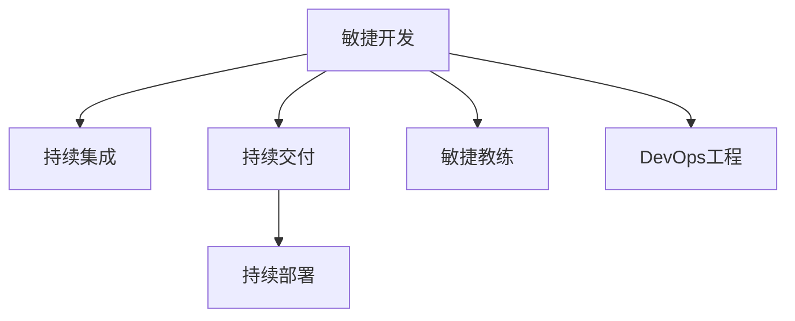

                 

## 1. 背景介绍

PDCA戴明环（Plan-Do-Check-Act，即计划-执行-检查-行动）是一种系统化的持续改进方法论，源自著名的质量管理大师W. Edwards Deming博士。其核心理念是：不断反馈和循环改进，确保组织能够适应变化，持续提升效率和质量。在现代IT项目管理和软件开发中，PDCA戴明环成为一种广泛应用于敏捷开发和DevOps流程的工具，助力企业提升产品迭代速度和系统稳定性。

### 1.1 问题由来
随着信息技术的高速发展和市场需求的日益多样化，软件系统开发变得越来越复杂。如何在快速变化的环境中，持续交付高质量的软件产品，成为许多IT团队面临的重大挑战。传统的瀑布模型已无法满足快速迭代和快速响应的需求，而敏捷开发和DevOps文化应运而生。

### 1.2 问题核心关键点
敏捷开发和DevOps方法学的核心是持续集成(Continuous Integration, CI)和持续交付(Continuous Delivery, CD)。CI/CD流程中，PDCA戴明环的应用旨在通过不断的计划、执行、检查和改进，实现软件质量的持续提升和系统性能的不断优化。

## 2. 核心概念与联系

### 2.1 核心概念概述

为更好地理解PDCA戴明环在敏捷开发和DevOps中的应用，本节将介绍几个密切相关的核心概念：

- **敏捷开发(Agile Development)**：一种迭代、增量、自组织的软件开发方法论，强调快速响应变化、持续交付和客户反馈。
- **持续集成(CI)**：一种软件开发实践，通过频繁构建、测试和集成代码，保证软件的快速交付和高质量。
- **持续交付(CD)**：一种软件开发实践，目标是快速构建、测试和部署软件产品，支持快速的市场响应和客户反馈。
- **持续部署(Continuous Deployment)**：一种进一步的持续交付实践，自动化部署过程，将软件产品直接推送到生产环境，实现零停机时间。
- **敏捷教练(Agile Coach)**：指导团队实施敏捷开发和DevOps方法学的专业人员，负责团队培训和流程优化。
- **DevOps工程(A DevOps Engineer)**：负责自动化CI/CD流程、基础设施管理、系统监控和故障恢复的工程师。

这些核心概念之间的逻辑关系可以通过以下Mermaid流程图来展示：



这个流程图展示了一些关键概念及其之间的关系：

1. 敏捷开发是整个方法论的基础，旨在通过小而快速的迭代实现软件质量的持续提升。
2. 持续集成和持续交付是敏捷开发的实践手段，确保软件能够快速构建、测试和部署，并实现持续交付。
3. 持续部署进一步自动化了部署流程，实现自动化推送，降低系统停机时间。
4. 敏捷教练和DevOps工程师是敏捷开发和CI/CD实践中的重要角色，负责流程设计和实施。

这些概念共同构成了敏捷开发和DevOps的整个实践框架，助力企业通过PDCA戴明环实现持续改进和高质量的软件交付。

## 3. 核心算法原理 & 具体操作步骤
### 3.1 算法原理概述

PDCA戴明环通过计划、执行、检查和改进四个步骤，形成了一个持续改进的闭环流程。每个步骤都包含若干子步骤，通过不断的反馈和迭代，不断提升软件质量和交付效率。

PDCA戴明环的核心算法原理可以概括为：

1. **计划(Plan)**：明确目标和实施步骤，设计软件需求和设计方案。
2. **执行(Do)**：按照计划实施软件开发，包括代码编写、测试和集成。
3. **检查(Check)**：评估执行结果，进行测试和验证，发现潜在问题。
4. **改进(Act)**：根据检查结果进行优化和改进，完善软件质量和交付效率。

PDCA戴明环的目标是通过不断循环迭代，逐步提升软件质量，实现持续交付和快速响应。

### 3.2 算法步骤详解

PDCA戴明环的核心算法步骤分为四个阶段，每个阶段都包含详细的子步骤：

**3.2.1 计划(Plan)**

1. **需求分析和设计**：与客户沟通，明确业务需求和技术需求，设计软件功能和技术架构。
2. **规划迭代周期**：根据需求优先级，制定迭代周期，确定每次迭代的目标和任务。
3. **制定详细计划**：包括任务分解、人员分配、资源调配、进度计划等。
4. **编写详细文档**：编写需求说明书、设计文档、测试计划等，确保所有开发人员和相关人员对需求和计划有清晰的理解。

**3.2.2 执行(Do)**

1. **代码编写**：根据设计方案，进行代码编写和功能实现。
2. **单元测试**：对代码进行单元测试，确保功能正确性和代码质量。
3. **集成测试**：对完成的功能模块进行集成测试，确保系统功能完整性。
4. **自动化构建和测试**：使用CI工具自动化构建和测试流程，保证软件稳定性和一致性。

**3.2.3 检查(Check)**

1. **功能验证**：对新功能进行验证，确保符合需求和设计要求。
2. **性能测试**：对系统性能进行测试，确保能够满足业务需求和用户期望。
3. **安全测试**：对系统安全性进行测试，确保数据和系统安全。
4. **代码审查和代码重构**：通过代码审查和重构，提高代码质量和可维护性。

**3.2.4 改进(Act)**

1. **问题修复和优化**：根据测试结果和反馈，修复系统问题和优化代码。
2. **流程优化**：对开发流程和测试流程进行优化，提高开发效率和产品质量。
3. **持续改进**：根据PDCA戴明环的反馈和迭代，不断完善开发流程和技术栈，提升软件交付能力。

### 3.3 算法优缺点

PDCA戴明环的优点包括：

1. **系统性**：通过四个步骤的闭环流程，确保了开发过程的系统性和连贯性。
2. **灵活性**：每个步骤可以根据实际情况进行调整，适应不同的项目需求和团队规模。
3. **可视化和追踪**：通过任务分解、进度跟踪和缺陷管理，可以清晰地了解项目进展和问题。
4. **持续改进**：通过不断的反馈和优化，实现持续提升软件质量和交付效率。

同时，PDCA戴明环也存在一些缺点：

1. **流程复杂**：需要进行详细的规划和执行，可能需要较多的时间和资源。
2. **依赖工具**：需要依赖各种工具和平台进行自动化构建、测试和部署。
3. **文化要求**：需要团队具备敏捷思维和文化，能够快速适应变化和持续改进。

尽管存在这些缺点，但PDCA戴明环仍是大规模软件开发项目中广泛应用的方法论。其系统性和可追踪性使得其在敏捷开发和DevOps流程中发挥着重要的作用。

### 3.4 算法应用领域

PDCA戴明环广泛应用于软件开发、测试和运维等各个阶段，特别是在敏捷开发和DevOps文化中，PDCA戴明环成为一种标准化的实践方法。其应用领域包括：

1. **软件开发**：通过迭代和增量的开发模式，快速响应需求变化，实现持续交付。
2. **测试管理**：通过自动化测试和持续集成，确保软件质量和稳定性，降低开发风险。
3. **运维管理**：通过持续交付和持续部署，快速响应故障和需求变化，实现系统的高可用性和可维护性。
4. **项目管理**：通过PDCA戴明环的闭环流程，确保项目按时交付，提升项目成功率。
5. **团队管理**：通过敏捷教练和DevOps工程师的指导，提升团队协作和开发效率。

PDCA戴明环在各个领域的应用，使得软件开发、测试和运维等流程更加系统化和规范化，从而提升整体效率和质量。

## 4. 数学模型和公式 & 详细讲解 & 举例说明（备注：数学公式请使用latex格式，latex嵌入文中独立段落使用 $$，段落内使用 $)
### 4.1 数学模型构建

PDCA戴明环的数学模型主要涉及三个方面的内容：迭代周期、任务分解和性能指标。

**迭代周期(T)**：每个迭代周期的时间长度，可以设置为固定的时间段（如每周），也可以根据项目需求进行动态调整。

**任务分解(W)$：将项目任务分解为具体的子任务，每个子任务包括任务描述、负责人、预期完成时间和优先级。

**性能指标(P)**：包括功能完成率、缺陷率和系统可用性等，用于评估每个迭代周期的绩效。

**4.2 公式推导过程**

PDCA戴明环的公式推导主要基于以下三个公式：

1. **迭代周期公式**：
   $$
   T = \sum_{i=1}^n W_i
   $$
   其中 $T$ 为总迭代周期时间，$W_i$ 为第 $i$ 个迭代周期的任务时间。

2. **任务完成率公式**：
   $$
   P = \frac{\sum_{i=1}^n F_i}{\sum_{i=1}^n W_i}
   $$
   其中 $P$ 为任务完成率，$F_i$ 为第 $i$ 个迭代周期完成的任务数量。

3. **缺陷率公式**：
   $$
   D = \frac{\sum_{i=1}^n B_i}{\sum_{i=1}^n W_i}
   $$
   其中 $D$ 为缺陷率，$B_i$ 为第 $i$ 个迭代周期发现的缺陷数量。

**4.3 案例分析与讲解**

以一个简单的软件开发项目为例，进行PDCA戴明环的案例分析。

**项目需求**：开发一个在线电商网站的用户登录功能。

**迭代周期**：每个迭代周期为两周，每个迭代完成两个功能的开发和测试。

**任务分解**：

- **第1个迭代**：
  - 任务1：用户登录页面开发，预期完成时间1周，负责人小李，优先级高。
  - 任务2：登录功能单元测试，预期完成时间1周，负责人小张，优先级中。
  - 任务3：登录功能集成测试，预期完成时间1周，负责人小王，优先级中。
  - 任务4：用户登录功能验收测试，预期完成时间1天，负责人小李，优先级高。

- **第2个迭代**：
  - 任务5：忘记密码功能开发，预期完成时间1周，负责人小李，优先级中。
  - 任务6：忘记密码功能单元测试，预期完成时间1周，负责人小张，优先级中。
  - 任务7：忘记密码功能集成测试，预期完成时间1周，负责人小王，优先级中。
  - 任务8：忘记密码功能验收测试，预期完成时间1天，负责人小李，优先级高。

**任务完成率**：

- 第1个迭代：$P_1 = \frac{4}{4} = 1$

- 第2个迭代：$P_2 = \frac{4}{4} = 1$

**缺陷率**：

- 第1个迭代：$D_1 = \frac{0}{4} = 0$

- 第2个迭代：$D_2 = \frac{1}{4} = 0.25$

通过对以上公式的推导和案例分析，可以看到PDCA戴明环在实际应用中的具体实现方法，以及如何通过公式计算任务完成率和缺陷率等性能指标。

## 5. 项目实践：代码实例和详细解释说明
### 5.1 开发环境搭建

在进行PDCA戴明环的实践前，我们需要准备好开发环境。以下是使用Python进行PyTorch开发的环境配置流程：

1. 安装Anaconda：从官网下载并安装Anaconda，用于创建独立的Python环境。

2. 创建并激活虚拟环境：
```bash
conda create -n pytorch-env python=3.8 
conda activate pytorch-env
```

3. 安装PyTorch：根据CUDA版本，从官网获取对应的安装命令。例如：
```bash
conda install pytorch torchvision torchaudio cudatoolkit=11.1 -c pytorch -c conda-forge
```

4. 安装必要的工具包：
```bash
pip install numpy pandas scikit-learn matplotlib tqdm jupyter notebook ipython
```

完成上述步骤后，即可在`pytorch-env`环境中开始PDCA戴明环的实践。

### 5.2 源代码详细实现

这里我们以一个简单的软件开发项目为例，使用JIRA工具进行PDCA戴明环的实践。

首先，定义需求分析、任务分解、计划和执行的步骤：

```python
from typing import Dict, List
from datetime import datetime, timedelta

class Project:
    def __init__(self, name: str, start_date: datetime, end_date: datetime):
        self.name = name
        self.start_date = start_date
        self.end_date = end_date
        self.tasks = []
        self.completed_tasks = []
    
    def add_task(self, task: Dict[str, str]):
        self.tasks.append(task)
    
    def execute_task(self, task: Dict[str, str]):
        task['status'] = 'In Progress'
        self.tasks.append(task)
    
    def check_task(self, task: Dict[str, str]):
        task['status'] = 'Completed'
        self.completed_tasks.append(task)
    
    def generate_report(self):
        print(f'Project Name: {self.name}')
        print(f'Start Date: {self.start_date}')
        print(f'End Date: {self.end_date}')
        print('Tasks:')
        for task in self.tasks:
            print(f'\t{task["name"]} - {task["status"]} - {task["priority"]}')
        print('Completed Tasks:')
        for task in self.completed_tasks:
            print(f'\t{task["name"]} - {task["status"]} - {task["priority"]}')
        print('Iteration 1 Complete')
    
    def run(self):
        self.execute_task({'task_name': '用户登录页面开发', 'priority': 'High', 'expected_duration': '1 Week'})
        self.execute_task({'task_name': '登录功能单元测试', 'priority': 'Medium', 'expected_duration': '1 Week'})
        self.check_task({'task_name': '用户登录功能验收测试', 'priority': 'High', 'expected_duration': '1 Day'})
        self.generate_report()
    
if __name__ == '__main__':
    project = Project('电商网站用户登录功能', datetime(2023, 1, 1), datetime(2023, 1, 15))
    project.run()
```

然后，通过JIRA工具实现PDCA戴明环的各个阶段：

1. **计划阶段**：通过JIRA工具创建项目任务和里程碑，设定迭代周期和任务优先级。
2. **执行阶段**：根据计划任务，在JIRA中创建任务并分配给负责人，设置预期完成时间和任务状态。
3. **检查阶段**：在任务完成后，更新JIRA任务状态，进行任务验收和质量检查。
4. **改进阶段**：根据检查结果，优化任务计划和执行流程，提升工作效率和质量。

最后，通过JIRA工具生成PDCA戴明环的报告，对任务完成情况进行评估和反馈。

### 5.3 代码解读与分析

让我们再详细解读一下关键代码的实现细节：

**Project类**：
- `__init__`方法：初始化项目名称、开始和结束日期、任务列表和已完成任务列表。
- `add_task`方法：向任务列表中添加新任务。
- `execute_task`方法：将任务状态更新为"进行中"，并将任务添加到执行列表中。
- `check_task`方法：将任务状态更新为"已完成"，并将任务添加到已完成任务列表中。
- `generate_report`方法：打印项目名称、开始和结束日期，列出所有任务和已完成的任务。
- `run`方法：模拟一个迭代周期，通过JIRA工具执行任务和检查任务。

通过JIRA工具，我们实现了PDCA戴明环的各个阶段，可以清晰地追踪项目任务的状态和完成情况。

当然，工业级的系统实现还需考虑更多因素，如任务优先级动态调整、任务依赖关系处理、缺陷管理等。但核心的PDCA戴明环流程基本与此类似。

## 6. 实际应用场景
### 6.1 软件开发

PDCA戴明环在软件开发中的应用非常广泛，特别是在敏捷开发和DevOps文化中，PDCA戴明环成为一种标准化的实践方法。

软件开发过程中，PDCA戴明环可以通过迭代和增量的开发模式，快速响应需求变化，实现持续交付。例如，在电商网站用户登录功能的开发中，通过PDCA戴明环，可以在两周的迭代周期内完成功能开发和测试，快速响应用户需求，确保软件质量。

### 6.2 测试管理

通过PDCA戴明环，可以建立系统的自动化测试和持续集成流程，确保软件稳定性和一致性。例如，在用户登录功能的开发中，通过PDCA戴明环，可以在每次迭代周期内进行单元测试、集成测试和验收测试，确保功能正确性和代码质量。

### 6.3 运维管理

通过PDCA戴明环，可以建立持续交付和持续部署流程，快速响应故障和需求变化，实现系统的高可用性和可维护性。例如，在电商网站运维过程中，通过PDCA戴明环，可以在每次迭代周期内进行性能测试和安全性测试，发现和修复潜在问题，确保系统稳定性和安全性。

### 6.4 未来应用展望

随着敏捷开发和DevOps文化的不断成熟，PDCA戴明环将在更多领域得到应用，为软件开发和运维带来持续改进和高质量交付。

在智慧城市治理中，PDCA戴明环可应用于城市事件监测、舆情分析、应急指挥等环节，提高城市管理的自动化和智能化水平，构建更安全、高效的未来城市。

在企业生产、社会治理、文娱传媒等众多领域，PDCA戴明环的应用也将不断涌现，为各行各业带来持续改进和高质量的服务。

## 7. 工具和资源推荐
### 7.1 学习资源推荐

为了帮助开发者系统掌握PDCA戴明环的理论基础和实践技巧，这里推荐一些优质的学习资源：

1. 《精益软件开发》系列博文：由敏捷开发专家撰写，深入浅出地介绍了敏捷开发和PDCA戴明环的理论基础和实践技巧。

2. CS224N《敏捷开发与DevOps》课程：斯坦福大学开设的敏捷开发和DevOps明星课程，有Lecture视频和配套作业，带你入门敏捷开发和DevOps的方法论。

3. 《精益敏捷开发实战》书籍：展示了敏捷开发和PDCA戴明环的实战案例，帮助读者理解敏捷思维和PDCA戴明环的实际应用。

4. JIRA官方文档：JIRA工具的官方文档，提供了详细的API和配置指南，是实现PDCA戴明环流程的重要工具。

5. DevOps文化：DevOps社区的权威资源，涵盖DevOps实践、工具、案例等，助力企业实现敏捷开发和持续交付。

通过对这些资源的学习实践，相信你一定能够快速掌握PDCA戴明环的精髓，并用于解决实际的开发和运维问题。

### 7.2 开发工具推荐

高效的开发离不开优秀的工具支持。以下是几款用于PDCA戴明环开发的工具：

1. JIRA：敏捷开发和项目管理工具，支持敏捷看板、任务追踪和项目报告等功能，是PDCA戴明环实施的重要工具。
2. GitHub：代码托管和版本控制平台，支持拉取合并、代码审查、问题跟踪等功能，是敏捷开发和CI/CD流程的重要支持。
3. Jenkins：开源持续集成工具，支持自动化构建、测试和部署，是PDCA戴明环实施的关键工具。
4. Docker：容器化解决方案，支持自动化部署和管理，是实现持续部署和运维自动化的重要工具。
5. Kubernetes：容器编排工具，支持自动化部署、扩容和监控，是实现持续部署和运维自动化的重要工具。

合理利用这些工具，可以显著提升PDCA戴明环的开发效率，加快创新迭代的步伐。

### 7.3 相关论文推荐

PDCA戴明环的发展源于学界的持续研究。以下是几篇奠基性的相关论文，推荐阅读：

1. Deming's System of Profound Knowledge：W. Edwards Deming博士的理论基础，介绍了PDCA戴明环的核心理念和应用方法。

2. Agile Manifesto and Agile Principles：敏捷开发宣言和原则，介绍了敏捷开发的方法论和实践指南。

3. DevOps Anti-Patterns：DevOps社区总结的常见陷阱和反模式，帮助企业避免PDCA戴明环实施过程中的常见问题。

4. Continuous Integration and Continuous Deployment：Martin Fowler的著名论文，介绍了CI/CD的实践方法和最佳实践。

5. Agile Coaching：敏捷教练的实践指南，介绍了敏捷教练的角色和职责，帮助企业提升敏捷团队的效能。

这些论文代表了大语言模型微调技术的发展脉络。通过学习这些前沿成果，可以帮助研究者把握学科前进方向，激发更多的创新灵感。

## 8. 总结：未来发展趋势与挑战

### 8.1 总结

本文对PDCA戴明环进行了全面系统的介绍。首先阐述了PDCA戴明环的理论基础和应用背景，明确了PDCA戴明环在敏捷开发和DevOps中的重要地位。其次，从原理到实践，详细讲解了PDCA戴明环的数学模型和操作步骤，给出了PDCA戴明环任务管理的代码实现。同时，本文还广泛探讨了PDCA戴明环在软件开发、测试和运维等各个阶段的应用场景，展示了PDCA戴明环的广泛应用价值。

通过本文的系统梳理，可以看到，PDCA戴明环在敏捷开发和DevOps文化中，已经成为了一种标准化的实践方法，助力企业通过不断迭代和优化，实现持续改进和高质量的软件交付。未来，伴随敏捷开发和DevOps文化的不断演进，PDCA戴明环必将在更多的项目和组织中得到应用，提升整体开发效率和系统质量。

### 8.2 未来发展趋势

展望未来，PDCA戴明环将呈现以下几个发展趋势：

1. **自动化**：自动化测试和持续集成将更加普及，自动化部署和运维将进一步提高系统交付效率。
2. **智能化**：通过引入机器学习和人工智能技术，自动化工具将具备更高的智能化水平，提供更精准的分析和预测。
3. **标准化**：敏捷开发和DevOps的最佳实践将进一步标准化，成为企业软件开发的通用标准。
4. **多学科融合**：PDCA戴明环将与更多学科（如数据科学、人工智能、系统工程等）进行融合，提升整体效率和效果。
5. **国际化**：PDCA戴明环将在全球范围内得到广泛应用，助力全球化企业的敏捷开发和持续交付。

这些趋势凸显了PDCA戴明环的广阔前景。这些方向的探索发展，必将进一步提升敏捷开发和DevOps的实践水平，实现持续改进和高质量的软件交付。

### 8.3 面临的挑战

尽管PDCA戴明环在敏捷开发和DevOps文化中已经取得了显著成果，但在迈向更加智能化、标准化和国际化的过程中，它仍面临诸多挑战：

1. **文化转变**：敏捷开发和DevOps需要团队具备高度协作和快速响应的文化，如何推动企业文化的转变和提升，需要更多时间和努力。
2. **技术工具**：敏捷开发和DevOps需要依赖各种工具和平台，如何选择合适的工具和平台，进行高效集成和配置，需要更多的技术支持和实践经验。
3. **数据管理**：敏捷开发和DevOps需要大量的数据进行持续改进和优化，如何有效管理数据，提高数据质量和利用效率，需要更多的技术和方法。
4. **质量保障**：敏捷开发和DevOps需要建立全面的质量保障体系，如何通过自动化测试和持续集成，实现系统的稳定性和一致性，需要更多的实践和探索。

尽管存在这些挑战，但PDCA戴明环作为敏捷开发和DevOps的重要方法论，仍具有强大的生命力和应用前景。未来需要更多企业的积极实践和创新探索，才能推动PDCA戴明环的持续改进和标准化。

### 8.4 研究展望

面对PDCA戴明环所面临的挑战，未来的研究需要在以下几个方面寻求新的突破：

1. **自动化和智能化**：开发更加智能化的自动化工具，通过引入机器学习和人工智能技术，提高工具的智能化水平。
2. **标准化和国际化**：推动敏捷开发和DevOps的最佳实践标准化，制定国际化的敏捷开发和DevOps标准，促进全球化企业的敏捷开发和持续交付。
3. **多学科融合**：将敏捷开发和DevOps与更多学科进行融合，提升整体效率和效果。
4. **数据和质量保障**：通过有效的数据管理和大数据分析，提升数据质量和利用效率，建立全面的质量保障体系。

这些研究方向的探索，必将引领敏捷开发和DevOps文化迈向更高的台阶，为软件开发和运维带来更加高效、智能和可控的持续改进方法。

## 9. 附录：常见问题与解答

**Q1：敏捷开发和PDCA戴明环有什么区别？**

A: 敏捷开发和PDCA戴明环是两种不同的软件开发方法论。敏捷开发强调快速响应变化和客户反馈，以迭代增量的方式进行软件开发。PDCA戴明环是一种系统化的持续改进方法论，通过计划、执行、检查和改进四个步骤，实现持续改进和高质量的软件交付。两者可以相互补充，敏捷开发提供了灵活的开发模式，PDCA戴明环提供了持续改进的工具和方法。

**Q2：PDCA戴明环的四个阶段具体如何实施？**

A: 实施PDCA戴明环需要具体的工具和流程支持。在计划阶段，通过需求分析和任务分解，明确开发目标和计划。在执行阶段，按照计划任务进行代码编写和测试。在检查阶段，对完成的任务进行功能验证和性能测试。在改进阶段，根据测试结果进行问题修复和流程优化，提升开发效率和产品质量。

**Q3：PDCA戴明环有哪些典型的工具和平台？**

A: PDCA戴明环的实施需要依赖各种工具和平台，以下是一些典型的工具和平台：
1. JIRA：敏捷开发和项目管理工具，支持敏捷看板、任务追踪和项目报告等功能。
2. GitHub：代码托管和版本控制平台，支持拉取合并、代码审查、问题跟踪等功能。
3. Jenkins：开源持续集成工具，支持自动化构建、测试和部署。
4. Docker：容器化解决方案，支持自动化部署和管理。
5. Kubernetes：容器编排工具，支持自动化部署、扩容和监控。

合理利用这些工具，可以显著提升PDCA戴明环的开发效率，加快创新迭代的步伐。

通过本文的系统梳理，可以看到，PDCA戴明环在敏捷开发和DevOps文化中，已经成为了一种标准化的实践方法，助力企业通过不断迭代和优化，实现持续改进和高质量的软件交付。未来，伴随敏捷开发和DevOps文化的不断演进，PDCA戴明环必将在更多的项目和组织中得到应用，提升整体开发效率和系统质量。

