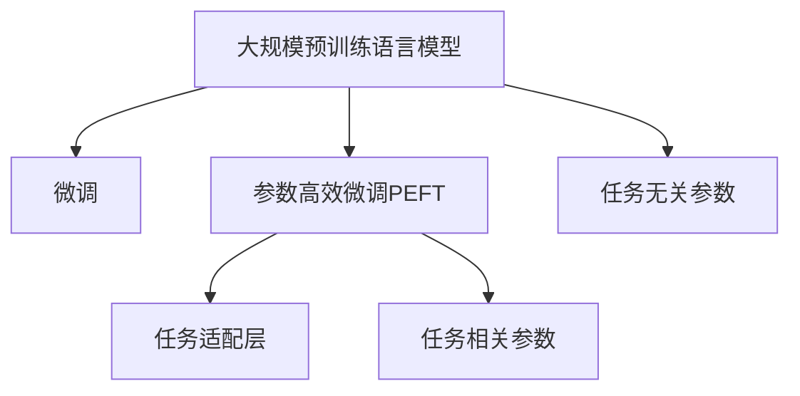

                 

## 1. 背景介绍

### 1.1 问题由来

近年来，随着深度学习技术的飞速发展，大规模预训练语言模型（Large Language Models, LLMs）在自然语言处理（NLP）领域取得了巨大突破。这些模型通过在大量无标签文本数据上预训练，学习到了丰富的语言知识和常识，但在特定任务上性能提升受限于标注数据。在数据稀缺或成本高昂的情况下，微调（Fine-Tuning）方法通过有监督学习优化模型在特定任务上的表现，成为了大模型应用的有效手段。

然而，微调过程中往往需要更新所有预训练权重，这在计算资源和存储方面造成了较大负担。因此，参数高效微调（Parameter-Efficient Fine-Tuning, PEFT）方法应运而生，通过只调整少量预训练模型参数，最大化模型性能和计算效率的平衡。

### 1.2 问题核心关键点

参数高效微调（PEFT）方法通过在保持大部分预训练模型参数不变的前提下，调整少量任务相关的参数，从而在不显著增加计算资源和存储开销的情况下，提升模型在特定任务上的性能。PEFT方法的核心在于：

- **任务适配层的引入**：在预训练模型顶部增加适配层，用于特定任务的分类或解码。
- **参数共享**：大部分预训练模型参数保持不变，仅适配层参数进行微调。
- **微调参数的选择**：选择任务最相关的参数进行微调，如输出层或解码器部分。

PEFT方法的关键在于参数的共享和微调策略的选择，通过这些策略可以大幅度减少微调过程中的计算和存储开销，提高微调效率。

## 2. 核心概念与联系

### 2.1 核心概念概述

为了更好地理解PEFT方法，本节将介绍几个密切相关的核心概念：

- **大规模预训练语言模型（LLMs）**：以BERT、GPT等为代表的大规模预训练语言模型，通过在无标签数据上预训练，学习通用的语言表示。
- **微调（Fine-Tuning）**：在预训练模型基础上，使用下游任务的少量标注数据，通过有监督学习优化模型在特定任务上的性能。
- **参数高效微调（PEFT）**：只更新少量模型参数，避免全参数微调带来的高计算和存储成本，提升微调效率。
- **任务适配层（Task Adaptation Layer）**：在预训练模型顶部增加的适配层，用于特定任务的分类或解码。
- **任务无关参数（Task Irrelevant Parameters）**：大部分预训练模型参数，这些参数在微调过程中保持不变。
- **任务相关参数（Task Relevant Parameters）**：微调过程中需要更新的参数，通常包括适配层的参数。

这些概念之间的逻辑关系可以通过以下Mermaid流程图来展示：



这个流程图展示了大规模预训练语言模型的核心概念及其之间的关系：

1. 大语言模型通过预训练获得基础能力。
2. 微调是对预训练模型进行任务特定的优化，可以分为全参数微调和参数高效微调（PEFT）。
3. 适配层用于特定任务的分类或解码，PEFT方法通过调整适配层参数来提升性能。
4. 任务无关参数在微调过程中保持不变，任务相关参数进行微调。

这些概念共同构成了PEFT方法的基础框架，使得在大规模预训练语言模型的基础上，能够通过微调来适应特定任务，同时保持计算和存储效率。

## 3. 核心算法原理 & 具体操作步骤

### 3.1 算法原理概述

参数高效微调（PEFT）方法基于预训练模型和下游任务的特定需求，通过只更新一小部分模型参数，最大化性能和效率的平衡。PEFT方法通过任务适配层的设计，将预训练模型的输出转化为特定任务的输出，从而实现微调。

形式化地，假设预训练模型为 $M_{\theta}$，其中 $\theta$ 为预训练得到的模型参数。给定下游任务 $T$ 的标注数据集 $D=\{(x_i, y_i)\}_{i=1}^N$，PEFT的目标是找到新的适配参数 $\phi$，使得：

$$
\phi=\mathop{\arg\min}_{\phi} \mathcal{L}(M_{\theta}, D, \phi)
$$

其中 $\mathcal{L}$ 为针对任务 $T$ 设计的损失函数，用于衡量模型预测输出与真实标签之间的差异。常见的损失函数包括交叉熵损失、均方误差损失等。

PEFT方法通常涉及以下步骤：

1. 选择合适的预训练模型 $M_{\theta}$ 作为初始化参数，如 BERT、GPT 等。
2. 在预训练模型顶部增加任务适配层 $F$，用于特定任务的分类或解码。
3. 在适配层 $F$ 上使用下游任务的少量标注数据进行微调，优化模型在特定任务上的性能。
4. 保持大部分预训练模型参数不变，只微调适配层 $F$ 的参数。

### 3.2 算法步骤详解

PEFT方法通常包括以下几个关键步骤：

**Step 1: 准备预训练模型和数据集**
- 选择合适的预训练语言模型 $M_{\theta}$ 作为初始化参数，如 BERT、GPT 等。
- 准备下游任务 $T$ 的标注数据集 $D$，划分为训练集、验证集和测试集。一般要求标注数据与预训练数据的分布不要差异过大。

**Step 2: 添加任务适配层**
- 根据任务类型，在预训练模型顶部设计合适的输出层和损失函数。
- 对于分类任务，通常在顶部增加线性分类器，使用交叉熵损失函数。
- 对于生成任务，通常使用语言模型的解码器输出概率分布，使用负对数似然为损失函数。

**Step 3: 设置微调超参数**
- 选择合适的优化算法及其参数，如 AdamW、SGD 等，设置学习率、批大小、迭代轮数等。
- 设置正则化技术及强度，包括权重衰减、Dropout、Early Stopping 等。
- 确定冻结预训练参数的策略，如仅微调适配层，或全部参数都参与微调。

**Step 4: 执行梯度训练**
- 将训练集数据分批次输入模型，前向传播计算损失函数。
- 反向传播计算参数梯度，根据设定的优化算法和学习率更新模型参数。
- 周期性在验证集上评估模型性能，根据性能指标决定是否触发 Early Stopping。
- 重复上述步骤直到满足预设的迭代轮数或 Early Stopping 条件。

**Step 5: 测试和部署**
- 在测试集上评估微调后模型 $M_{\theta, \phi}$ 的性能，对比微调前后的精度提升。
- 使用微调后的模型对新样本进行推理预测，集成到实际的应用系统中。
- 持续收集新的数据，定期重新微调模型，以适应数据分布的变化。

以上是参数高效微调（PEFT）方法的一般流程。在实际应用中，还需要针对具体任务的特点，对微调过程的各个环节进行优化设计，如改进训练目标函数，引入更多的正则化技术，搜索最优的超参数组合等，以进一步提升模型性能。

### 3.3 算法优缺点

参数高效微调（PEFT）方法具有以下优点：
1. 计算和存储效率高。仅调整少量模型参数，避免了全参数微调带来的高计算和存储开销。
2. 适应性强。对标注数据和任务变化具有较好的适应性，能够快速调整模型性能。
3. 参数共享。大部分预训练参数不变，避免了模型过拟合，提高了模型的泛化能力。

同时，该方法也存在一定的局限性：
1. 微调效果受限。对于复杂任务，仅微调适配层参数可能不足以完全适应任务需求。
2. 适配层设计难度大。适配层的设计需要充分理解任务特征，难度较高。
3. 微调后性能评估复杂。由于微调仅调整适配层参数，性能评估需综合考虑预训练模型和适配层的影响。

尽管存在这些局限性，但PEFT方法在大规模预训练语言模型的基础上，提供了一种高效、灵活的微调方式，适用于数据稀缺或任务变化频繁的场景。

### 3.4 算法应用领域

参数高效微调（PEFT）方法在NLP领域已经得到了广泛应用，覆盖了各种常见任务，例如：

- 文本分类：如情感分析、主题分类、意图识别等。通过微调适配层，使得模型能够更精准地分类文本。
- 命名实体识别：识别文本中的人名、地名、机构名等特定实体。通过微调适配层，提高实体的识别准确率。
- 关系抽取：从文本中抽取实体之间的语义关系。通过微调适配层，学习实体-关系三元组。
- 问答系统：对自然语言问题给出答案。通过微调适配层，提高回答的准确性和流畅性。
- 机器翻译：将源语言文本翻译成目标语言。通过微调适配层，提高翻译质量。
- 文本摘要：将长文本压缩成简短摘要。通过微调适配层，提取文本关键信息。
- 对话系统：使机器能够与人自然对话。通过微调适配层，增强对话系统的理解能力和生成能力。

除了上述这些经典任务外，PEFT方法也被创新性地应用到更多场景中，如可控文本生成、常识推理、代码生成、数据增强等，为NLP技术带来了全新的突破。随着预训练模型和PEFT方法的不断进步，相信NLP技术将在更广阔的应用领域大放异彩。

## 4. 数学模型和公式 & 详细讲解  
### 4.1 数学模型构建

本节将使用数学语言对PEFT方法进行更加严格的刻画。

记预训练语言模型为 $M_{\theta}$，其中 $\theta$ 为预训练得到的模型参数。假设微调任务的训练集为 $D=\{(x_i,y_i)\}_{i=1}^N$，其中 $x_i$ 为输入样本，$y_i$ 为真实标签。

定义模型 $M_{\theta}$ 在输入 $x$ 上的输出为 $z = M_{\theta}(x)$，适配层的输出为 $y = F(z)$，其中 $F$ 为任务适配层。

微调的优化目标是最小化经验风险，即找到适配参数 $\phi$：

$$
\phi=\mathop{\arg\min}_{\phi} \mathcal{L}(M_{\theta}, D, \phi)
$$

其中 $\mathcal{L}$ 为针对任务 $T$ 设计的损失函数，用于衡量模型预测输出与真实标签之间的差异。

### 4.2 公式推导过程

以下我们以二分类任务为例，推导交叉熵损失函数及其梯度的计算公式。

假设模型 $M_{\theta}$ 在输入 $x$ 上的输出为 $z = M_{\theta}(x)$，适配层的输出为 $y = F(z)$。则二分类交叉熵损失函数定义为：

$$
\ell(M_{\theta}, y, y') = -[y\log F(z) + (1-y)\log (1-F(z))]
$$

其中 $y'$ 为真实标签，$y$ 为模型预测输出。

将适配层的输出 $y$ 代入交叉熵损失函数，得：

$$
\ell(M_{\theta}, y, y') = -[y'\log F(z) + (1-y')\log (1-F(z))]
$$

在微调过程中，我们希望最小化损失函数 $\ell$，因此梯度更新公式为：

$$
\frac{\partial \ell}{\partial F} = -\frac{y'}{F(z)} + \frac{1-y'}{1-F(z)}
$$

其中 $\frac{\partial \ell}{\partial F}$ 为适配层 $F$ 的梯度。

在得到梯度后，即可带入适配层的优化算法中，完成模型的迭代优化。重复上述过程直至收敛，最终得到适应下游任务的最优适配参数 $\phi$。

## 5. 项目实践：代码实例和详细解释说明
### 5.1 开发环境搭建

在进行PEFT实践前，我们需要准备好开发环境。以下是使用Python进行PyTorch开发的环境配置流程：

1. 安装Anaconda：从官网下载并安装Anaconda，用于创建独立的Python环境。

2. 创建并激活虚拟环境：
```bash
conda create -n pytorch-env python=3.8 
conda activate pytorch-env
```

3. 安装PyTorch：根据CUDA版本，从官网获取对应的安装命令。例如：
```bash
conda install pytorch torchvision torchaudio cudatoolkit=11.1 -c pytorch -c conda-forge
```

4. 安装Transformers库：
```bash
pip install transformers
```

5. 安装各类工具包：
```bash
pip install numpy pandas scikit-learn matplotlib tqdm jupyter notebook ipython
```

完成上述步骤后，即可在`pytorch-env`环境中开始PEFT实践。

### 5.2 源代码详细实现

下面我们以命名实体识别(NER)任务为例，给出使用Transformers库对BERT模型进行参数高效微调的PyTorch代码实现。

首先，定义NER任务的数据处理函数：

```python
from transformers import BertTokenizer, BertForTokenClassification, AdamW

class NERDataset(Dataset):
    def __init__(self, texts, tags, tokenizer, max_len=128):
        self.texts = texts
        self.tags = tags
        self.tokenizer = tokenizer
        self.max_len = max_len
        
    def __len__(self):
        return len(self.texts)
    
    def __getitem__(self, item):
        text = self.texts[item]
        tags = self.tags[item]
        
        encoding = self.tokenizer(text, return_tensors='pt', max_length=self.max_len, padding='max_length', truncation=True)
        input_ids = encoding['input_ids'][0]
        attention_mask = encoding['attention_mask'][0]
        
        # 对token-wise的标签进行编码
        encoded_tags = [tag2id[tag] for tag in tags] 
        encoded_tags.extend([tag2id['O']] * (self.max_len - len(encoded_tags)))
        labels = torch.tensor(encoded_tags, dtype=torch.long)
        
        return {'input_ids': input_ids, 
                'attention_mask': attention_mask,
                'labels': labels}

# 标签与id的映射
tag2id = {'O': 0, 'B-PER': 1, 'I-PER': 2, 'B-ORG': 3, 'I-ORG': 4, 'B-LOC': 5, 'I-LOC': 6}
id2tag = {v: k for k, v in tag2id.items()}

# 创建dataset
tokenizer = BertTokenizer.from_pretrained('bert-base-cased')

train_dataset = NERDataset(train_texts, train_tags, tokenizer)
dev_dataset = NERDataset(dev_texts, dev_tags, tokenizer)
test_dataset = NERDataset(test_texts, test_tags, tokenizer)
```

然后，定义模型和优化器：

```python
from transformers import BertForTokenClassification, AdamW

model = BertForTokenClassification.from_pretrained('bert-base-cased', num_labels=len(tag2id))

optimizer = AdamW(model.parameters(), lr=2e-5)
```

接着，定义训练和评估函数：

```python
from torch.utils.data import DataLoader
from tqdm import tqdm
from sklearn.metrics import classification_report

device = torch.device('cuda') if torch.cuda.is_available() else torch.device('cpu')
model.to(device)

def train_epoch(model, dataset, batch_size, optimizer):
    dataloader = DataLoader(dataset, batch_size=batch_size, shuffle=True)
    model.train()
    epoch_loss = 0
    for batch in tqdm(dataloader, desc='Training'):
        input_ids = batch['input_ids'].to(device)
        attention_mask = batch['attention_mask'].to(device)
        labels = batch['labels'].to(device)
        model.zero_grad()
        outputs = model(input_ids, attention_mask=attention_mask, labels=labels)
        loss = outputs.loss
        epoch_loss += loss.item()
        loss.backward()
        optimizer.step()
    return epoch_loss / len(dataloader)

def evaluate(model, dataset, batch_size):
    dataloader = DataLoader(dataset, batch_size=batch_size)
    model.eval()
    preds, labels = [], []
    with torch.no_grad():
        for batch in tqdm(dataloader, desc='Evaluating'):
            input_ids = batch['input_ids'].to(device)
            attention_mask = batch['attention_mask'].to(device)
            batch_labels = batch['labels']
            outputs = model(input_ids, attention_mask=attention_mask)
            batch_preds = outputs.logits.argmax(dim=2).to('cpu').tolist()
            batch_labels = batch_labels.to('cpu').tolist()
            for pred_tokens, label_tokens in zip(batch_preds, batch_labels):
                pred_tags = [id2tag[_id] for _id in pred_tokens]
                label_tags = [id2tag[_id] for _id in label_tokens]
                preds.append(pred_tags[:len(label_tags)])
                labels.append(label_tags)
                
    print(classification_report(labels, preds))
```

最后，启动训练流程并在测试集上评估：

```python
epochs = 5
batch_size = 16

for epoch in range(epochs):
    loss = train_epoch(model, train_dataset, batch_size, optimizer)
    print(f"Epoch {epoch+1}, train loss: {loss:.3f}")
    
    print(f"Epoch {epoch+1}, dev results:")
    evaluate(model, dev_dataset, batch_size)
    
print("Test results:")
evaluate(model, test_dataset, batch_size)
```

以上就是使用PyTorch对BERT进行命名实体识别任务参数高效微调的完整代码实现。可以看到，得益于Transformers库的强大封装，我们可以用相对简洁的代码完成BERT模型的加载和微调。

### 5.3 代码解读与分析

让我们再详细解读一下关键代码的实现细节：

**NERDataset类**：
- `__init__`方法：初始化文本、标签、分词器等关键组件。
- `__len__`方法：返回数据集的样本数量。
- `__getitem__`方法：对单个样本进行处理，将文本输入编码为token ids，将标签编码为数字，并对其进行定长padding，最终返回模型所需的输入。

**tag2id和id2tag字典**：
- 定义了标签与数字id之间的映射关系，用于将token-wise的预测结果解码回真实的标签。

**训练和评估函数**：
- 使用PyTorch的DataLoader对数据集进行批次化加载，供模型训练和推理使用。
- 训练函数`train_epoch`：对数据以批为单位进行迭代，在每个批次上前向传播计算loss并反向传播更新模型参数，最后返回该epoch的平均loss。
- 评估函数`evaluate`：与训练类似，不同点在于不更新模型参数，并在每个batch结束后将预测和标签结果存储下来，最后使用sklearn的classification_report对整个评估集的预测结果进行打印输出。

**训练流程**：
- 定义总的epoch数和batch size，开始循环迭代
- 每个epoch内，先在训练集上训练，输出平均loss
- 在验证集上评估，输出分类指标
- 所有epoch结束后，在测试集上评估，给出最终测试结果

可以看到，PyTorch配合Transformers库使得BERT微调的代码实现变得简洁高效。开发者可以将更多精力放在数据处理、模型改进等高层逻辑上，而不必过多关注底层的实现细节。

当然，工业级的系统实现还需考虑更多因素，如模型的保存和部署、超参数的自动搜索、更灵活的任务适配层等。但核心的PEFT范式基本与此类似。

## 6. 实际应用场景
### 6.1 智能客服系统

基于大语言模型PEFT的对话技术，可以广泛应用于智能客服系统的构建。传统客服往往需要配备大量人力，高峰期响应缓慢，且一致性和专业性难以保证。而使用PEFT后的对话模型，可以7x24小时不间断服务，快速响应客户咨询，用自然流畅的语言解答各类常见问题。

在技术实现上，可以收集企业内部的历史客服对话记录，将问题和最佳答复构建成监督数据，在此基础上对预训练对话模型进行PEFT。PEFT后的对话模型能够自动理解用户意图，匹配最合适的答案模板进行回复。对于客户提出的新问题，还可以接入检索系统实时搜索相关内容，动态组织生成回答。如此构建的智能客服系统，能大幅提升客户咨询体验和问题解决效率。

### 6.2 金融舆情监测

金融机构需要实时监测市场舆论动向，以便及时应对负面信息传播，规避金融风险。传统的人工监测方式成本高、效率低，难以应对网络时代海量信息爆发的挑战。基于PEFT的文本分类和情感分析技术，为金融舆情监测提供了新的解决方案。

具体而言，可以收集金融领域相关的新闻、报道、评论等文本数据，并对其进行主题标注和情感标注。在此基础上对预训练语言模型进行PEFT，使其能够自动判断文本属于何种主题，情感倾向是正面、中性还是负面。将PEFT后的模型应用到实时抓取的网络文本数据，就能够自动监测不同主题下的情感变化趋势，一旦发现负面信息激增等异常情况，系统便会自动预警，帮助金融机构快速应对潜在风险。

### 6.3 个性化推荐系统

当前的推荐系统往往只依赖用户的历史行为数据进行物品推荐，无法深入理解用户的真实兴趣偏好。基于PEFT的个性化推荐系统可以更好地挖掘用户行为背后的语义信息，从而提供更精准、多样的推荐内容。

在实践中，可以收集用户浏览、点击、评论、分享等行为数据，提取和用户交互的物品标题、描述、标签等文本内容。将文本内容作为模型输入，用户的后续行为（如是否点击、购买等）作为监督信号，在此基础上对预训练语言模型进行PEFT。PEFT后的模型能够从文本内容中准确把握用户的兴趣点。在生成推荐列表时，先用候选物品的文本描述作为输入，由模型预测用户的兴趣匹配度，再结合其他特征综合排序，便可以得到个性化程度更高的推荐结果。

### 6.4 未来应用展望

随着大语言模型PEFT方法的不断发展，其在更多领域的应用前景将更加广阔：

- **智慧医疗**：基于PEFT的医学问答、病历分析、药物研发等应用将提升医疗服务的智能化水平，辅助医生诊疗，加速新药开发进程。
- **智能教育**：PEFT技术可应用于作业批改、学情分析、知识推荐等方面，因材施教，促进教育公平，提高教学质量。
- **智慧城市治理**：PEFT模型可应用于城市事件监测、舆情分析、应急指挥等环节，提高城市管理的自动化和智能化水平，构建更安全、高效的未来城市。
- **企业生产**：在企业生产、社会治理、文娱传媒等众多领域，基于PEFT的人工智能应用也将不断涌现，为经济社会发展注入新的动力。

此外，在企业生产、社会治理、文娱传媒等众多领域，基于PEFT的人工智能应用也将不断涌现，为经济社会发展注入新的动力。相信随着预训练模型和PEFT方法的持续演进，PEFT技术将在构建人机协同的智能时代中扮演越来越重要的角色。

## 7. 工具和资源推荐
### 7.1 学习资源推荐

为了帮助开发者系统掌握PEFT的理论基础和实践技巧，这里推荐一些优质的学习资源：

1. 《Transformer from Principle to Practice》系列博文：由大模型技术专家撰写，深入浅出地介绍了Transformer原理、BERT模型、PEFT技术等前沿话题。

2. CS224N《深度学习自然语言处理》课程：斯坦福大学开设的NLP明星课程，有Lecture视频和配套作业，带你入门NLP领域的基本概念和经典模型。

3. 《Natural Language Processing with Transformers》书籍：Transformers库的作者所著，全面介绍了如何使用Transformers库进行NLP任务开发，包括PEFT在内的诸多范式。

4. HuggingFace官方文档：Transformers库的官方文档，提供了海量预训练模型和完整的PEFT样例代码，是上手实践的必备资料。

5. CLUE开源项目：中文语言理解测评基准，涵盖大量不同类型的中文NLP数据集，并提供了基于PEFT的baseline模型，助力中文NLP技术发展。

通过对这些资源的学习实践，相信你一定能够快速掌握PEFT技术的精髓，并用于解决实际的NLP问题。

### 7.2 开发工具推荐

高效的开发离不开优秀的工具支持。以下是几款用于PEFT开发的常用工具：

1. PyTorch：基于Python的开源深度学习框架，灵活动态的计算图，适合快速迭代研究。大部分预训练语言模型都有PyTorch版本的实现。

2. TensorFlow：由Google主导开发的开源深度学习框架，生产部署方便，适合大规模工程应用。同样有丰富的预训练语言模型资源。

3. Transformers库：HuggingFace开发的NLP工具库，集成了众多SOTA语言模型，支持PyTorch和TensorFlow，是进行PEFT任务开发的利器。

4. Weights & Biases：模型训练的实验跟踪工具，可以记录和可视化模型训练过程中的各项指标，方便对比和调优。与主流深度学习框架无缝集成。

5. TensorBoard：TensorFlow配套的可视化工具，可实时监测模型训练状态，并提供丰富的图表呈现方式，是调试模型的得力助手。

6. Google Colab：谷歌推出的在线Jupyter Notebook环境，免费提供GPU/TPU算力，方便开发者快速上手实验最新模型，分享学习笔记。

合理利用这些工具，可以显著提升PEFT任务的开发效率，加快创新迭代的步伐。

### 7.3 相关论文推荐

PEFT方法的发展源于学界的持续研究。以下是几篇奠基性的相关论文，推荐阅读：

1. Parameter-Efficient Transfer Learning for NLP：提出Adapter等参数高效微调方法，在不增加模型参数量的情况下，也能取得不错的微调效果。

2. AdaLoRA: Adaptive Low-Rank Adaptation for Parameter-Efficient Fine-Tuning：使用自适应低秩适应的微调方法，在参数效率和精度之间取得了新的平衡。

3. Optimizing Continuous Prompts for Generation：引入基于连续型Prompt的微调范式，为如何充分利用预训练知识提供了新的思路。

4. Image and Text Transfer Learning: A Unified Approach：提出统一图像和文本的转移学习方法，通过共享视觉和语言表示，提升模型在图像处理任务上的性能。

这些论文代表了大语言模型PEFT技术的发展脉络。通过学习这些前沿成果，可以帮助研究者把握学科前进方向，激发更多的创新灵感。

## 8. 总结：未来发展趋势与挑战

### 8.1 总结

本文对参数高效微调（PEFT）方法进行了全面系统的介绍。首先阐述了PEFT方法的提出背景和意义，明确了PEFT方法在提升模型性能和计算效率平衡方面的独特价值。其次，从原理到实践，详细讲解了PEFT方法的数学原理和关键步骤，给出了PEFT任务开发的完整代码实例。同时，本文还广泛探讨了PEFT方法在智能客服、金融舆情、个性化推荐等多个行业领域的应用前景，展示了PEFT方法的巨大潜力。此外，本文精选了PEFT技术的各类学习资源，力求为读者提供全方位的技术指引。

通过本文的系统梳理，可以看到，PEFT方法在大规模预训练语言模型的基础上，提供了一种高效、灵活的微调方式，适用于数据稀缺或任务变化频繁的场景。PEFT方法通过任务适配层的设计，调整少量任务相关参数，既避免了全参数微调带来的高计算和存储开销，又保证了微调后模型的性能。未来，PEFT方法还将随着预训练模型和PEFT方法的不断进步，在NLP领域和更多应用场景中大放异彩。

### 8.2 未来发展趋势

展望未来，PEFT方法将呈现以下几个发展趋势：

1. **模型规模持续增大**。随着算力成本的下降和数据规模的扩张，预训练语言模型的参数量还将持续增长。超大规模语言模型蕴含的丰富语言知识，有望支撑更加复杂多变的下游任务PEFT。

2. **PEFT方法日趋多样**。除了标准的参数共享策略外，未来将涌现更多参数高效的PEFT方法，如Prefix-Tuning、LoRA等，在减少计算资源的同时保证PEFT精度。

3. **持续学习成为常态**。随着数据分布的不断变化，PEFT模型也需要持续学习新知识以保持性能。如何在不遗忘原有知识的同时，高效吸收新样本信息，将成为重要的研究课题。

4. **标注样本需求降低**。受启发于提示学习(Prompt-based Learning)的思路，未来的PEFT方法将更好地利用大模型的语言理解能力，通过更加巧妙的任务描述，在更少的标注样本上也能实现理想的PEFT效果。

5. **多模态PEFT崛起**。当前的PEFT主要聚焦于纯文本数据，未来将进一步拓展到图像、视频、语音等多模态数据PEFT。多模态信息的融合，将显著提升语言模型对现实世界的理解和建模能力。

6. **模型通用性增强**。经过海量数据的预训练和多领域任务的PEFT，未来的语言模型将具备更强大的常识推理和跨领域迁移能力，逐步迈向通用人工智能(AGI)的目标。

以上趋势凸显了PEFT方法在NLP领域和更多应用场景中的广阔前景。这些方向的探索发展，必将进一步提升NLP系统的性能和应用范围，为人类认知智能的进化带来深远影响。

### 8.3 面临的挑战

尽管PEFT方法已经取得了瞩目成就，但在迈向更加智能化、普适化应用的过程中，它仍面临着诸多挑战：

1. **微调效果受限**。对于复杂任务，仅微调适配层参数可能不足以完全适应任务需求。

2. **适配层设计难度大**。适配层的设计需要充分理解任务特征，难度较高。

3. **PEFT后性能评估复杂**。由于微调仅调整适配层参数，性能评估需综合考虑预训练模型和适配层的影响。

4. **参数共享策略有待优化**。如何在微调过程中更好地共享预训练知识，提高微调效率，是一个开放性问题。

5. **模型鲁棒性不足**。面对域外数据时，PEFT模型的泛化性能往往大打折扣。

尽管存在这些局限性，但PEFT方法在大规模预训练语言模型的基础上，提供了一种高效、灵活的微调方式，适用于数据稀缺或任务变化频繁的场景。未来，PEFT方法还需要进一步优化适配层设计，提升微调效果，确保模型在不同数据分布上的鲁棒性。

### 8.4 研究展望

面对PEFT方法面临的挑战，未来的研究需要在以下几个方面寻求新的突破：

1. **探索无监督和半监督PEFT方法**。摆脱对大规模标注数据的依赖，利用自监督学习、主动学习等无监督和半监督范式，最大限度利用非结构化数据，实现更加灵活高效的PEFT。

2. **研究参数高效和计算高效的PEFT范式**。开发更加参数高效的PEFT方法，在固定大部分预训练参数的同时，只微调适配层参数。同时优化PEFT模型的计算图，减少前向传播和反向传播的资源消耗，实现更加轻量级、实时性的部署。

3. **融合因果和对比学习范式**。通过引入因果推断和对比学习思想，增强PEFT模型建立稳定因果关系的能力，学习更加普适、鲁棒的语言表征，从而提升模型泛化性和抗干扰能力。

4. **引入更多先验知识**。将符号化的先验知识，如知识图谱、逻辑规则等，与神经网络模型进行巧妙融合，引导PEFT过程学习更准确、合理的语言模型。同时加强不同模态数据的整合，实现视觉、语音等多模态信息与文本信息的协同建模。

5. **结合因果分析和博弈论工具**。将因果分析方法引入PEFT模型，识别出模型决策的关键特征，增强输出解释的因果性和逻辑性。借助博弈论工具刻画人机交互过程，主动探索并规避模型的脆弱点，提高系统稳定性。

6. **纳入伦理道德约束**。在模型训练目标中引入伦理导向的评估指标，过滤和惩罚有偏见、有害的输出倾向。同时加强人工干预和审核，建立模型行为的监管机制，确保输出符合人类价值观和伦理道德。

这些研究方向的探索，必将引领PEFT技术迈向更高的台阶，为构建安全、可靠、可解释、可控的智能系统铺平道路。面向未来，PEFT技术还需要与其他人工智能技术进行更深入的融合，如知识表示、因果推理、强化学习等，多路径协同发力，共同推动自然语言理解和智能交互系统的进步。只有勇于创新、敢于突破，才能不断拓展语言模型的边界，让智能技术更好地造福人类社会。

## 9. 附录：常见问题与解答

**Q1：PEFT是否适用于所有NLP任务？**

A: PEFT方法在大多数NLP任务上都能取得不错的效果，特别是对于数据量较小的任务。但对于一些特定领域的任务，如医学、法律等，仅仅依靠通用语料预训练的模型可能难以很好地适应。此时需要在特定领域语料上进一步预训练，再进行PEFT，才能获得理想效果。此外，对于一些需要时效性、个性化很强的任务，如对话、推荐等，PEFT方法也需要针对性的改进优化。

**Q2：PEFT的适配层如何设计？**

A: PEFT的适配层设计需要充分理解任务的特征，通常包含：

1. 任务相关层的添加：根据任务类型，在预训练模型的顶层或中间层添加特定的层，如全连接层、卷积层、注意力机制等。

2. 激活函数的选择：适配层通常使用ReLU、LeakyReLU等激活函数，以提升模型的非线性表达能力。

3. 任务无关层的冻结：大部分预训练模型参数在PEFT过程中保持不变，只有适配层进行微调，以避免过拟合。

适配层的设计需要结合具体任务进行调整，以最大化PEFT后的模型性能。

**Q3：PEFT的微调效果受限的原因是什么？**

A: PEFT方法的微调效果受限主要原因有：

1. 适配层参数量有限：适配层通常只包含少量参数，难以应对复杂任务的需求。

2. 微调过程中参数共享：适配层和预训练模型共享部分参数，可能影响微调效果。

3. 微调过程中损失函数设计：适配层和预训练模型的输出可能需要综合考虑，设计合适的损失函数。

4. 微调过程中正则化技术：过拟合是PEFT过程中需要关注的问题，需要通过正则化技术来避免。

解决这些问题的关键在于适配层的设计和微调策略的优化。

**Q4：PEFT的计算和存储开销如何优化？**

A: 优化PEFT的计算和存储开销主要可以从以下几个方面入手：

1. 参数共享：尽量保留大部分预训练模型参数不变，只微调适配层参数。

2. 模型裁剪：去除不必要的层和参数，减小模型尺寸，加快推理速度。

3. 量化加速：将浮点模型转为定点模型，压缩存储空间，提高计算效率。

4. 模型并行：采用模型并行技术，利用多GPU、TPU等硬件资源，加速模型训练和推理。

5. 数据增强：通过数据增强技术，扩充训练集，提高模型的泛化能力，减少过拟合。

6. 对抗训练：引入对抗样本，提高模型鲁棒性，减少计算资源消耗。

通过这些优化措施，可以在不显著增加计算和存储开销的情况下，提高PEFT的效果。

**Q5：PEFT如何在多模态数据上应用？**

A: 多模态数据的PEFT可以通过以下方式实现：

1. 预训练模型融合：将视觉、音频等多模态数据与文本数据一起输入预训练模型，学习多模态的表示。

2. 多模态任务适配层：针对多模态任务，设计适配层，将不同模态的数据转换为模型可以处理的形式。

3. 多模态损失函数设计：设计合适的损失函数，综合考虑不同模态数据的信息。

4. 多模态数据增强：对多模态数据进行增强，扩充训练集，提高模型的泛化能力。

5. 多模态对抗训练：引入多模态对抗样本，提高模型的鲁棒性。

多模态数据的PEFT需要综合考虑不同模态数据的特征，设计合理的模型架构和微调策略，才能充分发挥多模态数据的信息优势。

---

作者：禅与计算机程序设计艺术 / Zen and the Art of Computer Programming

