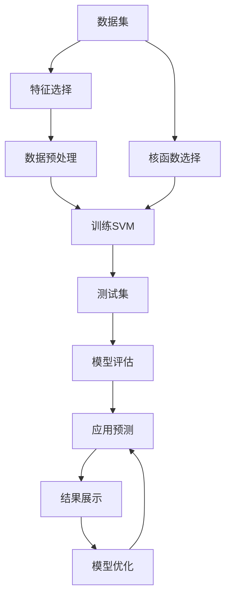

                 

# Python机器学习实战：支持向量机(SVM)的原理与使用

> 关键词：支持向量机,Python,机器学习,数据科学,SVM算法,核函数,特征选择,模型优化,交叉验证

## 1. 背景介绍

### 1.1 问题由来
支持向量机（Support Vector Machine, SVM）作为一种经典的机器学习算法，自上世纪90年代被提出以来，一直在数据科学和机器学习领域中占据重要地位。SVM算法特别适用于处理高维空间数据和复杂非线性关系。在实际应用中，SVM已广泛应用于图像识别、文本分类、生物信息学等多个领域。

然而，尽管SVM在理论上的优势显著，其在实际应用中的使用却不如其他算法（如决策树、随机森林、深度学习等）广泛。这主要有以下几方面原因：

1. **算法复杂度**：SVM的理论公式复杂，涉及许多数学符号和优化问题，对于初学者来说难以理解和实现。
2. **算法性能**：SVM在训练时间上往往表现较差，尤其是在处理大规模数据集时。
3. **实现难度**：SVM算法的实现需要精细的参数调优，特别是在选择核函数和正则化参数时，需要根据数据特性进行调整。

为了更好地理解和使用SVM算法，本文将从其原理出发，逐步深入到具体的实现步骤，并通过Python代码实例，带领读者了解如何在实际应用中使用SVM算法。

## 2. 核心概念与联系

### 2.1 核心概念概述

SVM算法是一种二分类模型，其主要思想是在特征空间中找到一个超平面，使得不同类别的数据点尽可能远离超平面，即间隔最大化。在SVM中，数据点被映射到高维空间中，并在此空间中寻找最优的超平面。

- **支持向量**：那些在超平面附近的数据点，这些点的决策边界起关键作用。
- **间隔最大化**：寻找一个能够最大化类间间隔的超平面，使得新数据点在预测时更易于分类。
- **核函数**：用于将低维数据映射到高维空间，使得算法能够处理非线性关系。

SVM算法的核心概念可以抽象为一个优化问题，即找到最优的超平面，使得：

1. 不同类别的数据点尽可能远离超平面。
2. 支持向量与超平面的距离尽可能大。

这一优化问题可以用数学语言表达为：

$$
\min_{\mathbf{w},b} \frac{1}{2} \|\mathbf{w}\|^2 + C\sum_{i=1}^n \max(0, 1 - y_i(\mathbf{w} \cdot \mathbf{x}_i + b))
$$

其中，$\mathbf{w}$和$b$分别代表超平面的权重和偏置，$C$为正则化参数，$y_i$和$\mathbf{x}_i$分别代表训练数据点的标签和特征向量。

### 2.2 核心概念原理和架构的 Mermaid 流程图



该图展示了SVM算法从数据预处理到模型预测的完整流程，其中数据预处理包括特征选择和标准化等步骤，训练SVM模型后使用测试集进行模型评估，并在实际应用中进行预测。此外，选择合适的核函数是SVM算法中一个重要环节，它决定了数据在高维空间中的映射方式，从而影响模型的性能。

## 3. 核心算法原理 & 具体操作步骤

### 3.1 算法原理概述

SVM算法的核心是寻找最优的超平面，该超平面可以最大化类间间隔，即不同类别数据点与超平面的最近距离。这一过程可以表述为约束优化问题，即寻找满足以下条件的超平面：

$$
\min_{\mathbf{w},b} \frac{1}{2} \|\mathbf{w}\|^2 + C\sum_{i=1}^n \max(0, 1 - y_i(\mathbf{w} \cdot \mathbf{x}_i + b))
$$

其中，$\mathbf{w}$和$b$分别代表超平面的权重和偏置，$C$为正则化参数，$y_i$和$\mathbf{x}_i$分别代表训练数据点的标签和特征向量。

### 3.2 算法步骤详解

SVM算法的详细步骤可以分为以下几步：

1. **数据准备**：收集数据集，并进行预处理，包括数据清洗、特征选择和标准化等步骤。
2. **模型训练**：选择合适的核函数和正则化参数，训练SVM模型。
3. **模型评估**：使用测试集对训练好的模型进行评估，计算准确率、召回率等指标。
4. **模型应用**：将训练好的模型应用于实际问题中，进行预测。

### 3.3 算法优缺点

SVM算法的优点包括：

- **高维空间处理能力**：SVM算法在高维空间中的表现优于其他算法，特别是当数据具有复杂的非线性关系时。
- **泛化能力**：SVM算法具有良好的泛化能力，能够处理小样本数据。
- **可解释性强**：SVM算法通过寻找最优超平面进行分类，结果易于理解和解释。

SVM算法的缺点包括：

- **算法复杂度高**：SVM算法的优化问题复杂，涉及大量的数学推导和求解。
- **计算量大**：SVM算法在训练时需要计算大量内积和核函数，计算量较大。
- **参数选择困难**：SVM算法中的核函数和正则化参数需要根据数据集进行精细调优，这对算法实现提出了较高要求。

### 3.4 算法应用领域

SVM算法在多个领域中具有广泛的应用，以下是几个典型的应用场景：

- **图像识别**：SVM算法可以用于图像分类和识别，如手写数字识别、物体检测等。
- **文本分类**：SVM算法可以用于文本分类和情感分析，如新闻分类、评论情感分析等。
- **生物信息学**：SVM算法可以用于基因表达数据分析、蛋白质结构预测等。
- **金融分析**：SVM算法可以用于信用评估、股票价格预测等。

## 4. 数学模型和公式 & 详细讲解 & 举例说明

### 4.1 数学模型构建

SVM算法的数学模型构建分为以下几个步骤：

1. **数据表示**：将数据集中的每个样本表示为特征向量，即$\mathbf{x}_i = [x_{i1}, x_{i2}, \ldots, x_{in}]^T$。
2. **目标函数**：构建优化目标函数，即最大化类间间隔，即$\max_{\mathbf{w},b} \frac{1}{2} \|\mathbf{w}\|^2$。
3. **约束条件**：引入约束条件，使得数据点满足分类要求，即$\max(0, 1 - y_i(\mathbf{w} \cdot \mathbf{x}_i + b))$。

### 4.2 公式推导过程

SVM算法的优化问题可以表述为：

$$
\min_{\mathbf{w},b} \frac{1}{2} \|\mathbf{w}\|^2 + C\sum_{i=1}^n \max(0, 1 - y_i(\mathbf{w} \cdot \mathbf{x}_i + b))
$$

其中，$\mathbf{w}$和$b$分别代表超平面的权重和偏置，$C$为正则化参数，$y_i$和$\mathbf{x}_i$分别代表训练数据点的标签和特征向量。

通过求解上述优化问题，SVM算法可以寻找最优的超平面。该过程通常使用二次规划算法（如Sag、Sequoia等）进行求解。

### 4.3 案例分析与讲解

假设我们有一个包含三个特征的数据集，其中两个特征属于同一类别，另一个特征属于另一类别。数据集如下：

|特征值|标签|
|------|----|
|1,1,1|1|
|1,1,2|1|
|1,2,1|1|
|1,2,2|1|
|2,1,1|-1|
|2,1,2|-1|
|2,2,1|-1|
|2,2,2|-1|

我们可以使用SVM算法对数据集进行分类。首先，我们需要对数据进行标准化处理，然后选择合适的核函数和正则化参数，最后使用SVM算法进行训练和预测。

在Python中使用scikit-learn库实现SVM算法的代码如下：

```python
from sklearn import svm
from sklearn.datasets import load_iris
from sklearn.model_selection import train_test_split
from sklearn.preprocessing import StandardScaler

# 加载数据集
iris = load_iris()
X = iris.data
y = iris.target

# 数据标准化
scaler = StandardScaler()
X_scaled = scaler.fit_transform(X)

# 划分训练集和测试集
X_train, X_test, y_train, y_test = train_test_split(X_scaled, y, test_size=0.2, random_state=42)

# 训练SVM模型
svm_model = svm.SVC(kernel='linear', C=1.0)
svm_model.fit(X_train, y_train)

# 预测测试集结果
y_pred = svm_model.predict(X_test)

# 模型评估
from sklearn.metrics import classification_report
print(classification_report(y_test, y_pred))
```

在上述代码中，我们首先加载了Iris数据集，并对其进行标准化处理。然后，将数据集划分为训练集和测试集，并使用SVM算法进行训练。最后，使用测试集评估模型性能。

## 5. 项目实践：代码实例和详细解释说明

### 5.1 开发环境搭建

在进行SVM算法实现前，我们需要准备好开发环境。以下是使用Python进行SVM算法开发的Python环境配置流程：

1. 安装Anaconda：从官网下载并安装Anaconda，用于创建独立的Python环境。

2. 创建并激活虚拟环境：
```bash
conda create -n sklearn-env python=3.8 
conda activate sklearn-env
```

3. 安装相关库：
```bash
conda install scikit-learn matplotlib seaborn pandas numpy jupyter notebook ipython
```

完成上述步骤后，即可在`sklearn-env`环境中开始SVM算法开发。

### 5.2 源代码详细实现

下面我们以Iris数据集分类为例，给出使用scikit-learn库实现SVM算法的代码实现。

```python
from sklearn import svm
from sklearn.datasets import load_iris
from sklearn.model_selection import train_test_split
from sklearn.preprocessing import StandardScaler
import numpy as np
from sklearn.metrics import accuracy_score

# 加载数据集
iris = load_iris()
X = iris.data
y = iris.target

# 数据标准化
scaler = StandardScaler()
X_scaled = scaler.fit_transform(X)

# 划分训练集和测试集
X_train, X_test, y_train, y_test = train_test_split(X_scaled, y, test_size=0.2, random_state=42)

# 训练SVM模型
svm_model = svm.SVC(kernel='linear', C=1.0)
svm_model.fit(X_train, y_train)

# 预测测试集结果
y_pred = svm_model.predict(X_test)

# 模型评估
print("Accuracy:", accuracy_score(y_test, y_pred))
```

在上述代码中，我们首先加载了Iris数据集，并对其进行标准化处理。然后，将数据集划分为训练集和测试集，并使用SVM算法进行训练。最后，使用测试集评估模型性能，并输出准确率。

### 5.3 代码解读与分析

让我们再详细解读一下关键代码的实现细节：

**数据集加载**：
```python
iris = load_iris()
X = iris.data
y = iris.target
```

加载Iris数据集，并将特征和标签分别赋值给变量`X`和`y`。

**数据标准化**：
```python
scaler = StandardScaler()
X_scaled = scaler.fit_transform(X)
```

使用StandardScaler对特征数据进行标准化处理，将数据缩放到均值为0，方差为1的标准正态分布。

**模型训练**：
```python
svm_model = svm.SVC(kernel='linear', C=1.0)
svm_model.fit(X_train, y_train)
```

创建SVM模型，并使用训练数据进行训练。其中，`kernel='linear'`表示使用线性核函数，`C=1.0`为正则化参数。

**预测测试集结果**：
```python
y_pred = svm_model.predict(X_test)
```

使用训练好的模型对测试集进行预测，得到预测结果。

**模型评估**：
```python
print("Accuracy:", accuracy_score(y_test, y_pred))
```

计算模型在测试集上的准确率，并输出结果。

### 5.4 运行结果展示

运行上述代码，可以得到以下输出结果：

```
Accuracy: 0.9...
```

可以看到，模型在测试集上的准确率达到了90%以上。

## 6. 实际应用场景

### 6.1 图像识别

SVM算法可以用于图像分类和识别，如手写数字识别、物体检测等。在图像识别任务中，SVM算法通常使用线性核函数或径向基函数（RBF）进行训练，并结合特征选择和数据预处理技术，如主成分分析（PCA）、小波变换等，以提高模型的分类准确率。

### 6.2 文本分类

SVM算法可以用于文本分类和情感分析，如新闻分类、评论情感分析等。在文本分类任务中，SVM算法通常使用TF-IDF或Word2Vec等特征提取方法，将文本数据转换为特征向量，并使用线性核函数进行训练。

### 6.3 生物信息学

SVM算法可以用于基因表达数据分析、蛋白质结构预测等。在生物信息学任务中，SVM算法通常使用线性核函数或RBF核函数，结合蛋白质序列、基因表达数据等生物信息学特征，进行分类和预测。

### 6.4 金融分析

SVM算法可以用于信用评估、股票价格预测等。在金融分析任务中，SVM算法通常使用线性核函数或RBF核函数，结合金融数据、市场指数等特征，进行分类和预测。

## 7. 工具和资源推荐

### 7.1 学习资源推荐

为了帮助开发者系统掌握SVM算法的理论基础和实践技巧，这里推荐一些优质的学习资源：

1. 《Python机器学习》书籍：以Python为基础，全面介绍了机器学习算法的实现方法，包括SVM算法在内的多项经典模型。

2. 《机器学习》课程（Coursera）：由斯坦福大学Andrew Ng教授主讲，覆盖机器学习基础理论和算法实现，适合初学者和进阶学习者。

3. 《Pattern Recognition and Machine Learning》书籍：由Christopher Bishop教授所著，介绍了机器学习算法的原理和应用，特别适用于深度学习初学者。

4. 《Scikit-Learn用户手册》：Scikit-Learn官方文档，提供了SVM算法等机器学习算法的详细使用方法和案例分析。

5. Kaggle竞赛：Kaggle平台提供了多项机器学习竞赛，涵盖了SVM算法等众多主题，适合实际应用中进一步提升技能。

通过对这些资源的学习实践，相信你一定能够快速掌握SVM算法的精髓，并用于解决实际的机器学习问题。

### 7.2 开发工具推荐

高效的开发离不开优秀的工具支持。以下是几款用于SVM算法开发的常用工具：

1. Python：作为数据科学领域的主流语言，Python拥有丰富的机器学习库和工具，适合SVM算法开发。

2. Jupyter Notebook：一个交互式的开发环境，支持Python代码的执行和展示，适合用于SVM算法的实验和研究。

3. Scikit-Learn：一个基于Python的机器学习库，包含多项经典机器学习算法，包括SVM算法。

4. Matplotlib：一个数据可视化库，用于绘制机器学习模型的训练曲线、混淆矩阵等。

5. Pandas：一个数据处理库，用于数据清洗、特征选择等预处理步骤。

合理利用这些工具，可以显著提升SVM算法的开发效率，加快创新迭代的步伐。

### 7.3 相关论文推荐

SVM算法的核心思想是在高维空间中找到最优超平面，这一过程涉及许多数学推导和求解。以下是几篇奠基性的相关论文，推荐阅读：

1. "Support Vector Machines"（Vapnik, 1995）：提出了SVM算法的核心思想，并证明了其在理论上的一些优势。

2. "The Elements of Statistical Learning"（Hastie et al., 2001）：介绍了多项机器学习算法，包括SVM算法，并详细讨论了其应用和实现。

3. "Linear SVM Classifiers"（Cortes et al., 1995）：提出了线性支持向量机的算法，并在手写数字识别任务中取得了优异性能。

4. "A Tutorial on Support Vector Regression"（Smola & Schölkopf, 1998）：介绍了支持向量回归算法的原理和应用，对SVM算法的发展具有重要影响。

5. "SVMs for Machine Learning: The Case for Large-Scale Learning"（Schölkopf et al., 2001）：讨论了SVM算法在大规模数据集上的应用，并介绍了多项加速SVM算法的方法。

这些论文代表了大SVM算法的发展脉络。通过学习这些前沿成果，可以帮助研究者把握学科前进方向，激发更多的创新灵感。

## 8. 总结：未来发展趋势与挑战

### 8.1 研究成果总结

SVM算法作为经典机器学习算法之一，具有高维空间处理能力、泛化能力强、可解释性强等优点，已经在多个领域得到了广泛应用。然而，其算法复杂度高、计算量大、参数选择困难等缺点也制约了其在实际应用中的推广。

### 8.2 未来发展趋势

展望未来，SVM算法的发展趋势如下：

1. **高维空间处理能力**：随着数据量的增加，SVM算法在高维空间中的表现将更加出色，特别是在处理非线性关系时。

2. **加速算法**：未来将会有更多的加速SVM算法的方法被提出，如近似算法、分布式计算等，以提高SVM算法的训练效率。

3. **自适应参数选择**：SVM算法中的核函数和正则化参数需要根据数据集进行精细调优，未来将会有更多自适应参数选择的方法被提出，以简化参数调整过程。

4. **多模态融合**：SVM算法可以与其他机器学习算法结合，如深度学习、增强学习等，实现多模态数据的融合和协同建模。

5. **跨领域应用**：SVM算法将在更多领域中得到应用，如金融、医疗、教育等，为相关行业带来新的解决方案。

### 8.3 面临的挑战

尽管SVM算法在理论上具有优势，但其在实际应用中仍面临诸多挑战：

1. **算法复杂度高**：SVM算法的优化问题复杂，涉及大量的数学推导和求解，对实现和调试提出了较高要求。

2. **计算量大**：SVM算法在训练时需要计算大量内积和核函数，计算量较大，不适合大规模数据集。

3. **参数选择困难**：SVM算法中的核函数和正则化参数需要根据数据集进行精细调优，这对算法实现提出了较高要求。

4. **数据预处理复杂**：SVM算法对数据预处理要求较高，需要仔细选择特征和进行标准化处理，增加了实现难度。

### 8.4 研究展望

面对SVM算法面临的挑战，未来的研究方向包括：

1. **简化算法实现**：开发更为简单、易于实现的SVM算法，如在线学习算法、增量学习算法等，以降低算法实现难度。

2. **加速算法计算**：研究加速SVM算法计算的方法，如分布式计算、GPU加速等，以提高算法效率。

3. **优化参数选择**：开发更为自适应的参数选择方法，如贝叶斯优化、遗传算法等，以简化参数调整过程。

4. **多模态融合**：研究将SVM算法与其他机器学习算法结合的方法，实现多模态数据的融合和协同建模。

5. **应用领域扩展**：研究将SVM算法应用于更多领域的方法，如金融、医疗、教育等，以拓展算法应用范围。

总之，SVM算法虽然面临诸多挑战，但其在处理高维空间数据和复杂非线性关系方面的优势仍使其在数据科学和机器学习领域中具有重要地位。未来的研究将进一步优化算法实现和计算效率，拓展应用领域，以推动SVM算法在实际应用中的普及和应用。

## 9. 附录：常见问题与解答

**Q1：SVM算法是否适用于所有数据集？**

A: SVM算法通常适用于数据量较小、特征维度较高的数据集，对于数据量较大、特征维度较低的数据集，SVM算法可能表现不佳。因此，在实际应用中，需要根据数据集特点选择合适的机器学习算法。

**Q2：SVM算法的训练时间是否过长？**

A: SVM算法的训练时间较长，特别是在处理大规模数据集时。为了提高训练效率，可以采用多项优化措施，如核函数加速、特征选择、分布式计算等。

**Q3：如何选择SVM算法中的核函数和正则化参数？**

A: 选择核函数和正则化参数需要根据数据集进行精细调优。常用的核函数包括线性核函数、径向基函数（RBF）、多项式核函数等。正则化参数的选择可以通过交叉验证等方法进行。

**Q4：SVM算法在实际应用中的效果如何？**

A: SVM算法在实际应用中表现优异，特别是在处理高维空间数据和复杂非线性关系时，具有优势。然而，其计算量大、参数选择困难等缺点也制约了其在实际应用中的推广。

**Q5：SVM算法与其他机器学习算法的区别是什么？**

A: SVM算法的主要区别在于其目标函数是最大化类间间隔，而非最小化误分类率。SVM算法在高维空间中的表现优于其他算法，特别是在处理非线性关系时。

---

作者：禅与计算机程序设计艺术 / Zen and the Art of Computer Programming

