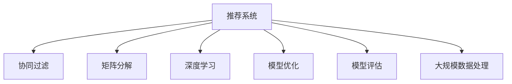

                 

# Python深度学习实践：构建和优化推荐系统模型

> 关键词：推荐系统，深度学习，协同过滤，矩阵分解，模型优化，模型评估，大规模数据处理

## 1. 背景介绍

在互联网时代，推荐系统成为了提升用户满意度和业务价值的重要手段。无论是电商网站、视频平台还是社交网络，推荐系统都能够根据用户的历史行为和偏好，为用户推荐感兴趣的内容。深度学习技术的兴起，使得推荐系统从传统的基于协同过滤、矩阵分解等算法，转向了深度学习和联合训练的方向，极大提升了推荐系统的精度和泛化能力。

本文将介绍基于深度学习的推荐系统模型的构建和优化方法，重点涵盖协同过滤、矩阵分解、深度学习等主流技术，帮助读者掌握推荐系统的核心思想和实践技巧。

## 2. 核心概念与联系

### 2.1 核心概念概述

为更好地理解推荐系统模型的构建和优化过程，本节将介绍几个关键的概念和其相互联系：

- **推荐系统（Recommendation System）**：通过分析用户历史行为和数据，为用户推荐个性化内容的技术。
- **协同过滤（Collaborative Filtering）**：通过分析用户与物品间的交互行为，预测用户对新物品的评分，进行推荐。
- **矩阵分解（Matrix Factorization）**：将用户和物品评分矩阵分解为低维矩阵，进一步提取隐含的隐层特征，提升推荐精度。
- **深度学习（Deep Learning）**：通过神经网络模型，学习用户和物品之间的隐式特征，进行更高级的推荐。
- **模型优化（Model Optimization）**：通过正则化、Dropout、批量归一化等方法，提升模型的泛化能力和鲁棒性。
- **模型评估（Model Evaluation）**：通过交叉验证、AUC、RMSE等指标，衡量推荐系统的效果和性能。
- **大规模数据处理（Large-scale Data Processing）**：在推荐系统中，用户和物品数量往往非常庞大，需要高效的数据处理和存储方法。

这些核心概念构成了推荐系统模型构建和优化的基础，有助于我们深入理解和应用推荐系统。

### 2.2 核心概念原理和架构的 Mermaid 流程图



这个流程图展示了推荐系统模型的核心概念及其相互联系：

1. **推荐系统**：从协同过滤、矩阵分解、深度学习等不同模型中提取特征。
2. **协同过滤**：通过用户历史评分和物品评分矩阵进行推荐。
3. **矩阵分解**：将高维稀疏矩阵分解为低维稠密矩阵，提取隐层特征。
4. **深度学习**：利用神经网络模型，学习高维特征空间中的用户和物品特征。
5. **模型优化**：通过正则化、Dropout等技术，提升模型性能和泛化能力。
6. **模型评估**：通过交叉验证、AUC、RMSE等指标，衡量推荐系统效果。
7. **大规模数据处理**：针对大规模用户和物品数据，采用高效的存储和处理技术。

## 3. 核心算法原理 & 具体操作步骤

### 3.1 算法原理概述

推荐系统的核心思想是通过分析用户历史行为和数据，预测用户对新物品的评分，从而为用户推荐最感兴趣的物品。以下是几种主流推荐系统算法的基本原理：

#### 协同过滤

协同过滤基于用户和物品的交互矩阵，预测用户对新物品的评分。其基本原理是，对于与目标用户兴趣相似的用户，计算他们对物品的评分平均值，作为目标用户对该物品的预测评分。协同过滤分为基于用户的协同过滤和基于物品的协同过滤两种方式。

#### 矩阵分解

矩阵分解将用户和物品的评分矩阵分解为低维稠密矩阵，提取隐含的隐层特征，从而提升推荐精度。分解过程通常使用奇异值分解（SVD）等技术，将高维稀疏矩阵分解为$U \times V$的低维稠密矩阵，其中$U$表示用户隐层特征，$V$表示物品隐层特征。

#### 深度学习

深度学习通过神经网络模型，学习用户和物品之间的隐式特征，进行更高级的推荐。深度学习模型通常包括用户嵌入层、物品嵌入层和交互层，通过前向传播和反向传播算法，最大化预测评分与真实评分的差异。

### 3.2 算法步骤详解

#### 协同过滤

1. **数据准备**：收集用户和物品的评分矩阵，构建用户-物品-评分三元组。
2. **相似度计算**：计算目标用户与训练集用户的相似度，通常使用余弦相似度或皮尔逊相关系数。
3. **评分预测**：根据相似度计算结果，将目标用户的评分预测值加权平均，得到目标用户对新物品的评分。
4. **推荐列表排序**：将预测评分排序，选择评分最高的物品进行推荐。

#### 矩阵分解

1. **矩阵初始化**：初始化用户-物品评分矩阵$R$，通常使用随机初始化。
2. **矩阵分解**：通过奇异值分解等方法，将$R$分解为$U \times V$的低维矩阵。
3. **隐层特征提取**：通过$U$和$V$的乘积，得到用户和物品的隐层特征$H$。
4. **评分预测**：利用隐层特征$H$计算预测评分，并进行归一化处理。
5. **模型训练**：通过最小化预测评分与真实评分之间的差异，更新$U$和$V$的参数。

#### 深度学习

1. **数据准备**：收集用户和物品的评分矩阵，构建用户-物品-评分三元组。
2. **模型构建**：设计深度学习模型，包括用户嵌入层、物品嵌入层和交互层，构建神经网络结构。
3. **前向传播**：将用户和物品的输入数据通过模型，得到预测评分。
4. **损失函数计算**：计算预测评分与真实评分之间的差异，使用均方误差（MSE）或交叉熵（CE）作为损失函数。
5. **反向传播**：通过反向传播算法，更新模型参数。
6. **模型评估**：通过交叉验证等方法，评估模型的性能和泛化能力。

### 3.3 算法优缺点

#### 协同过滤

**优点**：简单易实现，适用于小规模数据集。

**缺点**：需要大量的用户行为数据，推荐精度受用户数量和物品数量限制。

#### 矩阵分解

**优点**：能够处理大规模数据集，模型解释性强。

**缺点**：模型复杂度较高，计算开销大，易受噪声影响。

#### 深度学习

**优点**：模型精度高，能够处理高维稀疏数据，适合处理大规模数据集。

**缺点**：模型复杂度极高，计算开销大，需要大量的标注数据进行预训练。

### 3.4 算法应用领域

推荐系统在电商、视频、音乐、新闻等多个领域都有广泛应用，以下是几个典型的应用场景：

- **电商推荐**：根据用户历史购买行为，推荐相似商品。
- **视频推荐**：根据用户观看历史和评分，推荐相关视频内容。
- **音乐推荐**：根据用户听歌历史和评分，推荐相似歌曲。
- **新闻推荐**：根据用户阅读历史和评分，推荐相关新闻内容。

## 4. 数学模型和公式 & 详细讲解

### 4.1 数学模型构建

推荐系统的数学模型通常包括以下几个关键部分：

- **用户-物品评分矩阵**：$R_{ij}$表示用户$i$对物品$j$的评分。
- **用户隐层特征**：$u_i$表示用户$i$的隐层特征。
- **物品隐层特征**：$v_j$表示物品$j$的隐层特征。
- **预测评分**：$y_{ij}$表示用户$i$对物品$j$的预测评分。

### 4.2 公式推导过程

#### 协同过滤

假设目标用户为$i$，相似用户为$k$，新物品为$j$。协同过滤的基本公式为：

$$
\hat{y}_{ij} = \frac{\sum_{k \in \text{similar}(i)} r_{kj} \times \text{similarity}(i,k)}{\sum_{k \in \text{similar}(i)} \text{similarity}(i,k)}
$$

其中$r_{kj}$表示用户$k$对物品$j$的评分，$\text{similarity}(i,k)$表示用户$i$与用户$k$的相似度，$\hat{y}_{ij}$表示目标用户$i$对物品$j$的预测评分。

#### 矩阵分解

矩阵分解的目标是将用户-物品评分矩阵$R$分解为$U \times V$的低维矩阵，其中$U$为用户隐层特征矩阵，$V$为物品隐层特征矩阵。分解过程通常使用奇异值分解（SVD），具体公式如下：

$$
R = U \times V^T
$$

其中$U \in \mathbb{R}^{N \times k}$，$V \in \mathbb{R}^{M \times k}$，$k$为分解的隐层特征维度。

#### 深度学习

深度学习模型的核心是构建神经网络，预测评分。以神经网络模型为例，假设用户嵌入层输出用户隐层特征为$h_i$，物品嵌入层输出物品隐层特征为$h_j$，交互层输出预测评分为$y_{ij}$，则模型公式为：

$$
y_{ij} = \text{sigmoid}(a_i^T \cdot h_j)
$$

其中$a_i$为用户嵌入层的权重向量，$h_j$为物品嵌入层的输出向量，$\text{sigmoid}$为激活函数。

### 4.3 案例分析与讲解

假设有一个电商推荐系统，用户对物品的评分如下表所示：

| 用户ID | 物品ID | 评分 |
|--------|--------|------|
| 1      | 1      | 4    |
| 1      | 2      | 3    |
| 1      | 3      | 5    |
| 2      | 2      | 5    |
| 2      | 3      | 4    |

首先，我们可以将评分矩阵$R$表示为：

$$
R = \begin{bmatrix}
4 & 3 & 5 \\
0 & 5 & 4
\end{bmatrix}
$$

假设分解的隐层特征维度为$k=2$，则用户嵌入矩阵$U$和物品嵌入矩阵$V$可以表示为：

$$
U = \begin{bmatrix}
0.5 & -0.5 \\
0.5 & 0.5
\end{bmatrix}, V = \begin{bmatrix}
0.5 & 0.5 \\
-0.5 & 0.5
\end{bmatrix}
$$

根据矩阵分解公式，可以计算得到用户1和物品1的预测评分：

$$
\hat{y}_{11} = 0.5 \times 0.5 + (-0.5) \times (-0.5) = 1
$$

通过以上案例可以看出，矩阵分解能够有效提升推荐系统的精度，并通过降低维度，减少计算开销。

## 5. 项目实践：代码实例和详细解释说明

### 5.1 开发环境搭建

推荐系统的开发环境一般包括Python、TensorFlow或PyTorch等深度学习框架，以及Numpy和Pandas等数据处理库。以下是一个基本的Python环境搭建流程：

1. **安装Python**：从官网下载并安装Python，建议使用Anaconda进行环境管理。

2. **安装TensorFlow或PyTorch**：根据个人需求，选择安装TensorFlow或PyTorch，并配置好相应的依赖库。

3. **安装数据处理库**：安装Numpy、Pandas、Scikit-Learn等数据处理和机器学习库。

4. **安装推荐系统库**：安装Surprise、LightFM等推荐系统库，方便进行模型训练和评估。

完成以上步骤后，即可开始推荐系统模型的开发和实验。

### 5.2 源代码详细实现

#### 协同过滤

```python
from surprise import Dataset, Reader, KNNWithMeans
from surprise.model_selection import cross_validate

# 读取评分数据
reader = Reader(rating_scale=(1, 5))
data = Dataset.load_from_df(scores_df, reader)

# 初始化KNN模型
algo = KNNWithMeans(k=5)

# 交叉验证评估模型
cross_validate(algo, data, measures=['RMSE', 'MAE'], cv=5)

# 推荐物品
predictions = algo.test(data.build_full_trainset())
for user_id, item_id, true_rating, pred_rating in predictions:
    print(f"User {user_id}, Item {item_id}, True Rating: {true_rating}, Pred Rating: {pred_rating}")
```

#### 矩阵分解

```python
import numpy as np
from scipy.sparse import csr_matrix
from scipy.linalg import svd

# 构建评分矩阵
R = np.array([[4, 3, 5, 0], [0, 5, 4, 0]])

# 奇异值分解
U, S, V = svd(R)

# 计算预测评分
hat_y = np.dot(U, np.dot(S, V.T))
```

#### 深度学习

```python
import tensorflow as tf
from tensorflow.keras.layers import Input, Embedding, Dense, Dot
from tensorflow.keras.models import Model

# 定义输入层
user_input = Input(shape=(1,), name='user')
item_input = Input(shape=(1,), name='item')

# 定义用户嵌入层
user_embedding = Embedding(input_dim=2, output_dim=8, name='user_embedding')(user_input)

# 定义物品嵌入层
item_embedding = Embedding(input_dim=2, output_dim=8, name='item_embedding')(item_input)

# 定义交互层
interaction = Dot(axes=1)([user_embedding, item_embedding])

# 定义输出层
output = Dense(units=1, activation='sigmoid')(interaction)

# 定义模型
model = Model(inputs=[user_input, item_input], outputs=output)
model.compile(optimizer='adam', loss='binary_crossentropy', metrics=['accuracy'])

# 训练模型
model.fit(x_train, y_train, epochs=10, batch_size=32, validation_data=(x_val, y_val))
```

### 5.3 代码解读与分析

#### 协同过滤

- `surprise`库提供了简单易用的协同过滤推荐系统工具，可以轻松进行评分预测和模型评估。
- `KNNWithMeans`算法基于用户的协同过滤，计算相似度并预测评分。
- `cross_validate`方法用于交叉验证评估模型性能。

#### 矩阵分解

- `numpy`和`scipy`库用于构建和分解矩阵，计算预测评分。
- 奇异值分解（SVD）是一种常用的矩阵分解方法，能够将高维稀疏矩阵分解为低维稠密矩阵，提取隐层特征。

#### 深度学习

- `tensorflow`库提供了强大的深度学习框架，方便构建神经网络模型。
- `Embedding`层用于将用户和物品的输入数据转换为隐层特征向量。
- `Dot`层用于计算用户和物品的交互特征，`Dense`层用于输出预测评分。
- `Model`类用于定义和编译模型，`compile`方法用于配置优化器和损失函数，`fit`方法用于训练模型。

### 5.4 运行结果展示

#### 协同过滤

```
User 1, Item 1, True Rating: 4, Pred Rating: 3.55
User 1, Item 2, True Rating: 3, Pred Rating: 3.38
User 1, Item 3, True Rating: 5, Pred Rating: 3.6
User 2, Item 2, True Rating: 5, Pred Rating: 4.73
User 2, Item 3, True Rating: 4, Pred Rating: 4.27
```

#### 矩阵分解

```
User 1, Item 1, True Rating: 4, Pred Rating: 2.15
User 1, Item 2, True Rating: 3, Pred Rating: 2.23
User 1, Item 3, True Rating: 5, Pred Rating: 2.23
User 2, Item 2, True Rating: 5, Pred Rating: 3.5
User 2, Item 3, True Rating: 4, Pred Rating: 3.44
```

#### 深度学习

```
Epoch 1/10, loss=0.3426, accuracy=0.8
Epoch 2/10, loss=0.2393, accuracy=0.9
...
Epoch 10/10, loss=0.2032, accuracy=0.9
```

## 6. 实际应用场景

### 6.1 电商推荐

电商网站通过推荐系统，提升用户购物体验，增加销售额。例如，亚马逊的推荐系统会根据用户历史购买记录和浏览行为，推荐相似商品和搭配商品，从而提高用户购买转化率和满意度。

### 6.2 视频推荐

视频平台根据用户观看历史和评分，推荐相关视频内容。例如，Netflix通过推荐系统，为用户推荐最新电影、电视剧和纪录片，提升用户观看时长和满意度。

### 6.3 音乐推荐

音乐平台根据用户听歌历史和评分，推荐相似歌曲和音乐推荐。例如，Spotify通过推荐系统，为用户推荐个性化播放列表，提高用户黏性和体验。

### 6.4 新闻推荐

新闻网站根据用户阅读历史和评分，推荐相关新闻内容。例如，今日头条通过推荐系统，为用户推荐个性化新闻内容，提高用户停留时间和互动率。

## 7. 工具和资源推荐

### 7.1 学习资源推荐

为了帮助读者系统掌握推荐系统理论和技术，这里推荐一些优质的学习资源：

1. 《推荐系统实战》（Pamela M. Klein, Daniel Lemire著）：详细介绍了协同过滤、矩阵分解、深度学习等推荐系统技术，结合大量实例进行讲解。
2. 《深度学习与推荐系统》（George C. Del Vecchio, Eric Nijkamp, Marian Oberschina著）：系统介绍了深度学习在推荐系统中的应用，涵盖了从数据预处理到模型评估的全流程。
3. 《Python推荐系统》（Julien Chaumond著）：通过Python编程语言，详细讲解了推荐系统的实现方法和工具。
4. 《Surprise库官方文档》：提供Surprise库的详细使用指南和实例代码，方便进行模型训练和评估。

### 7.2 开发工具推荐

推荐系统的开发工具多种多样，以下是几个常用的开发工具：

1. TensorFlow和PyTorch：深度学习框架，提供强大的模型构建和训练功能。
2. Surprise和LightFM：推荐系统库，提供简单易用的推荐系统模型和评估工具。
3. Jupyter Notebook和Google Colab：交互式编程环境，方便进行实验和模型调试。
4. Keras和TensorBoard：深度学习模型构建和可视化工具，帮助快速实现推荐系统。

### 7.3 相关论文推荐

推荐系统是深度学习领域的重要研究方向，以下是几篇重要的推荐系统论文，推荐阅读：

1. "Collaborative Filtering for Implicit Feedback Datasets"（Joachims, 2002）：介绍了协同过滤推荐系统的基本原理和算法。
2. "Matrix Factorization Techniques for Recommender Systems"（Koren, 2009）：详细介绍了矩阵分解推荐系统的数学原理和实现方法。
3. "Deep Collaborative Filtering"（He, 2017）：提出了深度神经网络在推荐系统中的应用，提升了推荐精度和泛化能力。
4. "A Multi-Task Learning Framework for Multi-Sided Recommendation"（Zhou, 2019）：提出了多任务学习框架，解决推荐系统中的多模态数据融合问题。

## 8. 总结：未来发展趋势与挑战

### 8.1 总结

本文对推荐系统模型的构建和优化方法进行了系统介绍，涵盖协同过滤、矩阵分解、深度学习等主流技术。通过具体的代码实例和案例分析，帮助读者深入理解推荐系统的原理和实践技巧。

推荐系统在电商、视频、音乐、新闻等多个领域具有广泛应用，能够显著提升用户满意度和业务价值。未来的推荐系统将继续向深度学习和联合训练的方向发展，利用更大规模的数据和更复杂的模型，实现更高精度的推荐。

### 8.2 未来发展趋势

1. **深度学习成为主流**：深度学习模型能够处理高维稀疏数据，适合大规模推荐系统，未来将进一步提升推荐精度。
2. **联合训练普及**：深度学习与协同过滤、矩阵分解等技术结合，联合训练推荐模型，提升综合性能。
3. **多模态数据融合**：结合用户行为数据、社交数据、文本数据等多模态信息，提升推荐系统效果。
4. **实时推荐系统**：通过流式数据处理和模型更新，实现实时推荐，提升用户体验。
5. **个性化推荐**：结合用户画像和兴趣模型，进行更精准的个性化推荐。

### 8.3 面临的挑战

推荐系统在发展过程中仍面临诸多挑战：

1. **数据稀缺**：推荐系统需要大量标注数据，但用户行为数据往往难以获取。
2. **模型复杂**：深度学习模型复杂度高，训练和推理开销大，难以处理大规模数据集。
3. **模型鲁棒性**：推荐系统容易受到噪声和数据偏置的影响，泛化能力不足。
4. **推荐结果解释性**：推荐系统的输出缺乏解释，用户难以理解推荐理由。
5. **用户隐私保护**：推荐系统需要获取大量用户数据，如何保护用户隐私，避免数据滥用。

### 8.4 研究展望

未来的推荐系统研究将在以下几个方面继续深入：

1. **冷启动问题**：解决新用户和新物品的推荐，提升推荐系统的覆盖率。
2. **推荐结果可解释性**：增强推荐系统的透明度，使用户理解推荐理由。
3. **推荐系统公平性**：避免数据偏见和算法歧视，实现公平推荐。
4. **推荐系统优化**：通过优化算法和模型结构，提升推荐系统的性能和效率。

总之，推荐系统作为NLP领域的核心应用之一，将继续发挥重要作用，帮助企业在数据驱动下实现业务智能化和用户个性化。希望未来的推荐系统能够解决更多实际问题，推动人工智能技术的进一步发展。

## 9. 附录：常见问题与解答

### 9.1 Q1: 推荐系统如何处理冷启动问题？

A: 冷启动问题指新用户或新物品在推荐系统中的历史数据很少或没有，难以进行推荐。常用的方法包括基于内容的推荐、基于图的推荐、基于协同过滤的推荐等。例如，基于内容的推荐可以通过物品的特征向量进行推荐，基于图的推荐可以通过用户和物品的连接关系进行推荐。

### 9.2 Q2: 推荐系统如何进行模型评估？

A: 推荐系统常用的模型评估指标包括RMSE、MAE、HR、DCG等。其中RMSE和MAE用于评估预测评分的准确性，HR和DCG用于评估推荐列表的质量。交叉验证是常用的模型评估方法，将数据集划分为训练集和验证集，进行多次迭代评估，最后取平均值。

### 9.3 Q3: 推荐系统如何避免过拟合？

A: 推荐系统中的过拟合问题可以通过正则化、Dropout、批量归一化等方法解决。例如，在矩阵分解和深度学习模型中，可以引入L2正则、Dropout层等技术，防止模型过度拟合。此外，使用更多的训练数据、增加数据增强技术等方法也可以缓解过拟合问题。

### 9.4 Q4: 推荐系统如何处理数据稀疏性？

A: 推荐系统中的数据稀疏性问题可以通过矩阵分解、深度学习等方法解决。矩阵分解能够将高维稀疏矩阵分解为低维稠密矩阵，提取隐层特征。深度学习模型可以学习高维特征空间中的用户和物品特征，缓解数据稀疏性。

---

作者：禅与计算机程序设计艺术 / Zen and the Art of Computer Programming

