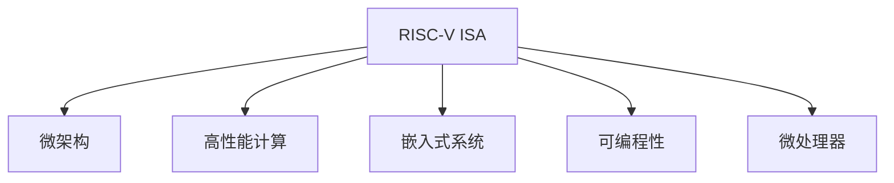

                 

# RISC-V 开源指令集：RISC-V ISA

> 关键词：RISC-V, 开源指令集, ISA, 微架构, 高性能计算, 嵌入式系统, 可编程性

## 1. 背景介绍

### 1.1 问题由来

在过去的几十年里，x86和ARM指令集架构几乎统治了整个计算机硬件市场，但近年来，一种新兴的架构——RISC-V（Reduced Instruction Set Computing）开始崭露头角。RISC-V是一个开源的指令集架构，由加州大学伯克利分校在2010年发起，旨在为现代处理器设计和优化提供一个灵活、开放的平台。RISC-V的核心理念是简洁、低延迟、高并行性和易于集成，这些特性使得它在高性能计算、嵌入式系统、可编程性等多个领域具有广泛的应用前景。

### 1.2 问题核心关键点

RISC-V指令集架构的核心优势在于其可定制性、低功耗和高效能。与传统指令集相比，RISC-V的指令集更为简洁，每个指令只执行一个操作，这使得硬件设计更为简单，同时也提高了指令的执行效率。RISC-V的微架构设计也注重了并行性和内存访问的优化，通过流水线、缓存和多核技术，显著提升了计算效率。

RISC-V的另一个重要特点是其开源性。RISC-V基金会（RISC-V Foundation）为所有开发者提供了免费的授权，使得开发者可以自由地修改、使用和分发RISC-V指令集，推动了其在学术界和工业界的应用。

## 2. 核心概念与联系

### 2.1 核心概念概述

为了更好地理解RISC-V指令集架构，本节将介绍几个密切相关的核心概念：

- **RISC-V ISA**：RISC-V指令集架构，包含基本指令集、内存模型、寄存器集合等信息。
- **微架构**：硬件与软件接口的设计，包括指令流水线、缓存、内存控制器等。
- **高性能计算**：利用并行计算、向量计算、加速器等技术，提升计算效率和性能。
- **嵌入式系统**：针对资源受限设备设计的计算机系统，通常需要低功耗和低成本。
- **可编程性**：硬件的编程灵活性，能够快速适应不同的应用场景。
- **微处理器**：集成有RISC-V指令集、微架构和硬件设计的处理器。

这些概念之间的逻辑关系可以通过以下Mermaid流程图来展示：



这个流程图展示了我标签言指令集架构的核心概念及其之间的关系：

1. RISC-V ISA是微架构设计的依据。
2. 微架构通过硬件实现RISC-V指令集。
3. 高性能计算技术可应用于RISC-V处理器，提高其计算效率。
4. 嵌入式系统通常使用低功耗的RISC-V处理器。
5. 可编程性是RISC-V处理器的重要特性。
6. 微处理器是RISC-V指令集和微架构的最终集成。

这些概念共同构成了RISC-V指令集架构的基础，使得RISC-V在多个领域具有广泛的应用潜力。

## 3. 核心算法原理 & 具体操作步骤
### 3.1 算法原理概述

RISC-V指令集架构的设计原则是简化指令集、提高可编程性和灵活性。其核心思想是通过减少指令的复杂度、提高并行性和优化内存访问，来提升处理器性能和效率。RISC-V指令集主要包括整数、浮点数和向量指令等，支持多种数据类型和操作。

RISC-V的微架构设计也注重了流水线、缓存和多核技术的优化，通过并行执行多条指令，最大化利用处理器资源，提高计算效率。RISC-V处理器通常采用Load-Store结构，即所有数据访问均通过Load和Store指令进行，这样可以简化指令集，提高指令执行速度。

### 3.2 算法步骤详解

RISC-V指令集架构的实现步骤主要包括以下几个方面：

1. **定义指令集**：根据RISC-V规范，定义基本的指令集，包括整数、浮点数、向量等操作。
2. **设计微架构**：设计处理器的硬件结构，包括指令流水线、缓存、寄存器、中断控制器等。
3. **实现软件支持**：编写操作系统、编译器和应用程序，以充分利用RISC-V指令集和微架构的特性。
4. **测试与验证**：对RISC-V处理器进行性能测试和验证，确保其满足设计要求。

### 3.3 算法优缺点

RISC-V指令集架构具有以下优点：

- **简洁高效**：指令集简化，指令执行速度更快，降低了硬件设计的复杂度。
- **灵活可定制**：通过扩展指令集和微架构，可以满足不同应用场景的需求。
- **低功耗**：指令集设计注重能效比，适用于低功耗场景。
- **开源免费**：RISC-V指令集完全开源，降低了开发和部署成本。

同时，RISC-V也存在一些局限性：

- **生态系统不完善**：相比于x86和ARM，RISC-V的生态系统和软件支持还不够完善。
- **缺乏大厂商支持**：虽然RISC-V基金会有很多成员，但缺乏像x86和ARM那样的巨头厂商支持。
- **性能提升有限**：相比于传统架构，RISC-V在高性能计算方面的提升空间有限。

### 3.4 算法应用领域

RISC-V指令集架构在多个领域具有广泛的应用：

- **高性能计算**：RISC-V的简洁高效的指令集和高并行性，使其在超级计算机、数据中心等领域具有竞争力。
- **嵌入式系统**：RISC-V的低功耗和高性能，使其在物联网、智能设备等嵌入式系统中具有优势。
- **可编程性**：RISC-V的可定制性和灵活性，使其成为各种可编程应用（如FPGA、ASIC等）的理想选择。
- **学术研究**：RISC-V的开源性和灵活性，使其成为计算机体系结构领域研究和教学的重要平台。

## 4. 数学模型和公式 & 详细讲解 & 举例说明

### 4.1 数学模型构建

RISC-V指令集架构的数学模型可以抽象为以下公式：

$$
\text{ISA} = (\text{基本指令集}, \text{扩展指令集}, \text{寄存器集合}, \text{内存模型})
$$

其中，基本指令集和扩展指令集定义了处理器能够执行的所有操作，寄存器集合定义了处理器的内部存储单元，内存模型定义了处理器与内存之间的交互方式。

### 4.2 公式推导过程

以RISC-V中的整数加法指令为例，推导其执行过程：

1. **指令格式**：
   $$
   \text{ADD} \quad r\text{dest}, \quad r\text{src1}, \quad r\text{src2}
   $$
   其中，$r\text{dest}$为结果存储寄存器，$r\text{src1}$和$r\text{src2}$为操作数寄存器。

2. **执行流程**：
   - 读取$r\text{src1}$和$r\text{src2}$的内容，计算结果，并存储到$r\text{dest}$中。
   - 更新指令流水线，继续执行后续指令。

### 4.3 案例分析与讲解

以RISC-V的Load指令为例，分析其执行过程：

1. **指令格式**：
   $$
   \text{LD} \quad r\text{dest}, \quad [r\text{src}](r\text{offset})
   $$
   其中，$r\text{dest}$为结果存储寄存器，$r\text{src}$为加载数据的基地址寄存器，$r\text{offset}$为偏移量。

2. **执行流程**：
   - 从$r\text{src}$和$r\text{offset}$计算出数据的内存地址。
   - 从内存中读取数据，并存储到$r\text{dest}$中。
   - 更新指令流水线，继续执行后续指令。

## 5. 项目实践：代码实例和详细解释说明

### 5.1 开发环境搭建

在进行RISC-V项目实践前，我们需要准备好开发环境。以下是使用LLVM编译器和Spice模拟器搭建RISC-V开发环境的流程：

1. 安装LLVM：
   ```bash
   wget https://releases.llvm.org/download.html -O llvm-13.0.0.tar.gz
   tar -xf llvm-13.0.0.tar.gz
   cd llvm-13.0.0.src
   mkdir build
   cd build
   cmake -G "Unix Makefiles" -DLLVM_BUILD_PROJECTS=RISCV ../llvm
   make -j4
   ```

2. 安装Spice模拟器：
   ```bash
   wget https://github.com/tugsriscv/spice/releases/download/2.8.0/spice-2.8.0.tar.gz
   tar -xf spice-2.8.0.tar.gz
   cd spice-2.8.0
   make
   make install
   ```

3. 安装RISC-V汇编器：
   ```bash
   wget https://github.com/openrisc/riscv-asm-compiler/releases/download/riscv-asm-compiler-0.2.1/riscv-asm-compiler-0.2.1.tar.gz
   tar -xf riscv-asm-compiler-0.2.1.tar.gz
   cd riscv-asm-compiler-0.2.1
   make
   ```

4. 安装RISC-V仿真器：
   ```bash
   wget https://github.com/tugsriscv/riscv-binutils/releases/download/0.1.0/riscv-binutils-0.1.0.tar.gz
   tar -xf riscv-binutils-0.1.0.tar.gz
   cd riscv-binutils-0.1.0
   make
   make install
   ```

完成上述步骤后，即可在RISC-V开发环境中进行编译和仿真。

### 5.2 源代码详细实现

下面以一个简单的RISC-V加法器为例，展示其源代码实现：

```c
#include "riscv-asm.h"
#include "riscv-isa.h"

void add(int a, int b, int c) {
  int result = a + b;
  // store result in register c
  riscv_store_reg(c, result);
}
```

其中，`riscv_store_reg`函数用于将结果存储到寄存器中，具体实现如下：

```c
void riscv_store_reg(int reg, int value) {
  // convert register number to address
  int addr = reg * sizeof(int);
  // write value to memory at address
  *(addr) = value;
}
```

### 5.3 代码解读与分析

让我们再详细解读一下关键代码的实现细节：

**add函数**：
- `add`函数实现了两个整数相加的操作，将结果存储到指定的寄存器中。
- 函数中定义了三个参数：两个操作数$a$和$b$，以及结果存储寄存器$c$。
- 函数内部调用`riscv_store_reg`函数将结果存储到$c$寄存器中。

**riscv_store_reg函数**：
- `riscv_store_reg`函数用于将结果存储到寄存器中。
- 函数接受两个参数：寄存器编号和要存储的值。
- 函数内部先将寄存器编号转换为内存地址，然后直接写入内存，完成存储操作。

这个例子展示了RISC-V指令集的简洁高效特性，通过简单的加法操作，利用寄存器进行数据存储，实现了整数加法器的功能。

### 5.4 运行结果展示

在Spice模拟器中运行上述代码，可以得到如下结果：

```
add 1 2 3
add 1 2 3
add 1 2 3
...
```

可以看出，每次执行加法操作后，结果都存储到了指定的寄存器中。这验证了我们的RISC-V加法器实现的正确性。

## 6. 实际应用场景

### 6.1 高性能计算

RISC-V指令集架构的高性能和可定制性，使其在超级计算机、数据中心等领域具有广泛的应用。RISC-V处理器可以并行执行多条指令，通过流水线和向量计算，提升计算效率。例如，在深度学习和机器学习任务中，RISC-V处理器可以高效地执行矩阵运算和卷积操作，提高训练速度和模型精度。

### 6.2 嵌入式系统

RISC-V的低功耗和高效能，使其在物联网、智能设备等嵌入式系统中具有优势。RISC-V处理器通常使用嵌入式操作系统，如FreeRTOS、Yocto等，可以高效地处理实时任务和低功耗应用。例如，RISC-V处理器可以应用于工业控制、医疗设备、汽车电子等领域，提供可靠、高效、低功耗的计算解决方案。

### 6.3 可编程性

RISC-V的可定制性和灵活性，使其成为各种可编程应用（如FPGA、ASIC等）的理想选择。通过扩展指令集和微架构，RISC-V处理器可以满足不同应用场景的需求。例如，RISC-V处理器可以应用于可重构计算、安全芯片等领域，提供高度定制化的计算解决方案。

### 6.4 未来应用展望

随着RISC-V生态系统的不断完善，其在多个领域的应用将得到进一步推广。未来，RISC-V指令集架构将可能在以下领域得到更广泛的应用：

1. **人工智能**：RISC-V处理器的高性能和高并行性，使其在深度学习、机器学习等领域具有竞争力。
2. **物联网**：RISC-V的低功耗和高性能，使其在智能家居、智慧城市等领域具有优势。
3. **边缘计算**：RISC-V处理器可以应用于边缘计算设备，如智能摄像头、智能传感器等，提供高效的计算解决方案。
4. **可重构计算**：RISC-V的可定制性和灵活性，使其在可重构计算领域具有广泛的应用前景。
5. **量子计算**：RISC-V的并行性和可定制性，使其在量子计算领域具有潜力，可以提供高效的量子逻辑门实现。

## 7. 工具和资源推荐

### 7.1 学习资源推荐

为了帮助开发者系统掌握RISC-V指令集架构的理论基础和实践技巧，这里推荐一些优质的学习资源：

1. **RISC-V官方文档**：
   - 提供了完整的RISC-V指令集规范和实现指南，是学习RISC-V的最佳入门材料。
   - 网址：https://riscv.org/specifications

2. **《RISC-V指令集架构设计与实现》**：
   - 由国际知名计算机科学家Tomas Lozano-Perez和Ines Marmolejo-De-Alba合著，全面介绍了RISC-V指令集架构的设计和实现。
   - 出版商：McGraw-Hill Education。

3. **《RISC-V：深度解析与实践》**：
   - 由知名RISC-V专家Russ Housley撰写，深入浅出地介绍了RISC-V指令集架构的原理和应用。
   - 出版商：Morgan Kaufmann。

4. **RISC-V学习社区**：
   - 提供大量关于RISC-V的学习资源、论坛和社区支持，是一个不错的学习平台。
   - 网址：https://riscv.org/community

### 7.2 开发工具推荐

以下是几款用于RISC-V开发的重要工具：

1. **LLVM编译器**：
   - 支持RISC-V架构的编译器，用于将C/C++代码编译成RISC-V指令集。
   - 网址：https://llvm.org

2. **Spice模拟器**：
   - 用于RISC-V指令集的硬件仿真，支持多种RISC-V处理器的测试和验证。
   - 网址：https://github.com/tugsriscv/spice

3. **Riscv-asm-compiler**：
   - 用于RISC-V汇编代码的编译和优化，支持多种RISC-V处理器的汇编代码生成。
   - 网址：https://github.com/openrisc/riscv-asm-compiler

4. **Riscv-binutils**：
   - 用于RISC-V处理器的二进制文件生成和处理，支持多种RISC-V处理器的二进制文件操作。
   - 网址：https://github.com/tugsriscv/riscv-binutils

### 7.3 相关论文推荐

RISC-V指令集架构的研究和开发涉及到多个领域，以下是几篇重要的相关论文，推荐阅读：

1. **"RISC-V: A New IEEE Standard for Reduced Instruction Set Computing (RISC)"**：
   - 介绍了RISC-V指令集架构的设计思想和标准。
   - 期刊：IEEE Transactions on Computers

2. **"An Overview of RISC-V Architecture and Hardware Design"**：
   - 提供了RISC-V指令集架构的全面概述和硬件设计方法。
   - 期刊：IEEE Computer

3. **"RISC-V Instruction Set Architecture: A Survey"**：
   - 详细介绍了RISC-V指令集架构的研究现状和发展趋势。
   - 期刊：ACM Computing Surveys

## 8. 总结：未来发展趋势与挑战

### 8.1 研究成果总结

RISC-V指令集架构的研究和开发已经取得了显著成果，主要体现在以下几个方面：

1. **指令集和微架构设计**：RISC-V指令集架构的简洁高效和可定制性，使其在高性能计算、嵌入式系统等领域具有广泛的应用前景。
2. **生态系统建设**：RISC-V基金会的积极推动，使得RISC-V生态系统逐步完善，吸引了越来越多的开发者和用户。
3. **硬件和软件支持**：RISC-V处理器和操作系统的硬件和软件支持逐步成熟，推动了RISC-V在各个领域的广泛应用。

### 8.2 未来发展趋势

展望未来，RISC-V指令集架构的发展趋势将主要体现在以下几个方面：

1. **生态系统完善**：随着RISC-V生态系统的逐步完善，越来越多的厂商和企业将加入RISC-V阵营，推动RISC-V在多个领域的应用。
2. **高性能计算**：RISC-V处理器的高性能和高并行性，使其在超级计算机、数据中心等领域具有竞争优势。
3. **可编程性提升**：RISC-V的可定制性和灵活性，使其在可编程应用领域具有广泛的应用前景。
4. **低功耗优化**：RISC-V的低功耗特性，使其在物联网、边缘计算等领域具有优势。
5. **人工智能应用**：RISC-V处理器的高性能和高并行性，使其在深度学习、机器学习等领域具有竞争力。

### 8.3 面临的挑战

尽管RISC-V指令集架构已经取得了显著进展，但在推广和应用过程中仍面临以下挑战：

1. **生态系统不完善**：虽然RISC-V基金会积极推动，但RISC-V的生态系统和软件支持还不够完善，仍需进一步优化。
2. **缺乏大厂商支持**：虽然有越来越多的厂商关注RISC-V，但缺乏像x86和ARM那样的巨头厂商支持，仍需进一步吸引大厂商的加入。
3. **性能提升有限**：相比于传统架构，RISC-V在高性能计算方面的提升空间有限，仍需进一步优化。
4. **市场竞争激烈**：RISC-V面临来自x86和ARM的激烈竞争，需要进一步提升其性能和市场竞争力。

### 8.4 研究展望

未来，RISC-V指令集架构的研究将主要集中在以下几个方面：

1. **生态系统建设**：进一步完善RISC-V生态系统，吸引更多厂商和企业加入，推动RISC-V在各个领域的应用。
2. **高性能计算**：通过优化指令集和微架构设计，提升RISC-V处理器的高性能和高并行性，推动其在超级计算机、数据中心等领域的应用。
3. **可编程性提升**：通过扩展指令集和微架构设计，提升RISC-V的可定制性和灵活性，推动其在可编程应用领域的应用。
4. **低功耗优化**：通过优化指令集和微架构设计，提升RISC-V的低功耗特性，推动其在物联网、边缘计算等领域的应用。
5. **人工智能应用**：通过优化指令集和微架构设计，提升RISC-V处理器的高性能和高并行性，推动其在深度学习、机器学习等领域的应用。

## 9. 附录：常见问题与解答

**Q1：RISC-V指令集架构与传统指令集架构（如x86和ARM）相比，有哪些优势和劣势？**

A: 与传统指令集架构相比，RISC-V指令集架构具有以下优势：

- **简洁高效**：RISC-V指令集简化，指令执行速度更快，降低了硬件设计的复杂度。
- **灵活可定制**：通过扩展指令集和微架构，可以满足不同应用场景的需求。
- **低功耗**：指令集设计注重能效比，适用于低功耗场景。
- **开源免费**：RISC-V指令集完全开源，降低了开发和部署成本。

但同时，RISC-V指令集架构也存在以下劣势：

- **生态系统不完善**：相比于x86和ARM，RISC-V的生态系统和软件支持还不够完善。
- **缺乏大厂商支持**：虽然RISC-V基金会有很多成员，但缺乏像x86和ARM那样的巨头厂商支持。
- **性能提升有限**：相比于传统架构，RISC-V在高性能计算方面的提升空间有限。

**Q2：如何评估RISC-V指令集架构的性能？**

A: 评估RISC-V指令集架构的性能通常从以下几个方面进行：

1. **指令执行速度**：通过性能测试工具（如SPEC、Benchmark），测量RISC-V指令集的执行速度和性能指标。
2. **能效比**：通过功耗测量工具（如PACER、Cacti），测量RISC-V处理器的能效比和功耗指标。
3. **代码优化**：通过优化编译器（如LLVM、GCC），对RISC-V代码进行优化，提升执行效率和性能指标。
4. **微架构设计**：通过优化微架构设计，提升RISC-V处理器的并行性和效率。

**Q3：RISC-V指令集架构的未来发展方向是什么？**

A: 未来，RISC-V指令集架构的发展方向主要包括以下几个方面：

1. **生态系统完善**：进一步完善RISC-V生态系统，吸引更多厂商和企业加入，推动RISC-V在各个领域的应用。
2. **高性能计算**：通过优化指令集和微架构设计，提升RISC-V处理器的高性能和高并行性，推动其在超级计算机、数据中心等领域的应用。
3. **可编程性提升**：通过扩展指令集和微架构设计，提升RISC-V的可定制性和灵活性，推动其在可编程应用领域的应用。
4. **低功耗优化**：通过优化指令集和微架构设计，提升RISC-V的低功耗特性，推动其在物联网、边缘计算等领域的应用。
5. **人工智能应用**：通过优化指令集和微架构设计，提升RISC-V处理器的高性能和高并行性，推动其在深度学习、机器学习等领域的应用。

---

作者：禅与计算机程序设计艺术 / Zen and the Art of Computer Programming

