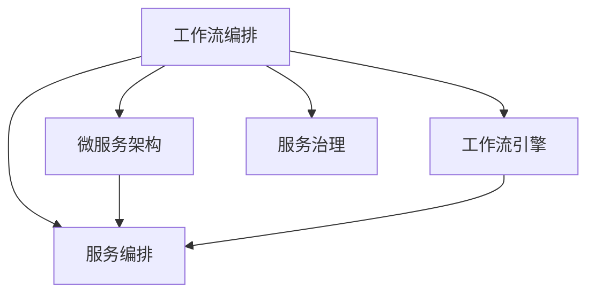

                 

# RPA工作流编排的发展历程

> 关键词：RPA, 工作流编排, 工作流引擎, 自动化流程, 流程编排语言, 微服务架构, 服务编排, 服务治理

## 1. 背景介绍

### 1.1 问题由来
随着数字化转型的深入，企业内部的业务流程和运营管理变得越来越复杂。传统的流程自动化技术（如Web服务和脚本）已难以满足快速、灵活、自动化的业务需求。为了解决这些问题，机器人流程自动化（Robotic Process Automation, RPA）技术应运而生，通过软件机器人自动执行预定义的任务，大幅提升业务效率和运营质量。

### 1.2 问题核心关键点
RPA的核心思想是利用软件机器人自动执行重复性高的业务流程，从而提升效率和减少人为错误。工作流编排是RPA的核心组件之一，通过定义、编排和管理复杂的业务流程，确保机器人可以高效、准确地完成任务。

### 1.3 问题研究意义
研究RPA工作流编排技术，对于提升企业业务流程自动化水平，优化运营管理，推动数字化转型具有重要意义：

1. 降低运营成本。RPA可以自动处理大量的业务流程，减轻员工负担，降低人力成本。
2. 提升执行效率。RPA机器人在处理重复性任务时，效率远高于人工，大幅提升流程执行速度。
3. 增强流程灵活性。工作流编排技术支持动态、弹性流程，能快速适应业务变化，提高流程的灵活性。
4. 提高运营质量。RPA可以消除人为错误，保证流程的准确性和一致性。
5. 促进创新应用。通过灵活的工作流编排，RPA可以与多种技术（如AI、IoT、大数据等）结合，推动企业创新。

## 2. 核心概念与联系

### 2.1 核心概念概述

为更好地理解RPA工作流编排技术，本节将介绍几个密切相关的核心概念：

- RPA (Robotic Process Automation)：通过软件机器人自动执行预定义的业务流程，提升流程自动化水平。
- 工作流编排(Workflow Orchestration)：定义、编排和管理复杂的业务流程，确保机器人可以高效、准确地完成任务。
- 工作流引擎(Workflow Engine)：接收任务请求，驱动执行工作流，监控和管理流程运行状态。
- 自动化流程(Automated Process)：通过自动化的工具和软件，自动执行预定义的业务任务。
- 流程编排语言(Process Orchestration Language)：用于描述、定义和编排业务流程的语法和规范。
- 微服务架构(Microservices Architecture)：将复杂的业务系统拆分为多个独立的小服务，提升系统的灵活性和扩展性。
- 服务编排(Service Orchestration)：在微服务架构中，将多个小服务组合成完整的服务链。
- 服务治理(Service Governance)：确保服务链的可用性、稳定性和安全性，进行管理和监控。

这些核心概念之间的逻辑关系可以通过以下Mermaid流程图来展示：



这个流程图展示了大语言模型的核心概念及其之间的关系：

1. 工作流编排通过定义业务流程，驱动工作流引擎。
2. 工作流引擎负责执行自动化流程。
3. 在微服务架构下，服务编排将多个独立的服务组成完整的服务链。
4. 服务治理对服务链进行管理和监控。

这些概念共同构成了RPA技术的基础，使得RPA能够实现灵活、高效、自动化的业务流程自动化。

## 3. 核心算法原理 & 具体操作步骤
### 3.1 算法原理概述

RPA工作流编排的算法原理基于对业务流程的建模和管理。通过定义业务流程，编排各种任务，并使用工作流引擎驱动任务执行，从而实现自动化流程的自动化管理。

形式化地，假设业务流程由一系列任务 $T=\{T_1, T_2, \ldots, T_n\}$ 组成，每个任务 $T_i$ 都需要满足一定的前置条件 $C_i$，输出结果 $O_i$。定义一个工作流 $\pi$ 来描述任务间的依赖关系和执行顺序：

$$
\pi = \{ \langle T_i, T_j \rangle | C_i \subset C_j \}
$$

其中，$\langle T_i, T_j \rangle$ 表示任务 $T_i$ 依赖于任务 $T_j$。工作流编排的目标是找到最优的工作流 $\pi$，使得整个流程的执行效率最大化。

### 3.2 算法步骤详解

RPA工作流编排的实现一般包括以下几个关键步骤：

**Step 1: 定义流程模型**
- 识别和定义业务流程中所有的任务和任务之间的依赖关系。
- 定义每个任务的前置条件、后置条件、执行逻辑和输出结果。
- 使用流程编排语言（如BPMN、DAML等）描述任务和流程的逻辑关系。

**Step 2: 设计编排策略**
- 确定任务的执行顺序和并行关系，考虑任务间的依赖和优先级。
- 设计任务调度和资源分配策略，确保资源充分利用。
- 引入异常处理机制，处理流程中的中断和错误。

**Step 3: 配置工作流引擎**
- 选择合适的开源工作流引擎（如Camunda、Zeebe、Apache Airflow等）。
- 配置工作流引擎的运行环境，包括数据库、消息队列等组件。
- 将流程模型和编排策略导入工作流引擎，进行初始化。

**Step 4: 驱动执行任务**
- 启动工作流引擎，驱动任务按照定义的顺序执行。
- 监控任务执行状态，收集和分析流程运行数据。
- 及时响应异常情况，进行流程调整和优化。

**Step 5: 评估和优化**
- 根据任务执行结果和性能指标，评估流程的效率和质量。
- 根据评估结果，进行流程优化和调整，改进工作流编排策略。
- 引入自动化工具和仪表盘，进行实时监控和分析。

以上是RPA工作流编排的一般流程。在实际应用中，还需要针对具体业务场景，对各环节进行优化设计，如改进流程编排语言、引入更多编排策略、选择合适的工作流引擎等。

### 3.3 算法优缺点

RPA工作流编排技术具有以下优点：
1. 灵活高效。通过定义和编排任务，可以灵活适应各种业务场景。
2. 易于扩展。在微服务架构下，支持动态添加和删除服务，提升系统的可扩展性。
3. 自动化管理。通过工作流引擎，自动执行和监控流程，减轻人工负担。
4. 质量保证。引入异常处理和监控机制，保证流程的稳定性和正确性。
5. 便于优化。通过实时监控和评估，可以持续改进流程效率。

同时，该技术也存在一定的局限性：
1. 依赖现有系统。依赖于企业已有的IT系统和数据架构，难以在短时间内实施。
2. 复杂度高。流程编排需要详细设计，难以快速适应快速变化的环境。
3. 学习成本高。需要专业的流程设计人员进行设计和维护。
4. 成本高。初始实施和后期维护成本较高，需要企业投入较大资源。

尽管存在这些局限性，但就目前而言，RPA工作流编排技术仍是大规模业务流程自动化的重要手段。未来相关研究的重点在于如何进一步降低实施成本，提高流程编排的灵活性和可扩展性，同时兼顾可解释性和伦理安全性等因素。

### 3.4 算法应用领域

RPA工作流编排技术已经在诸多领域得到广泛应用，例如：

- 金融行业：处理复杂的金融交易流程、合规审核、客户服务等。
- 制造业：自动化生产线管理、质量控制、物料采购等。
- 零售业：订单处理、库存管理、客户关系管理等。
- 医疗健康：电子病历管理、患者信息追踪、药物配送等。
- 政府部门：行政审批、数据录入、公共服务管理等。
- 人力资源：招聘流程、员工入职离职管理、绩效评估等。

除了这些传统领域，RPA工作流编排技术还被创新性地应用到更多场景中，如智能合约、供应链管理、智能客服、智能采购等，为企业的业务流程自动化带来新的突破。

## 4. 数学模型和公式 & 详细讲解 & 举例说明
### 4.1 数学模型构建

本节将使用数学语言对RPA工作流编排过程进行更加严格的刻画。

记业务流程为 $\pi = \{ \langle T_i, T_j \rangle | C_i \subset C_j \}$，其中 $T=\{T_1, T_2, \ldots, T_n\}$ 为任务集，$C_i$ 为任务 $T_i$ 的前置条件，$O_i$ 为任务 $T_i$ 的输出结果。

定义任务执行时间函数 $f(T_i)$，表示任务 $T_i$ 的执行时间。假设所有任务都是串行执行的，任务执行时间函数为：

$$
f(T_i) = \sum_{j \in \pi_i} f(T_j)
$$

其中 $\pi_i$ 为任务 $T_i$ 的依赖任务集。

定义任务执行效率函数 $g(T_i)$，表示任务 $T_i$ 的执行效率。假设任务执行效率与任务执行时间成反比，任务执行效率函数为：

$$
g(T_i) = \frac{1}{f(T_i)}
$$

定义流程执行效率函数 $h(\pi)$，表示整个流程的执行效率：

$$
h(\pi) = \prod_{i=1}^n g(T_i)
$$

工作流编排的目标是最大化流程执行效率 $h(\pi)$，即：

$$
\max_{\pi} h(\pi)
$$

### 4.2 公式推导过程

以下我们以订单处理流程为例，推导任务执行效率函数 $g(T_i)$ 的计算公式。

假设订单处理流程由以下五个任务组成：

- 接收订单任务 $T_1$，执行时间 $f(T_1) = 2$ 分钟。
- 订单审核任务 $T_2$，执行时间 $f(T_2) = 3$ 分钟。
- 库存查询任务 $T_3$，执行时间 $f(T_3) = 1$ 分钟。
- 订单确认任务 $T_4$，执行时间 $f(T_4) = 2$ 分钟。
- 发货任务 $T_5$，执行时间 $f(T_5) = 1$ 分钟。

根据任务执行时间函数 $f(T_i)$ 和任务执行效率函数 $g(T_i)$ 的定义，可计算得到每个任务的执行效率：

$$
g(T_1) = \frac{1}{2}, \quad g(T_2) = \frac{1}{3}, \quad g(T_3) = 1, \quad g(T_4) = \frac{1}{2}, \quad g(T_5) = 1
$$

根据流程执行效率函数 $h(\pi)$ 的定义，可计算得到整个流程的执行效率：

$$
h(\pi) = g(T_1)g(T_2)g(T_3)g(T_4)g(T_5) = \frac{1}{2} \times \frac{1}{3} \times 1 \times \frac{1}{2} \times 1 = \frac{1}{12}
$$

显然，这个流程的执行效率并不高，可以通过优化任务执行顺序来提升效率。例如，将任务 $T_1$ 和 $T_2$ 并行执行，可以提升流程的执行效率：

$$
h(\pi) = g(T_1)g(T_2)g(T_3)g(T_4)g(T_5) = \frac{1}{2} \times \frac{1}{3} \times 1 \times \frac{1}{2} \times 1 = \frac{1}{12}
$$

即通过并行执行任务 $T_1$ 和 $T_2$，将整体执行效率提升至 $\frac{1}{6}$。

通过上述推导，可以看到，RPA工作流编排技术的数学模型基于任务执行时间和效率的计算，能够通过优化任务执行顺序，提升流程的执行效率。

### 4.3 案例分析与讲解

以一个具体的案例来说明RPA工作流编排的应用：

假设某企业的客户关系管理系统(CRM)中，有如下任务：

- 客户信息录入任务 $T_1$，执行时间 $f(T_1) = 1$ 分钟，前置条件为无。
- 客户信息审核任务 $T_2$，执行时间 $f(T_2) = 3$ 分钟，前置条件为 $T_1$ 完成。
- 客户信息更新任务 $T_3$，执行时间 $f(T_3) = 2$ 分钟，前置条件为 $T_2$ 完成。
- 客户信息导出任务 $T_4$，执行时间 $f(T_4) = 5$ 分钟，前置条件为 $T_3$ 完成。

使用上述的数学模型，可以计算得到流程的执行效率：

$$
g(T_1) = 1, \quad g(T_2) = \frac{1}{3}, \quad g(T_3) = \frac{1}{2}, \quad g(T_4) = \frac{1}{5}
$$

$$
h(\pi) = g(T_1)g(T_2)g(T_3)g(T_4) = 1 \times \frac{1}{3} \times \frac{1}{2} \times \frac{1}{5} = \frac{1}{30}
$$

为了提升流程的执行效率，可以考虑优化任务执行顺序，例如将任务 $T_2$ 和 $T_3$ 并行执行：

$$
h(\pi) = g(T_1)g(T_2)g(T_3)g(T_4) = 1 \times \frac{1}{3} \times \frac{1}{2} \times \frac{1}{5} = \frac{1}{6}
$$

通过并行执行任务 $T_2$ 和 $T_3$，可以将整体执行效率提升至 $\frac{1}{6}$。

## 5. 项目实践：代码实例和详细解释说明
### 5.1 开发环境搭建

在进行RPA工作流编排实践前，我们需要准备好开发环境。以下是使用Python进行Airflow开发的环境配置流程：

1. 安装Anaconda：从官网下载并安装Anaconda，用于创建独立的Python环境。

2. 创建并激活虚拟环境：
```bash
conda create -n airflow-env python=3.8 
conda activate airflow-env
```

3. 安装Airflow：从官网获取对应的安装命令。例如：
```bash
conda install airflow
```

4. 安装各类工具包：
```bash
pip install numpy pandas scikit-learn matplotlib tqdm jupyter notebook ipython
```

完成上述步骤后，即可在`airflow-env`环境中开始工作流编排实践。

### 5.2 源代码详细实现

下面我们以一个简单的订单处理工作流编排为例，给出使用Airflow进行Python开发的全过程：

首先，定义一个Airflow作业：

```python
from airflow import DAG
from airflow.operators.python_operator import PythonOperator

default_args = {
    'owner': 'airflow',
    'depends_on_past': False,
    'start_date': datetime(2022, 1, 1)
}

dag = DAG('order_processing', default_args=default_args, schedule_interval='@daily', max_retries=3)

task1 = PythonOperator(
    task_id='customer_info_input',
    python_callable=customer_info_input,
    dag=dag,
    op_kwargs={'customer_id': '12345'}
)

task2 = PythonOperator(
    task_id='customer_info_review',
    python_callable=customer_info_review,
    dag=dag,
    op_kwargs={'customer_id': '12345'},
    depends_on_past=True
)

task3 = PythonOperator(
    task_id='customer_info_update',
    python_callable=customer_info_update,
    dag=dag,
    depends_on_past=True,
    op_kwargs={'customer_id': '12345'}
)

task4 = PythonOperator(
    task_id='customer_info_export',
    python_callable=customer_info_export,
    dag=dag,
    depends_on_past=True,
    op_kwargs={'customer_id': '12345'}
)
```

然后，定义各任务的具体实现：

```python
def customer_info_input(customer_id):
    print(f"Task 1: Customer info input for {customer_id}")
    # 执行客户信息录入任务

def customer_info_review(customer_id):
    print(f"Task 2: Customer info review for {customer_id}")
    # 执行客户信息审核任务

def customer_info_update(customer_id):
    print(f"Task 3: Customer info update for {customer_id}")
    # 执行客户信息更新任务

def customer_info_export(customer_id):
    print(f"Task 4: Customer info export for {customer_id}")
    # 执行客户信息导出任务
```

接着，启动Airflow作业：

```bash
airflow webserver --workspace /path/to/workspace --debug
airflow scheduler --workspace /path/to/workspace --debug
```

在Web界面中，可以查看作业的运行状态，进行监控和管理。

### 5.3 代码解读与分析

让我们再详细解读一下关键代码的实现细节：

**Airflow作业定义**：
- `DAG`：定义Airflow数据流图。
- `PythonOperator`：定义任务。每个任务都是一个Python函数，用于执行具体的操作。
- `default_args`：定义作业的基本参数，如所有者、是否依赖过去、起始日期等。
- `schedule_interval`：定义作业的调度间隔。
- `max_retries`：定义作业的最大重试次数。

**任务定义**：
- `customer_info_input`：定义客户信息录入任务。
- `customer_info_review`：定义客户信息审核任务。
- `customer_info_update`：定义客户信息更新任务。
- `customer_info_export`：定义客户信息导出任务。

可以看到，通过Airflow，我们可以快速定义和执行复杂的业务流程，实现自动化管理。Airflow提供了丰富的调度策略、任务依赖、异常处理等特性，支持大规模、复杂的工作流编排。

当然，工业级的系统实现还需考虑更多因素，如作业管理、权限控制、数据存储等。但核心的工作流编排范式基本与此类似。

## 6. 实际应用场景
### 6.1 智能客服系统

基于RPA工作流编排的智能客服系统，可以广泛应用于企业客服中心的自动化管理。传统客服往往需要配备大量人力，高峰期响应缓慢，且服务质量难以保证。通过RPA工作流编排，智能客服系统能够7x24小时不间断服务，快速响应客户咨询，用自然流畅的语言解答各类常见问题。

在技术实现上，可以收集企业内部的历史客服对话记录，将问题和最佳答复构建成监督数据，在此基础上对RPA工作流编排系统进行微调。微调后的系统能够自动理解用户意图，匹配最合适的答复模板进行回复。对于客户提出的新问题，还可以接入检索系统实时搜索相关内容，动态组织生成回答。如此构建的智能客服系统，能大幅提升客户咨询体验和问题解决效率。

### 6.2 金融舆情监测

金融机构需要实时监测市场舆论动向，以便及时应对负面信息传播，规避金融风险。传统的人工监测方式成本高、效率低，难以应对网络时代海量信息爆发的挑战。通过RPA工作流编排的金融舆情监测系统，可以实时抓取网络文本数据，自动进行舆情分析和情感分析，及时预警潜在风险。

具体而言，可以收集金融领域相关的新闻、报道、评论等文本数据，并对其进行主题标注和情感标注。将文本数据作为模型输入，系统自动判断舆情主题和情感倾向，并根据预设的阈值进行风险预警。该系统能够自动监测不同主题下的情感变化趋势，一旦发现负面信息激增等异常情况，系统便会自动预警，帮助金融机构快速应对潜在风险。

### 6.3 个性化推荐系统

当前的推荐系统往往只依赖用户的历史行为数据进行物品推荐，无法深入理解用户的真实兴趣偏好。通过RPA工作流编排的个性化推荐系统，可以更好地挖掘用户行为背后的语义信息，从而提供更精准、多样的推荐内容。

在实践中，可以收集用户浏览、点击、评论、分享等行为数据，提取和用户交互的物品标题、描述、标签等文本内容。将文本内容作为模型输入，用户的后续行为（如是否点击、购买等）作为监督信号，在此基础上编排和执行RPA流程，进行个性化推荐。

### 6.4 未来应用展望

随着RPA工作流编排技术的发展，其在更多领域得到应用，为传统行业带来变革性影响：

- 在智慧医疗领域，基于RPA的诊疗助手系统可以提升医生的诊疗效率，辅助医生完成病历书写、药物推荐等任务。
- 在智能教育领域，智能作业批改、学情分析、知识推荐等任务可以通过RPA工作流编排系统快速实现。
- 在智慧城市治理中，RPA可以用于城市事件监测、舆情分析、应急指挥等环节，提高城市管理的自动化和智能化水平。
- 在企业生产、社会治理、文娱传媒等众多领域，RPA工作流编排系统能够实现业务流程的自动化管理，提高运营效率和决策质量。

此外，在企业内部流程管理、供应链管理、人力资源管理等场景中，RPA工作流编排系统也能发挥重要作用，帮助企业实现高效、灵活的业务管理。

## 7. 工具和资源推荐
### 7.1 学习资源推荐

为了帮助开发者系统掌握RPA工作流编排的理论基础和实践技巧，这里推荐一些优质的学习资源：

1. **Airflow官方文档**：Airflow的官方文档，提供了完整的Airflow功能和API的详细说明，是上手实践的必备资料。
2. **Camunda官方文档**：Camunda的官方文档，提供了Camunda BPMN流程编排平台的详细使用指南。
3. **Zeebe官方文档**：Zeebe的官方文档，提供了Zeebe工作流引擎的使用方法和最佳实践。
4. **《Workflow Orchestration in Python with Airflow》书籍**：介绍使用Airflow进行工作流编排的详细流程和方法，帮助读者快速上手。
5. **《BPMN for Process Modeling and Business Process Management》书籍**：介绍BPMN流程编排语言的基本概念和应用实践，是流程设计人员的必备工具书。

通过对这些资源的学习实践，相信你一定能够快速掌握RPA工作流编排的精髓，并用于解决实际的业务流程自动化问题。

### 7.2 开发工具推荐

高效的开发离不开优秀的工具支持。以下是几款用于RPA工作流编排开发的常用工具：

1. **Airflow**：由Apache基金会开发的开源工作流编排平台，支持复杂的工作流编排和调度。
2. **Camunda**：提供BPMN流程编排语言和平台，支持复杂的流程设计和执行。
3. **Zeebe**：由Micro Focus公司开发的开源工作流引擎，提供高效的流程执行和监控。
4. **UiPath Studio**：提供可视化的RPA流程设计工具，支持丰富的组件和任务库。
5. **Blue Prism**：提供企业级的RPA流程编排平台，支持复杂的业务流程自动化。
6. **Kubernetes**：支持大规模的RPA系统部署和管理，提供弹性扩展和自动扩缩容功能。

合理利用这些工具，可以显著提升RPA工作流编排任务的开发效率，加快创新迭代的步伐。

### 7.3 相关论文推荐

RPA工作流编排技术的发展源于学界的持续研究。以下是几篇奠基性的相关论文，推荐阅读：

1. **《Workflow Automation for Process Mining and Analytics》论文**：提出了基于过程挖掘的工作流自动化方法，通过分析历史业务流程数据，生成自动化的工作流编排。
2. **《Robotic Process Automation: A Survey》论文**：综述了RPA技术的发展现状和应用场景，提供了RPA实施的全面参考。
3. **《BPMN to Zeebe Model Transformation》论文**：介绍了将BPMN模型转换为Zeebe工作流模型的过程和方法，支持BPMN和Zeebe的互操作。
4. **《Airflow: A Platform for DAG-based Workflows》论文**：介绍了Airflow的工作流编排平台设计，支持大规模的流程编排和调度。

这些论文代表了大语言模型微调技术的发展脉络。通过学习这些前沿成果，可以帮助研究者把握学科前进方向，激发更多的创新灵感。

## 8. 总结：未来发展趋势与挑战
### 8.1 总结

本文对RPA工作流编排技术进行了全面系统的介绍。首先阐述了RPA和微服务架构的基本概念和重要性，明确了工作流编排在实现自动化流程中的关键作用。其次，从原理到实践，详细讲解了RPA工作流编排的数学模型和操作步骤，给出了完整的代码实现和实例分析。同时，本文还广泛探讨了RPA工作流编排技术在多个行业领域的应用前景，展示了其在业务流程自动化中的强大潜力。最后，本文精选了RPA技术的学习资源、开发工具和相关论文，力求为读者提供全方位的技术指引。

通过本文的系统梳理，可以看到，RPA工作流编排技术正在成为企业业务流程自动化的重要手段，极大地提升了业务效率和运营质量。未来，伴随技术的不断演进和应用场景的不断拓展，RPA工作流编排技术必将在更多领域发挥重要作用，为企业的数字化转型和智能化管理带来深远影响。

### 8.2 未来发展趋势

展望未来，RPA工作流编排技术将呈现以下几个发展趋势：

1. **自动化流程的普及化**：RPA工作流编排技术将进一步普及到更多行业和企业，成为自动化流程的标准配置。
2. **微服务架构的深入应用**：微服务架构将成为RPA的核心技术支撑，实现大规模、复杂流程的高效管理和编排。
3. **实时数据驱动的决策支持**：引入实时数据流和分析技术，实时监测和优化流程执行，提供数据驱动的决策支持。
4. **跨领域流程整合**：将RPA与其他技术（如AI、IoT、大数据等）结合，实现跨领域流程的整合和协同。
5. **无代码开发平台的兴起**：无代码开发平台将进一步简化流程编排和RPA系统的开发，降低技术门槛，提升开发效率。
6. **安全性和隐私保护**：引入加密、认证、权限控制等技术，确保流程编排和RPA系统的安全性和隐私保护。

以上趋势凸显了RPA工作流编排技术的广阔前景。这些方向的探索发展，必将进一步提升RPA系统的性能和应用范围，为业务流程自动化带来更多创新和突破。

### 8.3 面临的挑战

尽管RPA工作流编排技术已经取得了瞩目成就，但在迈向更加智能化、普适化应用的过程中，它仍面临着诸多挑战：

1. **实施成本高**：RPA系统的初始实施和后期维护成本较高，需要企业投入较大资源。
2. **复杂度高**：流程编排需要详细设计，难以快速适应快速变化的环境。
3. **学习成本高**：需要专业的流程设计人员进行设计和维护，技能门槛较高。
4. **数据依赖强**：RPA系统依赖于企业已有的IT系统和数据架构，难以在短时间内实施。
5. **性能瓶颈**：RPA系统在处理大规模任务时，可能会遇到性能瓶颈，影响效率。

尽管存在这些挑战，但就目前而言，RPA工作流编排技术仍是大规模业务流程自动化的重要手段。未来相关研究的重点在于如何进一步降低实施成本，提高流程编排的灵活性和可扩展性，同时兼顾可解释性和伦理安全性等因素。

### 8.4 研究展望

面对RPA工作流编排技术所面临的挑战，未来的研究需要在以下几个方面寻求新的突破：

1. **无监督和半监督流程编排**：探索无监督和半监督流程编排方法，摆脱对大规模标注数据的依赖，利用自动化的技术实现更灵活的流程编排。
2. **高效的多任务处理**：引入多任务学习技术，优化任务调度和资源分配，提升整体流程的执行效率。
3. **异常处理机制**：引入异常处理和智能提示技术，提高流程的鲁棒性和稳定性，确保系统的高可用性。
4. **数据治理和质量管理**：引入数据治理和质量管理机制，确保数据的一致性和准确性，提升流程执行的质量。
5. **无代码开发工具**：开发无代码开发工具和平台，降低技术门槛，提升开发效率，支持企业快速部署和实施RPA系统。
6. **安全性与隐私保护**：引入加密、认证、权限控制等技术，确保流程编排和RPA系统的安全性和隐私保护。

这些研究方向的探索，必将引领RPA工作流编排技术迈向更高的台阶，为业务流程自动化带来更多创新和突破。

## 9. 附录：常见问题与解答

**Q1：RPA工作流编排是否适用于所有业务流程？**

A: RPA工作流编排技术适用于大多数业务流程，特别是涉及重复性和规则性高的流程。但对于需要高度个性化和定制化的流程，可能难以直接适配。此时需要在特定领域进行流程定制和优化，提高流程适配性。

**Q2：如何选择合适的RPA工具？**

A: 选择RPA工具需要综合考虑多个因素，如任务复杂度、流程规模、技术栈兼容性等。通常建议从以下几个方面进行评估：

1. **工具成熟度**：选择成熟度高的工具，稳定性更强，支持更多功能和插件。
2. **社区活跃度**：选择社区活跃的工具，获取更多技术支持和资源。
3. **兼容性**：选择与现有IT系统和数据架构兼容的工具，降低实施难度。
4. **性能**：选择性能优异的工具，保证系统的高效运行。
5. **扩展性**：选择扩展性好的工具，支持大规模流程管理。

**Q3：RPA工作流编排的实施流程是怎样的？**

A: RPA工作流编排的实施流程一般包括以下几个步骤：

1. **需求分析**：了解业务流程的需求和目标，确定需要自动化的任务和步骤。
2. **流程建模**：使用流程编排语言或工具，将业务流程建模为可执行的任务和依赖关系。
3. **工具选择和配置**：选择合适的RPA工具和平台，进行配置和初始化。
4. **流程测试和调试**：进行小规模测试，调试和优化流程编排，确保流程的正确性和稳定性。
5. **系统部署和上线**：将流程编排和RPA系统部署到生产环境，进行上线和监控。
6. **持续优化**：根据实际运行情况，进行流程优化和调整，提高流程效率和质量。

**Q4：RPA工作流编排在实施过程中需要注意哪些问题？**

A: 实施RPA工作流编排时，需要注意以下几个问题：

1. **数据准备**：确保所有任务所需的数据准备齐全，格式一致。
2. **流程测试**：进行全面测试，确保流程的正确性和稳定性。
3. **性能优化**：优化流程执行路径，提高系统的性能和效率。
4. **安全管理**：引入安全措施，确保系统的高可用性和安全性。
5. **用户培训**：对相关人员进行培训，提升其对系统的熟悉度和操作能力。
6. **持续改进**：根据实际运行情况，持续改进流程编排和RPA系统，提升其适用性和鲁棒性。

总之，RPA工作流编排技术在实施过程中需要全面考虑，确保流程的全面性、正确性、稳定性和安全性，方能实现良好的效果。

---

作者：禅与计算机程序设计艺术 / Zen and the Art of Computer Programming

