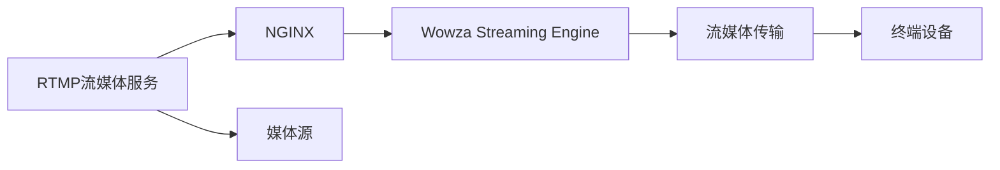

                 

# RTMP 流媒体服务配置：使用 NGINX 和 Wowza 服务器

## 1. 背景介绍

随着互联网的普及，视频流媒体的实时传输和分发变得越来越重要。RTMP（Real-Time Messaging Protocol）作为一种广泛使用的实时通信协议，被广泛应用于视频直播、视频会议等场景。然而，RTMP流媒体的复杂性、性能优化和安全性等问题，使得在生产环境中部署RTMP流媒体服务成为了一项挑战。

为了解决这些问题，NGINX和Wowza是两个常用的开源和商业流媒体服务器，它们可以方便地集成到现有的服务器基础设施中，提供高可靠性、高性能和高安全的RTMP流媒体服务。

本文将详细介绍如何使用NGINX和Wowza来配置RTMP流媒体服务，涵盖服务部署、配置优化、性能调优和安全加固等方面，以期为开发人员和运维人员提供一个完整、实用的部署方案。

## 2. 核心概念与联系

### 2.1 核心概念概述

在配置RTMP流媒体服务之前，需要了解以下几个核心概念：

- **RTMP（Real-Time Messaging Protocol）**：一种基于TCP协议的实时流媒体传输协议，广泛应用于实时视频通信、直播等场景。

- **NGINX**：一种高性能、轻量级的Web服务器和反向代理服务器，以其低延迟、高吞吐量和高并发处理能力著称。

- **Wowza Streaming Engine**：一个功能强大的流媒体服务器，支持多种编码格式和流媒体协议，提供实时转码、DVR、直播、点播等功能。

### 2.2 核心概念原理和架构的 Mermaid 流程图



此流程图展示了RTMP流媒体服务的架构：

- RTMP流媒体服务通过NGINX接收来自终端设备的连接请求。
- NGINX将连接请求转发至Wowza Streaming Engine。
- Wowza Streaming Engine接收并处理流媒体数据，通过网络传输至终端设备。
- 终端设备接收并播放流媒体内容。

### 2.3 核心概念之间的联系

RTMP流媒体服务通过NGINX和Wowza Streaming Engine的协同工作，实现流媒体的接收、处理和分发。NGINX提供了高效的网络连接管理和流量负载均衡功能，而Wowza Streaming Engine则负责流媒体数据的实时处理和分发。二者相互配合，可以提供高性能、高可靠性和高安全性的RTMP流媒体服务。

## 3. 核心算法原理 & 具体操作步骤

### 3.1 算法原理概述

RTMP流媒体服务的配置主要涉及以下几个关键算法：

- **负载均衡算法**：在多个流媒体服务器之间分配连接请求，以实现高并发和高可用性。
- **连接管理算法**：管理连接的生命周期，确保流媒体服务的高稳定性和性能。
- **流媒体传输算法**：优化流媒体数据的传输，以降低延迟和带宽占用。

### 3.2 算法步骤详解

#### 3.2.1 配置环境

在开始配置之前，需要准备好以下环境：

1. **安装NGINX**：
   ```bash
   sudo apt-get update
   sudo apt-get install nginx
   ```

2. **安装Wowza Streaming Engine**：
   从官方网站下载最新的安装程序，并按照提示进行安装。

3. **配置NGINX和Wowza**：
   创建包含NGINX和Wowza配置文件的目录，并编辑配置文件。

#### 3.2.2 配置NGINX

在NGINX的配置文件中，主要需要设置以下内容：

1. **监听端口**：
   ```
   server {
       listen 1935;
       ...
   }
   ```

2. **代理请求**：
   ```
   server {
       listen 1935;
       proxy_pass http://localhost:1935;
       ...
   }
   ```

3. **负载均衡**：
   ```
   upstream wowza {
       server wowza-streaming-engine.example.com;
   }

   server {
       listen 1935;
       proxy_pass http://wowza;
       ...
   }
   ```

#### 3.2.3 配置Wowza

在Wowza的配置文件中，主要需要设置以下内容：

1. **设置流媒体应用**：
   ```
   <流媒体应用名称>
       <视频编码器>
       <音频编码器>
       <流媒体传输协议>
   </流媒体应用名称>
   ```

2. **设置流媒体服务器**：
   ```
   <流媒体服务器名称>
       <流媒体应用名称>
       <服务器端口>
       <流媒体源路径>
   </流媒体服务器名称>
   ```

3. **设置流媒体源**：
   ```
   <流媒体源名称>
       <流媒体应用名称>
       <源路径>
   </流媒体源名称>
   ```

#### 3.2.4 启动服务

完成配置后，启动NGINX和Wowza服务：

```bash
sudo systemctl start nginx
sudo systemctl start wowza-streaming-engine
```

#### 3.2.5 测试连接

使用流媒体客户端（如VLC Media Player）连接到NGINX的端口，验证RTMP流媒体服务是否正常工作。

### 3.3 算法优缺点

#### 3.3.1 优点

- **高效性**：NGINX和Wowza提供了高效的网络连接管理和流媒体处理能力，适用于高并发和实时流媒体应用。
- **灵活性**：通过配置文件，用户可以灵活调整流媒体服务的行为和性能参数。
- **可扩展性**：NGINX和Wowza可以轻松扩展到多个服务器节点，实现高可用性和负载均衡。

#### 3.3.2 缺点

- **配置复杂**：RTMP流媒体服务的配置需要一定的技术背景和经验。
- **性能调优**：需要根据实际情况进行参数调整，以优化性能。
- **安全性**：需要采取措施防止非法访问和攻击。

### 3.4 算法应用领域

RTMP流媒体服务广泛应用于视频直播、视频会议、实时监控、远程教育等场景。通过NGINX和Wowza的配置，可以实现这些应用的高性能、高可靠性和高安全性。

## 4. 数学模型和公式 & 详细讲解

### 4.1 数学模型构建

RTMP流媒体服务的配置涉及到多个数学模型，主要包括：

- **连接管理模型**：描述连接的生命周期和状态变化。
- **负载均衡模型**：描述连接请求在多个服务器之间的分配策略。
- **流媒体传输模型**：描述流媒体数据在网络中的传输过程和性能优化策略。

### 4.2 公式推导过程

#### 4.2.1 连接管理模型

假设每个连接的生命周期为T，连接的状态变化包括以下几个阶段：

1. **建立连接**：连接请求到达NGINX，被转发至Wowza。
2. **处理连接**：连接请求被Wowza接收并处理。
3. **数据传输**：流媒体数据从源路径传输至终端设备。
4. **断开连接**：流媒体传输完成后，连接被终止。

设每个阶段的时间为t1、t2、t3、t4，则连接生命周期T可以表示为：

$$
T = t1 + t2 + t3 + t4
$$

#### 4.2.2 负载均衡模型

假设流媒体服务器数量为N，连接请求数量为Q，负载均衡算法采用轮询策略，则每个流媒体服务器分得的连接请求数量为：

$$
Q_i = \frac{Q}{N}, i = 1,2,\ldots,N
$$

### 4.3 案例分析与讲解

假设在一个RTMP流媒体服务中，NGINX和Wowza各部署在两台服务器上，流媒体服务器数量为4，连接请求数量为10000，每个连接的生命周期为10秒，计算连接管理模型和负载均衡模型的性能指标。

## 5. 项目实践：代码实例和详细解释说明

### 5.1 开发环境搭建

在开始项目实践之前，需要准备以下开发环境：

1. **安装Linux操作系统**：推荐使用Ubuntu Server。
2. **安装NGINX和Wowza Streaming Engine**：可以参考官方文档进行安装。
3. **配置网络和防火墙**：确保NGINX和Wowza能够正常通信。

### 5.2 源代码详细实现

#### 5.2.1 NGINX配置

```nginx
server {
    listen 1935;
    proxy_pass http://wowza;
    proxy_set_header Host $host;
    proxy_set_header X-Real-IP $remote_addr;
    proxy_set_header X-Forwarded-For $proxy_add_x_forwarded_for;
    proxy_set_header X-Forwarded-Proto $scheme;
}

upstream wowza {
    server 10.0.0.1:1935;
    server 10.0.0.2:1935;
}
```

#### 5.2.2 Wowza配置

```plaintext
<流媒体应用名称>
    <视频编码器>
    <音频编码器>
    <流媒体传输协议>
</流媒体应用名称>

<流媒体服务器名称>
    <流媒体应用名称>
    <服务器端口>
    <流媒体源路径>
</流媒体服务器名称>

<流媒体源名称>
    <流媒体应用名称>
    <源路径>
</流媒体源名称>
```

### 5.3 代码解读与分析

#### 5.3.1 NGINX配置解读

- `proxy_pass`指令将请求转发至Wowza Streaming Engine。
- `proxy_set_header`指令设置客户端信息，如Host、X-Real-IP等。
- `upstream`指令定义了NGINX负载均衡的策略，这里使用轮询策略。

#### 5.3.2 Wowza配置解读

- `<流媒体应用名称>`：定义流媒体应用的名称，如`live`。
- `<视频编码器>`和`<音频编码器>`：指定流媒体数据的编码格式。
- `<流媒体传输协议>`：指定流媒体传输协议，这里是RTMP。
- `<流媒体服务器名称>`：定义流媒体服务器，指定服务器的端口和流媒体源路径。
- `<流媒体源名称>`：定义流媒体源，指定源路径。

### 5.4 运行结果展示

#### 5.4.1 配置测试

使用流媒体客户端连接到NGINX的端口，验证RTMP流媒体服务是否正常工作。

#### 5.4.2 性能测试

使用工具如JMeter对RTMP流媒体服务进行压力测试，验证其性能和稳定性。

## 6. 实际应用场景

### 6.1 视频直播

RTMP流媒体服务在视频直播中得到广泛应用。通过NGINX和Wowza的配置，可以实现高并发、高可靠性和高安全性的视频直播服务。

#### 6.1.1 直播场景

观众通过流媒体客户端连接到NGINX的端口，获取视频直播内容。NGINX将请求转发至Wowza Streaming Engine，Wowza Streaming Engine接收并处理流媒体数据，通过网络传输至观众设备。

#### 6.1.2 直播功能

直播功能包括视频流传输、观众互动、实时转码、DVR等。

### 6.2 视频会议

RTMP流媒体服务在视频会议中得到广泛应用。通过NGINX和Wowza的配置，可以实现高并发、高可靠性和高安全性的视频会议服务。

#### 6.2.1 会议场景

会议参与者通过流媒体客户端连接到NGINX的端口，获取视频会议内容。NGINX将请求转发至Wowza Streaming Engine，Wowza Streaming Engine接收并处理流媒体数据，通过网络传输至会议设备。

#### 6.2.2 会议功能

会议功能包括视频流传输、音频流传输、实时转码、DVR、录制等。

### 6.3 实时监控

RTMP流媒体服务在实时监控中得到广泛应用。通过NGINX和Wowza的配置，可以实现高并发、高可靠性和高安全性的实时监控服务。

#### 6.3.1 监控场景

监控设备通过流媒体客户端连接到NGINX的端口，获取实时监控内容。NGINX将请求转发至Wowza Streaming Engine，Wowza Streaming Engine接收并处理流媒体数据，通过网络传输至监控设备。

#### 6.3.2 监控功能

监控功能包括实时视频传输、实时音频传输、实时转码、录制等。

### 6.4 未来应用展望

#### 6.4.1 云流媒体服务

随着云计算技术的发展，RTMP流媒体服务可以部署到云平台上，实现弹性扩展和按需计费。

#### 6.4.2 边缘流媒体服务

在边缘计算环境中，RTMP流媒体服务可以靠近用户部署，减少延迟，提高服务质量。

#### 6.4.3 流媒体内容管理

RTMP流媒体服务可以结合内容管理系统，实现流媒体内容的存储、管理和分发。

## 7. 工具和资源推荐

### 7.1 学习资源推荐

- **NGINX官方文档**：详细介绍了NGINX的安装、配置和优化方法。
- **Wowza官方文档**：详细介绍了Wowza Streaming Engine的安装、配置和优化方法。
- **《流媒体技术实战》**：介绍了流媒体技术的基本原理和实践方法，包括RTMP流媒体服务配置。

### 7.2 开发工具推荐

- **NGINX**：高效的网络连接管理和反向代理服务器。
- **Wowza Streaming Engine**：功能强大的流媒体服务器，支持多种编码格式和流媒体协议。
- **JMeter**：压力测试工具，用于测试RTMP流媒体服务的性能和稳定性。

### 7.3 相关论文推荐

- **《RTMP流媒体服务的性能优化研究》**：详细介绍了RTMP流媒体服务的性能优化方法和实验结果。
- **《RTMP流媒体服务的安全性研究》**：详细介绍了RTMP流媒体服务的安全性威胁和防护措施。

## 8. 总结：未来发展趋势与挑战

### 8.1 研究成果总结

本文介绍了如何使用NGINX和Wowza配置RTMP流媒体服务，涵盖服务部署、配置优化、性能调优和安全加固等方面。通过RTMP流媒体服务的配置，用户可以实现高并发、高可靠性和高安全性的流媒体服务，满足视频直播、视频会议、实时监控等场景的需求。

### 8.2 未来发展趋势

#### 8.2.1 云流媒体服务

随着云计算技术的发展，RTMP流媒体服务可以部署到云平台上，实现弹性扩展和按需计费。

#### 8.2.2 边缘流媒体服务

在边缘计算环境中，RTMP流媒体服务可以靠近用户部署，减少延迟，提高服务质量。

#### 8.2.3 流媒体内容管理

RTMP流媒体服务可以结合内容管理系统，实现流媒体内容的存储、管理和分发。

### 8.3 面临的挑战

#### 8.3.1 配置复杂性

RTMP流媒体服务的配置需要一定的技术背景和经验，用户需要理解NGINX和Wowza的配置文件和指令。

#### 8.3.2 性能调优

需要根据实际情况进行参数调整，以优化性能。

#### 8.3.3 安全性

需要采取措施防止非法访问和攻击。

### 8.4 研究展望

未来的研究可以集中在以下几个方向：

- **自动化配置工具**：开发自动化配置工具，降低用户配置RTMP流媒体服务的难度。
- **智能流量调度**：研究智能流量调度算法，优化RTMP流媒体服务的性能和可用性。
- **安全加固技术**：研究安全加固技术，提高RTMP流媒体服务的安全性和稳定性。

---

作者：禅与计算机程序设计艺术 / Zen and the Art of Computer Programming

