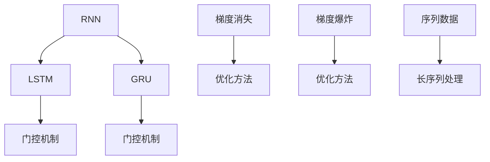

                 

# Recurrent Neural Networks (RNN)原理与代码实例讲解

## 1. 背景介绍

循环神经网络 (Recurrent Neural Networks, RNN) 是一种特殊的神经网络，主要用于处理序列数据。与前馈神经网络不同，RNN 能够通过循环连接保留之前的输出信息，使其能够更好地处理时间序列和时序数据。RNN 的这一特性使得它在自然语言处理、语音识别、时间序列预测等众多领域大放异彩。

### 1.1 问题由来
近年来，随着深度学习技术的快速发展，RNN 成为了处理序列数据的重要工具。然而，传统的 RNN 模型在处理长序列时，容易出现梯度消失或梯度爆炸的问题，导致训练效率低下。为了克服这些问题，研究者们提出了长短时记忆网络 (Long Short-Term Memory, LSTM) 和门控循环单元 (Gated Recurrent Unit, GRU) 等改进模型，使得 RNN 能够更加有效地处理长序列，并在诸多领域取得了显著成果。

### 1.2 问题核心关键点
RNN 的核心问题在于如何有效处理长序列和时序数据，以及如何解决梯度消失或梯度爆炸问题。LSTM 和 GRU 通过引入门控机制，可以在不牺牲长序列信息的同时，减少梯度传递过程中的信息丢失。门控机制能够根据当前输入和历史信息，动态决定信息的保留和遗忘，从而提高模型性能。

### 1.3 问题研究意义
RNN 在自然语言处理领域的应用，例如机器翻译、情感分析、文本生成等，显著提升了 NLP 任务的效果。此外，RNN 在语音识别、视频分析等领域也有广泛应用，如语音转文本、动作识别等。

## 2. 核心概念与联系

### 2.1 核心概念概述

为了更好地理解 RNN 的工作原理和优化方法，本节将介绍几个密切相关的核心概念：

- 循环神经网络 (Recurrent Neural Network, RNN)：通过循环连接保留之前输出信息，能够处理序列数据的神经网络。
- 长短时记忆网络 (Long Short-Term Memory, LSTM)：一种特殊的 RNN，通过引入门控机制，能够有效处理长序列。
- 门控循环单元 (Gated Recurrent Unit, GRU)：类似于 LSTM，通过门控机制处理长序列，但结构更为简单，计算效率更高。
- 梯度消失 (Vanishing Gradient)：在长序列中，梯度反向传播过程中，梯度值越来越小，导致模型难以训练。
- 梯度爆炸 (Exploding Gradient)：在长序列中，梯度反向传播过程中，梯度值越来越大，导致模型不稳定。
- 序列数据：指按时间顺序排列的数据，例如文本、语音、视频等。

这些核心概念之间的逻辑关系可以通过以下 Mermaid 流程图来展示：



这个流程图展示了大语言模型的核心概念及其之间的关系：

1. RNN 通过循环连接处理序列数据。
2. LSTM 和 GRU 通过门控机制处理长序列，提升模型性能。
3. 梯度消失和梯度爆炸是 RNN 面临的主要问题，需要优化方法来解决。
4. 序列数据是 RNN 处理的主要对象。

这些概念共同构成了 RNN 的学习框架，使其能够在各种场景下发挥强大的序列处理能力。通过理解这些核心概念，我们可以更好地把握 RNN 的工作原理和优化方向。

## 3. 核心算法原理 & 具体操作步骤
### 3.1 算法原理概述

RNN 的算法原理主要围绕如何有效处理序列数据和解决梯度消失/爆炸问题展开。其核心思想是：通过循环连接保留之前输出信息，利用门控机制动态决定信息的保留和遗忘，从而有效处理长序列。

### 3.2 算法步骤详解

RNN 的训练过程可以分为以下几个关键步骤：

**Step 1: 准备数据集**
- 收集序列数据，将其按时间顺序排列。例如，文本序列的每个时刻都是单词序列，语音序列的每个时刻都是音频样本。

**Step 2: 定义模型结构**
- 设计 RNN 模型结构，包括隐藏层大小、层数等。常用的 RNN 结构有单层 RNN、多层 RNN、LSTM、GRU 等。
- 设置损失函数，例如交叉熵损失等，用于衡量模型预测输出与真实标签之间的差异。

**Step 3: 初始化模型参数**
- 初始化模型参数，例如权重矩阵、偏置项等。通常使用随机初始化，或者使用预训练的初始化参数。

**Step 4: 前向传播**
- 输入序列数据，逐个时间步进行前向传播。在每个时间步，计算当前时刻的输出和隐藏状态。

**Step 5: 后向传播**
- 利用输出和隐藏状态，计算当前时刻的损失函数，并反向传播梯度，更新模型参数。

**Step 6: 优化参数**
- 使用优化算法（如 Adam、SGD 等）更新模型参数，最小化损失函数。

**Step 7: 迭代训练**
- 重复上述步骤，直至模型收敛或达到预设的迭代轮数。

### 3.3 算法优缺点

RNN 具有以下优点：
1. 能够处理序列数据，适用于文本、语音、时间序列等任务。
2. 引入门控机制，能够有效处理长序列，避免梯度消失和梯度爆炸。
3. 具有一定程度的记忆能力，能够保留之前的输出信息。

但 RNN 也存在一些缺点：
1. 计算复杂度高，训练时间较长。
2. 难以并行化，在大规模序列处理时效率低下。
3. 参数量较大，需要大量的计算资源。
4. 对于一些复杂的任务，模型的表达能力有限。

### 3.4 算法应用领域

RNN 在众多领域都有广泛应用，例如：

- 文本生成：例如机器翻译、文本摘要、对话生成等。
- 语音识别：例如自动语音识别、语音转文本等。
- 时间序列预测：例如股票预测、天气预测等。
- 视频分析：例如视频分类、动作识别等。

## 4. 数学模型和公式 & 详细讲解 & 举例说明

### 4.1 数学模型构建

本节将使用数学语言对 RNN 的训练过程进行更加严格的刻画。

记 RNN 模型为 $RNN_{\theta} = (h_0, \{h_t\}_{t=1}^T, \{y_t\}_{t=1}^T)$，其中 $h_0$ 为初始隐藏状态，$\{h_t\}_{t=1}^T$ 为每个时间步的隐藏状态，$\{y_t\}_{t=1}^T$ 为每个时间步的输出。假设训练集为 $\{(x_t, y_t)\}_{t=1}^T$，其中 $x_t$ 为输入序列，$y_t$ 为真实标签。

定义模型在时间步 $t$ 的输出为 $y_t = RNN_{\theta}(x_t, h_{t-1})$，并定义损失函数为：

$$
\mathcal{L}(\theta) = \frac{1}{T} \sum_{t=1}^T \ell(y_t, RNN_{\theta}(x_t, h_{t-1}))
$$

其中 $\ell$ 为任务特定的损失函数，例如交叉熵损失。

### 4.2 公式推导过程

以下我们以机器翻译为例，推导交叉熵损失函数及其梯度的计算公式。

假设模型 $RNN_{\theta}$ 在输入 $x_t$ 上的输出为 $y_t = RNN_{\theta}(x_t, h_{t-1})$，表示模型预测下一个单词。真实标签 $y_t$ 为 $\{1, 2, ..., N\}$ 中的某个整数，表示该单词在词典中的索引。则交叉熵损失函数定义为：

$$
\ell(y_t, y_{pred}) = -\log P(y_{pred}=y_t)
$$

其中 $y_{pred}$ 为模型预测的单词，$P$ 为条件概率分布。在机器翻译任务中，$y_{pred}$ 表示在给定源语言单词 $x_t$ 的情况下，下一个单词为 $y_t$ 的概率。

在 RNN 中，每个时间步的输出 $y_t$ 可以表示为：

$$
y_t = \text{softmax}(W_h h_{t-1} + W_x x_t + b)
$$

其中 $W_h, W_x, b$ 为可训练参数。$h_{t-1}$ 为前一个时间步的隐藏状态。

因此，模型在时间步 $t$ 的交叉熵损失为：

$$
\ell(y_t, y_{pred}) = -\sum_{i=1}^N y_t = i \log P(y_{pred} = i)
$$

在训练过程中，每个时间步的梯度可以表示为：

$$
\nabla_{\theta} \ell(y_t, y_{pred}) = - \nabla_{\theta} \text{softmax}(W_h h_{t-1} + W_x x_t + b) \cdot \frac{\nabla_{y_t} \ell(y_t, y_{pred})}{\nabla_{h_t} \text{softmax}(W_h h_{t-1} + W_x x_t + b)}
$$

其中 $\nabla_{y_t} \ell(y_t, y_{pred}) = - y_t \cdot \delta(y_t = i) + 1$，$\nabla_{h_t} \text{softmax}(W_h h_{t-1} + W_x x_t + b)$ 为 $\text{softmax}$ 函数的梯度。

在模型训练过程中，需要反向传播每个时间步的梯度，并使用优化算法更新模型参数。

### 4.3 案例分析与讲解

这里以文本生成为例，说明如何使用 RNN 进行文本生成。假设我们希望生成一个长度为 $T$ 的文本序列，每个时间步 $t$ 的生成概率为 $p_t$。在每个时间步，模型需要根据之前的文本序列 $x_t$ 和隐藏状态 $h_{t-1}$ 生成下一个单词 $y_t$。

具体步骤如下：
1. 初始化隐藏状态 $h_0$。
2. 逐个时间步 $t$ 进行前向传播，计算输出 $y_t$ 和隐藏状态 $h_t$。
3. 使用交叉熵损失函数计算当前时间步的损失。
4. 使用优化算法更新模型参数。

在实践中，通常使用独热编码将文本转换为向量输入，例如将单词表示为一维向量。输出层通常为 $N$ 维向量，其中 $N$ 为词典大小。每个时间步的输出可以通过 $\text{softmax}$ 函数转换为概率分布，表示生成每个单词的概率。

## 5. 项目实践：代码实例和详细解释说明
### 5.1 开发环境搭建

在进行 RNN 实践前，我们需要准备好开发环境。以下是使用 Python 进行 TensorFlow 开发的环境配置流程：

1. 安装 Anaconda：从官网下载并安装 Anaconda，用于创建独立的 Python 环境。

2. 创建并激活虚拟环境：
```bash
conda create -n rnn-env python=3.8 
conda activate rnn-env
```

3. 安装 TensorFlow：根据 CUDA 版本，从官网获取对应的安装命令。例如：
```bash
conda install tensorflow -c conda-forge -c pytorch
```

4. 安装 NumPy、Pandas 等工具包：
```bash
pip install numpy pandas
```

5. 安装相关库：
```bash
pip install tensorflow-addons
```

完成上述步骤后，即可在 `rnn-env` 环境中开始 RNN 实践。

### 5.2 源代码详细实现

下面我们以文本生成为例，给出使用 TensorFlow 对 RNN 模型进行训练的代码实现。

```python
import tensorflow as tf
import numpy as np
import pandas as pd

# 定义参数
batch_size = 64
sequence_length = 10
embedding_size = 100
hidden_size = 128
num_classes = 10000

# 定义模型
class RNNModel(tf.keras.Model):
    def __init__(self, sequence_length, batch_size, embedding_size, hidden_size, num_classes):
        super(RNNModel, self).__init__()
        self.embedding = tf.keras.layers.Embedding(num_classes, embedding_size)
        self.lstm = tf.keras.layers.LSTM(hidden_size, return_sequences=True)
        self.fc = tf.keras.layers.Dense(num_classes)
    
    def call(self, inputs, hidden):
        x = self.embedding(inputs)
        x = self.lstm(x, initial_state=hidden)
        x = self.fc(x[:, -1, :])
        return x

# 加载数据
data = pd.read_csv('text_data.csv')
x = np.array(data['input'])
y = np.array(data['output'])

# 定义模型和优化器
model = RNNModel(sequence_length, batch_size, embedding_size, hidden_size, num_classes)
optimizer = tf.keras.optimizers.Adam()

# 训练模型
for epoch in range(100):
    for i in range(0, len(x), batch_size):
        x_batch = x[i:i+batch_size]
        y_batch = y[i:i+batch_size]
        inputs = tf.keras.preprocessing.sequence.pad_sequences(x_batch, maxlen=sequence_length)
        targets = tf.keras.preprocessing.sequence.pad_sequences(y_batch, maxlen=sequence_length)
        hidden = model.init_state(batch_size)
        with tf.GradientTape() as tape:
            outputs = model(inputs, hidden)
            loss = tf.keras.losses.sparse_categorical_crossentropy(targets, outputs)
        grads = tape.gradient(loss, model.trainable_variables)
        optimizer.apply_gradients(zip(grads, model.trainable_variables))
    print(f"Epoch {epoch+1}, Loss: {loss.numpy()}")

# 生成文本
text = np.random.randint(0, num_classes, size=sequence_length)
hidden = model.init_state(batch_size)
for i in range(100):
    x = np.array([text[-1]])
    x = tf.keras.preprocessing.sequence.pad_sequences(x, maxlen=1)
    outputs = model(x, hidden)
    predictions = tf.argmax(outputs, axis=1)
    text = np.append(text, predictions)
    hidden = model.update_state(x, predictions, hidden)
print(text)
```

这里我们定义了一个简单的 RNN 模型，使用 TensorFlow 实现文本生成的代码。首先定义了模型的结构和参数，然后加载数据并初始化模型。接着使用 Adam 优化器训练模型，最后使用模型生成文本。

### 5.3 代码解读与分析

让我们再详细解读一下关键代码的实现细节：

**RNNModel 类**：
- `__init__` 方法：初始化嵌入层、LSTM 层和全连接层。
- `call` 方法：定义模型前向传播过程，包括嵌入、LSTM 和全连接层。

**加载数据**：
- 使用 pandas 加载数据集，提取输入和输出。
- 使用 NumPy 数组化数据。
- 对输入和输出进行填充，确保序列长度一致。

**训练模型**：
- 定义模型和优化器。
- 使用 for 循环迭代训练，每个epoch内使用 for 循环处理每个批次数据。
- 对每个批次数据进行前向传播，计算损失函数。
- 使用梯度函数计算梯度，并使用优化器更新模型参数。
- 打印每个epoch的平均损失。

**生成文本**：
- 随机初始化文本序列。
- 使用模型生成文本，每次生成一个单词，并将其添加到序列末尾。
- 更新模型的隐藏状态。
- 最后打印生成的文本序列。

可以看到，TensorFlow 的 API 设计使得模型的实现和训练过程变得相对简单，适合快速迭代和实验。

## 6. 实际应用场景
### 6.1 智能客服系统

RNN 在智能客服系统中有着广泛应用。智能客服系统能够自动解答客户问题，提升客户满意度。通过训练 RNN 模型，智能客服系统可以理解客户的意图，提供个性化回答。

在实践中，可以将客户与客服的对话记录作为序列数据，将问题和回答作为输入输出，训练 RNN 模型。模型能够从历史对话中学习到常见问题和回答模式，当客户提出新问题时，模型能够自动匹配最合适的回答，并给出个性化的推荐。

### 6.2 金融舆情监测

RNN 在金融舆情监测中也具有重要应用。金融领域数据量大且复杂，传统的文本分析方法难以处理。通过训练 RNN 模型，可以对金融新闻、评论、公告等文本数据进行情感分析，实时监测市场情绪。

在实践中，可以将金融新闻和评论作为序列数据，使用情感分析任务训练 RNN 模型。模型能够从文本中提取情感倾向，并根据市场情况给出相应的风险预警。

### 6.3 股票预测

RNN 在股票预测中也得到了应用。股票市场数据具有时间序列特性，RNN 能够有效地处理这种数据类型。

在实践中，可以将历史股价数据作为序列数据，使用时间序列预测任务训练 RNN 模型。模型能够从历史股价中学习到市场趋势和规律，并根据当前市场情况预测未来股价变化。

### 6.4 未来应用展望

随着 RNN 技术的不断发展，其在更多领域的应用前景也将不断扩展。未来，RNN 可能会在以下领域得到应用：

- 医疗诊断：通过训练 RNN 模型，能够从患者记录和医学文献中学习到疾病发展规律，提供个性化的医疗建议。
- 自动驾驶：通过训练 RNN 模型，能够从传感器数据中学习到驾驶行为规律，提高自动驾驶系统的安全性。
- 工业控制：通过训练 RNN 模型，能够从传感器数据中学习到设备运行规律，提高生产效率和设备可靠性。

## 7. 工具和资源推荐
### 7.1 学习资源推荐

为了帮助开发者系统掌握 RNN 的理论基础和实践技巧，这里推荐一些优质的学习资源：

1. 《深度学习入门：基于 TensorFlow 2.0 的理论与实现》：由清华大学郑良永教授所著，全面介绍了深度学习的基本概念和 TensorFlow 的使用方法。
2. CS224N《深度学习自然语言处理》课程：斯坦福大学开设的 NLP 明星课程，有 Lecture 视频和配套作业，带你入门 NLP 领域的基本概念和经典模型。
3. 《Python 深度学习》：由 François Chollet 所著，全面介绍了深度学习的基本概念和 Keras 的使用方法。
4. 《Recurrent Neural Networks for Natural Language Processing》书籍：介绍 RNN 在 NLP 领域的应用，详细讲解了 RNN、LSTM、GRU 等模型的实现。

通过对这些资源的学习实践，相信你一定能够快速掌握 RNN 的精髓，并用于解决实际的 NLP 问题。

### 7.2 开发工具推荐

高效的开发离不开优秀的工具支持。以下是几款用于 RNN 开发的常用工具：

1. TensorFlow：由 Google 主导开发的开源深度学习框架，生产部署方便，适合大规模工程应用。
2. PyTorch：由 Facebook 主导开发的开源深度学习框架，灵活易用，适合快速迭代研究。
3. Jupyter Notebook：开源的交互式编程环境，支持 Python 和 RNN 模型的开发和调试。
4. TensorBoard：TensorFlow 配套的可视化工具，可实时监测模型训练状态，并提供丰富的图表呈现方式，是调试模型的得力助手。

合理利用这些工具，可以显著提升 RNN 开发的效率，加快创新迭代的步伐。

### 7.3 相关论文推荐

RNN 在众多领域的应用得益于学界的持续研究。以下是几篇奠基性的相关论文，推荐阅读：

1. "Learning to Execute" (2010)：介绍 RNN 在编程语言中的应用，通过 RNN 模型学习执行序列操作。
2. "Sequence to Sequence Learning with Neural Networks" (2014)：介绍 RNN 在机器翻译中的应用，通过编码器-解码器结构实现序列对序列的转换。
3. "Long Short-Term Memory" (1997)：介绍 LSTM 模型，通过引入门控机制处理长序列。
4. "Gated Recurrent Unit" (2014)：介绍 GRU 模型，通过引入门控机制处理长序列。
5. "Attention is All You Need" (2017)：介绍 Transformer 模型，通过自注意力机制处理序列数据。

这些论文代表了大语言模型微调技术的发展脉络。通过学习这些前沿成果，可以帮助研究者把握学科前进方向，激发更多的创新灵感。

## 8. 总结：未来发展趋势与挑战
### 8.1 总结

本文对循环神经网络 (RNN) 的工作原理和优化方法进行了全面系统的介绍。首先阐述了 RNN 在处理序列数据和解决梯度消失/爆炸问题方面的研究背景和意义，明确了 RNN 在 NLP、语音识别、时间序列预测等领域的独特价值。其次，从原理到实践，详细讲解了 RNN 的数学模型和训练过程，给出了 RNN 任务开发的完整代码实例。同时，本文还广泛探讨了 RNN 在智能客服、金融舆情、股票预测等多个行业领域的应用前景，展示了 RNN 的广泛应用潜力。

通过本文的系统梳理，可以看到，RNN 在自然语言处理领域的应用，例如机器翻译、情感分析、文本生成等，显著提升了 NLP 任务的效果。此外，RNN 在语音识别、视频分析等领域也有广泛应用，如语音转文本、动作识别等。

### 8.2 未来发展趋势

展望未来，RNN 在自然语言处理领域的应用将不断拓展，同时会在更多领域得到应用，为经济社会发展注入新的动力。

1. 模型规模持续增大。随着算力成本的下降和数据规模的扩张，RNN 模型的参数量还将持续增长。超大批次的训练和推理也可能遇到显存不足的问题。如何突破硬件瓶颈，进一步提高模型的计算效率，是未来的研究方向之一。
2. 多模态融合。当前的 RNN 模型往往只处理单一模态的数据，未来的研究将更多地关注多模态数据的融合，例如将文本、图像、语音等多种模态数据结合起来，提升模型的表达能力。
3. 实时性优化。随着 RNN 模型的规模不断增大，推理速度和资源占用成为瓶颈。未来的研究将更多地关注实时性优化，例如引入加速算法、分布式训练等，提升模型的推理速度和效率。

### 8.3 面临的挑战

尽管 RNN 在诸多领域取得了显著成果，但在迈向更加智能化、普适化应用的过程中，仍面临诸多挑战：

1. 计算资源消耗大。RNN 模型往往需要大量的计算资源，训练时间较长，推理速度较慢。如何在保持模型性能的同时，降低计算资源消耗，是未来的挑战之一。
2. 数据需求高。训练 RNN 模型需要大量的数据，数据的质量和多样性直接影响模型的性能。如何获取高质量的数据，并从数据中提取更多有价值的信息，是未来的挑战之一。
3. 鲁棒性不足。RNN 模型在某些数据分布下，容易发生梯度消失或梯度爆炸，导致模型性能不稳定。如何提高模型的鲁棒性，是未来的研究方向之一。

### 8.4 未来突破

面对 RNN 所面临的挑战，未来的研究需要在以下几个方面寻求新的突破：

1. 引入新型的优化算法。例如，使用自适应学习率算法、优化器调度策略等，提高模型的训练效率。
2. 引入更高效的硬件支持。例如，使用 GPU、TPU 等硬件加速器，提升模型的计算效率。
3. 引入新型的模型结构。例如，使用注意力机制、Transformer 等模型，提升模型的表达能力和计算效率。
4. 引入更多的数据增强技术。例如，使用数据增强技术，扩充训练集，提高模型的泛化能力。
5. 引入新的训练方法。例如，使用迁移学习、自监督学习等方法，提高模型的学习效率和泛化能力。

这些研究方向的探索，必将引领 RNN 技术迈向更高的台阶，为构建安全、可靠、可解释、可控的智能系统铺平道路。面向未来，RNN 技术还需要与其他人工智能技术进行更深入的融合，例如知识表示、因果推理、强化学习等，多路径协同发力，共同推动自然语言理解和智能交互系统的进步。

## 9. 附录：常见问题与解答

**Q1：RNN 模型如何处理长序列？**

A: RNN 模型在处理长序列时，容易发生梯度消失或梯度爆炸问题，导致模型难以训练。为了解决这个问题，研究者们引入了 LSTM 和 GRU 等改进模型。这些模型通过引入门控机制，动态决定信息的保留和遗忘，从而有效处理长序列。

**Q2：RNN 模型如何提高推理效率？**

A: RNN 模型推理速度较慢，计算资源消耗大。为了提高推理效率，可以使用 GPU、TPU 等硬件加速器，或者引入加速算法，如梯度累积、混合精度训练等。此外，可以使用分布式训练、模型压缩等技术，进一步提高计算效率。

**Q3：RNN 模型如何提高鲁棒性？**

A: RNN 模型在某些数据分布下，容易发生梯度消失或梯度爆炸，导致模型性能不稳定。为了提高模型的鲁棒性，可以使用 LSTM、GRU 等改进模型，引入正则化技术，如 L2 正则、Dropout 等，防止过拟合。此外，可以使用对抗训练等方法，增强模型的鲁棒性。

**Q4：RNN 模型如何引入多模态数据？**

A: 当前的 RNN 模型往往只处理单一模态的数据，未来的研究将更多地关注多模态数据的融合。例如，将文本、图像、语音等多种模态数据结合起来，提升模型的表达能力。可以使用多模态特征提取器，将不同模态的数据转换为统一的表示形式，再输入到 RNN 模型中进行处理。

**Q5：RNN 模型如何提高训练效率？**

A: RNN 模型训练时间较长，计算资源消耗大。为了提高训练效率，可以使用优化算法，如 Adam、Adagrad 等，或者引入自适应学习率算法，如 Adaptive Moment Estimation (AdamW)。此外，可以使用分布式训练、数据增强等技术，进一步提高训练效率。

这些问题的解答可以帮助开发者更好地理解 RNN 的工作原理和优化方法，提升 RNN 模型的性能和应用效果。

