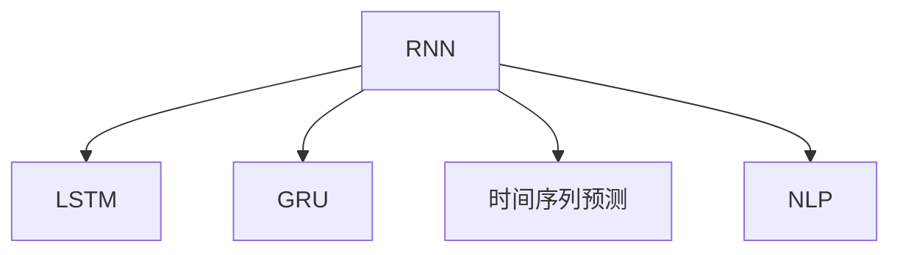

                 

# Recurrent Neural Networks (RNN)原理与代码实例讲解

> 关键词：递归神经网络(RNN),长短时记忆网络(LSTM),门控循环单元(GRU),时间序列预测,自然语言处理(NLP)

## 1. 背景介绍

### 1.1 问题由来
传统的前馈神经网络(Feedforward Neural Network, FNN)能够较好地处理静态数据，但无法利用时间序列数据的时间依赖关系。对于处理时间序列数据的任务，如语音识别、文本生成、机器翻译等，前馈神经网络的效果往往不佳。为了解决这一问题，人们引入了递归神经网络(RNN)，通过循环结构，能够处理变长的序列数据。

递归神经网络是一种基于序列的神经网络，能够对时间序列数据进行建模，具有连续的循环结构。它的主要思想是，将当前时间步的输入与之前时间步的隐藏状态作为输入，通过更新隐藏状态来逐步处理序列数据，并最终输出预测结果。RNN的典型代表包括长短时记忆网络(LSTM)和门控循环单元(GRU)。

### 1.2 问题核心关键点
RNN的核心关键点在于循环结构和记忆机制。递归神经网络通过循环结构，能够处理变长的序列数据。循环结构引入了时间维度，使得网络可以逐步处理序列数据，同时保留之前的上下文信息。记忆机制通过隐藏状态存储和传递信息，使得网络能够记忆和忘记序列中的信息。

RNN的优缺点如下：
- 优点：能够处理变长序列，具有较强的记忆能力，适用于时间序列数据的建模。
- 缺点：存在梯度消失和梯度爆炸问题，训练复杂度较高，容易出现过拟合。

## 2. 核心概念与联系

### 2.1 核心概念概述

为了更好地理解RNN的原理和结构，本节将介绍几个密切相关的核心概念：

- 递归神经网络(RNN)：一种基于序列的神经网络，能够对时间序列数据进行建模，具有连续的循环结构。
- 长短时记忆网络(LSTM)：一种特殊的RNN，通过引入门控机制，能够更好地处理长序列数据，避免梯度消失和梯度爆炸问题。
- 门控循环单元(GRU)：一种简化版的LSTM，通过改进门控机制，进一步提升了训练效率。
- 时间序列预测：指利用历史数据预测未来的时间序列数据，如股票价格、天气预报等。
- 自然语言处理(NLP)：涉及处理和生成自然语言的任务，如文本分类、语言建模、机器翻译等。

这些核心概念之间的逻辑关系可以通过以下Mermaid流程图来展示：



这个流程图展示了大语言模型的核心概念及其之间的关系：

1. RNN是处理序列数据的基元，引入了循环结构。
2. LSTM和GRU是在RNN基础上改进的模型，引入门控机制来控制信息的流动。
3. 时间序列预测是RNN和LSTM的重要应用领域，适用于预测未来的时间序列数据。
4. NLP也是RNN的重要应用领域，适用于文本分类、语言建模等任务。

这些概念共同构成了RNN的框架，使得其能够处理序列数据，并应用于时间序列预测和自然语言处理等任务。

## 3. 核心算法原理 & 具体操作步骤
### 3.1 算法原理概述

RNN通过循环结构，能够处理变长的序列数据，具有较强的记忆能力。其核心思想是，将当前时间步的输入与之前时间步的隐藏状态作为输入，通过更新隐藏状态来逐步处理序列数据，并最终输出预测结果。

RNN的数学表达式如下：

$$
h_t = f(h_{t-1}, x_t)
$$

其中 $h_t$ 表示当前时间步的隐藏状态，$x_t$ 表示当前时间步的输入，$f$ 表示从隐藏状态和输入映射到隐藏状态的函数。$h_t$ 是上一步隐藏状态 $h_{t-1}$ 和当前输入 $x_t$ 的函数，可以表示为：

$$
h_t = \tanh(W_h x_t + U_h h_{t-1} + b_h)
$$

其中 $W_h$ 和 $U_h$ 为权重矩阵，$b_h$ 为偏置向量，$\tanh$ 为激活函数。

### 3.2 算法步骤详解

RNN的训练过程分为两个主要步骤：前向传播和反向传播。

**前向传播**：从初始隐藏状态 $h_0$ 开始，逐个计算每个时间步的隐藏状态和输出，直到最后一个时间步。

**反向传播**：通过计算梯度下降算法，反向传播更新模型参数，以最小化预测输出与真实标签之间的误差。

具体来说，假设有一个长度为 $T$ 的时间序列数据 $\{x_t\}_{t=1}^T$，以及对应的隐藏状态 $\{h_t\}_{t=1}^T$ 和输出 $\{y_t\}_{t=1}^T$。前向传播过程如下：

1. 初始化隐藏状态 $h_0 = \mathbf{0}$，计算输出 $y_T = f(h_T, x_T)$。
2. 逐个计算隐藏状态 $h_t = f(h_{t-1}, x_t)$ 和输出 $y_t = f(h_t, x_t)$。

反向传播过程如下：

1. 计算当前时间步的损失函数 $J = J(y_t, h_t)$。
2. 根据链式法则，计算当前时间步的梯度 $\nabla_{\theta} J$。
3. 逐个计算前一个时间步的梯度 $\nabla_{\theta} J_t$，并更新模型参数 $\theta$。

### 3.3 算法优缺点

RNN的优缺点如下：
- 优点：能够处理变长序列，具有较强的记忆能力，适用于时间序列数据的建模。
- 缺点：存在梯度消失和梯度爆炸问题，训练复杂度较高，容易出现过拟合。

此外，LSTM和GRU作为RNN的改进模型，在处理长序列数据时表现更为优秀，能够避免梯度消失和梯度爆炸问题，训练效率更高。

### 3.4 算法应用领域

RNN广泛应用于时间序列预测和自然语言处理等领域。在时间序列预测中，RNN能够通过历史数据预测未来的时间序列数据，如股票价格、天气预报等。在自然语言处理中，RNN能够处理文本数据，如语言建模、文本分类、机器翻译等任务。

## 4. 数学模型和公式 & 详细讲解
### 4.1 数学模型构建

为了更好地理解RNN的数学模型，本节将对RNN的数学表达式进行详细推导。

假设有一个长度为 $T$ 的时间序列数据 $\{x_t\}_{t=1}^T$，以及对应的隐藏状态 $\{h_t\}_{t=1}^T$ 和输出 $\{y_t\}_{t=1}^T$。前向传播过程如下：

$$
h_t = \tanh(W_h x_t + U_h h_{t-1} + b_h)
$$

其中 $W_h$ 和 $U_h$ 为权重矩阵，$b_h$ 为偏置向量，$\tanh$ 为激活函数。

对于输出层，可以使用简单的线性层：

$$
y_t = U_y h_t + b_y
$$

其中 $U_y$ 和 $b_y$ 为权重矩阵和偏置向量。

### 4.2 公式推导过程

假设给定一个时间序列数据 $\{x_t\}_{t=1}^T$，以及对应的真实标签 $\{y_t\}_{t=1}^T$，我们需要最小化预测输出与真实标签之间的误差，即：

$$
J = \frac{1}{N} \sum_{i=1}^N \ell(y_i, h_i)
$$

其中 $\ell$ 为损失函数，如均方误差、交叉熵等。

假设前向传播过程中，隐藏状态 $h_t$ 和输出 $y_t$ 的表达式如下：

$$
h_t = \tanh(W_h x_t + U_h h_{t-1} + b_h)
$$
$$
y_t = U_y h_t + b_y
$$

则损失函数 $J$ 可以表示为：

$$
J = \frac{1}{N} \sum_{i=1}^N \ell(y_i, U_y h_i + b_y)
$$

通过反向传播算法，可以计算出损失函数对模型参数 $\theta$ 的梯度：

$$
\nabla_{\theta} J = \sum_{i=1}^N \nabla_{\theta} \ell(y_i, U_y h_i + b_y) \frac{\partial (U_y h_i + b_y)}{\partial h_i} \frac{\partial h_i}{\partial \theta}
$$

其中 $\frac{\partial (U_y h_i + b_y)}{\partial h_i} = U_y$。将 $h_i$ 和 $\nabla_{\theta} \ell(y_i, U_y h_i + b_y)$ 代入，得：

$$
\nabla_{\theta} J = \sum_{i=1}^N \nabla_{\theta} \ell(y_i, U_y h_i + b_y) U_y \frac{\partial h_i}{\partial \theta}
$$

将 $h_i$ 代入，得：

$$
\nabla_{\theta} J = \sum_{i=1}^N \nabla_{\theta} \ell(y_i, U_y h_i + b_y) U_y \tanh'(W_h x_i + U_h h_{i-1} + b_h) U_h^T
$$

其中 $\tanh'$ 为激活函数的导数。

### 4.3 案例分析与讲解

以语言建模为例，假设我们需要预测给定文本序列 $x = (x_1, x_2, ..., x_T)$ 的概率，其中每个 $x_i$ 为单词。语言建模的数学模型如下：

$$
P(x) = \prod_{i=1}^T P(x_i | x_{<i})
$$

其中 $x_{<i}$ 表示序列 $x$ 的前 $i-1$ 个单词。

使用RNN进行语言建模，可以将每个单词视为一个时间步，隐藏状态 $h_t$ 表示当前时间步的状态。则语言建模的概率模型可以表示为：

$$
P(x) = \prod_{i=1}^T P(x_i | h_i)
$$

其中 $P(x_i | h_i)$ 为当前时间步的输出概率。

使用LSTM进行语言建模，可以得到如下的概率模型：

$$
P(x) = \prod_{i=1}^T P(x_i | h_i)
$$

其中 $P(x_i | h_i)$ 为当前时间步的输出概率，通过LSTM的输出层得到。

## 5. 项目实践：代码实例和详细解释说明
### 5.1 开发环境搭建

在进行RNN实践前，我们需要准备好开发环境。以下是使用Python进行PyTorch开发的环境配置流程：

1. 安装Anaconda：从官网下载并安装Anaconda，用于创建独立的Python环境。

2. 创建并激活虚拟环境：
```bash
conda create -n rnn-env python=3.8 
conda activate rnn-env
```

3. 安装PyTorch：根据CUDA版本，从官网获取对应的安装命令。例如：
```bash
conda install pytorch torchvision torchaudio cudatoolkit=11.1 -c pytorch -c conda-forge
```

4. 安装TensorFlow：
```bash
pip install tensorflow
```

5. 安装Keras：
```bash
pip install keras
```

6. 安装各类工具包：
```bash
pip install numpy pandas scikit-learn matplotlib tqdm jupyter notebook ipython
```

完成上述步骤后，即可在`rnn-env`环境中开始RNN实践。

### 5.2 源代码详细实现

下面我们以LSTM模型为例，给出使用Keras实现LSTM语言建模的Python代码实现。

首先，定义LSTM模型的输入输出维度：

```python
from keras.models import Sequential
from keras.layers import LSTM, Dense

input_dim = 100  # 输入维度，即每个时间步的单词表示维数
output_dim = 1   # 输出维度，即每个时间步的单词概率维度
seq_length = 20  # 序列长度，即每个文本序列的长度

# 定义模型
model = Sequential()
model.add(LSTM(128, input_shape=(seq_length, input_dim), return_sequences=True))
model.add(Dense(output_dim, activation='softmax'))
```

接着，定义训练和评估函数：

```python
from keras.datasets import imdb
from keras.preprocessing import sequence

# 加载IMDB影评数据集
max_features = 10000
(x_train, y_train), (x_test, y_test) = imdb.load_data(num_words=max_features)

# 对数据进行截断填充
x_train = sequence.pad_sequences(x_train, maxlen=seq_length)
x_test = sequence.pad_sequences(x_test, maxlen=seq_length)

# 定义训练函数
def train(model, x_train, y_train, batch_size=32, epochs=5):
    model.compile(optimizer='rmsprop', loss='binary_crossentropy', metrics=['accuracy'])
    model.fit(x_train, y_train, batch_size=batch_size, epochs=epochs, validation_split=0.2)
    return model

# 定义评估函数
def evaluate(model, x_test, y_test):
    score, acc = model.evaluate(x_test, y_test, batch_size=128)
    print('Test score:', score)
    print('Test accuracy:', acc)
```

最后，启动训练流程并在测试集上评估：

```python
model = train(model, x_train, y_train)

evaluate(model, x_test, y_test)
```

以上就是使用Keras对LSTM进行语言建模的完整代码实现。可以看到，Keras库提供了便捷的高层API，使得模型构建和训练变得简单易行。

### 5.3 代码解读与分析

让我们再详细解读一下关键代码的实现细节：

**LSTM模型定义**：
- 定义了一个包含一个LSTM层和一个全连接层的模型。LSTM层的输出维度为128，输入维度为每个时间步的单词表示维数（此处为100），并且返回序列。
- 全连接层的输出维度为1，使用softmax激活函数。

**数据预处理**：
- 加载IMDB影评数据集，并对数据进行截断填充，保证每个文本序列的长度为20。
- 对每个单词使用词典编码，并将编码后的序列填充到统一长度。

**训练函数**：
- 使用RMSprop优化器，二元交叉熵损失函数，准确率作为评估指标。
- 定义模型训练函数，进行模型编译和拟合，并在验证集上评估模型性能。

**评估函数**：
- 在测试集上评估模型，输出准确率和得分。

可以看到，Keras库为RNN模型的构建和训练提供了便捷的API，使得开发者可以更加专注于模型设计本身，而非繁琐的底层实现。

当然，工业级的系统实现还需考虑更多因素，如模型的保存和部署、超参数的自动搜索、更灵活的任务适配层等。但核心的RNN范式基本与此类似。

## 6. 实际应用场景
### 6.1 智能语音识别

RNN在智能语音识别领域有广泛的应用。语音识别系统需要处理连续的语音信号，并将其转换为文本形式。RNN的循环结构能够处理变长的语音信号，通过隐状态来存储和传递信息，实现对语音信号的建模。

在实际应用中，可以使用LSTM或GRU对语音信号进行建模，提取特征并转换为文本，从而实现语音识别。

### 6.2 自然语言处理

RNN在自然语言处理领域也有重要的应用，如语言建模、文本分类、机器翻译等。

语言建模任务中，RNN可以处理变长的文本序列，通过隐状态来存储和传递信息，实现对文本序列的概率建模。

文本分类任务中，RNN可以提取文本特征，并分类到预定义的类别中，如情感分类、主题分类等。

机器翻译任务中，RNN可以将源语言文本转换为目标语言文本，通过隐状态来存储和传递信息，实现对文本序列的建模。

### 6.3 时间序列预测

RNN在时间序列预测中也有广泛的应用，如股票价格预测、天气预测等。

在时间序列预测中，RNN可以通过历史数据预测未来的时间序列数据，通过隐状态来存储和传递信息，实现对时间序列数据的建模。

## 7. 工具和资源推荐
### 7.1 学习资源推荐

为了帮助开发者系统掌握RNN的理论基础和实践技巧，这里推荐一些优质的学习资源：

1. 《深度学习》系列书籍：由Ian Goodfellow等专家所著，全面介绍了深度学习的基本概念和算法，包括RNN和LSTM。

2. CS231n《卷积神经网络和视觉识别》课程：斯坦福大学开设的计算机视觉明星课程，有Lecture视频和配套作业，带你入门深度学习和计算机视觉。

3. Coursera的《自然语言处理与深度学习》课程：由纽约大学开设，介绍了NLP和深度学习的理论基础和应用实践。

4. TensorFlow官方文档：TensorFlow的官方文档，提供了全面的API说明和示例代码，是进行RNN开发的必备资料。

5. Keras官方文档：Keras的官方文档，提供了便捷的高层API，方便进行模型构建和训练。

通过对这些资源的学习实践，相信你一定能够快速掌握RNN的精髓，并用于解决实际的NLP问题。
###  7.2 开发工具推荐

高效的开发离不开优秀的工具支持。以下是几款用于RNN开发的常用工具：

1. PyTorch：基于Python的开源深度学习框架，灵活动态的计算图，适合快速迭代研究。大部分深度学习模型都有PyTorch版本的实现。

2. TensorFlow：由Google主导开发的开源深度学习框架，生产部署方便，适合大规模工程应用。

3. Keras：基于TensorFlow和Theano的高层API，简单易用，适合快速开发和实验。

4. Jupyter Notebook：交互式编程工具，支持代码和数学公式的混合编辑，方便进行实验和分享。

5. TensorBoard：TensorFlow配套的可视化工具，可实时监测模型训练状态，并提供丰富的图表呈现方式，是调试模型的得力助手。

6. Weights & Biases：模型训练的实验跟踪工具，可以记录和可视化模型训练过程中的各项指标，方便对比和调优。

合理利用这些工具，可以显著提升RNN的开发效率，加快创新迭代的步伐。

### 7.3 相关论文推荐

RNN和LSTM的发展源于学界的持续研究。以下是几篇奠基性的相关论文，推荐阅读：

1. RNN: Recurrent Neural Network Architecture：提出了RNN的基本结构，并应用于自然语言处理和语音识别。

2. LSTM: Long Short-Term Memory：提出LSTM模型，通过引入门控机制，更好地处理长序列数据。

3. GRU: Gated Recurrent Unit：提出GRU模型，通过改进门控机制，进一步提升了训练效率。

4. Sequence to Sequence Learning with Neural Networks：提出Seq2Seq模型，通过RNN实现序列到序列的映射，应用于机器翻译和对话系统。

5. Attention is All You Need：提出Transformer模型，通过自注意力机制取代RNN，进一步提升了模型的性能和效率。

这些论文代表了大语言模型和RNN的发展脉络。通过学习这些前沿成果，可以帮助研究者把握学科前进方向，激发更多的创新灵感。

## 8. 总结：未来发展趋势与挑战
### 8.1 总结

本文对递归神经网络(RNN)的原理和代码实例进行了详细讲解。首先阐述了RNN的背景和核心关键点，明确了RNN在处理序列数据方面的独特优势。其次，从原理到实践，详细讲解了RNN的数学原理和训练过程，给出了RNN语言建模的完整代码实例。同时，本文还广泛探讨了RNN在智能语音识别、自然语言处理和时间序列预测等多个领域的应用前景，展示了RNN的广泛应用和强大潜力。

通过本文的系统梳理，可以看到，RNN作为一种经典的序列数据处理模型，其核心思想和结构设计对后续的深度学习模型发展有着深远的影响。RNN在时间序列数据的建模方面，表现出了明显的优势，尤其在长序列数据的处理上，有着无法替代的潜力。随着深度学习技术的发展，RNN的应用领域将进一步拓展，为人工智能的智能化和自动化带来新的突破。

### 8.2 未来发展趋势

展望未来，RNN的演化和发展将呈现以下几个趋势：

1. 模型结构更加复杂。随着深度学习技术的发展，未来将涌现出更多复杂的RNN变体，如LSTM、GRU等，通过更精细的门控机制和网络结构设计，进一步提升模型的性能和鲁棒性。

2. 并行计算成为常态。随着硬件计算能力的提升，未来的RNN模型将更加注重并行计算优化，提高模型训练和推理的效率。

3. 多模态学习成为热点。未来的RNN模型将不再局限于单模态数据，而是能够整合视觉、音频、文本等多种数据源，实现多模态学习和跨模态表示。

4. 自适应学习机制引入。未来的RNN模型将引入自适应学习机制，根据环境变化和学习进度，动态调整学习率和学习策略，提升模型的灵活性和泛化能力。

5. 模型压缩和量化。为了适应大规模部署和资源限制，未来的RNN模型将进行模型压缩和量化，进一步提升模型在移动设备、嵌入式设备等资源受限环境下的应用效果。

6. 零样本学习和元学习机制引入。未来的RNN模型将通过引入零样本学习、元学习等机制，使得模型能够在未见过的数据上也能进行学习和推理，提升模型的适应性和泛化能力。

以上趋势凸显了RNN的广阔前景。这些方向的探索发展，将进一步提升RNN在自然语言处理、时间序列预测等领域的性能和应用范围，为人工智能技术带来新的突破。

### 8.3 面临的挑战

尽管RNN在序列数据处理方面表现出色，但在面临以下挑战时仍需持续改进：

1. 训练复杂度较高。RNN的训练过程复杂，容易出现梯度消失和梯度爆炸问题，训练效率较低，需要更多的优化算法和超参数调优。

2. 长序列处理困难。RNN在处理长序列数据时，容易遗忘前面的信息，导致模型性能下降。

3. 模型过拟合问题。RNN在处理长序列数据时，容易出现过拟合问题，需要更多的正则化和数据增强技术。

4. 硬件资源要求高。RNN的计算复杂度高，对硬件资源的要求较高，需要更多的优化和资源管理技术。

5. 模型可解释性不足。RNN的内部机制复杂，模型输出的解释性较差，需要更多的模型可视化和可解释性技术。

6. 数据依赖性强。RNN对训练数据的依赖性强，需要更多的数据增强和迁移学习技术，以提高模型的泛化能力和鲁棒性。

正视RNN面临的这些挑战，积极应对并寻求突破，将使RNN模型在未来的发展中更加强大和可靠。相信随着学界和产业界的共同努力，RNN模型必将在人工智能技术的发展中发挥更大的作用。

### 8.4 研究展望

未来的研究需要在以下几个方面寻求新的突破：

1. 开发更高效的优化算法。开发更高效的优化算法，如Adam、Adagrad、RMSprop等，降低RNN的训练复杂度，提升训练效率。

2. 引入自适应学习机制。引入自适应学习机制，如元学习、零样本学习等，提升RNN模型的泛化能力和鲁棒性。

3. 增强模型的可解释性。引入可解释性技术，如注意力机制、可视化工具等，提高RNN模型的可解释性和可理解性。

4. 引入多模态学习。引入多模态学习技术，整合视觉、音频、文本等多种数据源，提升RNN模型的性能和应用范围。

5. 引入动态网络结构。引入动态网络结构，如递归神经网络、变长RNN等，提升RNN模型的灵活性和适应性。

6. 优化硬件资源利用。优化硬件资源利用，如模型压缩、量化、并行计算等，提升RNN模型在大规模部署和资源受限环境下的应用效果。

这些研究方向的探索，将引领RNN技术迈向更高的台阶，为自然语言处理、时间序列预测等领域的深度学习和应用带来新的突破。面向未来，RNN技术还需要与其他人工智能技术进行更深入的融合，如知识表示、因果推理、强化学习等，多路径协同发力，共同推动人工智能技术的进步。

## 9. 附录：常见问题与解答
**Q1：RNN和LSTM、GRU的区别是什么？**

A: RNN是一种基本的递归神经网络结构，通过循环结构处理序列数据。LSTM和GRU是在RNN基础上改进的模型，引入门控机制来控制信息的流动。LSTM通过引入门控单元，能够更好地处理长序列数据，避免梯度消失和梯度爆炸问题。GRU通过简化LSTM的门控机制，进一步提升了训练效率。

**Q2：RNN在训练过程中如何避免梯度消失和梯度爆炸问题？**

A: 梯度消失和梯度爆炸是RNN训练过程中常见的问题，可以通过以下方法进行避免：
1. 梯度裁剪：对梯度进行裁剪，限制其范数，避免梯度爆炸。
2. 权重初始化：使用合理的权重初始化方法，如Xavier初始化、He初始化等，降低梯度消失的风险。
3. 残差连接：引入残差连接，使得信息能够直接传递，避免信息丢失。
4. 门控机制：引入门控机制，如LSTM、GRU等，更好地控制信息的流动，避免梯度消失和梯度爆炸。

**Q3：RNN在序列数据建模中需要注意哪些问题？**

A: RNN在序列数据建模中需要注意以下问题：
1. 序列长度限制：序列长度过长容易导致梯度消失和梯度爆炸，需要合理控制序列长度。
2. 训练效率：RNN的训练过程复杂，容易出现过拟合问题，需要更多的正则化和数据增强技术。
3. 模型泛化能力：RNN对训练数据的依赖性强，需要更多的迁移学习和数据增强技术，提高模型的泛化能力和鲁棒性。
4. 硬件资源限制：RNN的计算复杂度高，对硬件资源的要求较高，需要更多的优化和资源管理技术。

**Q4：RNN在实际应用中如何进行模型调参？**

A: RNN的模型调参需要关注以下关键参数：
1. 隐藏状态维度：隐藏状态维度越大，模型的表达能力越强，但计算复杂度也越高。需要根据任务需求和硬件资源进行合理选择。
2. 学习率：学习率是影响模型收敛速度和稳定性的关键参数，需要通过实验进行调参。
3. 正则化系数：正则化系数对模型的泛化能力有重要影响，需要根据模型复杂度和数据集大小进行合理选择。
4. 批量大小：批量大小影响模型的训练效率和收敛速度，需要根据硬件资源和数据集大小进行合理选择。

**Q5：RNN在序列数据建模中如何避免过拟合问题？**

A: RNN在序列数据建模中，可以通过以下方法避免过拟合问题：
1. 数据增强：通过对序列进行截断、回译等操作，增加数据的多样性，避免过拟合。
2. 正则化：使用L2正则、Dropout等正则化技术，控制模型的复杂度，避免过拟合。
3. 早停法：在验证集上监控模型的性能，一旦性能不再提升，立即停止训练，避免过拟合。
4. 梯度裁剪：对梯度进行裁剪，限制其范数，避免梯度爆炸。
5. 残差连接：引入残差连接，使得信息能够直接传递，避免信息丢失，提高模型的泛化能力。

这些方法可以结合使用，根据具体任务和数据集特点进行灵活组合，以最大限度地降低过拟合风险。

---

作者：禅与计算机程序设计艺术 / Zen and the Art of Computer Programming

