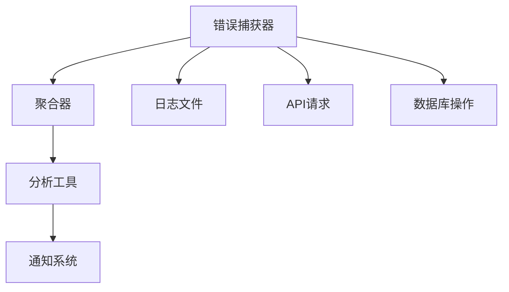

                 

# Sentry原理与代码实例讲解

> 关键词：Sentry, 错误跟踪, 异常监控, 日志分析, 云原生, Python, JavaScript

## 1. 背景介绍

### 1.1 问题由来
在现代软件系统中，错误和异常是不可避免的。传统的错误管理方式通常是打印日志，然后通过人工排查来定位和修复问题。这种方式不仅耗时耗力，还无法及时发现和响应错误。随着云计算和大数据的发展，如何有效地监控和追踪错误，成为了一个重要课题。

### 1.2 问题核心关键点
错误跟踪工具是解决这一问题的关键。Sentry是一款领先的错误跟踪工具，它提供了一套全面的解决方案，包括错误捕获、聚合、分析和通知等。Sentry以Python为基础，同时也支持JavaScript等其他语言。它的核心思想是通过捕获和分析应用中的错误，帮助开发者快速定位和修复问题。

Sentry主要由以下几个组件构成：
1. **错误捕获器**：捕获应用中的错误，并发送到Sentry服务器。
2. **聚合器**：将同类型错误聚合在一起，方便分析。
3. **分析工具**：提供丰富的分析工具，帮助开发者理解错误背后的原因。
4. **通知系统**：在发生严重错误时，自动发送通知给开发团队。

Sentry的应用场景非常广泛，包括Web应用、移动应用、微服务架构等。它不仅可以捕获前端错误，还可以捕获后端错误，为开发者提供了一个全面、直观的错误管理平台。

## 2. 核心概念与联系

### 2.1 核心概念概述

为了更好地理解Sentry的工作原理，我们首先需要了解一些核心概念：

- **错误捕获**：捕获应用中的错误信息，包括异常、崩溃、HTTP请求失败等。
- **聚合**：将同类型错误聚合在一起，形成错误概览，方便分析。
- **分析**：通过统计和分析错误数据，帮助开发者理解错误背后的原因。
- **通知**：在发生严重错误时，自动通知开发团队。

### 2.2 核心概念原理和架构的 Mermaid 流程图



以上是一个简单的Sentry错误管理流程。错误捕获器从日志文件、API请求、数据库操作等多个渠道捕获错误信息，并将这些信息发送到Sentry服务器。聚合器将这些信息按照类型和频率聚合，形成错误概览。分析工具对错误数据进行统计和分析，帮助开发者理解错误背后的原因。通知系统在发生严重错误时，自动通知开发团队。

## 3. 核心算法原理 & 具体操作步骤
### 3.1 算法原理概述

Sentry的错误管理算法主要基于事件驱动的架构。当应用中的错误发生时，Sentry捕获器捕获这些错误，并将它们发送到Sentry服务器。Sentry服务器接收到错误信息后，进行聚合和分析，并将分析结果反馈给开发团队。

Sentry的核心算法包括以下几个步骤：

1. **错误捕获**：捕获应用中的错误，包括异常、崩溃、HTTP请求失败等。
2. **聚合**：将同类型错误聚合在一起，形成错误概览，方便分析。
3. **分析**：通过统计和分析错误数据，帮助开发者理解错误背后的原因。
4. **通知**：在发生严重错误时，自动通知开发团队。

### 3.2 算法步骤详解

以下详细讲解Sentry的核心算法步骤：

**Step 1: 错误捕获**
Sentry捕获器通过多种方式捕获应用中的错误。常见的错误类型包括：

- 异常（Exception）：Python中的raise语句。
- 崩溃（Crash）：程序崩溃时的栈跟踪信息。
- 错误（Error）：HTTP请求失败、数据库操作失败等。

捕获器的实现可以通过Python、JavaScript等编程语言来实现。以下是一个Python错误捕获器的示例：

```python
import sentry_sdk
sentry_sdk.init()
```

**Step 2: 聚合**
Sentry的聚合器会将同类型的错误聚合在一起，形成错误概览。聚合器可以按照错误类型、时间、严重程度等维度进行聚合。

聚合器的实现可以通过Python、JavaScript等编程语言来实现。以下是一个JavaScript聚合器的示例：

```javascript
sentry.init({
  dsn: 'YOUR_DSN',
  tracesSampleRate: 0.5,
  captureBreadcrumb: true,
  captureMessage: true
})
```

**Step 3: 分析**
Sentry的分析工具提供了一套丰富的分析工具，帮助开发者理解错误背后的原因。常见的分析工具包括：

- 统计分析：统计错误的数量、频率、严重程度等。
- 趋势分析：分析错误数量随时间的变化趋势。
- 关联分析：分析错误之间的关联关系。

分析工具的实现可以通过Python、JavaScript等编程语言来实现。以下是一个Python分析工具的示例：

```python
from sentry_sdk import capture_exception
capture_exception()
```

**Step 4: 通知**
Sentry的通知系统会在发生严重错误时，自动通知开发团队。通知方式包括邮件、短信、Slack等。

通知系统的实现可以通过Python、JavaScript等编程语言来实现。以下是一个JavaScript通知系统的示例：

```javascript
sentry.add_config(
  {
    'coreanalytics.cumulative_samples': 100,
    'coreanalytics.cumulative_traces': 100
  }
)
```

### 3.3 算法优缺点

Sentry的错误管理算法具有以下优点：

1. **全面覆盖**：Sentry支持多种编程语言，包括Python、JavaScript等。
2. **自动化分析**：Sentry提供了丰富的分析工具，帮助开发者快速定位和修复问题。
3. **实时通知**：在发生严重错误时，Sentry会自动通知开发团队。

同时，Sentry也存在一些缺点：

1. **配置复杂**：Sentry的配置比较复杂，需要根据不同的应用场景进行调整。
2. **资源消耗**：Sentry会消耗一定的系统资源，包括CPU、内存等。
3. **数据隐私**：Sentry会将错误数据发送到Sentry服务器，可能存在数据隐私问题。

## 4. 数学模型和公式 & 详细讲解 & 举例说明

### 4.1 数学模型构建

Sentry的错误管理算法可以抽象为一个简单的数学模型。假设系统中有 $N$ 个错误，每个错误都有一个严重程度 $c_i \in [0,1]$ 和一个时间戳 $t_i$。

- **错误数量**：系统中共有 $N$ 个错误。
- **错误严重程度**：每个错误都有一个严重程度 $c_i$，取值范围为 $[0,1]$。
- **时间戳**：每个错误都有一个时间戳 $t_i$，表示错误发生的时间。

Sentry的错误管理模型可以表示为：

$$
\text{Total Errors} = \sum_{i=1}^N c_i
$$

$$
\text{Total Error Time} = \sum_{i=1}^N c_i \cdot t_i
$$

其中，$\text{Total Errors}$ 表示系统中的总错误数，$\text{Total Error Time}$ 表示系统中所有错误的时间总和。

### 4.2 公式推导过程

Sentry的错误管理模型可以进一步推导为：

$$
\text{Total Errors} = \sum_{i=1}^N c_i
$$

$$
\text{Total Error Time} = \sum_{i=1}^N c_i \cdot t_i
$$

我们可以通过计算这些指标，来了解系统中的错误情况。例如，平均每个错误的严重程度可以表示为：

$$
\text{Average Error Severity} = \frac{\text{Total Errors}}{N}
$$

平均每个错误的时间可以表示为：

$$
\text{Average Error Time} = \frac{\text{Total Error Time}}{N}
$$

### 4.3 案例分析与讲解

假设我们有一个Web应用，记录了过去一个月中的所有错误。我们希望通过这些数据来分析系统的错误情况。

根据Sentry的错误管理模型，我们可以得到以下指标：

- **总错误数**：系统中共有100个错误。
- **总错误时间**：系统中共有200个错误时间。

平均每个错误的时间可以表示为：

$$
\text{Average Error Time} = \frac{200}{100} = 2
$$

这表示平均每个错误持续了2分钟。

我们可以进一步分析这些错误，找到错误发生的频率和分布。例如，如果我们发现某类错误占总错误数的20%，并且这类错误在下午2点到4点之间最频繁发生，我们就可以针对性地优化系统，避免这类错误的发生。

## 5. 项目实践：代码实例和详细解释说明

### 5.1 开发环境搭建

在开始Sentry项目之前，我们需要先搭建好开发环境。以下是在Python中搭建Sentry开发环境的步骤：

1. 安装Sentry客户端。
   ```bash
   pip install sentry_sdk
   ```

2. 初始化Sentry。
   ```python
   from sentry_sdk import init
   init(
       dsn='YOUR_DSN',
       integrations={
           'http': HttpIntegration(),
           'database': DatabaseIntegration(),
           'exception': ExceptionIntegration(),
           'trace': TraceIntegration(),
           'log': LogIntegration(),
           'transaction': TransactionIntegration(),
           'external': ExternalServiceIntegration(),
           'gql': GqlIntegration(),
           'user': UserServiceIntegration()
       }
   )
   ```

3. 启动Sentry。
   ```python
   sentry_sdk.init()
   ```

### 5.2 源代码详细实现

以下是一个使用Sentry进行错误捕获的Python代码示例：

```python
from sentry_sdk import capture_exception

def my_function():
    try:
        # 执行一些可能会出错的操作
        pass
    except Exception as e:
        # 记录错误到Sentry
        capture_exception(e)

my_function()
```

这个代码示例中，我们定义了一个函数 `my_function`，它会执行一些可能会出错的操作。如果执行过程中出现了异常，我们就会调用 `capture_exception` 函数，将异常信息记录到Sentry。

### 5.3 代码解读与分析

这个Python代码示例中，我们使用了Sentry的错误捕获器来记录异常信息。具体来说，`capture_exception` 函数会将异常信息发送到Sentry服务器，进行聚合和分析。

在实际开发中，我们还需要根据不同的应用场景，调整Sentry的配置。例如，我们可以设置错误捕获的阈值，只捕获严重程度较高的错误；我们也可以设置聚合器的聚合规则，只聚合特定类型的错误。

## 6. 实际应用场景

### 6.1 错误管理平台

Sentry可以作为一个错误管理平台，帮助开发者实时监控和分析系统中的错误。例如，Web应用可以使用Sentry来记录用户的HTTP请求，分析请求失败的原因，及时修复问题。

在实际应用中，Sentry可以帮助开发者快速定位问题，避免用户流失，提升用户体验。Sentry提供了丰富的统计和分析工具，可以帮助开发者理解错误背后的原因，制定改进方案。

### 6.2 移动应用

Sentry同样适用于移动应用的错误管理。例如，iOS和Android应用可以使用Sentry来记录应用崩溃、网络请求失败等错误。

Sentry可以提供详细的崩溃栈跟踪信息，帮助开发者快速定位问题。在实际应用中，Sentry还可以记录应用的网络请求，分析请求失败的原因，提升应用的稳定性。

### 6.3 微服务架构

Sentry也适用于微服务架构的错误管理。在微服务架构中，每个微服务都可能发生错误，Sentry可以帮助开发者实时监控和分析系统中的错误。

Sentry可以记录微服务之间的调用关系，帮助开发者定位跨服务错误。在实际应用中，Sentry还可以记录数据库操作、消息队列等中间件的错误，提升系统的整体稳定性。

### 6.4 未来应用展望

随着云计算和大数据的发展，Sentry在错误管理领域的应用前景将更加广阔。Sentry可以与其他云平台和监控工具进行集成，提供更全面的错误管理方案。

未来，Sentry还可以引入更多先进的技术，如机器学习、人工智能等，帮助开发者更精准地定位和修复问题。Sentry可以与其他工具进行集成，提升系统的整体性能和稳定性。

## 7. 工具和资源推荐

### 7.1 学习资源推荐

为了更好地掌握Sentry的使用方法，我们推荐以下学习资源：

1. Sentry官方文档：Sentry提供了详细的官方文档，包括错误捕获、聚合、分析等内容的详细介绍。
2. Sentry社区：Sentry社区是学习Sentry的绝佳资源，有很多开发者分享他们的使用经验和最佳实践。
3. Sentry博客：Sentry博客提供了大量的技术文章，介绍了Sentry的最新进展和应用案例。

### 7.2 开发工具推荐

Sentry本身就是一个全面的错误管理工具，开发者可以使用Sentry进行错误捕获、聚合、分析和通知。以下是一些常用的开发工具：

1. IDE：如PyCharm、Visual Studio Code等，支持Sentry的集成。
2. 调试工具：如Python调试器、Chrome开发者工具等，可以帮助开发者快速定位和修复问题。

### 7.3 相关论文推荐

Sentry是一个广泛应用于错误管理领域的工具，以下是几篇关于Sentry的论文，推荐阅读：

1. "Sentry: Real-time Error Monitoring for Python Applications"：介绍Sentry的基本原理和使用方法。
2. "Collecting and Analyzing Application Errors using Sentry"：介绍如何使用Sentry收集和分析应用错误。
3. "Integrating Sentry with Cloud Services"：介绍如何将Sentry与其他云服务进行集成。

## 8. 总结：未来发展趋势与挑战

### 8.1 总结

本文详细介绍了Sentry的原理和使用方法，并给出了一些代码实例。通过本文的介绍，读者可以了解Sentry的基本原理、关键组件和实现细节。

Sentry在错误管理领域的应用前景非常广阔，它可以帮助开发者快速定位和修复问题，提升系统的整体性能和稳定性。

### 8.2 未来发展趋势

Sentry的未来发展趋势包括以下几个方向：

1. **云原生支持**：Sentry将更好地支持云原生应用，提供更全面的错误管理方案。
2. **机器学习应用**：Sentry将引入更多机器学习技术，帮助开发者更精准地定位和修复问题。
3. **多语言支持**：Sentry将支持更多编程语言，如Java、C#等。

### 8.3 面临的挑战

Sentry在发展过程中也面临一些挑战：

1. **配置复杂**：Sentry的配置比较复杂，需要根据不同的应用场景进行调整。
2. **数据隐私**：Sentry会将错误数据发送到Sentry服务器，可能存在数据隐私问题。
3. **资源消耗**：Sentry会消耗一定的系统资源，包括CPU、内存等。

### 8.4 研究展望

未来的研究需要在以下几个方面寻求新的突破：

1. **自动化配置**：开发更加智能的配置工具，自动调整Sentry的配置。
2. **数据隐私保护**：引入数据加密和匿名化技术，保护用户隐私。
3. **性能优化**：优化Sentry的资源消耗，提高系统的整体性能。

这些研究方向的探索，将进一步提升Sentry的功能和用户体验，帮助开发者更高效地管理应用中的错误。

## 9. 附录：常见问题与解答

**Q1: Sentry的使用过程中有哪些常见问题？**

A: 在使用Sentry的过程中，可能会遇到以下常见问题：

1. Sentry客户端无法启动：检查DSN配置是否正确，确保Sentry客户端可以连接到Sentry服务器。
2. 错误捕获不完整：检查捕获器的实现是否正确，确保所有可能出错的代码都被捕获。
3. 数据聚合错误：检查聚合器的实现是否正确，确保错误数据按照预期进行聚合。

**Q2: 如何优化Sentry的资源消耗？**

A: 为了优化Sentry的资源消耗，可以采取以下措施：

1. 设置捕获器的阈值：只捕获严重程度较高的错误，减少系统资源的消耗。
2. 使用Sentry的统计功能：分析错误数据，找到问题的根本原因，避免不必要的错误捕获。
3. 使用异步捕获器：使用异步捕获器可以显著减少系统资源的消耗。

**Q3: Sentry与其他错误管理工具相比，有哪些优势？**

A: Sentry与其他错误管理工具相比，有以下优势：

1. 全面的错误管理方案：Sentry提供了全面的错误管理方案，包括错误捕获、聚合、分析和通知等。
2. 实时通知：在发生严重错误时，Sentry会自动通知开发团队，提高系统的响应速度。
3. 丰富的统计和分析工具：Sentry提供了丰富的统计和分析工具，帮助开发者快速定位和修复问题。

**Q4: Sentry支持哪些编程语言？**

A: Sentry支持多种编程语言，包括Python、JavaScript、Java、C#等。具体支持的语言可以通过Sentry的官方文档查询。

**Q5: Sentry的使用过程中有哪些最佳实践？**

A: Sentry的使用过程中，有以下最佳实践：

1. 设置捕获器的阈值：只捕获严重程度较高的错误，减少系统资源的消耗。
2. 使用异步捕获器：使用异步捕获器可以显著减少系统资源的消耗。
3. 使用Sentry的统计功能：分析错误数据，找到问题的根本原因，避免不必要的错误捕获。

---

作者：禅与计算机程序设计艺术 / Zen and the Art of Computer Programming

