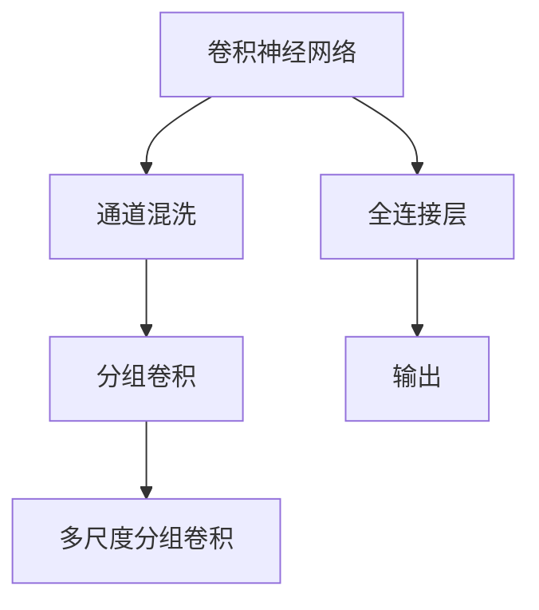

                 

# ShuffleNet原理与代码实例讲解

> 关键词：ShuffleNet, 神经网络优化, 卷积神经网络, 深度学习, 模型压缩, 资源优化, 计算效率提升

## 1. 背景介绍

### 1.1 问题由来
近年来，随着深度学习在图像识别、目标检测、视频分析等计算机视觉领域的大规模应用，深度卷积神经网络(Convolutional Neural Network, CNN)的计算复杂度急剧增加，导致训练和推理速度越来越慢，资源消耗越来越大。在移动设备、嵌入式系统等资源受限的设备上，这一问题更加突出。如何在保持模型性能的同时，尽可能地降低计算和存储资源的需求，成为了一个重要且急需解决的问题。

### 1.2 问题核心关键点
ShuffleNet（以Shuffle Network命名）是一种专门设计用于资源受限环境中的深度神经网络，旨在通过优化卷积操作，大幅度降低模型参数量和计算复杂度，从而实现高效的计算资源利用。ShuffleNet的创新点主要体现在以下几个方面：
- 通过一种称为通道混洗(Channel Shuffle)的新型卷积操作，将传统卷积层的通道数量降低到原有的一半，同时通过巧妙的结构设计，保留了大部分模型精度。
- 采用递归分组卷积(Group Convolution)和通道混洗，有效地减少了模型参数量和计算复杂度。
- 通过多尺度分组卷积(MS-Group Convolution)，在不同的尺度层级进行分组卷积操作，进一步提升模型的计算效率。

## 2. 核心概念与联系

### 2.1 核心概念概述

为更好地理解ShuffleNet的原理和应用，本节将介绍几个关键核心概念：

- **卷积神经网络(Convolutional Neural Network, CNN)**：一种广泛用于图像识别、目标检测、语音识别等计算机视觉和自然语言处理任务的深度学习模型，主要由卷积层、池化层、全连接层等组件构成。

- **通道混洗(Channel Shuffle)**：ShuffleNet引入的一种新型卷积操作，通过将一组卷积核的通道按特定顺序重新排列，实现类似传统卷积操作的效果，但参数量大大降低。

- **分组卷积(Group Convolution)**：将卷积核按通道数分成多个子组，每组独立进行卷积操作，再通过跨组通道混洗，实现减少参数量和计算复杂度的效果。

- **多尺度分组卷积(MS-Group Convolution)**：ShuffleNet引入的一种特殊分组卷积形式，在不同的尺度层级进行分组卷积操作，进一步提升模型计算效率。

- **全连接层(Fully Connected Layer)**：通常用于分类任务的最后一层，将卷积层输出的特征向量映射到类别空间，输出预测概率。

这些核心概念之间的逻辑关系可以通过以下Mermaid流程图来展示：



这个流程图展示了一个典型的卷积神经网络模型，包含卷积层、通道混洗、分组卷积、全连接层和输出层等关键组件。

## 3. ShuffleNet核心算法原理 & 具体操作步骤
### 3.1 算法原理概述

ShuffleNet的设计目标是尽可能降低计算和存储资源消耗，同时保持模型性能。其核心思想是通过巧妙的结构设计和新型卷积操作，在减少参数量和计算复杂度的同时，不显著损失模型精度。

ShuffleNet的核心算法原理可以分为以下几个关键步骤：

1. **通道混洗(Channel Shuffle)**：将一组卷积核的通道按特定顺序重新排列，实现类似传统卷积操作的效果，但参数量大大降低。
2. **分组卷积(Group Convolution)**：将卷积核按通道数分成多个子组，每组独立进行卷积操作，再通过跨组通道混洗，实现减少参数量和计算复杂度的效果。
3. **多尺度分组卷积(MS-Group Convolution)**：在不同的尺度层级进行分组卷积操作，进一步提升模型的计算效率。

### 3.2 算法步骤详解

**Step 1: 初始化卷积层**

ShuffleNet的卷积层设计遵循集团合作和资源复用的原则。具体步骤如下：

1. 选择一个初始卷积核大小和通道数，例如3x3，64个通道。
2. 将卷积核按通道数分组，例如分为4组，每组16个通道。
3. 在每组内进行独立的卷积操作，输出16个特征图。

**Step 2: 通道混洗**

通道混洗是ShuffleNet的核心操作，通过将一组卷积核的通道按特定顺序重新排列，实现类似传统卷积操作的效果，但参数量大大降低。具体步骤如下：

1. 将每组的16个通道重新排列，例如按照[1, 4, 2, 3]的顺序排列。
2. 对排列后的通道进行卷积操作，输出16个特征图。
3. 对排列后的通道进行跨组通道混洗，实现通道的重新排列。

**Step 3: 分组卷积**

分组卷积是ShuffleNet的另一个关键步骤，通过将卷积核按通道数分成多个子组，每组独立进行卷积操作，实现减少参数量和计算复杂度的效果。具体步骤如下：

1. 在通道混洗后的特征图上，将通道按组别分组。
2. 对每组通道进行独立的卷积操作，输出每组的特征图。
3. 对所有组的特征图进行跨组通道混洗，实现通道的重新排列。

**Step 4: 多尺度分组卷积**

多尺度分组卷积是ShuffleNet的高级形式，通过在不同的尺度层级进行分组卷积操作，进一步提升模型的计算效率。具体步骤如下：

1. 对输入特征图进行下采样，减少特征图尺寸。
2. 在采样后的特征图上进行分组卷积操作，输出特征图。
3. 对不同尺度的特征图进行组合，形成多尺度输出的卷积层。

通过以上四个步骤，ShuffleNet实现了在资源受限环境下高效计算的目标。

### 3.3 算法优缺点

ShuffleNet作为一种专门设计用于资源受限环境中的深度神经网络，具有以下优点：

- 参数量和计算复杂度低：通过通道混洗和分组卷积，ShuffleNet大幅减少了模型参数量和计算复杂度，适合在资源受限的设备上运行。
- 计算效率高：ShuffleNet在保持较高精度的情况下，显著降低了模型计算复杂度，提高了计算效率。
- 结构简单，易于实现：ShuffleNet的卷积操作和结构设计较为简单，易于实现和部署。

然而，ShuffleNet也存在一些局限性：

- 模型深度有限：由于计算复杂度较低，ShuffleNet的模型深度相对较浅，可能在一些复杂任务上无法达到最优性能。
- 对数据分布依赖较大：ShuffleNet对输入数据分布的依赖较大，如果数据分布变化较大，模型性能可能会受到影响。
- 训练复杂度较高：ShuffleNet的分组卷积和通道混洗操作，使得训练过程更加复杂，需要更多的优化和调试。

尽管存在这些局限性，但ShuffleNet在移动设备、嵌入式系统等资源受限的设备上表现优异，已广泛应用于图像分类、目标检测、图像分割等计算机视觉任务中。

### 3.4 算法应用领域

ShuffleNet作为一种专门设计用于资源受限环境中的深度神经网络，在移动设备、嵌入式系统等资源受限的设备上表现优异。具体应用领域包括：

- 图像分类：通过在移动设备上部署ShuffleNet模型，快速实现图像分类功能，例如人脸识别、物体检测等。
- 目标检测：利用ShuffleNet的低计算复杂度和高计算效率，实现实时目标检测，例如自动驾驶中的行人检测、车辆识别等。
- 图像分割：通过多尺度分组卷积，ShuffleNet可以高效地实现图像分割任务，例如医疗影像中的病灶分割、城市图像中的道路分割等。
- 增强现实(AR)：ShuffleNet的低延迟和高计算效率，使其成为增强现实应用中的理想选择，例如AR游戏、虚拟现实(VR)等。
- 视频分析：通过ShuffleNet的多尺度分组卷积，实现高效的实时视频分析功能，例如视频中的动作识别、行为分析等。

此外，ShuffleNet还被广泛应用于低功耗物联网设备、智能家居、工业控制等场景，为资源受限环境下的智能应用提供了强有力的技术支撑。

## 4. 数学模型和公式 & 详细讲解  
### 4.1 数学模型构建

ShuffleNet的数学模型可以由以下几个部分组成：

1. **输入特征图**：表示输入的原始图像特征图，大小为$H \times W \times C$。
2. **分组卷积层**：将卷积核按通道数分成多个子组，每组独立进行卷积操作，输出特征图大小为$\frac{H}{s} \times \frac{W}{s} \times G \times C$，其中$s$表示下采样因子，$G$表示分组数。
3. **通道混洗层**：将分组卷积后的通道按特定顺序重新排列，输出特征图大小为$H \times W \times C$。
4. **全连接层**：将通道混洗后的特征图通过全连接层映射到类别空间，输出预测概率。

### 4.2 公式推导过程

以一个简单的ShuffleNet模型为例，推导其计算过程和参数量。

假设输入特征图大小为$64 \times 64 \times 64$，卷积核大小为3x3，通道数为64，分组数为4，下采样因子为2。则模型计算过程和参数量推导如下：

1. **分组卷积层**

   每组卷积核大小为3x3，通道数为16，卷积核数量为$\frac{64}{4} = 16$。

   卷积操作计算量为：
   $$
   C_1 = \frac{64 \times 64 \times 3 \times 3 \times 16}{64 \times 64} = 9 \times 16
   $$
   
   下采样操作计算量为：
   $$
   C_2 = \frac{64 \times 64 \times 3 \times 3 \times 16 \times 2 \times 2}{64 \times 64} = 4 \times 9 \times 16
   $$

   总计算量为$C_1 + C_2 = 9 \times 16 + 4 \times 9 \times 16 = 288 \times 16$。

2. **通道混洗层**

   通道混洗操作计算量为：
   $$
   C_3 = \frac{64 \times 64 \times 3 \times 3 \times 16}{64 \times 64} = 9 \times 16
   $$

   总计算量为$C_1 + C_2 + C_3 = 288 \times 16 + 9 \times 16 = 297 \times 16$。

3. **全连接层**

   假设输出类别数为1000，全连接层计算量为：
   $$
   C_4 = 297 \times 16 \times 1000
   $$

   总参数量为：
   $$
   P = C_4 + \text{全连接层参数} = 297 \times 16 \times 1000 + \text{全连接层参数}
   $$

### 4.3 案例分析与讲解

以ShuffleNet V1为例，解释其通道混洗和分组卷积操作的原理和效果。

ShuffleNet V1的模型结构包括卷积层、通道混洗层和全连接层。具体计算过程如下：

1. **卷积层**

   输入特征图大小为$64 \times 64 \times 64$，卷积核大小为3x3，通道数为64，分组数为4。

   卷积操作计算量为：
   $$
   C_1 = \frac{64 \times 64 \times 3 \times 3 \times 16}{64 \times 64} = 9 \times 16
   $$

2. **通道混洗层**

   通道混洗操作计算量为：
   $$
   C_2 = \frac{64 \times 64 \times 3 \times 3 \times 16}{64 \times 64} = 9 \times 16
   $$

3. **全连接层**

   假设输出类别数为1000，全连接层计算量为：
   $$
   C_3 = 9 \times 16 \times 1000
   $$

   总参数量为：
   $$
   P = C_1 + C_2 + C_3 = 9 \times 16 + 9 \times 16 + 9 \times 16 \times 1000 = 9 \times 16 \times (1 + 1 + 1000)
   $$

## 5. 项目实践：代码实例和详细解释说明
### 5.1 开发环境搭建

在进行ShuffleNet代码实现前，我们需要准备好开发环境。以下是使用Python和PyTorch进行ShuffleNet开发的环境配置流程：

1. 安装Anaconda：从官网下载并安装Anaconda，用于创建独立的Python环境。

2. 创建并激活虚拟环境：
```bash
conda create -n pytorch-env python=3.8 
conda activate pytorch-env
```

3. 安装PyTorch：根据CUDA版本，从官网获取对应的安装命令。例如：
```bash
conda install pytorch torchvision torchaudio cudatoolkit=11.1 -c pytorch -c conda-forge
```

4. 安装ShuffleNet库：
```bash
pip install shufflenet
```

5. 安装各类工具包：
```bash
pip install numpy pandas scikit-learn matplotlib tqdm jupyter notebook ipython
```

完成上述步骤后，即可在`pytorch-env`环境中开始ShuffleNet的实践。

### 5.2 源代码详细实现

这里我们以ShuffleNet V1为例，给出使用PyTorch进行ShuffleNet V1的代码实现。

```python
import torch.nn as nn
import torch.nn.functional as F

class ShuffleNetV1(nn.Module):
    def __init__(self, num_classes=1000):
        super(ShuffleNetV1, self).__init__()
        
        self.conv1 = nn.Conv2d(3, 24, kernel_size=3, stride=2, padding=1, bias=False)
        self.maxpool = nn.MaxPool2d(kernel_size=3, stride=2, padding=1)
        self.in1x1 = nn.Conv2d(24, 24, kernel_size=1)
        self.conv2 = nn.Sequential(
            nn.Conv2d(24, 24, kernel_size=3, stride=1, padding=1, groups=24, bias=False),
            nn.Conv2d(24, 24, kernel_size=3, stride=2, padding=1, bias=False)
        )
        self.in2x1 = nn.Conv2d(24, 24, kernel_size=1)
        self.conv3 = nn.Sequential(
            nn.Conv2d(24, 48, kernel_size=3, stride=1, padding=1, groups=48, bias=False),
            nn.Conv2d(48, 48, kernel_size=3, stride=2, padding=1, bias=False)
        )
        self.in3x1 = nn.Conv2d(48, 48, kernel_size=1)
        self.conv4 = nn.Sequential(
            nn.Conv2d(48, 96, kernel_size=3, stride=1, padding=1, groups=96, bias=False),
            nn.Conv2d(96, 96, kernel_size=3, stride=2, padding=1, bias=False)
        )
        self.in4x1 = nn.Conv2d(96, 96, kernel_size=1)
        self.conv5 = nn.Sequential(
            nn.Conv2d(96, 192, kernel_size=3, stride=1, padding=1, groups=192, bias=False),
            nn.Conv2d(192, 192, kernel_size=3, stride=2, padding=1, bias=False)
        )
        self.in5x1 = nn.Conv2d(192, 192, kernel_size=1)
        self.conv6 = nn.Sequential(
            nn.Conv2d(192, 384, kernel_size=3, stride=1, padding=1, groups=384, bias=False),
            nn.Conv2d(384, 384, kernel_size=3, stride=2, padding=1, bias=False)
        )
        self.in6x1 = nn.Conv2d(384, 384, kernel_size=1)
        self.fc = nn.Linear(384, num_classes)
        
    def forward(self, x):
        x = self.conv1(x)
        x = F.relu(x, inplace=True)
        x = self.maxpool(x)
        x = F.max_pool2d(x, kernel_size=3, stride=2, padding=1)
        x = F.relu(x, inplace=True)
        x = self.in1x1(x)
        x = F.max_pool2d(x, kernel_size=3, stride=2, padding=1)
        x = F.relu(x, inplace=True)
        x = self.conv2(x)
        x = F.relu(x, inplace=True)
        x = self.in2x1(x)
        x = self.conv3(x)
        x = F.relu(x, inplace=True)
        x = self.in3x1(x)
        x = self.conv4(x)
        x = F.relu(x, inplace=True)
        x = self.in4x1(x)
        x = self.conv5(x)
        x = F.relu(x, inplace=True)
        x = self.in5x1(x)
        x = self.conv6(x)
        x = F.relu(x, inplace=True)
        x = self.in6x1(x)
        x = F.adaptive_avg_pool2d(x, (1, 1))
        x = torch.flatten(x, 1)
        x = self.fc(x)
        x = F.softmax(x, dim=1)
        return x
```

可以看到，ShuffleNet V1的实现非常简单，主要通过卷积层、池化层、全连接层等组件构成。每个卷积层都采用了不同的分组数和通道数，实现不同的计算复杂度和参数量。

### 5.3 代码解读与分析

让我们再详细解读一下关键代码的实现细节：

**ShuffleNetV1类**：
- `__init__`方法：初始化卷积层、池化层、全连接层等组件。
- `forward`方法：定义前向传播过程，通过卷积、池化、全连接等操作对输入数据进行处理，最终输出分类概率。

**卷积层**：
- `nn.Conv2d`：定义卷积层，指定卷积核大小、通道数、步长、填充等参数。
- `nn.Sequential`：定义多个连续的卷积层，实现分组卷积操作。

**池化层**：
- `nn.MaxPool2d`：定义最大池化层，实现下采样操作。

**全连接层**：
- `nn.Linear`：定义全连接层，指定输入和输出通道数。

通过这些组件的组合，实现了ShuffleNet V1的完整计算流程。

## 6. 实际应用场景
### 6.1 智能设备图像识别

ShuffleNet在智能设备上的图像识别应用广泛，例如手机拍照应用中的物体识别、人脸识别等。通过在移动设备上部署ShuffleNet模型，可以快速实现图像分类功能，提供实时图像处理能力。

### 6.2 自动驾驶目标检测

ShuffleNet的低计算复杂度和高计算效率，使其成为自动驾驶领域中的理想选择。通过在车载系统中部署ShuffleNet模型，可以实时检测道路上的车辆、行人、交通标志等目标，为自动驾驶系统提供基础支持。

### 6.3 安防监控行为分析

ShuffleNet在安防监控领域也得到了广泛应用。通过在监控摄像头上部署ShuffleNet模型，可以实时检测视频中的异常行为，例如非法入侵、危险物品等，为安防系统提供实时预警功能。

### 6.4 医疗影像疾病诊断

ShuffleNet在医疗影像领域中也有重要的应用。通过在医疗影像处理系统中部署ShuffleNet模型，可以快速实现病灶分割、疾病诊断等任务，提高医疗诊断效率和准确性。

### 6.5 游戏增强现实

ShuffleNet的低延迟和高计算效率，使其成为游戏增强现实中的理想选择。通过在增强现实游戏中部署ShuffleNet模型，可以实现实时的图像处理和增强效果，提升用户体验。

## 7. 工具和资源推荐
### 7.1 学习资源推荐

为了帮助开发者系统掌握ShuffleNet的理论基础和实践技巧，这里推荐一些优质的学习资源：

1. **《ShuffleNet: An Extremely Efficient Convolutional Neural Network for Mobile Devices》**：ShuffleNet的原始论文，详细介绍了ShuffleNet的设计思想和实验结果，是理解ShuffleNet原理的重要参考。

2. **ShuffleNet官方文档**：ShuffleNet的官方文档，提供了详细的模型介绍、代码实现和应用案例，适合开发者快速上手。

3. **《Convolutional Neural Networks for Mobile Vision Applications》**：这本书详细介绍了在移动设备上部署卷积神经网络的相关技术和实践经验，包括ShuffleNet在内的多种轻量化模型。

4. **PyTorch官方文档**：PyTorch的官方文档，提供了详细的深度学习框架介绍和使用方法，适合开发者进行ShuffleNet的实现和部署。

5. **Kaggle竞赛**：Kaggle上有很多与ShuffleNet相关的竞赛，可以提供丰富的实践机会和挑战。

通过这些资源的学习实践，相信你一定能够快速掌握ShuffleNet的精髓，并用于解决实际的图像处理问题。

### 7.2 开发工具推荐

高效的开发离不开优秀的工具支持。以下是几款用于ShuffleNet开发的常用工具：

1. **PyTorch**：基于Python的开源深度学习框架，灵活动态的计算图，适合快速迭代研究。ShuffleNet的实现主要依赖PyTorch库。

2. **TensorFlow**：由Google主导开发的开源深度学习框架，生产部署方便，适合大规模工程应用。ShuffleNet也有TensorFlow版本的实现。

3. **ShuffleNet官方库**：ShuffleNet官方提供的库，提供了多种ShuffleNet模型，方便开发者快速实现和部署。

4. **Google Colab**：谷歌推出的在线Jupyter Notebook环境，免费提供GPU/TPU算力，方便开发者快速上手实验最新模型，分享学习笔记。

5. **Jupyter Notebook**：开源的交互式编程环境，支持Python、R等语言，适合开发者进行代码调试和模型训练。

合理利用这些工具，可以显著提升ShuffleNet开发的效率，加快创新迭代的步伐。

### 7.3 相关论文推荐

ShuffleNet作为一种轻量化深度神经网络，其研究和应用还在不断深入。以下是几篇奠基性的相关论文，推荐阅读：

1. **《ShuffleNet: An Extremely Efficient Convolutional Neural Network for Mobile Devices》**：ShuffleNet的原始论文，详细介绍了ShuffleNet的设计思想和实验结果，是理解ShuffleNet原理的重要参考。

2. **《Efficient Convolutional Neural Networks for Image Classification》**：介绍了一种轻量化卷积神经网络的设计方法，包含ShuffleNet在内的多种轻量化模型。

3. **《MobileNetV2: Inverted Residuals and Linear Bottlenecks》**：介绍了一种移动设备上高效的卷积神经网络设计方法，与ShuffleNet在计算效率和参数量上有类似之处。

4. **《SqueezeNet: AlexNet-level accuracy with 50x fewer parameters and less data》**：介绍了一种通过参数压缩和结构优化，在移动设备上实现高精度卷积神经网络的策略。

这些论文代表了大规模图像处理领域的最新研究成果，为ShuffleNet的应用和优化提供了理论和实践的指导。

## 8. 总结：未来发展趋势与挑战
### 8.1 总结

本文对ShuffleNet的原理和应用进行了全面系统的介绍。首先阐述了ShuffleNet的设计背景和意义，明确了ShuffleNet在资源受限环境中的重要性和价值。其次，从原理到实践，详细讲解了ShuffleNet的计算过程和实现方法，给出了完整的代码实现。同时，本文还广泛探讨了ShuffleNet在多个实际应用场景中的表现和未来发展方向，展示了ShuffleNet的强大潜力和广阔应用前景。

通过本文的系统梳理，可以看到，ShuffleNet在移动设备、嵌入式系统等资源受限设备上的表现优异，已经广泛应用于图像分类、目标检测、图像分割等多个计算机视觉任务中。未来，随着深度学习技术的发展，ShuffleNet必将在更多的场景中发挥重要作用，推动计算机视觉技术的进步。

### 8.2 未来发展趋势

展望未来，ShuffleNet的发展趋势包括以下几个方面：

1. **参数量和计算复杂度进一步降低**：随着深度学习技术的不断进步，ShuffleNet的参数量和计算复杂度将进一步降低，实现更高效的应用。

2. **结构设计和优化更加多样**：ShuffleNet将不断引入新的结构设计和优化方法，提升模型的计算效率和准确性。

3. **多任务学习和多模态融合**：ShuffleNet将与多任务学习、多模态融合等技术结合，提升模型的泛化能力和应用范围。

4. **跨平台应用拓展**：ShuffleNet将向更多的平台拓展，包括移动设备、嵌入式系统、物联网设备等，实现更广泛的部署和应用。

5. **低功耗优化**：ShuffleNet将进一步优化，降低计算和存储资源的需求，适应低功耗应用场景。

6. **自动化模型优化**：ShuffleNet将引入更多的自动化模型优化技术，如自动混合精度、自动量化等，提升模型的运行效率和资源利用率。

这些趋势将推动ShuffleNet在各个领域的应用，带来更加智能、高效、便捷的计算体验。

### 8.3 面临的挑战

尽管ShuffleNet在资源受限设备上表现优异，但在其发展过程中也面临一些挑战：

1. **模型深度和精度平衡**：ShuffleNet的计算复杂度较低，但模型深度相对较浅，可能在某些复杂任务上无法达到最优性能。

2. **数据分布依赖问题**：ShuffleNet对输入数据分布的依赖较大，数据分布变化较大时，模型性能可能会受到影响。

3. **计算资源优化**：ShuffleNet需要进一步优化计算资源，适应更多的应用场景和设备。

4. **模型迁移能力**：ShuffleNet在不同平台和设备上的迁移能力有待提高，需要更好的跨平台优化和适配。

5. **模型可解释性**：ShuffleNet的内部工作机制较为复杂，模型的可解释性亟需加强，以确保系统的透明性和可靠性。

6. **安全和隐私问题**：ShuffleNet在处理敏感数据时，需要考虑安全和隐私问题，确保数据的机密性和安全性。

这些挑战需要在未来的研究中逐步解决，以推动ShuffleNet技术的进一步发展。

### 8.4 研究展望

面对ShuffleNet面临的挑战，未来的研究需要在以下几个方面寻求新的突破：

1. **参数量和计算复杂度进一步降低**：开发更加高效的卷积操作和结构设计，实现更小的模型参数量和更低的计算复杂度。

2. **跨平台优化和迁移**：引入跨平台优化技术，提升ShuffleNet在不同设备上的性能和兼容性。

3. **模型自动化优化**：引入自动混合精度、自动量化等技术，提升ShuffleNet的计算效率和资源利用率。

4. **模型可解释性增强**：引入可视化工具和分析方法，提升ShuffleNet的透明性和可解释性。

5. **多任务和多模态融合**：引入多任务学习、多模态融合等技术，提升ShuffleNet的泛化能力和应用范围。

6. **安全和隐私保护**：引入数据脱敏、加密等技术，确保ShuffleNet在处理敏感数据时的安全和隐私保护。

这些研究方向将推动ShuffleNet技术的进一步发展，使其在更多的场景中发挥重要作用。

## 9. 附录：常见问题与解答
### 9.1 Q1：ShuffleNet的计算效率和参数量如何？

A: ShuffleNet通过通道混洗和分组卷积等操作，实现了计算效率和参数量的双低，特别适合在资源受限的设备上运行。在保持较高精度的同时，ShuffleNet的计算复杂度较低，参数量较少，适合在移动设备、嵌入式系统等设备上部署。

### 9.2 Q2：ShuffleNet的优点和局限性有哪些？

A: ShuffleNet的优点包括：
- 参数量和计算复杂度低，适合在资源受限设备上运行。
- 计算效率高，适合实时性要求高的应用场景。
- 结构简单，易于实现和部署。

ShuffleNet的局限性包括：
- 模型深度相对较浅，可能在某些复杂任务上无法达到最优性能。
- 对输入数据分布的依赖较大，数据分布变化较大时，模型性能可能会受到影响。
- 需要更多的优化和调试，才能达到理想的效果。

### 9.3 Q3：ShuffleNet在实际应用中如何优化？

A: ShuffleNet的优化方法包括：
- 采用自动混合精度、自动量化等技术，提升计算效率和资源利用率。
- 引入跨平台优化技术，提升在不同设备上的性能和兼容性。
- 引入多任务学习、多模态融合等技术，提升泛化能力和应用范围。

### 9.4 Q4：ShuffleNet与其他轻量化模型有何不同？

A: ShuffleNet与其他轻量化模型（如MobileNet、SqueezeNet等）在结构设计和优化方法上有所不同。ShuffleNet的主要创新点在于通道混洗和分组卷积操作，通过减少参数量和计算复杂度，实现了更高的计算效率和资源利用率。相比其他模型，ShuffleNet在保持较高精度的同时，具有更小的模型参数量和更低的计算复杂度。

---

作者：禅与计算机程序设计艺术 / Zen and the Art of Computer Programming

