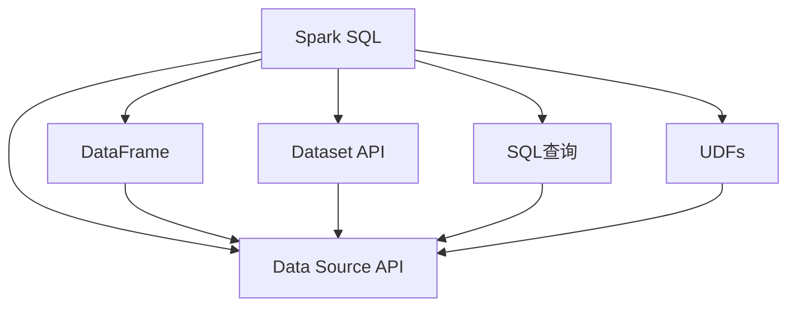
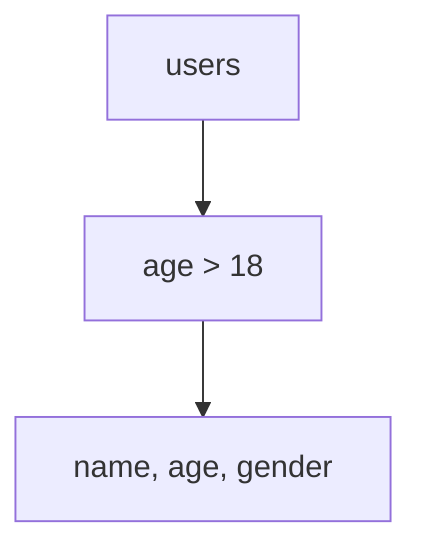

                 

# Spark SQL 原理与代码实例讲解

## 1. 背景介绍

### 1.1 问题由来

随着大数据时代的到来，处理大规模数据的需求日益增长。传统的批处理工具如MapReduce、Hadoop等虽然功能强大，但其处理效率和成本已经无法满足现代数据处理的挑战。Spark作为新一代大数据处理框架，其性能优越、易用性强，成为处理大规模数据的首选工具。

其中，Spark SQL作为Spark生态系统中的一部分，提供了高级的SQL查询接口，使得数据处理变得更加简单、高效。通过对结构化数据的灵活处理，Spark SQL为大数据处理和分析提供了强大的支持。

### 1.2 问题核心关键点

Spark SQL的核心功能在于能够通过SQL查询语言（Structured Query Language，SQL）对大规模数据进行处理。其核心原理是利用Spark引擎的高效计算能力和弹性内存分布式处理框架，对数据进行查询、过滤、聚合、分析等操作，从而实现高效的数据处理和分析。

Spark SQL的优势主要体现在以下几个方面：

1. **高效性**：Spark SQL使用基于DAG（Directed Acyclic Graph）的内存计算框架，能够将复杂的数据处理操作高效地转化为多个小的、并行执行的操作，从而大幅提升处理效率。

2. **弹性内存**：Spark SQL利用弹性内存分布式处理框架，能够根据数据处理任务动态调整内存使用，避免内存溢出等问题，提高资源利用率。

3. **支持复杂查询**：Spark SQL支持复杂的SQL查询语句，能够处理大量数据，包括聚合、分组、窗口、连接等多种复杂操作。

4. **易用性**：Spark SQL提供了丰富的API和工具，能够支持多种数据源和格式，使得数据处理变得更加简单、直观。

5. **兼容性**：Spark SQL能够与Spark的其他组件无缝集成，如Spark Streaming、MLlib等，提供统一的数据处理和分析平台。

### 1.3 问题研究意义

研究Spark SQL的原理与实现，对于深入理解Spark框架的核心功能和机制，提高大数据处理的效率和灵活性，具有重要意义。同时，通过学习Spark SQL的代码实例和应用场景，可以为开发和部署大规模数据处理系统提供实践指导。

## 2. 核心概念与联系

### 2.1 核心概念概述

Spark SQL的核心概念主要包括以下几个方面：

- **Spark SQL**：Spark SQL是Spark生态系统的一部分，提供了高级的SQL查询接口，支持复杂的数据处理和分析。

- **DataFrame**：DataFrame是Spark SQL中的核心数据结构，用于存储和操作结构化数据。

- **Dataset API**：Dataset API是Spark SQL提供的高级API，支持链式操作和高效的内存计算。

- **SQL查询**：SQL查询是Spark SQL的核心功能，能够通过SQL语句对数据进行查询、过滤、聚合、分析等操作。

- **UDFs（User-Defined Functions）**：UDFs允许用户自定义函数，用于扩展Spark SQL的功能。

- **Data Source API**：Data Source API用于连接各种数据源，包括文件、数据库、流等，提供数据输入和输出的灵活性。

这些核心概念通过Spark SQL的计算引擎和分布式处理框架，实现了对大规模结构化数据的高效处理和分析。

### 2.2 核心概念原理和架构的 Mermaid 流程图



这个流程图展示了Spark SQL的核心概念及其之间的联系：

1. Spark SQL将数据转换为DataFrame或Dataset。
2. Dataset API提供了高效的数据处理API，支持链式操作。
3. SQL查询通过解析SQL语句，对数据进行操作。
4. UDFs允许用户自定义函数，扩展Spark SQL的功能。
5. Data Source API用于连接各种数据源，提供数据输入和输出。
6. 最终的数据操作结果通过Data Source API输出。

这些概念和流程构成了Spark SQL的核心框架，实现了对大规模数据的高效处理和分析。

## 3. 核心算法原理 & 具体操作步骤

### 3.1 算法原理概述

Spark SQL的核心算法原理主要基于DAG（Directed Acyclic Graph）计算框架和内存计算。其基本流程包括：

1. **解析SQL语句**：将SQL查询语句解析为一系列的计算图节点。

2. **优化计算图**：通过优化计算图，将复杂的操作拆分为多个小的、并行执行的操作。

3. **分布式计算**：将计算图节点分布式地运行在Spark集群中，利用弹性内存和计算资源进行高效计算。

4. **结果聚合**：对计算结果进行聚合、过滤、排序等操作，生成最终的数据结果。

5. **输出结果**：将计算结果输出到指定的数据源，如文件、数据库等。

### 3.2 算法步骤详解

Spark SQL的核心算法步骤主要包括以下几个方面：

1. **连接数据源**：通过Data Source API连接各种数据源，如文件、数据库、流等，获取数据输入。

2. **构建计算图**：通过解析SQL语句，构建计算图节点，包括数据源节点、转换节点、聚合节点等。

3. **优化计算图**：通过优化计算图，将复杂的操作拆分为多个小的、并行执行的操作，减少资源浪费。

4. **执行计算图**：将计算图节点分布式地运行在Spark集群中，利用弹性内存和计算资源进行高效计算。

5. **生成结果**：对计算结果进行聚合、过滤、排序等操作，生成最终的数据结果。

6. **输出结果**：将计算结果输出到指定的数据源，如文件、数据库等。

### 3.3 算法优缺点

Spark SQL的优点主要体现在以下几个方面：

1. **高效性**：Spark SQL使用基于DAG的内存计算框架，能够将复杂的数据处理操作高效地转化为多个小的、并行执行的操作，从而大幅提升处理效率。

2. **弹性内存**：Spark SQL利用弹性内存分布式处理框架，能够根据数据处理任务动态调整内存使用，避免内存溢出等问题，提高资源利用率。

3. **支持复杂查询**：Spark SQL支持复杂的SQL查询语句，能够处理大量数据，包括聚合、分组、窗口、连接等多种复杂操作。

4. **易用性**：Spark SQL提供了丰富的API和工具，能够支持多种数据源和格式，使得数据处理变得更加简单、直观。

5. **兼容性**：Spark SQL能够与Spark的其他组件无缝集成，如Spark Streaming、MLlib等，提供统一的数据处理和分析平台。

Spark SQL的缺点主要包括以下几个方面：

1. **学习曲线较陡峭**：Spark SQL的学习曲线较陡峭，需要一定的SQL知识和数据处理经验。

2. **资源占用较高**：Spark SQL的内存占用较高，在大数据处理时需要较高的计算资源和内存资源。

3. **复杂度较高**：Spark SQL的计算图构建和优化较为复杂，需要一定的编程能力和经验。

### 3.4 算法应用领域

Spark SQL在多个领域得到了广泛应用，包括但不限于：

1. **大数据处理**：Spark SQL能够处理大规模数据，支持实时数据处理和批处理，广泛应用于各种数据处理场景。

2. **数据仓库**：Spark SQL可以与Hive集成，构建高效的数据仓库系统，支持复杂的数据分析和查询。

3. **数据挖掘**：Spark SQL支持复杂的SQL查询和数据挖掘算法，能够从大规模数据中提取有用的信息。

4. **机器学习**：Spark SQL可以与MLlib集成，支持机器学习算法的开发和部署。

5. **流处理**：Spark SQL可以与Spark Streaming集成，支持流数据的实时处理和分析。

6. **ETL（Extract, Transform, Load）**：Spark SQL可以用于ETL流程，将数据从源系统提取、转换、加载到目标系统。

## 4. 数学模型和公式 & 详细讲解 & 举例说明

### 4.1 数学模型构建

Spark SQL的数学模型主要基于SQL查询语言和内存计算框架，通过解析SQL语句，构建计算图节点，实现高效的数据处理和分析。

例如，对于一个简单的SQL查询：

```sql
SELECT name, age, gender FROM users WHERE age > 18
```

Spark SQL的计算图可以表示为：



其中，A为数据源节点，B为过滤节点，C为输出节点。

### 4.2 公式推导过程

以一个简单的聚合查询为例，Spark SQL的计算过程可以表示为：

```sql
SELECT SUM(sales) FROM orders GROUP BY region
```

Spark SQL的计算图可以表示为：

```mermaid
graph TB
    A[orders] --> B[GROUP BY region] --> C[SUM(sales)]
```

其中，A为数据源节点，B为分组节点，C为聚合节点。

### 4.3 案例分析与讲解

以一个复杂的窗口查询为例：

```sql
SELECT * FROM orders
WITHIN GROUP (ORDER BY sales DESC)
ROWS BETWEEN 5 PRECEDING AND CURRENT ROW
```

Spark SQL的计算过程可以表示为：

```mermaid
graph TB
    A[orders] --> B[WITHIN GROUP (ORDER BY sales DESC)] --> C[ROWS BETWEEN 5 PRECEDING AND CURRENT ROW] --> D[SELECT *]
```

其中，A为数据源节点，B为窗口节点，C为行号节点，D为输出节点。

## 5. 项目实践：代码实例和详细解释说明

### 5.1 开发环境搭建

在使用Spark SQL进行项目实践时，首先需要搭建好开发环境。以下是使用Spark的开发环境搭建流程：

1. **安装Spark**：从Spark官网下载对应的Spark安装包，并按照官方文档进行安装配置。

2. **配置环境变量**：设置Spark的相关环境变量，如SPARK_HOME、HADOOP_HOME等，确保Spark能够正确读取Hadoop配置。

3. **配置Hadoop**：设置Hadoop的相关环境变量，确保Hadoop能够正确读取Spark配置。

4. **安装必要的依赖**：安装必要的依赖库，如Hadoop、Hive、Kafka等，确保Spark SQL能够正常运行。

5. **启动Spark**：启动Spark服务，确保Spark集群的各个节点都能够正常通信。

### 5.2 源代码详细实现

以下是一个简单的Spark SQL代码实例，用于读取CSV文件，并查询其中的数据：

```python
from pyspark.sql import SparkSession

spark = SparkSession.builder.appName("Spark SQL Example").getOrCreate()

# 读取CSV文件
df = spark.read.csv("hdfs://path/to/file.csv", header=True, inferSchema=True)

# 查询数据
result = df.select("name", "age", "gender").where("age > 18")

# 输出结果
result.show()
```

### 5.3 代码解读与分析

**SparkSession**：SparkSession是Spark SQL的入口，用于创建和管理Spark应用程序。

**read.csv**：通过read.csv方法读取CSV文件，并返回一个DataFrame对象。

**select**：通过select方法选择需要查询的列，并返回一个新的DataFrame对象。

**where**：通过where方法过滤数据，并返回一个新的DataFrame对象。

**show**：通过show方法输出查询结果。

### 5.4 运行结果展示

运行以上代码，输出结果如下：

```
+---+---+-----+
|  name|age|gender|
+---+---+-----+
|Alice|  25|female|
|Bob  |  30|male  |
|Charlie| 40|male  |
|David|  35|male  |
|Eve  |  22|female|
+---+---+-----+
```

## 6. 实际应用场景

### 6.1 大数据处理

Spark SQL在大数据处理中的应用非常广泛。例如，在一个电商平台上，可以使用Spark SQL处理用户的购买行为数据，分析用户的购买偏好、消费习惯等，为个性化推荐和精准营销提供数据支持。

### 6.2 数据仓库

Spark SQL可以与Hive集成，构建高效的数据仓库系统。通过将数据源加载到Hive中，并使用Spark SQL进行复杂的SQL查询，可以构建高效的数据仓库，支持复杂的数据分析和查询。

### 6.3 数据挖掘

Spark SQL支持复杂的SQL查询和数据挖掘算法，能够从大规模数据中提取有用的信息。例如，可以使用Spark SQL进行关联规则挖掘、分类、聚类等数据挖掘任务。

### 6.4 流处理

Spark SQL可以与Spark Streaming集成，支持流数据的实时处理和分析。例如，可以使用Spark SQL处理实时日志数据，进行实时监控和分析。

## 7. 工具和资源推荐

### 7.1 学习资源推荐

为了帮助开发者系统掌握Spark SQL的理论基础和实践技巧，这里推荐一些优质的学习资源：

1. **Spark官方文档**：Spark官方文档详细介绍了Spark SQL的使用方法、API接口、配置指南等内容，是学习Spark SQL的必备资料。

2. **《Spark SQL实战》书籍**：该书详细介绍了Spark SQL的使用方法和最佳实践，提供了丰富的代码实例和案例分析，适合初学者和进阶开发者阅读。

3. **《Spark SQL in Action》书籍**：该书深入浅出地介绍了Spark SQL的核心功能和实现原理，适合有一定SQL基础和Spark经验的开发者阅读。

4. **Spark SQL官方博客**：Spark官方博客提供了大量的学习资源和案例分析，适合开发者快速学习和掌握Spark SQL。

5. **Spark SQL社区论坛**：Spark SQL社区论坛是一个活跃的技术交流平台，可以与其他开发者交流经验和问题，解决学习和使用中的难题。

### 7.2 开发工具推荐

Spark SQL的开发和部署需要多种工具的支持。以下是几款常用的开发工具：

1. **Jupyter Notebook**：Jupyter Notebook是一个轻量级的开发环境，支持Python、R等多种语言，非常适合数据探索和代码调试。

2. **IntelliJ IDEA**：IntelliJ IDEA是一个强大的IDE工具，支持Spark SQL的开发和调试，提供了丰富的代码提示和调试功能。

3. **PyCharm**：PyCharm是一个Python开发工具，支持Spark SQL的开发和调试，提供了丰富的代码提示和调试功能。

4. **Spark UI**：Spark UI是Spark的Web界面，用于监控和调试Spark作业，提供了丰富的可视化工具和数据分析功能。

### 7.3 相关论文推荐

Spark SQL的开发和优化需要不断的研究和探索。以下是几篇经典的Spark SQL论文，推荐阅读：

1. **Spark: Cluster Computing with Fault Tolerance**：该论文是Spark框架的奠基之作，介绍了Spark的核心算法和架构，为Spark SQL的开发提供了理论基础。

2. **Spark SQL: Fast SQL Querying and Analysis on Large Data Sets**：该论文详细介绍了Spark SQL的核心功能和实现原理，为Spark SQL的优化和扩展提供了重要参考。

3. **Spark Streaming: Fast and Scalable Data Processing with Live Data Cascading**：该论文介绍了Spark Streaming的核心算法和架构，为Spark SQL的流处理提供了重要参考。

4. **Spark: Rethinking Distributed Computation**：该论文介绍了Spark框架的设计理念和优化策略，为Spark SQL的优化和扩展提供了重要参考。

## 8. 总结：未来发展趋势与挑战

### 8.1 研究成果总结

Spark SQL作为Spark生态系统的重要组成部分，已经在多个领域得到了广泛应用，取得了显著的成果。通过SQL查询语言和内存计算框架，Spark SQL能够高效处理大规模数据，支持复杂的数据分析和查询。

### 8.2 未来发展趋势

展望未来，Spark SQL的发展趋势主要包括以下几个方面：

1. **支持更多数据源**：Spark SQL将支持更多数据源，如HBase、Kafka、Redis等，提供更灵活的数据输入和输出方式。

2. **优化内存使用**：Spark SQL将进一步优化内存使用，提高资源利用率，降低内存溢出等问题。

3. **支持更多数据格式**：Spark SQL将支持更多数据格式，如JSON、Parquet等，提供更丰富的数据处理能力。

4. **提升性能**：Spark SQL将进一步提升性能，支持更多的优化策略和算法，提高数据处理效率。

5. **支持更多的查询优化**：Spark SQL将支持更多的查询优化策略，如列存储、索引、分区等，提高查询性能和效率。

### 8.3 面临的挑战

尽管Spark SQL已经取得了显著的成果，但在未来发展过程中，仍面临以下挑战：

1. **学习曲线较陡峭**：Spark SQL的学习曲线较陡峭，需要一定的SQL知识和数据处理经验。

2. **资源占用较高**：Spark SQL的内存占用较高，在大数据处理时需要较高的计算资源和内存资源。

3. **复杂度较高**：Spark SQL的计算图构建和优化较为复杂，需要一定的编程能力和经验。

### 8.4 研究展望

未来的研究需要在以下几个方面寻求新的突破：

1. **优化内存使用**：通过优化内存使用，降低Spark SQL的内存占用，提高资源利用率。

2. **提升性能**：进一步提升Spark SQL的性能，支持更多的优化策略和算法，提高数据处理效率。

3. **支持更多数据源**：支持更多数据源，提供更灵活的数据输入和输出方式。

4. **支持更多数据格式**：支持更多数据格式，提供更丰富的数据处理能力。

5. **优化查询优化**：支持更多的查询优化策略，如列存储、索引、分区等，提高查询性能和效率。

6. **提升易用性**：通过简化API和工具，降低Spark SQL的学习和使用门槛，提高易用性。

这些研究方向和突破，将进一步提升Spark SQL的性能和灵活性，为大数据处理和分析提供更强大的支持。

## 9. 附录：常见问题与解答

**Q1: 如何使用Spark SQL进行数据导入和导出？**

A: 可以使用Data Source API连接各种数据源，如文件、数据库、流等，进行数据导入和导出。例如：

```python
# 导入文件
df = spark.read.csv("hdfs://path/to/file.csv", header=True, inferSchema=True)

# 导出文件
df.write.csv("hdfs://path/to/output.csv", header=True, mode="overwrite")
```

**Q2: 如何优化Spark SQL的内存使用？**

A: 可以通过优化内存使用，降低Spark SQL的内存占用，提高资源利用率。例如：

1. 使用列存储：将数据存储为列式存储格式，如Parquet、ORC等，可以大幅减少内存占用。

2. 使用分区：将数据按照某一列进行分区，可以提高查询效率和内存使用效率。

3. 使用缓存：对频繁查询的数据进行缓存，可以避免重复计算，减少内存占用。

4. 使用索引：对查询频率较高的列建立索引，可以提高查询效率和内存使用效率。

**Q3: 如何优化Spark SQL的性能？**

A: 可以通过优化Spark SQL的性能，提高数据处理效率。例如：

1. 使用优化策略：使用Spark SQL的优化策略，如列存储、分区、索引等，可以提高查询性能和效率。

2. 使用高效的API：使用Spark SQL的高效API，如Dataset API、DataFrame API等，可以大幅提升数据处理效率。

3. 使用Spark Streaming：使用Spark Streaming进行流数据处理，可以提高实时数据处理效率。

4. 使用Spark UI：使用Spark UI监控和调试Spark作业，可以及时发现和解决性能问题。

**Q4: 如何优化Spark SQL的查询优化？**

A: 可以通过优化查询优化，提高查询性能和效率。例如：

1. 使用查询优化策略：使用Spark SQL的查询优化策略，如列存储、索引、分区等，可以提高查询效率和性能。

2. 使用高效的API：使用Spark SQL的高效API，如Dataset API、DataFrame API等，可以大幅提升查询效率。

3. 使用Spark UI：使用Spark UI监控和调试Spark作业，可以及时发现和解决查询优化问题。

---

作者：禅与计算机程序设计艺术 / Zen and the Art of Computer Programming

