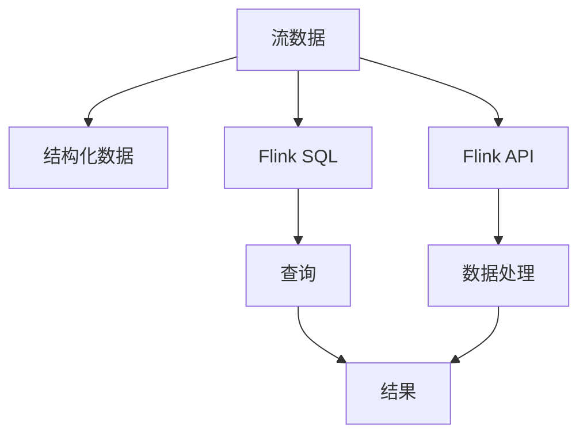

                 

# Structured Streaming原理与代码实例讲解

> 关键词：Structured Streaming, Apache Kafka, Apache Flink, Stream Processing, Structured Data

## 1. 背景介绍

### 1.1 问题由来
随着数据产生速度的爆炸性增长，流处理成为了大数据处理的新兴领域。流处理系统需要处理大规模数据流，并能够实时响应查询，这对于传统批处理系统而言是一个挑战。在流处理领域，Apache Kafka和Apache Flink是两个非常流行的开源框架，它们能够处理大规模的流数据，提供低延迟和高吞吐量的数据处理能力。

Structured Streaming（结构化流处理）是Apache Flink提供的一种流处理模式，它允许用户对结构化数据进行实时处理，可以方便地使用SQL查询和数据处理API进行实时分析。Structured Streaming是Flink流处理的核心组件，它的出现极大地简化了流数据处理的技术栈，使得开发人员可以更容易地处理实时流数据。

### 1.2 问题核心关键点
Structured Streaming的核心思想是将流数据转化为结构化数据流，并允许用户使用SQL或Flink API对这些数据流进行实时分析。其关键点在于：

1. **结构化数据流**：流数据经过结构化转换后，变成易于处理的格式，可以方便地进行查询和分析。
2. **实时分析**：流数据可以实时输入和输出，使得实时分析成为可能。
3. **SQL查询**：允许用户使用SQL查询对结构化流数据进行实时分析。
4. **数据处理API**：提供了Flink API，使得流数据的处理和分析更加灵活。
5. **高吞吐量和低延迟**：处理大规模数据流时，Structured Streaming能够提供高吞吐量和低延迟。

## 2. 核心概念与联系

### 2.1 核心概念概述

Structured Streaming的核心概念包括以下几个方面：

- **流数据**：指连续的数据序列，可以是事件、日志、消息等。
- **结构化数据**：指具有固定结构和类型的数据，如JSON、XML等。
- **Flink SQL**：Flink提供的SQL API，用于对结构化流数据进行查询和分析。
- **Flink API**：Flink提供的流处理API，用于编写自定义的数据处理逻辑。
- **数据源**：流数据的来源，如Kafka、Socket、HDFS等。
- **数据流**：流数据的处理管道，包括数据转换、过滤、聚合等操作。

这些概念之间的联系可以通过以下Mermaid流程图来展示：



这个流程图展示ized Structured Streaming的核心概念及其之间的逻辑关系：

1. 流数据通过结构化转换，变成易于处理的格式。
2. 结构化数据可以使用SQL进行查询。
3. 流数据可以使用Flink API进行自定义处理。
4. 处理后的数据生成结果，可以被进一步使用。

## 3. 核心算法原理 & 具体操作步骤
### 3.1 算法原理概述

Structured Streaming的算法原理主要包括以下几个方面：

- **数据转换**：将原始的流数据转换为结构化数据，使其适合实时处理。
- **流处理**：对结构化流数据进行实时分析，包括查询、过滤、聚合等操作。
- **状态管理**：在流处理过程中，管理状态和窗口，保证数据的一致性和完整性。
- **容错机制**：提供容错机制，确保数据处理的可靠性和稳定性。

### 3.2 算法步骤详解

Structured Streaming的主要算法步骤如下：

1. **数据源接入**：将流数据从数据源接入到Flink系统。
2. **结构化转换**：将原始的流数据转换为结构化数据流。
3. **流处理**：对结构化数据流进行实时处理，包括查询、过滤、聚合等操作。
4. **结果生成**：将处理后的结果输出，可以进一步进行处理或存储。
5. **状态管理**：在流处理过程中，管理状态和窗口，保证数据的一致性和完整性。
6. **容错机制**：提供容错机制，确保数据处理的可靠性和稳定性。

### 3.3 算法优缺点

Structured Streaming具有以下优点：

- **易于使用**：Structured Streaming提供了SQL查询和Flink API，使得流数据处理变得更加简单。
- **高性能**：Structured Streaming能够处理大规模数据流，提供高吞吐量和低延迟。
- **灵活性**：使用Flink API，可以实现非常灵活的数据处理逻辑。

同时，Structured Streaming也存在以下缺点：

- **复杂性**：对于复杂的流数据处理逻辑，可能需要编写自定义的Flink API。
- **学习曲线**：对于初学者，学习Structured Streaming可能需要一定的时间。
- **资源消耗**：处理大规模数据流时，可能需要大量的计算资源。

### 3.4 算法应用领域

Structured Streaming可以应用于多个领域，如：

- **实时数据分析**：对实时流数据进行实时分析和可视化。
- **实时广告**：处理和分析广告点击流数据。
- **实时推荐系统**：处理和分析用户行为数据，提供个性化推荐。
- **实时监控**：处理和分析系统日志数据，进行实时监控和报警。
- **实时交易处理**：处理和分析金融交易数据，进行实时分析和风险控制。

## 4. 数学模型和公式 & 详细讲解 & 举例说明

### 4.1 数学模型构建

Structured Streaming的数学模型可以表示为：

$$
\text{Structured Streaming} = \text{Data Source} \rightarrow \text{Structured Conversion} \rightarrow \text{Flink SQL / API} \rightarrow \text{Stream Processing} \rightarrow \text{Result Generation}
$$

### 4.2 公式推导过程

在Structured Streaming中，数据处理的过程可以表示为：

$$
\text{Data Source} \rightarrow \text{Transform} \rightarrow \text{Stream Processing} \rightarrow \text{Result Generation}
$$

其中，$\text{Transform}$表示数据转换过程，$\text{Stream Processing}$表示流处理过程，$\text{Result Generation}$表示结果生成过程。在流处理过程中，可以添加状态和窗口，保证数据的一致性和完整性。

### 4.3 案例分析与讲解

以下是一个Structured Streaming的示例，展示如何将实时流数据转换为结构化数据流，并进行实时查询：

```java
env.setStreamTimeCharacteristic(TimeCharacteristic.EventTime);

// 接入Kafka数据源
DataStream<String> kafkaStream = env.addSource(new FlinkKafkaConsumer<String>("my-topic", new SimpleStringSchema(), props));

// 结构化转换
DataStream<MyEvent> eventStream = kafkaStream.map(new MapFunction<String, MyEvent>() {
    @Override
    public MyEvent map(String value) throws Exception {
        return JSONParser.parse(value, MyEvent.class);
    }
});

// 查询
DataStream<MyEvent> queryStream = eventStream
    .keyBy("id")
    .window(TumblingEventTimeWindows.of(Time.seconds(10)))
    .reduce(new ReduceFunction<MyEvent>() {
        @Override
        public MyEvent reduce(MyEvent value1, MyEvent value2) throws Exception {
            return value1.mergeWith(value2);
        }
});

// 结果生成
queryStream.print();
```

在这个示例中，首先接入Kafka数据源，然后通过MapFunction将字符串转换为MyEvent对象，接着使用窗口聚合进行实时查询，最后生成结果进行打印。

## 5. 项目实践：代码实例和详细解释说明

### 5.1 开发环境搭建

要使用Structured Streaming进行开发，需要安装Apache Flink和Apache Kafka。安装过程如下：

1. 安装Apache Kafka：可以从官网下载Kafka安装包，解压后运行bin目录下的启动脚本，启动Kafka服务。
2. 安装Apache Flink：可以从官网下载Flink安装包，解压后运行bin目录下的启动脚本，启动Flink服务。

### 5.2 源代码详细实现

以下是一个使用Structured Streaming进行实时数据分析的Java代码示例：

```java
env.setStreamTimeCharacteristic(TimeCharacteristic.EventTime);

// 接入Kafka数据源
DataStream<String> kafkaStream = env.addSource(new FlinkKafkaConsumer<String>("my-topic", new SimpleStringSchema(), props));

// 结构化转换
DataStream<MyEvent> eventStream = kafkaStream.map(new MapFunction<String, MyEvent>() {
    @Override
    public MyEvent map(String value) throws Exception {
        return JSONParser.parse(value, MyEvent.class);
    }
});

// 查询
DataStream<MyEvent> queryStream = eventStream
    .keyBy("id")
    .window(TumblingEventTimeWindows.of(Time.seconds(10)))
    .reduce(new ReduceFunction<MyEvent>() {
        @Override
        public MyEvent reduce(MyEvent value1, MyEvent value2) throws Exception {
            return value1.mergeWith(value2);
        }
});

// 结果生成
queryStream.print();
```

### 5.3 代码解读与分析

这段代码的主要功能是将实时流数据进行结构化转换，并进行窗口聚合查询。具体分析如下：

- `env.setStreamTimeCharacteristic(TimeCharacteristic.EventTime);`：设置时间特性为EventTime，确保数据处理的时间戳准确性。
- `DataStream<String> kafkaStream = env.addSource(new FlinkKafkaConsumer<String>("my-topic", new SimpleStringSchema(), props));`：接入Kafka数据源，将Kafka消息转换为Flink Stream。
- `DataStream<MyEvent> eventStream = kafkaStream.map(new MapFunction<String, MyEvent>() { ... });`：通过MapFunction将字符串转换为MyEvent对象。
- `DataStream<MyEvent> queryStream = eventStream.keyBy("id").window(TumblingEventTimeWindows.of(Time.seconds(10))).reduce(new ReduceFunction<MyEvent>() { ... });`：使用keyBy和窗口聚合对MyEvent对象进行查询，并使用reduce方法进行聚合。
- `queryStream.print();`：将查询结果打印输出。

## 6. 实际应用场景

### 6.1 实时数据分析

Structured Streaming可以用于实时数据分析，如实时监控系统、实时日志分析等。以下是示例代码：

```java
env.setStreamTimeCharacteristic(TimeCharacteristic.EventTime);

// 接入Kafka数据源
DataStream<String> kafkaStream = env.addSource(new FlinkKafkaConsumer<String>("my-topic", new SimpleStringSchema(), props));

// 结构化转换
DataStream<MyEvent> eventStream = kafkaStream.map(new MapFunction<String, MyEvent>() {
    @Override
    public MyEvent map(String value) throws Exception {
        return JSONParser.parse(value, MyEvent.class);
    }
});

// 查询
DataStream<MyEvent> queryStream = eventStream
    .keyBy("id")
    .window(TumblingEventTimeWindows.of(Time.seconds(10)))
    .reduce(new ReduceFunction<MyEvent>() {
        @Override
        public MyEvent reduce(MyEvent value1, MyEvent value2) throws Exception {
            return value1.mergeWith(value2);
        }
});

// 结果生成
queryStream.print();
```

### 6.2 实时广告

Structured Streaming可以用于实时广告数据的处理和分析，如实时点击流数据。以下是示例代码：

```java
env.setStreamTimeCharacteristic(TimeCharacteristic.EventTime);

// 接入Kafka数据源
DataStream<String> kafkaStream = env.addSource(new FlinkKafkaConsumer<String>("my-topic", new SimpleStringSchema(), props));

// 结构化转换
DataStream<AdEvent> adStream = kafkaStream.map(new MapFunction<String, AdEvent>() {
    @Override
    public AdEvent map(String value) throws Exception {
        return JSONParser.parse(value, AdEvent.class);
    }
});

// 查询
DataStream<AdEvent> queryStream = adStream
    .keyBy("id")
    .window(TumblingEventTimeWindows.of(Time.seconds(10)))
    .reduce(new ReduceFunction<AdEvent>() {
        @Override
        public AdEvent reduce(AdEvent value1, AdEvent value2) throws Exception {
            return value1.mergeWith(value2);
        }
});

// 结果生成
queryStream.print();
```

### 6.3 实时推荐系统

Structured Streaming可以用于实时推荐系统的数据处理和分析，如实时用户行为数据。以下是示例代码：

```java
env.setStreamTimeCharacteristic(TimeCharacteristic.EventTime);

// 接入Kafka数据源
DataStream<String> kafkaStream = env.addSource(new FlinkKafkaConsumer<String>("my-topic", new SimpleStringSchema(), props));

// 结构化转换
DataStream<UserEvent> userStream = kafkaStream.map(new MapFunction<String, UserEvent>() {
    @Override
    public UserEvent map(String value) throws Exception {
        return JSONParser.parse(value, UserEvent.class);
    }
});

// 查询
DataStream<UserEvent> queryStream = userStream
    .keyBy("id")
    .window(TumblingEventTimeWindows.of(Time.seconds(10)))
    .reduce(new ReduceFunction<UserEvent>() {
        @Override
        public UserEvent reduce(UserEvent value1, UserEvent value2) throws Exception {
            return value1.mergeWith(value2);
        }
});

// 结果生成
queryStream.print();
```

### 6.4 未来应用展望

随着大数据和人工智能技术的不断进步，Structured Streaming将会在更多领域得到应用，如智能医疗、智能交通、智能制造等。Structured Streaming的高性能和灵活性，将使得实时数据分析和处理变得更加简单和高效。

## 7. 工具和资源推荐

### 7.1 学习资源推荐

1. Apache Flink官方文档：详细介绍了Flink的基本概念、流处理API和Structured Streaming。
2. Structured Streaming教程：提供了大量的代码示例和文档，帮助开发者快速上手。
3. Apache Kafka官方文档：详细介绍了Kafka的基本概念、数据模型和流数据处理。
4. Kafka与Flink集成教程：提供了Kafka和Flink集成的详细示例。
5. Structured Streaming案例：展示了Structured Streaming在实时数据分析、广告处理、推荐系统等多个领域的实际应用。

### 7.2 开发工具推荐

1. Apache Flink：Apache Flink是一个高性能的流处理框架，提供了丰富的API和功能。
2. Apache Kafka：Apache Kafka是一个高吞吐量的分布式消息系统，支持流数据的接入和输出。
3. PyFlink：PyFlink是Flink的Python API，可以方便地在Python中使用Flink的流处理功能。
4. Apache Beam：Apache Beam是一个开源的统一编程模型，可以跨平台、跨语言进行流处理。
5. Scala语言：Scala是Flink的推荐语言，具有强大的并发处理能力和简洁的语法。

### 7.3 相关论文推荐

1. "Structured Streaming: Towards Generalized Real-time Data Processing"：介绍Structured Streaming的设计理念和基本架构。
2. "Real-time Data Processing with Apache Flink"：介绍Flink的基本概念和流处理API。
3. "Kafka Streams: Apache Kafka-Based Micro-Batching Stream Processing"：介绍Kafka Streams的基本概念和流数据处理。
4. "Efficient Distributed Stream Processing with Apache Beam"：介绍Beam的基本概念和分布式流处理。

## 8. 总结：未来发展趋势与挑战

### 8.1 总结

Structured Streaming作为Apache Flink的一个核心组件，为流数据处理提供了更加简单和高效的方式。通过结构化数据转换和流处理，Structured Streaming能够实现实时数据分析和处理，并支持SQL查询和自定义API。Structured Streaming的高性能和灵活性，使得它在实时数据分析、广告处理、推荐系统等多个领域得到了广泛应用。

### 8.2 未来发展趋势

Structured Streaming的未来发展趋势包括：

1. **性能优化**：Structured Streaming将进一步优化性能，支持更大规模的数据流处理。
2. **新API和功能**：Structured Streaming将引入新的API和功能，支持更多的数据源和数据转换方式。
3. **与大数据生态融合**：Structured Streaming将进一步与大数据生态融合，支持更多的大数据处理组件。
4. **跨平台和跨语言支持**：Structured Streaming将支持更多平台和语言，如Python、Scala、Java等。
5. **数据可视化**：Structured Streaming将提供更好的数据可视化工具，支持更丰富的数据展示。

### 8.3 面临的挑战

Structured Streaming虽然已经取得了很大的进展，但在发展过程中也面临以下挑战：

1. **数据模型设计**：对于复杂的流数据模型，需要进行合理的设计和抽象，才能有效地进行流处理。
2. **数据一致性**：在处理大规模数据流时，需要保证数据的一致性和完整性，防止数据丢失和重复。
3. **状态管理**：在流处理过程中，需要合理地管理状态和窗口，保证数据的准确性和实时性。
4. **容错机制**：需要提供可靠的容错机制，确保数据处理的稳定性和可靠性。
5. **资源优化**：需要合理地优化资源，提高流处理的效率和性能。

### 8.4 研究展望

Structured Streaming的研究方向包括：

1. **数据模型优化**：进一步优化数据模型设计，支持更复杂和多样化的流数据处理。
2. **新算法的引入**：引入新的算法和数据结构，提高流处理的效率和性能。
3. **跨平台和跨语言支持**：支持更多平台和语言，使得Structured Streaming更易于使用和部署。
4. **数据可视化**：提供更好的数据可视化工具，支持更丰富的数据展示和分析。
5. **实时流处理**：支持更多的实时流处理场景，如实时推荐、实时监控等。

## 9. 附录：常见问题与解答

**Q1：Structured Streaming和传统的流处理有什么区别？**

A: Structured Streaming提供了更加简单和高效的数据处理方式，支持SQL查询和自定义API，使得流数据处理变得更加简单和灵活。传统的流处理需要编写复杂的API，并且数据处理方式比较繁琐。

**Q2：Structured Streaming的性能如何？**

A: Structured Streaming在处理大规模数据流时，可以提供高吞吐量和低延迟，支持亿级流数据处理。但是，对于非常复杂和高度异构的数据流，Structured Streaming的性能可能受到一定的影响。

**Q3：Structured Streaming的适用场景有哪些？**

A: Structured Streaming适用于实时数据分析、广告处理、推荐系统、实时监控等场景。对于一些简单的数据处理场景，Structured Streaming也可以很方便地实现。

**Q4：Structured Streaming的学习曲线如何？**

A: Structured Streaming的学习曲线相对较陡峭，需要有一定的流处理经验和SQL基础。但是，一旦掌握了Structured Streaming的基本概念和API，处理复杂的数据流将会变得更加简单和高效。

**Q5：Structured Streaming的资源消耗如何？**

A: Structured Streaming在处理大规模数据流时，需要消耗大量的计算资源和内存。因此，在使用Structured Streaming时，需要合理地优化资源，确保系统的高性能和高可用性。

