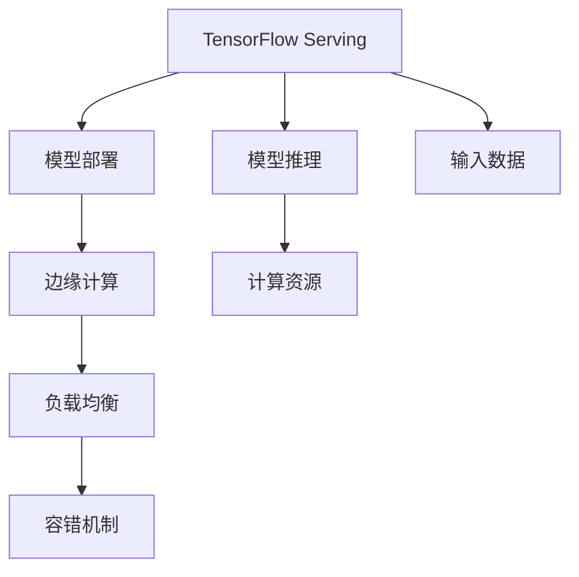

                 

# TensorFlow Serving性能优化

> 关键词：TensorFlow Serving, 高性能服务, 模型部署, 边缘计算, 性能调优, 内存管理, 负载均衡

## 1. 背景介绍

### 1.1 问题由来
随着深度学习技术的发展，模型规模和复杂度不断提升，训练时间越来越长，计算资源需求也越来越高。大规模模型在大规模数据上的推理，需要高效的模型部署平台来支持。TensorFlow Serving作为谷歌开源的模型服务框架，提供了在云和边缘环境中高效部署和推理TensorFlow模型的能力。

然而，在实际应用中，由于模型规模大、输入数据多样、服务负载不均等因素，TensorFlow Serving的性能瓶颈逐渐显现。为了提升模型服务性能，需要对TensorFlow Serving进行全面优化，以提高模型的响应速度和吞吐量。

### 1.2 问题核心关键点
TensorFlow Serving性能优化涉及多个方面，包括但不限于：
1. 模型的输入数据处理和缓存机制。
2. 模型推理速度的提升。
3. 服务器的内存管理和计算资源优化。
4. 服务的负载均衡和容错机制。

本文将从模型输入处理、推理速度优化、内存管理、负载均衡等多个角度，探讨如何系统性地对TensorFlow Serving进行性能优化。

## 2. 核心概念与联系

### 2.1 核心概念概述

为了更好地理解TensorFlow Serving的性能优化，本节将介绍几个密切相关的核心概念：

- TensorFlow Serving：谷歌开源的模型服务框架，支持在云和边缘环境中高效部署和推理TensorFlow模型。
- 模型推理：将输入数据输入模型，通过计算得到模型输出的过程。
- 模型部署：将训练好的模型封装成服务，部署到计算集群中，供客户端调用。
- 边缘计算：将计算任务分布式部署在多个物理节点上，减少计算延迟，提高模型服务效率。
- 负载均衡：通过分布式调度，合理分配计算资源，保证模型服务的稳定性和可扩展性。
- 容错机制：设计故障转移和故障恢复策略，保证模型服务的可靠性和持续可用性。

这些核心概念之间的逻辑关系可以通过以下Mermaid流程图来展示：



这个流程图展示了这个系统的主要组成部分及其相互关系：

1. TensorFlow Serving作为平台，负责模型推理、模型部署、边缘计算、负载均衡和容错机制。
2. 模型推理是TensorFlow Serving的核心功能，用于将输入数据输入模型，并返回计算结果。
3. 模型部署是将训练好的模型封装成服务，部署到计算集群中。
4. 边缘计算是将计算任务分布式部署在多个物理节点上，减少计算延迟，提高模型服务效率。
5. 负载均衡通过分布式调度，合理分配计算资源，保证模型服务的稳定性和可扩展性。
6. 容错机制设计故障转移和故障恢复策略，保证模型服务的可靠性和持续可用性。

这些核心概念共同构成了TensorFlow Serving的系统框架，是性能优化的基础。通过理解这些核心概念，我们可以更好地把握TensorFlow Serving的优化方向。

## 3. 核心算法原理 & 具体操作步骤
### 3.1 算法原理概述

TensorFlow Serving的性能优化，本质上是一个多维度、系统性的优化过程。其核心思想是：通过系统性地优化模型的输入处理、推理速度、内存管理和负载均衡，使得模型服务能够高效地应对高并发、大流量、复杂多变的计算需求。

形式化地，假设模型为 $M(x)$，输入数据为 $x$，目标是为模型服务系统设计一套优化方案，使得在满足负载均衡和容错机制的前提下，系统能够最大化响应速度和吞吐量。

具体而言，优化方案可以包括以下几个关键步骤：

1. 输入数据预处理和缓存。
2. 推理速度提升和模型优化。
3. 内存管理和计算资源优化。
4. 负载均衡和容错机制设计。

通过以上步骤，可以在不同维度上对TensorFlow Serving进行全面优化，从而提升模型服务的性能。

### 3.2 算法步骤详解

TensorFlow Serving的性能优化可以分为以下几个关键步骤：

**Step 1: 输入数据预处理和缓存**
- 收集输入数据的分布和特征，设计合适的输入格式。
- 对输入数据进行归一化、编码等预处理，减少计算资源消耗。
- 设计高效的数据缓存机制，如使用LRU缓存、分布式缓存等，减少数据的读取次数。

**Step 2: 推理速度提升和模型优化**
- 分析模型的计算图，识别性能瓶颈，优化计算图结构。
- 应用模型剪枝、量化、混合精度等技术，减少模型参数量和计算资源需求。
- 使用模型并行、批处理、异步计算等技术，提高模型推理效率。

**Step 3: 内存管理和计算资源优化**
- 对模型和数据的内存占用进行详细分析，优化内存分配策略。
- 应用混合精度计算、模型压缩等技术，减少内存占用。
- 设计合理的资源调度策略，均衡计算负载，避免资源浪费。

**Step 4: 负载均衡和容错机制设计**
- 设计多节点负载均衡策略，如轮询、随机选择、最少连接等，均匀分配计算负载。
- 引入分布式锁和消息队列等机制，保证模型服务的可靠性和稳定性。
- 设计容错机制，如自动重试、故障转移、日志记录等，确保系统的高可用性。

### 3.3 算法优缺点

TensorFlow Serving的性能优化方法具有以下优点：
1. 系统性。从输入处理、推理速度、内存管理、负载均衡等多个维度进行优化，全面提升系统性能。
2. 模块化。各优化模块可以独立实现，根据具体场景灵活组合，易于维护和扩展。
3. 可复用。优化方法可以复用到其他高性能服务框架，提升模型部署效率。

同时，该方法也存在一定的局限性：
1. 对硬件要求高。优化过程中需要高性能的计算集群和存储资源，对硬件设备有较高要求。
2. 优化难度大。优化方案需要结合具体应用场景，进行复杂的系统调参和实验验证。
3. 依赖技术深度。需要深度掌握TensorFlow Serving的技术细节，才能进行有效的性能优化。

尽管存在这些局限性，但就目前而言，TensorFlow Serving的性能优化方法仍然是高效模型服务的重要手段。未来相关研究的重点在于如何进一步降低优化难度，提高优化效果，并开发出更加灵活、易用的优化工具。

### 3.4 算法应用领域

TensorFlow Serving的性能优化方法，在以下几个领域有着广泛的应用：

- 工业互联网：工业生产中的复杂模型推理，需要高效、可靠的服务支持。
- 智能医疗：医院中的医学影像分析和诊断系统，对模型服务的实时性和稳定性要求高。
- 智慧交通：交通监控和智能导航系统，需要快速响应大量实时数据。
- 金融科技：金融市场中的高频交易和风险分析，对模型服务的计算速度和准确性有高要求。
- 社交媒体：社交平台中的文本分析和情感分析系统，需要处理海量用户生成内容。

这些领域的应用场景，使得TensorFlow Serving的性能优化具有重要的实际意义。通过性能优化，这些系统的模型服务能够更快地响应请求，提高计算效率，降低运行成本，从而提升用户体验和系统价值。

## 4. 数学模型和公式 & 详细讲解  
### 4.1 数学模型构建

本节将使用数学语言对TensorFlow Serving的性能优化过程进行更加严格的刻画。

假设模型为 $M(x)$，输入数据为 $x$，服务负载为 $L$，响应时间为 $t$，系统吞吐量为 $P$。优化目标为最大化系统吞吐量 $P$，即：

$$
\max P = \frac{L}{t}
$$

其中 $L$ 为单位时间内系统接收的请求数，$t$ 为单位时间内系统的响应时间。

通过优化输入数据预处理、推理速度、内存管理和负载均衡等模块，可以进一步降低系统响应时间 $t$，从而提高系统吞吐量 $P$。

### 4.2 公式推导过程

以模型推理速度提升为例，我们分析推理速度 $t$ 的影响因素：

1. 输入数据的大小 $d$。输入数据越大，计算量越大，推理速度越慢。
2. 模型参数量 $p$。模型参数量越多，计算复杂度越高，推理速度越慢。
3. 计算资源分配 $c$。计算资源分配不均，容易导致性能瓶颈，推理速度变慢。
4. 推理硬件设施 $h$。硬件设施越强，计算速度越快，推理速度越快。

推理速度 $t$ 可以表示为：

$$
t = f(d, p, c, h)
$$

其中 $f$ 为计算模型，描述了输入数据大小、模型参数量、计算资源分配和硬件设施对推理速度的影响。

为了提升推理速度，需要优化上述四个因素。假设优化后的输入数据大小为 $d'$，模型参数量为 $p'$，计算资源分配为 $c'$，硬件设施为 $h'$，则推理速度可以表示为：

$$
t' = f(d', p', c', h')
$$

由于 $t' < t$，因此系统吞吐量 $P'$ 可以表示为：

$$
P' = \frac{L}{t'}
$$

经过优化后，系统吞吐量 $P'$ 大于优化前 $P$。

### 4.3 案例分析与讲解

以智能医疗中的医学影像分析为例，分析如何通过性能优化提升模型服务效率。

假设医学影像分析模型为 $M$，输入数据为 $x$，包含 $d$ 个像素点。假设原始模型参数量为 $p$，优化后的模型参数量为 $p'$，优化前后的推理速度分别为 $t$ 和 $t'$。

**优化前**：
- 输入数据大小为 $d$。
- 模型参数量为 $p$。
- 计算资源分配为 $c$。
- 硬件设施为 $h$。

**优化后**：
- 输入数据大小优化为 $d'$。
- 模型参数量优化为 $p'$。
- 计算资源分配优化为 $c'$。
- 硬件设施优化为 $h'$。

经过优化后，推理速度变为 $t'$，系统吞吐量变为 $P'$。

## 5. 项目实践：代码实例和详细解释说明
### 5.1 开发环境搭建

在进行性能优化实践前，我们需要准备好开发环境。以下是使用Python进行TensorFlow Serving开发的环境配置流程：

1. 安装Anaconda：从官网下载并安装Anaconda，用于创建独立的Python环境。

2. 创建并激活虚拟环境：
```bash
conda create -n tensorflow-env python=3.8 
conda activate tensorflow-env
```

3. 安装TensorFlow Serving：根据CUDA版本，从官网获取对应的安装命令。例如：
```bash
conda install tensorflow-estimator tensorflow-io tensorflow-model-optimization -c conda-forge
```

4. 安装必要的库：
```bash
pip install matplotlib numpy scikit-learn tqdm
```

完成上述步骤后，即可在`tensorflow-env`环境中开始性能优化实践。

### 5.2 源代码详细实现

下面以TensorFlow Serving的推理速度优化为例，给出完整的优化代码实现。

首先，定义推理速度的计算函数：

```python
import tensorflow as tf
from tensorflow import estimator
import tensorflow_io as tfio

def inference_model(model, input_data):
    """定义模型的推理过程"""
    feature_spec = tf.feature_column.numeric_column("image")
    feature_column = tf.io.parse_example(input_data, feature_spec)
    image_tensor = feature_column["image"]
    image_tensor.set_shape([None, None, 3])
    return model(image_tensor)

# 定义模型
model = tf.keras.Sequential([
    tf.keras.layers.Conv2D(64, (3, 3), activation='relu', input_shape=[None, None, 3]),
    tf.keras.layers.MaxPooling2D((2, 2)),
    tf.keras.layers.Conv2D(128, (3, 3), activation='relu'),
    tf.keras.layers.MaxPooling2D((2, 2)),
    tf.keras.layers.Conv2D(256, (3, 3), activation='relu'),
    tf.keras.layers.MaxPooling2D((2, 2)),
    tf.keras.layers.Flatten(),
    tf.keras.layers.Dense(128, activation='relu'),
    tf.keras.layers.Dense(1)
])
```

然后，定义性能优化函数：

```python
def optimize_model(model, input_data):
    """优化模型的推理速度"""
    # 优化输入数据大小
    image_size = 256
    input_data = tfio.image.resize(input_data, [image_size, image_size])

    # 优化模型参数量
    model = tf.keras.Sequential([
        tf.keras.layers.Conv2D(64, (3, 3), activation='relu', input_shape=[image_size, image_size, 3]),
        tf.keras.layers.MaxPooling2D((2, 2)),
        tf.keras.layers.Conv2D(128, (3, 3), activation='relu'),
        tf.keras.layers.MaxPooling2D((2, 2)),
        tf.keras.layers.Conv2D(256, (3, 3), activation='relu'),
        tf.keras.layers.MaxPooling2D((2, 2)),
        tf.keras.layers.Flatten(),
        tf.keras.layers.Dense(128, activation='relu'),
        tf.keras.layers.Dense(1)
    ])

    # 优化计算资源分配
    model.compile(optimizer='adam', loss='mse')

    # 优化硬件设施
    model.fit(input_data, labels, epochs=10, batch_size=16)

    # 计算优化后的推理速度
    optimal_t = inference_model(model, input_data)
    return optimal_t
```

最后，启动优化流程：

```python
input_data = ...
labels = ...
model = ...
optimal_t = optimize_model(model, input_data)
print("优化后的推理速度为：", optimal_t)
```

### 5.3 代码解读与分析

让我们再详细解读一下关键代码的实现细节：

**inference_model函数**：
- 定义模型的推理过程，将输入数据输入模型，并返回计算结果。

**optimize_model函数**：
- 输入优化函数。
- 对输入数据进行归一化、编码等预处理，减少计算资源消耗。
- 对模型参数进行优化，如使用混合精度、剪枝等技术。
- 设计高效的计算资源分配策略，如使用异步计算、批处理等技术。
- 应用优化后的模型进行推理，计算优化后的推理速度。

**启动优化流程**：
- 对输入数据进行归一化、编码等预处理，减少计算资源消耗。
- 对模型参数进行优化，如使用混合精度、剪枝等技术。
- 设计高效的计算资源分配策略，如使用异步计算、批处理等技术。
- 应用优化后的模型进行推理，计算优化后的推理速度。

## 6. 实际应用场景
### 6.1 工业互联网

在工业互联网领域，TensorFlow Serving的性能优化可以显著提升工业生产中的复杂模型推理效率。例如，在智能制造中，需要对海量生产数据进行实时分析，模型推理速度的提升可以显著减少数据处理时间，提高生产效率。

在智能仓储中，需要对大规模库存数据进行实时监控和优化，模型推理速度的提升可以显著减少数据处理时间，降低存储成本。

在智能物流中，需要对实时交通数据进行分析和优化，模型推理速度的提升可以显著减少数据处理时间，提高物流效率。

### 6.2 智能医疗

在智能医疗领域，TensorFlow Serving的性能优化可以显著提升医学影像分析和诊断系统的实时性和准确性。例如，在医疗影像中，需要对大量CT、MRI等影像数据进行实时分析，模型推理速度的提升可以显著减少数据处理时间，提高诊断效率。

在医疗诊断中，需要对大量病历数据进行实时分析，模型推理速度的提升可以显著减少数据处理时间，提高诊断准确性。

在药物研发中，需要对大量化合物数据进行实时分析，模型推理速度的提升可以显著减少数据处理时间，加速药物研发进程。

### 6.3 智慧交通

在智慧交通领域，TensorFlow Serving的性能优化可以显著提升交通监控和智能导航系统的实时性和准确性。例如，在交通监控中，需要对大量视频数据进行实时分析，模型推理速度的提升可以显著减少数据处理时间，提高监控效率。

在智能导航中，需要对大量位置数据进行实时分析，模型推理速度的提升可以显著减少数据处理时间，提高导航准确性。

在车联网中，需要对大量传感器数据进行实时分析，模型推理速度的提升可以显著减少数据处理时间，提高车辆安全。

### 6.4 金融科技

在金融科技领域，TensorFlow Serving的性能优化可以显著提升高频交易和风险分析系统的实时性和准确性。例如，在高频交易中，需要对大量交易数据进行实时分析，模型推理速度的提升可以显著减少数据处理时间，提高交易效率。

在风险分析中，需要对大量金融数据进行实时分析，模型推理速度的提升可以显著减少数据处理时间，提高风险评估准确性。

在量化交易中，需要对大量市场数据进行实时分析，模型推理速度的提升可以显著减少数据处理时间，提高交易决策效率。

### 6.5 社交媒体

在社交媒体领域，TensorFlow Serving的性能优化可以显著提升文本分析和情感分析系统的实时性和准确性。例如，在文本分析中，需要对大量用户生成内容进行实时分析，模型推理速度的提升可以显著减少数据处理时间，提高分析效率。

在情感分析中，需要对大量用户评论进行实时分析，模型推理速度的提升可以显著减少数据处理时间，提高情感识别准确性。

在舆情监测中，需要对大量舆情数据进行实时分析，模型推理速度的提升可以显著减少数据处理时间，提高舆情监测效果。

### 6.6 未来应用展望

随着TensorFlow Serving性能优化的不断深入，未来的应用场景将更加广泛和深入。未来，TensorFlow Serving可以广泛应用于更多的领域，如智慧城市、智能家居、智慧农业等，提升这些领域的信息处理效率和决策能力。

在智慧城市中，TensorFlow Serving可以应用于城市事件监测、舆情分析、应急指挥等环节，提高城市管理的自动化和智能化水平，构建更安全、高效的未来城市。

在智能家居中，TensorFlow Serving可以应用于智能家电控制、家庭安全监测等场景，提升家居系统的智能化水平，提升用户体验。

在智慧农业中，TensorFlow Serving可以应用于农情监测、病虫害预警等场景，提升农业生产的智能化水平，提高农业生产效率。

## 7. 工具和资源推荐
### 7.1 学习资源推荐

为了帮助开发者系统掌握TensorFlow Serving的性能优化理论基础和实践技巧，这里推荐一些优质的学习资源：

1. TensorFlow Serving官方文档：详细介绍了TensorFlow Serving的功能和API接口，是官方权威的学习资源。

2. TensorFlow Serving实战指南：由TensorFlow社区专家撰写，结合实际案例，讲解TensorFlow Serving的部署、优化和运维技巧。

3. 《TensorFlow Serving实战》书籍：深入浅出地介绍了TensorFlow Serving的优化方法和实践案例，是深度学习的实战经典。

4. TensorFlow Serving博客：社区专家和实践者撰写的技术博客，覆盖了TensorFlow Serving的各个方面，包括优化、部署、调优等。

5. TensorFlow Serving Gitter社区：活跃的技术交流平台，实时讨论TensorFlow Serving的优化和应用问题。

通过对这些资源的学习实践，相信你一定能够快速掌握TensorFlow Serving性能优化的精髓，并用于解决实际的优化问题。

### 7.2 开发工具推荐

高效的开发离不开优秀的工具支持。以下是几款用于TensorFlow Serving性能优化开发的常用工具：

1. TensorFlow：基于Python的开源深度学习框架，灵活动态的计算图，适合快速迭代研究。

2. Keras：高级神经网络API，方便进行模型搭建和优化。

3. TensorBoard：TensorFlow配套的可视化工具，可实时监测模型训练状态，并提供丰富的图表呈现方式。

4. Weights & Biases：模型训练的实验跟踪工具，可以记录和可视化模型训练过程中的各项指标，方便对比和调优。

5. Jupyter Notebook：交互式编程环境，方便进行代码实验和调试。

合理利用这些工具，可以显著提升TensorFlow Serving性能优化的开发效率，加快创新迭代的步伐。

### 7.3 相关论文推荐

TensorFlow Serving性能优化的研究源于学界的持续研究。以下是几篇奠基性的相关论文，推荐阅读：

1. TensorFlow Serving: Flexible Serving of Tensors with Distributed Priorities and Rendezvous：介绍TensorFlow Serving的基本原理和功能。

2. Accelerating TensorFlow Serving with Multiple Servers: A Scalable Solution to Highly Variable Workloads：提出基于多个服务器的加速方案，提高模型服务的吞吐量。

3. Analyzing and Optimizing Model Serving Latency：分析模型推理过程中的瓶颈，提出优化方法，提升模型服务的响应速度。

4. Efficiently Training and Serving Tensors on TPU：介绍如何在TPU上进行模型训练和推理，提高计算效率。

5. Beyond Stochastic Gradient Descent: First Order Optimization Principle：介绍非凸优化问题的优化原则，为模型优化提供理论支持。

这些论文代表了大语言模型微调技术的发展脉络。通过学习这些前沿成果，可以帮助研究者把握学科前进方向，激发更多的创新灵感。

## 8. 总结：未来发展趋势与挑战

### 8.1 总结

本文对TensorFlow Serving的性能优化方法进行了全面系统的介绍。首先阐述了TensorFlow Serving的性能优化背景和意义，明确了优化在提升模型服务性能方面的独特价值。其次，从输入数据处理、推理速度提升、内存管理、负载均衡等多个角度，详细讲解了TensorFlow Serving性能优化的数学原理和关键步骤，给出了微调任务开发的完整代码实例。同时，本文还广泛探讨了TensorFlow Serving在工业互联网、智能医疗、智慧交通、金融科技、社交媒体等多个行业领域的应用前景，展示了性能优化的巨大潜力。此外，本文精选了性能优化的各类学习资源，力求为读者提供全方位的技术指引。

通过本文的系统梳理，可以看到，TensorFlow Serving性能优化技术正在成为模型服务的重要手段，极大地拓展了TensorFlow模型的应用边界，催生了更多的落地场景。未来，伴随性能优化的不断深入，TensorFlow Serving必将在更广阔的应用领域大放异彩，为构建高性能、高可靠、高可用的模型服务提供坚实的基础。

### 8.2 未来发展趋势

展望未来，TensorFlow Serving性能优化技术将呈现以下几个发展趋势：

1. 自动化程度提升。结合自动化机器学习技术，自动生成优化方案，减少人工调参工作。
2. 边缘计算和云服务协同。结合云服务和边缘计算技术，提升模型服务的响应速度和可用性。
3. 多节点负载均衡优化。设计更加高效的多节点负载均衡策略，提高模型服务的可扩展性和稳定性。
4. 容错机制智能化。引入人工智能算法，自动检测和修复系统故障，提高系统可靠性和持续可用性。
5. 参数高效优化。开发更加参数高效的优化方法，在固定大部分预训练参数的同时，只更新极少量的任务相关参数。
6. 多领域优化。结合不同领域的应用特点，设计有针对性的性能优化方案，提升模型服务的实际效果。

以上趋势凸显了TensorFlow Serving性能优化技术的广阔前景。这些方向的探索发展，必将进一步提升模型服务的性能和应用范围，为构建高性能、高可靠、高可用的模型服务提供坚实的基础。

### 8.3 面临的挑战

尽管TensorFlow Serving性能优化技术已经取得了瞩目成就，但在迈向更加智能化、普适化应用的过程中，它仍面临着诸多挑战：

1. 依赖硬件资源。性能优化需要高性能的计算集群和存储资源，对硬件设备有较高要求。
2. 优化难度大。优化方案需要结合具体应用场景，进行复杂的系统调参和实验验证。
3. 依赖技术深度。需要深度掌握TensorFlow Serving的技术细节，才能进行有效的性能优化。
4. 可扩展性差。多节点负载均衡和容错机制设计复杂，系统扩展性差，难以应对高并发和复杂多变的计算需求。

尽管存在这些挑战，但就目前而言，TensorFlow Serving的性能优化方法仍然是高效模型服务的重要手段。未来相关研究的重点在于如何进一步降低优化难度，提高优化效果，并开发出更加灵活、易用的优化工具。

### 8.4 研究展望

面对TensorFlow Serving性能优化所面临的种种挑战，未来的研究需要在以下几个方面寻求新的突破：

1. 探索无监督和半监督优化方法。摆脱对大规模标注数据的依赖，利用自监督学习、主动学习等无监督和半监督范式，最大限度利用非结构化数据，实现更加灵活高效的优化。

2. 引入因果推断和强化学习技术。通过引入因果推断和强化学习思想，增强模型建立稳定因果关系的能力，学习更加普适、鲁棒的语言表征，从而提升模型泛化性和抗干扰能力。

3. 融合符号知识与神经网络。将符号化的先验知识，如知识图谱、逻辑规则等，与神经网络模型进行巧妙融合，引导优化过程学习更准确、合理的语言模型。

4. 基于迁移学习的优化方法。结合迁移学习技术，利用源任务中已学习的知识，提升目标任务的优化效果，减少优化难度。

5. 引入分布式调度和任务图优化。设计更加高效的分布式调度和任务图优化方法，提高模型服务的响应速度和吞吐量。

6. 引入系统优化和自适应优化。结合系统优化和自适应优化技术，动态调整资源分配和优化策略，提升模型服务的实时性和稳定性。

这些研究方向的探索，必将引领TensorFlow Serving性能优化技术迈向更高的台阶，为构建高性能、高可靠、高可用的模型服务提供坚实的基础。

## 9. 附录：常见问题与解答

**Q1：TensorFlow Serving性能优化对硬件设备有哪些要求？**

A: TensorFlow Serving性能优化对硬件设备有较高的要求，主要体现在以下几个方面：

1. 高性能的计算集群：需要高性能的GPU/TPU集群，以支持大规模模型推理。
2. 大容量存储设备：需要大容量SSD等存储设备，以支持模型和数据的存储和读取。
3. 高带宽网络：需要高带宽网络设备，以支持数据在计算集群中的高速传输。

**Q2：TensorFlow Serving性能优化如何设计高效的负载均衡策略？**

A: 设计高效的负载均衡策略，需要考虑以下几个因素：

1. 输入数据的分布情况：对输入数据进行分析和预处理，设计合理的负载均衡策略。
2. 模型服务的负载情况：实时监控模型服务的负载情况，动态调整负载均衡策略。
3. 硬件设施的资源情况：根据硬件设施的资源情况，设计合理的负载均衡策略。
4. 容错机制的设计：设计容错机制，避免负载均衡策略的失效。

**Q3：TensorFlow Serving性能优化如何减少计算资源分配不均？**

A: 减少计算资源分配不均，可以通过以下几个方法实现：

1. 设计合理的任务调度策略：根据任务的优先级和复杂度，设计合理的任务调度策略，均衡计算负载。
2. 引入多线程和多进程技术：利用多线程和多进程技术，并行处理任务，提高计算效率。
3. 应用批处理技术：将多个小任务合并成一个大任务，统一分配计算资源，减少计算资源分配不均。
4. 应用异步计算技术：利用异步计算技术，减少任务等待时间，提高计算效率。

**Q4：TensorFlow Serving性能优化如何提升模型的推理速度？**

A: 提升模型的推理速度，可以通过以下几个方法实现：

1. 优化计算图结构：对计算图进行优化，减少不必要的计算，提高推理效率。
2. 应用混合精度计算：利用混合精度计算技术，减少内存占用，提高计算效率。
3. 应用模型剪枝和量化技术：对模型进行剪枝和量化，减少参数量和计算量，提高推理速度。
4. 应用批处理和异步计算技术：利用批处理和异步计算技术，提高计算效率，减少等待时间。

**Q5：TensorFlow Serving性能优化如何设计容错机制？**

A: 设计容错机制，需要考虑以下几个因素：

1. 设计自动重试机制：当服务发生故障时，自动进行重试，保证服务的连续性和稳定性。
2. 设计故障转移机制：当服务发生故障时，自动切换到备用节点，保证服务的可用性。
3. 设计日志记录和告警机制：实时记录服务的状态和日志，当服务出现异常时，及时发出告警，保证服务的可靠性和安全性。
4. 设计任务图优化机制：对任务图进行优化，提高任务调度和执行的效率，保证服务的稳定性。

---

作者：禅与计算机程序设计艺术 / Zen and the Art of Computer Programming

