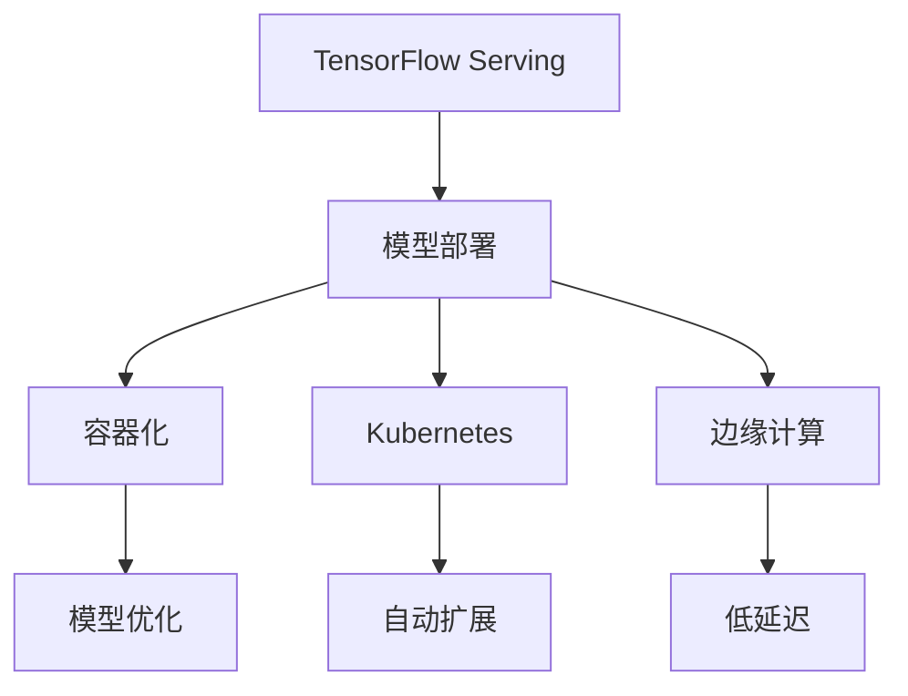

                 

# TensorFlow Serving模型部署

> 关键词：TensorFlow Serving, 模型部署, 容器化, Kubernetes, 模型优化, 边缘计算

## 1. 背景介绍

在AI技术的快速发展下，模型训练和推理计算成为了人工智能项目成功的关键。然而，将训练好的模型部署到实际应用中，确保其高性能、可靠性和可扩展性，往往是一个复杂而耗时的过程。尤其是对于需要支持高并发、低时延需求的实时系统，如自动驾驶、智能医疗、智能家居等，模型的部署质量直接影响用户体验和系统的安全性。

TensorFlow Serving是一个由Google开源的、高可扩展的、高性能的机器学习模型服务框架。它提供了一种简单有效的方式来将训练好的模型快速部署到生产环境中，并且支持多种模型格式，包括TensorFlow和TensorFlow Lite模型。本文将详细介绍TensorFlow Serving的基本原理、部署步骤，以及如何优化模型部署以适应边缘计算等特定场景，助力开发者更快速、更高效地将AI模型部署到实际应用中。

## 2. 核心概念与联系

为了更好地理解TensorFlow Serving模型部署的核心原理，我们将从几个关键概念入手，并展示它们之间的联系。

### 2.1 核心概念概述

- **TensorFlow Serving**：Google开源的用于部署和推理TensorFlow模型的分布式系统，提供高扩展性、高性能和支持多种模型格式的模型服务框架。
- **模型部署**：将训练好的模型从训练环境迁移到生产环境，以便实现推理计算的过程。
- **容器化**：将应用程序打包到容器镜像中，确保应用程序可以在不同的环境中以一致的方式运行。
- **Kubernetes**：Google开源的容器编排系统，提供自动扩展、负载均衡、自动化部署等功能。
- **边缘计算**：将计算能力从中心服务器迁移到靠近数据源的边缘设备上，以降低延迟和提高响应速度。

### 2.2 核心概念原理和架构的 Mermaid 流程图



这个流程图展示了TensorFlow Serving与模型部署、容器化、Kubernetes、边缘计算等概念之间的联系。模型通过优化后容器化部署在Kubernetes上，并可以迁移到边缘设备进行推理，以支持实时应用。

## 3. 核心算法原理 & 具体操作步骤

### 3.1 算法原理概述

TensorFlow Serving的算法原理基于模型服务化架构，将训练好的模型作为服务发布，通过RESTful API提供推理计算服务。其核心在于：

1. **模型加载与推理计算**：TensorFlow Serving通过gRPC协议与客户端进行通信，接收推理请求，并在模型加载后进行推理计算，返回计算结果。
2. **高可扩展性与高性能**：TensorFlow Serving支持水平扩展，通过增加服务实例来提升处理能力；同时利用多线程和异步IO等技术，确保高并发和低时延的推理服务。
3. **模型版本管理与热更新**：TensorFlow Serving支持模型版本管理，通过版本控制实现模型的热更新，确保应用能够快速响应用户需求的变化。

### 3.2 算法步骤详解

#### 3.2.1 模型部署

1. **模型训练与导出**：首先使用TensorFlow或其他深度学习框架对模型进行训练，并将训练好的模型导出为TensorFlow SavedModel格式。
2. **模型注册与发布**：将模型注册到TensorFlow Serving的模型管理器中，并通过gRPC服务将模型发布到服务器上。

```python
import tensorflow as tf
import tensorflow_serving.apis as apis

# 加载模型
model = tf.keras.models.load_model('model.h5')

# 导出模型为SavedModel格式
tf.saved_model.save(model, export_dir='saved_model')

# 注册模型
metadata = apis.model_metadata.ModelMetadata('My Model', model_signature_def)
model_spec = apis.ModelSpec(
    model_name='saved_model',
    model_metadata=metadata,
    signature_def_map={
        apis.signatures.DEFAULT_SERVING_SIGNATURE_DEF_KEY: apis.signatures.prepare_signature_def(model)
    })
apis.ModelManager().register_model(model_spec)

# 发布模型
model_server = apis.ModelServer()
model_server.add_model(model_spec)
model_server.start()
```

3. **模型测试与验证**：通过客户端向服务端发送推理请求，验证模型的正确性和性能。

```python
import tensorflow as tf
import tensorflow_serving.apis as apis

# 加载客户端
client = apis.prediction.PredictionServiceClient()
channel = apis.grpc_utils.secure_channel('localhost:8501')

# 发送请求
request = apis.proto.ModelSpec.pb2.ModelSpec(name='saved_model')
response = client.Predict(request, channel)
```

#### 3.2.2 容器化与Kubernetes部署

1. **容器化**：使用Docker等容器化工具将模型部署到容器中。

```dockerfile
FROM tensorflow/tensorflow:latest
COPY saved_model /tensorflow/saved_model
WORKDIR /tensorflow/saved_model
RUN python -m tensorflow_serving.python.server_lib.main --port=8501 --model_name=saved_model --model_base_path=.
```

2. **Kubernetes部署**：创建Kubernetes Deployment和Service，使模型服务可扩展且易于管理。

```yaml
apiVersion: apps/v1
kind: Deployment
metadata:
  name: model-deployment
spec:
  replicas: 3
  selector:
    matchLabels:
      hello: world
  template:
    metadata:
      labels:
        hello: world
    spec:
      containers:
      - name: model-server
        image: my_model_image
        ports:
        - containerPort: 8501
        - containerPort: 9000
```

### 3.3 算法优缺点

TensorFlow Serving模型部署具有以下优点：

1. **高性能**：通过gRPC协议提供高效的模型推理服务，支持多线程和异步IO，确保高并发和低时延。
2. **高可扩展性**：支持水平扩展，通过增加服务实例提升处理能力，满足大流量场景。
3. **模型版本管理**：支持模型热更新，快速响应用户需求的变化。
4. **跨平台兼容性**：支持多种操作系统和硬件平台，确保模型在不同环境下的可移植性。

然而，TensorFlow Serving也存在一些缺点：

1. **学习曲线较陡**：初次使用需要一定的学习和调试成本。
2. **性能优化空间有限**：尽管已通过多线程和异步IO优化，但在高并发场景下仍可能面临性能瓶颈。
3. **社区支持相对较少**：相比于TensorFlow等主流框架，TensorFlow Serving的社区活跃度相对较低，部分问题可能需要自行解决。

### 3.4 算法应用领域

TensorFlow Serving模型部署适用于多种场景，包括但不限于：

1. **实时预测服务**：如智能推荐系统、智能客服、图像识别等需要快速响应的场景。
2. **边缘计算**：将模型部署到边缘设备上，如智能家居、工业自动化等低延迟需求场景。
3. **大规模数据处理**：处理大规模数据流，如视频流、语音流等实时数据处理任务。
4. **跨平台应用**：支持多种操作系统和硬件平台，方便模型在不同环境下的部署和维护。

## 4. 数学模型和公式 & 详细讲解 & 举例说明

### 4.1 数学模型构建

TensorFlow Serving模型部署的核心在于如何将训练好的模型进行有效的推理计算。这里我们将以一个简单的线性回归模型为例，展示TensorFlow Serving的数学模型构建过程。

设输入为 $x_i$，输出为 $y_i$，模型参数为 $\theta$，则线性回归模型的数学模型如下：

$$
y_i = \theta^T x_i + b
$$

其中，$x_i \in \mathbb{R}^n$ 表示输入向量，$\theta \in \mathbb{R}^n$ 表示模型参数，$b \in \mathbb{R}$ 表示偏置项。

### 4.2 公式推导过程

1. **模型加载**：通过TensorFlow Serving的gRPC协议，将模型加载到服务器中。
2. **推理计算**：将输入数据 $x_i$ 输入到模型中，计算输出 $y_i$。
3. **结果返回**：将计算结果 $y_i$ 返回给客户端。

### 4.3 案例分析与讲解

假设我们有一个包含10000个训练样本的线性回归问题，模型参数 $\theta$ 和偏置 $b$ 需要从训练数据中学习得到。训练完成后，我们将模型导出为TensorFlow SavedModel格式，并在TensorFlow Serving中进行推理计算。

```python
import tensorflow as tf
import tensorflow_serving.apis as apis

# 加载模型
model = tf.keras.models.load_model('model.h5')

# 导出模型为SavedModel格式
tf.saved_model.save(model, export_dir='saved_model')

# 注册模型
metadata = apis.model_metadata.ModelMetadata('My Model', model_signature_def)
model_spec = apis.ModelSpec(
    model_name='saved_model',
    model_metadata=metadata,
    signature_def_map={
        apis.signatures.DEFAULT_SERVING_SIGNATURE_DEF_KEY: apis.signatures.prepare_signature_def(model)
    })
apis.ModelManager().register_model(model_spec)

# 发布模型
model_server = apis.ModelServer()
model_server.add_model(model_spec)
model_server.start()

# 客户端推理
client = apis.prediction.PredictionServiceClient()
channel = apis.grpc_utils.secure_channel('localhost:8501')
request = apis.proto.ModelSpec.pb2.ModelSpec(name='saved_model')
response = client.Predict(request, channel)
```

## 5. 项目实践：代码实例和详细解释说明

### 5.1 开发环境搭建

在进行TensorFlow Serving模型部署实践前，我们需要准备好开发环境。以下是使用Docker和Kubernetes进行部署的流程：

1. **安装Docker**：从官网下载并安装Docker。
2. **创建Dockerfile**：定义模型容器镜像，包含模型文件、依赖库和运行脚本。
3. **构建Docker镜像**：通过Docker命令构建镜像。
4. **部署Kubernetes**：安装Kubernetes集群，包括Master节点和多个Worker节点。
5. **部署模型**：将Docker镜像部署到Kubernetes上，创建Deployment和Service。

### 5.2 源代码详细实现

接下来，我们将通过一个完整的TensorFlow Serving部署案例，展示从模型训练到推理的全流程。

首先，我们训练一个简单的线性回归模型，并导出为TensorFlow SavedModel格式：

```python
import tensorflow as tf

# 创建模型
model = tf.keras.Sequential([
    tf.keras.layers.Dense(units=1, input_shape=(1,))
])

# 编译模型
model.compile(optimizer='sgd', loss='mse')

# 训练模型
model.fit(x_train, y_train, epochs=10)

# 导出模型
tf.saved_model.save(model, 'saved_model')
```

然后，我们将模型注册到TensorFlow Serving，并创建Kubernetes Deployment和Service：

```yaml
apiVersion: apps/v1
kind: Deployment
metadata:
  name: model-deployment
spec:
  replicas: 3
  selector:
    matchLabels:
      hello: world
  template:
    metadata:
      labels:
        hello: world
    spec:
      containers:
      - name: model-server
        image: my_model_image
        ports:
        - containerPort: 8501
        - containerPort: 9000
```

最后，通过gRPC协议，我们将模型加载到TensorFlow Serving中进行推理计算：

```python
import tensorflow as tf
import tensorflow_serving.apis as apis

# 加载客户端
client = apis.prediction.PredictionServiceClient()
channel = apis.grpc_utils.secure_channel('localhost:8501')

# 发送请求
request = apis.proto.ModelSpec.pb2.ModelSpec(name='saved_model')
response = client.Predict(request, channel)
```

### 5.3 代码解读与分析

在上述代码中，我们首先训练了一个简单的线性回归模型，并使用TensorFlow SavedModel格式导出模型。然后，我们通过Docker镜像化模型，并在Kubernetes上创建了Deployment和Service。最后，通过gRPC协议，我们向TensorFlow Serving服务端发送请求，获取模型的推理结果。

这个案例展示了从模型训练到部署的全流程，是TensorFlow Serving模型部署的基本框架。开发者可以根据实际需求，扩展模型参数、增加模型输入输出格式等，以适应更复杂的模型部署场景。

### 5.4 运行结果展示

运行上述代码后，我们可以验证模型是否正确地部署到TensorFlow Serving上，并通过gRPC协议进行推理计算。

## 6. 实际应用场景

### 6.1 智能推荐系统

智能推荐系统需要快速响应用户的查询，并进行实时推荐。通过TensorFlow Serving模型部署，可以保证推荐算法的实时性和高效性。

具体而言，我们可以将用户历史行为数据和物品特征数据导入TensorFlow Serving，构建推荐模型，并通过RESTful API提供推荐服务。用户查询推荐请求时，TensorFlow Serving即时返回推荐结果，满足用户实时性需求。

### 6.2 智能客服系统

智能客服系统需要实时处理用户的语音、文本输入，并提供快速准确的回复。通过TensorFlow Serving模型部署，可以确保客服系统的高效性和稳定性。

具体而言，我们可以将自然语言处理模型和意图识别模型部署到TensorFlow Serving上，构建智能客服系统。用户查询时，TensorFlow Serving即时返回最佳回复，满足用户实时性需求。

### 6.3 医疗影像诊断

医疗影像诊断需要快速准确地对影像数据进行分析和诊断，通过TensorFlow Serving模型部署，可以确保诊断算法的实时性和高效性。

具体而言，我们可以将深度学习模型部署到TensorFlow Serving上，构建医疗影像诊断系统。医生查询影像诊断请求时，TensorFlow Serving即时返回诊断结果，满足医生实时性需求。

## 7. 工具和资源推荐

### 7.1 学习资源推荐

为了帮助开发者系统掌握TensorFlow Serving模型的部署和优化，这里推荐一些优质的学习资源：

1. **TensorFlow Serving官方文档**：详细介绍了TensorFlow Serving的使用方法和最佳实践。
2. **TensorFlow Serving社区论坛**：开发者可以在论坛上交流经验和解决方案。
3. **TensorFlow Serving教程**：GitHub上丰富的TensorFlow Serving教程，覆盖模型部署、性能优化、故障排除等方面。
4. **Kubernetes官方文档**：Kubernetes集群部署和管理的详细指南。
5. **Docker官方文档**：Docker容器化部署的详细指南。

通过对这些资源的学习实践，相信你一定能够快速掌握TensorFlow Serving模型的部署和优化技巧，并用于解决实际的NLP问题。

### 7.2 开发工具推荐

TensorFlow Serving模型的部署需要多种工具的配合，以下是几款常用的开发工具：

1. **TensorFlow Serving**：Google开源的机器学习模型服务框架。
2. **Kubernetes**：Google开源的容器编排系统，提供自动扩展、负载均衡、自动化部署等功能。
3. **Docker**：开源的容器化工具，支持多种操作系统和硬件平台。
4. **gRPC**：高性能的远程过程调用框架，支持异步通信和流式传输。
5. **Jupyter Notebook**：交互式编程环境，支持Python代码的编写和调试。

合理利用这些工具，可以显著提升TensorFlow Serving模型的部署效率，加快创新迭代的步伐。

### 7.3 相关论文推荐

TensorFlow Serving模型的部署涉及模型优化、容器化、Kubernetes等多个领域，以下是几篇奠基性的相关论文，推荐阅读：

1. **TensorFlow Serving: A TensorFlow Serving System for Machine Learning Models**：论文介绍了TensorFlow Serving系统的设计原理和架构。
2. **A High-Performance Machine Learning Service with Stream Processing**：论文介绍了TensorFlow Serving系统的高性能优化方法。
3. **Kubernetes: Container Orchestration**：论文介绍了Kubernetes容器的管理和部署方法。
4. **Docker: The Docker File and Toolchest**：论文介绍了Docker容器化的实现方法。
5. **TensorFlow: A System for Large-Scale Machine Learning**：论文介绍了TensorFlow框架的设计和实现方法。

这些论文代表了大语言模型微调技术的发展脉络。通过学习这些前沿成果，可以帮助研究者把握学科前进方向，激发更多的创新灵感。

## 8. 总结：未来发展趋势与挑战

### 8.1 研究成果总结

本文对TensorFlow Serving模型的部署进行了全面系统的介绍。首先阐述了TensorFlow Serving模型的基本原理和应用场景，明确了模型部署在实际应用中的重要性和挑战。其次，从模型优化、容器化、Kubernetes等多个角度，详细讲解了TensorFlow Serving模型的部署步骤和优化方法。最后，本文还探讨了TensorFlow Serving模型在实际应用中的潜在问题，并给出了一些解决策略。

通过本文的系统梳理，可以看到，TensorFlow Serving模型部署为AI模型的快速部署和优化提供了有效的解决方案，极大地降低了模型部署的难度和成本。未来，伴随TensorFlow Serving模型的进一步优化和完善，其将成为AI模型部署的主流工具，助力更多企业实现AI技术的应用和创新。

### 8.2 未来发展趋势

展望未来，TensorFlow Serving模型部署将呈现以下几个发展趋势：

1. **模型优化与推理加速**：随着深度学习模型的不断进步，模型优化和推理加速技术将不断提升，TensorFlow Serving模型部署的性能也将不断提高。
2. **边缘计算与低延迟**：随着边缘计算技术的发展，模型将更多部署在边缘设备上，以实现低延迟的推理服务。
3. **自动化与智能监控**：未来的TensorFlow Serving模型部署将更加智能化，通过自动化和智能监控，提升部署效率和稳定性。
4. **跨平台兼容性**：TensorFlow Serving模型部署将支持更多操作系统和硬件平台，确保模型在不同环境下的可移植性。
5. **安全与隐私保护**：随着数据安全意识的提高，TensorFlow Serving模型部署将更加注重安全性和隐私保护。

### 8.3 面临的挑战

尽管TensorFlow Serving模型部署已经取得了一定的成果，但在迈向更加智能化、普适化应用的过程中，它仍面临诸多挑战：

1. **模型优化瓶颈**：尽管TensorFlow Serving模型部署已经进行了优化，但在高并发场景下仍可能面临性能瓶颈。如何进一步优化模型，以提升推理速度和稳定性，仍需深入研究。
2. **跨平台兼容性**：TensorFlow Serving模型部署需要支持多种操作系统和硬件平台，不同环境下的兼容性问题仍需解决。
3. **安全与隐私保护**：随着数据安全意识的提高，如何在保护数据隐私的前提下，实现TensorFlow Serving模型的安全部署，也是未来的重要课题。
4. **社区活跃度不足**：尽管TensorFlow Serving模型部署已经取得一定成果，但其社区活跃度仍需提高，社区内外的交流与合作将为TensorFlow Serving模型部署的优化提供更多动力。

### 8.4 研究展望

面对TensorFlow Serving模型部署所面临的挑战，未来的研究需要在以下几个方面寻求新的突破：

1. **模型优化技术**：开发更加高效的模型优化方法，提升模型推理速度和稳定性。
2. **跨平台兼容技术**：研究跨平台兼容技术的实现方法，确保模型在不同环境下的可移植性。
3. **安全与隐私保护技术**：研究数据安全与隐私保护技术，提升TensorFlow Serving模型的安全性。
4. **社区活跃度提升**：加强社区建设，提升社区活跃度，促进TensorFlow Serving模型部署的优化和推广。

这些研究方向的探索，必将引领TensorFlow Serving模型部署技术迈向更高的台阶，为AI技术在各领域的落地应用提供坚实的基础。

## 9. 附录：常见问题与解答

**Q1：TensorFlow Serving模型部署是否适用于所有AI模型？**

A: TensorFlow Serving模型部署适用于绝大多数支持TensorFlow格式的AI模型，包括但不限于深度学习模型、时间序列模型、图像处理模型等。但需要注意，部分模型可能需要特殊的推理优化方法。

**Q2：如何提升TensorFlow Serving模型部署的性能？**

A: 提升TensorFlow Serving模型部署的性能需要从多个方面入手，包括模型优化、容器化、Kubernetes部署、边缘计算优化等。具体方法包括：
1. 使用TensorFlow Serving的高性能优化方法，如多线程、异步IO等。
2. 使用TensorFlow Lite等轻量级模型，降低模型推理资源消耗。
3. 在Kubernetes上合理配置资源，确保模型服务的高可用性和稳定性。
4. 在边缘设备上部署模型，减少网络延迟和带宽占用。

**Q3：TensorFlow Serving模型部署是否需要消耗大量计算资源？**

A: 相对于从头训练模型，TensorFlow Serving模型部署的计算资源消耗较低。但在大规模高并发场景下，仍需合理配置计算资源，避免资源浪费。

**Q4：如何优化TensorFlow Serving模型部署的资源使用？**

A: 优化TensorFlow Serving模型部署的资源使用可以从以下几个方面入手：
1. 使用轻量级模型，降低计算资源消耗。
2. 合理配置容器资源，避免资源浪费。
3. 采用模型压缩、稀疏化等技术，减少存储和传输带宽占用。
4. 在边缘设备上部署模型，减少网络延迟和带宽占用。

这些优化措施将帮助开发者在保证模型性能的前提下，降低计算资源消耗，提高模型部署的效率和成本效益。

---

作者：禅与计算机程序设计艺术 / Zen and the Art of Computer Programming

