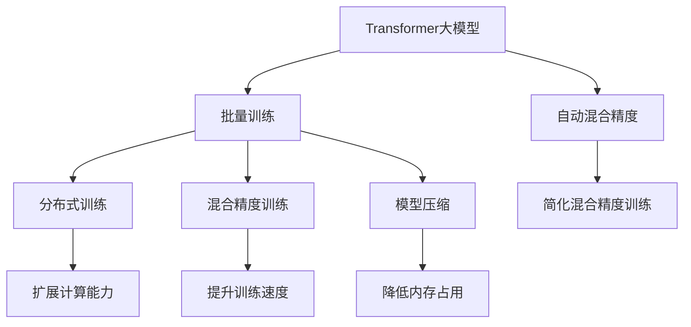

                 

# Transformer大模型实战 以大批量的方式进行训练

> 关键词：Transformer, 大模型, 批量训练, 高性能计算, 深度学习, 分布式训练, 模型优化, 模型压缩

## 1. 背景介绍

### 1.1 问题由来
在深度学习领域，Transformer大模型的训练和应用已经引起了广泛关注。这些模型在自然语言处理、计算机视觉、语音识别等众多领域取得了令人瞩目的成果。然而，由于其庞大的参数量和复杂性，使得在大规模数据上进行有效训练变得异常困难。针对这一问题，近年来学术界和工业界提出了多种高效训练方法，其中以批量训练(Batch Training)最为典型。

### 1.2 问题核心关键点
批量训练的核心思想是利用高性能计算资源，通过在多个设备上并行计算，同时对不同批次的样本进行训练，从而大幅度提高训练效率。具体方法包括分布式训练、混合精度训练、模型压缩等。这些方法在提高训练速度的同时，也减少了对内存和存储的需求，使得大规模模型训练成为可能。

### 1.3 问题研究意义
批量训练技术对大规模模型训练具有重要意义：

1. 缩短训练时间：通过并行计算，大幅缩短模型训练所需时间，加速模型迭代优化。
2. 降低硬件成本：减少单次训练所需的内存和存储资源，降低硬件成本。
3. 提升模型精度：通过更高效的优化算法和混合精度训练，提高模型精度和泛化能力。
4. 促进模型应用：缩短模型开发周期，加速模型落地应用，推动AI技术的产业化进程。

## 2. 核心概念与联系

### 2.1 核心概念概述

为更好地理解批量训练方法，本节将介绍几个关键概念：

- **Transformer大模型**：一种基于自注意力机制的深度学习模型，广泛应用于自然语言处理、计算机视觉等领域，具有强大的表征学习能力。

- **批量训练(Batch Training)**：通过并行计算，同时训练不同批次的样本，加速模型训练过程。

- **分布式训练(Distributed Training)**：通过在多个设备上并行计算，扩展计算能力，提升训练效率。

- **混合精度训练(Mixed-Precision Training)**：通过使用低精度浮点数加速计算，减少存储需求，提升训练速度。

- **模型压缩(Model Compression)**：通过量化、剪枝等方法减小模型大小，降低内存占用和计算成本。

- **自动混合精度(Automatic Mixed-Precision)**：自动管理不同精度数据类型，简化混合精度训练过程。

这些核心概念之间的逻辑关系可以通过以下Mermaid流程图来展示：



这个流程图展示了Transformer大模型、批量训练方法及其相关技术的联系：

1. Transformer大模型通过批量训练方法得到更高效的训练，分布式训练进一步扩展计算能力。
2. 混合精度训练和模型压缩技术优化计算资源，提升训练速度和效率。
3. 自动混合精度简化了训练过程，使混合精度训练更加易用。

这些概念共同构成了大模型高效训练的基础，使得Transformer大模型能够在更大规模的数据上进行快速训练，加速其在实际应用中的落地。

## 3. 核心算法原理 & 具体操作步骤
### 3.1 算法原理概述

批量训练的核心在于将大模型分成多个小批次进行并行训练，每个批次包含一部分样本。通过在多个计算设备上同时处理不同批次的样本，可以大幅度提升训练效率。

假设有$M$个设备，每个设备可以同时处理一个批次的数据。设训练样本总数为$N$，批量大小为$B$，则总共有$\frac{N}{B}$个批次，每个设备负责一个批次。

### 3.2 算法步骤详解

以下是批量训练的一般步骤：

**Step 1: 数据准备**
- 将训练数据集划分成若干个批次，每个批次包含$B$个样本。
- 将每个批次的样本同时传入不同的计算设备上。

**Step 2: 分布式计算**
- 在各个设备上并行计算每个批次的数据。
- 使用自动混合精度技术，在训练过程中自动调整数据类型，减少存储和计算资源消耗。

**Step 3: 参数更新**
- 在各个设备上更新模型参数。
- 通过梯度累加，每个设备的梯度被累加到全局梯度中，更新全局参数。

**Step 4: 验证与优化**
- 在每个批次结束时，计算该批次的验证误差，评估模型性能。
- 根据验证误差调整学习率、批次大小等超参数。

**Step 5: 结束条件判断**
- 当达到预设的迭代轮数或验证误差收敛时，训练过程结束。

### 3.3 算法优缺点

批量训练具有以下优点：
1. 显著提升训练速度：通过并行计算，显著缩短模型训练所需时间。
2. 降低内存和存储需求：每个设备只需要处理部分数据，减少对内存和存储的需求。
3. 提高模型精度：通过更高效的优化算法和混合精度训练，提升模型精度和泛化能力。

同时，该方法也存在一定的局限性：
1. 对设备要求高：需要高性能计算资源，包括GPU、TPU等。
2. 设备同步开销：多个设备之间的通信和同步需要额外计算资源和时间。
3. 调试困难：每个设备独立训练，调试时需逐个排查，增加了调试难度。

尽管存在这些局限性，但就目前而言，批量训练仍然是大规模模型训练的主流方法。未来相关研究的重点在于如何进一步优化设备同步，降低通信开销，简化混合精度训练，以实现更高效、更易用的批量训练方法。

### 3.4 算法应用领域

批量训练技术已经在众多领域得到了广泛的应用，例如：

- 自然语言处理：训练大型语言模型如BERT、GPT等，加速模型在各种NLP任务上的表现。
- 计算机视觉：训练大型卷积神经网络(CNN)，用于图像分类、目标检测等任务。
- 语音识别：训练大型声学模型和语言模型，提升语音识别系统的精度和鲁棒性。
- 推荐系统：训练大型推荐模型，加速个性化推荐算法在电商、视频等平台的应用。
- 智能制造：训练大型工业控制模型，提升生产效率和设备智能化水平。
- 金融预测：训练大型时间序列模型，预测股票、汇率等金融市场趋势。

除了上述这些经典应用外，批量训练还被创新性地应用到更多场景中，如自动驾驶、智慧城市、医疗健康等，为不同行业的智能化转型提供了新的技术路径。随着计算资源和算法的不断进步，相信批量训练方法将在更广阔的领域得到应用，推动人工智能技术的产业化进程。

## 4. 数学模型和公式 & 详细讲解 & 举例说明
### 4.1 数学模型构建

为了更严格地描述批量训练方法，本节将使用数学语言对其进行更加严格的刻画。

设原始训练样本总数为$N$，批量大小为$B$，则总共有$\frac{N}{B}$个批次。每个批次包含$B$个样本。

假设模型参数为$\theta$，原始损失函数为$\mathcal{L}(\theta)$，则批量损失函数为：

$$
\mathcal{L}_B(\theta) = \frac{1}{\frac{N}{B}} \sum_{i=1}^{\frac{N}{B}} \mathcal{L}(\theta)
$$

批量训练的目标是最小化批量损失函数，即找到最优参数：

$$
\theta^* = \mathop{\arg\min}_{\theta} \mathcal{L}_B(\theta)
$$

在实践中，我们通常使用基于梯度的优化算法（如SGD、Adam等）来近似求解上述最优化问题。

### 4.2 公式推导过程

以SGD为例，推导批量训练的更新公式。

设当前参数为$\theta_t$，目标参数为$\theta^*$，梯度为$\Delta\theta_t = -\nabla_{\theta}\mathcal{L}_B(\theta_t)$。则批量训练的更新公式为：

$$
\theta_{t+1} = \theta_t - \eta \Delta\theta_t
$$

其中$\eta$为学习率。

当采用批量训练时，每个批次计算得到的梯度$\Delta\theta_{t,b}$可能略有差异，因此需要对每个批次的梯度进行累加，得到全局梯度$\Delta\theta_t$。假设共有$K$个批次，则全局梯度为：

$$
\Delta\theta_t = \sum_{k=1}^K \Delta\theta_{t,k}
$$

将全局梯度代入更新公式，得：

$$
\theta_{t+1} = \theta_t - \eta \sum_{k=1}^K \Delta\theta_{t,k}
$$

在实践中，为了进一步提升训练效率，可以采用以下优化策略：

1. 累积梯度：在每个批次结束时，将梯度累加到全局梯度中。
2. 分散计算：在多个设备上并行计算每个批次的梯度，并行更新模型参数。
3. 自动混合精度：在训练过程中自动调整数据类型，减少存储和计算资源消耗。
4. 分布式同步：使用分布式同步算法，保持各个设备之间的参数同步。

### 4.3 案例分析与讲解

以TensorFlow为例，演示批量训练的实现流程。

首先，定义训练数据和模型：

```python
import tensorflow as tf

# 定义模型
model = tf.keras.Sequential([
    tf.keras.layers.Embedding(input_dim=vocab_size, output_dim=embedding_dim, input_length=max_length),
    tf.keras.layers.Bidirectional(tf.keras.layers.LSTM(units=hidden_units)),
    tf.keras.layers.Dense(units=num_classes, activation='softmax')
])

# 定义损失函数和优化器
loss_fn = tf.keras.losses.SparseCategoricalCrossentropy()
optimizer = tf.keras.optimizers.SGD(learning_rate=0.01)

# 定义训练集和测试集
train_dataset = tf.data.Dataset.from_tensor_slices((train_X, train_y))
test_dataset = tf.data.Dataset.from_tensor_slices((test_X, test_y))

# 定义批量大小
batch_size = 32

# 定义批量训练函数
@tf.function
def train_step(batch):
    x, y = batch
    with tf.GradientTape() as tape:
        logits = model(x)
        loss = loss_fn(y, logits)
    grads = tape.gradient(loss, model.trainable_variables)
    optimizer.apply_gradients(zip(grads, model.trainable_variables))

# 定义批量训练循环
@tf.function
def train_epoch(epoch):
    for batch in train_dataset.batch(batch_size):
        train_step(batch)
```

然后，在多设备上并行训练模型：

```python
import multiprocessing

# 定义设备数量和训练轮数
num_devices = 8
epochs = 10

# 定义设备列表和批量训练函数
devices = tf.config.list_physical_devices('GPU')
strategy = tf.distribute.MirroredStrategy(devices)
with strategy.scope():
    train_epoch(epochs)

```

以上就是使用TensorFlow对大模型进行批量训练的完整代码实现。可以看到，得益于TensorFlow的强大分布式计算能力，批量训练变得相对简洁高效。

## 5. 项目实践：代码实例和详细解释说明
### 5.1 开发环境搭建

在进行批量训练实践前，我们需要准备好开发环境。以下是使用Python进行TensorFlow开发的环境配置流程：

1. 安装Anaconda：从官网下载并安装Anaconda，用于创建独立的Python环境。

2. 创建并激活虚拟环境：
```bash
conda create -n tf-env python=3.8 
conda activate tf-env
```

3. 安装TensorFlow：根据CUDA版本，从官网获取对应的安装命令。例如：
```bash
conda install tensorflow=2.5 -c tf
```

4. 安装各类工具包：
```bash
pip install numpy pandas scikit-learn matplotlib tqdm jupyter notebook ipython
```

完成上述步骤后，即可在`tf-env`环境中开始批量训练实践。

### 5.2 源代码详细实现

这里我们以分布式训练为例，使用TensorFlow进行Transformer大模型的批量训练。

首先，定义数据集和模型：

```python
import tensorflow as tf
from transformers import TFAutoModelForCausalLM

# 定义模型
model = TFAutoModelForCausalLM.from_pretrained('bert-base-uncased')

# 定义训练集和测试集
train_dataset = tf.data.Dataset.from_tensor_slices((train_X, train_y))
test_dataset = tf.data.Dataset.from_tensor_slices((test_X, test_y))

# 定义批量大小
batch_size = 32

# 定义分布式计算策略
strategy = tf.distribute.MirroredStrategy()

with strategy.scope():
    # 定义损失函数和优化器
    loss_fn = tf.keras.losses.SparseCategoricalCrossentropy()
    optimizer = tf.keras.optimizers.SGD(learning_rate=0.01)
    
    # 定义批量训练函数
    @tf.function
    def train_step(batch):
        x, y = batch
        with tf.GradientTape() as tape:
            logits = model(x)
            loss = loss_fn(y, logits)
        grads = tape.gradient(loss, model.trainable_variables)
        optimizer.apply_gradients(zip(grads, model.trainable_variables))
```

然后，在多设备上并行训练模型：

```python
import multiprocessing

# 定义设备数量和训练轮数
num_devices = 8
epochs = 10

# 定义设备列表和批量训练函数
devices = tf.config.list_physical_devices('GPU')
strategy = tf.distribute.MirroredStrategy(devices)
with strategy.scope():
    train_epoch(epochs)
```

### 5.3 代码解读与分析

让我们再详细解读一下关键代码的实现细节：

**TFAutoModelForCausalLM类**：
- 定义了一个基于Transformer的自动编码模型，适合用于因果语言模型如GPT等。

**训练集和测试集**：
- 使用TensorFlow的数据集API，将训练数据和测试数据转换为TensorFlow数据集，方便批量处理。

**分布式计算策略**：
- 使用TensorFlow的分布式计算策略，指定使用多个GPU设备进行并行计算。

**批量训练函数**：
- 定义了一个函数，用于在每个批次上执行模型前向传播和反向传播，并更新模型参数。

**设备列表**：
- 使用TensorFlow的`tf.config.list_physical_devices()`方法，获取可用GPU设备列表，方便指定设备进行分布式计算。

**训练循环**：
- 定义了一个训练循环，使用`with strategy.scope()`语句在分布式计算策略作用域内执行批量训练。

可以看到，TensorFlow的分布式计算能力使得批量训练变得相对简单高效。通过将模型定义和训练过程封装在函数中，可以方便地在不同设备上进行并行计算，加速模型训练。

## 6. 实际应用场景
### 6.1 智能客服系统

基于大模型批量训练的对话技术，可以广泛应用于智能客服系统的构建。传统客服往往需要配备大量人力，高峰期响应缓慢，且一致性和专业性难以保证。而使用批量训练的对话模型，可以7x24小时不间断服务，快速响应客户咨询，用自然流畅的语言解答各类常见问题。

在技术实现上，可以收集企业内部的历史客服对话记录，将问题和最佳答复构建成监督数据，在此基础上对预训练对话模型进行批量训练。批量训练后的对话模型能够自动理解用户意图，匹配最合适的答案模板进行回复。对于客户提出的新问题，还可以接入检索系统实时搜索相关内容，动态组织生成回答。如此构建的智能客服系统，能大幅提升客户咨询体验和问题解决效率。

### 6.2 金融舆情监测

金融机构需要实时监测市场舆论动向，以便及时应对负面信息传播，规避金融风险。传统的人工监测方式成本高、效率低，难以应对网络时代海量信息爆发的挑战。基于大语言模型批量训练的文本分类和情感分析技术，为金融舆情监测提供了新的解决方案。

具体而言，可以收集金融领域相关的新闻、报道、评论等文本数据，并对其进行主题标注和情感标注。在此基础上对预训练语言模型进行批量训练，使其能够自动判断文本属于何种主题，情感倾向是正面、中性还是负面。将批量训练后的模型应用到实时抓取的网络文本数据，就能够自动监测不同主题下的情感变化趋势，一旦发现负面信息激增等异常情况，系统便会自动预警，帮助金融机构快速应对潜在风险。

### 6.3 个性化推荐系统

当前的推荐系统往往只依赖用户的历史行为数据进行物品推荐，无法深入理解用户的真实兴趣偏好。基于大语言模型批量训练的个性化推荐系统，可以更好地挖掘用户行为背后的语义信息，从而提供更精准、多样的推荐内容。

在实践中，可以收集用户浏览、点击、评论、分享等行为数据，提取和用户交互的物品标题、描述、标签等文本内容。将文本内容作为模型输入，用户的后续行为（如是否点击、购买等）作为监督信号，在此基础上批量训练预训练语言模型。批量训练后的模型能够从文本内容中准确把握用户的兴趣点。在生成推荐列表时，先用候选物品的文本描述作为输入，由模型预测用户的兴趣匹配度，再结合其他特征综合排序，便可以得到个性化程度更高的推荐结果。

### 6.4 未来应用展望

随着大语言模型和批量训练方法的不断发展，基于微调范式将在更多领域得到应用，为传统行业带来变革性影响。

在智慧医疗领域，基于批量训练的医疗问答、病历分析、药物研发等应用将提升医疗服务的智能化水平，辅助医生诊疗，加速新药开发进程。

在智能教育领域，批量训练技术可应用于作业批改、学情分析、知识推荐等方面，因材施教，促进教育公平，提高教学质量。

在智慧城市治理中，批量训练模型可应用于城市事件监测、舆情分析、应急指挥等环节，提高城市管理的自动化和智能化水平，构建更安全、高效的未来城市。

此外，在企业生产、社会治理、文娱传媒等众多领域，基于大模型批量训练的人工智能应用也将不断涌现，为经济社会发展注入新的动力。相信随着预训练语言模型和批量训练方法的持续演进，未来的微调技术必将引领NLP领域的发展趋势，推动人工智能技术向更广阔的领域加速渗透。

## 7. 工具和资源推荐
### 7.1 学习资源推荐

为了帮助开发者系统掌握大模型批量训练的理论基础和实践技巧，这里推荐一些优质的学习资源：

1. 《深度学习：理论和实践》书籍：由多位深度学习专家合著，全面介绍了深度学习的基本概念和前沿技术，适合入门和进阶学习。

2. 《动手学深度学习》课程：由清华大学的深度学习研究团队推出，包含丰富的实验和实践代码，适合动手实践。

3. TensorFlow官方文档：详细介绍了TensorFlow的各类API和工具，是开发者学习TensorFlow的重要资料。

4. PyTorch官方文档：与TensorFlow并列的主流深度学习框架，提供了强大的计算图和分布式训练功能，适合深入学习和实验。

5. NVIDIA GPU加速课程：NVIDIA官方推出的GPU加速课程，涵盖GPU编程和分布式训练技巧，适合GPU计算相关学习。

通过对这些资源的学习实践，相信你一定能够快速掌握大模型批量训练的精髓，并用于解决实际的机器学习问题。
###  7.2 开发工具推荐

高效的开发离不开优秀的工具支持。以下是几款用于大模型批量训练开发的常用工具：

1. TensorFlow：基于Python的开源深度学习框架，灵活的计算图和分布式训练能力，适合大规模模型训练。

2. PyTorch：同样基于Python的开源深度学习框架，自动微分功能和动态计算图，适合快速迭代研究。

3. NVIDIA GPU加速工具：NVIDIA推出的GPU加速工具，如cuDNN、NCCL等，可以大幅度提升GPU计算效率，适合分布式训练。

4. Google Cloud AI Platform：谷歌提供的云平台服务，支持分布式训练、混合精度训练等先进功能，适合大规模模型训练。

5. AWS SageMaker：亚马逊提供的云平台服务，支持自动混合精度训练、分布式训练等，适合高并发模型训练。

6. Apache Spark MLlib：Apache Spark的机器学习库，支持分布式训练和数据处理，适合大数据环境下的模型训练。

合理利用这些工具，可以显著提升大模型批量训练任务的开发效率，加快创新迭代的步伐。

### 7.3 相关论文推荐

大语言模型和批量训练技术的发展源于学界的持续研究。以下是几篇奠基性的相关论文，推荐阅读：

1. Transformer: Attention is all you need：提出了Transformer结构，开启了深度学习模型的新时代。

2. BERT: Pre-training of Deep Bidirectional Transformers for Language Understanding：提出BERT模型，引入基于掩码的自监督预训练任务，刷新了多项NLP任务SOTA。

3. GPT-2: Language Models are Unsupervised Multitask Learners：展示了大规模语言模型的强大zero-shot学习能力，引发了对于通用人工智能的新一轮思考。

4. Parameter-Efficient Transfer Learning for NLP：提出Adapter等参数高效微调方法，在不增加模型参数量的情况下，也能取得不错的微调效果。

5. PaLM: Scaling Parallel Machine Learning for NLP：提出并行语言模型，将预训练模型并行扩展到数千个GPU上，提升了训练效率和模型规模。

6. MEGATRON-LM: Large-Scale Parallel Transformers with GPUDirect Communication：提出基于GPU直接通信的分布式训练算法，实现了大规模语言模型的分布式训练。

这些论文代表了大模型批量训练技术的发展脉络。通过学习这些前沿成果，可以帮助研究者把握学科前进方向，激发更多的创新灵感。

## 8. 总结：未来发展趋势与挑战

### 8.1 总结

本文对基于批量训练的大语言模型训练方法进行了全面系统的介绍。首先阐述了大语言模型和批量训练技术的研究背景和意义，明确了批量训练在提升模型性能和加速模型开发方面的独特价值。其次，从原理到实践，详细讲解了批量训练的数学原理和关键步骤，给出了批量训练任务开发的完整代码实例。同时，本文还广泛探讨了批量训练方法在智能客服、金融舆情、个性化推荐等多个行业领域的应用前景，展示了批量训练范式的巨大潜力。此外，本文精选了批量训练技术的各类学习资源，力求为读者提供全方位的技术指引。

通过本文的系统梳理，可以看到，基于批量训练的大语言模型训练方法正在成为深度学习领域的重要范式，极大地拓展了模型训练的规模和效率，推动了模型应用在实际场景中的落地。未来，伴随预训练语言模型和批量训练方法的持续演进，相信深度学习技术将在更广泛的领域得到应用，为人类社会带来更深远的影响。

### 8.2 未来发展趋势

展望未来，大语言模型批量训练技术将呈现以下几个发展趋势：

1. 模型规模持续增大。随着算力成本的下降和数据规模的扩张，预训练语言模型的参数量还将持续增长。超大模型具有更强大的表征能力，能更好地捕捉长距离依赖关系。

2. 分布式训练进一步扩展。随着计算资源和算法的进步，分布式训练的效率和稳定性将进一步提升。通过多机多核协作，提升模型训练速度和精度。

3. 混合精度训练优化。通过自动混合精度和混合精度自动选择技术，减少浮点数存储和计算开销，提升训练速度和资源利用率。

4. 模型压缩技术迭代。量化、剪枝、蒸馏等模型压缩方法将不断进步，减少模型大小，降低存储和计算成本。

5. 硬件加速持续创新。随着新型硬件设备的问世，GPU、TPU、FPGA等硬件加速技术将不断进步，进一步提升训练效率。

6. 模型融合技术发展。通过将模型与外部知识库、规则库等专家知识进行融合，提升模型的可解释性和鲁棒性。

以上趋势凸显了大语言模型批量训练技术的广阔前景。这些方向的探索发展，必将进一步提升深度学习模型的性能和应用范围，为构建人机协同的智能系统提供新的技术路径。

### 8.3 面临的挑战

尽管大语言模型批量训练技术已经取得了瞩目成就，但在迈向更加智能化、普适化应用的过程中，它仍面临着诸多挑战：

1. 硬件成本高昂。目前主流的预训练大模型往往需要高端GPU或TPU进行训练，硬件成本较高，限制了其在中小型企业中的应用。

2. 资源需求量大。批量训练需要大规模的数据和计算资源，对存储和网络带宽也有较高的要求，增加了系统的复杂性。

3. 调试困难。多设备并行训练增加了调试难度，需要逐个排查设备间的参数同步和通信问题，增加了开发周期。

4. 优化复杂。批量训练的优化涉及设备调度、资源分配、通信开销等多个环节，需要复杂的算法和工具支持。

5. 稳定性难以保障。分布式训练可能面临网络波动、设备故障等问题，影响训练的稳定性和鲁棒性。

6. 安全防护不足。批量训练模型可能面临数据泄露、模型窃取等安全威胁，需要加强安全防护措施。

正视批量训练面临的这些挑战，积极应对并寻求突破，将是大语言模型批量训练技术迈向成熟的必由之路。相信随着学界和产业界的共同努力，这些挑战终将一一被克服，大语言模型批量训练技术将在构建高效、安全、可靠的人工智能系统过程中发挥重要作用。

### 8.4 研究展望

面对大语言模型批量训练所面临的种种挑战，未来的研究需要在以下几个方面寻求新的突破：

1. 探索分布式异构训练方法。结合多种硬件资源，提升分布式训练的效率和鲁棒性。

2. 研究高效的通信协议。优化多设备间的通信协议，减少通信开销，提升训练效率。

3. 开发自适应混合精度算法。根据硬件资源和任务特点自动调整数据类型，优化资源利用率。

4. 引入模型压缩技术。通过量化、剪枝、蒸馏等方法，减小模型大小，降低存储和计算成本。

5. 结合专家知识进行融合。将模型与外部知识库、规则库等专家知识进行融合，提升模型的可解释性和鲁棒性。

6. 引入自监督学习任务。通过自监督学习任务提升模型的语言理解能力，减少对大规模标注数据的依赖。

这些研究方向的探索，必将引领大语言模型批量训练技术迈向更高的台阶，为构建安全、可靠、可解释、可控的智能系统铺平道路。面向未来，大语言模型批量训练技术还需要与其他人工智能技术进行更深入的融合，如知识表示、因果推理、强化学习等，多路径协同发力，共同推动人工智能技术的进一步发展。只有勇于创新、敢于突破，才能不断拓展深度学习模型的边界，让智能技术更好地造福人类社会。

## 9. 附录：常见问题与解答

**Q1：批量训练是否适用于所有NLP任务？**

A: 批量训练在大规模模型训练中具有重要意义，但并不适用于所有NLP任务。对于一些小规模模型，批量训练可能带来过度拟合的问题，需要调整超参数或引入其他优化方法。此外，对于一些需要时效性、个性化很强的任务，如对话、推荐等，批量训练可能需要针对性的改进优化。

**Q2：采用批量训练时会面临哪些资源瓶颈？**

A: 采用批量训练时，面临的主要资源瓶颈包括：

1. 内存和存储需求大：批量训练需要同时处理多个样本，对内存和存储的需求较高。
2. 计算资源消耗高：多个设备并行计算，需要大量的计算资源支持。
3. 设备同步开销大：多个设备间的通信和同步需要额外计算资源和时间。
4. 调试难度高：设备间的参数同步和通信问题增加了调试难度。

尽管存在这些瓶颈，但通过优化数据处理、算法优化、硬件加速等措施，可以在一定程度上缓解这些问题，提升批量训练的效率和可靠性。

**Q3：如何缓解批量训练过程中的过拟合问题？**

A: 批量训练过程中，过拟合是一个常见问题。以下是缓解过拟合的一些策略：

1. 数据增强：通过数据扩充和增强，增加训练数据的多样性，减少过拟合风险。
2. 正则化：使用L2正则化、Dropout等正则化方法，防止模型过度拟合。
3. 早期停止：设置验证误差阈值，当验证误差不再下降时停止训练，避免过拟合。
4. 模型压缩：通过量化、剪枝等方法减小模型规模，提升泛化能力。

这些策略需要根据具体任务和数据特点进行灵活组合，以达到最佳的批量训练效果。

**Q4：批量训练模型在落地部署时需要注意哪些问题？**

A: 将批量训练模型转化为实际应用，还需要考虑以下因素：

1. 模型裁剪：去除不必要的层和参数，减小模型尺寸，加快推理速度。
2. 量化加速：将浮点模型转为定点模型，压缩存储空间，提高计算效率。
3. 服务化封装：将模型封装为标准化服务接口，便于集成调用。
4. 弹性伸缩：根据请求流量动态调整资源配置，平衡服务质量和成本。
5. 监控告警：实时采集系统指标，设置异常告警阈值，确保服务稳定性。
6. 安全防护：采用访问鉴权、数据脱敏等措施，保障数据和模型安全。

批量训练模型在实际部署中，还需要考虑系统性能、安全性、可解释性等多个方面，确保其在实际应用中稳定、可靠、可解释。

---

作者：禅与计算机程序设计艺术 / Zen and the Art of Computer Programming

