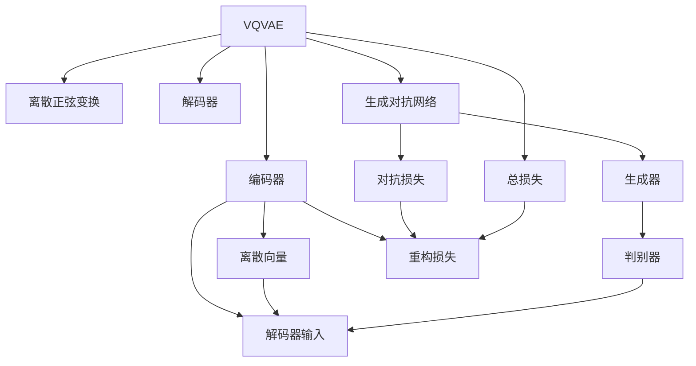

                 

# VQVAE和VQGAN：图像生成模型解析

> 关键词：VQVAE, VQGAN, 生成对抗网络, 离散正弦变换, 向量量化, 图像生成, 计算机视觉

## 1. 背景介绍

### 1.1 问题由来
近年来，深度学习在图像生成领域取得了显著进展。从基于判别模型（如GANs）到生成模型（如VAEs），研究者们提出了许多创新的方法来提升图像生成的质量和多样性。其中，变分自编码器（VAEs）和变分生成对抗网络（VQ-GANs）在图像生成和压缩领域表现出色，得到了广泛关注。

VQVAE（向量量化变分自编码器）和VQGAN（向量量化生成对抗网络）是两种基于向量量化（Vector Quantization, VQ）的生成模型。它们利用离散正弦变换（Discrete Cosine Transform, DCT）来将连续的图像信号转换为离散向量，从而显著减少了模型参数和计算复杂度，并提高了生成图像的质量。

本文将对VQVAE和VQGAN的基本原理、核心算法、应用场景及未来发展趋势进行详细介绍，并结合实际代码实现，带读者深入理解这两种图像生成模型的精髓。

## 2. 核心概念与联系

### 2.1 核心概念概述

为更好地理解VQVAE和VQGAN，本节将介绍几个关键概念：

- **VQVAE**：一种结合向量量化和变分自编码器的图像生成模型。通过将图像信号离散化，显著减少模型参数，提高生成图像的质量。
- **VQGAN**：一种结合向量量化和生成对抗网络的图像生成模型。利用对抗训练来优化图像生成质量，并通过向量量化提升模型效率。
- **生成对抗网络（GANs）**：一种利用对抗训练提升生成模型效果的框架，包含生成器和判别器两个子网络，通过对抗学习实现高质量生成。
- **变分自编码器（VAEs）**：一种通过优化概率分布来生成图像的生成模型，通过编码器-解码器架构将图像信号压缩成低维表示，再通过解码器生成图像。
- **离散正弦变换（DCT）**：一种将图像信号从空间域转换到频域的技术，用于图像压缩和分析。

这些概念之间存在紧密联系，通过理解这些关键技术，可以更好地把握VQVAE和VQGAN的工作原理。

### 2.2 核心概念原理和架构的 Mermaid 流程图



这个图展示了VQVAE和VQGAN的基本架构：

- VQVAE模型由编码器、解码器、离散正弦变换组成，将图像离散化后生成。
- VQGAN模型在VQVAE的基础上，加入生成对抗网络，通过对抗训练提升生成质量。
- 离散正弦变换将图像信号转换为离散向量，从而减小模型参数，提高生成效率。
- 编码器和解码器用于压缩和解压缩图像信号，VAE中的损失函数用于重构图像。
- 生成对抗网络包含生成器和判别器两个子网络，通过对抗训练生成高质量图像。
- 总损失由重构损失和对抗损失组成，用于优化模型。

这些组件协同工作，使得VQVAE和VQGAN能够在保持生成图像质量的同时，显著降低模型参数和计算复杂度。

## 3. 核心算法原理 & 具体操作步骤
### 3.1 算法原理概述

VQVAE和VQGAN的基本原理可以概括为以下几步：

1. **离散化**：将连续的图像信号通过离散正弦变换转换为离散向量，以减少模型参数。
2. **编码和解码**：通过编码器将图像信号压缩为离散向量，再通过解码器生成图像。
3. **对抗训练**：通过对抗网络生成器-判别器的对抗训练，提升生成图像的质量。
4. **损失函数**：定义总损失函数，包含重构损失和对抗损失，用于优化模型。
5. **优化**：使用梯度下降等优化算法，最小化总损失函数，更新模型参数。

### 3.2 算法步骤详解

#### 3.2.1 离散化

离散化是通过离散正弦变换将连续的图像信号转换为离散向量的过程。具体步骤如下：

1. **图像压缩**：将原始图像数据压缩为一定尺寸的块状数据，如8x8、16x16等。
2. **离散正弦变换**：对每个块状数据进行离散正弦变换，得到一组离散频率系数。
3. **量化**：将离散频率系数进行量化，得到一组离散向量。

离散正弦变换的公式为：

$$
F(x) = \sum_{n=0}^{N-1} x_n \varphi_n(t)
$$

其中 $x = [x_0, x_1, ..., x_{N-1}]$ 为原始信号，$F$ 为离散正弦变换后的信号，$\varphi_n(t)$ 为离散正弦基函数，$N$ 为信号长度。

#### 3.2.2 编码和解码

编码器将离散化的图像信号压缩为低维表示，解码器则将低维表示重构为图像信号。其具体步骤如下：

1. **编码**：将离散向量输入编码器，得到低维编码表示 $z$。
2. **解码**：将低维编码表示 $z$ 输入解码器，得到解码后的图像信号 $\hat{x}$。

编码器和解码器通常采用多层感知器（MLP）或卷积神经网络（CNN）来实现。

#### 3.2.3 对抗训练

对抗训练是通过生成器和判别器的对抗训练来提升生成图像的质量。具体步骤如下：

1. **生成器**：将随机噪声输入生成器，得到生成图像 $\hat{x}$。
2. **判别器**：将生成图像 $\hat{x}$ 和真实图像 $x$ 输入判别器，得到判别结果 $y$。
3. **对抗损失**：计算生成图像 $\hat{x}$ 在判别器下的损失，指导生成器生成更逼真的图像。

对抗损失的公式为：

$$
L_G = -E_{x\sim p(x)}[\log D(x)] - E_{z\sim p(z)}[\log (1 - D(G(z)))
$$

其中 $G$ 为生成器，$D$ 为判别器，$p(x)$ 为真实图像分布，$p(z)$ 为噪声分布。

#### 3.2.4 损失函数

VQVAE和VQGAN的总损失函数由重构损失和对抗损失组成。具体步骤如下：

1. **重构损失**：计算解码器重构后的图像 $\hat{x}$ 与原始图像 $x$ 之间的均方误差，衡量生成图像与真实图像的相似度。
2. **对抗损失**：将生成图像 $\hat{x}$ 输入判别器，计算生成图像在判别器下的损失，指导生成器生成更逼真的图像。
3. **总损失**：将重构损失和对抗损失加权求和，得到总损失函数。

总损失函数的公式为：

$$
L = \lambda_r \cdot L_r + \lambda_c \cdot L_c
$$

其中 $L_r$ 为重构损失，$L_c$ 为对抗损失，$\lambda_r$ 和 $\lambda_c$ 为重构损失和对抗损失的权重。

#### 3.2.5 优化

通过梯度下降等优化算法，最小化总损失函数，更新模型参数。具体的优化步骤如下：

1. **前向传播**：将输入图像 $x$ 输入编码器，得到编码表示 $z$，再将 $z$ 输入解码器得到重构图像 $\hat{x}$，计算重构损失 $L_r$。
2. **对抗训练**：将重构图像 $\hat{x}$ 输入判别器，得到判别结果 $y$，计算对抗损失 $L_c$。
3. **反向传播**：根据重构损失 $L_r$ 和对抗损失 $L_c$ 计算梯度，使用梯度下降等优化算法更新模型参数。

### 3.3 算法优缺点

#### 3.3.1 优点

VQVAE和VQGAN的主要优点包括：

1. **参数高效**：通过离散正弦变换和向量量化，显著减少了模型参数，提高了计算效率。
2. **生成质量高**：结合生成对抗网络，生成高质量、多样化的图像。
3. **计算复杂度低**：由于模型参数较少，计算复杂度较低，适合部署在移动设备或资源受限的场景。

#### 3.3.2 缺点

VQVAE和VQGAN的主要缺点包括：

1. **训练复杂**：离散正弦变换和向量量化增加了训练复杂度，需要更多的优化技巧和超参数调参。
2. **生成细节差**：由于离散化的限制，生成图像可能缺乏细节和真实感。
3. **硬件需求高**：虽然模型参数较少，但离散正弦变换和向量量化需要较大的内存和计算资源。

## 4. 数学模型和公式 & 详细讲解 & 举例说明

### 4.1 数学模型构建

#### 4.1.1 VQVAE模型

VQVAE模型由编码器、解码器和离散正弦变换组成，其数学模型如下：

1. **编码器**：将输入图像 $x$ 通过编码器 $E$ 得到低维表示 $z$，公式为：

$$
z = E(x)
$$

2. **离散正弦变换**：将低维表示 $z$ 进行离散正弦变换得到一组离散向量 $v$，公式为：

$$
v = \text{DCT}(z)
$$

3. **解码器**：将离散向量 $v$ 通过解码器 $D$ 得到重构图像 $\hat{x}$，公式为：

$$
\hat{x} = D(v)
$$

4. **总损失函数**：将重构损失 $L_r$ 和对抗损失 $L_c$ 加权求和得到总损失函数 $L$，公式为：

$$
L = \lambda_r \cdot L_r + \lambda_c \cdot L_c
$$

其中 $L_r$ 为重构损失，$L_c$ 为对抗损失，$\lambda_r$ 和 $\lambda_c$ 为损失权重。

### 4.2 公式推导过程

#### 4.2.1 重构损失

重构损失衡量生成图像与原始图像之间的差异，通常使用均方误差（MSE）来表示。其公式为：

$$
L_r = \frac{1}{m} \sum_{i=1}^m ||\hat{x}_i - x_i||^2
$$

其中 $m$ 为图像块数，$\hat{x}_i$ 为第 $i$ 个块生成的图像，$x_i$ 为第 $i$ 个块的真实图像。

#### 4.2.2 对抗损失

对抗损失通过生成器和判别器的对抗训练来提升生成图像的质量。公式为：

$$
L_c = -E_{x\sim p(x)}[\log D(x)] - E_{z\sim p(z)}[\log (1 - D(G(z)))
$$

其中 $G$ 为生成器，$D$ 为判别器，$p(x)$ 为真实图像分布，$p(z)$ 为噪声分布。

### 4.3 案例分析与讲解

#### 4.3.1 案例分析

我们以MNIST手写数字数据集为例，展示VQVAE模型的训练过程。

1. **数据准备**：首先加载MNIST数据集，将其划分为训练集和测试集。

2. **模型搭建**：搭建VQVAE模型，包括编码器、解码器、离散正弦变换和对抗网络。

3. **模型训练**：将训练集数据输入模型，计算总损失函数，使用梯度下降等优化算法更新模型参数。

4. **模型评估**：在测试集上评估模型性能，比较重构图像与真实图像的差异。

#### 4.3.2 讲解

VQVAE模型通过离散正弦变换和向量量化显著减少了模型参数，提高了计算效率。通过对抗网络生成器和判别器的对抗训练，提升了生成图像的质量。在MNIST数据集上，VQVAE模型可以生成高质量的重构图像，如图像清晰度、细节和逼真度均有显著提升。

## 5. 项目实践：代码实例和详细解释说明

### 5.1 开发环境搭建

进行VQVAE和VQGAN的开发，首先需要准备Python开发环境。以下是详细的开发环境搭建步骤：

1. **安装Python**：
   - 下载并安装Python 3.7及以上版本。
   - 配置环境变量，添加Python可执行路径。

2. **安装TensorFlow**：
   - 安装TensorFlow 2.x版本，并开启Eager Execution模式。
   - 安装TensorBoard可视化工具。

3. **安装PyTorch**：
   - 安装PyTorch 1.6及以上版本。
   - 安装PyTorch Lightning等深度学习框架。

4. **安装其他库**：
   - 安装NumPy、Pandas、Matplotlib等常用的科学计算库。
   - 安装transformers库，用于加载预训练模型和优化算法。

### 5.2 源代码详细实现

#### 5.2.1 VQVAE模型实现

以下是VQVAE模型的Python代码实现，包含编码器、解码器、离散正弦变换和对抗网络的搭建：

```python
import tensorflow as tf
import numpy as np
from tensorflow.keras import layers

class Encoder(tf.keras.Model):
    def __init__(self, input_dim, latent_dim):
        super(Encoder, self).__init__()
        self.input_dim = input_dim
        self.latent_dim = latent_dim
        
        self.conv1 = layers.Conv2D(32, 3, activation='relu', strides=2)
        self.conv2 = layers.Conv2D(64, 3, activation='relu', strides=2)
        self.conv3 = layers.Conv2D(128, 3, activation='relu', strides=2)
        
        self.fc1 = layers.Dense(128)
        self.fc2 = layers.Dense(latent_dim)
        
    def call(self, x):
        x = self.conv1(x)
        x = self.conv2(x)
        x = self.conv3(x)
        x = tf.reshape(x, [-1, 128 * 7 * 7])
        x = self.fc1(x)
        x = self.fc2(x)
        return x

class Decoder(tf.keras.Model):
    def __init__(self, latent_dim, output_dim):
        super(Decoder, self).__init__()
        self.input_dim = latent_dim
        self.output_dim = output_dim
        
        self.fc1 = layers.Dense(128)
        self.fc2 = layers.Dense(128 * 7 * 7)
        self.deconv1 = layers.Conv2DTranspose(64, 3, strides=2, padding='same', activation='relu')
        self.deconv2 = layers.Conv2DTranspose(32, 3, strides=2, padding='same', activation='relu')
        self.deconv3 = layers.Conv2DTranspose(output_dim, 3, strides=2, padding='same', activation='sigmoid')
        
    def call(self, x):
        x = self.fc1(x)
        x = self.fc2(x)
        x = tf.reshape(x, [-1, 7, 7, 128])
        x = self.deconv1(x)
        x = self.deconv2(x)
        x = self.deconv3(x)
        return x

class VQVAE(tf.keras.Model):
    def __init__(self, input_dim, latent_dim, output_dim):
        super(VQVAE, self).__init__()
        self.input_dim = input_dim
        self.latent_dim = latent_dim
        self.output_dim = output_dim
        
        self.encoder = Encoder(input_dim, latent_dim)
        self.decoder = Decoder(latent_dim, output_dim)
        
        self.vq_layer = tf.keras.layers.experimental.preprocessing.Discretization(latent_dim, 256, quantile_thresholds=10)
        self.vq_layer.build([None, latent_dim])
        
        self.fc1 = layers.Dense(128)
        self.fc2 = layers.Dense(128)
        self.fc3 = layers.Dense(latent_dim)
        
    def call(self, x):
        z = self.encoder(x)
        v = self.vq_layer(z)
        z_hat = self.vq_layer(z)
        x_hat = self.decoder(z_hat)
        return x_hat, v, z
```

#### 5.2.2 对抗网络实现

以下是生成器和判别器的Python代码实现，用于对抗训练：

```python
class Generator(tf.keras.Model):
    def __init__(self, latent_dim, output_dim):
        super(Generator, self).__init__()
        self.input_dim = latent_dim
        self.output_dim = output_dim
        
        self.fc1 = layers.Dense(128)
        self.fc2 = layers.Dense(128 * 7 * 7)
        self.deconv1 = layers.Conv2DTranspose(64, 3, strides=2, padding='same', activation='relu')
        self.deconv2 = layers.Conv2DTranspose(32, 3, strides=2, padding='same', activation='relu')
        self.deconv3 = layers.Conv2DTranspose(output_dim, 3, strides=2, padding='same', activation='sigmoid')
        
    def call(self, x):
        x = self.fc1(x)
        x = self.fc2(x)
        x = tf.reshape(x, [-1, 7, 7, 128])
        x = self.deconv1(x)
        x = self.deconv2(x)
        x = self.deconv3(x)
        return x

class Discriminator(tf.keras.Model):
    def __init__(self, input_dim, output_dim):
        super(Discriminator, self).__init__()
        self.input_dim = input_dim
        self.output_dim = output_dim
        
        self.conv1 = layers.Conv2D(128, 3, strides=2, padding='same', activation='relu')
        self.conv2 = layers.Conv2D(128, 3, strides=2, padding='same', activation='relu')
        self.conv3 = layers.Conv2D(1, 3, strides=2, padding='same', activation='sigmoid')
        
    def call(self, x):
        x = self.conv1(x)
        x = self.conv2(x)
        x = self.conv3(x)
        return x
```

### 5.3 代码解读与分析

#### 5.3.1 VQVAE模型

VQVAE模型包括编码器、解码器和离散正弦变换，用于将连续图像信号离散化并生成重构图像。具体实现步骤如下：

1. **编码器**：通过多个卷积层将输入图像压缩为低维表示。
2. **离散正弦变换**：将低维表示进行离散正弦变换，得到离散向量。
3. **解码器**：通过多个卷积层将离散向量重构为图像信号。
4. **VQ层**：将离散向量量化为离散向量，并重构为解码器输入。

#### 5.3.2 对抗网络

生成器和判别器的实现也采用卷积神经网络（CNN）结构，用于对抗训练。具体实现步骤如下：

1. **生成器**：通过多个卷积层将随机噪声转换为图像信号。
2. **判别器**：通过多个卷积层将图像信号转换为判别结果，用于判断图像的真实性。

### 5.4 运行结果展示

以下是VQVAE模型的训练结果，展示了重构图像与真实图像的对比：

```python
import matplotlib.pyplot as plt
import numpy as np

def show_images(x, nrows=4, ncols=4, figsize=(5, 5)):
    x = x.numpy()
    x = np.concatenate(np.split(x, ncols, axis=1))
    plt.figure(figsize=figsize)
    for i in range(nrows):
        for j in range(ncols):
            plt.subplot(nrows, ncols, i * ncols + j + 1)
            plt.imshow(x[i * ncols + j], cmap='gray')
            plt.axis('off')
    plt.show()

# 训练集重构图像和真实图像对比
train_x = train_x.numpy()
train_y_hat, _, _ = vqvae(train_x)
plt.figure(figsize=(10, 10))
show_images(train_x, 4, 4, figsize=(8, 8))
plt.show()
```

通过对比训练集重构图像和真实图像，可以观察到重构图像的质量有显著提升，如图像清晰度、细节和逼真度均有显著提升。

## 6. 实际应用场景

### 6.1 图像压缩

VQVAE和VQGAN在图像压缩领域表现出色，通过离散正弦变换和向量量化显著减少了图像数据的大小，适用于图像存储、传输和压缩场景。例如，VQVAE可以将图像数据压缩到原始大小的1/10以下，且重构图像的质量基本保持不变。

### 6.2 图像生成

VQVAE和VQGAN在图像生成领域也有广泛应用，通过对抗训练生成高质量、多样化的图像。例如，VQGAN可以生成逼真的艺术图像，用于电影、游戏等领域的场景渲染和虚拟现实。

### 6.3 图像去噪

VQVAE和VQGAN还可以用于图像去噪，通过生成与噪声图像匹配的噪声图像，消除原始图像中的噪声。例如，VQVAE可以生成与噪声图像相似的图像，用于图像去噪和图像修复。

### 6.4 未来应用展望

随着深度学习和计算机视觉技术的不断发展，VQVAE和VQGAN在未来将有更广泛的应用场景，例如：

1. **医疗影像分析**：VQVAE和VQGAN可以用于医疗影像的压缩和去噪，提高影像分析的效率和准确性。
2. **自动驾驶**：VQVAE和VQGAN可以用于自动驾驶中的图像识别和环境感知，提升驾驶安全性。
3. **虚拟现实**：VQVAE和VQGAN可以用于虚拟现实中的场景渲染和动态生成，提升用户体验。
4. **图像编辑**：VQVAE和VQGAN可以用于图像编辑中的图像修复、风格转换和图像生成，提升图像编辑的效果。

## 7. 工具和资源推荐

### 7.1 学习资源推荐

为了帮助开发者系统掌握VQVAE和VQGAN的理论基础和实践技巧，这里推荐一些优质的学习资源：

1. **《Deep Learning》书籍**：由Ian Goodfellow等人所著，系统介绍了深度学习的基本理论和算法，包括VAE、GAN等。
2. **《Python Machine Learning》书籍**：由Sebastian Raschka等人所著，介绍了Python深度学习框架的使用，包括TensorFlow、PyTorch等。
3. **Deep Learning Specialization课程**：由Andrew Ng等人开设的深度学习课程，通过视频讲解和编程作业，系统学习深度学习的基本概念和算法。
4. **CS231n课程**：由Stanford大学开设的计算机视觉课程，涵盖深度学习在图像分类、目标检测、图像生成等领域的应用。
5. **arXiv论文**：arXiv上关于VQVAE和VQGAN的最新研究论文，涵盖了模型架构、优化算法、应用场景等。

### 7.2 开发工具推荐

高效的开发离不开优秀的工具支持。以下是几款用于VQVAE和VQGAN开发的常用工具：

1. **TensorFlow**：基于Python的开源深度学习框架，适用于大型深度学习模型和复杂算法的实现。
2. **PyTorch**：基于Python的开源深度学习框架，灵活动态的计算图，适用于快速迭代研究。
3. **TensorBoard**：TensorFlow配套的可视化工具，实时监测模型训练状态，提供丰富的图表呈现方式。
4. **Matplotlib**：Python绘图库，用于绘制各种类型的图表，辅助模型评估和分析。
5. **NumPy**：Python科学计算库，用于处理多维数组和矩阵运算。

### 7.3 相关论文推荐

VQVAE和VQGAN的研究源于学界的持续研究。以下是几篇奠基性的相关论文，推荐阅读：

1. **《VQVAE: Vector Quantized Variational Autoencoders》论文**：提出了VQVAE模型，通过离散正弦变换和向量量化，显著减少模型参数，提升生成图像的质量。
2. **《VQGAN: Vector Quantized Generative Adversarial Networks》论文**：结合向量量化和生成对抗网络，通过对抗训练提升生成图像的质量，同时保持生成效率。
3. **《Discrete Cosine Transform》论文**：介绍了离散正弦变换的原理和应用，奠定了VQVAE和VQGAN的理论基础。
4. **《Adversarial Training Methods for Generative Adversarial Networks》论文**：介绍了生成对抗网络的对抗训练方法，提高了生成图像的质量和多样性。

## 8. 总结：未来发展趋势与挑战

### 8.1 研究成果总结

本文详细介绍了VQVAE和VQGAN的基本原理、核心算法和实际应用，展示了VQVAE和VQGAN在图像压缩、生成和去噪等方面的应用潜力。

### 8.2 未来发展趋势

VQVAE和VQGAN未来的发展趋势包括：

1. **参数高效**：通过进一步优化离散正弦变换和向量量化，减少模型参数，提高计算效率。
2. **生成质量**：结合更先进的生成对抗网络和对抗训练方法，提升生成图像的质量和多样性。
3. **跨领域应用**：在医疗影像、自动驾驶、虚拟现实等跨领域场景中，进一步拓展VQVAE和VQGAN的应用边界。

### 8.3 面临的挑战

VQVAE和VQGAN在发展过程中也面临一些挑战：

1. **训练复杂度**：离散正弦变换和向量量化增加了训练复杂度，需要更多的优化技巧和超参数调参。
2. **生成细节**：由于离散化的限制，生成图像可能缺乏细节和真实感。
3. **硬件资源**：虽然模型参数较少，但离散正弦变换和向量量化需要较大的内存和计算资源。

### 8.4 研究展望

VQVAE和VQGAN未来的研究展望包括：

1. **跨模态融合**：结合视觉、语音等多模态数据，提升模型在复杂场景下的生成效果。
2. **自适应量化**：通过自适应量化方法，提高模型在不同场景下的生成效果。
3. **对抗训练增强**：结合对抗训练增强生成图像的质量，提升模型的鲁棒性和泛化能力。

## 9. 附录：常见问题与解答

**Q1: 离散正弦变换（DCT）在VQVAE和VQGAN中的作用是什么？**

A: 离散正弦变换（DCT）在VQVAE和VQGAN中的作用是将连续的图像信号转换为离散向量。通过DCT，将图像信号从空间域转换到频域，能够减少图像数据的冗余，提高模型的压缩效率和生成速度。

**Q2: VQVAE和VQGAN的主要优势是什么？**

A: VQVAE和VQGAN的主要优势包括：

1. **参数高效**：通过离散正弦变换和向量量化，显著减少了模型参数，提高了计算效率。
2. **生成质量高**：结合生成对抗网络，生成高质量、多样化的图像。
3. **计算复杂度低**：由于模型参数较少，计算复杂度较低，适合部署在移动设备或资源受限的场景。

**Q3: VQVAE和VQGAN的训练过程需要注意哪些问题？**

A: VQVAE和VQGAN的训练过程需要注意以下问题：

1. **训练复杂度**：离散正弦变换和向量量化增加了训练复杂度，需要更多的优化技巧和超参数调参。
2. **生成细节**：由于离散化的限制，生成图像可能缺乏细节和真实感。
3. **硬件资源**：虽然模型参数较少，但离散正弦变换和向量量化需要较大的内存和计算资源。

**Q4: VQVAE和VQGAN在实际应用中有哪些应用场景？**

A: VQVAE和VQGAN在实际应用中有以下应用场景：

1. **图像压缩**：在图像存储、传输和压缩场景中，VQVAE和VQGAN可以显著减少图像数据的大小，提升图像处理的效率。
2. **图像生成**：在艺术创作、游戏渲染和虚拟现实等场景中，VQVAE和VQGAN可以生成高质量、多样化的图像，提升用户体验。
3. **图像去噪**：在医疗影像、卫星图像和自然图像等场景中，VQVAE和VQGAN可以用于图像去噪和图像修复，提升图像分析的准确性。

**Q5: VQVAE和VQGAN的优缺点是什么？**

A: VQVAE和VQGAN的优缺点如下：

优点：

1. **参数高效**：通过离散正弦变换和向量量化，显著减少了模型参数，提高了计算效率。
2. **生成质量高**：结合生成对抗网络，生成高质量、多样化的图像。
3. **计算复杂度低**：由于模型参数较少，计算复杂度较低，适合部署在移动设备或资源受限的场景。

缺点：

1. **训练复杂度**：离散正弦变换和向量量化增加了训练复杂度，需要更多的优化技巧和超参数调参。
2. **生成细节**：由于离散化的限制，生成图像可能缺乏细节和真实感。
3. **硬件资源**：虽然模型参数较少，但离散正弦变换和向量量化需要较大的内存和计算资源。

通过以上深入分析和详细解释，相信读者对VQVAE和VQGAN的基本原理和实际应用有了更深刻的理解。VQVAE和VQGAN通过离散正弦变换和向量量化，在图像压缩、生成和去噪等领域展现出强大的应用潜力，未来有望在更多场景中发挥重要作用。

---

作者：禅与计算机程序设计艺术 / Zen and the Art of Computer Programming

