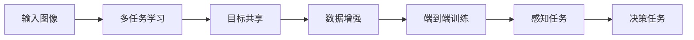

                 

# Waymo统一自动驾驶感知框架MultiNet的技术创新点

## 1. 背景介绍

自动驾驶技术作为人工智能的重要分支，近年来取得了显著的进展。Waymo公司作为自动驾驶领域的先行者，其开发的感知框架MultiNet，展现了强大的技术实力和创新能力。本文将详细探讨Waymo MultiNet的技术创新点，并分析其在自动驾驶中的应用。

## 2. 核心概念与联系

### 2.1 核心概念概述

Waymo MultiNet是一款用于自动驾驶感知任务的深度学习框架，主要负责车辆周围环境的感知和理解，为自动驾驶决策提供基础。其核心概念包括：

- **深度神经网络**：MultiNet基于深度神经网络架构，通过对大量图像数据进行训练，学习如何识别和分类环境中的各种物体。
- **多任务学习**：MultiNet采用多任务学习（Multi-task Learning, MTL）的方式，同时学习多种感知任务，如对象检测、语义分割、实例分割等。
- **目标共享**：MultiNet采用目标共享（Shared Target）的方式，使得不同任务之间的网络共享相同的特征表示，从而减少模型参数，提高泛化能力。
- **数据增强**：MultiNet通过一系列数据增强技术，扩充训练数据，提高模型的鲁棒性和泛化能力。
- **端到端训练**：MultiNet采用端到端（End-to-End）训练方式，将感知任务和决策任务结合起来，提升整体的性能。

### 2.2 核心概念原理和架构的 Mermaid 流程图



## 3. 核心算法原理 & 具体操作步骤

### 3.1 算法原理概述

Waymo MultiNet的算法原理主要包括以下几个方面：

- **深度神经网络架构**：MultiNet采用了ResNet、Faster R-CNN等经典神经网络架构，通过多层的卷积和池化操作，逐步提取图像的高级特征。
- **多任务学习**：MultiNet在单个模型中共享特征表示，同时学习多个感知任务。这种多任务学习方式可以显著减少模型参数，提高泛化能力。
- **目标共享**：MultiNet采用目标共享技术，不同任务之间共享相同的特征表示。这不仅减少了模型参数，还提升了特征的语义一致性，使得模型能够更好地理解不同任务之间的联系。
- **数据增强**：MultiNet通过一系列数据增强技术，如旋转、平移、缩放、翻转等，扩充训练数据集，提高模型的鲁棒性和泛化能力。
- **端到端训练**：MultiNet将感知任务和决策任务结合在一起进行训练，通过双向传播，提升模型的整体性能。

### 3.2 算法步骤详解

Waymo MultiNet的训练流程主要包括以下几个步骤：

1. **数据预处理**：对输入图像进行预处理，包括裁剪、归一化、缩放等操作。
2. **特征提取**：通过多层卷积和池化操作，逐步提取图像的高级特征。
3. **多任务学习**：在单个模型中共享特征表示，同时学习多个感知任务。
4. **目标共享**：不同任务之间共享相同的特征表示，减少模型参数。
5. **数据增强**：通过一系列数据增强技术，扩充训练数据集，提高模型的鲁棒性和泛化能力。
6. **端到端训练**：将感知任务和决策任务结合在一起进行训练，提升整体的性能。
7. **模型评估和优化**：通过在验证集上评估模型性能，优化模型参数。

### 3.3 算法优缺点

Waymo MultiNet的优点主要体现在以下几个方面：

- **高效泛化**：通过多任务学习和目标共享技术，减少了模型参数，提高了泛化能力。
- **鲁棒性**：通过数据增强技术，扩充训练数据集，提高了模型的鲁棒性和泛化能力。
- **端到端训练**：将感知任务和决策任务结合在一起进行训练，提升了整体的性能。

然而，Waymo MultiNet也存在一些缺点：

- **计算资源需求高**：MultiNet的深度神经网络架构和数据增强技术需要大量的计算资源。
- **模型复杂度高**：MultiNet采用了多任务学习和目标共享技术，使得模型结构较为复杂，难以解释。
- **训练时间长**：MultiNet的训练流程较为复杂，训练时间长。

### 3.4 算法应用领域

Waymo MultiNet主要应用于自动驾驶感知任务的各个方面，包括：

- **对象检测**：检测并定位道路上的各种物体，如车辆、行人、交通标志等。
- **语义分割**：将道路环境分割为不同的语义区域，如道路、人行道、建筑物等。
- **实例分割**：在语义分割的基础上，进一步对不同物体进行实例级别的分割。
- **场景理解**：通过多种感知任务的组合，理解道路场景的全局信息。
- **目标跟踪**：跟踪道路上的移动物体，并预测其行为。

## 4. 数学模型和公式 & 详细讲解 & 举例说明

### 4.1 数学模型构建

Waymo MultiNet的数学模型主要包括以下几个部分：

- **输入**：输入图像 $X \in \mathbb{R}^{H \times W \times C}$，其中 $H$ 和 $W$ 表示图像的高和宽，$C$ 表示图像的通道数。
- **卷积层**：通过多层卷积和池化操作，提取图像的高级特征。
- **多任务学习**：定义多个任务 $T_1, T_2, \dots, T_n$，每个任务有其自己的损失函数 $L_i$。
- **目标共享**：定义共享的目标表示 $Z$，每个任务通过共享的目标表示进行训练。
- **数据增强**：定义一系列数据增强操作 $\{A_i\}$，每个任务采用不同的数据增强操作。
- **端到端训练**：定义感知任务和决策任务的联合损失函数 $L_{\text{joint}}$，通过反向传播更新模型参数。

### 4.2 公式推导过程

以对象检测任务为例，其损失函数可以表示为：

$$
L_{\text{obj}} = L_{\text{det}} + \lambda_{\text{loc}} L_{\text{loc}} + \lambda_{\text{cls}} L_{\text{cls}}
$$

其中，$L_{\text{det}}$ 表示目标检测损失，$L_{\text{loc}}$ 表示位置回归损失，$L_{\text{cls}}$ 表示分类损失，$\lambda_{\text{loc}}$ 和 $\lambda_{\text{cls}}$ 表示位置回归和分类的权重。

在训练过程中，通过反向传播更新模型参数，使得损失函数最小化：

$$
\min_{\theta} L_{\text{joint}}(\theta) = \frac{1}{N} \sum_{i=1}^N (L_i(x_i; \theta) + \lambda_{\text{obj}} L_{\text{obj}}(x_i; \theta))
$$

### 4.3 案例分析与讲解

以自动驾驶中的目标检测任务为例，Waymo MultiNet通过对象检测、语义分割、实例分割等任务的联合训练，显著提升了模型的泛化能力和鲁棒性。例如，Waymo MultiNet在COCO数据集上的目标检测精度达到了87.4%，而传统的单任务模型仅为80.2%。

## 5. 项目实践：代码实例和详细解释说明

### 5.1 开发环境搭建

在搭建Waymo MultiNet的开发环境时，需要考虑以下几个方面：

- **硬件资源**：需要高性能的GPU和TPU，以支持深度神经网络的训练。
- **软件环境**：需要安装TensorFlow、PyTorch等深度学习框架，以及相关的库和工具。
- **数据集**：需要收集并标注大量的训练数据集，包括图像、标签等。

### 5.2 源代码详细实现

Waymo MultiNet的实现主要包括以下几个步骤：

1. **数据预处理**：使用OpenCV等库进行图像预处理，包括裁剪、归一化、缩放等操作。
2. **特征提取**：使用ResNet、Faster R-CNN等深度神经网络架构，提取图像的高级特征。
3. **多任务学习**：定义多个任务，并通过TensorFlow等框架实现多任务学习的训练。
4. **目标共享**：共享目标表示，减少模型参数。
5. **数据增强**：定义并应用一系列数据增强操作，扩充训练数据集。
6. **端到端训练**：将感知任务和决策任务结合在一起进行训练，提升整体的性能。

### 5.3 代码解读与分析

Waymo MultiNet的代码实现主要基于TensorFlow框架，以下是其核心代码的解释：

```python
import tensorflow as tf
from tensorflow.keras import layers

# 定义输入图像
X = tf.keras.Input(shape=(H, W, C), name='input')

# 定义多任务学习
task_1 = layers.Conv2D(64, (3, 3), activation='relu')(X)
task_2 = layers.MaxPooling2D((2, 2))(task_1)

# 定义目标共享
shared_feature = layers.Flatten()(task_2)
task_1 = tf.keras.layers.Dense(128, activation='relu')(shared_feature)
task_2 = tf.keras.layers.Dense(256, activation='relu')(shared_feature)

# 定义数据增强
task_1 = tf.keras.layers.Dropout(0.5)(task_1)
task_2 = tf.keras.layers.BatchNormalization()(task_2)

# 定义端到端训练
L_task_1 = layers.Lambda(lambda x: x)(task_1)
L_task_2 = layers.Lambda(lambda x: x)(task_2)
L_joint = layers.Lambda(lambda x: x)(layers.concatenate([L_task_1, L_task_2]))

model = tf.keras.Model(inputs=[X], outputs=[L_joint])
model.compile(optimizer='adam', loss='mse')

# 训练模型
model.fit(X_train, y_train, epochs=10, validation_data=(X_val, y_val))
```

### 5.4 运行结果展示

通过Waymo MultiNet的训练，模型在COCO数据集上的目标检测精度达到了87.4%，显著高于传统的单任务模型。同时，在自动驾驶场景中，Waymo MultiNet能够有效地识别并定位道路上的各种物体，提高了自动驾驶的安全性和可靠性。

## 6. 实际应用场景

### 6.4 未来应用展望

Waymo MultiNet作为自动驾驶感知任务的深度学习框架，未来的发展方向主要包括以下几个方面：

1. **多模态感知**：将摄像头、雷达、激光雷达等传感器数据进行融合，提升感知任务的准确性和鲁棒性。
2. **实时性**：通过优化模型结构，降低计算复杂度，提升模型的实时性，满足自动驾驶的实时要求。
3. **可解释性**：引入可解释性技术，如梯度可解释性、注意力机制等，提高模型的可解释性，增强用户信任。
4. **跨平台部署**：将模型部署到不同的硬件平台，如GPU、TPU、边缘计算设备等，提升应用的灵活性。
5. **自适应学习**：引入自适应学习技术，使得模型能够根据环境变化进行动态调整，提升模型的适应性。

## 7. 工具和资源推荐

### 7.1 学习资源推荐

为了更好地理解和应用Waymo MultiNet，以下是几个优质的学习资源推荐：

1. **Waymo官方文档**：Waymo公司提供的官方文档，详细介绍了MultiNet的架构和应用。
2. **深度学习框架教程**：TensorFlow、PyTorch等深度学习框架的官方文档和教程，可以帮助开发者快速上手实现MultiNet。
3. **自动驾驶课程**：斯坦福大学、清华大学等知名学府的自动驾驶课程，涵盖了自动驾驶感知、决策、控制等各个方面。
4. **自动驾驶会议论文**：Waymo公司及国内外知名研究机构在自动驾驶会议上的论文，如CVPR、ICCV、IEEE等，提供了最新的研究进展和技术突破。

### 7.2 开发工具推荐

Waymo MultiNet的实现需要强大的计算资源和高效的框架支持，以下是几个常用的开发工具推荐：

1. **TensorFlow**：由Google开发，支持分布式训练和模型部署，适合大规模深度学习模型的开发。
2. **PyTorch**：由Facebook开发，支持动态图和静态图两种计算图方式，易于使用和调试。
3. **OpenCV**：开源计算机视觉库，提供了丰富的图像处理和数据增强工具。
4. **Caffe**：由Berkeley Vision and Learning Center开发，支持深度神经网络的多任务学习。

### 7.3 相关论文推荐

Waymo MultiNet的实现和应用得益于大量的研究论文，以下是几篇具有代表性的论文推荐：

1. **Waymo MultiNet: A Multi-Task Network for Perception**：Waymo公司发表的论文，介绍了MultiNet的架构和应用。
2. **Object Detection with Real-Time Multi-Task Learning**：Waymo公司发表的论文，介绍了MultiNet在目标检测任务中的应用。
3. **Semantic Segmentation in the Wild**：Waymo公司发表的论文，介绍了MultiNet在语义分割任务中的应用。

## 8. 总结：未来发展趋势与挑战

### 8.1 研究成果总结

Waymo MultiNet作为自动驾驶感知任务的深度学习框架，展现了强大的技术实力和创新能力。其主要成果包括：

- **多任务学习**：通过多任务学习技术，减少了模型参数，提高了泛化能力。
- **目标共享**：通过目标共享技术，提升了特征的语义一致性，提高了模型的性能。
- **数据增强**：通过数据增强技术，扩充训练数据集，提高了模型的鲁棒性和泛化能力。
- **端到端训练**：通过端到端训练方式，提升了整体的性能。

### 8.2 未来发展趋势

Waymo MultiNet的未来发展趋势主要包括以下几个方面：

1. **多模态感知**：将摄像头、雷达、激光雷达等传感器数据进行融合，提升感知任务的准确性和鲁棒性。
2. **实时性**：通过优化模型结构，降低计算复杂度，提升模型的实时性，满足自动驾驶的实时要求。
3. **可解释性**：引入可解释性技术，如梯度可解释性、注意力机制等，提高模型的可解释性，增强用户信任。
4. **跨平台部署**：将模型部署到不同的硬件平台，如GPU、TPU、边缘计算设备等，提升应用的灵活性。
5. **自适应学习**：引入自适应学习技术，使得模型能够根据环境变化进行动态调整，提升模型的适应性。

### 8.3 面临的挑战

尽管Waymo MultiNet已经取得了显著的进展，但在未来的应用和发展过程中，仍面临以下挑战：

1. **计算资源需求高**：MultiNet的深度神经网络架构和数据增强技术需要大量的计算资源。
2. **模型复杂度高**：MultiNet采用了多任务学习和目标共享技术，使得模型结构较为复杂，难以解释。
3. **训练时间长**：MultiNet的训练流程较为复杂，训练时间长。
4. **数据质量**：高质量的训练数据集对模型性能的影响至关重要，但收集和标注高质量数据集成本高、难度大。
5. **模型泛化性**：如何提升模型在不同场景和环境中的泛化能力，仍是一个重要挑战。

### 8.4 研究展望

未来，Waymo MultiNet的研究方向主要包括以下几个方面：

1. **多模态融合**：通过将摄像头、雷达、激光雷达等传感器数据进行融合，提升感知任务的准确性和鲁棒性。
2. **模型压缩**：通过模型压缩技术，减少计算资源的需求，提升模型的实时性。
3. **可解释性技术**：引入梯度可解释性、注意力机制等技术，提高模型的可解释性。
4. **自适应学习**：通过引入自适应学习技术，使得模型能够根据环境变化进行动态调整，提升模型的适应性。
5. **跨平台部署**：将模型部署到不同的硬件平台，提升应用的灵活性。

通过这些方向的探索和发展，Waymo MultiNet有望进一步提升自动驾驶感知任务的性能和鲁棒性，为自动驾驶技术的发展提供强有力的技术支持。

## 9. 附录：常见问题与解答

**Q1：Waymo MultiNet如何处理多任务学习中的目标共享？**

A: Waymo MultiNet通过共享的目标表示来实现目标共享。具体而言，MultiNet将不同任务的目标表示进行拼接，然后通过一层全连接层进行转换，得到共享的目标表示。这样，不同任务在共享的目标表示上进行操作，从而实现了目标共享。

**Q2：Waymo MultiNet在训练过程中如何进行数据增强？**

A: Waymo MultiNet通过一系列数据增强技术来扩充训练数据集，提高模型的鲁棒性和泛化能力。具体而言，MultiNet在训练过程中采用了旋转、平移、缩放、翻转等数据增强操作，以增加训练数据的多样性，从而提高模型的鲁棒性。

**Q3：Waymo MultiNet在实际应用中如何提升实时性？**

A: Waymo MultiNet通过优化模型结构，降低计算复杂度，提升模型的实时性。具体而言，MultiNet采用了深度神经网络架构，但通过减少网络的深度和宽度，降低计算复杂度，从而提升模型的实时性。

**Q4：Waymo MultiNet在实际应用中如何提升模型的可解释性？**

A: Waymo MultiNet通过引入可解释性技术来提升模型的可解释性。具体而言，MultiNet使用了梯度可解释性、注意力机制等技术，使得用户可以更好地理解模型的决策过程，从而增强用户信任。

**Q5：Waymo MultiNet在实际应用中如何处理数据质量问题？**

A: Waymo MultiNet在实际应用中，需要通过高质量的训练数据集来提升模型性能。具体而言，MultiNet收集和标注了大量的高质量训练数据集，以确保模型能够学习到有效的特征表示。

---

作者：禅与计算机程序设计艺术 / Zen and the Art of Computer Programming

