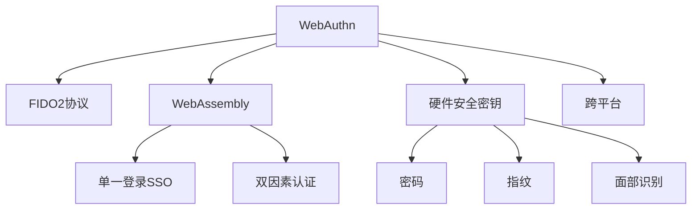

                 

# WebAuthn 的详细应用

> 关键词：WebAuthn, FIDO2, 身份认证, 密码管理器, 双因素认证, WebAssembly

## 1. 背景介绍

### 1.1 问题由来
在当今互联网时代，身份验证的安全性和便利性是用户和开发者都高度关注的问题。传统的用户名和密码组合不仅容易被盗，还难以适应多设备、多场景的用户体验需求。为了解决这些问题，WebAuthn应运而生，它是一种基于标准化的Web身份验证技术，旨在提供更加安全、便捷的身份认证解决方案。

WebAuthn全称为Web Authentication，由FIDO Alliance（一个致力于推动统一身份验证标准的非营利组织）推出，旨在通过硬件设备（如U2F密钥、FIDO2密钥）和软件机制（如WebAssembly）实现安全的身份验证方式。WebAuthn基于FIDO2协议（即Fast Identity Online 2），与之前的FIDO1协议相比，FIDO2提供了更加灵活和强大的安全认证功能。

### 1.2 问题核心关键点
WebAuthn的核心在于将身份验证过程与浏览器和操作系统深度集成，从而提供更可靠、更便捷的用户体验。WebAuthn通过利用FIDO2协议，实现了以下关键功能：

1. **硬件安全密钥**：利用硬件设备生成、存储和管理密钥，增强安全性。
2. **单一登录(SSO)**：支持跨应用的单点登录，提升用户体验。
3. **双因素认证**：结合密码、指纹、面部识别等多种因素进行认证，增加安全性。
4. **WebAssembly支持**：通过WebAssembly实现浏览器端的加密和解密操作，提升性能和安全性。

WebAuthn的引入，使得用户能够更方便地在不同的设备和应用之间进行身份验证，同时也为开发者提供了一种高效、安全的方式来处理用户认证。

### 1.3 问题研究意义
研究WebAuthn的应用，对于提升互联网安全、便利性和用户体验，具有重要意义：

1. **提升安全性**：通过硬件密钥和双因素认证，WebAuthn提供了比传统用户名和密码更高的安全性。
2. **增强便利性**：支持跨应用的单点登录，减少了用户在不同应用间来回输入凭证的麻烦。
3. **优化用户体验**：结合WebAssembly的强大性能，WebAuthn提供了更加流畅、高效的用户体验。
4. **推动标准化**：WebAuthn是FIDO2协议的一部分，其应用推动了身份验证标准化的进程，有利于构建更加安全、一致的互联网生态。
5. **支持跨平台**：WebAuthn支持在各种操作系统和浏览器上运行，提供了跨平台的安全认证解决方案。

WebAuthn技术的应用，不仅有助于解决身份验证中的安全隐患，还为开发者提供了一种简单、高效的身份验证机制，助力Web应用的快速发展。

## 2. 核心概念与联系

### 2.1 核心概念概述

为更好地理解WebAuthn的核心概念，本节将介绍几个密切相关的核心概念：

- **WebAuthn**：一种基于标准化的Web身份验证技术，旨在提供更安全、便捷的身份认证解决方案。
- **FIDO2协议**：Fast Identity Online 2，是WebAuthn的底层协议，提供了一种安全的身份验证机制。
- **WebAssembly**：一种在Web浏览器中运行的低级字节码，提供了高性能的加密和解密功能。
- **单一登录(SSO)**：跨应用的单点登录，用户只需登录一次即可访问多个应用。
- **双因素认证**：结合密码、指纹、面部识别等多种因素进行认证，增加安全性。
- **硬件安全密钥**：利用硬件设备生成、存储和管理密钥，增强安全性。

这些核心概念之间的逻辑关系可以通过以下Mermaid流程图来展示：



这个流程图展示了WebAuthn的核心概念及其之间的关系：

1. WebAuthn利用FIDO2协议进行安全认证。
2. WebAssembly提供高性能的加密和解密功能，是WebAuthn的重要组成部分。
3. SSO和双因素认证提高了身份验证的安全性和便利性。
4. 硬件安全密钥利用物理设备增强安全性。
5. WebAuthn支持跨平台的应用，提高了通用性。

这些概念共同构成了WebAuthn的身份验证框架，使其能够提供安全、便捷、高效的用户身份验证。

## 3. 核心算法原理 & 具体操作步骤
### 3.1 算法原理概述

WebAuthn的核心算法原理基于FIDO2协议，其实现了一个安全的身份验证流程。该流程主要包括以下几个步骤：

1. **用户认证请求**：当用户访问受保护的页面时，浏览器向用户发送认证请求，提示用户选择身份验证方式。
2. **选择身份验证器**：用户选择已注册的身份验证器（如U2F密钥、FIDO2密钥）进行身份验证。
3. **生成挑战**：浏览器生成一个挑战（Challenge），用于后续的加密和验证操作。
4. **身份验证器响应**：身份验证器接收到挑战后，生成响应（Response），包括加密后的挑战、私钥和证书。
5. **验证响应**：浏览器验证响应，如果响应合法，则认为用户认证成功。

通过这些步骤，WebAuthn实现了安全、便捷的身份验证，支持跨应用的单点登录和多因素认证。

### 3.2 算法步骤详解

以下详细讲解WebAuthn的认证流程，包括各步骤的具体操作：

**步骤1: 用户认证请求**

当用户访问需要身份验证的页面时，浏览器向用户发送认证请求，提示用户选择身份验证方式。这个请求包括：

- 访问页面的URL。
- 认证方式选项（如密码、U2F密钥、FIDO2密钥）。
- 是否启用双因素认证。

用户选择后，浏览器将发送一个认证请求到服务器。

**步骤2: 生成挑战**

服务器接收到认证请求后，生成一个挑战（Challenge），挑战通常是一个随机字符串。挑战用于后续的加密和验证操作，确保身份验证的安全性。

**步骤3: 身份验证器响应**

身份验证器接收到挑战后，生成响应（Response），包括加密后的挑战、私钥和证书。响应中的私钥和证书用于后续的验证操作。

响应生成的过程如下：

- 身份验证器生成一个私钥和公钥对。
- 私钥用于生成加密后的挑战。
- 公钥用于生成证书。
- 响应中包含加密后的挑战、私钥和证书。

**步骤4: 验证响应**

浏览器接收到身份验证器的响应后，验证响应的合法性。验证过程包括：

- 检查响应中的证书是否有效，并与服务器公开密钥进行比对。
- 使用响应中的私钥解密加密后的挑战。
- 将解密后的挑战与服务器生成的挑战进行比对，确保响应未被篡改。

如果响应合法，浏览器向服务器发送认证成功的消息，表示用户认证成功。

### 3.3 算法优缺点

WebAuthn的优点在于其安全性、便捷性和高效性：

- **安全性高**：利用硬件设备生成和管理密钥，结合双因素认证，提高了身份验证的安全性。
- **便捷性强**：支持跨应用的单点登录，减少了用户在不同应用间来回输入凭证的麻烦。
- **高效性好**：通过WebAssembly实现浏览器端的加密和解密操作，提供了高性能的加密和解密功能。

WebAuthn的缺点在于其复杂性和兼容性问题：

- **复杂度高**：WebAuthn涉及多个硬件设备和软件组件，实现过程较为复杂。
- **兼容性差**：WebAuthn需要浏览器和操作系统的支持，不同浏览器和操作系统之间的兼容性问题尚未完全解决。

尽管存在这些局限性，WebAuthn作为一种先进的身份验证技术，其安全性、便捷性和高效性使其在许多场景下具有广泛的应用前景。

### 3.4 算法应用领域

WebAuthn的应用领域广泛，以下是几个典型的应用场景：

- **密码管理器**：用户可以通过WebAuthn生成的密钥对，在密码管理器中安全地存储和管理密码。
- **在线银行**：WebAuthn可用于在线银行的身份验证，确保交易的安全性。
- **电子商务平台**：WebAuthn支持用户在电子商务平台上进行安全的身份验证和支付。
- **企业内部系统**：WebAuthn可以用于企业内部的身份验证和访问控制，确保数据的安全性。
- **智能家居设备**：WebAuthn可以用于智能家居设备的身份验证，提升设备的可信度和安全性。

WebAuthn的应用领域涵盖了金融、电子商务、企业内部系统等多个领域，为这些领域的身份验证提供了新的解决方案。

## 4. 数学模型和公式 & 详细讲解  
### 4.1 数学模型构建

WebAuthn的数学模型主要涉及公钥加密和证书验证等过程。以下是对WebAuthn数学模型的详细构建和解释：

**公钥加密模型**：

公钥加密模型基于椭圆曲线密码学，用于加密和解密数据。椭圆曲线密码学使用椭圆曲线上的点来生成公钥和私钥。椭圆曲线上的每个点(x, y)都满足以下方程：

$$ y^2 \equiv x^3 + ax + b \ (\text{mod } p) $$

其中 $p$ 是椭圆曲线上的模数，$a$ 和 $b$ 是椭圆曲线的系数，$x$ 和 $y$ 是椭圆曲线上的坐标。

椭圆曲线密码学的安全性基于椭圆曲线离散对数问题的难解性，即在椭圆曲线上的两个点的积，除非知道这两个点，否则无法直接计算出第三个点。因此，使用椭圆曲线密码学生成公钥和私钥，可以有效保证数据的安全性。

**证书验证模型**：

证书验证模型用于验证身份验证器生成的证书是否有效。证书通常包含公钥、证书序列号、证书持有者信息和有效期等信息。证书验证的过程如下：

1. 服务器接收到证书后，验证证书的签名是否合法。
2. 服务器将证书的公钥与公开密钥进行比对，确保证书未被篡改。
3. 服务器验证证书的有效期，确保证书未过期。

证书验证模型是WebAuthn中重要的安全机制，确保了身份验证器生成的证书的有效性。

### 4.2 公式推导过程

以下是WebAuthn中椭圆曲线密码学和证书验证模型的公式推导过程：

**椭圆曲线密码学**：

椭圆曲线密码学中的椭圆曲线离散对数问题可以表示为：

$$ \text{find} \ y = k \cdot G \ (\text{mod } p) $$

其中 $k$ 是随机数，$G$ 是椭圆曲线上的点，$y$ 是椭圆曲线上的点，$p$ 是椭圆曲线上的模数。

椭圆曲线密码学中的加密和解密过程如下：

- 生成椭圆曲线上的点 $P$ 和随机数 $k$。
- 计算椭圆曲线上的点 $Q = k \cdot P \ (\text{mod } p)$。
- 将点 $Q$ 作为加密后的数据，将点 $P$ 和随机数 $k$ 作为密钥。
- 接收方通过点 $Q$ 和公开密钥 $G$ 计算出 $k$ 和点 $P$。

**证书验证模型**：

证书验证模型中的证书包含公钥 $X$ 和证书信息，证书验证过程如下：

1. 验证证书的签名是否合法。
2. 验证证书的有效期。
3. 将证书的公钥与公开密钥进行比对，确保证书未被篡改。

证书验证模型的数学公式如下：

$$ \text{validate\_certificate}(X, \text{signature}, \text{validity\_period}) $$

其中，$X$ 是证书的公钥，$\text{signature}$ 是证书的签名，$\text{validity\_period}$ 是证书的有效期。

通过这些公式，可以更直观地理解WebAuthn的数学模型和证书验证过程。

### 4.3 案例分析与讲解

以下通过一个简单的案例，展示WebAuthn的实际应用过程：

**案例描述**：用户登录银行账户，使用WebAuthn生成的FIDO2密钥进行身份验证。

**案例分析**：

1. 用户访问银行账户登录页面，浏览器向用户发送认证请求，提示用户选择身份验证方式。
2. 用户选择已注册的FIDO2密钥进行身份验证。
3. 服务器生成一个挑战（Challenge），并将挑战发送到浏览器。
4. 浏览器将挑战传递给FIDO2密钥。
5. FIDO2密钥生成响应，包括加密后的挑战、私钥和证书。
6. 浏览器将响应发送给服务器。
7. 服务器验证响应的合法性，并确认用户身份。

通过这个案例，可以看到WebAuthn如何在实际应用中实现安全的身份验证过程。

## 5. 项目实践：代码实例和详细解释说明
### 5.1 开发环境搭建

在进行WebAuthn的开发实践前，我们需要准备好开发环境。以下是使用JavaScript进行WebAuthn开发的开发环境配置流程：

1. 安装Node.js：从官网下载并安装Node.js，用于运行JavaScript代码。
2. 安装WebAuthn JavaScript库：通过npm安装webauthn-js库，用于实现WebAuthn的相关功能。
3. 安装Chrome浏览器：WebAuthn需要浏览器的支持，Chrome浏览器是最常用的选择之一。

完成上述步骤后，即可在Chrome浏览器中使用WebAuthn进行身份验证。

### 5.2 源代码详细实现

以下是一个简单的WebAuthn身份验证代码示例，展示了如何使用webauthn-js库进行WebAuthn身份验证：

```javascript
const WebAuthn = require('webauthn-js');

// 配置身份验证器选项
const authnOptions = {
  rpId: 'your-rp-id',
  credential: 'your-credential-id',
  timeout: 30000,
  userVerified: false
};

// 获取用户设备列表
navigator.getAuthenticationMethods(authnOptions).then(authnMethods => {
  // 选择第一个设备进行身份验证
  const chosenAuthnMethod = authnMethods[0];

  // 启动身份验证过程
  navigator.authenticator.authenticate(authnOptions, chosenAuthnMethod)
    .then(authenticatorResponse => {
      console.log('Authentication successful:', authenticatorResponse);
    })
    .catch(error => {
      console.error('Authentication failed:', error);
    });
});
```

**代码解释**：

- `require('webauthn-js')`：导入webauthn-js库。
- `authnOptions`：配置身份验证器选项，包括注册人ID、凭证ID等。
- `navigator.getAuthenticationMethods(authnOptions)`：获取用户可用的身份验证器列表。
- `navigator.authenticator.authenticate(authnOptions, chosenAuthnMethod)`：启动身份验证过程，选择第一个设备进行验证。
- `authenticatorResponse`：身份验证成功的响应结果。
- `error`：身份验证失败的原因。

### 5.3 代码解读与分析

让我们再详细解读一下关键代码的实现细节：

**WebAuthn身份验证**：
- 首先，通过导入webauthn-js库，代码引入了WebAuthn的相关功能。
- 然后，定义了身份验证器选项，包括注册人ID、凭证ID等，这些选项在身份验证过程中会用于标识和验证用户。
- 接着，通过`navigator.getAuthenticationMethods(authnOptions)`方法获取用户可用的身份验证器列表。
- 最后，选择第一个设备进行身份验证，并通过`navigator.authenticator.authenticate(authnOptions, chosenAuthnMethod)`方法启动身份验证过程。

这个代码示例展示了WebAuthn身份验证的基本流程，从获取用户设备列表到选择设备进行身份验证。

### 5.4 运行结果展示

在运行上述代码示例后，WebAuthn的身份验证过程将开始。用户可以选择已注册的身份验证器，输入PIN码或指纹等信息进行身份验证。如果身份验证成功，浏览器将显示身份验证成功的消息。

## 6. 实际应用场景

### 6.1 智能家居设备

WebAuthn可以用于智能家居设备的身份验证，提升设备的可信度和安全性。例如，用户可以通过WebAuthn生成的密钥对，在智能门锁、智能摄像头等设备上进行安全的身份验证，确保只有授权用户才能访问设备。

### 6.2 在线银行

WebAuthn可用于在线银行的身份验证，确保交易的安全性。用户可以使用WebAuthn生成的FIDO2密钥进行身份验证，避免了传统密码容易被盗的问题。同时，WebAuthn支持跨应用的单点登录，提高了用户的便利性。

### 6.3 电子商务平台

WebAuthn支持用户在电子商务平台上进行安全的身份验证和支付，提升了用户的安全感和购物体验。用户可以使用WebAuthn生成的密钥对，在电商平台上进行安全的登录和支付，避免了传统密码被盗的问题。

### 6.4 企业内部系统

WebAuthn可以用于企业内部的身份验证和访问控制，确保数据的安全性。企业可以使用WebAuthn生成的密钥对，进行安全的登录和权限管理，确保只有授权用户才能访问敏感数据。

## 7. 工具和资源推荐
### 7.1 学习资源推荐

为了帮助开发者系统掌握WebAuthn的理论基础和实践技巧，这里推荐一些优质的学习资源：

1. FIDO Alliance官方文档：提供WebAuthn和FIDO2协议的详细文档和规范，是学习WebAuthn的必备资料。
2. WebAuthn JavaScript库文档：详细介绍了webauthn-js库的使用方法和API，提供了丰富的代码示例。
3. WebAssembly入门指南：介绍WebAssembly的基础知识和应用场景，有助于理解WebAuthn的性能提升。
4. 《WebAuthn from the Ground Up》系列博文：深入浅出地讲解WebAuthn的原理和应用，适合初学者阅读。
5. FIDO2协议白皮书：FIDO Alliance推出的协议白皮书，详细介绍了FIDO2协议的实现过程和安全性。

通过对这些资源的学习实践，相信你一定能够快速掌握WebAuthn的核心概念和应用技巧，并用于解决实际的Web应用问题。

### 7.2 开发工具推荐

高效的开发离不开优秀的工具支持。以下是几款用于WebAuthn开发的常用工具：

1. npm：Node.js的包管理器，方便安装和管理JavaScript库。
2. Chrome浏览器：WebAuthn需要浏览器的支持，Chrome浏览器是最常用的选择之一。
3. webauthn-js库：提供了WebAuthn的相关功能，包括身份验证、密钥管理等。
4. WebAssembly：提供了高性能的加密和解密功能，是WebAuthn的重要组成部分。
5. Visual Studio Code：轻量级代码编辑器，支持JavaScript和WebAssembly的开发和调试。

合理利用这些工具，可以显著提升WebAuthn开发的效率，加快创新迭代的步伐。

### 7.3 相关论文推荐

WebAuthn技术的发展源于学界的持续研究。以下是几篇奠基性的相关论文，推荐阅读：

1. "FIDO2: Simple, Interoperable Cross-Platform Authentication Protocols"：FIDO Alliance发布的FIDO2协议标准文档，详细介绍了FIDO2协议的设计思想和实现细节。
2. "FIDO2 Authentication and Authorization in the Enterprise"：介绍了FIDO2协议在企业内部的应用，展示了其在提高安全性、便捷性方面的优势。
3. "Elliptic Curve Cryptography for Web Applications"：介绍了椭圆曲线密码学的原理和应用，有助于理解WebAuthn中的加密和解密操作。
4. "WebAssembly: A new type of code for the Web"：介绍了WebAssembly的基础知识和应用场景，有助于理解WebAuthn中的加密和解密操作。
5. "WebAuthn: A Web Standard for User Authentication"：详细介绍了WebAuthn的标准化进程和实现方法，是学习WebAuthn的必备资料。

这些论文代表了大语言模型微调技术的发展脉络。通过学习这些前沿成果，可以帮助研究者把握学科前进方向，激发更多的创新灵感。

## 8. 总结：未来发展趋势与挑战
### 8.1 总结

本文对WebAuthn的应用进行了全面系统的介绍。首先阐述了WebAuthn和FIDO2协议的研究背景和意义，明确了WebAuthn在提升互联网安全、便利性和用户体验方面的独特价值。其次，从原理到实践，详细讲解了WebAuthn的数学模型和操作步骤，提供了完整的代码实例和详细解释说明。同时，本文还探讨了WebAuthn在智能家居、在线银行、电子商务等多个领域的应用前景，展示了WebAuthn技术的前景和潜力。最后，本文精选了WebAuthn技术的学习资源、开发工具和相关论文，力求为读者提供全方位的技术指引。

通过本文的系统梳理，可以看到，WebAuthn技术正在成为Web身份验证的重要范式，极大地提升了互联网应用的安全性和便利性。未来，伴随WebAuthn技术的发展和应用，Web应用的开发和部署将更加便捷、高效、安全。

### 8.2 未来发展趋势

展望未来，WebAuthn技术将呈现以下几个发展趋势：

1. **技术成熟度提升**：随着FIDO2协议的不断完善，WebAuthn技术将变得更加成熟和稳定。更多的浏览器和操作系统将支持WebAuthn，用户将能够更方便地使用WebAuthn进行身份验证。
2. **跨平台兼容性增强**：WebAuthn将进一步增强跨平台的兼容性，支持更多种类的硬件设备和操作系统，提供统一的认证体验。
3. **应用场景拓展**：WebAuthn将应用于更多领域，如金融、医疗、智能家居等，提升这些领域的安全性和用户体验。
4. **自动化身份验证**：结合AI技术，WebAuthn可以实现自动化身份验证，进一步提升用户便利性。
5. **安全性和隐私保护**：WebAuthn将更加注重安全性和隐私保护，防止身份验证过程中的信息泄露和数据滥用。

这些趋势凸显了WebAuthn技术的广阔前景，WebAuthn有望在未来成为Web身份验证的主流技术，为互联网用户提供更安全、更便捷的身份验证解决方案。

### 8.3 面临的挑战

尽管WebAuthn技术已经取得了显著进展，但在实际应用中仍面临一些挑战：

1. **兼容性问题**：不同浏览器和操作系统的兼容性问题尚未完全解决，部分设备可能不支持WebAuthn。
2. **用户接受度**：部分用户可能对WebAuthn的安全性和便利性存有疑虑，不愿使用。
3. **硬件设备成本**：WebAuthn需要硬件设备的支持，硬件设备的成本较高，可能会增加部署成本。
4. **安全漏洞**：WebAuthn仍可能面临一些安全漏洞和攻击手段，需要持续的安全改进和加固。

这些挑战需要通过技术进步、市场教育和政策支持等方式，逐步解决和克服。

### 8.4 研究展望

面对WebAuthn面临的挑战，未来的研究需要在以下几个方面寻求新的突破：

1. **提高兼容性**：开发更多兼容WebAuthn的设备和浏览器，增强跨平台兼容性。
2. **提升用户接受度**：通过教育和宣传，提升用户对WebAuthn的认知和接受度，鼓励用户使用WebAuthn进行身份验证。
3. **降低硬件成本**：开发低成本、易用的硬件设备，降低WebAuthn的部署成本。
4. **加强安全性**：持续改进WebAuthn的安全性，防止身份验证过程中的信息泄露和数据滥用。
5. **结合AI技术**：结合AI技术，实现自动化身份验证，进一步提升用户便利性。

这些研究方向的探索，必将引领WebAuthn技术迈向更高的台阶，为Web应用的开发和部署提供更加安全、便捷的身份验证解决方案。

## 9. 附录：常见问题与解答

**Q1：WebAuthn如何实现跨应用的单点登录？**

A: WebAuthn通过使用相同的注册人ID和凭证ID，支持跨应用的单点登录。当用户在应用A上进行身份验证后，应用B可以使用相同的注册人ID和凭证ID进行身份验证，实现单点登录。

**Q2：WebAuthn的身份验证过程是否需要用户干预？**

A: WebAuthn的身份验证过程需要用户进行一定程度的干预。用户需要选择合适的身份验证器，输入PIN码或指纹等信息，进行身份验证。但是，一旦用户完成了身份验证，就可以轻松地在其他应用中使用相同的凭证进行登录。

**Q3：WebAuthn支持哪些类型的硬件设备？**

A: WebAuthn支持多种类型的硬件设备，包括U2F密钥、FIDO2密钥等。这些硬件设备通常具有物理形态，增加了安全性。

**Q4：WebAuthn的安全性如何？**

A: WebAuthn利用硬件设备生成和管理密钥，结合双因素认证，提供了比传统用户名和密码更高的安全性。同时，WebAuthn的数学模型和证书验证机制，也确保了其安全性。

**Q5：WebAuthn的应用前景如何？**

A: WebAuthn的应用前景非常广阔，涵盖了金融、电子商务、智能家居等多个领域。未来，WebAuthn有望成为Web身份验证的主流技术，为互联网用户提供更加安全、便捷的身份验证解决方案。

通过这些常见问题的解答，可以对WebAuthn的核心概念和应用场景有更深入的理解，同时为开发者的实践提供指导和参考。

---

作者：禅与计算机程序设计艺术 / Zen and the Art of Computer Programming

