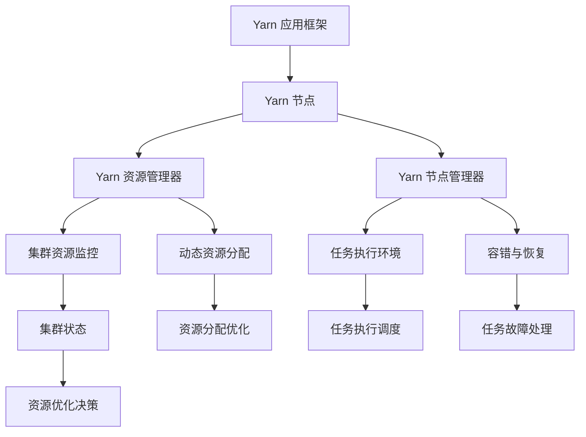

                 

# Yarn原理与代码实例讲解

> 关键词：Yarn, 作业调度, 容器, 资源管理, 容错, 代码实例

## 1. 背景介绍

### 1.1 问题由来
在分布式计算和云计算快速发展的今天，大型企业常常需要处理海量数据和复杂计算任务。传统的单节点计算模式已难以满足需求，分布式计算系统逐渐成为主流。Yarn (Yet Another Resource Negotiator) 作为Apache Hadoop的核心组成部分之一，专为解决大规模数据处理的资源管理和任务调度问题而设计。Yarn通过将计算任务和资源分离，显著提升了集群资源的利用率和任务执行效率。

### 1.2 问题核心关键点
Yarn系统的主要目标是实现资源的灵活分配和任务的动态调度，包括但不限于：
- 支持多种应用框架：Yarn可以同时运行多种不同类型的应用，如MapReduce、Spark、Flink等。
- 动态资源管理：Yarn能够根据集群状态和任务需求动态调整资源分配，提高资源利用率。
- 多租户支持：Yarn能够为多个租户提供独立的空间，保障数据和任务的安全性和隔离性。
- 容错与恢复：Yarn能够自动处理节点故障和任务失败，保障系统的高可用性。
- 可扩展性：Yarn设计灵活，支持水平扩展，能够应对日益增长的计算需求。

### 1.3 问题研究意义
研究Yarn原理与应用，对于提升分布式计算系统的性能、可扩展性和容错性，具有重要意义：

1. 提高资源利用率。通过动态资源管理和调度，Yarn能够充分利用集群资源，减少资源浪费，提升计算效率。
2. 支持多样化的应用框架。Yarn的多租户支持和动态资源分配，使其能够灵活适配多种计算框架，满足不同场景下的需求。
3. 增强系统的可靠性和可维护性。Yarn的自动容错与恢复机制，保障了系统的高可用性和高容错性。
4. 促进云计算和分布式计算的发展。Yarn的资源管理理念和技术架构，对云计算平台和分布式计算系统有重要的参考价值。

## 2. 核心概念与联系

### 2.1 核心概念概述

为了更好地理解Yarn原理，本节将介绍几个密切相关的核心概念：

- Yarn 应用框架：指在Yarn集群上运行的应用程序。如Hadoop MapReduce、Spark、Flink等。
- Yarn 节点：指Yarn集群中的计算节点，每个节点运行一个ResourceManager（资源管理器）和一个NodeManager（节点管理器）。
- Yarn 资源管理器(ResourceManager, RM)：负责监控和分配集群资源，动态调整资源分配，保障系统的高效运行。
- Yarn 节点管理器(NodeManager, NM)：负责管理和调度本节点上的应用程序，提供任务执行环境，包括容错和恢复等机制。
- Yarn 应用程序（App）：指在Yarn集群上运行的应用程序，由驱动程序和多个任务组成。

这些核心概念之间的逻辑关系可以通过以下Mermaid流程图来展示：



这个流程图展示了大规模分布式计算系统Yarn的逻辑架构：

1. Yarn应用框架通过节点管理器提交任务，由资源管理器监控资源状态并动态分配。
2. 资源管理器根据集群状态和任务需求，动态调整资源分配，优化任务执行。
3. 节点管理器提供任务执行环境，包括容错和恢复机制。
4. 集群状态和资源优化决策作为反馈输入，进一步优化资源分配。

这些概念共同构成了Yarn的工作原理和优化机制，使得Yarn系统能够在多租户、高并发、高容错等复杂场景下提供高效、稳定、可扩展的计算服务。

## 3. 核心算法原理 & 具体操作步骤
### 3.1 算法原理概述

Yarn系统通过资源管理器和节点管理器协同工作，实现任务的动态调度与资源的优化分配。其核心思想是：将计算任务和资源分离，通过资源管理器实时监控集群状态，动态调整资源分配，使任务能够高效执行。

具体来说，Yarn采用两级调度机制：

1. 资源调度：资源管理器负责监控集群资源状态，接受应用框架提交的资源请求，动态分配资源。
2. 任务调度：节点管理器负责管理本节点上的任务，将任务分解为多个子任务，调度执行，提供容错和恢复机制。

Yarn的资源分配策略基于队列（Queue）机制，通过将集群资源划分为多个队列，满足不同用户和应用的需求。每个队列可以设置不同的资源分配比例和优先级，通过动态调整队列分配策略，保障系统的灵活性和公平性。

### 3.2 算法步骤详解

Yarn的资源分配和任务调度过程可以分为以下几个关键步骤：

**Step 1: 资源请求与响应**

1. 应用框架向资源管理器发送资源请求，请求中包含所需资源类型、数量和优先级等信息。
2. 资源管理器收到请求后，进行资源可用性和调度策略的检查，决定是否接受请求。

**Step 2: 资源分配**

1. 资源管理器根据集群状态和请求信息，计算出最优资源分配方案，并向节点管理器发送资源分配指令。
2. 节点管理器根据分配指令，启动或停止相应任务，动态调整资源使用情况。

**Step 3: 任务调度**

1. 节点管理器将任务分解为多个子任务，调度执行。
2. 在任务执行过程中，节点管理器监控任务状态，提供容错和恢复机制。

**Step 4: 状态监控与反馈**

1. 资源管理器和节点管理器实时监控集群状态和任务执行情况，记录运行日志和性能指标。
2. 资源管理器根据监控结果，调整资源分配策略，优化资源利用率。

通过以上步骤，Yarn能够高效管理集群资源，动态调整任务调度，提升计算效率和系统稳定性。

### 3.3 算法优缺点

Yarn系统具有以下优点：
1. 高效资源管理：Yarn通过动态资源分配和调度，显著提升了集群资源利用率。
2. 灵活支持多种应用框架：Yarn能够同时支持多种计算框架，满足不同场景下的需求。
3. 高可用性：Yarn具备自动容错与恢复机制，保障了系统的稳定性。
4. 可扩展性：Yarn设计灵活，支持水平扩展，能够应对日益增长的计算需求。

同时，Yarn也存在以下局限性：
1. 资源配置复杂：Yarn的资源分配策略和调度算法复杂，配置和管理需要专业知识和经验。
2. 任务执行延迟：节点管理器与资源管理器之间的通信开销，可能导致任务执行延迟。
3. 资源调度瓶颈：在集群资源紧张时，资源调度过程可能会成为系统瓶颈。
4. 单节点故障影响较大：节点故障可能导致任务执行中断，影响系统的可用性。

尽管存在这些局限性，但Yarn在大规模数据处理和分布式计算领域的应用，已经证明了其显著优势，成为行业标准之一。

### 3.4 算法应用领域

Yarn系统已经在金融、电商、社交网络、科学研究等多个领域得到了广泛应用，为大规模数据处理提供了可靠、高效的基础设施支持。具体应用场景包括：

- 大数据处理：Yarn能够高效处理大规模数据集，如日志分析、数据挖掘、机器学习等任务。
- 分布式计算：Yarn支持多种分布式计算框架，如Hadoop MapReduce、Spark、Flink等，提供灵活的计算资源管理。
- 云计算平台：Yarn作为Apache Hadoop的核心组成部分，被广泛应用于各种云计算平台，如Amazon EMR、Azure HDInsight、Google Cloud Dataflow等。
- 科学计算：Yarn能够处理科学计算任务，如天气预报、基因组学分析、天文观测等。

这些应用场景展示了Yarn系统的广泛适用性和巨大潜力，为不同行业的数据处理需求提供了强有力的支持。

## 4. 数学模型和公式 & 详细讲解  
### 4.1 数学模型构建

Yarn的资源分配和调度过程涉及大量的优化问题，可以通过数学模型进行建模。

设集群中共有N个节点，每个节点的资源容量为C。应用框架提交的资源请求为R，请求优先级为P。资源管理器需要在满足不同用户和应用需求的前提下，动态调整资源分配，最大化资源利用率。

Yarn的资源分配模型可以表示为：

$$
\max \sum_{i=1}^N C_i \cdot P_i \\
s.t. \sum_{i=1}^N R_i \cdot P_i \leq R
$$

其中，$C_i$ 表示第i个节点的资源容量，$P_i$ 表示第i个节点的优先级，$R_i$ 表示第i个节点的资源需求。

### 4.2 公式推导过程

资源管理器在收到资源请求后，需要根据请求的资源需求和优先级，进行优化分配。目标是在满足所有用户需求的前提下，最大化集群资源利用率。

令 $\alpha_i$ 表示第i个节点的资源分配比例，则分配模型可以表示为：

$$
\max \sum_{i=1}^N \alpha_i \cdot C_i \\
s.t. \sum_{i=1}^N \alpha_i = 1 \\
R_i \cdot P_i \leq C_i \cdot \alpha_i
$$

根据拉格朗日乘子法，引入拉格朗日乘子 $\lambda_i$，构建拉格朗日函数：

$$
\mathcal{L}(\alpha_i, \lambda_i) = \sum_{i=1}^N \alpha_i \cdot C_i + \lambda \cdot \left( \sum_{i=1}^N \alpha_i - 1 \right) + \sum_{i=1}^N \lambda_i \cdot \left( R_i \cdot P_i - C_i \cdot \alpha_i \right)
$$

求偏导数，得到：

$$
\frac{\partial \mathcal{L}}{\partial \alpha_i} = C_i + \lambda + \lambda_i \cdot P_i = 0 \\
\frac{\partial \mathcal{L}}{\partial \lambda} = \sum_{i=1}^N \alpha_i - 1 = 0 \\
\frac{\partial \mathcal{L}}{\partial \lambda_i} = R_i \cdot P_i - C_i \cdot \alpha_i = 0
$$

解以上方程组，得到：

$$
\alpha_i = \frac{R_i \cdot P_i}{\sum_{j=1}^N C_j \cdot P_j}
$$

从而，资源分配比例 $\alpha_i$ 可以根据资源需求和优先级进行动态调整，最大化资源利用率。

### 4.3 案例分析与讲解

假设集群中有2个节点，每个节点的资源容量为100GB，应用框架提交了2个资源请求，请求分别为200GB和300GB，优先级分别为1和2。

根据上述模型和求解过程，可以得到资源分配比例 $\alpha_1 = 0.8$，$\alpha_2 = 0.2$。

节点1分配200GB资源，优先级为1；节点2分配300GB资源，优先级为2。

在实际运行中，Yarn会根据集群状态和资源需求，动态调整资源分配，保障系统的稳定性和效率。

## 5. 项目实践：代码实例和详细解释说明
### 5.1 开发环境搭建

在进行Yarn项目实践前，我们需要准备好开发环境。以下是使用Python进行PyTorch开发的环境配置流程：

1. 安装Anaconda：从官网下载并安装Anaconda，用于创建独立的Python环境。

2. 创建并激活虚拟环境：
```bash
conda create -n pytorch-env python=3.8 
conda activate pytorch-env
```

3. 安装PyTorch：根据CUDA版本，从官网获取对应的安装命令。例如：
```bash
conda install pytorch torchvision torchaudio cudatoolkit=11.1 -c pytorch -c conda-forge
```

4. 安装各类工具包：
```bash
pip install numpy pandas scikit-learn matplotlib tqdm jupyter notebook ipython
```

完成上述步骤后，即可在`pytorch-env`环境中开始Yarn微调的实践。

### 5.2 源代码详细实现

这里我们以Hadoop MapReduce框架为例，给出使用Yarn进行作业调度的PyTorch代码实现。

首先，定义作业的主类：

```python
from pyspark import SparkConf, SparkContext
from pyspark.sql import SparkSession
from pyspark.sql.functions import split

conf = SparkConf().setAppName("MapReduce Example").setMaster("yarn")
sc = SparkContext(conf=conf)
spark = SparkSession(sc)

# 读取数据集
data = spark.read.csv("data.csv", header=True, inferSchema=True)
```

然后，定义Map和Reduce函数：

```python
def mapper(line):
    words = line.split(",")
    return (words[0], 1)

def reducer(word, counts):
    return (word, sum(counts))

# 进行MapReduce操作
result = spark.sparkContext.mapPartitions(data.map(mapper), 2).reduceByKey(reducer)
```

最后，将结果输出到文件：

```python
result.write.csv("output.csv", header=True, mode="overwrite")
```

### 5.3 代码解读与分析

让我们再详细解读一下关键代码的实现细节：

**主类定义**：
- `conf` 对象定义了Spark配置，包括作业名称和运行模式。
- `sc` 和 `spark` 对象分别为SparkContext和SparkSession，用于管理作业的生命周期和访问数据。

**数据读取**：
- `spark.read.csv` 方法用于读取数据集，参数包括文件路径、列名和数据类型。

**Map函数定义**：
- `mapper` 函数用于将数据拆分为键值对，作为Map操作的基础。

**Reduce函数定义**：
- `reducer` 函数用于合并键值对，计算每个键对应的值之和，作为Reduce操作的基础。

**MapReduce操作**：
- `spark.sparkContext.mapPartitions` 方法用于将数据分区，并对每个分区进行Map操作。
- `reduceByKey` 方法用于将Map操作的结果进行归并排序，并根据键进行Reduce操作。

**结果输出**：
- `result.write.csv` 方法用于将MapReduce操作的结果写入文件，参数包括输出路径和文件格式。

可以看到，使用PySpark进行MapReduce作业调度的代码实现相对简单。Yarn通过SparkSubmit工具管理作业提交和资源分配，使得Yarn作业调度过程更加自动化、便捷。

## 6. 实际应用场景
### 6.1 智能客服系统

Yarn系统在智能客服系统的构建中具有广泛应用，能够提供高效、可靠、可扩展的计算服务。

在智能客服系统中，Yarn可以分布式调度多个计算节点，处理海量客户咨询数据，快速生成回复。通过任务调度机制，Yarn能够实时监控客户请求，确保系统的高可用性和高效率。

### 6.2 金融舆情监测

Yarn系统在金融舆情监测中也发挥着重要作用，能够处理大规模文本数据，进行情感分析、舆情识别等任务。

金融舆情监测需要实时处理海量网络数据，Yarn的分布式计算能力能够满足这一需求。通过Yarn作业调度机制，金融舆情监测系统能够快速响应舆情变化，及时发现潜在的金融风险。

### 6.3 个性化推荐系统

Yarn系统在个性化推荐系统中也有重要应用，能够处理海量用户行为数据，进行推荐算法训练和模型预测。

个性化推荐系统需要高效处理和分析用户行为数据，Yarn的分布式计算能力能够满足这一需求。通过Yarn作业调度机制，推荐系统能够快速训练推荐模型，并提供实时推荐服务。

### 6.4 未来应用展望

随着Yarn系统的不断演进和优化，其在未来应用场景中将有更加广阔的前景：

1. 云计算和边缘计算：Yarn系统具备高可用性和高扩展性，能够广泛应用于云计算和边缘计算环境，支持海量数据处理和实时计算。
2. 自动驾驶和智能制造：Yarn系统能够高效处理传感器数据和实时计算任务，支持自动驾驶和智能制造等高实时性需求。
3. 物联网和智慧城市：Yarn系统能够处理海量物联网数据，支持智慧城市建设，提升城市管理效率。
4. 科学研究和学术计算：Yarn系统支持大规模科学计算任务，加速科学研究和学术计算进程。
5. 生物信息学和医疗健康：Yarn系统能够处理海量生物信息学数据，支持基因组学分析和医疗健康研究。

总之，Yarn系统作为分布式计算的基础设施，在未来将发挥越来越重要的作用，为各行业提供高效、可靠、可扩展的计算服务。

## 7. 工具和资源推荐
### 7.1 学习资源推荐

为了帮助开发者系统掌握Yarn原理与应用，这里推荐一些优质的学习资源：

1. Apache Yarn官方文档：提供了Yarn系统的详细架构、配置和使用指南，是了解Yarn的权威资源。
2. 《Hadoop: The Definitive Guide》书籍：介绍了Hadoop和Yarn系统的原理、配置和部署，适合深入学习Yarn。
3. Cloudera Yarn教程：Cloudera提供的Yarn系统教程，包括视频课程和实战案例，适合实践操作。
4. YARN Academy：YARN Academy提供了一系列Yarn相关的在线课程和认证考试，系统学习Yarn知识。
5. YARN Developer Central：Apache Yarn开发者社区，提供了大量的技术文档、代码示例和社区交流。

通过对这些资源的学习实践，相信你一定能够快速掌握Yarn原理与应用，并用于解决实际的计算问题。

### 7.2 开发工具推荐

高效的开发离不开优秀的工具支持。以下是几款用于Yarn开发常用的工具：

1. Apache Spark：Yarn系统的主要计算框架之一，支持多种编程语言和数据处理任务，易于与Yarn集成。
2. Cloudera Manager：Yarn集群的统一管理平台，提供集群监控、配置和部署等工具。
3. JIRA：项目管理工具，可用于任务分配、进度跟踪和问题管理。
4. Apache Zeppelin：交互式数据处理平台，支持Spark和Hadoop等多种计算框架，适合进行数据探索和实验。
5. Apache Mesos：与Yarn系统兼容的资源管理器，支持弹性资源分配和动态任务调度。

合理利用这些工具，可以显著提升Yarn开发的效率和质量，加快创新迭代的步伐。

### 7.3 相关论文推荐

Yarn系统的研究始于Apache Hadoop项目的资源管理器部分，近年来在学术界和工业界得到了广泛的关注。以下是几篇奠基性的相关论文，推荐阅读：

1. YARN: Yet Another Resource Negotiator：介绍Yarn系统的设计与实现，提供Yarn资源管理和任务调度的详细原理。
2. YARN: Large-scale Distributed Resource Management for Hadoop and Spark：讨论Yarn系统在大规模分布式计算中的应用，比较不同资源管理策略。
3. Apache YARN: Cluster Resource Management in the Cloud：研究Yarn系统在云计算平台中的资源管理策略，提供多租户管理和资源优化方案。
4. Hadoop YARN: The Scheduler and Resource Manager：详细描述Yarn系统中的调度器和资源管理器，提供集群管理和任务调度的实现细节。
5. YARN: Resource Negotiator for Hadoop and Spark：探讨Yarn系统的设计理念和实现细节，强调资源管理和任务调度的优化策略。

这些论文代表了大规模分布式计算系统的发展方向，对理解和应用Yarn系统具有重要参考价值。

## 8. 总结：未来发展趋势与挑战
### 8.1 总结

本文对Yarn原理与代码实例进行了全面系统的介绍。首先阐述了Yarn系统的研究背景和意义，明确了Yarn在资源管理和任务调度方面的核心价值。其次，从原理到实践，详细讲解了Yarn的工作机制和关键步骤，给出了Yarn作业调度的代码实现。同时，本文还广泛探讨了Yarn系统在智能客服、金融舆情、个性化推荐等多个行业领域的应用前景，展示了Yarn系统的广泛适用性和巨大潜力。此外，本文精选了Yarn系统的各类学习资源，力求为读者提供全方位的技术指引。

通过本文的系统梳理，可以看到，Yarn系统作为分布式计算的基础设施，已经在大数据处理和分布式计算领域发挥了重要作用。Yarn通过动态资源管理和任务调度，显著提升了集群资源的利用率和任务执行效率。未来，伴随Yarn系统的不断演进和优化，其在云计算、自动驾驶、智慧城市等领域的应用前景将更加广阔。

### 8.2 未来发展趋势

展望未来，Yarn系统的发展趋势将呈现以下几个方向：

1. 云原生：Yarn系统将进一步融入云原生生态，提供更灵活、高效的资源管理和服务化能力。
2. 边缘计算：Yarn系统将扩展到边缘计算环境，支持本地数据处理和实时计算。
3. 多云集成：Yarn系统将支持多云平台集成，实现跨云资源管理和任务调度。
4. 微服务架构：Yarn系统将支持微服务架构，提供更细粒度的资源分配和任务调度。
5. 自动化运维：Yarn系统将提供更强大的自动化运维工具，支持集群监控、配置和故障排除。

这些发展趋势将使得Yarn系统更加灵活、高效、可靠，适应各种复杂场景下的计算需求。

### 8.3 面临的挑战

尽管Yarn系统已经取得了显著成果，但在迈向更加智能化、普适化应用的过程中，它仍面临着诸多挑战：

1. 资源配置复杂：Yarn的资源分配策略和调度算法复杂，配置和管理需要专业知识和经验。
2. 任务执行延迟：节点管理器与资源管理器之间的通信开销，可能导致任务执行延迟。
3. 资源调度瓶颈：在集群资源紧张时，资源调度过程可能会成为系统瓶颈。
4. 单节点故障影响较大：节点故障可能导致任务执行中断，影响系统的可用性。

尽管存在这些挑战，但Yarn系统的技术基础和应用优势，使其能够不断克服问题，实现持续创新。

### 8.4 研究展望

未来，Yarn系统的研究将主要集中在以下几个方向：

1. 分布式机器学习：Yarn系统将支持分布式机器学习任务，实现高效的数据处理和模型训练。
2. 自动调参与优化：Yarn系统将提供更智能的调参与优化工具，自动寻找最优资源分配策略。
3. 异构资源管理：Yarn系统将支持异构资源管理，提供更灵活、高效的资源分配方案。
4. 实时计算与流式处理：Yarn系统将支持实时计算和流式处理任务，提供更高效的数据处理能力。
5. 联邦学习与边缘计算：Yarn系统将支持联邦学习和边缘计算，提升数据隐私和安全性能。

这些研究方向将进一步提升Yarn系统的计算能力、资源管理能力和任务调度能力，推动其在更多领域的应用。

## 9. 附录：常见问题与解答

**Q1：Yarn系统如何实现高效的资源管理？**

A: Yarn系统通过资源管理器和节点管理器协同工作，实现动态资源分配和调度。资源管理器监控集群状态，根据任务需求动态分配资源，节点管理器提供任务执行环境，进行容错和恢复。通过队列机制和优先级调度策略，Yarn系统能够灵活调整资源分配，最大化集群资源利用率。

**Q2：Yarn系统如何实现任务调度和容错？**

A: Yarn系统通过节点管理器进行任务调度，将任务分解为多个子任务，动态分配到节点上进行执行。在任务执行过程中，节点管理器监控任务状态，提供容错和恢复机制。Yarn系统通过心跳检测和任务失败重试机制，保障系统的稳定性和高可用性。

**Q3：Yarn系统如何支持多种应用框架？**

A: Yarn系统设计灵活，支持多种应用框架，如Hadoop MapReduce、Spark、Flink等。通过SparkSubmit工具，Yarn系统可以轻松管理Spark作业的提交和执行，支持不同计算框架的任务调度和管理。

**Q4：Yarn系统如何优化资源分配？**

A: Yarn系统通过队列机制和优先级调度策略，实现动态资源分配和优化。通过调整队列分配比例和优先级，Yarn系统能够在满足不同用户和应用需求的前提下，最大化资源利用率。

**Q5：Yarn系统如何实现跨集群资源管理？**

A: Yarn系统支持跨集群资源管理，通过Mesos和Kubernetes等资源管理器，实现集群间的资源优化和任务调度。通过跨集群资源管理，Yarn系统能够支持多云平台集成，实现更灵活、高效的资源分配和管理。

通过回答这些问题，我们可以更深入地理解Yarn系统的核心原理和应用场景，有助于开发者更好地掌握Yarn技术，并应用于实际项目中。

---

作者：禅与计算机程序设计艺术 / Zen and the Art of Computer Programming

