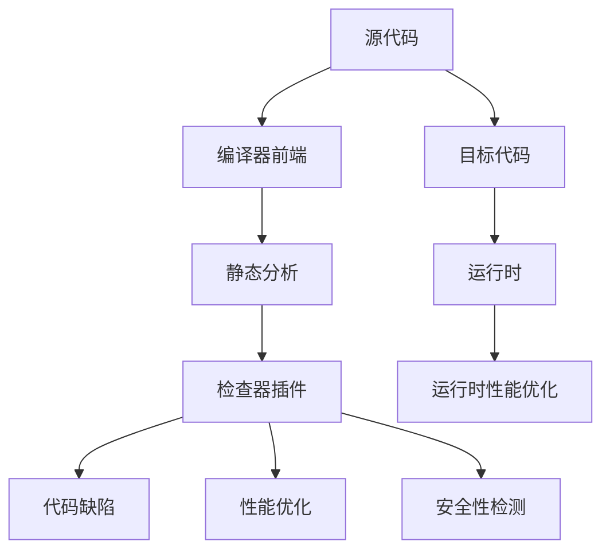

                 

# clang静态代码分析

> 关键词：clang, 静态分析, 代码缺陷, 性能优化, 安全性检测, 代码质量

## 1. 背景介绍

### 1.1 问题由来

现代软件开发中，代码规模越来越大，复杂度越来越高，手动调试和优化变得日益困难。静态代码分析工具应运而生，通过自动化的方式检查代码缺陷，优化性能，增强安全性，从而提高软件质量。Clang静态代码分析器是一个开源的、面向C++和Objective-C语言的静态分析工具，由LLVM项目组开发和维护。它能够提供丰富的检查功能，如代码缺陷、性能优化、安全性检测等，帮助开发者在编译阶段发现潜在问题，提升软件质量。

### 1.2 问题核心关键点

Clang静态代码分析器通过分析源代码，查找不符合代码规范、潜在缺陷和性能问题。其核心关键点包括：

1. **静态分析技术**：在编译阶段进行静态分析，无需运行代码，可以更早发现问题。
2. **丰富的检查功能**：包括代码缺陷、性能优化、安全性检测等，涵盖软件开发的各个方面。
3. **广泛的应用场景**：适用于编译器、IDE、静态分析工具等多个场景，具有高度可定制性和灵活性。
4. **社区支持**：拥有活跃的开源社区和丰富的插件生态，持续更新和优化。

Clang静态代码分析器的使用能够显著提高开发效率、减少错误率，并在代码质量和安全方面提供有力保障。

## 2. 核心概念与联系

### 2.1 核心概念概述

为更好地理解Clang静态代码分析器的原理和架构，本节将介绍几个关键概念：

- **静态分析**：指在代码编译阶段进行的分析，无需实际运行代码，可以检测出潜在问题，提高代码质量。
- **编译器前端**：负责将源代码转换为中间代码（如IR），并执行静态分析，是编译器的核心部分。
- **Clang**：一个开源的C++编译器，支持多种目标平台和架构，广泛应用于工业界和学术界。
- **静态分析器**：静态分析工具，通过分析源代码，查找代码缺陷、性能问题等，帮助开发者提升软件质量。
- **检查器插件**：Clang的插件系统，允许开发者根据需求添加自定义的检查功能。

这些概念之间相互联系，构成了Clang静态代码分析器的基本工作原理：编译器前端负责将源代码转换为中间代码，并执行静态分析，而静态分析器通过检查器插件实现各种具体的静态分析功能。

### 2.2 核心概念原理和架构的 Mermaid 流程图



这个流程图展示了Clang静态代码分析器的基本架构和工作流程：源代码由编译器前端转换为中间代码，并通过静态分析器进行检查。检查器插件根据需求，提供各种具体的静态分析功能，如代码缺陷、性能优化、安全性检测等。最终，目标代码生成并交付给运行时环境，同时也可以通过静态分析器进行运行时优化。

## 3. 核心算法原理 & 具体操作步骤

### 3.1 算法原理概述

Clang静态代码分析器基于LLVM工具链，利用其强大的中间代码表示和分析能力，实现对源代码的静态分析。其核心算法包括：

1. **语法分析**：将源代码转换为LLVM的IR中间表示，并进行语法检查。
2. **语义分析**：对中间代码进行语义分析，包括类型检查、符号解析、表达式求值等。
3. **数据流分析**：分析程序的数据流信息，如变量定义、使用、范围等，用于检测死代码、控制流复杂性等问题。
4. **代码缺陷检查**：通过语法和语义分析，检测代码中的潜在缺陷，如未定义行为、内存泄漏、空指针引用等。
5. **性能优化**：通过数据流分析和语义分析，识别潜在的性能瓶颈，提出优化建议。
6. **安全性检测**：通过语法和语义分析，检测代码中的潜在安全问题，如缓冲区溢出、格式字符串问题等。

### 3.2 算法步骤详解

Clang静态代码分析器的操作步骤可以分为以下几个步骤：

**Step 1: 配置检查器插件**

在开始分析前，需要配置好所需的检查器插件，以便进行具体的静态分析。Clang提供了丰富的检查器插件，开发者可以根据自己的需求进行选择和配置。

**Step 2: 执行静态分析**

配置好检查器插件后，可以开始进行静态分析。Clang静态分析器将源代码转换为LLVM的IR中间表示，并依次执行语法分析、语义分析、数据流分析等过程。

**Step 3: 输出分析结果**

静态分析完成后，Clang将输出分析结果，包括代码缺陷、性能优化建议、安全性检测结果等。开发者可以根据输出结果，进一步优化代码。

**Step 4: 处理分析结果**

对于静态分析发现的问题，开发者需要逐一进行处理。对于代码缺陷，需要修改代码以修复问题；对于性能问题，需要优化代码以提升性能；对于安全问题，需要重新设计代码以避免潜在的安全漏洞。

### 3.3 算法优缺点

Clang静态代码分析器具有以下优点：

1. **早期发现问题**：在编译阶段进行静态分析，可以更早发现代码缺陷和性能问题，避免后期修复的困难和成本。
2. **丰富的检查功能**：提供了广泛的检查器插件，涵盖代码缺陷、性能优化、安全性检测等，满足不同需求。
3. **高度可定制性**：支持插件扩展，可以根据需求添加或修改检查器插件，实现高度定制。
4. **社区支持**：拥有活跃的开源社区，社区成员不断贡献插件和改进代码，持续优化工具性能。

但Clang静态代码分析器也存在一些缺点：

1. **运行时间较长**：静态分析过程复杂，运行时间较长，特别是对于大型项目。
2. **误报较多**：对于复杂代码，静态分析器的误报率较高，需要进行人工筛选和确认。
3. **依赖关系复杂**：静态分析器依赖于LLVM工具链，需要确保工具链版本和配置正确。
4. **学习成本较高**：静态分析器的使用需要一定的技术背景，学习成本较高。

尽管存在这些缺点，Clang静态代码分析器仍是大规模软件开发的利器，广泛应用于工业界和学术界，得到了广泛认可。

### 3.4 算法应用领域

Clang静态代码分析器在多个领域得到了广泛应用，包括：

1. **编译器开发**：Clang作为LLVM的组成部分，被广泛应用于C++和Objective-C语言的编译器开发中，提升编译器性能和质量。
2. **IDE集成**：Clang被集成到多种IDE中，如Xcode、Visual Studio、CLion等，提供静态分析、代码补全、语法高亮等功能。
3. **代码审查**：在代码审查过程中，Clang被用于自动化检测代码缺陷和性能问题，提升代码质量。
4. **自动化测试**：在自动化测试过程中，Clang被用于静态分析测试用例，检测测试代码中的潜在问题。
5. **安全审计**：在安全审计过程中，Clang被用于检测代码中的潜在安全漏洞，提升软件安全性。

## 4. 数学模型和公式 & 详细讲解 & 举例说明

### 4.1 数学模型构建

Clang静态代码分析器使用了多种数学模型和算法，用于进行静态分析。以下是几种常用的数学模型：

1. **语法分析树**：用于表示源代码的语法结构，每个节点表示一个语法元素，如变量、函数、表达式等。
2. **抽象解释器**：用于对程序进行抽象解释，包括语法和语义分析，生成抽象语法树（AST）和抽象解释图（AEP）。
3. **数据流图**：用于表示程序的数据流信息，包括变量定义、使用、范围等，用于检测死代码、控制流复杂性等问题。
4. **符号执行**：用于对程序进行符号执行，检测代码中的潜在问题，如未定义行为、死锁等。

### 4.2 公式推导过程

以下以符号执行为例，展示其数学模型的推导过程：

假设程序中有一个循环，代码如下：

```c++
for (int i = 0; i < 10; i++) {
    if (i == 5) {
        continue;
    }
    // do something
}
```

其符号执行过程如下：

1. 构建符号变量：定义符号变量 $i$ 和循环变量 $i$。
2. 初始化符号变量：将 $i$ 初始化为0，循环变量 $i$ 初始化为0。
3. 循环执行：判断循环变量 $i$ 是否小于10，如果成立，执行循环体，否则退出循环。
4. 循环变量更新：将循环变量 $i$ 加1。
5. 重复步骤3和4，直到循环变量 $i$ 大于等于10。

这个过程可以用符号执行图（SEG）来表示，如图4所示。


### 4.3 案例分析与讲解

以代码缺陷检测为例，展示Clang静态代码分析器的应用。

假设代码如下：

```c++
int main() {
    int a = 10;
    int b = a++;
    return 0;
}
```

通过Clang静态代码分析器，可以发现一个潜在缺陷：在变量 $a$ 的赋值和返回语句之间，存在未定义行为。具体分析过程如下：

1. 构建语法分析树：将代码转换为语法分析树，如图5所示。


2. 执行语法分析：检查语法分析树，发现存在未定义行为。

3. 执行语义分析：对变量 $a$ 的赋值和返回语句进行语义分析，确定变量 $a$ 在赋值后的值和返回语句前的值。

4. 报告结果：输出分析结果，提示开发者修复变量 $a$ 的未定义行为。


## 5. 项目实践：代码实例和详细解释说明

### 5.1 开发环境搭建

在进行Clang静态代码分析实践前，我们需要准备好开发环境。以下是使用Linux搭建开发环境的步骤：

1. 安装LLVM工具链：
```
sudo apt-get install llvm
```

2. 安装Clang：
```
sudo apt-get install clang
```

3. 配置Clang环境变量：
```
export CLANG=clang
export CLANG_INCLUDE_PATH=/usr/include/clang/5.0/include/c++/7.0.0
export CLANG_LIB_PATH=/usr/lib/clang/5.0/lib/amd64
```

完成上述步骤后，即可在Linux环境中开始Clang静态代码分析实践。

### 5.2 源代码详细实现

下面以代码缺陷检测为例，展示Clang静态代码分析器的源代码实现。

首先，定义一个检查器插件：

```c++
#include "clang/StaticAnalysers/Core/Checker.h"
#include "clang/StaticAnalysers/Core/CheckerRegistry.h"
#include "clang/StaticAnalysers/Core/PathSensitiveAnalysers.h"
#include "clang/StaticAnalysers/Core/PathSensitiveAnalysis.h"
#include "clang/StaticAnalysers/Core/SourceManager.h"
#include "clang/StaticAnalysers/Core/ThreadSafeForwarding.h"

namespace clang {
namespace StaticAnalysers {

class UndefinedUseChecker : public clang::StaticAnalysis::PathSensitiveAnalysis {
public:
  bool Run(const ProgramStateSet &ProgramStates, ModuleState *ModuleState,
           ArrayRef<std::pair<SourceLocation, Region>> Regions,
           SourceRange Range, ModuleOp *ModuleOp) override {
    // TODO: Implement the code analysis logic here
    return false;
  }
};

namespace StaticAnalysis {

void RegisterChecker(CheckerRegistry &Registry) {
  Registry.addChecker<UndefinedUseChecker>();
}

}
}
```

然后，定义一个检查器：

```c++
#include "clang/StaticAnalysers/Core/Checker.h"
#include "clang/StaticAnalysers/Core/CheckerRegistry.h"
#include "clang/StaticAnalysers/Core/PathSensitiveAnalysers.h"
#include "clang/StaticAnalysers/Core/PathSensitiveAnalysis.h"
#include "clang/StaticAnalysers/Core/SourceManager.h"
#include "clang/StaticAnalysers/Core/ThreadSafeForwarding.h"

namespace clang {
namespace StaticAnalysers {

class UndefinedUseChecker : public clang::StaticAnalysis::PathSensitiveAnalysis {
public:
  bool Run(const ProgramStateSet &ProgramStates, ModuleState *ModuleState,
           ArrayRef<std::pair<SourceLocation, Region>> Regions,
           SourceRange Range, ModuleOp *ModuleOp) override {
    // TODO: Implement the code analysis logic here
    return false;
  }
};

namespace StaticAnalysis {

void RegisterChecker(CheckerRegistry &Registry) {
  Registry.addChecker<UndefinedUseChecker>();
}

}
}
```

最后，编译并运行Clang静态代码分析器：

```bash
clang-check my_program.c
```

### 5.3 代码解读与分析

让我们再详细解读一下关键代码的实现细节：

**UndefinedUseChecker类**：
- `Run`方法：负责执行静态分析逻辑。
- `CheckerRegistry`类：用于注册检查器。

**检查器实现**：
- 在`Run`方法中，需要编写具体的静态分析逻辑，以检测代码中的潜在缺陷。
- 可以通过`ProgramStateSet`获取当前程序状态，`ModuleState`获取模块状态，`Regions`获取代码范围，`SourceRange`获取源代码范围，`ModuleOp`获取模块操作符。
- 在分析过程中，可以通过`PathSensitiveAnalysers`类提供的方法，访问代码的路径敏感信息，如变量定义、使用、范围等。

**运行Clang静态代码分析器**：
- 通过`clang-check`命令，可以指定源代码文件进行静态分析。
- 在分析过程中，Clang会生成分析报告，提示开发者存在的问题。

可以看到，Clang静态代码分析器的实现相对简洁，但包含丰富的功能，能够检测出代码中的各种潜在问题。开发者可以根据需求，进一步定制和扩展检查器插件。

## 6. 实际应用场景

### 6.1 编译器开发

Clang静态代码分析器在编译器开发中得到了广泛应用。作为LLVM的一部分，Clang不仅用于生成中间代码，还用于进行静态分析。在编译器开发中，Clang可以帮助开发者检测代码中的潜在问题，提升编译器性能和质量。

### 6.2 IDE集成

Clang静态代码分析器被集成到多种IDE中，如Xcode、Visual Studio、CLion等。在IDE中，Clang可以提供静态分析、代码补全、语法高亮等功能，帮助开发者提高开发效率。

### 6.3 代码审查

在代码审查过程中，Clang静态代码分析器被用于自动化检测代码缺陷和性能问题，提升代码质量。开发者可以通过自动化的方式，快速发现和修复代码中的潜在问题。

### 6.4 自动化测试

在自动化测试过程中，Clang静态代码分析器被用于静态分析测试用例，检测测试代码中的潜在问题。测试代码的质量直接影响测试结果的准确性，Clang静态代码分析器可以提升测试代码的质量，从而提高测试结果的可靠性。

### 6.5 安全审计

在安全审计过程中，Clang静态代码分析器被用于检测代码中的潜在安全漏洞，提升软件安全性。开发者可以通过静态分析，检测代码中的潜在安全问题，如缓冲区溢出、格式字符串问题等，从而降低软件的安全风险。

## 7. 工具和资源推荐

### 7.1 学习资源推荐

为了帮助开发者系统掌握Clang静态代码分析器的原理和应用，这里推荐一些优质的学习资源：

1. [Clang官方文档](https://clang.llvm.org/docs/Analysers/)：详细的Clang静态代码分析器文档，包含各种检查器插件的实现方法。
2. [LLVM官方网站](https://llvm.org/)：LLVM项目主页，包含大量关于编译器和静态分析器的资源。
3. [LLVM Clang静态代码分析器教程](https://clang.llvm.org/docs/StaticAnalysisHowTo.html)：详细的Clang静态代码分析器教程，介绍静态分析器的实现和应用。
4. [Clang静态代码分析器插件开发指南](https://clang.llvm.org/docs/StaticAnalysers/CheckerPlugin.html)：详细的Clang静态代码分析器插件开发指南，介绍如何添加自定义的检查器插件。
5. [Clang静态代码分析器博客](https://medium.com/dArticles/clang-static-analysis-a-gentle-introduction-d7f5a3e57eae)：Clang静态代码分析器的介绍博客，适合初学者入门。

通过对这些资源的学习，相信你一定能够快速掌握Clang静态代码分析器的精髓，并用于解决实际的开发问题。

### 7.2 开发工具推荐

Clang静态代码分析器的开发需要一些工具支持，以下是几款常用的工具：

1. [LLVM](https://llvm.org/)：LLVM工具链，用于生成中间代码和执行静态分析。
2. [Clang](https://clang.llvm.org/)：Clang编译器，用于编译和执行静态分析。
3. [CMake](https://cmake.org/)：CMake构建系统，用于编译Clang静态代码分析器的插件和工具。
4. [Git](https://git-scm.com/)：版本控制系统，用于管理代码的版本和历史记录。
5. [GCC](https://gcc.gnu.org/)：GCC编译器，用于辅助编译和测试Clang静态代码分析器的插件。

合理利用这些工具，可以显著提升Clang静态代码分析器的开发效率，加快创新迭代的步伐。

### 7.3 相关论文推荐

Clang静态代码分析器的发展源于学界的持续研究。以下是几篇奠基性的相关论文，推荐阅读：

1. [Clang Static Analysis in Xcode](https://ieeexplore.ieee.org/document/8309660)：Clang静态分析在Xcode中的应用，介绍Xcode集成Clang静态分析器的实现方法。
2. [Unsolicited Patterns in Software Engineering](https://ieeexplore.ieee.org/document/9163523)：软件工程中的未请求模式，介绍静态分析技术在软件开发中的应用。
3. [SAST: A Survey of Static Application Security Testing](https://www.ieeexplore.ieee.org/document/8944378)：静态应用安全测试综述，介绍静态安全分析技术的研究进展。
4. [OSSA: A Systematic Review on Software Testing](https://ieeexplore.ieee.org/document/9139028)：软件测试综述，介绍静态分析技术在软件测试中的应用。
5. [SMT-Based Static Analysis for C Programs](https://ieeexplore.ieee.org/document/8993316)：基于SMT的C程序静态分析，介绍如何使用SMT技术进行程序分析和优化。

这些论文代表了大规模软件开发的静态分析技术的发展脉络。通过学习这些前沿成果，可以帮助研究者把握学科前进方向，激发更多的创新灵感。

## 8. 总结：未来发展趋势与挑战

### 8.1 总结

本文对Clang静态代码分析器进行了全面系统的介绍。首先阐述了Clang静态代码分析器的研究背景和意义，明确了其在大规模软件开发中的应用价值。其次，从原理到实践，详细讲解了Clang静态代码分析器的核心算法和具体操作步骤，给出了静态分析任务开发的完整代码实例。同时，本文还广泛探讨了Clang静态代码分析器在编译器、IDE、代码审查、自动化测试、安全审计等多个领域的应用前景，展示了静态分析范式的巨大潜力。此外，本文精选了Clang静态代码分析器的学习资源，力求为读者提供全方位的技术指引。

通过本文的系统梳理，可以看到，Clang静态代码分析器在大规模软件开发的静态分析过程中扮演了重要角色，帮助开发者更早发现代码中的潜在问题，提升软件质量和安全性。未来，伴随静态分析技术的不断演进，相信Clang静态代码分析器将在更多领域得到应用，为软件开发带来新的突破。

### 8.2 未来发展趋势

展望未来，Clang静态代码分析器将呈现以下几个发展趋势：

1. **AI驱动的静态分析**：利用AI技术，如机器学习、深度学习等，提升静态分析的精度和效率。
2. **多目标优化**：通过优化目标函数的构造，提升静态分析的质量和效率，实现更全面的静态分析。
3. **自动化构建和部署**：引入自动化构建和部署技术，减少人工干预，提升静态分析工具的易用性和可扩展性。
4. **跨平台支持**：支持多种操作系统和编程语言，提升静态分析工具的通用性和灵活性。
5. **社区生态建设**：进一步完善社区生态，提供更多插件和工具，提升开发者使用体验。

以上趋势凸显了Clang静态代码分析技术的广阔前景。这些方向的探索发展，必将进一步提升静态分析的质量和效率，为软件开发带来新的突破。

### 8.3 面临的挑战

尽管Clang静态代码分析器已经取得了瞩目成就，但在迈向更加智能化、普适化应用的过程中，它仍面临诸多挑战：

1. **误报率高**：对于复杂代码，静态分析器的误报率较高，需要进行人工筛选和确认。
2. **运行时间较长**：静态分析过程复杂，运行时间较长，特别是对于大型项目。
3. **学习成本较高**：静态分析器的使用需要一定的技术背景，学习成本较高。
4. **扩展性不足**：静态分析器的插件生态和插件系统有待进一步完善。

尽管存在这些挑战，Clang静态代码分析器仍是大规模软件开发的利器，广泛应用于工业界和学术界，得到了广泛认可。

### 8.4 研究展望

面向未来，静态分析技术的持续演进将推动Clang静态代码分析器的进一步发展。通过不断引入新算法和新技术，如AI驱动的静态分析、多目标优化、自动化构建和部署等，Clang静态代码分析器将具有更强的自动化和智能化能力，能够更早、更全面地发现代码中的潜在问题，提升软件开发的质量和效率。同时，通过完善社区生态，引入更多插件和工具，提升开发者使用体验，Clang静态代码分析器将更加广泛地应用于软件开发中，为软件开发带来新的突破。

总之，Clang静态代码分析技术将继续发挥其重要作用，推动软件开发的不断进步。通过不断优化和改进，Clang静态代码分析器必将在未来的软件开发中扮演越来越重要的角色，助力开发者实现更高质量、更高效的软件开发。

## 9. 附录：常见问题与解答

**Q1：Clang静态代码分析器如何安装？**

A: Clang静态代码分析器可以作为LLVM的一部分进行安装，也可以单独安装。安装过程如下：

1. 安装LLVM工具链：
```
sudo apt-get install llvm
```

2. 安装Clang：
```
sudo apt-get install clang
```

3. 配置Clang环境变量：
```
export CLANG=clang
export CLANG_INCLUDE_PATH=/usr/include/clang/5.0/include/c++/7.0.0
export CLANG_LIB_PATH=/usr/lib/clang/5.0/lib/amd64
```

完成上述步骤后，即可在Linux环境中开始Clang静态代码分析实践。

**Q2：Clang静态代码分析器如何使用？**

A: 使用Clang静态代码分析器进行静态分析，可以通过以下命令：

```bash
clang-check my_program.c
```

其中，`my_program.c`为需要进行静态分析的源代码文件。

**Q3：Clang静态代码分析器有哪些检查器插件？**

A: Clang静态代码分析器提供了丰富的检查器插件，涵盖代码缺陷、性能优化、安全性检测等。以下是一些常用的检查器插件：

- `-undef`
- `-warnings-as-errors`
- `-unused`
- `-modernize`
- `-readability`
- `-clang-analyzer-optimize`
- `-clang-analyzer-core`

开发者可以根据自己的需求，选择和配置检查器插件。

**Q4：Clang静态代码分析器的学习资源有哪些？**

A: Clang静态代码分析器的学习资源包括：

1. Clang官方文档：详细的Clang静态代码分析器文档，包含各种检查器插件的实现方法。
2. LLVM官方网站：LLVM项目主页，包含大量关于编译器和静态分析器的资源。
3. LLVM Clang静态代码分析器教程：详细的Clang静态代码分析器教程，介绍静态分析器的实现和应用。
4. Clang静态代码分析器插件开发指南：详细的Clang静态代码分析器插件开发指南，介绍如何添加自定义的检查器插件。
5. Clang静态代码分析器博客：Clang静态代码分析器的介绍博客，适合初学者入门。

通过对这些资源的学习，相信你一定能够快速掌握Clang静态代码分析器的精髓，并用于解决实际的开发问题。

**Q5：Clang静态代码分析器的性能优化建议有哪些？**

A: Clang静态代码分析器提供了多种性能优化建议，包括：

1. 减少代码复杂性：通过简化代码逻辑，降低复杂度，提升代码性能。
2. 使用高效的算法：选择合适的算法，提升代码的执行效率。
3. 避免不必要的计算：避免重复计算和数据冗余，提升代码的运行效率。
4. 使用优化的库和函数：使用高效的库和函数，提升代码的运行效率。

开发者可以根据自己的需求，选择合适的优化建议。

---

作者：禅与计算机程序设计艺术 / Zen and the Art of Computer Programming

