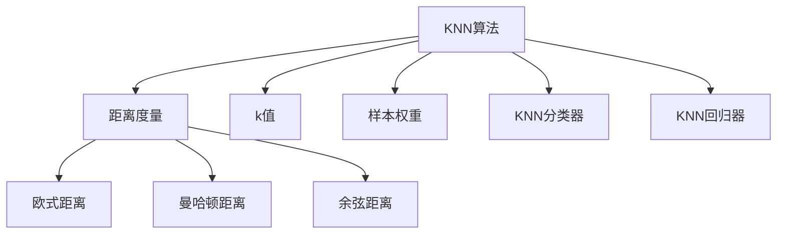

                 

# k-近邻算法(k-Nearest Neighbors) - 原理与代码实例讲解

> 关键词：k-近邻算法,机器学习,分类,回归,代码实例,Python

## 1. 背景介绍

### 1.1 问题由来
k-近邻算法（k-Nearest Neighbors，简称KNN）是机器学习中最简单、最直观的经典算法之一。其原理基于“物以类聚，人以群分”的思想，通过测量不同实例之间的距离，找到与目标样本最近的k个邻居，然后根据这些邻居的标签进行分类或回归预测。KNN算法因其简单易懂、无需显式训练过程，被广泛应用于各种场景，包括数据挖掘、图像处理、推荐系统、生物信息学等。

### 1.2 问题核心关键点
KNN算法的核心在于“近邻”概念和“k值”的选择，这两个参数直接影响着模型的性能和泛化能力。在实际应用中，如何选择k值和距离度量标准，以获得最佳的分类或回归效果，是KNN算法的关键。此外，KNN算法在处理大规模数据集时，计算距离和查找最近邻的效率问题，也是需要重点考虑的。

## 2. 核心概念与联系

### 2.1 核心概念概述

为更好地理解KNN算法的核心概念，本节将介绍几个密切相关的核心概念：

- **k-近邻算法（KNN）**：一种基于实例的机器学习算法，通过计算样本之间的距离，找到与目标样本最接近的k个邻居，然后根据这些邻居的标签进行分类或回归预测。

- **距离度量**：用于衡量样本之间距离的度量标准，如欧式距离、曼哈顿距离、余弦距离等。

- **k值的选择**：KNN算法的关键参数之一，k值越大，模型越可能受到噪声的影响；k值越小，模型越有可能过拟合训练数据。

- **样本权重**：在KNN中，给与距离目标样本更近的邻居更大的权重，以提高模型的鲁棒性。

- **KNN分类器与KNN回归器**：根据任务类型，KNN算法可分为分类器和回归器两种形式。

- **基于实例的机器学习**：KNN属于基于实例的学习方法，其学习过程不需要显式训练，而是依赖于已有的数据集。

这些核心概念之间的逻辑关系可以通过以下Mermaid流程图来展示：



这个流程图展示了大语言模型的核心概念及其之间的关系：

1. KNN算法基于距离度量，用于计算样本间的距离。
2. k值的选择直接影响模型的泛化能力。
3. 样本权重用于提高模型的鲁棒性。
4. KNN算法分为分类器和回归器两种形式。
5. 距离度量通常包括欧式距离、曼哈顿距离和余弦距离等。

这些概念共同构成了KNN算法的学习和应用框架，使其能够在各种场景下发挥作用。通过理解这些核心概念，我们可以更好地把握KNN算法的原理和优化方向。

## 3. 核心算法原理 & 具体操作步骤
### 3.1 算法原理概述

KNN算法的核心思想是通过测量不同实例之间的距离，找到与目标样本最近的k个邻居，然后根据这些邻居的标签进行分类或回归预测。

具体来说，假设有n个样本点，每个样本点有d维特征，目标样本为x，邻居数量为k，距离度量为$D$。KNN算法通过计算每个样本点与目标样本点之间的距离，选取最近的k个邻居，然后根据这些邻居的标签或数值进行预测。

假设目标样本x的邻居为$N_k(x)$，KNN算法的预测公式为：

$$
y = \begin{cases}
\text{多数表决} & \text{对于分类任务} \\
\frac{1}{k} \sum_{x_i \in N_k(x)} y_i & \text{对于回归任务}
\end{cases}
$$

其中$y_i$为邻居样本的标签或数值，$\frac{1}{k}$为权重因子，用于平衡邻居对预测结果的影响。

### 3.2 算法步骤详解

KNN算法的实现步骤如下：

1. 收集并预处理数据集：将数据集进行标准化或归一化处理，避免距离计算受特征单位的影响。
2. 选取距离度量：根据任务类型，选择适当的距离度量标准，如欧式距离、曼哈顿距离、余弦距离等。
3. 计算样本距离：计算每个样本点与目标样本点的距离，常用方法包括欧式距离、曼哈顿距离、余弦距离等。
4. 查找最近邻：选取距离目标样本点最近的k个邻居。
5. 预测结果：对于分类任务，采用多数表决法；对于回归任务，计算k个邻居的平均值。

具体步骤如下：

1. 加载数据集：
```python
from sklearn.datasets import load_iris
from sklearn.model_selection import train_test_split

iris = load_iris()
X_train, X_test, y_train, y_test = train_test_split(iris.data, iris.target, random_state=42)
```

2. 训练集和测试集划分：
```python
X_train = X_train[:, :2]  # 仅取前两个特征，以简化计算
```

3. 计算样本距离：
```python
import numpy as np
from scipy.spatial.distance import euclidean

distances = np.zeros((X_train.shape[0], 1))
for i in range(X_train.shape[0]):
    distances[i] = np.sqrt(np.sum((X_train[i] - X_test)**2))
```

4. 查找最近邻：
```python
k = 5
indices = np.argsort(distances)[:k]
nearest_labels = y_train[indices]
```

5. 预测结果：
```python
from sklearn.metrics import accuracy_score

predicted_labels = np.bincount(nearest_labels).argmax()
accuracy = accuracy_score(y_test, predicted_labels)
print(f"Accuracy: {accuracy}")
```

### 3.3 算法优缺点

KNN算法的优点包括：

- 算法简单易懂，易于实现。
- 对于多分类问题，表现良好。
- 对于高维数据，表现良好。
- 对于非线性可分问题，可以通过调整k值进行处理。

KNN算法的缺点包括：

- 计算距离和查找最近邻的效率较低，对于大规模数据集，计算复杂度较高。
- 对于噪声和异常值敏感，需要预先进行数据清洗和处理。
- 需要大量内存存储数据集，不适用于内存受限的环境。

### 3.4 算法应用领域

KNN算法在以下几个领域有着广泛的应用：

- **数据挖掘**：用于分类和聚类分析，如客户分群、商品推荐等。
- **图像处理**：用于图像分类、特征提取等。
- **推荐系统**：用于用户推荐、商品推荐等。
- **生物信息学**：用于序列比对、基因分类等。
- **金融分析**：用于信用评估、股票预测等。
- **医疗诊断**：用于疾病诊断、病情预测等。

这些应用场景展示了KNN算法的广泛适应性和强大的应用潜力。

## 4. 数学模型和公式 & 详细讲解 & 举例说明

### 4.1 数学模型构建

KNN算法的核心在于计算样本之间的距离，常用的距离度量标准包括欧式距离、曼哈顿距离、余弦距离等。这里以欧式距离为例，构建KNN算法的数学模型。

设样本空间为$\mathbb{R}^d$，样本$x$和$y$之间的欧式距离为：

$$
D(x, y) = \sqrt{\sum_{i=1}^{d}(x_i - y_i)^2}
$$

对于分类任务，目标样本为$x$，其k个最近邻为$N_k(x)$，其中$x_i \in N_k(x)$。分类公式为：

$$
y = \begin{cases}
\text{多数表决} & \text{如果} |N_k(x)| \text{是偶数} \\
\text{距离目标样本最近的标签} & \text{如果} |N_k(x)| \text{是奇数}
\end{cases}
$$

对于回归任务，目标样本为$x$，其k个最近邻为$N_k(x)$，其中$x_i \in N_k(x)$。回归公式为：

$$
y = \frac{1}{k} \sum_{x_i \in N_k(x)} y_i
$$

### 4.2 公式推导过程

以下是KNN算法的详细推导过程：

假设样本集为$D = \{(x_1, y_1), (x_2, y_2), ..., (x_n, y_n)\}$，目标样本为$x$，k值为其邻居数量。

1. 计算样本之间的距离：
   $$
   d(x_i, x) = \sqrt{\sum_{j=1}^{d}(x_{ij} - x_j)^2}
   $$
   其中$x_{ij}$为样本$x_i$的第j个特征值。

2. 按距离排序：
   $$
   \{(x_1, d(x_1, x)), (x_2, d(x_2, x)), ..., (x_n, d(x_n, x))\}
   $$
   按$d(x_i, x)$从小到大排序。

3. 选取最近邻：
   $$
   N_k(x) = \{x_i | d(x_i, x) \leq d(x_k, x)\}
   $$
   选取距离目标样本$x$最近的k个样本。

4. 预测结果：
   - 对于分类任务：
   $$
   y = \text{多数表决}(\{y_i | x_i \in N_k(x)\})
   $$
   - 对于回归任务：
   $$
   y = \frac{1}{k} \sum_{x_i \in N_k(x)} y_i
   $$

通过以上推导，可以看出KNN算法是一个基于实例的学习方法，其预测结果依赖于邻居的标签或数值。

### 4.3 案例分析与讲解

以鸢尾花分类为例，分析KNN算法在实际中的应用。

```python
from sklearn.neighbors import KNeighborsClassifier
from sklearn.pipeline import Pipeline

knn = KNeighborsClassifier(n_neighbors=5)
pipeline = Pipeline([('scaler', StandardScaler()), ('knn', knn)])
pipeline.fit(X_train, y_train)
y_pred = pipeline.predict(X_test)
accuracy = accuracy_score(y_test, y_pred)
print(f"Accuracy: {accuracy}")
```

以上代码展示了使用scikit-learn库的KNeighborsClassifier进行KNN算法的分类任务。首先加载数据集，然后进行标准化处理，最后使用KNN算法进行训练和预测，计算预测结果的准确率。

## 5. 项目实践：代码实例和详细解释说明
### 5.1 开发环境搭建

在进行KNN算法的实践前，我们需要准备好开发环境。以下是使用Python进行scikit-learn库开发的环境配置流程：

1. 安装Anaconda：从官网下载并安装Anaconda，用于创建独立的Python环境。

2. 创建并激活虚拟环境：
```bash
conda create -n sklearn-env python=3.8 
conda activate sklearn-env
```

3. 安装scikit-learn：
```bash
conda install scikit-learn
```

4. 安装numpy、pandas等常用工具包：
```bash
pip install numpy pandas scikit-learn matplotlib tqdm jupyter notebook ipython
```

完成上述步骤后，即可在`sklearn-env`环境中开始KNN算法的实践。

### 5.2 源代码详细实现

下面我们以鸢尾花分类为例，给出使用scikit-learn库进行KNN算法的分类任务的PyTorch代码实现。

首先，定义KNN模型：

```python
from sklearn.neighbors import KNeighborsClassifier
from sklearn.pipeline import Pipeline
from sklearn.preprocessing import StandardScaler

knn = KNeighborsClassifier(n_neighbors=5)
pipeline = Pipeline([('scaler', StandardScaler()), ('knn', knn)])
```

然后，定义训练和评估函数：

```python
from sklearn.datasets import load_iris
from sklearn.model_selection import train_test_split

iris = load_iris()
X_train, X_test, y_train, y_test = train_test_split(iris.data, iris.target, random_state=42)

def train_model(model, X_train, y_train):
    model.fit(X_train, y_train)
    return model

def evaluate_model(model, X_test, y_test):
    y_pred = model.predict(X_test)
    accuracy = accuracy_score(y_test, y_pred)
    return accuracy

model = train_model(pipeline, X_train, y_train)
accuracy = evaluate_model(model, X_test, y_test)
print(f"Accuracy: {accuracy}")
```

最后，启动训练流程并在测试集上评估：

```python
accuracy = evaluate_model(model, X_test, y_test)
print(f"Accuracy: {accuracy}")
```

以上就是使用scikit-learn库对鸢尾花数据进行KNN分类的完整代码实现。可以看到，得益于scikit-learn库的强大封装，我们可以用相对简洁的代码完成KNN算法的训练和评估。

### 5.3 代码解读与分析

让我们再详细解读一下关键代码的实现细节：

**KNN模型定义**：
- `KNeighborsClassifier`：定义KNN分类器，并设置邻居数量为5。
- `Pipeline`：定义一个管道，包含标准化和KNN分类器的组合。

**数据加载与预处理**：
- `load_iris`：加载鸢尾花数据集。
- `train_test_split`：将数据集分为训练集和测试集。

**模型训练**：
- `fit`：在训练集上训练模型。

**模型评估**：
- `predict`：在测试集上预测样本。
- `accuracy_score`：计算预测结果的准确率。

**训练流程**：
- `train_model`：定义训练函数，返回训练后的模型。
- `evaluate_model`：定义评估函数，返回预测结果的准确率。

**运行结果展示**：
- `print`：输出预测结果的准确率。

可以看到，scikit-learn库提供了高度封装和自动化的API，使得KNN算法的实践变得简单快捷。开发者只需专注于模型选择和参数调优，而不必过多关注底层的实现细节。

当然，工业级的系统实现还需考虑更多因素，如模型保存和部署、超参数的自动搜索、更多先验知识融合等。但核心的算法实现基本与此类似。

## 6. 实际应用场景
### 6.1 数据挖掘

在数据挖掘领域，KNN算法常用于分类和聚类分析。例如，电商网站可以通过KNN算法对用户的购买行为进行分类，从而推荐相似的商品；社交媒体可以通过KNN算法对用户进行聚类，发现兴趣相似的用户群体。

### 6.2 图像处理

在图像处理领域，KNN算法常用于图像分类和特征提取。例如，医学影像分类可以通过KNN算法对不同的病灶进行分类，从而帮助医生进行疾病诊断；自动驾驶中的图像识别也可以通过KNN算法对道路标志进行分类，从而提高驾驶安全。

### 6.3 推荐系统

在推荐系统领域，KNN算法常用于用户推荐和商品推荐。例如，视频网站可以通过KNN算法对用户的观看历史进行分类，从而推荐相似的视频；电商平台可以通过KNN算法对用户的购买历史进行分类，从而推荐相似的商品。

### 6.4 金融分析

在金融分析领域，KNN算法常用于信用评估和股票预测。例如，银行可以通过KNN算法对客户的信用记录进行分类，从而评估客户的信用风险；投资公司可以通过KNN算法对股票价格进行预测，从而做出投资决策。

### 6.5 医疗诊断

在医疗诊断领域，KNN算法常用于疾病分类和病情预测。例如，医院可以通过KNN算法对病人的症状进行分类，从而做出初步诊断；保险公司可以通过KNN算法对病人的病历进行分类，从而评估保险风险。

## 7. 工具和资源推荐
### 7.1 学习资源推荐

为了帮助开发者系统掌握KNN算法的理论基础和实践技巧，这里推荐一些优质的学习资源：

1. 《机器学习》（周志华著）：全面介绍机器学习算法，包括KNN算法。
2. 《Python数据科学手册》（Jake VanderPlas著）：详细介绍Python在数据科学中的应用，包括KNN算法的实现。
3. 《机器学习实战》（Peter Harrington著）：实践导向的机器学习书籍，包含KNN算法的实例代码。
4. 《KNN算法》（知乎专栏）：知乎上对KNN算法进行详细讲解的专栏，包括算法原理和代码实现。

通过对这些资源的学习实践，相信你一定能够快速掌握KNN算法的精髓，并用于解决实际的机器学习问题。
###  7.2 开发工具推荐

高效的开发离不开优秀的工具支持。以下是几款用于KNN算法开发的常用工具：

1. Python：强大的编程语言，广泛用于数据科学和机器学习领域。
2. scikit-learn：基于Python的机器学习库，提供了丰富的KNN算法实现。
3. Matplotlib：用于数据可视化的Python库，方便观察模型训练过程。
4. Jupyter Notebook：基于Web的交互式笔记本，方便编写和执行代码。

合理利用这些工具，可以显著提升KNN算法的开发效率，加快创新迭代的步伐。

### 7.3 相关论文推荐

KNN算法的发展源于学界的持续研究。以下是几篇奠基性的相关论文，推荐阅读：

1. Cover, T. M., & Hart, P. C. (1967). Nearest neighbor pattern classification. IEEE Transactions on Information Theory, 13(1), 21-27.
2. Wang, D. L., Zhang, G., & Zhu, Y. (2009). K-nearest neighbor in data mining: A survey. In Data Mining and Knowledge Discovery (pp. 1299-1326). Springer, Berlin, Heidelberg.
3. Shen, X., & Xie, Y. (2007). A survey of k-nearest neighbor algorithms. International Journal of Computational Intelligence Systems, 1(02), 225-236.
4. Dasarathy, B. V. (1981). k-Nearest neighbor: Active learning for classification. In Pattern Recognition: Workshop on Learning for Discriminative Object Recognition (pp. 196-207). Springer, Berlin, Heidelberg.
5.  Collobert, R., & Bengio, Y. (2008). A unified architecture for deep-learning models of natural language. In Proceedings of the 2008 conference on empirical methods in natural language processing (pp. 282-292). Association for Computational Linguistics.

这些论文代表了大语言模型微调技术的发展脉络。通过学习这些前沿成果，可以帮助研究者把握学科前进方向，激发更多的创新灵感。

## 8. 总结：未来发展趋势与挑战
### 8.1 总结

本文对KNN算法进行了全面系统的介绍。首先阐述了KNN算法的背景和核心关键点，明确了算法在分类、回归等领域的应用价值。其次，从原理到实践，详细讲解了KNN算法的数学模型和算法步骤，给出了KNN算法在实际应用中的代码实例。同时，本文还广泛探讨了KNN算法在数据挖掘、图像处理、推荐系统等多个领域的应用前景，展示了KNN算法的广泛适应性和强大的应用潜力。

通过本文的系统梳理，可以看到，KNN算法作为机器学习中最简单、最直观的经典算法之一，有着广泛的应用场景和巨大的发展潜力。未来，伴随KNN算法的不断演进，其在各行各业的应用将更加深入和广泛。

### 8.2 未来发展趋势

展望未来，KNN算法将呈现以下几个发展趋势：

1. **算法优化**：未来的KNN算法将更加注重算法优化，如改进距离计算、加速最近邻查找等，以提高算法的效率和性能。
2. **数据挖掘**：KNN算法在数据挖掘领域的应用将更加深入，如基于KNN的关联规则挖掘、异常检测等。
3. **图像处理**：KNN算法在图像处理领域的应用将更加广泛，如基于KNN的图像分类、特征提取等。
4. **推荐系统**：KNN算法在推荐系统中的应用将更加深入，如基于KNN的用户推荐、商品推荐等。
5. **金融分析**：KNN算法在金融分析领域的应用将更加深入，如基于KNN的信用评估、股票预测等。
6. **医疗诊断**：KNN算法在医疗诊断领域的应用将更加深入，如基于KNN的疾病分类、病情预测等。

以上趋势凸显了KNN算法的广阔前景。这些方向的探索发展，必将进一步提升KNN算法的性能和应用范围，为各行各业带来新的突破。

### 8.3 面临的挑战

尽管KNN算法已经取得了不小的成就，但在迈向更加智能化、普适化应用的过程中，它仍面临着诸多挑战：

1. **数据质量**：KNN算法对数据质量的要求较高，如果数据存在噪声或异常值，模型的预测效果将受到影响。
2. **计算复杂度**：KNN算法需要计算样本之间的距离，对于大规模数据集，计算复杂度较高，需要采用一些优化算法。
3. **参数选择**：KNN算法需要选择合适的k值，不同的k值对模型的性能和泛化能力有重要影响，需要根据具体任务进行调整。
4. **应用限制**：KNN算法对数据的分布和维度有要求，对于高维数据或非线性可分问题，模型的性能可能下降。
5. **内存占用**：KNN算法需要存储所有样本数据，对于内存受限的环境，模型的部署可能受到限制。

以上挑战需要未来在KNN算法的研究和应用中进一步探索和解决。

### 8.4 研究展望

未来，KNN算法的研究方向可以从以下几个方面进行探索：

1. **算法优化**：进一步研究距离计算和最近邻查找的优化算法，提高算法的效率和性能。
2. **数据处理**：研究如何处理噪声、异常值和缺失值等数据问题，提高模型的鲁棒性。
3. **应用扩展**：将KNN算法扩展到更多领域，如医疗诊断、金融分析等，提高算法的应用范围。
4. **模型融合**：研究如何将KNN算法与其他机器学习算法进行融合，提高模型的性能和泛化能力。
5. **知识融合**：研究如何将专家知识与KNN算法进行融合，提高模型的可解释性和实用性。

这些研究方向将为KNN算法的未来发展提供新的思路和方向，推动KNN算法在更广泛的应用场景中发挥更大的作用。

## 9. 附录：常见问题与解答

**Q1：KNN算法的核心是什么？**

A: KNN算法的核心是“近邻”概念和“k值”的选择。距离度量用于计算样本之间的距离，k值用于确定邻居数量。

**Q2：KNN算法的优缺点是什么？**

A: KNN算法的优点是算法简单易懂，易于实现，适用于多分类问题和回归问题。缺点是计算距离和查找最近邻的效率较低，对于大规模数据集，计算复杂度较高。

**Q3：KNN算法在不同维度的数据上表现如何？**

A: KNN算法在不同维度的数据上表现良好，但对于高维数据，需要谨慎选择距离度量和k值，以避免“维度灾难”问题。

**Q4：KNN算法在数据挖掘中的应用有哪些？**

A: KNN算法在数据挖掘中的应用包括分类、聚类、关联规则挖掘、异常检测等。

**Q5：KNN算法在图像处理中的应用有哪些？**

A: KNN算法在图像处理中的应用包括图像分类、特征提取等。

**Q6：KNN算法在推荐系统中的应用有哪些？**

A: KNN算法在推荐系统中的应用包括用户推荐、商品推荐等。

**Q7：KNN算法在金融分析中的应用有哪些？**

A: KNN算法在金融分析中的应用包括信用评估、股票预测等。

**Q8：KNN算法在医疗诊断中的应用有哪些？**

A: KNN算法在医疗诊断中的应用包括疾病分类、病情预测等。

通过本文的系统梳理，可以看到，KNN算法作为机器学习中最简单、最直观的经典算法之一，有着广泛的应用场景和巨大的发展潜力。未来，伴随KNN算法的不断演进，其在各行各业的应用将更加深入和广泛。

