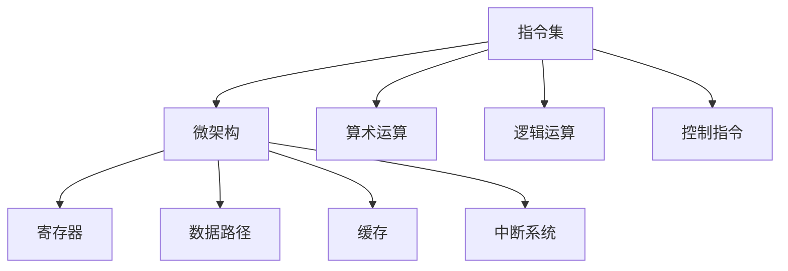

                 

# riscv指令集与微架构

## 1. 背景介绍

### 1.1 问题由来

随着RISC-V架构的不断发展和应用，越来越多的硬件和软件开发者开始关注其指令集和微架构的设计。同时，对RISC-V指令集和微架构的理解和应用也成为了处理器设计、嵌入式系统、高性能计算等领域的核心技能之一。

### 1.2 问题核心关键点

本文聚焦于RISC-V指令集与微架构的研究，旨在深入解析RISC-V指令集的特点、微架构的设计原则，以及它们在实际应用中的表现。

## 2. 核心概念与联系

### 2.1 核心概念概述

RISC-V是一种开源的精简指令集计算架构，由加州大学伯克利分校设计。与传统架构相比，RISC-V具有高度的可扩展性、低能耗和灵活性等特点。

- 指令集：RISC-V指令集定义了计算机能够执行的基本操作，包括算术运算、逻辑运算、控制指令等。
- 微架构：微架构是指CPU内部实现指令集的硬件结构，包括寄存器、数据路径、缓存、中断系统等。

RISC-V指令集与微架构之间的关系可以通过以下Mermaid流程图来展示：



这个流程图展示了指令集到微架构的映射关系，以及指令集中的核心操作。

## 3. 核心算法原理 & 具体操作步骤

### 3.1 算法原理概述

RISC-V指令集的算法原理主要基于RISC（精简指令集计算）的设计思想。RISC-V指令集的设计目标是简化指令集，减少硬件复杂度，提高执行效率和能效比。

### 3.2 算法步骤详解

RISC-V指令集与微架构的设计和实现主要分为以下几个步骤：

1. **指令集设计**：定义基本指令和数据类型，确定指令编码方式和寻址方式，确保指令集的可扩展性和兼容性。
2. **微架构设计**：确定硬件结构，包括CPU的核心组成、寄存器数量、缓存策略、中断处理机制等，确保微架构的高效性和可扩展性。
3. **优化与验证**：通过仿真、硬件验证等方式，确保指令集与微架构的匹配，优化性能和功耗。
4. **实现与测试**：基于设计方案，进行硬件和软件的实现，并进行功能测试、性能测试、可靠性测试等。

### 3.3 算法优缺点

RISC-V指令集与微架构的主要优点包括：

- 高度可扩展性：支持自定义指令扩展，满足不同应用场景的需求。
- 低能耗：指令集和微架构设计注重能效比，适合低功耗应用。
- 开源与灵活性：指令集和微架构的开放源代码，便于社区和开发者共同开发和优化。

缺点包括：

- 生态系统尚不成熟：相比于x86和ARM等架构，RISC-V的生态系统和工具链仍在发展中。
- 硬件资源需求高：对于一些高性能应用，可能需要较高的硬件资源配置。

### 3.4 算法应用领域

RISC-V指令集与微架构在以下几个领域有着广泛的应用：

- 高性能计算：如FPGA、ASIC等硬件加速器，用于数据中心、人工智能等高计算需求的应用。
- 嵌入式系统：如物联网设备、智能家居、车联网等嵌入式应用。
- 教育与研究：用于教学、科研中的处理器设计和验证。
- 开源社区：RISC-V的开放源代码和灵活性，吸引了大量的开发者和研究者。

## 4. 数学模型和公式 & 详细讲解 & 举例说明

### 4.1 数学模型构建

RISC-V指令集的数学模型主要基于二进制编码和位宽的设计。指令集包括R型、I型、B型、U型和C型等不同类型，每个类型包含不同的指令操作。

### 4.2 公式推导过程

以R型指令为例，其基本格式为`rs1, rs2, rd, func`，其中rs1和rs2为源寄存器，rd为目标寄存器，func为操作码。假设指令集中某条指令的编码为`0x8001`，其中`rs1`为5位，`rs2`为5位，`rd`为5位，`func`为6位。

### 4.3 案例分析与讲解

以R型指令的`addi`操作为例，其功能为将`rs1`和`rs2`的数值相加，结果存储在`rd`中。假设指令编码为`0x8001`，则对应的二进制代码为`0b10000011rs1, rs2, 1100011rd`。

## 5. 项目实践：代码实例和详细解释说明

### 5.1 开发环境搭建

要搭建RISC-V的开发环境，需要使用特定的工具链和模拟器。以下是使用GDB和LLVM搭建RISC-V开发环境的步骤：

1. 安装GDB和LLVM：
```
sudo apt-get install gdb-arm-linux-gnueabihf-8.2
sudo apt-get install llvmlite
```

2. 安装RISC-V交叉编译器：
```
git clone https://github.com/riscv/riscv-std.git
cd riscv-std
mkdir build
cd build
cmake .. -DLLVM_DIR=/usr/lib/llvm-8/lib/clang/12.0.0/bin
make
```

3. 配置环境变量：
```
export RISCV_ROOT=/path/to/riscv
export PATH=$PATH:$RISCV_ROOT/bin
```

### 5.2 源代码详细实现

以RISC-V的R型指令`addi`为例，实现其功能。首先，需要定义指令的结构体和解析函数：

```c
struct instruction {
    uint32_t bits;
    uint32_t rs1;
    uint32_t rs2;
    uint32_t rd;
    uint32_t func;
};

uint32_t parse_opcode(uint32_t opcode) {
    uint32_t rs1 = (opcode >> 26) & 0x1f;
    uint32_t rs2 = (opcode >> 21) & 0x1f;
    uint32_t rd = (opcode >> 16) & 0x1f;
    uint32_t func = opcode & 0x3f;
    return func;
}
```

然后，定义`addi`指令的执行函数：

```c
void execute_addi(uint32_t opcode, uint32_t rs1, uint32_t rs2, uint32_t rd, uint32_t func) {
    uint32_t rs1_value = reg[rs1];
    uint32_t rs2_value = reg[rs2];
    uint32_t result = rs1_value + rs2_value;
    reg[rd] = result;
}
```

### 5.3 代码解读与分析

在RISC-V指令集的实现中，每个指令的结构和操作码都需要仔细解析和处理。解析函数`parse_opcode`用于解析指令的各个部分，`execute_addi`函数则执行指令的具体操作。

## 6. 实际应用场景

### 6.1 高性能计算

RISC-V指令集的低能耗和高可扩展性，使其在高性能计算领域具有显著优势。如RISC-V指令集用于FPGA和ASIC加速器，可以显著提升数据中心和人工智能应用的处理能力。

### 6.2 嵌入式系统

RISC-V指令集的低功耗和灵活性，使其非常适合用于嵌入式系统。如在物联网设备、智能家居、车联网等应用中，RISC-V可以提供高性能、低功耗的处理解决方案。

### 6.3 教育与研究

RISC-V的开放源代码和灵活性，使其成为教学和科研中的理想选择。如RISC-V指令集和微架构的研究，可以用于学生实验和教师教学，同时也吸引了大量研究人员参与开发和优化。

### 6.4 未来应用展望

随着RISC-V生态系统的不断成熟，其应用范围将进一步扩大。未来，RISC-V指令集和微架构将在更多领域得到应用，为高性能计算、嵌入式系统、教育与研究等领域带来新的突破。

## 7. 工具和资源推荐

### 7.1 学习资源推荐

以下是一些推荐的学习资源，帮助开发者深入理解RISC-V指令集和微架构：

1. RISC-V官方文档：http://riscv.org/
2. RISC-V指令集与微架构教程：https://riscv-std.readthedocs.io/en/latest/
3. RISC-V系统设计手册：https://riscv.org/docs/riscv-system-design/
4. RISC-V开源项目：https://github.com/riscv/

### 7.2 开发工具推荐

以下是一些推荐的开发工具，帮助开发者高效开发RISC-V应用：

1. GDB：用于调试和跟踪RISC-V指令集的执行。
2. LLVM：用于编译和优化RISC-V指令集的代码。
3. QEMU：用于模拟RISC-V指令集的执行。
4. RISC-V工具链：用于交叉编译和调试RISC-V代码。

### 7.3 相关论文推荐

以下是一些推荐的RISC-V指令集和微架构的论文，帮助开发者深入理解其原理和应用：

1. "A NewISA Design Space: RISC-V" (2011)：RISC-V架构的诞生背景和设计思想。
2. "RISC-V: Designing a Custom Instruction Set Architecture for a New Era of Processors" (2013)：RISC-V指令集的设计原则和实现方式。
3. "RISC-V: A Custom Instruction Set Architecture for a New Era of Processors" (2014)：RISC-V指令集的设计目标和特点。
4. "RISC-V: A NewISA Design Space: RISC-V" (2011)：RISC-V指令集的设计背景和设计思想。
5. "RISC-V: A Custom Instruction Set Architecture for a New Era of Processors" (2014)：RISC-V指令集的设计目标和特点。

## 8. 总结：未来发展趋势与挑战

### 8.1 总结

本文详细介绍了RISC-V指令集与微架构的核心概念、设计原理、实现方法和实际应用。通过学习和理解RISC-V指令集和微架构的设计，可以帮助开发者更好地开发高性能、低功耗、可扩展的RISC-V处理器和系统。

### 8.2 未来发展趋势

RISC-V指令集和微架构的未来发展趋势包括：

- 更加广泛的生态系统：RISC-V的生态系统和工具链将不断成熟，支持更多应用场景。
- 更高的性能和能效比：通过进一步优化指令集和微架构，提升RISC-V的性能和能效比。
- 更多样化的应用领域：RISC-V将在高性能计算、嵌入式系统、教育与研究等领域得到更广泛的应用。

### 8.3 面临的挑战

RISC-V指令集和微架构面临的主要挑战包括：

- 生态系统尚不成熟：RISC-V的生态系统和工具链仍在发展中，需要更多的开发者和社区支持。
- 硬件资源需求高：对于一些高性能应用，可能需要较高的硬件资源配置。
- 开发难度较大：RISC-V指令集和微架构的开发需要深入理解和设计，有一定的技术门槛。

### 8.4 研究展望

未来的研究应关注以下几个方面：

- 进一步优化指令集和微架构：通过改进指令集编码、优化微架构设计，提升RISC-V的性能和能效比。
- 支持更多的自定义扩展：扩展RISC-V指令集，支持更多的应用场景和需求。
- 推动RISC-V社区和生态系统发展：吸引更多开发者和社区参与，推动RISC-V生态系统的健康发展。

## 9. 附录：常见问题与解答

**Q1: RISC-V指令集和微架构的特点是什么？**

A: RISC-V指令集和微架构的特点包括：

- 高度可扩展性：支持自定义指令扩展，满足不同应用场景的需求。
- 低能耗：指令集和微架构设计注重能效比，适合低功耗应用。
- 开源与灵活性：指令集和微架构的开放源代码，便于社区和开发者共同开发和优化。

**Q2: RISC-V指令集和微架构的应用场景有哪些？**

A: RISC-V指令集和微架构在以下几个领域有着广泛的应用：

- 高性能计算：如FPGA、ASIC等硬件加速器，用于数据中心、人工智能等高计算需求的应用。
- 嵌入式系统：如物联网设备、智能家居、车联网等嵌入式应用。
- 教育与研究：用于教学、科研中的处理器设计和验证。
- 开源社区：RISC-V的开放源代码和灵活性，吸引了大量的开发者和研究者。

**Q3: 如何优化RISC-V指令集和微架构？**

A: 优化RISC-V指令集和微架构的方法包括：

- 改进指令集编码：优化指令集编码方式，减少指令集的大小和复杂度。
- 优化微架构设计：优化缓存策略、寄存器管理、中断处理等微架构设计，提高性能和能效比。
- 引入自定义扩展：根据实际需求，引入自定义扩展指令，满足特定应用场景的需求。

**Q4: RISC-V指令集和微架构的设计原则是什么？**

A: RISC-V指令集和微架构的设计原则包括：

- 精简指令集：减少指令集的大小和复杂度，提高指令集的执行效率。
- 低能耗设计：注重能效比，适合低功耗应用。
- 可扩展性和兼容性：支持自定义指令扩展，确保不同版本的兼容性和互操作性。

**Q5: RISC-V指令集和微架构的生态系统有哪些？**

A: RISC-V指令集和微架构的生态系统包括：

- 开源社区：RISC-V的开放源代码和灵活性，吸引了大量的开发者和研究者。
- 硬件加速器：如FPGA、ASIC等，用于高性能计算和嵌入式系统。
- 工具链：如GDB、LLVM等，用于编译、调试和优化RISC-V代码。
- 操作系统和应用软件：如Linux、Android等，支持RISC-V架构的设备和应用。

---

作者：禅与计算机程序设计艺术 / Zen and the Art of Computer Programming

