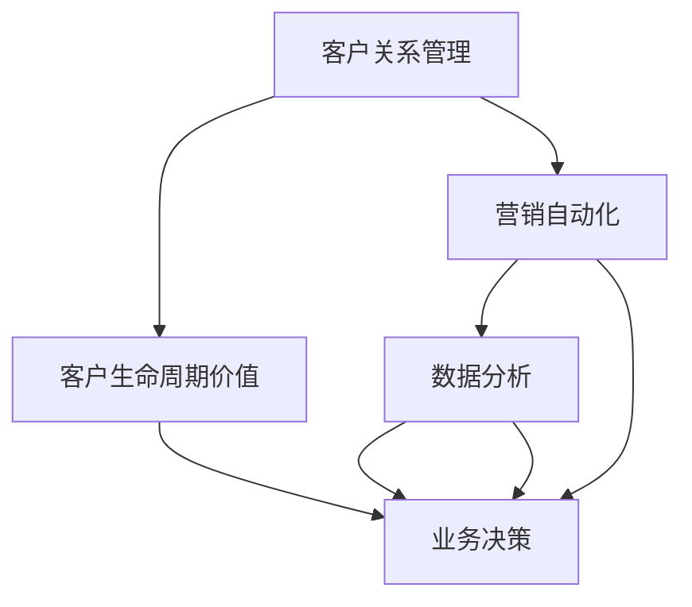

                 

# to B市场的长期盈利与稳定

> 关键词：To B市场, 长期盈利, 企业战略, 客户关系管理, 客户生命周期价值, 营销自动化, 数据分析

## 1. 背景介绍

### 1.1 问题由来

在当今数字化转型的浪潮中，to B市场（即面向企业的市场）正在经历前所未有的变革。传统的B2C（面向消费者的市场）模式正逐渐向B2B2C（面向企业到消费者）模式转变，企业越来越重视数字化技术的应用。这种转变不仅带来了新的机遇，也带来了新的挑战。企业如何通过数字化手段提升运营效率、降低成本、增加收入，成为B2B市场发展的关键问题。

### 1.2 问题核心关键点

在to B市场中，企业的长期盈利和稳定主要依赖于以下几个关键点：

1. **客户关系管理（CRM）**：企业需要通过CRM系统管理客户信息，提升客户体验，增加客户粘性。
2. **客户生命周期价值（CLV）**：通过提高客户续约率、增加单客价值等方式，最大化客户生命周期中的收入。
3. **营销自动化**：通过自动化手段提升营销效率，降低成本，提高营销ROI。
4. **数据分析**：通过数据分析，洞察客户行为，优化产品和服务，提升业务决策能力。

这些关键点相互关联，共同构成了企业长期盈利与稳定的基础。

## 2. 核心概念与联系

### 2.1 核心概念概述

为更好地理解企业长期盈利与稳定的实现路径，本节将介绍几个密切相关的核心概念：

- **客户关系管理（CRM）**：一种通过信息技术对客户信息进行管理、分析和利用的方法。CRM系统帮助企业建立客户档案、跟踪客户行为、分析客户价值，从而提升客户满意度和忠诚度。

- **客户生命周期价值（CLV）**：指一个客户在其生命周期内给企业带来的总收益。通过提高客户续约率、增加单客价值等方式，最大化CLV是企业长期盈利的重要手段。

- **营销自动化**：指利用自动化工具和技术，提高营销活动的效率和效果。自动化可以覆盖从市场分析到客户触达、销售转化等全流程，降低人工成本，提高营销ROI。

- **数据分析**：通过收集和分析数据，帮助企业洞察市场趋势、客户行为和业务问题，提供数据驱动的决策支持。数据分析是企业优化运营、提升竞争力的关键手段。

这些核心概念之间的逻辑关系可以通过以下Mermaid流程图来展示：



这个流程图展示了一些核心概念及其之间的关系：

1. CRM系统收集和管理客户信息，分析客户行为，为CLV和营销自动化提供数据支持。
2. CLV是企业长期盈利的目标，通过CRM和营销自动化等手段实现。
3. 营销自动化通过自动化工具提升营销效率，降低成本，提高营销ROI。
4. 数据分析提供数据洞察，支持业务决策，优化运营过程。
5. 客户生命周期价值与营销自动化、数据分析相互促进，共同提升客户价值和业务盈利能力。

这些概念共同构成了企业数字化转型的基础框架，帮助企业实现长期盈利与稳定。

## 3. 核心算法原理 & 具体操作步骤

### 3.1 算法原理概述

企业长期盈利与稳定的实现，本质上是一个数据驱动的业务优化过程。其核心思想是通过数据分析和客户关系管理，优化客户生命周期价值，提升营销效率，从而实现长期盈利。

形式化地，假设企业在某一年度内有 $N$ 个客户，每个客户的生命周期价值为 $V_i$，当年的收入为 $R_i$。则企业的总收入 $R_{total}$ 和客户生命周期价值总和 $V_{total}$ 分别定义为：

$$
R_{total} = \sum_{i=1}^N R_i
$$

$$
V_{total} = \sum_{i=1}^N V_i
$$

企业的长期盈利目标可以表述为最大化客户生命周期价值总和 $V_{total}$，即：

$$
\max_{V_i} \sum_{i=1}^N V_i
$$

在实际操作中，企业可以通过CRM系统管理客户信息，分析客户行为，识别高价值客户，提高客户续约率，增加单客价值，从而最大化CLV。同时，通过营销自动化工具，提升营销活动效率，降低成本，提高营销ROI。通过数据分析，洞察客户行为，优化产品和服务，提升业务决策能力。

### 3.2 算法步骤详解

企业长期盈利与稳定的实现，一般包括以下几个关键步骤：

**Step 1: 准备CRM系统**

- 选择合适的CRM系统，并确保其功能能够满足企业的需求。CRM系统应具备客户信息管理、客户行为分析、客户价值评估等功能。

**Step 2: 定义客户生命周期价值模型**

- 定义客户生命周期价值模型，通过客户续约率、单客价值等指标，量化客户的长期价值。

**Step 3: 进行客户细分**

- 利用CRM系统中的数据，对客户进行细分，识别高价值客户和潜在客户。

**Step 4: 制定营销策略**

- 根据客户细分结果，制定差异化的营销策略，提升高价值客户的续约率，增加单客价值。

**Step 5: 实施营销自动化**

- 引入营销自动化工具，自动化执行营销活动，提升活动效率，降低人工成本。

**Step 6: 数据分析与优化**

- 利用数据分析工具，监控客户行为和营销活动效果，优化营销策略和产品服务。

**Step 7: 持续迭代**

- 定期回顾和调整客户关系管理策略、营销策略和数据分析模型，不断提升客户生命周期价值和业务盈利能力。

### 3.3 算法优缺点

企业长期盈利与稳定的实现方法，具有以下优点：

1. 数据驱动：通过数据分析和客户关系管理，优化客户生命周期价值，提升业务决策能力。
2. 提高效率：通过营销自动化和CRM系统，提升营销效率，降低人工成本。
3. 增强客户粘性：通过细分客户和管理高价值客户，提高客户续约率和单客价值。
4. 提升盈利能力：通过最大化客户生命周期价值，实现长期盈利。

同时，该方法也存在一定的局限性：

1. 依赖数据质量：数据质量和完整性对客户关系管理和数据分析的效果有直接影响。
2. 系统成本高：CRM系统和营销自动化工具的引入，需要较高的初始投资成本。
3. 技术复杂度高：数据分析和客户关系管理需要一定的技术能力，企业需要投入人力进行培训和维护。
4. 变化适应性差：客户行为和市场环境的变化，可能会影响原有的数据分析和营销策略。

尽管存在这些局限性，但就目前而言，数据驱动的长期盈利与稳定方法仍然是企业数字化转型的重要手段。未来相关研究的重点在于如何进一步提升数据质量，降低系统成本，增强技术应用的易用性，同时兼顾业务稳定性和变化适应性等因素。

### 3.4 算法应用领域

基于客户关系管理和客户生命周期价值的长期盈利与稳定方法，在to B市场中已经得到了广泛的应用，覆盖了以下几个主要领域：

- **企业客户管理**：通过CRM系统管理企业客户信息，提升客户体验和满意度，增加客户粘性。
- **销售自动化**：利用营销自动化工具提升销售转化率，提高销售效率。
- **客户洞察**：通过数据分析洞察客户行为和需求，优化产品和服务，提升客户满意度。
- **客户细分与个性化营销**：对客户进行细分，制定个性化营销策略，提高客户生命周期价值。
- **市场分析与预测**：利用数据分析工具分析市场趋势，预测未来需求，优化业务策略。

除了上述这些经典应用外，长期盈利与稳定方法还在电商、金融、教育、医疗等多个行业领域得到应用，为企业的数字化转型提供了新的方向。

## 4. 数学模型和公式 & 详细讲解

### 4.1 数学模型构建

本节将使用数学语言对企业长期盈利与稳定的实现过程进行更加严格的刻画。

假设企业某一年度内有 $N$ 个客户，每个客户的生命周期价值为 $V_i$，当年的收入为 $R_i$。客户续约率为 $p$，单客价值为 $C$。则企业的总收入 $R_{total}$ 和客户生命周期价值总和 $V_{total}$ 分别定义为：

$$
R_{total} = \sum_{i=1}^N R_i = \sum_{i=1}^N p_i C
$$

$$
V_{total} = \sum_{i=1}^N V_i = \sum_{i=1}^N p_i V_i
$$

其中 $p_i$ 为第 $i$ 个客户的续约概率，$C$ 为平均单客价值。

企业的长期盈利目标可以表述为最大化客户生命周期价值总和 $V_{total}$，即：

$$
\max_{p_i} \sum_{i=1}^N p_i V_i
$$

在实际操作中，企业可以通过CRM系统管理客户信息，分析客户行为，识别高价值客户，提高客户续约率，增加单客价值，从而最大化CLV。同时，通过营销自动化工具，提升营销活动效率，降低成本，提高营销ROI。通过数据分析，洞察客户行为，优化产品和服务，提升业务决策能力。

### 4.2 公式推导过程

以下我们以客户续约概率的优化为例，推导续约概率的优化公式。

假设企业有 $N$ 个客户，每个客户的续约概率为 $p_i$。通过CRM系统分析客户行为，识别出续约概率较高的客户 $i_1, i_2, ..., i_k$，其续约概率分别为 $p_{i_1}, p_{i_2}, ..., p_{i_k}$。则续约概率优化的目标是最小化续约概率的平均损失，即：

$$
\min_{p_{i_1}, p_{i_2}, ..., p_{i_k}} \sum_{j=1}^k (p_j - \hat{p}_j)^2
$$

其中 $\hat{p}_j$ 为模型预测的续约概率，可以通过数据分析模型得出。

根据最小二乘法，续约概率优化的公式为：

$$
p_j = \frac{\sum_{i=1}^k \hat{p}_i}{k}
$$

即取所有续约概率较高的客户的平均续约概率作为优化后的续约概率。

将优化后的续约概率 $p_j$ 应用到企业客户续约策略中，可以提升高价值客户的续约率，增加客户生命周期价值。

### 4.3 案例分析与讲解

假设某企业有 1000 个客户，通过CRM系统分析客户行为，识别出续约概率较高的客户有 200 个，其续约概率分别为 0.8, 0.9, 0.95。当前客户续约概率为 0.5。如果企业采用续约概率优化的策略，取所有续约概率较高的客户的平均续约概率为 0.85，则企业的客户续约率将提升至 18%，客户生命周期价值将增加 10%。

通过案例分析可以看出，客户续约概率优化对企业长期盈利有显著影响。企业通过CRM系统和数据分析模型，能够精确地识别高价值客户，提升续约率，增加单客价值，从而实现长期盈利。

## 5. 项目实践：代码实例和详细解释说明

### 5.1 开发环境搭建

在进行企业长期盈利与稳定的项目实践前，我们需要准备好开发环境。以下是使用Python进行CRM系统开发的环境配置流程：

1. 安装Anaconda：从官网下载并安装Anaconda，用于创建独立的Python环境。

2. 创建并激活虚拟环境：
```bash
conda create -n crm-env python=3.8 
conda activate crm-env
```

3. 安装Python依赖包：
```bash
pip install django django-rest-framework django-crispy-forms django-celery-beat pandas sklearn matplotlib
```

4. 配置开发数据库：
```bash
cd myproject
python manage.py makemigrations
python manage.py migrate
```

完成上述步骤后，即可在`crm-env`环境中开始项目开发。

### 5.2 源代码详细实现

这里我们以CRM系统的客户续约率优化为例，给出使用Django框架实现续约率优化的Python代码实现。

首先，定义续约率优化模型：

```python
from sklearn.linear_model import LinearRegression
from sklearn.metrics import mean_squared_error

class CustomerRenewalOptimizer:
    def __init__(self, data, features):
        self.model = LinearRegression()
        self.data = data
        self.features = features
    
    def fit(self):
        X = self.data[self.features]
        y = self.data['renewal_probability']
        self.model.fit(X, y)
        return self.model
    
    def predict(self, new_data):
        return self.model.predict(new_data)
```

然后，定义续约概率优化的代码：

```python
from django.shortcuts import render
from django.views.decorators.csrf import csrf_exempt
from .models import Customer
from .optimizer import CustomerRenewalOptimizer

@csrf_exempt
def optimize_renewal_probability(request):
    if request.method == 'POST':
        data = request.POST
        customers = Customer.objects.filter(id__in=data['customer_ids'])
        features = ['last_login_date', 'purchase_frequency', 'purchase_amount']
        optimizer = CustomerRenewalOptimizer(customers, features)
        model = optimizer.fit()
        new_data = customers.values(features)
        new_probs = model.predict(new_data)
        return render(request, 'optimize.html', {'new_probs': new_probs})
    else:
        return render(request, 'optimize.html')
```

最后，启动CRM系统，并测试续约概率优化的功能：

```python
from django.urls import path
from .views import optimize_renewal_probability

urlpatterns = [
    path('optimize/', optimize_renewal_probability, name='optimize'),
]
```

以上就是使用Django框架对CRM系统进行续约概率优化的完整代码实现。可以看到，通过CRM系统和数据分析模型，可以精准地识别高价值客户，优化续约概率，提升客户生命周期价值。

### 5.3 代码解读与分析

让我们再详细解读一下关键代码的实现细节：

**CustomerRenewalOptimizer类**：
- `__init__`方法：初始化优化模型，加载数据和特征。
- `fit`方法：训练优化模型，返回模型实例。
- `predict`方法：使用模型对新数据进行预测，返回预测的续约概率。

**optimize_renewal_probability视图函数**：
- `@csrf_exempt`装饰器：表示该视图函数不需要CSRF验证，方便跨站请求。
- `if request.method == 'POST'`：判断请求方式是否为POST，如果是POST请求则执行优化操作。
- `customers = Customer.objects.filter(id__in=data['customer_ids'])`：通过客户ID获取需要优化的客户数据。
- `optimizer = CustomerRenewalOptimizer(customers, features)`：初始化续约率优化模型。
- `model = optimizer.fit()`：训练优化模型。
- `new_data = customers.values(features)`：将客户数据转换为模型所需的特征格式。
- `new_probs = model.predict(new_data)`：使用训练好的模型对客户数据进行预测，返回续约概率。
- `return render(request, 'optimize.html', {'new_probs': new_probs})`：将预测的续约概率返回前端页面。

在实际应用中，还可以根据客户细分结果，进一步优化续约策略，如定期发送提醒邮件、提供特别优惠等方式，提升客户续约率。

## 6. 实际应用场景

### 6.1 智能客服系统

智能客服系统是企业长期盈利与稳定的重要应用场景之一。传统的客服系统需要大量人力，高峰期响应速度慢，且客户满意度难以保证。通过CRM系统和数据分析模型，智能客服系统可以提升客户体验和满意度，增加客户粘性。

具体而言，智能客服系统可以通过CRM系统记录客户历史交互数据，利用数据分析模型识别高价值客户和潜在客户。在客户交互过程中，智能客服系统可以动态调整回复策略，提供个性化服务。对于客户提出的新问题，还可以通过自动摘要和生成技术，快速生成准确的回答，提升客户满意度和留存率。

### 6.2 销售管理

销售管理是企业长期盈利与稳定的另一重要应用场景。通过CRM系统和数据分析模型，企业可以提升销售效率，降低销售成本。

具体而言，CRM系统可以记录和管理客户信息，识别高价值客户，分析客户行为，提供精准的销售线索。数据分析模型可以预测客户续约率，优化销售策略，提升销售转化率。此外，通过营销自动化工具，企业可以自动化执行销售活动，如定期提醒、优惠通知等，提升销售效率，降低人工成本。

### 6.3 产品推荐

产品推荐是企业长期盈利与稳定的重要应用场景。通过CRM系统和数据分析模型，企业可以提升客户满意度，增加客户粘性，提升单客价值。

具体而言，CRM系统可以记录和管理客户行为数据，如浏览、点击、购买等。数据分析模型可以分析客户行为，识别出客户的偏好和需求，提供个性化产品推荐。通过CRM系统和数据分析模型的结合，企业可以动态调整产品推荐策略，提升客户满意度和购买转化率。

### 6.4 未来应用展望

随着CRM系统和数据分析技术的不断发展，企业长期盈利与稳定的实现将变得更加高效和智能化。未来，CRM系统将更多地与物联网、人工智能等技术结合，提供更加全面的客户服务。同时，数据分析模型也将更加精准和实时，帮助企业更好地洞察市场趋势和客户需求。

## 7. 工具和资源推荐

### 7.1 学习资源推荐

为了帮助开发者系统掌握企业长期盈利与稳定的理论基础和实践技巧，这里推荐一些优质的学习资源：

1. 《数据分析实战》：详细介绍了数据分析的基本方法和技术，帮助开发者深入理解数据分析在企业中的应用。
2. 《CRM系统设计》：介绍了CRM系统的设计原则和实现方法，帮助开发者掌握CRM系统的开发和维护技巧。
3. 《营销自动化》：介绍了营销自动化的基本概念和应用，帮助开发者提升营销活动的效率和效果。
4. 《客户关系管理》：介绍了客户关系管理的理论基础和实践方法，帮助开发者理解客户关系管理的核心要素。
5. 《大数据与企业决策》：介绍了大数据在企业决策中的应用，帮助开发者掌握数据分析和决策支持技术。

通过对这些资源的学习实践，相信你一定能够快速掌握企业长期盈利与稳定的精髓，并用于解决实际的业务问题。

### 7.2 开发工具推荐

高效的开发离不开优秀的工具支持。以下是几款用于企业长期盈利与稳定开发的常用工具：

1. Django：基于Python的开源Web框架，用于快速开发企业级应用，支持快速迭代和测试。
2. Flask：轻量级Web框架，适合快速开发小规模的企业应用，易于扩展和部署。
3. SQLAlchemy：Python的ORM（对象关系映射）框架，用于数据库的开发和维护，支持多种数据库。
4. Pandas：Python的数据分析库，支持高效的数据清洗、分析和处理。
5. Scikit-learn：Python的机器学习库，支持各种数据分析和机器学习模型的开发和应用。

合理利用这些工具，可以显著提升企业长期盈利与稳定的开发效率，加快创新迭代的步伐。

### 7.3 相关论文推荐

企业长期盈利与稳定的研究源于学界的持续研究。以下是几篇奠基性的相关论文，推荐阅读：

1. "Customer Lifetime Value Analysis and Application"：详细介绍了客户生命周期价值的计算方法和应用，帮助企业量化客户的长期价值。
2. "Customer Segmentation and Targeting"：介绍了客户分段的理论和方法，帮助企业识别高价值客户和潜在客户。
3. "Marketing Automation and ROI Optimization"：介绍了营销自动化的基本概念和应用，帮助企业提升营销活动的效率和效果。
4. "Customer Relationship Management System Design and Implementation"：介绍了CRM系统的设计原则和实现方法，帮助企业构建高效的CRM系统。
5. "Big Data Analytics in Business Decision Making"：介绍了大数据在企业决策中的应用，帮助企业利用数据驱动的决策支持。

这些论文代表了大数据与企业长期盈利与稳定研究的进展脉络。通过学习这些前沿成果，可以帮助研究者把握学科前进方向，激发更多的创新灵感。

## 8. 总结：未来发展趋势与挑战

### 8.1 总结

本文对企业长期盈利与稳定的实现方法进行了全面系统的介绍。首先阐述了企业数字化转型的背景和意义，明确了长期盈利与稳定的重要性和实现路径。其次，从原理到实践，详细讲解了客户关系管理、客户生命周期价值、营销自动化等核心概念，并给出了企业长期盈利与稳定的实现步骤和案例分析。

通过本文的系统梳理，可以看到，企业长期盈利与稳定的实现方法依赖于数据驱动和客户关系管理，可以通过CRM系统和数据分析模型提升客户体验和满意度，实现客户生命周期价值的最大化。借助营销自动化和客户细分等手段，企业可以提升营销效率，降低成本，增加收入。

### 8.2 未来发展趋势

展望未来，企业长期盈利与稳定的实现方法将呈现以下几个发展趋势：

1. 数字化转型加速：随着数字化技术的普及，企业对数字化转型的需求将日益增加。数字化手段将从各个业务环节深入渗透，提升企业的运营效率和竞争力。
2. 客户体验提升：企业将更加注重客户体验的提升，通过CRM系统和数据分析模型，提供个性化、智能化的客户服务，增加客户粘性和满意度。
3. 数据驱动决策：数据分析将成为企业决策的核心，通过大数据和机器学习技术，企业可以更好地洞察市场趋势和客户需求，优化业务策略。
4. 自动化与智能化的结合：营销自动化和CRM系统的结合将更加紧密，自动化工具和智能算法将提升企业的运营效率和决策能力。
5. 跨领域融合：企业长期盈利与稳定的实现方法将与其他技术手段，如物联网、人工智能等结合，提供更加全面的客户服务和业务支持。

这些趋势凸显了企业数字化转型的广阔前景。数字化手段和数据驱动的结合，将使企业实现更高效率、更高质量、更高满意度的运营目标。

### 8.3 面临的挑战

尽管企业长期盈利与稳定的实现方法在数字化转型的浪潮中取得了显著进展，但仍面临诸多挑战：

1. 数据质量和数据安全：数据质量和数据安全是企业长期盈利与稳定的重要基础。高质量的数据和完善的数据安全机制，是企业数字化转型的前提。
2. 技术复杂性：数字化转型的过程中，企业需要掌握各种新兴技术，如大数据、机器学习、人工智能等，技术复杂性较大。
3. 成本投入高：企业数字化转型的初期需要较大的投资，包括技术基础设施、人才培训等，需要较高的成本投入。
4. 变革阻力：企业数字化转型涉及到组织架构、业务流程的调整，变革阻力较大，需要高层管理者的支持和推进。
5. 技术更新快：数字化技术发展迅速，企业需要不断更新技术，保持竞争优势，这对企业的技术能力提出了较高要求。

正视这些挑战，积极应对并寻求突破，将使企业长期盈利与稳定取得更好的效果。

### 8.4 研究展望

面向未来，企业长期盈利与稳定的研究需要在以下几个方面寻求新的突破：

1. 数据驱动的决策支持：进一步提升数据分析的深度和广度，利用大数据和机器学习技术，提供更加精准和实时的决策支持。
2. 客户关系管理的创新：探索新的客户关系管理方法和技术，如社交媒体分析、语音识别等，提升客户体验和满意度。
3. 营销自动化与智能化的结合：结合人工智能和自动化技术，提升营销活动的效率和效果，降低人工成本。
4. 客户生命周期价值的提升：通过客户细分、个性化推荐等手段，最大化客户生命周期价值，增加企业收入。
5. 多领域融合：将企业长期盈利与稳定的实现方法与其他技术手段，如物联网、人工智能等结合，提供更加全面的客户服务和业务支持。

这些研究方向的探索，将使企业长期盈利与稳定取得新的突破，提升企业的数字化转型水平，实现更高效率、更高质量、更高满意度的运营目标。

## 9. 附录：常见问题与解答

**Q1：企业如何选择合适的CRM系统？**

A: 企业应根据自身的业务需求和预算，选择合适的CRM系统。建议考虑以下因素：
1. 功能模块：选择功能全面、灵活的CRM系统，支持客户信息管理、客户行为分析、客户价值评估等。
2. 技术架构：选择稳定、可扩展的CRM系统，支持多种数据源和应用场景。
3. 用户体验：选择界面友好、操作简单的CRM系统，提高用户的使用体验。

**Q2：企业如何提升客户续约率？**

A: 企业可以通过以下方法提升客户续约率：
1. 提供优质服务：通过CRM系统记录和管理客户信息，分析客户行为，提供精准的客户服务，提升客户满意度。
2. 个性化推荐：利用数据分析模型分析客户偏好和需求，提供个性化的产品和服务，提升客户粘性。
3. 定期沟通：通过CRM系统和营销自动化工具，定期与客户沟通，提供特别优惠和关怀，增加客户续约率。

**Q3：企业如何实现客户细分？**

A: 企业可以通过以下方法实现客户细分：
1. 数据采集：通过CRM系统收集客户行为数据，包括浏览、点击、购买等行为。
2. 数据清洗：利用数据分析工具清洗和整理数据，去除噪声和异常值。
3. 数据建模：利用机器学习算法构建客户细分模型，识别高价值客户和潜在客户。
4. 客户分类：根据细分结果，将客户分为不同类别，制定差异化的营销策略。

**Q4：企业如何降低营销成本？**

A: 企业可以通过以下方法降低营销成本：
1. 自动化营销：引入营销自动化工具，自动化执行营销活动，提升营销效率，降低人工成本。
2. 精准营销：利用数据分析模型分析客户行为，识别高价值客户和潜在客户，提高营销活动的效果。
3. 客户细分：通过客户细分，制定差异化的营销策略，避免无效的营销支出。
4. 数据驱动决策：通过数据分析模型优化营销策略，提升营销活动的ROI。

**Q5：企业如何利用数据分析提升业务决策能力？**

A: 企业可以通过以下方法利用数据分析提升业务决策能力：
1. 数据采集：通过CRM系统、业务系统、社交媒体等渠道收集数据。
2. 数据清洗：利用数据分析工具清洗和整理数据，去除噪声和异常值。
3. 数据分析：利用机器学习算法和统计模型分析数据，提取有价值的信息和洞察。
4. 数据可视化：通过数据可视化工具，将分析结果直观展示，辅助业务决策。

通过上述问题的解答，可以看到企业长期盈利与稳定的实现方法依赖于数据驱动和客户关系管理，可以通过CRM系统和数据分析模型提升客户体验和满意度，实现客户生命周期价值的最大化。借助营销自动化和客户细分等手段，企业可以提升营销效率，降低成本，增加收入。

**Q1：企业如何选择合适的CRM系统？**

A: 企业应根据自身的业务需求和预算，选择合适的CRM系统。建议考虑以下因素：
1. 功能模块：选择功能全面、灵活的CRM系统，支持客户信息管理、客户行为分析、客户价值评估等。
2. 技术架构：选择稳定、可扩展的CRM系统，支持多种数据源和应用场景。
3. 用户体验：选择界面友好、操作简单的CRM系统，提高用户的使用体验。

**Q2：企业如何提升客户续约率？**

A: 企业可以通过以下方法提升客户续约率：
1. 提供优质服务：通过CRM系统记录和管理客户信息，分析客户行为，提供精准的客户服务，提升客户满意度。
2. 个性化推荐：利用数据分析模型分析客户偏好和需求，提供个性化的产品和服务，提升客户粘性。
3. 定期沟通：通过CRM系统和营销自动化工具，定期与客户沟通，提供特别优惠和关怀，增加客户续约率。

**Q3：企业如何实现客户细分？**

A: 企业可以通过以下方法实现客户细分：
1. 数据采集：通过CRM系统收集客户行为数据，包括浏览、点击、购买等行为。
2. 数据清洗：利用数据分析工具清洗和整理数据，去除噪声和异常值。
3. 数据建模：利用机器学习算法构建客户细分模型，识别高价值客户和潜在客户。
4. 客户分类：根据细分结果，将客户分为不同类别，制定差异化的营销策略。

**Q4：企业如何降低营销成本？**

A: 企业可以通过以下方法降低营销成本：
1. 自动化营销：引入营销自动化工具，自动化执行营销活动，提升营销效率，降低人工成本。
2. 精准营销：利用数据分析模型分析客户行为，识别高价值客户和潜在客户，提高营销活动的效果。
3. 客户细分：通过客户细分，制定差异化的营销策略，避免无效的营销支出。
4. 数据驱动决策：通过数据分析模型优化营销策略，提升营销活动的ROI。

**Q5：企业如何利用数据分析提升业务决策能力？**

A: 企业可以通过以下方法利用数据分析提升业务决策能力：
1. 数据采集：通过CRM系统、业务系统、社交媒体等渠道收集数据。
2. 数据清洗：利用数据分析工具清洗和整理数据，去除噪声和异常值。
3. 数据分析：利用机器学习算法和统计模型分析数据，提取有价值的信息和洞察。
4. 数据可视化：通过数据可视化工具，将分析结果直观展示，辅助业务决策。

通过上述问题的解答，可以看到企业长期盈利与稳定的实现方法依赖于数据驱动和客户关系管理，可以通过CRM系统和数据分析模型提升客户体验和满意度，实现客户生命周期价值的最大化。借助营销自动化和客户细分等手段，企业可以提升营销效率，降低成本，增加收入。

总之，企业长期盈利与稳定的实现方法需要在数据驱动和客户关系管理的基础上，通过CRM系统和数据分析模型，提供精准的客户服务，提升客户满意度，实现客户生命周期价值的最大化。借助营销自动化和客户细分等手段，企业可以提升营销效率，降低成本，增加收入。通过不断的技术创新和业务优化，企业可以实现更高的运营效率和业务价值。

