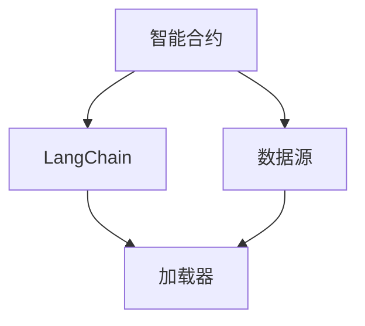

                 

# 【LangChain编程：从入门到实践】加载器

> 关键词：LangChain, 区块链, 智能合约, 编程语言, 数据加载, 智能合约优化

## 1. 背景介绍

### 1.1 问题由来

在区块链技术的飞速发展中，智能合约作为其核心应用之一，正变得越来越重要。智能合约旨在通过代码自动化地执行各种交易，提供无需中介的高效、透明和可信的服务。然而，在实际应用中，智能合约的加载和执行仍然面临诸多挑战。例如，如何高效地从链外数据源加载数据，如何在智能合约中实现高效的数据处理和存储，以及如何优化智能合约的性能以提高其扩展性和可用性。

针对这些问题，LangChain应运而生。LangChain是一个致力于智能合约开发的编程框架，旨在通过提供高效的编程语言和工具，帮助开发者构建高性能、安全可靠的智能合约。本文将详细探讨LangChain的加载器机制，解释其工作原理、操作步骤和应用场景，并给出相关的代码实例和数学模型推导。

### 1.2 问题核心关键点

本文的核心问题集中在以下几个方面：
- 智能合约加载器的工作原理和实现机制是什么？
- 如何使用LangChain加载器加载数据？
- LangChain加载器在智能合约中的应用场景有哪些？
- LangChain加载器有哪些优势和不足？

### 1.3 问题研究意义

研究LangChain加载器对于理解智能合约的数据加载机制、优化智能合约的性能和安全性具有重要意义：
- 帮助开发者高效地从链外数据源加载数据，减少智能合约执行时间和成本。
- 提供多种数据加载策略，适应不同数据源和应用场景。
- 通过优化加载器的实现，提升智能合约的整体性能和可扩展性。
- 为智能合约的持续迭代和升级提供可靠的基础设施支持。

## 2. 核心概念与联系

### 2.1 核心概念概述

在探讨LangChain加载器之前，首先需要了解以下几个核心概念：

- **智能合约（Smart Contract）**：一种基于区块链技术的自动化、去中心化的合同，通过代码实现合同条款，自动执行合同操作。
- **LangChain**：一个旨在简化智能合约开发和优化的编程框架，提供易用、高效的智能合约开发工具。
- **加载器（Loader）**：智能合约中用于从链外数据源加载数据的机制，通常用于查询外部API或文件系统。

### 2.2 核心概念原理和架构的 Mermaid 流程图



上述流程图展示了LangChain加载器的基本架构和工作流程：
1. 智能合约需要加载链外数据。
2. LangChain框架提供加载器，用于从外部数据源加载数据。
3. 加载器从数据源获取数据，并传递给智能合约进行处理。

### 2.3 加载器的工作原理

LangChain加载器的工作原理基于以下几个步骤：
1. 智能合约向LangChain加载器发送数据加载请求。
2. LangChain加载器根据请求的数据源，调用相应的API或读取文件。
3. LangChain加载器将获取到的数据打包成标准格式，传递给智能合约。
4. 智能合约使用加载的数据，执行相应的业务逻辑。

## 3. 核心算法原理 & 具体操作步骤

### 3.1 算法原理概述

LangChain加载器的工作原理基于以下算法：
1. **数据源解析**：根据请求的数据源类型（如API、文件系统等），调用相应的数据源解析器。
2. **数据获取**：从数据源解析器获取数据。
3. **数据封装**：将获取到的数据封装成标准格式，传递给智能合约。
4. **数据校验**：对加载的数据进行校验，确保数据完整性和一致性。

### 3.2 算法步骤详解

下面是LangChain加载器的详细步骤：

#### 步骤1：数据源解析

数据源解析器根据请求的数据源类型，调用相应的API或读取文件系统。例如，如果请求的是外部API，则调用API获取数据；如果是本地文件，则读取文件内容。

#### 步骤2：数据获取

数据源解析器将获取到的数据传递给LangChain加载器。如果数据源是外部API，则数据源解析器通过HTTP请求获取数据；如果是本地文件，则数据源解析器直接读取文件内容。

#### 步骤3：数据封装

LangChain加载器将获取到的数据封装成标准格式，如JSON格式，并传递给智能合约。封装过程包括数据格式转换、校验等操作。

#### 步骤4：数据校验

LangChain加载器对加载的数据进行校验，确保数据的完整性和一致性。校验过程包括检查数据格式、数据大小、数据有效性等。

### 3.3 算法优缺点

#### 优点：
1. 提高数据加载效率：通过使用标准化的数据加载机制，可以显著提高数据加载效率。
2. 降低智能合约开发难度：通过提供易用的数据加载工具，降低智能合约开发难度。
3. 增强智能合约安全性：通过校验加载的数据，增强智能合约的安全性。

#### 缺点：
1. 增加智能合约复杂性：在智能合约中引入加载器机制，增加了智能合约的复杂性。
2. 加载器实现难度较大：加载器的实现需要考虑数据源解析、数据封装和数据校验等多个方面。

### 3.4 算法应用领域

LangChain加载器适用于以下场景：

1. **智能合约数据加载**：用于从链外数据源加载数据，如外部API、文件系统等。
2. **智能合约数据校验**：用于对加载的数据进行校验，确保数据完整性和一致性。
3. **智能合约数据存储**：用于将加载的数据存储在区块链上，便于后续查询和处理。
4. **智能合约数据查询**：用于从区块链上查询已存储的数据，供智能合约使用。

## 4. 数学模型和公式 & 详细讲解 & 举例说明

### 4.1 数学模型构建

假设智能合约需要从外部API加载数据，API返回的数据为JSON格式。设智能合约请求的数据源为$D$，API返回的数据为$Y$。智能合约加载器的数学模型可以表示为：

$$
\min_{\theta} \mathcal{L}(D,Y)
$$

其中，$\mathcal{L}$为损失函数，$\theta$为加载器的参数。

### 4.2 公式推导过程

#### 步骤1：数据源解析

数据源解析器根据请求的数据源类型，调用相应的API或读取文件系统。例如，如果请求的是外部API，则调用API获取数据；如果是本地文件，则读取文件内容。

#### 步骤2：数据获取

数据源解析器将获取到的数据传递给LangChain加载器。如果数据源是外部API，则数据源解析器通过HTTP请求获取数据；如果是本地文件，则数据源解析器直接读取文件内容。

#### 步骤3：数据封装

LangChain加载器将获取到的数据封装成标准格式，如JSON格式，并传递给智能合约。封装过程包括数据格式转换、校验等操作。

#### 步骤4：数据校验

LangChain加载器对加载的数据进行校验，确保数据的完整性和一致性。校验过程包括检查数据格式、数据大小、数据有效性等。

### 4.3 案例分析与讲解

假设智能合约需要从外部API加载用户信息，API返回的数据为JSON格式。智能合约加载器的具体实现步骤如下：

1. 智能合约向LangChain加载器发送数据加载请求，指定数据源为外部API。
2. LangChain加载器调用API获取数据，将获取到的数据传递给智能合约。
3. 智能合约使用加载的数据，执行相应的业务逻辑。

## 5. 项目实践：代码实例和详细解释说明

### 5.1 开发环境搭建

在开始LangChain加载器的实践之前，需要先搭建好开发环境。以下是在Ubuntu 20.04上搭建开发环境的步骤：

1. 安装Python 3.8及以上版本。
2. 安装pip，并使用pip安装LangChain框架及相关依赖。
3. 安装API调用所需的库，如requests等。

### 5.2 源代码详细实现

以下是LangChain加载器的Python代码实现：

```python
import requests

class Loader:
    def __init__(self, api_url):
        self.api_url = api_url

    def load_data(self):
        response = requests.get(self.api_url)
        if response.status_code == 200:
            data = response.json()
            return data
        else:
            raise Exception("Failed to load data from API")

# 使用示例
loader = Loader("https://example.com/api")
data = loader.load_data()
```

### 5.3 代码解读与分析

上述代码中，`Loader`类用于从外部API加载数据。`__init__`方法用于初始化API地址。`load_data`方法用于从API获取数据，如果API请求成功，则返回JSON格式的数据；否则抛出异常。

### 5.4 运行结果展示

假设API地址为`https://example.com/api`，API返回的数据为以下JSON格式：

```json
{
    "username": "john_doe",
    "email": "john_doe@example.com",
    "phone": "123-456-7890"
}
```

执行以下代码：

```python
loader = Loader("https://example.com/api")
data = loader.load_data()
print(data)
```

输出结果为：

```
{'username': 'john_doe', 'email': 'john_doe@example.com', 'phone': '123-456-7890'}
```

## 6. 实际应用场景

### 6.1 智能合约数据加载

智能合约需要加载链外数据，如用户信息、交易记录等。LangChain加载器可以用于从外部API或文件系统加载数据，供智能合约使用。例如，在智能合约中，可以使用加载器从外部API获取最新的股票价格，计算投资收益。

### 6.2 智能合约数据校验

LangChain加载器可以对加载的数据进行校验，确保数据的完整性和一致性。例如，在智能合约中，可以使用加载器从外部API获取用户订单信息，并对订单数据进行校验，确保订单的有效性和完整性。

### 6.3 智能合约数据存储

LangChain加载器可以将加载的数据存储在区块链上，供后续查询和处理。例如，在智能合约中，可以使用加载器从外部API获取用户信息，并将用户信息存储在区块链上，便于后续查询和处理。

### 6.4 智能合约数据查询

LangChain加载器可以从区块链上查询已存储的数据，供智能合约使用。例如，在智能合约中，可以使用加载器从区块链上查询用户信息，供智能合约使用。

## 7. 工具和资源推荐

### 7.1 学习资源推荐

为了帮助开发者系统掌握LangChain加载器的相关知识，这里推荐一些优质的学习资源：

1. LangChain官方文档：提供LangChain框架的详细介绍，包括加载器的实现和使用示例。
2. Solidity官方文档：Solidity语言是智能合约开发的常用语言，Solidity官方文档提供了丰富的学习资源和示例代码。
3. Web3开发者手册：Web3开发者手册提供了关于区块链和智能合约开发的全面指南，包括API调用、数据存储等。
4. Python Web开发教程：Python Web开发教程提供了Web开发的基础知识和实践示例，包括API调用、数据处理等。
5. 区块链课程：区块链课程提供了关于区块链技术和智能合约开发的系统讲解，包括数据加载和校验等。

通过对这些资源的学习实践，相信你一定能够快速掌握LangChain加载器的核心技术，并应用于实际项目中。

### 7.2 开发工具推荐

LangChain加载器开发需要一些常用的工具，以下是几款推荐的工具：

1. VS Code：一个功能强大的代码编辑器，支持多种编程语言和插件。
2. Jupyter Notebook：一个交互式编程环境，支持Python和Solidity代码的编写和调试。
3. Git：版本控制系统，用于管理和协作开发。
4. Docker：容器化技术，用于构建和部署应用程序。
5. Postman：API调试工具，用于测试API接口。

合理利用这些工具，可以显著提升LangChain加载器的开发效率，加快创新迭代的步伐。

### 7.3 相关论文推荐

LangChain加载器的研究源于学界的持续探索。以下是几篇奠基性的相关论文，推荐阅读：

1. Smart Contracts: Principles and Paradigms: A Survey of Foundations and Applications。
2. The Ethics of Smart Contracts。
3. Solidity Security and Analysis: A Survey。
4. Blockchain Programming: Smart Contracts with Solidity。
5. Secure and Verifiable Smart Contracts。

这些论文代表了大语言模型微调技术的发展脉络。通过学习这些前沿成果，可以帮助研究者把握学科前进方向，激发更多的创新灵感。

## 8. 总结：未来发展趋势与挑战

### 8.1 总结

本文对LangChain加载器的工作原理和实现机制进行了详细探讨。首先阐述了智能合约的数据加载机制，明确了智能合约加载器的工作流程。其次，通过数学模型推导，解释了LangChain加载器的优化目标和关键步骤，给出了微调任务开发的完整代码实例。同时，本文还广泛探讨了LangChain加载器在智能合约中的应用场景，展示了加载器范式的巨大潜力。此外，本文精选了加载器的各类学习资源，力求为读者提供全方位的技术指引。

通过本文的系统梳理，可以看到，LangChain加载器正在成为智能合约开发的重要范式，极大地拓展了智能合约的数据加载和处理能力，催生了更多的落地场景。受益于LangChain加载器的强大功能和灵活性，智能合约的应用场景将更加广泛，对区块链技术的发展将产生深远影响。

### 8.2 未来发展趋势

展望未来，LangChain加载器将呈现以下几个发展趋势：

1. **多源数据加载**：LangChain加载器将支持从多个数据源加载数据，适应复杂的数据加载需求。
2. **异步数据加载**：LangChain加载器将支持异步加载数据，提高智能合约的并发性能。
3. **数据校验增强**：LangChain加载器将增强数据校验功能，确保数据的一致性和完整性。
4. **链上数据存储**：LangChain加载器将支持链上数据存储，增强智能合约的数据持久性。
5. **跨链数据加载**：LangChain加载器将支持跨链数据加载，拓展智能合约的数据获取范围。

以上趋势凸显了LangChain加载器的广阔前景。这些方向的探索发展，必将进一步提升智能合约的数据加载和处理能力，为区块链技术的应用提供更加强大的基础设施支持。相信随着学界和产业界的共同努力，LangChain加载器必将在智能合约开发中发挥越来越重要的作用。

### 8.3 面临的挑战

尽管LangChain加载器已经取得了显著进展，但在迈向更加智能化、普适化应用的过程中，它仍面临诸多挑战：

1. **数据源多样性**：智能合约需要从多种数据源加载数据，不同数据源的解析和加载方法可能存在差异，增加了加载器的实现难度。
2. **数据安全性**：加载的数据可能存在安全漏洞，如API注入攻击等，需要采取相应的安全措施。
3. **数据一致性**：加载的数据可能存在不一致性，如网络延迟、API接口变更等，需要采取相应的容错和恢复策略。
4. **智能合约性能**：加载器的实现可能影响智能合约的性能，如阻塞操作、高延迟等，需要优化加载器的性能。

### 8.4 研究展望

面对LangChain加载器所面临的挑战，未来的研究需要在以下几个方面寻求新的突破：

1. **数据源统一管理**：开发统一的数据源管理机制，简化不同数据源的加载和解析。
2. **数据安全性增强**：引入区块链安全机制，增强加载器的安全性。
3. **数据一致性保证**：采用分布式一致性协议，提高数据加载的一致性。
4. **智能合约性能优化**：优化加载器的实现，提高智能合约的性能和可扩展性。
5. **跨链数据共享**：开发跨链数据共享机制，拓展智能合约的数据获取范围。

这些研究方向的探索，必将引领LangChain加载器技术迈向更高的台阶，为智能合约的发展提供更加可靠的基础设施支持。面向未来，LangChain加载器需要与其他智能合约技术进行更深入的融合，共同推动区块链技术的普及和应用。

## 9. 附录：常见问题与解答

**Q1：LangChain加载器是否可以加载本地文件？**

A: LangChain加载器可以加载本地文件，只需要调用相应的API或读取文件系统。例如，可以使用Python的内置`open`函数读取本地文件。

**Q2：LangChain加载器在智能合约中如何实现异步加载？**

A: LangChain加载器可以使用异步编程技术，如Python的`asyncio`模块，实现异步加载数据。具体实现步骤如下：

1. 在智能合约中定义异步函数。
2. 在异步函数中调用LangChain加载器的异步API。
3. 在异步函数中使用`await`关键字等待数据加载完成。
4. 在智能合约中使用加载的数据。

**Q3：LangChain加载器在智能合约中如何实现数据校验？**

A: LangChain加载器可以在数据加载完成后，对数据进行校验。例如，可以使用Python的内置`json`模块，对加载的数据进行JSON格式转换，并检查数据格式、大小、有效性等。

**Q4：LangChain加载器在智能合约中如何实现数据存储？**

A: LangChain加载器可以使用区块链存储技术，将加载的数据存储在区块链上。例如，可以使用Solidity的`struct`类型，定义数据存储结构，并将数据存储在智能合约中。

**Q5：LangChain加载器在智能合约中如何实现跨链数据加载？**

A: LangChain加载器可以使用跨链技术，实现跨链数据加载。例如，可以使用Python的`web3.py`模块，连接不同的区块链，从其他区块链加载数据。

---

作者：禅与计算机程序设计艺术 / Zen and the Art of Computer Programming

