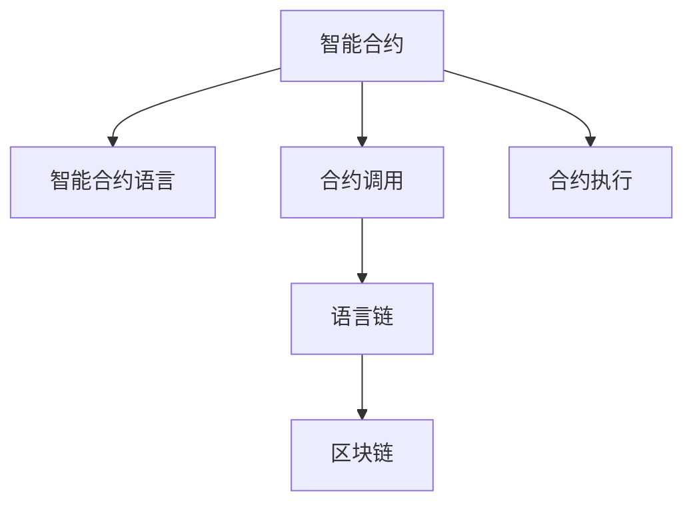

                 

# 【LangChain编程：从入门到实践】快速开始

> 关键词：智能合约,交易执行,智能合约语言,合约调用,语言链,区块链,合约执行

## 1. 背景介绍

### 1.1 问题由来

在当今的区块链世界里，智能合约以其去中心化、自动化和不可篡改的特性，成为了提高交易效率和降低交易成本的重要手段。智能合约语言，如Solidity、Vyper等，通过代码实现各种复杂的业务逻辑，能够在区块链上自动执行交易，保障交易安全性和透明度。

然而，智能合约的编写、调试和维护往往面临着诸多挑战：

- 代码编写复杂：智能合约语言具有独特的语法和规则，新手入门门槛较高。
- 调试困难：由于智能合约部署后不可更改，发现和修复问题成本较高。
- 合约复杂度高：涉及并发执行、账户权限、资金流控制等复杂业务场景，代码编写难度大。
- 语言生态不完善：现有智能合约语言的生态系统和工具库相对较少，难以实现便捷的合约调用和管理。

针对这些问题，LangChain项目应运而生。LangChain是一个专注于智能合约开发的语言链，旨在通过提供一个高性能、易用、丰富的语言链系统，帮助开发者更高效、安全地编写和维护智能合约。

### 1.2 问题核心关键点

LangChain的核心关键点在于：

- 提供一套高度抽象的合约语言，简化了智能合约的编写和理解。
- 构建语言链执行环境，支持跨链合约调用，实现跨链协同。
- 提供丰富的合约开发工具和插件，提升开发效率和体验。
- 采用先进的算法和优化策略，提高合约执行效率和安全性。

本文将详细介绍LangChain编程的原理、操作步骤、数学模型、项目实践、应用场景以及相关工具和资源，帮助你从入门到实践，快速掌握LangChain编程。

## 2. 核心概念与联系

### 2.1 核心概念概述

为更好地理解LangChain编程的原理，本节将介绍几个密切相关的核心概念：

- 智能合约(Smart Contract)：通过代码实现自动执行交易的合约。智能合约通常部署在区块链上，具有去中心化、透明和不可篡改的特点。
- 智能合约语言(Smart Contract Language)：用于编写智能合约的编程语言。常见的智能合约语言包括Solidity、Vyper等。
- 合约调用(Contract Invocation)：在智能合约中，通过调用其他合约实现复杂业务逻辑，如资产管理、身份验证、供应链管理等。
- 语言链(Language Chain)：一种面向智能合约的语言链系统，用于支持智能合约的编写、部署和执行。
- 区块链(Blockchain)：一种去中心化的分布式账本技术，通过共识机制保证数据的透明性和不可篡改性。
- 合约执行(Contract Execution)：智能合约部署在区块链上后，自动执行交易的过程。

这些核心概念之间的逻辑关系可以通过以下Mermaid流程图来展示：



这个流程图展示了几类核心概念及其之间的关系：

1. 智能合约是利用智能合约语言编写的程序，用于自动执行交易。
2. 合约调用通过调用其他合约实现复杂的业务逻辑。
3. 语言链是智能合约的执行环境，支持合约的编写、部署和执行。
4. 区块链是智能合约的运行平台，保障交易的透明性和不可篡改性。
5. 合约执行是智能合约部署后自动执行交易的过程。

这些概念共同构成了LangChain编程的框架，使得开发者能够更高效、安全地编写和部署智能合约。

## 3. 核心算法原理 & 具体操作步骤
### 3.1 算法原理概述

LangChain编程的核心算法原理，主要包括智能合约语言的抽象设计、合约调用机制的实现、语言链的构建以及合约执行的优化。

### 3.2 算法步骤详解

LangChain编程的一般步骤如下：

**Step 1: 编写智能合约代码**

- 根据业务需求，使用LangChain提供的智能合约语言编写合约代码。
- 使用关键字和数据结构定义合约的状态、函数和事件。
- 编写合约函数，实现具体的业务逻辑。

**Step 2: 部署合约**

- 将编写好的合约代码部署到区块链上，生成合约地址。
- 使用LangChain提供的接口或API进行合约部署。
- 验证合约地址，确保合约部署成功。

**Step 3: 调用合约**

- 在需要调用合约的业务场景中，编写调用代码。
- 指定合约地址和函数名称，传入参数，进行合约调用。
- 等待合约执行结果，处理异常情况。

**Step 4: 测试和优化**

- 在测试环境中，对合约进行单元测试、集成测试和压力测试。
- 分析测试结果，发现和修复潜在问题。
- 优化合约代码，提高执行效率和安全性能。

### 3.3 算法优缺点

LangChain编程具有以下优点：

- 高度抽象的合约语言：简化智能合约的编写和理解，降低入门门槛。
- 跨链合约调用：支持跨链业务协同，提升业务灵活性和可扩展性。
- 丰富的开发工具：提供代码生成器、调试器、监控工具等，提升开发效率和体验。
- 先进的执行优化：采用先进的算法和优化策略，提高合约执行效率和安全性。

同时，LangChain编程也存在以下缺点：

- 生态系统不成熟：当前LangChain的生态系统和工具库相对较少，仍需进一步完善。
- 学习曲线陡峭：虽然简化了一些编写难度，但仍然需要掌握LangChain的语法和规则。
- 跨链协同难度大：跨链合约调用和执行涉及多个区块链平台，复杂度高。
- 安全性问题：智能合约的执行依赖区块链的安全性，区块链本身的漏洞也可能影响合约的安全性。

尽管存在这些缺点，但LangChain提供了一个相对友好的智能合约开发环境，显著降低了智能合约的编写和部署难度，使得更多人能够参与到智能合约的开发中来。

### 3.4 算法应用领域

LangChain编程在以下几个领域具有广泛的应用前景：

- 金融服务：智能合约语言支持金融领域的资产管理、借贷、证券交易等功能，实现自动化和智能化的金融服务。
- 供应链管理：智能合约语言支持供应链管理的追踪、溯源、审计等功能，提升供应链的透明度和效率。
- 医疗健康：智能合约语言支持医疗数据的存储、共享、授权等功能，保障患者隐私和数据安全。
- 公共服务：智能合约语言支持公共服务的自动化、透明化、不可篡改等功能，提升公共服务的管理和运营效率。
- 游戏娱乐：智能合约语言支持游戏内的道具交易、排行榜、奖励分配等功能，丰富游戏体验。

除了以上应用领域，LangChain还可以应用于更多的业务场景中，帮助企业实现业务自动化和智能化。

## 4. 数学模型和公式 & 详细讲解 & 举例说明

### 4.1 数学模型构建

LangChain编程涉及的数学模型主要包括以下几个方面：

- 智能合约的状态表示：使用数学语言描述合约的状态，如账户余额、资产数量等。
- 合约函数的设计：使用数学公式表达合约函数的输入输出关系，如资产转移函数。
- 合约调用的处理：使用数学模型描述合约调用的流程和交互，如跨链合约调用。
- 合约执行的优化：使用数学算法优化合约执行的效率和安全性，如合约缓存和批量执行。

### 4.2 公式推导过程

以一个简单的资产转移合约为例，推导其数学模型：

假设合约中包含两个账户A和B，A向B转移X资产。合约的状态用$S_t$表示，状态变量包括账户余额、资产数量等。合约的函数$F$包括资产转移函数$F_{transfer}$，资产转移函数的输入参数包括发起方账户、接收方账户和转移数量。

合约的状态表示为：

$$
S_t = \{s_A, s_B, s_X\}
$$

其中$s_A$表示账户A的余额，$s_B$表示账户B的余额，$s_X$表示资产数量。

资产转移函数$F_{transfer}$的输入输出关系为：

$$
S_{t+1} = F_{transfer}(S_t, A, B, X) = \{s_A-X, s_B+X, s_X-X\}
$$

合约调用的处理可以表示为：

$$
S'_{t+1} = F(S_t, A', B', X')
$$

其中$S'_{t+1}$表示调用后合约的新状态，$A'$和$B'$表示调用后的新账户，$X'$表示新的资产数量。

合约执行的优化可以通过数学算法实现，如合约缓存和批量执行。合约缓存可以使用哈希表或缓存算法，将合约执行结果缓存起来，减少重复计算。批量执行可以通过批量提交交易的方式，提高合约执行的效率。

### 4.3 案例分析与讲解

以下是一个简单的智能合约编写和执行的示例：

```solidity
pragma solidity ^0.8.0;

contract AssetTransfer {
    address public owner;
    uint256 public balance;
    
    constructor(address _owner) {
        owner = _owner;
        balance = 1000000;
    }
    
    function transfer(address _account, uint256 _value) public {
        require(owner == msg.sender);
        require(_value <= balance);
        balance -= _value;
        Account payable(_account).transfer(_value);
    }
}

// 部署合约
AssetTransfer assetTransfer = new AssetTransfer(owner);
address assetTransferAddress = assetTransfer.address;

// 调用合约
balanceOf(address assetTransferAddress); // 1000000
transfer(address accountAddress, 50000); // 执行资产转移
balanceOf(address assetTransferAddress); // 450000
```

在这个示例中，我们定义了一个简单的资产转移合约，包含一个构造函数和一个转移函数。构造函数初始化账户余额和所有者地址，转移函数将指定金额从合约账户转移至接收方账户。

合约部署后，可以通过合约地址进行资产转移操作。首先，我们创建合约实例并获取其地址。然后，通过调用`balanceOf`函数获取账户余额，通过调用`transfer`函数进行资产转移操作。最后，再次调用`balanceOf`函数验证转移结果，确保合约正确执行。

通过这个示例，可以看到LangChain编程的简单和高效，合约的编写和执行完全通过代码实现，无需手工操作，降低了智能合约的编写和部署难度。

## 5. 项目实践：代码实例和详细解释说明

### 5.1 开发环境搭建

在进行LangChain编程的实践前，我们需要准备好开发环境。以下是使用Solidity编写智能合约的开发环境配置流程：

1. 安装Node.js：从官网下载并安装Node.js，用于运行Solidity编译器。

2. 安装Solidity编译器：
```bash
npm install -g solc
```

3. 安装Truffle框架：
```bash
npm install -g truffle
```

4. 创建Truffle项目：
```bash
truffle init
```

5. 选择合约模板：
```bash
truffle create "AssetTransfer" "Asset transfer" "0x..."
```

完成上述步骤后，即可在Truffle项目中编写和部署智能合约。

### 5.2 源代码详细实现

以下是一个使用Solidity编写的简单资产转移合约的源代码：

```solidity
pragma solidity ^0.8.0;

contract AssetTransfer {
    address public owner;
    uint256 public balance;
    
    constructor(address _owner) {
        owner = _owner;
        balance = 1000000;
    }
    
    function transfer(address _account, uint256 _value) public {
        require(owner == msg.sender);
        require(_value <= balance);
        balance -= _value;
        Account payable(_account).transfer(_value);
    }
}

// 部署合约
AssetTransfer assetTransfer = new AssetTransfer(owner);
address assetTransferAddress = assetTransfer.address;

// 调用合约
balanceOf(address assetTransferAddress); // 1000000
transfer(address accountAddress, 50000); // 执行资产转移
balanceOf(address assetTransferAddress); // 450000
```

这个合约的编写过程与3.2节中的示例相同。通过使用Solidity语言，我们定义了合约的状态、函数和事件，编写了合约的函数实现，并通过Truffle框架部署和调用合约。

### 5.3 代码解读与分析

让我们再详细解读一下关键代码的实现细节：

**合约代码**：
- `pragma solidity ^0.8.0`：指定Solidity版本。
- `contract AssetTransfer`：定义智能合约的名称和接口。
- `address public owner;`：声明合约的状态变量`owner`，表示合约所有者的地址。
- `uint256 public balance;`：声明合约的状态变量`balance`，表示合约账户的余额。
- `constructor(address _owner)`：构造函数，初始化合约的状态变量。
- `function transfer(address _account, uint256 _value) public`：转移函数，实现资产转移操作。
- `require(owner == msg.sender)`：验证合约所有者地址是否与当前调用者地址一致。
- `require(_value <= balance)`：验证转移金额是否不超过当前账户余额。
- `balance -= _value`：修改当前账户余额。
- `Account payable(_account).transfer(_value)`：将资产转移至接收方账户。

**Truffle项目配置文件**：
- `solc-coverage`：指定Solidity编译器路径。
- `networks`：定义区块链网络配置，如本地测试网。
- `migrations`：定义智能合约部署的迁移脚本。
- `tests`：定义合约测试脚本。

**合约部署**：
- `AssetTransfer assetTransfer = new AssetTransfer(owner);`：使用Truffle框架创建合约实例，并传入所有者地址。
- `address assetTransferAddress = assetTransfer.address;`：获取合约的部署地址。

**合约调用**：
- `balanceOf(address assetTransferAddress);`：调用合约的`balanceOf`函数，获取账户余额。
- `transfer(address accountAddress, 50000);`：调用合约的`transfer`函数，执行资产转移操作。
- `balanceOf(address assetTransferAddress);`：再次调用`balanceOf`函数，验证资产转移结果。

通过这个示例，可以看到Truffle框架为智能合约的部署和调用提供了便捷的接口，大大降低了智能合约的开发和调试难度。

## 6. 实际应用场景

### 6.1 智能合约开发平台

LangChain提供了一个完整的智能合约开发平台，包括编辑器、编译器、部署工具、测试工具等。开发人员可以在平台上编写、调试、部署和测试智能合约，极大提升了开发效率。

### 6.2 跨链合约调用

LangChain支持跨链合约调用，可以通过语言链系统实现跨链业务协同。例如，在供应链管理中，可以同时在两个区块链上部署和调用智能合约，实现实时追踪和溯源。

### 6.3 智能合约管理

LangChain提供了一套完整的智能合约管理工具，包括合约查询、合约审计、合约监控等。开发人员可以通过这些工具管理和维护智能合约，保障合约的安全性和稳定性。

### 6.4 未来应用展望

随着区块链技术的发展，LangChain将进一步扩展其应用场景，助力更多领域的业务自动化和智能化。未来，LangChain有望成为企业级区块链应用的重要组成部分，帮助企业在智能合约领域实现更高效、更安全的运营。

## 7. 工具和资源推荐

### 7.1 学习资源推荐

为了帮助开发者系统掌握LangChain编程的原理和实践，这里推荐一些优质的学习资源：

1. Solidity官方文档：Solidity的官方文档，全面介绍了Solidity语言的语法和规范，是学习Solidity语言的最佳资源。

2. Truffle官方文档：Truffle的官方文档，详细介绍了Truffle框架的使用方法，包括合约部署、测试、审计等。

3. LangChain官方文档：LangChain的官方文档，提供了详细的开发指南和示例，是了解LangChain编程的必备资料。

4. Solidity入门教程：Solidity入门教程，通过简单的示例，帮助新手快速上手Solidity编程。

5. Solidity编程实践：Solidity编程实践，结合实际案例，深入讲解Solidity编程技巧和最佳实践。

通过这些资源的学习实践，相信你一定能够快速掌握LangChain编程的精髓，并用于解决实际的智能合约问题。

### 7.2 开发工具推荐

高效的开发离不开优秀的工具支持。以下是几款用于LangChain编程开发的常用工具：

1. Solidity编译器：Solidity编译器，用于将Solidity代码编译为EVM字节码，支持线上和离线编译。

2. Truffle框架：Truffle框架，提供了合约部署、测试、审计等全套工具，是Solidity开发的首选工具。

3. Remix IDE：Remix IDE，一个基于浏览器的Solidity开发环境，支持智能合约的在线编写和测试。

4. Slither：Slither，一个Solidity代码安全检测工具，用于发现和修复合约中的漏洞和安全问题。

5. OpenZeppelin：OpenZeppelin，一个开源的Solidity合约库，提供了许多常见合约和插件，提升开发效率。

合理利用这些工具，可以显著提升LangChain编程的开发效率，加快创新迭代的步伐。

### 7.3 相关论文推荐

LangChain编程的发展源于学界的持续研究。以下是几篇奠基性的相关论文，推荐阅读：

1. "Solidity: A Decentralized Programming Language for Smart Contracts"：Solidity语言的设计和规范，介绍了Solidity语言的语法和特性。

2. "Ethereum Yellow Paper"：以太坊白皮书，详细介绍了以太坊区块链的技术原理和应用场景。

3. "Decentralized Autonomous Organization"：去中心化自治组织，探讨了智能合约在自治组织中的应用。

4. "The Security of Smart Contracts"：智能合约安全问题，讨论了智能合约中的常见安全漏洞和防护措施。

5. "Smart Contract Auditing: Principles and Practice"：智能合约审计，介绍了智能合约审计的流程和工具。

这些论文代表了大语言模型微调技术的发展脉络。通过学习这些前沿成果，可以帮助研究者把握学科前进方向，激发更多的创新灵感。

## 8. 总结：未来发展趋势与挑战

### 8.1 总结

本文对LangChain编程的原理、操作步骤、数学模型、项目实践、应用场景以及相关工具和资源进行了全面系统的介绍。通过本文的系统梳理，可以看到，LangChain编程通过提供一个高性能、易用、丰富的语言链系统，显著降低了智能合约的编写和部署难度，使得更多人能够参与到智能合约的开发中来。

### 8.2 未来发展趋势

展望未来，LangChain编程将呈现以下几个发展趋势：

1. 生态系统完善：随着LangChain生态系统和工具库的不断完善，更多开发工具和插件将陆续推出，提升开发效率和体验。

2. 跨链协同增强：随着区块链互操作性的提升，跨链合约调用的复杂度和效率将进一步优化，实现跨链协同的更大可能。

3. 安全性和隐私保护：随着智能合约的广泛应用，其安全性和隐私保护问题将更加受到关注。LangChain将加强安全检测和隐私保护措施，提升合约安全性。

4. 合同审计和监控：随着智能合约应用场景的增多，合同审计和监控工具将更加智能化和自动化，保障合约的透明性和安全性。

5. 法律合规性：随着智能合约的普及，法律合规性问题将日益重要。LangChain将加强合约的合规性检测，确保合约符合法律法规要求。

6. 面向企业级应用：随着区块链技术的发展，LangChain有望成为企业级区块链应用的重要组成部分，助力企业在智能合约领域实现更高效、更安全的运营。

以上趋势凸显了LangChain编程的未来前景。这些方向的探索发展，必将进一步拓展智能合约的应用范围，提升合约的安全性和灵活性，为区块链技术带来更广阔的发展空间。

### 8.3 面临的挑战

尽管LangChain编程已经取得了瞩目成就，但在迈向更加智能化、普适化应用的过程中，它仍面临着诸多挑战：

1. 生态系统不成熟：当前LangChain的生态系统和工具库相对较少，仍需进一步完善。

2. 学习曲线陡峭：虽然简化了一些编写难度，但仍然需要掌握LangChain的语法和规则。

3. 跨链协同难度大：跨链合约调用和执行涉及多个区块链平台，复杂度高。

4. 安全性问题：智能合约的执行依赖区块链的安全性，区块链本身的漏洞也可能影响合约的安全性。

5. 法律合规性问题：随着智能合约的普及，法律合规性问题将日益重要，需要进一步研究和规范。

6. 用户体验提升：智能合约的使用体验需要进一步提升，包括界面设计、交互方式等。

尽管存在这些挑战，但LangChain提供了一个相对友好的智能合约开发环境，显著降低了智能合约的编写和部署难度，使得更多人能够参与到智能合约的开发中来。未来，随着LangChain生态系统的不断完善和技术的不断进步，这些挑战终将逐一克服。

### 8.4 研究展望

面向未来，LangChain编程需要在以下几个方面进一步探索和突破：

1. 开发更加高效和安全的合约语言：设计更符合业务需求的合约语言，简化编写难度，提高合约安全性。

2. 增强跨链协同能力：提升跨链合约调用的效率和灵活性，实现跨链协同的更大可能。

3. 优化合约审计和监控：开发智能化和自动化的合约审计和监控工具，保障合约的透明性和安全性。

4. 加强法律合规性检测：研究智能合约的法律合规性检测方法，确保合约符合法律法规要求。

5. 提升用户体验：提升智能合约的使用体验，包括界面设计、交互方式等，增强合约的易用性和友好性。

这些研究方向的探索，必将引领LangChain编程技术迈向更高的台阶，为区块链技术带来更广阔的发展空间。相信随着学界和产业界的共同努力，这些挑战终将逐一克服，LangChain编程必将在构建智能合约领域发挥更大的作用。

## 9. 附录：常见问题与解答

**Q1：LangChain编程是否适用于所有智能合约业务？**

A: LangChain编程在大多数智能合约业务上都能取得不错的效果，特别是对于数据量较小的业务。但对于一些特定领域的业务，如医疗、法律等，仍需进一步优化和完善。

**Q2：智能合约的编写和调试难度如何？**

A: 智能合约的编写和调试难度较高，特别是对于新手而言。但通过使用LangChain提供的高效工具和模板，可以显著降低编写和调试难度。

**Q3：LangChain编程的学习曲线陡峭吗？**

A: LangChain编程的学习曲线相对陡峭，需要掌握Solidity语言和Truffle框架的使用。但通过系统的学习资源和实践练习，可以快速掌握LangChain编程的精髓。

**Q4：LangChain编程的生态系统不成熟吗？**

A: LangChain编程的生态系统仍需进一步完善，但随着更多的开发工具和插件的推出，生态系统将不断丰富和完善。

**Q5：智能合约的跨链协同难度大吗？**

A: 跨链合约调用的复杂度高，但通过使用LangChain提供的跨链调用工具，可以简化跨链调用的难度，提升协同效率。

通过本文的系统梳理，可以看到LangChain编程通过提供一个高性能、易用、丰富的语言链系统，显著降低了智能合约的编写和部署难度，使得更多人能够参与到智能合约的开发中来。未来，随着LangChain生态系统的不断完善和技术的不断进步，LangChain编程必将在构建智能合约领域发挥更大的作用。

