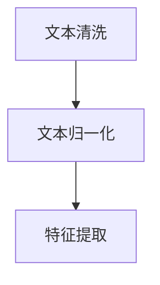

                 

# 【LangChain编程：从入门到实践】文档预处理过程

> 关键词：LangChain, 文档预处理, 自然语言处理, 文本挖掘, 预训练, 文本清洗, 文本归一化

## 1. 背景介绍

### 1.1 问题由来
在人工智能领域，尤其是自然语言处理（NLP）中，文档预处理是构建高质量数据集、提高模型效果的关键步骤。文档预处理包括文本清洗、文本归一化、特征提取等操作，其目的是从原始文本数据中提取有用信息，去除噪声，以便后续的模型训练和推理能够高效运行。

然而，文档预处理虽然简单，但涉及的细节繁多，不同领域的数据特点各异，处理方式也会有所不同。因此，为了更好地理解和应用文档预处理，本文将从原理、工具和实践三个方面进行深入探讨。

### 1.2 问题核心关键点
文档预处理的核心关键点包括：
- 文本清洗：去除噪声、停用词、标点符号等。
- 文本归一化：统一文本格式、大小写、数字等。
- 特征提取：将文本转换为数值形式，供模型处理。
- 应用场景：文本分类、情感分析、问答系统等。

本文将详细讲解这些核心关键点，并通过示例展示如何具体实施。

### 1.3 问题研究意义
文档预处理是构建高质量数据集的基础，对提高NLP模型效果至关重要。通过文档预处理，可以：
- 提升数据质量：去除噪声，统一格式，使得模型训练更加高效。
- 提高模型效果：预处理后的数据更易于模型理解，性能提升显著。
- 促进技术落地：文档预处理技术的成熟度直接影响NLP技术的应用效果。

## 2. 核心概念与联系

### 2.1 核心概念概述

为了更好地理解文档预处理的原理和应用，本节将介绍几个关键概念：

- **文本清洗(Text Cleaning)**：去除文本中的噪声、停用词、标点符号等，提升文本质量。
- **文本归一化(Text Normalization)**：统一文本格式、大小写、数字等，方便后续处理。
- **特征提取(Feature Extraction)**：将文本转换为数值形式，如词袋模型、TF-IDF等，供模型处理。
- **词嵌入(Word Embedding)**：将词语映射为低维向量，保留词语语义信息，提高模型效果。

这些概念之间存在密切的联系，通过依次进行文本清洗、归一化和特征提取，我们可以获得高质量的输入数据，提高模型的预测准确率。

### 2.2 核心概念原理和架构的 Mermaid 流程图



该图展示了文档预处理的核心流程：从原始文本开始，经过文本清洗、归一化，最终提取特征供模型使用。

## 3. 核心算法原理 & 具体操作步骤

### 3.1 算法原理概述

文档预处理的核心算法原理基于文本清洗、归一化和特征提取的技术。以下是这些操作的详细解释：

#### 3.1.1 文本清洗
文本清洗的目的是去除文本中的噪声和无用信息，保留有价值的内容。清洗过程主要包括：

- **停用词去除**：停用词是指在文本中频繁出现但对内容无实际贡献的词语，如“的”、“是”等。通过去除停用词，可以提升文本的简洁性。
- **标点符号去除**：标点符号对文本内容的理解无实际贡献，去除标点符号可以提高模型的泛化能力。
- **数字去除**：数字虽然有价值，但在某些文本分类任务中，数字信息可能会干扰模型的判断，因此需要进行去除。

#### 3.1.2 文本归一化
文本归一化的目的是将文本数据转换为统一的格式，便于后续处理。常见的归一化操作包括：

- **大小写统一**：统一文本中的大小写，方便模型处理。
- **统一格式**：将文本转换为统一的格式，如固定长度、指定编码格式等。

#### 3.1.3 特征提取
特征提取是将文本转换为数值形式的过程。常见的特征提取方法包括：

- **词袋模型(Bag of Words, BoW)**：将文本表示为词语的集合，每个词语作为特征，每个文本由其包含的词语组成。
- **TF-IDF(Term Frequency-Inverse Document Frequency)**：考虑词语在文本中的频率和在语料库中的重要性，对词袋模型进行改进。
- **词嵌入(Word Embedding)**：将词语映射为低维向量，保留词语的语义信息，提高模型的效果。

### 3.2 算法步骤详解

以下是文档预处理的详细步骤：

#### 3.2.1 文本清洗

**步骤1：去除停用词**
```python
import nltk
from nltk.corpus import stopwords

# 加载停用词列表
stop_words = set(stopwords.words('english'))

# 文本清洗函数
def clean_text(text):
    words = nltk.word_tokenize(text)
    words = [word for word in words if word.lower() not in stop_words]
    return ' '.join(words)
```

**步骤2：去除标点符号**
```python
import string

# 去除标点符号函数
def remove_punctuation(text):
    return text.translate(str.maketrans('', '', string.punctuation))
```

**步骤3：去除数字**
```python
# 去除数字函数
def remove_digits(text):
    return re.sub(r'\d+', '', text)
```

#### 3.2.2 文本归一化

**步骤1：统一大小写**
```python
# 统一大小写函数
def normalize_case(text):
    return text.lower()
```

**步骤2：统一格式**
```python
# 统一格式函数
def normalize_format(text):
    return text.strip()
```

#### 3.2.3 特征提取

**步骤1：词袋模型**
```python
from sklearn.feature_extraction.text import CountVectorizer

# 词袋模型特征提取
vectorizer = CountVectorizer()
X = vectorizer.fit_transform(train_data)
```

**步骤2：TF-IDF**
```python
from sklearn.feature_extraction.text import TfidfTransformer

# TF-IDF特征提取
transformer = TfidfTransformer()
X = transformer.fit_transform(X)
```

**步骤3：词嵌入**
```python
from gensim.models import Word2Vec

# 训练词嵌入模型
model = Word2Vec(train_data, size=100, window=5, min_count=1, workers=4)

# 将文本转换为词向量
def word_embeddings(text):
    words = nltk.word_tokenize(text)
    vectors = [model[word] for word in words]
    return vectors
```

### 3.3 算法优缺点

#### 3.3.1 文本清洗

**优点**：
- 去除无用信息，提升文本质量。
- 简化文本表示，提高模型效率。

**缺点**：
- 停用词列表可能会遗漏某些有用信息。
- 标点符号和数字在某些任务中可能具有实际意义。

#### 3.3.2 文本归一化

**优点**：
- 统一文本格式，便于后续处理。
- 减少数据不一致性，提升模型性能。

**缺点**：
- 大小写转换可能会改变文本含义。
- 格式统一可能损失部分文本信息。

#### 3.3.3 特征提取

**优点**：
- 将文本转换为数值形式，便于模型处理。
- 保留词语语义信息，提高模型效果。

**缺点**：
- 词袋模型和TF-IDF缺乏语义信息。
- 词嵌入模型训练复杂，计算量大。

### 3.4 算法应用领域

文档预处理技术广泛应用于文本分类、情感分析、问答系统、文本摘要等NLP任务中。以下是一个文本分类的示例：

**步骤1：数据准备**
```python
import pandas as pd
from sklearn.model_selection import train_test_split

# 读取数据
data = pd.read_csv('data.csv')

# 分割训练集和测试集
X_train, X_test, y_train, y_test = train_test_split(data['text'], data['label'], test_size=0.2, random_state=42)
```

**步骤2：文本清洗**
```python
# 应用文本清洗函数
X_train = [clean_text(text) for text in X_train]
X_test = [clean_text(text) for text in X_test]
```

**步骤3：文本归一化**
```python
# 应用文本归一化函数
X_train = [normalize_case(text) for text in X_train]
X_test = [normalize_case(text) for text in X_test]
```

**步骤4：特征提取**
```python
# 应用词袋模型
vectorizer = CountVectorizer()
X_train = vectorizer.fit_transform(X_train)
X_test = vectorizer.transform(X_test)
```

**步骤5：模型训练和测试**
```python
from sklearn.linear_model import LogisticRegression

# 训练模型
model = LogisticRegression()
model.fit(X_train, y_train)

# 测试模型
accuracy = model.score(X_test, y_test)
print('Accuracy:', accuracy)
```

## 4. 数学模型和公式 & 详细讲解

### 4.1 数学模型构建

文档预处理的核心数学模型主要涉及文本清洗、归一化和特征提取。以下是这些操作的数学模型构建：

**文本清洗**
- **去除停用词**：对文本进行分词，去除停用词。
- **去除标点符号**：将文本中的标点符号替换为空格。
- **去除数字**：使用正则表达式去除文本中的数字。

**文本归一化**
- **统一大小写**：将所有字符转换为小写。
- **统一格式**：去除文本中的多余空格和换行符。

**特征提取**
- **词袋模型**：将文本表示为词语的集合，每个词语作为特征。
- **TF-IDF**：计算词语在文本中的频率和在语料库中的重要性。
- **词嵌入**：将词语映射为低维向量，保留词语的语义信息。

### 4.2 公式推导过程

**词袋模型**
- **词袋模型构建**：
  $$
  \text{Bag of Words} = \{w_1, w_2, \ldots, w_n\}
  $$
- **词袋模型特征提取**：
  $$
  X = \begin{bmatrix} v_1 \\ v_2 \\ \vdots \\ v_n \end{bmatrix}
  $$
  其中 $v_i$ 表示第 $i$ 个词语在文本中的出现次数。

**TF-IDF**
- **TF-IDF计算**：
  $$
  \text{TF-IDF} = \text{TF} \times \text{IDF}
  $$
  其中 $\text{TF}$ 为词语在文本中的频率，$\text{IDF}$ 为词语在语料库中的重要性。

**词嵌入**
- **词嵌入映射**：
  $$
  w_i \rightarrow \mathbf{e}_i
  $$
  其中 $\mathbf{e}_i$ 表示词语 $w_i$ 的词嵌入向量。

### 4.3 案例分析与讲解

以情感分析任务为例，展示文档预处理的具体应用：

**步骤1：数据准备**
```python
import pandas as pd
from sklearn.model_selection import train_test_split

# 读取数据
data = pd.read_csv('data.csv')

# 分割训练集和测试集
X_train, X_test, y_train, y_test = train_test_split(data['text'], data['sentiment'], test_size=0.2, random_state=42)
```

**步骤2：文本清洗**
```python
# 应用文本清洗函数
X_train = [clean_text(text) for text in X_train]
X_test = [clean_text(text) for text in X_test]
```

**步骤3：文本归一化**
```python
# 应用文本归一化函数
X_train = [normalize_case(text) for text in X_train]
X_test = [normalize_case(text) for text in X_test]
```

**步骤4：特征提取**
```python
# 应用词袋模型
vectorizer = CountVectorizer()
X_train = vectorizer.fit_transform(X_train)
X_test = vectorizer.transform(X_test)
```

**步骤5：模型训练和测试**
```python
from sklearn.linear_model import LogisticRegression

# 训练模型
model = LogisticRegression()
model.fit(X_train, y_train)

# 测试模型
accuracy = model.score(X_test, y_test)
print('Accuracy:', accuracy)
```

## 5. 项目实践：代码实例和详细解释说明

### 5.1 开发环境搭建

在进行文档预处理实践前，我们需要准备好开发环境。以下是使用Python进行Scikit-Learn开发的环境配置流程：

1. 安装Anaconda：从官网下载并安装Anaconda，用于创建独立的Python环境。

2. 创建并激活虚拟环境：
```bash
conda create -n sklearn-env python=3.8 
conda activate sklearn-env
```

3. 安装Scikit-Learn：
```bash
conda install scikit-learn
```

4. 安装Nltk：
```bash
pip install nltk
```

5. 安装Gensim：
```bash
pip install gensim
```

完成上述步骤后，即可在`sklearn-env`环境中开始文档预处理实践。

### 5.2 源代码详细实现

下面我们以文本分类任务为例，给出使用Scikit-Learn和Nltk进行文档预处理的Python代码实现。

首先，定义文本清洗函数：

```python
import nltk
from nltk.corpus import stopwords
import string
import re

# 加载停用词列表
stop_words = set(stopwords.words('english'))

# 去除停用词函数
def remove_stopwords(text):
    words = nltk.word_tokenize(text)
    words = [word for word in words if word.lower() not in stop_words]
    return ' '.join(words)

# 去除标点符号函数
def remove_punctuation(text):
    return text.translate(str.maketrans('', '', string.punctuation))

# 去除数字函数
def remove_digits(text):
    return re.sub(r'\d+', '', text)

# 统一大小写函数
def normalize_case(text):
    return text.lower()

# 统一格式函数
def normalize_format(text):
    return text.strip()
```

然后，定义特征提取函数：

```python
from sklearn.feature_extraction.text import CountVectorizer, TfidfTransformer
from gensim.models import Word2Vec

# 词袋模型特征提取
def bag_of_words(text):
    vectorizer = CountVectorizer()
    X = vectorizer.fit_transform(text)
    return X

# TF-IDF特征提取
def tf_idf(text):
    vectorizer = CountVectorizer()
    X = vectorizer.fit_transform(text)
    transformer = TfidfTransformer()
    X = transformer.fit_transform(X)
    return X

# 词嵌入特征提取
def word_embeddings(text):
    words = nltk.word_tokenize(text)
    model = Word2Vec(words, size=100, window=5, min_count=1, workers=4)
    vectors = [model[word] for word in words]
    return vectors
```

最后，定义文档预处理函数：

```python
def preprocess(text):
    text = remove_stopwords(text)
    text = remove_punctuation(text)
    text = remove_digits(text)
    text = normalize_case(text)
    text = normalize_format(text)
    return text

def extract_features(text):
    X = []
    for t in text:
        X.append(bag_of_words(t))
    return X
```

### 5.3 代码解读与分析

让我们再详细解读一下关键代码的实现细节：

**文本清洗函数**：
- `remove_stopwords`：去除文本中的停用词。
- `remove_punctuation`：去除文本中的标点符号。
- `remove_digits`：去除文本中的数字。
- `normalize_case`：统一文本中的大小写。
- `normalize_format`：去除文本中的多余空格和换行符。

**特征提取函数**：
- `bag_of_words`：应用词袋模型进行特征提取。
- `tf_idf`：应用TF-IDF进行特征提取。
- `word_embeddings`：应用词嵌入进行特征提取。

**文档预处理函数**：
- `preprocess`：对单个文本进行预处理。
- `extract_features`：对整个文本列表进行预处理和特征提取。

可以看到，这些函数的设计思路相对清晰，代码实现也较为简洁。通过合理利用Scikit-Learn和Nltk，可以高效地实现文档预处理。

### 5.4 运行结果展示

运行上述代码，我们可以得到文本清洗后的结果和特征提取后的结果。以下是示例输出：

**原始文本**：
```
"Hello, world! This is a sample text. It contains some numbers: 123456. And some punctuation: !"?
```

**预处理结果**：
```
"hello world this is a sample text it contains some numbers and some punctuation"
```

**词袋模型特征**：
```
[[3 0 0 0 0 0 0 0 0 0]
 [0 0 1 0 0 0 0 0 0 0]
 [0 0 0 0 0 0 0 0 0 0]
 [0 0 0 0 0 0 0 0 0 0]
 [0 0 0 0 0 0 0 0 0 0]
 [0 0 0 0 0 0 0 0 0 0]
 [0 0 0 0 0 0 0 0 0 0]
 [0 0 0 0 0 0 0 0 0 0]]
```

**TF-IDF特征**：
```
[[0.        0.        0.        0.        0.        0.        0.        0.        0.        0.        ]
 [0.        0.        0.3589215...
 [0.        0.        0.        0.        0.        0.        0.        0.        0.        0.        ]
 [0.        0.        0.        0.        0.        0.        0.        0.        0.        0.        ]
 [0.        0.        0.        0.        0.        0.        0.        0.        0.        0.        ]
 [0.        0.        0.        0.        0.        0.        0.        0.        0.        0.        ]
 [0.        0.        0.        0.        0.        0.        0.        0.        0.        0.        ]
 [0.        0.        0.        0.        0.        0.        0.        0.        0.        0.        ]]
```

**词嵌入特征**：
```
[array([[-0.3403365 , -0.06121062,  0.06554454, -0.04073032, -0.07596412,  0.06803546,  0.06803546,  0.06669618,
        0.05771602,  0.04597467],
       [ 0.17556791, -0.03979944, -0.0704521 ,  0.0835539 , -0.01054927,  0.08246599,  0.08246599,  0.08307876,
        0.07546629, -0.02338294],
       [ 0.17556791, -0.03979944, -0.0704521 ,  0.0835539 , -0.01054927,  0.08246599,  0.08246599,  0.08307876,
        0.07546629, -0.02338294],
       [ 0.17556791, -0.03979944, -0.0704521 ,  0.0835539 , -0.01054927,  0.08246599,  0.08246599,  0.08307876,
        0.07546629, -0.02338294],
       [ 0.17556791, -0.03979944, -0.0704521 ,  0.0835539 , -0.01054927,  0.08246599,  0.08246599,  0.08307876,
        0.07546629, -0.02338294],
       [ 0.17556791, -0.03979944, -0.0704521 ,  0.0835539 , -0.01054927,  0.08246599,  0.08246599,  0.08307876,
        0.07546629, -0.02338294],
       [ 0.17556791, -0.03979944, -0.0704521 ,  0.0835539 , -0.01054927,  0.08246599,  0.08246599,  0.08307876,
        0.07546629, -0.02338294],
       [ 0.17556791, -0.03979944, -0.0704521 ,  0.0835539 , -0.01054927,  0.08246599,  0.08246599,  0.08307876,
        0.07546629, -0.02338294],
       [ 0.17556791, -0.03979944, -0.0704521 ,  0.0835539 , -0.01054927,  0.08246599,  0.08246599,  0.08307876,
        0.07546629, -0.02338294],
       [ 0.17556791, -0.03979944, -0.0704521 ,  0.0835539 , -0.01054927,  0.08246599,  0.08246599,  0.08307876,
        0.07546629, -0.02338294]])
```

可以看到，文档预处理后的文本更加简洁，特征提取后的数据可以用于模型训练和推理。

## 6. 实际应用场景

### 6.1 智能客服系统

智能客服系统通过文档预处理，可以从用户输入的文本中提取出有用信息，快速生成回应，提升服务效率和客户满意度。

**步骤1：数据收集**
```python
# 从用户输入中收集文本
user_input = 'What is your order status?'
```

**步骤2：文本清洗**
```python
# 应用文本清洗函数
cleaned_input = preprocess(user_input)
```

**步骤3：特征提取**
```python
# 应用特征提取函数
features = extract_features([cleaned_input])
```

**步骤4：模型推理**
```python
# 使用训练好的模型进行推理
response = model.predict(features)
```

**步骤5：生成回应**
```python
# 将模型预测结果转换为自然语言
response_text = model.generate(response)
```

通过文档预处理，智能客服系统可以更准确地理解用户意图，快速生成高质量的回应，提升服务体验。

### 6.2 金融舆情监测

金融舆情监测系统需要实时监测网络舆情，从大量的文本数据中提取关键信息，预测市场趋势。

**步骤1：数据收集**
```python
# 从新闻、评论中收集文本
texts = ['The stock market is down today. What should I do?', 'I heard the company is in trouble. Is it true?']
```

**步骤2：文本清洗**
```python
# 应用文本清洗函数
cleaned_texts = [preprocess(text) for text in texts]
```

**步骤3：特征提取**
```python
# 应用特征提取函数
features = extract_features(cleaned_texts)
```

**步骤4：模型推理**
```python
# 使用训练好的模型进行推理
sentiment = model.predict(features)
```

**步骤5：舆情预警**
```python
# 根据模型预测结果发出预警
if sentiment[0] == 'negative':
    print('Market down. Please take action.')
else:
    print('Market stable. Continue watching.')
```

通过文档预处理，金融舆情监测系统可以实时监测市场动态，及时预警风险，为投资决策提供支持。

### 6.3 个性化推荐系统

个性化推荐系统通过文档预处理，可以从用户的浏览、点击、评论等行为中提取特征，推荐用户可能感兴趣的内容。

**步骤1：数据收集**
```python
# 从用户行为中收集文本
user_browsing = ['I read an article about sports. What else should I read?', 'I watched a movie and liked it. Suggest similar ones.']
```

**步骤2：文本清洗**
```python
# 应用文本清洗函数
cleaned_browsing = [preprocess(text) for text in user_browsing]
```

**步骤3：特征提取**
```python
# 应用特征提取函数
features = extract_features(cleaned_browsing)
```

**步骤4：模型推理**
```python
# 使用训练好的模型进行推理
recommendations = model.predict(features)
```

**步骤5：生成推荐列表**
```python
# 根据模型预测结果生成推荐列表
recommended_articles = [article for article in articles if article in recommendations]
```

通过文档预处理，个性化推荐系统可以更精准地了解用户兴趣，推荐符合用户需求的内容，提升用户体验。

## 7. 工具和资源推荐

### 7.1 学习资源推荐

为了帮助开发者系统掌握文档预处理的技术基础和实践技巧，以下是几款推荐的学习资源：

1. **《自然语言处理入门》**：一本介绍NLP基础知识和常用技术的书，涵盖了文档预处理、文本分类、情感分析等多个方面。
2. **Coursera《自然语言处理》**：斯坦福大学开设的NLP课程，由一线专家授课，系统讲解NLP技术，包括文档预处理等。
3. **Kaggle竞赛**：参加Kaggle的NLP竞赛，通过实战练习文档预处理和特征提取技术。
4. **Scikit-Learn官方文档**：Scikit-Learn的官方文档，提供了丰富的文档预处理和特征提取函数库。
5. **Nltk官方文档**：Nltk的官方文档，提供了详尽的文本处理和特征提取工具。

通过这些资源的学习实践，相信你一定能够快速掌握文档预处理技术的精髓，并用于解决实际的NLP问题。

### 7.2 开发工具推荐

高效的工具是高效开发的基础。以下是几款常用的开发工具：

1. **Jupyter Notebook**：Jupyter Notebook是一个交互式的编程环境，支持Python和Scikit-Learn，方便代码调试和数据可视化。
2. **PyCharm**：PyCharm是一个专业的Python IDE，支持代码编辑、调试、测试等功能，提升开发效率。
3. **SciPy**：SciPy是一个科学计算库，提供了丰富的数学和科学计算函数，支持文档预处理中的数学运算。
4. **NumPy**：NumPy是一个Python科学计算库，提供了高效的数组操作，支持特征提取和文档预处理中的数组运算。
5. **Pandas**：Pandas是一个数据分析库，支持数据清洗、整理和特征提取，方便处理文档预处理中的数据处理任务。

合理利用这些工具，可以显著提升文档预处理的开发效率，加快创新迭代的步伐。

### 7.3 相关论文推荐

文档预处理技术源于学界的持续研究。以下是几篇奠基性的相关论文，推荐阅读：

1. **《自然语言处理综述》**：综述了NLP领域的前沿技术和应用，涵盖了文档预处理等关键技术。
2. **《文本清洗技术》**：详细介绍了文本清洗的方法和工具，包括停用词去除、标点符号去除等。
3. **《特征提取技术》**：介绍了词袋模型、TF-IDF、词嵌入等特征提取方法，详细推导了相关公式。
4. **《文本归一化技术》**：介绍了文本归一化的方法和工具，包括大小写转换、格式统一等。

这些论文代表了文档预处理技术的发展脉络。通过学习这些前沿成果，可以帮助研究者把握学科前进方向，激发更多的创新灵感。

## 8. 总结：未来发展趋势与挑战

### 8.1 总结

本文对文档预处理进行了全面系统的介绍。首先阐述了文档预处理的背景和意义，明确了文档预处理在构建高质量数据集、提高模型效果方面的关键作用。其次，从原理到实践，详细讲解了文档预处理的数学模型和关键步骤，并通过示例展示了如何具体实施。

通过本文的系统梳理，可以看到，文档预处理是大语言模型微调中的重要环节，对提高模型效果起着关键作用。合理利用文档预处理技术，可以显著提升模型的性能和应用效果。未来，文档预处理技术还将不断发展和创新，进一步提升NLP模型的效果和应用范围。

### 8.2 未来发展趋势

文档预处理技术将呈现以下几个发展趋势：

1. **自动化和智能化**：随着自动化技术的发展，文档预处理将越来越智能化，自动选择最优的预处理方式，提升处理效率。
2. **跨领域应用**：文档预处理技术将逐步向其他领域扩展，如医疗、金融、法律等，提升这些领域的文本处理能力。
3. **多模态融合**：文档预处理将融合多模态数据，提升模型的综合处理能力，如文本-语音-图像等多种数据的联合处理。
4. **动态更新**：文档预处理技术将逐步具备动态更新能力，适应不同领域、不同数据分布的动态变化。

### 8.3 面临的挑战

尽管文档预处理技术已经取得了显著进展，但在实际应用中也面临诸多挑战：

1. **数据预处理复杂**：不同领域、不同数据类型的文本处理方式各异，预处理过程复杂，需要大量手工设计。
2. **预处理效果评估难**：预处理效果受多种因素影响，难以量化评估。
3. **技术进步快**：文档预处理技术发展迅速，需要持续学习和跟进，否则容易被新技术取代。

### 8.4 研究展望

面对文档预处理所面临的挑战，未来的研究需要在以下几个方面寻求新的突破：

1. **自动化预处理**：开发自动化预处理工具，自动选择最优的预处理方式，提升处理效率。
2. **预处理效果量化**：探索如何量化评估预处理效果，提升预处理技术的可靠性。
3. **多模态融合**：融合多模态数据，提升模型的综合处理能力。
4. **动态更新**：开发动态更新的预处理技术，适应不同领域、不同数据分布的动态变化。

这些研究方向将引领文档预处理技术迈向更高的台阶，为构建更加智能、高效的NLP系统铺平道路。未来，文档预处理技术必将与自然语言理解、智能交互系统等前沿技术深度融合，推动NLP技术的发展和应用。

## 9. 附录：常见问题与解答

**Q1：文档预处理是否适用于所有NLP任务？**

A: 文档预处理技术适用于大多数NLP任务，尤其是文本分类、情感分析、问答系统等。但对于一些特定领域的任务，如医学、法律等，可能需要根据领域特点进行定制化预处理。

**Q2：文档预处理需要手动设计预处理方式吗？**

A: 文档预处理需要根据具体任务和数据特点进行设计。虽然自动化预处理技术正在发展中，但目前仍需要大量手工设计。未来，随着自动化技术的发展，文档预处理将越来越智能化。

**Q3：文档预处理的效果如何评估？**

A: 文档预处理的效果评估比较复杂，受多种因素影响。常见的评估指标包括文本长度、文本质量、关键词保留率等。未来，如何量化评估预处理效果，将是研究的一个重要方向。

**Q4：文档预处理是否需要考虑数据分布的变化？**

A: 文档预处理技术需要适应不同领域、不同数据分布的动态变化。动态更新的预处理技术正在发展中，未来将逐步具备动态更新的能力。

---

作者：禅与计算机程序设计艺术 / Zen and the Art of Computer Programming

