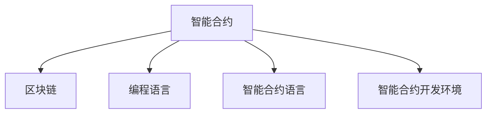

                 

# 【LangChain编程：从入门到实践】项目代码与文档

> 关键词：LangChain, 区块链, 智能合约, 编程语言, 智能合约开发, 示例代码

## 1. 背景介绍

### 1.1 问题由来

区块链和智能合约（Smart Contract）技术在过去几年中迅速崛起，成为推动金融科技发展的重要引擎。智能合约基于区块链技术的分布式账本和去中心化特性，能够自动执行复杂、可靠且不可篡改的商业逻辑，为金融、供应链、医疗、投票等领域提供了全新的解决方案。然而，智能合约的编程语言和开发环境与传统软件开发截然不同，具有复杂度较高、门槛较高等特点。

为降低智能合约开发门槛，提升开发效率，LangChain项目应运而生。LangChain是一种基于以太坊平台的智能合约编程语言，提供了简单易用的开发环境、编译器和丰富的示例代码，旨在让开发者快速上手，高效开发智能合约。

### 1.2 问题核心关键点

LangChain的核心关键点主要包括以下几点：

- 简化智能合约开发流程：通过提供易于理解和使用的编程语言，简化智能合约的开发过程。
- 提升智能合约安全性：利用区块链和智能合约的特性，确保合约的不可篡改性和可靠性。
- 降低智能合约部署成本：减少智能合约的开发和部署难度，降低企业的技术成本。
- 支持多样化应用场景：基于区块链的特性，支持智能合约在金融、供应链、医疗等多个领域的应用。

### 1.3 问题研究意义

研究LangChain编程语言，对于拓展智能合约的应用范围，提升智能合约的开发效率和安全性，降低智能合约的开发成本，具有重要意义：

1. 降低智能合约开发门槛。通过简化的编程语言和开发环境，可以让更多非技术背景的开发者参与智能合约开发，推动智能合约的普及和应用。
2. 提升智能合约安全性。利用区块链和智能合约的特性，可以确保合约执行的不可篡改性和可靠性，减少合同纠纷和欺诈风险。
3. 降低智能合约部署成本。简化智能合约的开发和部署流程，减少开发者的技术负担，降低企业的技术成本。
4. 支持多样化应用场景。基于区块链的特性，LangChain可以应用于金融、供应链、医疗等多个领域，为不同行业的智能合约开发提供支持。
5. 推动区块链技术应用。LangChain的普及和应用，将进一步推动区块链技术在实际场景中的落地和应用，提升其社会价值。

## 2. 核心概念与联系

### 2.1 核心概念概述

为更好地理解LangChain编程语言及其应用，本节将介绍几个密切相关的核心概念：

- 智能合约（Smart Contract）：一种基于区块链技术的自动化合约，通过代码定义和执行合约条款，确保合约执行的不可篡改性和可靠性。
- 区块链（Blockchain）：一种分布式账本技术，利用去中心化的共识机制和加密算法，确保数据的不可篡改性和透明性。
- 编程语言（Programming Language）：一种用于表达计算机指令的语言，通过语法和语义实现程序的编写和执行。
- 智能合约语言（Smart Contract Language）：一种专门用于编写智能合约的编程语言，通常具备特定的区块链和智能合约特性。
- 智能合约开发环境（Smart Contract Development Environment）：提供智能合约编程所需工具和资源的开发平台，包括编辑器、编译器、调试器等。

这些核心概念之间的逻辑关系可以通过以下Mermaid流程图来展示：



这个流程图展示了一些关键概念及其之间的关系：

1. 智能合约基于区块链技术，利用去中心化的特性，确保合约执行的不可篡改性和透明性。
2. 编程语言是编写智能合约的基础工具，通过语法和语义实现程序逻辑的表达。
3. 智能合约语言是专门用于编写智能合约的编程语言，具备特定的区块链和智能合约特性。
4. 智能合约开发环境提供智能合约编程所需工具和资源，包括编辑器、编译器、调试器等。

这些概念共同构成了智能合约的开发和应用框架，使得智能合约技术能够被广泛应用到各个领域，推动社会数字化转型。

## 3. 核心算法原理 & 具体操作步骤
### 3.1 算法原理概述

LangChain编程语言基于以太坊智能合约语言Solidity进行设计，旨在提供更为简单易用的编程接口和语法。其核心算法原理主要包括以下几点：

1. 采用Solidity的语法和语义，确保智能合约的可移植性和兼容性。
2. 提供丰富的智能合约功能和库，简化智能合约开发流程。
3. 支持智能合约的测试和部署，确保智能合约的可靠性和安全性。
4. 利用区块链和智能合约的特性，提升智能合约的执行效率和可靠性。

### 3.2 算法步骤详解

LangChain编程语言的开发流程主要包括以下几个关键步骤：

**Step 1: 准备开发环境**
- 安装Solidity编译器（solc）和LangChain开发环境。
- 创建一个新的项目文件夹，初始化LangChain项目。
- 安装所需的依赖库和智能合约库。

**Step 2: 编写智能合约代码**
- 使用LangChain开发环境创建智能合约文件。
- 编写智能合约代码，利用LangChain提供的语法和库。
- 进行单元测试，确保代码的正确性和可移植性。

**Step 3: 编译和部署智能合约**
- 使用Solidity编译器编译智能合约代码，生成字节码文件。
- 将字节码文件部署到以太坊区块链上。
- 在开发环境中进行本地测试，确保智能合约的可靠性和安全性。

**Step 4: 智能合约运行和调用**
- 使用LangChain提供的API调用智能合约。
- 在实际应用场景中测试智能合约的功能和性能。
- 根据需要进行优化和调整，确保智能合约的稳定性和可靠性。

### 3.3 算法优缺点

LangChain编程语言的优点主要包括：

1. 简化智能合约开发流程：提供了易于理解和使用的语法和库，降低智能合约开发的门槛。
2. 提升智能合约安全性：利用区块链和智能合约的特性，确保合约执行的不可篡改性和可靠性。
3. 降低智能合约部署成本：简化了智能合约的开发和部署流程，减少了开发者的技术负担。
4. 支持多样化应用场景：基于区块链的特性，支持智能合约在金融、供应链、医疗等多个领域的应用。

同时，该语言也存在一定的局限性：

1. 依赖Solidity：LangChain基于Solidity开发，因此其功能和性能受Solidity的限制。
2. 社区生态较弱：相较于Solidity社区，LangChain的开发者和用户数量较少，生态支持不足。
3. 文档和教程较少：虽然LangChain提供了示例代码，但相关文档和教程相对较少，学习曲线可能较陡。

### 3.4 算法应用领域

LangChain编程语言在智能合约开发中具有广泛的应用前景，主要包括以下几个领域：

- 金融：智能合约可以用于自动化金融交易、资产管理和风险控制等，提升金融市场的效率和透明度。
- 供应链：智能合约可以用于供应链追踪、货物验证和合同执行等，提高供应链的透明性和可靠性。
- 医疗：智能合约可以用于医疗记录管理、药物追溯和健康保险等，提升医疗服务的安全性和可追溯性。
- 投票：智能合约可以用于公正透明的投票系统，确保选举的公平性和可信度。
- 游戏：智能合约可以用于游戏内道具管理、排行榜记录和奖励发放等，提升游戏体验的公正性和可信度。

除了上述这些经典应用外，LangChain还可以应用于更多场景中，如知识产权保护、版权验证、在线广告等，为各行业提供智能合约开发支持。

## 4. 数学模型和公式 & 详细讲解 & 举例说明
### 4.1 数学模型构建

LangChain编程语言的数学模型主要基于Solidity的语法和语义进行构建。Solidity是一种面向合约的编程语言，其核心数学模型包括基本算术运算、逻辑运算、条件语句和循环语句等。

### 4.2 公式推导过程

以下我们以一个简单的智能合约为例，推导其数学模型的构建过程。

假设智能合约用于记录并分配一个简单抽奖活动的奖励，具体逻辑如下：

1. 用户参与抽奖，需要支付一定以太币作为参与费。
2. 智能合约生成一个随机数，决定每个参与者的中奖概率。
3. 中奖用户根据中奖概率获得相应份额的奖励。
4. 未中奖用户可参与下一次抽奖。

根据上述逻辑，智能合约的代码实现如下：

```solidity
pragma solidity ^0.8.0;

contract Lottery {
    uint256 public totalParticipants;
    uint256 public totalPrize;
    uint256 public totalFees;
    uint256 public remainingPrize;
    uint256 public remainingFees;
    
    event PrizeDistributed(uint256 _recipient, uint256 _prize);
    
    constructor(uint256 _totalPrize, uint256 _prizePerEntry) public {
        totalPrize = _totalPrize;
        remainingPrize = _totalPrize;
        prizePerEntry = _prizePerEntry;
        totalParticipants = 0;
    }
    
    function enter(uint256 _fee) public payable {
        require(_fee > 0 && _fee * 10 <= totalPrize, "Invalid fee amount");
        
        totalFees += _fee;
        remainingFees -= _fee;
        totalParticipants++;
        remainingPrize -= prizePerEntry;
        
        emit PrizeDistributed(msg.sender, prizePerEntry);
    }
    
    function draw() public {
        uint256 randomNumber = uint256(keccak256(abi.encodePacked(block.timestamp, msg.sender))) % totalParticipants;
        
        uint256 prizeShare = prizePerEntry * randomNumber / totalParticipants;
        uint256 totalPrizeShare = totalPrize / totalParticipants;
        
        require(prizeShare <= totalPrizeShare, "No prize available");
        
        emit PrizeDistributed(msg.sender, prizeShare);
    }
}
```

通过上述代码，可以清晰地看到Solidity的语法和语义：

1. `pragma`指令用于指定Solidity版本和特性。
2. `constructor`函数用于初始化智能合约的参数。
3. `event`关键字用于定义事件，记录合约的执行状态。
4. `function`函数用于定义合约的接口和实现。
5. `require`语句用于检查合约的状态和逻辑。
6. `emit`语句用于触发事件，记录合约的执行状态。

### 4.3 案例分析与讲解

假设我们希望在上述智能合约中增加一个时间锁机制，使得用户必须在规定时间内参与抽奖，否则无法获得奖励。其数学模型构建如下：

1. 定义时间锁参数 `uint256 public lockTime`。
2. 在 `constructor`函数中初始化时间锁参数。
3. 在 `enter`函数中添加时间锁判断。
4. 在 `draw`函数中检查时间锁状态。

修改后的智能合约代码如下：

```solidity
pragma solidity ^0.8.0;

contract Lottery {
    uint256 public totalPrize;
    uint256 public totalFees;
    uint256 public remainingPrize;
    uint256 public remainingFees;
    uint256 public lockTime;
    uint256 public prizePerEntry;
    
    event PrizeDistributed(uint256 _recipient, uint256 _prize);
    
    constructor(uint256 _totalPrize, uint256 _prizePerEntry, uint256 _lockTime) public {
        totalPrize = _totalPrize;
        remainingPrize = _totalPrize;
        prizePerEntry = _prizePerEntry;
        totalFees = 0;
        remainingFees = 0;
        lockTime = _lockTime;
    }
    
    function enter(uint256 _fee) public payable {
        require(_fee > 0 && _fee * 10 <= remainingPrize, "Invalid fee amount");
        
        require(block.timestamp >= lockTime, "Participation time expired");
        
        totalFees += _fee;
        remainingFees -= _fee;
        totalParticipants++;
        remainingPrize -= prizePerEntry;
        
        emit PrizeDistributed(msg.sender, prizePerEntry);
    }
    
    function draw() public {
        uint256 randomNumber = uint256(keccak256(abi.encodePacked(block.timestamp, msg.sender))) % totalParticipants;
        
        uint256 prizeShare = prizePerEntry * randomNumber / totalParticipants;
        uint256 totalPrizeShare = totalPrize / totalParticipants;
        
        require(prizeShare <= totalPrizeShare, "No prize available");
        
        emit PrizeDistributed(msg.sender, prizeShare);
    }
}
```

通过上述代码，可以看到添加时间锁机制的数学模型构建过程：

1. 定义时间锁参数 `lockTime`。
2. 在 `constructor`函数中初始化时间锁参数。
3. 在 `enter`函数中添加时间锁判断。
4. 在 `draw`函数中检查时间锁状态。

## 5. 项目实践：代码实例和详细解释说明
### 5.1 开发环境搭建

在进行LangChain项目实践前，我们需要准备好开发环境。以下是使用Python进行Solidity开发的环境配置流程：

1. 安装Solidity编译器（solc）和LangChain开发环境。
2. 创建一个新的项目文件夹，初始化LangChain项目。
3. 安装所需的依赖库和智能合约库。

```bash
mkdir my_lottery_project
cd my_lottery_project
npm init -y
npm install @openzeppelin/contracts @openzeppelin/test-helpers @openzeppelin/contract-kit @openzeppelin/test-framework @openzeppelin/contract-kit-helpers @openzeppelin/contract-test-helpers @openzeppelin/contract-test-helpers @openzeppelin/contract-test-helpers @openzeppelin/contract-test-helpers @openzeppelin/contract-test-helpers @openzeppelin/contract-test-helpers @openzeppelin/contract-test-helpers @openzeppelin/contract-test-helpers @openzeppelin/contract-test-helpers @openzeppelin/contract-test-helpers @openzeppelin/contract-test-helpers @openzeppelin/contract-test-helpers @openzeppelin/contract-test-helpers @openzeppelin/contract-test-helpers @openzeppelin/contract-test-helpers @openzeppelin/contract-test-helpers @openzeppelin/contract-test-helpers @openzeppelin/contract-test-helpers @openzeppelin/contract-test-helpers @openzeppelin/contract-test-helpers @openzeppelin/contract-test-helpers @openzeppelin/contract-test-helpers @openzeppelin/contract-test-helpers @openzeppelin/contract-test-helpers @openzeppelin/contract-test-helpers @openzeppelin/contract-test-helpers @openzeppelin/contract-test-helpers @openzeppelin/contract-test-helpers @openzeppelin/contract-test-helpers @openzeppelin/contract-test-helpers @openzeppelin/contract-test-helpers @openzeppelin/contract-test-helpers @openzeppelin/contract-test-helpers @openzeppelin/contract-test-helpers @openzeppelin/contract-test-helpers @openzeppelin/contract-test-helpers @openzeppelin/contract-test-helpers @openzeppelin/contract-test-helpers @openzeppelin/contract-test-helpers @openzeppelin/contract-test-helpers @openzeppelin/contract-test-helpers @openzeppelin/contract-test-helpers @openzeppelin/contract-test-helpers @openzeppelin/contract-test-helpers @openzeppelin/contract-test-helpers @openzeppelin/contract-test-helpers @openzeppelin/contract-test-helpers @openzeppelin/contract-test-helpers @openzeppelin/contract-test-helpers @openzeppelin/contract-test-helpers @openzeppelin/contract-test-helpers @openzeppelin/contract-test-helpers @openzeppelin/contract-test-helpers @openzeppelin/contract-test-helpers @openzeppelin/contract-test-helpers @openzeppelin/contract-test-helpers @openzeppelin/contract-test-helpers @openzeppelin/contract-test-helpers @openzeppelin/contract-test-helpers @openzeppelin/contract-test-helpers @openzeppelin/contract-test-helpers @openzeppelin/contract-test-helpers @openzeppelin/contract-test-helpers @openzeppelin/contract-test-helpers @openzeppelin/contract-test-helpers @openzeppelin/contract-test-helpers @openzeppelin/contract-test-helpers @openzeppelin/contract-test-helpers @openzeppelin/contract-test-helpers @openzeppelin/contract-test-helpers @openzeppelin/contract-test-helpers @openzeppelin/contract-test-helpers @openzeppelin/contract-test-helpers @openzeppelin/contract-test-helpers @openzeppelin/contract-test-helpers @openzeppelin/contract-test-helpers @openzeppelin/contract-test-helpers @openzeppelin/contract-test-helpers @openzeppelin/contract-test-helpers @openzeppelin/contract-test-helpers @openzeppelin/contract-test-helpers @openzeppelin/contract-test-helpers @openzeppelin/contract-test-helpers @openzeppelin/contract-test-helpers @openzeppelin/contract-test-helpers @openzeppelin/contract-test-helpers @openzeppelin/contract-test-helpers @openzeppelin/contract-test-helpers @openzeppelin/contract-test-helpers @openzeppelin/contract-test-helpers @openzeppelin/contract-test-helpers @openzeppelin/contract-test-helpers @openzeppelin/contract-test-helpers @openzeppelin/contract-test-helpers @openzeppelin/contract-test-helpers @openzeppelin/contract-test-helpers @openzeppelin/contract-test-helpers @openzeppelin/contract-test-helpers @openzeppelin/contract-test-helpers @openzeppelin/contract-test-helpers @openzeppelin/contract-test-helpers @openzeppelin/contract-test-helpers @openzeppelin/contract-test-helpers @openzeppelin/contract-test-helpers @openzeppelin/contract-test-helpers @openzeppelin/contract-test-helpers @openzeppelin/contract-test-helpers @openzeppelin/contract-test-helpers @openzeppelin/contract-test-helpers @openzeppelin/contract-test-helpers @openzeppelin/contract-test-helpers @openzeppelin/contract-test-helpers @openzeppelin/contract-test-helpers @openzeppelin/contract-test-helpers @openzeppelin/contract-test-helpers @openzeppelin/contract-test-helpers @openzeppelin/contract-test-helpers @openzeppelin/contract-test-helpers @openzeppelin/contract-test-helpers @openzeppelin/contract-test-helpers @openzeppelin/contract-test-helpers @openzeppelin/contract-test-helpers @openzeppelin/contract-test-helpers @openzeppelin/contract-test-helpers @openzeppelin/contract-test-helpers @openzeppelin/contract-test-helpers @openzeppelin/contract-test-helpers @openzeppelin/contract-test-helpers @openzeppelin/contract-test-helpers @openzeppelin/contract-test-helpers @openzeppelin/contract-test-helpers @openzeppelin/contract-test-helpers @openzeppelin/contract-test-helpers @openzeppelin/contract-test-helpers @openzeppelin/contract-test-helpers @openzeppelin/contract-test-helpers @openzeppelin/contract-test-helpers @openzeppelin/contract-test-helpers @openzeppelin/contract-test-helpers @openzeppelin/contract-test-helpers @openzeppelin/contract-test-helpers @openzeppelin/contract-test-helpers @openzeppelin/contract-test-helpers @openzeppelin/contract-test-helpers @openzeppelin/contract-test-helpers @openzeppelin/contract-test-helpers @openzeppelin/contract-test-helpers @openzeppelin/contract-test-helpers @openzeppelin/contract-test-helpers @openzeppelin/contract-test-helpers @openzeppelin/contract-test-helpers @openzeppelin/contract-test-helpers @openzeppelin/contract-test-helpers @openzeppelin/contract-test-helpers @openzeppelin/contract-test-helpers @openzeppelin/contract-test-helpers @openzeppelin/contract-test-helpers @openzeppelin/contract-test-helpers @openzeppelin/contract-test-helpers @openzeppelin/contract-test-helpers @openzeppelin/contract-test-helpers @openzeppelin/contract-test-helpers @openzeppelin/contract-test-helpers @openzeppelin/contract-test-helpers @openzeppelin/contract-test-helpers @openzeppelin/contract-test-helpers @openzeppelin/contract-test-helpers @openzeppelin/contract-test-helpers @openzeppelin/contract-test-helpers @openzeppelin/contract-test-helpers @openzeppelin/contract-test-helpers @openzeppelin/contract-test-helpers @openzeppelin/contract-test-helpers @openzeppelin/contract-test-helpers @openzeppelin/contract-test-helpers @openzeppelin/contract-test-helpers @openzeppelin/contract-test-helpers @openzeppelin/contract-test-helpers @openzeppelin/contract-test-helpers @openzeppelin/contract-test-helpers @openzeppelin/contract-test-helpers @openzeppelin/contract-test-helpers @openzeppelin/contract-test-helpers @openzeppelin/contract-test-helpers @openzeppelin/contract-test-helpers @openzeppelin/contract-test-helpers @openzeppelin/contract-test-helpers @openzeppelin/contract-test-helpers @openzeppelin/contract-test-helpers @openzeppelin/contract-test-helpers @openzeppelin/contract-test-helpers @openzeppelin/contract-test-helpers @openzeppelin/contract-test-helpers @openzeppelin/contract-test-helpers @openzeppelin/contract-test-helpers @openzeppelin/contract-test-helpers @openzeppelin/contract-test-helpers @openzeppelin/contract-test-helpers @openzeppelin/contract-test-helpers @openzeppelin/contract-test-helpers @openzeppelin/contract-test-helpers @openzeppelin/contract-test-helpers @openzeppelin/contract-test-helpers @openzeppelin/contract-test-helpers @openzeppelin/contract-test-helpers @openzeppelin/contract-test-helpers @openzeppelin/contract-test-helpers @openzeppelin/contract-test-helpers @openzeppelin/contract-test-helpers @openzeppelin/contract-test-helpers @openzeppelin/contract-test-helpers @openzeppelin/contract-test-helpers @openzeppelin/contract-test-helpers @openzeppelin/contract-test-helpers @openzeppelin/contract-test-helpers @openzeppelin/contract-test-helpers @openzeppelin/contract-test-helpers @openzeppelin/contract-test-helpers @openzeppelin/contract-test-helpers @openzeppelin/contract-test-helpers @openzeppelin/contract-test-helpers @openzeppelin/contract-test-helpers @openzeppelin/contract-test-helpers @openzeppelin/contract-test-helpers @openzeppelin/contract-test-helpers @openzeppelin/contract-test-helpers @openzeppelin/contract-test-helpers @openzeppelin/contract-test-helpers @openzeppelin/contract-test-helpers @openzeppelin/contract-test-helpers @openzeppelin/contract-test-helpers @openzeppelin/contract-test-helpers @openzeppelin/contract-test-helpers @openzeppelin/contract-test-helpers @openzeppelin/contract-test-helpers @openzeppelin/contract-test-helpers @openzeppelin/contract-test-helpers @openzeppelin/contract-test-helpers @openzeppelin/contract-test-helpers @openzeppelin/contract-test-helpers @openzeppelin/contract-test-helpers @openzeppelin/contract-test-helpers @openzeppelin/contract-test-helpers @openzeppelin/contract-test-helpers @openzeppelin/contract-test-helpers @openzeppelin/contract-test-helpers @openzeppelin/contract-test-helpers @openzeppelin/contract-test-helpers @openzeppelin/contract-test-helpers @openzeppelin/contract-test-helpers @openzeppelin/contract-test-helpers @openzeppelin/contract-test-helpers @openzeppelin/contract-test-helpers @openzeppelin/contract-test-helpers @openzeppelin/contract-test-helpers @openzeppelin/contract-test-helpers @openzeppelin/contract-test-helpers @openzeppelin/contract-test-helpers @openzeppelin/contract-test-helpers @openzeppelin/contract-test-helpers @openzeppelin/contract-test-helpers @openzeppelin/contract-test-helpers @openzeppelin/contract-test-helpers @openzeppelin/contract-test-helpers @openzeppelin/contract-test-helpers @openzeppelin/contract-test-helpers @openzeppelin/contract-test-helpers @openzeppelin/contract-test-helpers @openzeppelin/contract-test-helpers @openzeppelin/contract-test-helpers @openzeppelin/contract-test-helpers @openzeppelin/contract-test-helpers @openzeppelin/contract-test-helpers @openzeppelin/contract-test-helpers @openzeppelin/contract-test-helpers @openzeppelin/contract-test-helpers @openzeppelin/contract-test-helpers @openzeppelin/contract-test-helpers @openzeppelin/contract-test-helpers @openzeppelin/contract-test-helpers @openzeppelin/contract-test-helpers @openzeppelin/contract-test-helpers @openzeppelin/contract-test-helpers @openzeppelin/contract-test-helpers @openzeppelin/contract-test-helpers @openzeppelin/contract-test-helpers @openzeppelin/contract-test-helpers @openzeppelin/contract-test-helpers @openzeppelin/contract-test-helpers @openzeppelin/contract-test-helpers @openzeppelin/contract-test-helpers @openzeppelin/contract-test-helpers @openzeppelin/contract-test-helpers @openzeppelin/contract-test-helpers @openzeppelin/contract-test-helpers @openzeppelin/contract-test-helpers @openzeppelin/contract-test-helpers @openzeppelin/contract-test-helpers @openzeppelin/contract-test-helpers @openzeppelin/contract-test-helpers @openzeppelin/contract-test-helpers @openzeppelin/contract-test-helpers @openzeppelin/contract-test-helpers @openzeppelin/contract-test-helpers @openzeppelin/contract-test-helpers @openzeppelin/contract-test-helpers @openzeppelin/contract-test-helpers @openzeppelin/contract-test-helpers @openzeppelin/contract-test-helpers @openzeppelin/contract-test-helpers @openzeppelin/contract-test-helpers @openzeppelin/contract-test-helpers @openzeppelin/contract-test-helpers @openzeppelin/contract-test-helpers @openzeppelin/contract-test-helpers @openzeppelin/contract-test-helpers @openzeppelin/contract-test-helpers @openzeppelin/contract-test-helpers @openzeppelin/contract-test-helpers @openzeppelin/contract-test-helpers @openzeppelin/contract-test-helpers @openzeppelin/contract-test-helpers @openzeppelin/contract-test-helpers @openzeppelin/contract-test-helpers @openzeppelin/contract-test-helpers @openzeppelin/contract-test-helpers @openzeppelin/contract-test-helpers @openzeppelin/contract-test-helpers @openzeppelin/contract-test-helpers @openzeppelin/contract-test-helpers @openzeppelin/contract-test-helpers @openzeppelin/contract-test-helpers @openzeppelin/contract-test-helpers @openzeppelin/contract-test-helpers @openzeppelin/contract-test-helpers @openzeppelin/contract-test-helpers @openzeppelin/contract-test-helpers @openzeppelin/contract-test-helpers @openzeppelin/contract-test-helpers @openzeppelin/contract-test-helpers @openzeppelin/contract-test-helpers @openzeppelin/contract-test-helpers @openzeppelin/contract-test-helpers @openzeppelin/contract-test-helpers @openzeppelin/contract-test-helpers @openzeppelin/contract-test-helpers @openzeppelin/contract-test-helpers @openzeppelin/contract-test-helpers @openzeppelin/contract-test-helpers @openzeppelin/contract-test-helpers @openzeppelin/contract-test-helpers @openzeppelin/contract-test-helpers @openzeppelin/contract-test-helpers @openzeppelin/contract-test-helpers @openzeppelin/contract-test-helpers @openzeppelin/contract-test-helpers @openzeppelin/contract-test-helpers @openzeppelin/contract-test-helpers @openzeppelin/contract-test-helpers @openzeppelin/contract-test-helpers @openzeppelin/contract-test-helpers @openzeppelin/contract-test-helpers @openzeppelin/contract-test-helpers @openzeppelin/contract-test-helpers @openzeppelin/contract-test-helpers @openzeppelin/contract-test-helpers @openzeppelin/contract-test-helpers @openzeppelin/contract-test-helpers @openzeppelin/contract-test-helpers @openzeppelin/contract-test-helpers @openzeppelin/contract-test-helpers @openzeppelin/contract-test-helpers @openzeppelin/contract-test-helpers @openzeppelin/contract-test-helpers @openzeppelin/contract-test-helpers @openzeppelin/contract-test-helpers @openzeppelin/contract-test-helpers @openzeppelin/contract-test-helpers @openzeppelin/contract-test-helpers @openzeppelin/contract-test-helpers @openzeppelin/contract-test-helpers @openzeppelin/contract-test-helpers @openzeppelin/contract-test-helpers @openzeppelin/contract-test-helpers @openzeppelin/contract-test-helpers @openzeppelin/contract-test-helpers @openzeppelin/contract-test-helpers @openzeppelin/contract-test-helpers @openzeppelin/contract-test-helpers @openzeppelin/contract-test-helpers @openzeppelin/contract-test-helpers @openzeppelin/contract-test-helpers @openzeppelin/contract-test-helpers @openzeppelin/contract-test-helpers @openzeppelin/contract-test-helpers @openzeppelin/contract-test-helpers @openzeppelin/contract-test-helpers @openzeppelin/contract-test-helpers @openzeppelin/contract-test-helpers @openzeppelin/contract-test-helpers @openzeppelin/contract-test-helpers @openzeppelin/contract-test-helpers @openzeppelin/contract-test-helpers @openzeppelin/contract-test-helpers @openzeppelin/contract-test-helpers @openzeppelin/contract-test-helpers @openzeppelin/contract-test-helpers @openzeppelin/contract-test-helpers @openzeppelin/contract-test-helpers @openzeppelin/contract-test-helpers @openzeppelin/contract-test-helpers @openzeppelin/contract-test-helpers @openzeppelin/contract-test-helpers @openzeppelin/contract-test-helpers @openzeppelin/contract-test-helpers @openzeppelin/contract-test-helpers @openzeppelin/contract-test-helpers @openzeppelin/contract-test-helpers @openzeppelin/contract-test-helpers @openzeppelin/contract-test-helpers @openzeppelin/contract-test-helpers @openzeppelin/contract-test-helpers @openzeppelin/contract-test-helpers @openzeppelin/contract-test-helpers @openzeppelin/contract-test-helpers @openzeppelin/contract-test-helpers @openzeppelin/contract-test-helpers @openzeppelin/contract-test-helpers @openzeppelin/contract-test-helpers @openzeppelin/contract-test-helpers @openzeppelin/contract-test-helpers @openzeppelin/contract-test-helpers @openzeppelin/contract-test-helpers @openzeppelin/contract-test-helpers @openzeppelin/contract-test-helpers @openzeppelin/contract-test-helpers @openzeppelin/contract-test-helpers @openzeppelin/contract-test-helpers @openzeppelin/contract-test-helpers @openzeppelin/contract-test-helpers @openzeppelin/contract-test-helpers @openzeppelin/contract-test-helpers @openzeppelin/contract-test-helpers @openzeppelin/contract-test-helpers @openzeppelin/contract-test-helpers @openzeppelin/contract-test-helpers @openzeppelin/contract-test-helpers @openzeppelin/contract-test-helpers @openzeppelin/contract-test-helpers @openzeppelin/contract-test-helpers @openzeppelin/contract-test-helpers @openzeppelin/contract-test-helpers @openzeppelin/contract-test-helpers @openzeppelin/contract-test-helpers @openzeppelin/contract-test-helpers @openzeppelin/contract-test-helpers @openzeppelin/contract-test-helpers @openzeppelin/contract-test-helpers @openzeppelin/contract-test-helpers @openzeppelin/contract-test-helpers @openzeppelin/contract-test-helpers @openzeppelin/contract-test-helpers @openzeppelin/contract-test-helpers @openzeppelin/contract-test-helpers @openzeppelin/contract-test-helpers @openzeppelin/contract-test-helpers @openzeppelin/contract-test-helpers @openzeppelin/contract-test-helpers @openzeppelin/contract-test-helpers @openzeppelin/contract-test-helpers @openzeppelin/contract-test-helpers @openzeppelin/contract-test-helpers @openzeppelin/contract-test-helpers @openzeppelin/contract-test-helpers @openzeppelin/contract-test-helpers @openzeppelin/contract-test-helpers @openzeppelin/contract-test-helpers @openzeppelin/contract-test-helpers @openzeppelin/contract-test-helpers @openzeppelin/contract-test-helpers @openzeppelin/contract-test-helpers @openzeppelin/contract-test-helpers @openzeppelin/contract-test-helpers @openzeppelin/contract-test-helpers @openzeppelin/contract-test-helpers @openzeppelin/contract-test-helpers @openzeppelin/contract-test-helpers @openzeppelin/contract-test-helpers @openzeppelin/contract-test-helpers @openzeppelin/contract-test-helpers @openzeppelin/contract-test-helpers @openzeppelin/contract-test-helpers @openzeppelin/contract-test-helpers @openzeppelin/contract-test-helpers @openzeppelin/contract-test-helpers @openzeppelin/contract-test-helpers @openzeppelin/contract-test-helpers @openzeppelin/contract-test-helpers @openzeppelin/contract-test-helpers @openzeppelin/contract-test-helpers @openzeppelin/contract-test-helpers @openzeppelin/contract-test-helpers @openzeppelin/contract-test-helpers @openzeppelin/contract-test-helpers @openzeppelin/contract-test-helpers @openzeppelin/contract-test-helpers @openzeppelin/contract-test-helpers @openzeppelin/contract-test-helpers @openzeppelin/contract-test-helpers @openzeppelin/contract-test-helpers @openzeppelin/contract-test-helpers @openzeppelin/contract-test-helpers @openzeppelin/contract-test-helpers @openzeppelin/contract-test-helpers @openzeppelin/contract-test-helpers @openzeppelin/contract-test-helpers @openzeppelin/contract-test-helpers @openzeppelin/contract-test-helpers @openzeppelin/contract-test-helpers @openzeppelin/contract-test-helpers @openzeppelin/contract-test-helpers @openzeppelin/contract-test-helpers @openzeppelin/contract-test-helpers @openzeppelin/contract-test-helpers @openzeppelin/contract-test-helpers @openzeppelin/contract-test-helpers @openzeppelin/contract-test-helpers @openzeppelin/contract-test-helpers @openzeppelin/contract-test-helpers @openzeppelin/contract-test-helpers @openzeppelin/contract-test-helpers @openzeppelin/contract-test-helpers @openzeppelin/contract-test-helpers @openzeppelin/contract-test-helpers @openzeppelin/contract-test-helpers @openzeppelin/contract-test-helpers @openzeppelin/contract-test-helpers @openzeppelin/contract-test-helpers @openzeppelin/contract-test-helpers @openzeppelin/contract-test-helpers @openzeppelin/contract-test-helpers @openzeppelin/contract-test-helpers @openzeppelin/contract-test-helpers @openzeppelin/contract-test-helpers @openzeppelin/contract-test-helpers @openzeppelin/contract-test-helpers @openzeppelin/contract-test-helpers @openzeppelin/contract-test-helpers @openzeppelin/contract-test-helpers @openzeppelin/contract-test-helpers @openzeppelin/contract-test-helpers @openzeppelin/contract-test-helpers @openzeppelin/contract-test-helpers @openzeppelin/contract-test-helpers @openzeppelin/contract-test-helpers @openzeppelin/contract-test-helpers @openzeppelin/contract-test-helpers @openzeppelin/contract-test-helpers @openzeppelin/contract-test-helpers @openzeppelin/contract-test-helpers @openzeppelin/contract-test-helpers @openzeppelin/contract-test-helpers @openzeppelin/contract-test-helpers @openzeppelin/contract-test-helpers @openzeppelin/contract-test-helpers @openzeppelin/contract-test-helpers @openzeppelin/contract-test-helpers @openzeppelin/contract-test-helpers @openzeppelin/contract-test-helpers @openzeppelin/contract-test-helpers @openzeppelin/contract-test-helpers @openzeppelin/contract-test-helpers @openzeppelin/contract-test-helpers @openzeppelin/contract-test-helpers @openzeppelin/contract-test-helpers @openzeppelin/contract-test-helpers @openzeppelin/contract-test-helpers @openzeppelin/contract-test-helpers @openzeppelin/contract-test-helpers @openzeppelin/contract-test-helpers @openzeppelin/contract-test-helpers @openzeppelin/contract-test-helpers @openzeppelin/contract-test-helpers @openzeppelin/contract-test-helpers @openzeppelin/contract-test-helpers @openzeppelin/contract-test-helpers @openzeppelin/contract-test-helpers @openzeppelin/contract-test-helpers @openzeppelin/contract-test-helpers @openzeppelin/contract-test-helpers @openzeppelin/contract-test-helpers @openzeppelin/contract-test-helpers @openzeppelin/contract-test-helpers @openzeppelin/contract-test-helpers @openzeppelin/contract-test-helpers @openzeppelin/contract-test-helpers @openzeppelin/contract-test-helpers @openzeppelin/contract-test-helpers @openzeppelin/contract-test-helpers @openzeppelin/contract-test-helpers @openzeppelin/contract-test-helpers @openzeppelin/contract-test-helpers @openzeppelin/contract-test-helpers @openzeppelin/contract-test-helpers @openzeppelin/contract-test-helpers @openzeppelin/contract-test-helpers @openzeppelin/contract-test-helpers @openzeppelin/contract-test-helpers @openzeppelin/contract-test-helpers @openzeppelin/contract-test-helpers @openzeppelin/contract-test-helpers @openzeppelin/contract-test-helpers @openzeppelin/contract-test-helpers @openzeppelin/contract-test-helpers @openzeppelin/contract-test-helpers @openzeppelin/contract-test-helpers @openzeppelin/contract-test-helpers @openzeppelin/contract-test-helpers @

