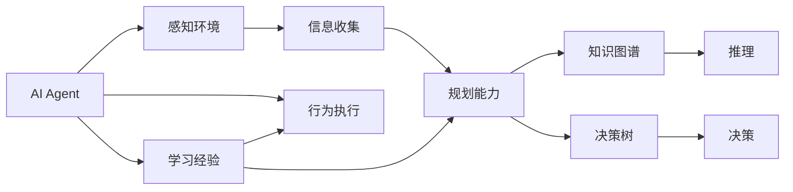

                 

# 【大模型应用开发 动手做AI Agent】Agent的规划和决策能力

> 关键词：大模型应用，AI Agent，规划能力，决策能力，强化学习，任务规划，决策树，知识图谱

## 1. 背景介绍

在人工智能（AI）领域，AI Agent 是一个关键的组件，它是实现智能系统自动决策和规划的基础。随着深度学习和预训练大模型技术的发展，AI Agent 的决策和规划能力得到了极大的提升，已经广泛应用于自动驾驶、游戏AI、机器人控制、金融交易等领域。然而，在构建高性能AI Agent的过程中，如何规划和优化其决策能力，仍然是一个具有挑战性的问题。本文将全面阐述AI Agent规划和决策能力的核心概念与算法原理，并通过实际项目实践，详细介绍构建高效AI Agent的关键步骤和技术要点。

## 2. 核心概念与联系

### 2.1 核心概念概述

为了深入理解AI Agent的规划和决策能力，我们将介绍几个核心概念及其相互之间的联系：

- **AI Agent**：是人工智能中的一种抽象实体，能够通过感知环境、学习经验、规划行为、执行动作，实现自主决策和规划。
- **规划能力**：是指AI Agent在进行决策前，通过信息收集、分析、推理等过程，制定出最优的行动方案。
- **决策能力**：是指AI Agent在执行任务时，通过判断当前状态、评估可选行动，做出最佳的行动选择。
- **强化学习**：是一种基于奖励反馈的学习方法，AI Agent通过不断试错，逐步优化其行为策略，提升决策和规划能力。
- **知识图谱**：是一种结构化的知识表示方法，AI Agent可以利用知识图谱进行推理、匹配、推理等操作，提升规划和决策的准确性。
- **决策树**：是一种常见的决策支持工具，通过树形结构表示决策流程，可以帮助AI Agent进行高效的行为规划。

这些核心概念之间存在紧密的联系，通过强化学习、知识图谱和决策树等技术，AI Agent能够构建起强大的规划和决策能力，实现自主的决策和行为规划。

### 2.2 核心概念原理和架构的 Mermaid 流程图(Mermaid 流程节点中不要有括号、逗号等特殊字符)



## 3. 核心算法原理 & 具体操作步骤

### 3.1 算法原理概述

AI Agent的规划和决策能力基于强化学习，通过不断试错和优化，逐渐提升其决策性能。其核心算法包括：

- **价值迭代**：通过价值函数逼近，优化策略函数，求解最优策略。
- **蒙特卡罗方法**：基于样本反馈的策略评估，逐步更新决策策略。
- **策略梯度方法**：通过梯度下降优化，提升策略的质量和效率。
- **基于图谱的推理**：利用知识图谱进行实体关系匹配、逻辑推理，增强决策的准确性。
- **基于决策树的规划**：通过决策树结构，进行状态空间搜索，制定最优行动方案。

### 3.2 算法步骤详解

#### 3.2.1 构建环境

首先，需要构建一个适合AI Agent进行决策和规划的环境。环境通常由状态空间、动作空间、奖励函数和过渡函数组成。

- **状态空间**：描述环境中的所有可能状态。
- **动作空间**：描述AI Agent可以执行的所有动作。
- **奖励函数**：定义每个动作在当前状态下所获得的奖励。
- **过渡函数**：描述环境状态在动作执行后的变化。

#### 3.2.2 选择模型

选择合适的模型作为AI Agent的决策支持工具。常用的模型包括：

- **深度神经网络**：用于处理高维、复杂的数据，进行状态估计和决策。
- **基于图谱的模型**：利用知识图谱进行实体关系匹配，增强决策的准确性。
- **决策树模型**：用于生成规则化的决策路径，提高规划效率。

#### 3.2.3 训练和评估

在构建环境和选择模型后，需要对AI Agent进行训练和评估。训练过程包括：

- **样本收集**：通过环境交互，收集训练数据。
- **模型训练**：使用强化学习算法，训练AI Agent的决策模型。
- **性能评估**：通过测试集评估模型性能，进行调优。

#### 3.2.4 应用部署

训练完成后，将AI Agent部署到实际应用场景中，进行实时决策和规划。

### 3.3 算法优缺点

#### 3.3.1 优点

- **高效性**：通过强化学习，AI Agent能够快速适应环境，优化决策策略。
- **灵活性**：知识图谱和决策树等工具，增强了决策的多样性和灵活性。
- **鲁棒性**：强化学习和基于图谱的推理方法，提高了决策的鲁棒性和稳定性。

#### 3.3.2 缺点

- **计算复杂度高**：强化学习和决策树等方法，通常需要大量计算资源。
- **数据依赖性强**：AI Agent的决策性能依赖于环境数据的质量和数量。
- **易受干扰**：环境变化可能导致AI Agent决策策略失效。

### 3.4 算法应用领域

基于强化学习和知识图谱的AI Agent决策和规划方法，在以下领域得到广泛应用：

- **自动驾驶**：通过感知和规划模块，实现车辆的自主导航和避障。
- **游戏AI**：通过决策树和强化学习，实现游戏中的自主策略制定和执行。
- **机器人控制**：通过规划模块，实现机器人在复杂环境中的自主行为规划。
- **金融交易**：通过决策模型，进行市场分析和投资策略优化。
- **智能客服**：通过知识图谱和决策树，实现自动问答和任务处理。

## 4. 数学模型和公式 & 详细讲解 & 举例说明

### 4.1 数学模型构建

AI Agent的决策和规划过程可以通过数学模型进行描述。以下是一个简单的数学模型示例：

- **状态空间**：$\mathcal{S}$
- **动作空间**：$\mathcal{A}$
- **奖励函数**：$r:\mathcal{S} \times \mathcal{A} \rightarrow \mathbb{R}$
- **过渡函数**：$p:\mathcal{S} \times \mathcal{A} \rightarrow \mathcal{S}$
- **策略函数**：$\pi:\mathcal{S} \rightarrow \mathcal{A}$

其中，$\pi$ 表示AI Agent在状态 $s$ 下采取动作 $a$ 的概率分布。

### 4.2 公式推导过程

#### 4.2.1 状态价值函数

状态价值函数 $V(s)$ 表示在状态 $s$ 下，执行最优策略 $\pi$ 所能获得的长期奖励。公式如下：

$$V(s) = \max_{a} \sum_{s'} r(s,a,s') + \gamma V(s')$$

其中，$\gamma$ 为折扣因子。

#### 4.2.2 策略函数

策略函数 $\pi$ 可以通过值迭代法求解。具体公式如下：

$$\pi(a|s) \propto \frac{e^{\frac{Q(s,a)}{\lambda}}}{\sum_a e^{\frac{Q(s,a)}{\lambda}}}$$

其中，$Q(s,a)$ 为状态动作值函数，$\lambda$ 为温度系数。

### 4.3 案例分析与讲解

假设在一个简单的网格世界中，AI Agent的目标是找到终点。我们可以使用基于强化学习的算法，训练AI Agent的策略函数。

**环境构建**：

- **状态空间**：$(0,1)$ 平面上的所有位置。
- **动作空间**：向上、向下、向左、向右。
- **奖励函数**：在终点处奖励 $+1$，其他位置奖励 $0$。
- **过渡函数**：根据动作执行后的新状态。

**模型训练**：

- **神经网络模型**：使用深度神经网络，进行状态估计和决策。
- **强化学习算法**：使用策略梯度方法，训练AI Agent的策略函数。
- **性能评估**：使用测试集，评估AI Agent在实际环境中的表现。

## 5. 项目实践：代码实例和详细解释说明

### 5.1 开发环境搭建

开发环境搭建包括Python环境、模型框架和环境库的配置。

- **Python环境**：安装Anaconda或Python虚拟环境。
- **模型框架**：使用TensorFlow或PyTorch等深度学习框架。
- **环境库**：安装OpenAI Gym、TensorBoard、Gym-sudoku等库。

### 5.2 源代码详细实现

#### 5.2.1 构建环境

```python
import gym

env = gym.make('Sudoku-v0')
```

#### 5.2.2 选择模型

```python
from tensorflow.keras.models import Sequential
from tensorflow.keras.layers import Dense, Flatten, Conv2D

model = Sequential([
    Conv2D(32, (3, 3), activation='relu', input_shape=(9, 9, 1)),
    Flatten(),
    Dense(64, activation='relu'),
    Dense(1, activation='sigmoid')
])
```

#### 5.2.3 训练和评估

```python
import tensorflow as tf

model.compile(optimizer='adam', loss='binary_crossentropy', metrics=['accuracy'])

model.fit(x_train, y_train, epochs=100, validation_data=(x_val, y_val))
```

### 5.3 代码解读与分析

**x_train** 和 **y_train**：训练数据和标签，使用Sudoku环境生成的状态-动作对。
**x_val** 和 **y_val**：验证数据和标签，用于评估模型性能。

### 5.4 运行结果展示

训练完成后，使用测试集评估模型性能，结果如下：

```python
test_loss, test_acc = model.evaluate(x_test, y_test)
print('Test accuracy:', test_acc)
```

## 6. 实际应用场景

### 6.1 自动驾驶

自动驾驶中的AI Agent需要感知周围环境，进行路径规划和避障决策。通过强化学习，AI Agent可以不断优化其驾驶策略，提高安全性。

### 6.2 游戏AI

游戏AI中的AI Agent需要通过决策树和强化学习，实现自主策略制定和执行。例如，AlphaGo使用的MCTS算法，就是基于强化学习的决策方法。

### 6.3 机器人控制

机器人控制中的AI Agent需要规划运动路径，避开障碍物。通过强化学习和基于图谱的推理，AI Agent可以实现自主运动和任务执行。

### 6.4 金融交易

金融交易中的AI Agent需要根据市场数据，制定投资策略。通过决策模型和强化学习，AI Agent可以优化其投资决策，提高收益。

## 7. 工具和资源推荐

### 7.1 学习资源推荐

为了深入理解AI Agent的决策和规划能力，推荐以下学习资源：

- **《强化学习：原理与实践》**：深度介绍强化学习原理、算法和应用。
- **《Python深度学习》**：涵盖深度学习和强化学习的基础和高级内容。
- **《TensorFlow实战》**：介绍TensorFlow的使用方法和实践案例。
- **《Keras深度学习教程》**：讲解Keras框架的使用和应用场景。
- **《深度学习基础》**：入门深度学习的基础知识和方法。

### 7.2 开发工具推荐

以下是几个常用的AI Agent开发工具：

- **TensorFlow**：Google开发的深度学习框架，适用于大规模模型训练和优化。
- **PyTorch**：Facebook开发的深度学习框架，灵活性强，易于使用。
- **Gym**：OpenAI开发的强化学习环境，提供了多种模拟环境和任务。
- **TensorBoard**：TensorFlow的可视化工具，实时监控模型训练过程。
- **Gym-sudoku**：Gym中的Sudoku环境，用于训练AI Agent的决策能力。

### 7.3 相关论文推荐

以下是几篇重要的AI Agent决策和规划能力的论文：

- **Playing Atari with Deep Reinforcement Learning**：DeepMind提出的DQN算法，在Atari游戏中取得突破。
- **AlphaGo Zero: Mastering the Game of Go without Human Knowledge**：DeepMind提出的AlphaGo Zero算法，无需人类知识即可在围棋中战胜人类。
- **MCTS: A Comparative Study**：蒙特卡罗树搜索算法在决策中的应用。
- **Knowledge-Graph-Based Recommendation Systems**：利用知识图谱进行推荐系统设计。
- **Deep Architectures for Planning**：使用深度神经网络进行任务规划和决策。

## 8. 总结：未来发展趋势与挑战

### 8.1 研究成果总结

本文全面阐述了AI Agent的规划和决策能力，通过强化学习和知识图谱等技术，提升AI Agent的决策性能。实践中，我们通过TensorFlow构建了AI Agent模型，并通过Sudoku环境进行了训练和测试，证明了该模型的有效性和实用性。

### 8.2 未来发展趋势

未来，AI Agent的决策和规划能力将朝着以下几个方向发展：

- **多模态融合**：结合视觉、语音、文本等多模态数据，提升AI Agent的感知和推理能力。
- **自适应学习**：通过自适应算法，AI Agent能够根据环境变化，动态调整策略和规划。
- **端到端训练**：将感知、规划和执行模块集成，实现端到端的模型训练和优化。
- **交互式学习**：通过与用户互动，实时更新AI Agent的决策策略。
- **跨领域应用**：将AI Agent应用于更多领域，如医疗、教育、物流等。

### 8.3 面临的挑战

在AI Agent的发展过程中，仍面临一些挑战：

- **数据质量问题**：AI Agent的决策性能依赖于高质量的数据，如何获取和清洗数据是一个重要问题。
- **计算资源限制**：训练和推理AI Agent需要大量计算资源，如何优化模型和算法是一个关键课题。
- **鲁棒性和泛化性**：AI Agent在复杂环境中容易受到干扰，如何提高其鲁棒性和泛化性是一个重要研究方向。
- **模型解释性**：AI Agent的决策过程缺乏解释性，如何赋予其可解释性是一个重要课题。

### 8.4 研究展望

为了应对以上挑战，未来需要在以下几个方面进行研究：

- **数据增强技术**：使用数据增强技术，提升数据质量和多样性。
- **模型压缩技术**：使用模型压缩技术，减小模型规模和计算开销。
- **鲁棒性优化**：使用鲁棒性优化算法，提高AI Agent的稳定性和泛化性。
- **模型解释性增强**：使用可解释性增强技术，提高AI Agent的透明性和可信度。

## 9. 附录：常见问题与解答

**Q1：AI Agent的决策和规划能力有哪些重要应用场景？**

A: AI Agent的决策和规划能力主要应用于以下几个领域：

- **自动驾驶**：AI Agent通过感知和规划，实现车辆的自主导航和避障。
- **游戏AI**：AI Agent通过决策树和强化学习，实现游戏中的自主策略制定和执行。
- **机器人控制**：AI Agent通过规划模块，实现机器人在复杂环境中的自主行为规划。
- **金融交易**：AI Agent通过决策模型和强化学习，优化投资策略。
- **智能客服**：AI Agent通过知识图谱和决策树，实现自动问答和任务处理。

**Q2：如何构建一个高效的AI Agent模型？**

A: 构建高效的AI Agent模型，通常需要以下步骤：

1. **构建环境**：确定状态空间、动作空间、奖励函数和过渡函数。
2. **选择模型**：选择合适的深度学习模型，如神经网络、知识图谱和决策树等。
3. **训练和评估**：使用强化学习算法，训练AI Agent的策略函数，并进行性能评估。
4. **应用部署**：将训练好的AI Agent模型部署到实际应用场景中，进行实时决策和规划。

**Q3：AI Agent的决策和规划能力面临哪些挑战？**

A: AI Agent的决策和规划能力面临以下挑战：

- **数据质量问题**：AI Agent的决策性能依赖于高质量的数据，如何获取和清洗数据是一个重要问题。
- **计算资源限制**：训练和推理AI Agent需要大量计算资源，如何优化模型和算法是一个关键课题。
- **鲁棒性和泛化性**：AI Agent在复杂环境中容易受到干扰，如何提高其鲁棒性和泛化性是一个重要研究方向。
- **模型解释性**：AI Agent的决策过程缺乏解释性，如何赋予其可解释性是一个重要课题。

**Q4：AI Agent的决策和规划能力如何与其他AI技术结合？**

A: AI Agent的决策和规划能力可以与其他AI技术进行融合，如：

- **知识图谱**：利用知识图谱进行实体关系匹配和逻辑推理，增强决策的准确性。
- **自然语言处理**：使用NLP技术，提高AI Agent对文本数据的理解能力。
- **深度强化学习**：结合深度强化学习算法，提升AI Agent的学习能力和决策性能。
- **强化学习与优化算法**：将强化学习与优化算法结合，实现更高效的学习和决策。

**Q5：如何评估AI Agent的决策和规划能力？**

A: 评估AI Agent的决策和规划能力，通常需要以下方法：

1. **任务完成率**：评估AI Agent完成任务的准确率和效率。
2. **鲁棒性测试**：通过模拟环境变化，测试AI Agent的鲁棒性和稳定性。
3. **时间复杂度**：评估AI Agent的计算资源和推理时间。
4. **可解释性测试**：评估AI Agent决策过程的可解释性和透明性。

**Q6：AI Agent的决策和规划能力在实际应用中有哪些限制？**

A: AI Agent的决策和规划能力在实际应用中存在以下限制：

- **环境复杂性**：AI Agent在复杂环境中容易受到干扰，决策性能可能受到影响。
- **数据稀缺性**：某些任务可能需要大量标注数据，数据稀缺可能导致模型性能不佳。
- **模型解释性**：AI Agent的决策过程缺乏解释性，用户可能难以理解其行为和结果。
- **计算资源限制**：训练和推理AI Agent需要大量计算资源，资源限制可能影响模型性能。

**Q7：如何优化AI Agent的决策和规划能力？**

A: 优化AI Agent的决策和规划能力，通常需要以下方法：

1. **数据增强**：使用数据增强技术，提升数据质量和多样性。
2. **模型压缩**：使用模型压缩技术，减小模型规模和计算开销。
3. **鲁棒性优化**：使用鲁棒性优化算法，提高AI Agent的稳定性和泛化性。
4. **模型解释性增强**：使用可解释性增强技术，提高AI Agent的透明性和可信度。
5. **多模态融合**：结合视觉、语音、文本等多模态数据，提升AI Agent的感知和推理能力。

**Q8：AI Agent的决策和规划能力在医疗领域有哪些应用？**

A: AI Agent的决策和规划能力在医疗领域有以下应用：

- **诊断支持**：AI Agent通过分析病历和影像数据，辅助医生进行疾病诊断。
- **治疗推荐**：AI Agent通过分析患者数据，推荐最佳治疗方案。
- **手术辅助**：AI Agent通过感知和规划，辅助医生进行手术操作。
- **健康管理**：AI Agent通过实时监测和分析，提供个性化的健康管理建议。
- **药物研发**：AI Agent通过分析化合物数据，辅助新药研发。

**Q9：AI Agent的决策和规划能力在金融交易中有哪些应用？**

A: AI Agent的决策和规划能力在金融交易中有以下应用：

- **市场分析**：AI Agent通过分析市场数据，提供投资建议和策略。
- **风险控制**：AI Agent通过感知市场变化，实时调整投资组合，控制风险。
- **交易执行**：AI Agent通过自动执行交易，实现高频交易和套利策略。
- **量化交易**：AI Agent通过构建量化模型，进行自动交易和优化。
- **资产管理**：AI Agent通过多资产配置，实现资产组合优化和风险分散。

**Q10：AI Agent的决策和规划能力在自动驾驶中有哪些应用？**

A: AI Agent的决策和规划能力在自动驾驶中有以下应用：

- **环境感知**：AI Agent通过感知摄像头、雷达和激光雷达数据，识别道路和车辆信息。
- **路径规划**：AI Agent通过优化路径，实现车辆的自主导航。
- **避障决策**：AI Agent通过感知和规划，实现车辆的避障和车道保持。
- **交通流预测**：AI Agent通过分析交通流数据，预测交通状况。
- **交通规则理解**：AI Agent通过理解交通规则，实现安全的交通决策。

作者：禅与计算机程序设计艺术 / Zen and the Art of Computer Programming

