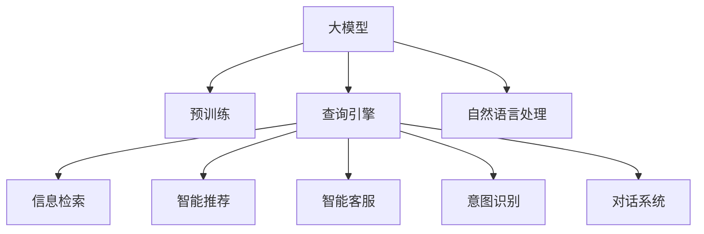

                 

# 【大模型应用开发 动手做AI Agent】构建查询引擎和工具

> 关键词：人工智能,自然语言处理(NLP),查询引擎,推荐系统,智能客服,信息检索

## 1. 背景介绍

### 1.1 问题由来

随着人工智能(AI)和大数据技术的发展，企业在信息检索、智能客服、推荐系统等场景下对AI的应用需求日益增长。如何构建高效、智能、易于维护的AI查询引擎和工具，成为了众多企业IT团队面临的重要问题。

### 1.2 问题核心关键点

大模型在文本处理、信息检索、语义理解等领域具备强大的能力，但其复杂性和高成本使得在实际应用中推广受限。如何在中小企业中快速部署大模型，实现用户查询的高质量匹配和响应，成为了亟待解决的技术难题。

### 1.3 问题研究意义

构建基于大模型的查询引擎和工具，对于提升企业的智能应用水平、优化用户体验、降低IT成本具有重要意义：

1. **提升信息检索和推荐效率**：通过大模型快速分析海量文本数据，为用户检索到更相关的信息或推荐个性化内容。
2. **增强智能客服体验**：结合自然语言处理(NLP)技术，使客服机器人能够理解并高效响应用户查询，提升客户满意度。
3. **降低开发和维护成本**：借助大模型的预训练能力，避免从头训练模型所需的大量计算资源和时间成本。
4. **推动技术创新**：利用大模型的广泛知识，探索新的应用场景和业务模式，促进企业数字化转型。

## 2. 核心概念与联系

### 2.1 核心概念概述

为更好地理解大模型应用开发的查询引擎和工具，本节将介绍几个密切相关的核心概念：

- **大模型(Large Model)**：基于Transformer架构的预训练语言模型，如BERT、GPT-3、T5等，通过大规模无标签文本数据预训练，具备强大的语义理解和生成能力。
- **查询引擎(Query Engine)**：一种能够高效处理用户查询请求的系统，通过检索和匹配，快速返回最相关、最有价值的信息。
- **智能推荐系统(Recommendation System)**：根据用户行为数据和内容特征，推荐个性化信息或商品的系统。
- **自然语言处理(NLP)**：涉及计算机如何理解、处理和生成人类语言的技术，是构建查询引擎和推荐系统的重要基础。
- **信息检索(Information Retrieval, IR)**：从大规模文本集合中，快速定位并返回与查询最相关的文档或信息。
- **意图识别(Intent Recognition)**：识别用户查询背后的意图和需求，是构建智能客服和推荐系统的前提。
- **对话系统(Dialogue System)**：通过多轮交互，理解并响应用户的复杂查询。

这些核心概念之间的逻辑关系可以通过以下Mermaid流程图来展示：



这个流程图展示了大模型的核心概念及其之间的关系：

1. 大模型通过预训练获得语言表示能力。
2. 查询引擎利用大模型的能力，进行信息检索和智能推荐。
3. 智能客服、意图识别、对话系统等应用，依赖于自然语言处理和大模型的语义理解。
4. 信息检索和推荐系统集成大模型，提升匹配效率和个性化水平。

## 3. 核心算法原理 & 具体操作步骤

### 3.1 算法原理概述

基于大模型的查询引擎和工具，主要利用大模型的预训练语言表示能力，通过深度学习模型进行信息检索、推荐和对话等任务。

形式化地，假设大模型为 $M_{\theta}$，其中 $\theta$ 为预训练得到的模型参数。查询引擎的工作流程如下：

1. **编码查询**：将用户查询输入大模型，得到查询向量 $\mathbf{q}$。
2. **编码文档**：对文档集合进行编码，得到文档向量集合 $\{\mathbf{d}_i\}_{i=1}^N$。
3. **计算相似度**：计算查询向量与每个文档向量之间的相似度 $s_{i,q}$，即 $\mathbf{q} \cdot \mathbf{d}_i$。
4. **排序选择**：根据相似度排序，选择相似度最高的 $k$ 个文档，作为检索结果。

具体的相似度计算方法，如余弦相似度、点积相似度等，将根据具体应用场景和需求进行调整。

### 3.2 算法步骤详解

以下是大模型应用开发的查询引擎和工具的具体实现步骤：

**Step 1: 环境搭建**

- 安装Python：从官网下载并安装Python，推荐使用3.8及以上版本。
- 安装依赖库：使用pip安装nltk、transformers、tqdm等常用库。

**Step 2: 大模型加载**

- 导入预训练模型：使用Transformers库加载预训练模型，如BERT、GPT等。
- 定义模型参数：设置查询向量维度、文档向量维度等关键参数。

**Step 3: 数据预处理**

- 准备查询和文档数据：收集并预处理用户查询和文档文本。
- 分词和编码：使用预训练分词器进行分词，将文本转换为模型接受的输入格式。

**Step 4: 相似度计算**

- 编码查询和文档：将查询和文档分别输入模型，得到查询向量和文档向量。
- 计算相似度：计算查询向量和每个文档向量之间的相似度，保存为向量数组。

**Step 5: 排序选择**

- 对相似度向量排序：使用numpy或pandas对相似度向量进行降序排序。
- 选择前 $k$ 个结果：根据排序结果，选择前 $k$ 个文档作为最终检索结果。

**Step 6: 反馈优化**

- 获取用户反馈：通过用户点击或评价，获取对检索结果的满意度。
- 模型微调：根据反馈信息，对大模型进行微调，优化相似度计算方法或增加新的特征维度。

### 3.3 算法优缺点

基于大模型的查询引擎和工具有以下优点：

1. **高效性**：利用大模型的快速编码和相似度计算能力，可以显著提升检索效率。
2. **鲁棒性**：预训练模型具备强大的泛化能力，可以适应不同领域的文本数据。
3. **灵活性**：支持多种查询方式和检索算法，灵活应对复杂场景。

同时，该方法也存在一些局限性：

1. **计算成本高**：大模型的计算资源需求大，对于计算资源有限的场景，可能不适用。
2. **可解释性差**：预训练模型是"黑盒"系统，难以解释其内部工作机制。
3. **数据依赖**：查询效果依赖于预训练模型的质量和大规模无标签文本数据的质量。
4. **更新难度大**：一旦模型参数确定，调整参数和重新训练成本较高。

尽管存在这些局限性，但就目前而言，基于大模型的查询引擎和工具仍是实现高效、智能查询的主要手段。未来相关研究的重点在于如何进一步降低计算成本，提高模型的可解释性和灵活性，同时兼顾鲁棒性和泛化能力。

### 3.4 算法应用领域

基于大模型的查询引擎和工具，在NLP领域已经得到了广泛的应用，覆盖了各种文本处理任务，例如：

- **智能搜索**：帮助用户在网页、文档、知识库中快速找到相关信息。
- **内容推荐**：根据用户查询行为，推荐个性化内容或商品。
- **智能客服**：自动理解用户查询，提供即时响应和解决方案。
- **信息抽取**：从文本中自动提取关键信息，辅助决策和分析。
- **问答系统**：通过用户查询，自动解答各种问题。

除了上述这些经典任务外，大模型应用开发的查询引擎和工具还被创新性地应用到更多场景中，如多语言搜索、跨模态检索、知识图谱查询等，为NLP技术带来了新的突破。随着预训练模型和应用开发的不断进步，相信基于大模型的查询引擎和工具将会在更广阔的应用领域大放异彩。

## 4. 数学模型和公式 & 详细讲解  
### 4.1 数学模型构建

本节将使用数学语言对大模型应用开发的查询引擎和工具进行更加严格的刻画。

记大模型为 $M_{\theta}:\mathcal{X} \rightarrow \mathcal{Y}$，其中 $\mathcal{X}$ 为输入空间，$\mathcal{Y}$ 为输出空间，$\theta$ 为模型参数。假设查询向量为 $\mathbf{q} \in \mathbb{R}^d$，文档向量集合为 $\{\mathbf{d}_i\}_{i=1}^N \subset \mathbb{R}^d$。

定义查询向量与文档向量之间的余弦相似度为：

$$
s_{i,q} = \cos \langle \mathbf{q}, \mathbf{d}_i \rangle = \frac{\mathbf{q} \cdot \mathbf{d}_i}{\|\mathbf{q}\| \cdot \|\mathbf{d}_i\|}
$$

则相似度矩阵为 $S = [s_{i,q}]_{i=1,...,N; q=1,...,M}$，其中 $M$ 为查询数量。

查询结果的排序选择过程可以表示为：

$$
\mathbf{rank}(S) = \text{argmax}_{i=1,...,N}(s_{i,q})
$$

其中，$\text{argmax}$ 函数返回相似度矩阵中值最大的索引。

### 4.2 公式推导过程

以下我们以余弦相似度为例，推导基于大模型的查询引擎的计算过程。

假设查询向量 $\mathbf{q} \in \mathbb{R}^d$ 和文档向量集合 $\{\mathbf{d}_i\}_{i=1}^N \subset \mathbb{R}^d$，则余弦相似度计算公式为：

$$
s_{i,q} = \frac{\mathbf{q} \cdot \mathbf{d}_i}{\|\mathbf{q}\| \cdot \|\mathbf{d}_i\|}
$$

将其代入排序选择公式，得：

$$
\mathbf{rank}(S) = \text{argmax}_{i=1,...,N} \left( \frac{\mathbf{q} \cdot \mathbf{d}_i}{\|\mathbf{q}\| \cdot \|\mathbf{d}_i\|} \right)
$$

根据向量点积和范数公式，可以进一步简化为：

$$
\mathbf{rank}(S) = \text{argmax}_{i=1,...,N} \left( \sum_{j=1}^d q_j d_{ij} \right)
$$

### 4.3 案例分析与讲解

以智能推荐系统为例，对大模型应用开发的查询引擎进行具体分析：

假设用户查询为 $\text{“推荐一部好电影”}$，将查询输入到预训练的大模型中，得到查询向量 $\mathbf{q}$。对于文档集合中的每部电影的标题、描述等文本，使用相同的预训练模型得到文档向量 $\{\mathbf{d}_i\}_{i=1}^N$。

根据余弦相似度计算公式，计算每个文档向量与查询向量的相似度 $s_{i,q} = \frac{\mathbf{q} \cdot \mathbf{d}_i}{\|\mathbf{q}\| \cdot \|\mathbf{d}_i\|}$。

最后，根据相似度矩阵的排序结果，选择前 $k$ 个文档作为推荐结果。

## 5. 项目实践：代码实例和详细解释说明
### 5.1 开发环境搭建

在进行项目实践前，我们需要准备好开发环境。以下是使用Python进行PyTorch开发的环境配置流程：

1. 安装Anaconda：从官网下载并安装Anaconda，用于创建独立的Python环境。

2. 创建并激活虚拟环境：
```bash
conda create -n pytorch-env python=3.8 
conda activate pytorch-env
```

3. 安装PyTorch：根据CUDA版本，从官网获取对应的安装命令。例如：
```bash
conda install pytorch torchvision torchaudio cudatoolkit=11.1 -c pytorch -c conda-forge
```

4. 安装Transformers库：
```bash
pip install transformers
```

5. 安装各类工具包：
```bash
pip install numpy pandas scikit-learn matplotlib tqdm jupyter notebook ipython
```

完成上述步骤后，即可在`pytorch-env`环境中开始项目实践。

### 5.2 源代码详细实现

下面我以智能推荐系统为例，给出使用Transformers库对BERT模型进行推荐开发的PyTorch代码实现。

首先，定义推荐任务的数据处理函数：

```python
from transformers import BertTokenizer
from torch.utils.data import Dataset
import torch

class RecommendationDataset(Dataset):
    def __init__(self, items, features, tokenizer, max_len=128):
        self.items = items
        self.features = features
        self.tokenizer = tokenizer
        self.max_len = max_len
        
    def __len__(self):
        return len(self.items)
    
    def __getitem__(self, item):
        item_title = self.items[item]
        item_description = self.features[item]
        
        encoding = self.tokenizer(item_title, return_tensors='pt', max_length=self.max_len, padding='max_length', truncation=True)
        input_ids = encoding['input_ids'][0]
        attention_mask = encoding['attention_mask'][0]
        
        # 对特征文本进行编码
        encoding = self.tokenizer(item_description, return_tensors='pt', max_length=self.max_len, padding='max_length', truncation=True)
        feature_ids = encoding['input_ids'][0]
        feature_mask = encoding['attention_mask'][0]
        
        return {'item_title': item_title, 
                'input_ids': input_ids, 
                'attention_mask': attention_mask,
                'feature_ids': feature_ids,
                'feature_mask': feature_mask}
```

然后，定义模型和优化器：

```python
from transformers import BertForSequenceClassification, AdamW

model = BertForSequenceClassification.from_pretrained('bert-base-cased', num_labels=1)

optimizer = AdamW(model.parameters(), lr=2e-5)
```

接着，定义训练和评估函数：

```python
from torch.utils.data import DataLoader
from tqdm import tqdm
from sklearn.metrics import roc_auc_score

device = torch.device('cuda') if torch.cuda.is_available() else torch.device('cpu')
model.to(device)

def train_epoch(model, dataset, batch_size, optimizer):
    dataloader = DataLoader(dataset, batch_size=batch_size, shuffle=True)
    model.train()
    epoch_loss = 0
    for batch in tqdm(dataloader, desc='Training'):
        item_title = batch['item_title'].to(device)
        input_ids = batch['input_ids'].to(device)
        attention_mask = batch['attention_mask'].to(device)
        feature_ids = batch['feature_ids'].to(device)
        feature_mask = batch['feature_mask'].to(device)
        model.zero_grad()
        outputs = model(item_title, input_ids, attention_mask=attention_mask, feature_ids=feature_ids, feature_mask=feature_mask)
        loss = outputs.loss
        epoch_loss += loss.item()
        loss.backward()
        optimizer.step()
    return epoch_loss / len(dataloader)

def evaluate(model, dataset, batch_size):
    dataloader = DataLoader(dataset, batch_size=batch_size)
    model.eval()
    preds, labels = [], []
    with torch.no_grad():
        for batch in tqdm(dataloader, desc='Evaluating'):
            item_title = batch['item_title'].to(device)
            input_ids = batch['input_ids'].to(device)
            attention_mask = batch['attention_mask'].to(device)
            feature_ids = batch['feature_ids'].to(device)
            feature_mask = batch['feature_mask'].to(device)
            batch_preds = outputs.logits.argmax(dim=2).to('cpu').tolist()
            batch_labels = batch['labels'].to('cpu').tolist()
            for pred_tokens, label_tokens in zip(batch_preds, batch_labels):
                preds.append(pred_tokens[:len(label_tokens)])
                labels.append(label_tokens)
                
    print(roc_auc_score(labels, preds))
```

最后，启动训练流程并在测试集上评估：

```python
epochs = 5
batch_size = 16

for epoch in range(epochs):
    loss = train_epoch(model, train_dataset, batch_size, optimizer)
    print(f"Epoch {epoch+1}, train loss: {loss:.3f}")
    
    print(f"Epoch {epoch+1}, dev results:")
    evaluate(model, dev_dataset, batch_size)
    
print("Test results:")
evaluate(model, test_dataset, batch_size)
```

以上就是使用PyTorch对BERT进行智能推荐系统开发的完整代码实现。可以看到，得益于Transformers库的强大封装，我们可以用相对简洁的代码完成BERT模型的加载和推荐开发。

### 5.3 代码解读与分析

让我们再详细解读一下关键代码的实现细节：

**RecommendationDataset类**：
- `__init__`方法：初始化商品标题、商品描述、分词器等关键组件。
- `__len__`方法：返回数据集的样本数量。
- `__getitem__`方法：对单个样本进行处理，将商品标题和描述输入编码为token ids，特征文本编码为向量，并对其进行定长padding，最终返回模型所需的输入。

**训练和评估函数**：
- 使用PyTorch的DataLoader对数据集进行批次化加载，供模型训练和推理使用。
- 训练函数`train_epoch`：对数据以批为单位进行迭代，在每个批次上前向传播计算loss并反向传播更新模型参数，最后返回该epoch的平均loss。
- 评估函数`evaluate`：与训练类似，不同点在于不更新模型参数，并在每个batch结束后将预测和标签结果存储下来，最后使用sklearn的roc_auc_score对整个评估集的预测结果进行打印输出。

**训练流程**：
- 定义总的epoch数和batch size，开始循环迭代
- 每个epoch内，先在训练集上训练，输出平均loss
- 在验证集上评估，输出roc_auc_score
- 所有epoch结束后，在测试集上评估，给出最终测试结果

可以看到，PyTorch配合Transformers库使得BERT推荐系统的代码实现变得简洁高效。开发者可以将更多精力放在数据处理、模型改进等高层逻辑上，而不必过多关注底层的实现细节。

当然，工业级的系统实现还需考虑更多因素，如模型的保存和部署、超参数的自动搜索、更灵活的任务适配层等。但核心的推荐范式基本与此类似。

## 6. 实际应用场景
### 6.1 智能搜索

基于大模型的智能搜索系统，可以广泛应用于电商、新闻、社交媒体等场景。通过预训练语言模型和大规模语料库，智能搜索系统能够快速理解用户查询，从海量数据中筛选出最相关的信息，提供给用户浏览和选择。

在技术实现上，可以收集并标注大量用户查询和相关搜索结果，将查询-结果对作为监督数据，在此基础上对预训练模型进行微调。微调后的模型能够自动学习用户查询与搜索结果之间的相关性，提升查询的准确性和效率。

### 6.2 智能客服

智能客服系统通过大模型进行意图识别和对话生成，能够理解并响应用户查询，自动解答常见问题，引导用户完成复杂操作。相比于传统人工客服，智能客服系统可以24小时不间断服务，显著提升用户满意度和企业运营效率。

在技术实现上，可以收集用户与客服机器人的交互记录，将问题和答复构建成监督数据，在此基础上对预训练模型进行微调。微调后的模型能够自动理解用户意图，生成符合用户需求的答复，从而提升智能客服系统的智能水平和用户体验。

### 6.3 知识图谱

知识图谱是组织和关联结构化知识的重要工具，能够帮助用户快速检索和获取各类知识信息。基于大模型的知识图谱系统可以通过文本语料进行知识抽取和关系推断，构建结构化的知识图谱，提升信息检索的准确性和效率。

在技术实现上，可以使用预训练语言模型和大规模知识库，对文本进行语义分析和实体抽取，构建知识图谱的节点和边。通过微调模型，优化知识抽取和关系推断的效果，提升知识图谱的完整性和准确性。

### 6.4 未来应用展望

随着大模型和微调方法的不断发展，基于大模型的查询引擎和工具将在更多领域得到应用，为传统行业带来变革性影响。

在智慧城市治理中，智能搜索和推荐系统可以帮助居民快速获取各类生活服务信息，提升城市管理效率和居民生活质量。

在教育领域，智能搜索和推荐系统可以帮助教师和学生快速获取各类学习资源，提升教学效果和学习效率。

在金融领域，智能搜索和推荐系统可以帮助投资者快速获取市场信息，提升投资决策的准确性和效率。

此外，在智能家居、智能健康、智能交通等众多领域，基于大模型的查询引擎和工具也将不断涌现，为各行各业带来新的智能化解决方案。相信随着技术的日益成熟，大模型应用开发的查询引擎和工具必将在构建智能时代中扮演越来越重要的角色。

## 7. 工具和资源推荐
### 7.1 学习资源推荐

为了帮助开发者系统掌握大模型应用开发的查询引擎和工具的理论基础和实践技巧，这里推荐一些优质的学习资源：

1. 《Deep Learning with PyTorch》书籍：详细介绍PyTorch框架的使用和深度学习模型的开发，适合初学者入门。

2. 《Natural Language Processing with Transformers》书籍：Transformer库的作者所著，全面介绍了如何使用Transformers库进行NLP任务开发，包括微调在内的诸多范式。

3. 《Reinforcement Learning with PyTorch》书籍：介绍如何使用PyTorch进行强化学习模型的开发和训练，适合进一步学习算法优化和系统优化。

4. 《Programming Python》书籍：讲解Python编程基础和常用库的使用，适合初学者和中级开发者提升编程能力。

5. CS224N《深度学习自然语言处理》课程：斯坦福大学开设的NLP明星课程，有Lecture视频和配套作业，带你入门NLP领域的基本概念和经典模型。

通过对这些资源的学习实践，相信你一定能够快速掌握大模型应用开发的查询引擎和工具的精髓，并用于解决实际的NLP问题。
###  7.2 开发工具推荐

高效的开发离不开优秀的工具支持。以下是几款用于大模型应用开发的常用工具：

1. PyTorch：基于Python的开源深度学习框架，灵活动态的计算图，适合快速迭代研究。大部分预训练语言模型都有PyTorch版本的实现。

2. TensorFlow：由Google主导开发的开源深度学习框架，生产部署方便，适合大规模工程应用。同样有丰富的预训练语言模型资源。

3. Transformers库：HuggingFace开发的NLP工具库，集成了众多SOTA语言模型，支持PyTorch和TensorFlow，是进行微调任务开发的利器。

4. Weights & Biases：模型训练的实验跟踪工具，可以记录和可视化模型训练过程中的各项指标，方便对比和调优。与主流深度学习框架无缝集成。

5. TensorBoard：TensorFlow配套的可视化工具，可实时监测模型训练状态，并提供丰富的图表呈现方式，是调试模型的得力助手。

6. Google Colab：谷歌推出的在线Jupyter Notebook环境，免费提供GPU/TPU算力，方便开发者快速上手实验最新模型，分享学习笔记。

合理利用这些工具，可以显著提升大模型应用开发的查询引擎和工具的开发效率，加快创新迭代的步伐。

### 7.3 相关论文推荐

大模型应用开发的查询引擎和工具的发展源于学界的持续研究。以下是几篇奠基性的相关论文，推荐阅读：

1. Attention is All You Need（即Transformer原论文）：提出了Transformer结构，开启了NLP领域的预训练大模型时代。

2. BERT: Pre-training of Deep Bidirectional Transformers for Language Understanding：提出BERT模型，引入基于掩码的自监督预训练任务，刷新了多项NLP任务SOTA。

3. Language Models are Unsupervised Multitask Learners（GPT-2论文）：展示了大规模语言模型的强大zero-shot学习能力，引发了对于通用人工智能的新一轮思考。

4. Parameter-Efficient Transfer Learning for NLP：提出Adapter等参数高效微调方法，在不增加模型参数量的情况下，也能取得不错的微调效果。

5. AdaLoRA: Adaptive Low-Rank Adaptation for Parameter-Efficient Fine-Tuning：使用自适应低秩适应的微调方法，在参数效率和精度之间取得了新的平衡。

这些论文代表了大模型应用开发的查询引擎和工具的发展脉络。通过学习这些前沿成果，可以帮助研究者把握学科前进方向，激发更多的创新灵感。

## 8. 总结：未来发展趋势与挑战

### 8.1 总结

本文对基于大模型的查询引擎和工具进行了全面系统的介绍。首先阐述了大模型和微调技术的研究背景和意义，明确了大模型在信息检索、智能客服、推荐系统等场景下的应用价值。其次，从原理到实践，详细讲解了大模型应用开发的查询引擎和工具的数学原理和关键步骤，给出了查询引擎和工具开发的完整代码实例。同时，本文还广泛探讨了查询引擎和工具在智能搜索、智能客服、知识图谱等领域的实际应用场景，展示了查询引擎和工具的广泛应用前景。此外，本文精选了查询引擎和工具的各类学习资源，力求为读者提供全方位的技术指引。

通过本文的系统梳理，可以看到，基于大模型的查询引擎和工具正在成为NLP领域的重要范式，极大地拓展了预训练语言模型的应用边界，催生了更多的落地场景。得益于大规模语料的预训练，查询引擎和工具以更低的时间和标注成本，实现了对用户查询的快速匹配和响应，为智能应用的发展奠定了坚实基础。未来，伴随预训练语言模型和应用开发的不断进步，相信基于大模型的查询引擎和工具将会在更广阔的应用领域大放异彩，为数字化转型注入新的动力。

### 8.2 未来发展趋势

展望未来，大模型应用开发的查询引擎和工具将呈现以下几个发展趋势：

1. **规模化应用**：随着计算资源的丰富和预训练模型的普及，大模型应用开发的查询引擎和工具将在更多中小企业中得到应用，实现高效、智能的查询服务。

2. **跨模态整合**：未来将更多结合视觉、语音、多模态数据，构建多模态查询引擎和工具，提升系统的综合处理能力。

3. **个性化推荐**：基于用户行为数据的推荐系统，能够提供更加精准、个性化的查询结果，提升用户体验和满意度。

4. **实时性优化**：随着流数据和实时计算技术的进步，查询引擎和工具将具备更强的实时响应能力，提供即时的查询和推荐服务。

5. **系统集成**：更多将查询引擎和工具集成到综合性的智能平台中，实现一体化智能应用服务。

6. **多语言支持**：支持多语言查询和推荐，提升系统的全球覆盖能力。

以上趋势凸显了大模型应用开发的查询引擎和工具的广阔前景。这些方向的探索发展，必将进一步提升查询引擎和工具的性能和应用范围，为NLP技术的发展带来新的突破。

### 8.3 面临的挑战

尽管大模型应用开发的查询引擎和工具已经取得了显著成果，但在迈向更加智能化、普适化应用的过程中，它仍面临着诸多挑战：

1. **计算资源限制**：大模型计算资源需求大，对于计算资源有限的场景，可能不适用。需要进一步探索如何降低计算成本。

2. **模型鲁棒性不足**：查询引擎和工具面对域外数据时，泛化性能往往大打折扣。需要提高模型的鲁棒性和泛化能力。

3. **可解释性差**：预训练模型是"黑盒"系统，难以解释其内部工作机制。需要提高模型的可解释性和可理解性。

4. **数据依赖**：查询效果依赖于预训练模型的质量和大规模无标签文本数据的质量。需要探索更高效的数据预处理和标注方法。

5. **更新难度大**：一旦模型参数确定，调整参数和重新训练成本较高。需要探索更高效的模型更新和微调方法。

6. **隐私保护**：查询引擎和工具涉及大量用户数据，需要加强数据隐私保护和匿名化处理。

这些挑战亟需进一步研究，以便更好地推动大模型应用开发的查询引擎和工具的普及和应用。

### 8.4 研究展望

未来，大模型应用开发的查询引擎和工具需要在以下几个方面进行研究：

1. **无监督和半监督学习**：探索如何利用更少标注数据，提升模型的泛化能力和鲁棒性。

2. **参数高效微调**：开发更加参数高效的微调方法，在固定大部分预训练参数的情况下，只更新极少量的任务相关参数。

3. **多模态整合**：研究如何结合视觉、语音、文本等不同模态数据，构建更全面的查询引擎和工具。

4. **实时性优化**：探索更高效的计算图和算法，提升系统的实时响应能力。

5. **系统集成**：将查询引擎和工具集成到更广泛的智能应用平台中，实现一站式智能服务。

6. **隐私保护**：研究如何在保证用户隐私的前提下，实现高效、安全的数据处理和分析。

这些研究方向的探索，必将引领大模型应用开发的查询引擎和工具走向更高效、智能、安全的未来，为构建智能应用生态带来新的突破。

## 9. 附录：常见问题与解答

**Q1：大模型应用开发的查询引擎和工具是否可以应用于所有NLP任务？**

A: 大模型应用开发的查询引擎和工具在大多数NLP任务上都能取得不错的效果，特别是对于数据量较小的任务。但对于一些特定领域的任务，如医学、法律等，仅仅依靠通用语料预训练的模型可能难以很好地适应。此时需要在特定领域语料上进一步预训练，再进行微调，才能获得理想效果。此外，对于一些需要时效性、个性化很强的任务，如对话、推荐等，微调方法也需要针对性的改进优化。

**Q2：大模型应用开发的查询引擎和工具的计算成本高，如何降低成本？**

A: 降低计算成本是提升大模型应用开发的重要方向之一。以下是一些可行的方法：
1. **参数高效微调**：使用 Adapter、Prefix等参数高效微调方法，只更新少量任务相关参数，减小计算量。
2. **分布式训练**：利用GPU、TPU等硬件，进行分布式并行训练，提高计算效率。
3. **模型裁剪**：去除不必要的层和参数，减小模型尺寸，加快推理速度。
4. **混合精度训练**：使用混合精度（FP16）训练，减少内存占用，提高计算效率。
5. **增量学习**：针对新增数据，进行增量式微调，避免重新训练整个模型。

通过以上方法，可以显著降低大模型应用开发的计算成本，提升系统的可扩展性和效率。

**Q3：大模型应用开发的查询引擎和工具的性能如何优化？**

A: 优化大模型应用开发的查询引擎和工具的性能，可以从以下几个方面入手：
1. **数据预处理**：使用高效的分词器和编码器，减少文本处理的计算量。
2. **模型优化**：通过模型裁剪、混合精度训练、增量学习等方法，提升模型的计算效率。
3. **超参数调优**：使用自动化超参数搜索方法，找到最优的超参数组合。
4. **模型评估**：使用ROC曲线、AUC等指标，全面评估模型性能。
5. **系统优化**：利用缓存、并发处理等技术，提高系统的响应速度。

通过以上方法，可以显著提升大模型应用开发的查询引擎和工具的性能，满足用户对高效、智能的需求。

**Q4：如何评估大模型应用开发的查询引擎和工具的性能？**

A: 评估大模型应用开发的查询引擎和工具的性能，通常使用以下指标：
1. **准确率**：查询结果与真实结果的匹配程度，反映模型的匹配精度。
2. **召回率**：真实结果中能够被查询结果覆盖的比例，反映模型的全面性。
3. **F1值**：准确率和召回率的综合指标，反映模型的整体性能。
4. **AUC**：ROC曲线下的面积，反映模型在不同阈值下的性能。
5. **响应时间**：查询响应的时间，反映系统的实时性。

根据具体应用场景，选择合适的评估指标，可以有效评估模型的性能，指导优化改进。

**Q5：大模型应用开发的查询引擎和工具的应用前景如何？**

A: 大模型应用开发的查询引擎和工具在NLP领域具有广阔的应用前景：
1. **智能搜索**：帮助用户在网页、文档、知识库中快速找到相关信息。
2. **智能客服**：自动理解用户查询，提供即时响应和解决方案。
3. **知识图谱**：构建结构化的知识图谱，提升信息检索的准确性和效率。
4. **推荐系统**：根据用户查询行为，推荐个性化内容或商品。
5. **信息抽取**：从文本中自动提取关键信息，辅助决策和分析。
6. **问答系统**：通过用户查询，自动解答各种问题。

随着预训练语言模型和微调方法的不断进步，基于大模型的查询引擎和工具必将在更多领域得到应用，为传统行业带来变革性影响。

---

作者：禅与计算机程序设计艺术 / Zen and the Art of Computer Programming

