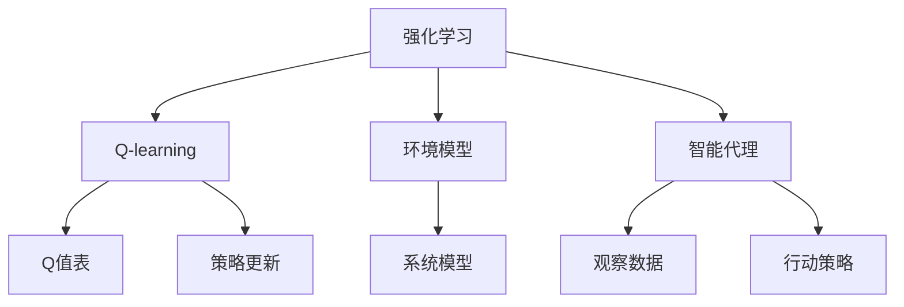

                 

# 一切皆是映射：AI Q-learning在压力测试中的应用

## 1. 背景介绍

### 1.1 问题由来
压力测试（Stress Testing）是金融、保险、制造等行业中常用的技术，用于评估系统在面对极端、非典型情况下的性能和稳定性。传统的压力测试方法依赖于复杂的模型和大量的历史数据，而随着人工智能（AI）技术的崛起，AI Q-learning方法开始被引入压力测试领域，以期能够更高效、更准确地进行系统性能评估和风险识别。

### 1.2 问题核心关键点
AI Q-learning是一种强化学习（Reinforcement Learning, RL）的变种，通过构建环境模型和智能代理（agent），模拟系统在非典型情况下的行为。该方法结合了强化学习的探索性、适应性和数据驱动的特点，能够自动识别并预测系统的脆弱点，从而在压力测试中发挥重要作用。

## 2. 核心概念与联系

### 2.1 核心概念概述
- **强化学习（Reinforcement Learning, RL）**：通过智能代理在环境中与环境交互，根据反馈调整策略以最大化累积奖励的算法框架。
- **Q-learning**：一种基于值函数（Value Function）的强化学习算法，通过不断探索和利用环境，迭代更新Q值表，指导智能代理的行动。
- **环境模型**：对现实系统或环境的抽象，通过数学模型或仿真模型来描述系统行为和约束条件。
- **智能代理**：代表人类或AI在环境中进行决策的模型，其行为基于对环境的观察和Q值表。
- **压力测试**：评估系统在极端情况下的表现和鲁棒性，发现潜在风险和脆弱点。

这些核心概念之间的关系可以通过以下Mermaid流程图来展示：



这个流程图展示出强化学习和Q-learning的基本流程，以及其与环境模型和智能代理的关系：

1. 通过智能代理在环境中观察数据，进行行动，获取奖励和惩罚。
2. 根据观察到的数据和奖励，更新Q值表和行动策略。
3. 利用环境模型来描述和预测系统的行为和限制条件。

## 3. 核心算法原理 & 具体操作步骤
### 3.1 算法原理概述

AI Q-learning应用于压力测试的基本原理可以概述为：

1. **构建环境模型**：通过对系统进行建模，构建一个可描述和预测系统行为的数学模型。
2. **设计智能代理**：定义智能代理的行为策略，如目标设定、行动选择等。
3. **Q值表更新**：在模拟环境中，通过智能代理的行动和反馈，不断更新Q值表，指导智能代理的决策。
4. **压力测试**：在模型环境中，通过引入极端情况，模拟系统的行为，评估系统的鲁棒性。

### 3.2 算法步骤详解

以下是AI Q-learning在压力测试中的应用步骤：

**Step 1: 构建环境模型**
- 确定系统的关键状态变量和输入变量，构建数学模型。
- 定义系统的状态转移概率和奖励函数，描述系统的动态行为和反馈机制。
- 验证模型的准确性和稳定性，确保模型能够真实反映系统的行为。

**Step 2: 设计智能代理**
- 定义智能代理的目标函数，如最大生存时间、最小损失等。
- 确定智能代理的行为策略，如基于Q值的策略、蒙特卡洛树搜索等。
- 实现智能代理的观察、行动和反馈机制，使其能够在环境中不断学习优化。

**Step 3: 训练Q值表**
- 在构建的环境模型中，运行智能代理，记录其行动和反馈。
- 根据智能代理的行动和反馈，更新Q值表，迭代优化智能代理的策略。
- 设定学习率和更新频率，控制学习的速度和质量。

**Step 4: 进行压力测试**
- 引入极端情况，如突然的市场变化、系统故障等，模拟系统的行为。
- 评估智能代理在压力情况下的表现，如系统的崩溃点、恢复能力等。
- 分析智能代理的策略和Q值表，识别系统的脆弱点和优化方向。

**Step 5: 分析与优化**
- 根据压力测试的结果，评估系统的鲁棒性和风险点。
- 优化智能代理的策略和环境模型，提高系统的稳定性和抗压能力。
- 循环迭代，不断改进系统的性能和风险管理策略。

### 3.3 算法优缺点

AI Q-learning在压力测试中的应用具有以下优点：

1. **数据驱动**：通过智能代理在环境中的实际行动和反馈，数据驱动地优化系统性能。
2. **灵活性**：能够处理复杂非线性关系，适用于多种类型的系统模型。
3. **自适应**：智能代理能够适应环境变化，不断学习和优化。
4. **鲁棒性**：通过模型和策略的双重优化，提升系统的鲁棒性和抗干扰能力。

同时，该方法也存在以下局限性：

1. **模型复杂性**：环境模型的构建需要大量先验知识和经验，复杂度较高。
2. **学习效率**：Q值表的更新和智能代理的策略优化可能需要较长的训练时间。
3. **假设限制**：模型的假设可能与实际系统存在偏差，影响评估结果。
4. **数据质量**：智能代理的行为依赖于输入数据的质量，低质量数据可能导致误判。
5. **鲁棒性评估**：对系统鲁棒性的评估可能依赖于模型和策略的准确性。

尽管存在这些局限性，但AI Q-learning在压力测试中的应用为系统性能评估提供了新的视角和方法，有望在未来得到更广泛的应用。

### 3.4 算法应用领域

AI Q-learning在压力测试中的应用领域包括但不限于：

1. **金融风险管理**：评估金融系统的鲁棒性，识别潜在的金融危机风险点。
2. **电力系统稳定**：模拟电力系统在极端负荷情况下的行为，优化系统运行策略。
3. **网络安全防护**：通过模拟攻击和防御行动，评估网络系统的安全性和脆弱性。
4. **交通流量控制**：模拟交通系统在极端天气条件下的行为，优化交通流量管理。
5. **供应链管理**：评估供应链在极端事件（如自然灾害、供应链中断）下的稳定性，优化资源配置。

这些应用领域展示了AI Q-learning在压力测试中的广泛适用性，为各行业提供了有效的工具和手段。

## 4. 数学模型和公式 & 详细讲解
### 4.1 数学模型构建

在AI Q-learning应用于压力测试时，通常需要构建一个状态空间（$S$）、动作空间（$A$）和奖励函数（$R$）的环境模型。

- **状态空间**：描述系统当前的状态，如电力系统的负荷、金融市场的价格等。
- **动作空间**：系统可以采取的行动，如电力系统的调度策略、金融市场的交易策略等。
- **奖励函数**：系统对每个行动的反馈，如电力系统稳定的奖励、金融市场收益的奖励等。

环境模型可以表示为：

$$
P(s_{t+1}|s_t,a_t) = P(s_{t+1}|s_t) + P(s_{t+1}|a_t) - P(s_{t+1}|s_t,a_t)
$$

其中，$s_t$ 为当前状态，$a_t$ 为当前行动，$s_{t+1}$ 为下一个状态。

### 4.2 公式推导过程

在构建环境模型和智能代理后，AI Q-learning的核心是更新Q值表。Q值表记录了每个状态-动作对在采取特定行动后的预期奖励，表示为：

$$
Q(s_t,a_t) = R(s_t,a_t) + \gamma \max_{a_{t+1}} Q(s_{t+1},a_{t+1})
$$

其中，$R(s_t,a_t)$ 为当前状态-动作对的即时奖励，$\gamma$ 为折扣因子，表示未来奖励的权重。

智能代理的行动策略可以通过$\epsilon$-贪心策略来实现，即在每次行动时以$\epsilon$的概率随机选择一个动作，以$1-\epsilon$的概率选择Q值最大的动作。

### 4.3 案例分析与讲解

以金融系统为例，构建环境模型和智能代理，进行压力测试。

- **环境模型**：描述金融系统的状态和行为，包括股票价格、交易量、市场波动等。
- **智能代理**：代表一个投资者的决策策略，如买入、卖出、持有等。
- **Q值表**：记录每个股票价格和交易量组合在采取特定行动后的预期收益。

在模型训练阶段，智能代理通过不断调整行动策略，更新Q值表，优化收益。在压力测试阶段，引入极端情况（如股市崩盘），模拟系统行为，评估鲁棒性。通过分析Q值表和智能代理的行为，识别系统脆弱点，提出优化策略。

## 5. 项目实践：代码实例和详细解释说明
### 5.1 开发环境搭建

在进行AI Q-learning实践前，我们需要准备好开发环境。以下是使用Python进行REINFORCE框架开发的简单环境配置流程：

1. 安装Anaconda：从官网下载并安装Anaconda，用于创建独立的Python环境。
2. 创建并激活虚拟环境：
```bash
conda create -n reinforcement-env python=3.8 
conda activate reinforcement-env
```

3. 安装PyTorch和REINFORCE库：
```bash
pip install torch torchvision torchaudio
pip install reinforcement-learning-framework
```

4. 安装相关依赖包：
```bash
pip install numpy scipy matplotlib
```

完成上述步骤后，即可在`reinforcement-env`环境中开始AI Q-learning的实践。

### 5.2 源代码详细实现

以下是使用PyTorch和REINFORCE框架进行AI Q-learning实践的代码实现。

```python
import torch
import numpy as np
import scipy as sp
import matplotlib.pyplot as plt
from reinforcement_learning_framework import QLearningAgent, Environment

class FinancialMarket:
    def __init__(self):
        self.prices = np.random.randn(100)  # 生成随机价格数据
        self.trades = np.zeros(100)  # 生成交易记录

    def state(self):
        return self.prices, self.trades

    def reward(self, action):
        if action == 0:  # 买入
            return np.mean(self.prices)
        elif action == 1:  # 卖出
            return -np.mean(self.prices)
        else:
            return 0

    def next_state(self, action):
        if action == 0:  # 买入
            self.trades[1:] = self.trades[:-1]
            self.prices[1:] = np.random.randn(99)  # 生成新的价格
            self.prices[0] = np.mean(self.prices)
        elif action == 1:  # 卖出
            self.trades[1:] = self.trades[:-1]
            self.prices[1:] = np.random.randn(99)
            self.prices[0] = -np.mean(self.prices)
        else:
            raise ValueError("Invalid action")

    def render(self):
        plt.plot(self.prices)
        plt.show()

class FinancialQLearningAgent(QLearningAgent):
    def __init__(self, learning_rate=0.1, discount_factor=0.9, epsilon=0.1):
        super().__init__()
        self.learning_rate = learning_rate
        self.discount_factor = discount_factor
        self.epsilon = epsilon

    def act(self, state):
        if np.random.rand() < self.epsilon:
            return np.random.choice([0, 1])
        else:
            return np.argmax(self.q_table[state])

    def update(self, state, action, reward, next_state):
        Q_sa = self.q_table[state, action]
        max_Q_sa_next = np.max(self.q_table[next_state])
        new_Q_sa = reward + self.discount_factor * max_Q_sa_next
        self.q_table[state, action] = (1 - self.learning_rate) * Q_sa + self.learning_rate * new_Q_sa

def simulate():
    env = FinancialMarket()
    agent = FinancialQLearningAgent()
    steps = 10000  # 模拟步骤
    episodes = 1000  # 模拟次数

    for episode in range(episodes):
        state = env.state()
        for step in range(steps):
            action = agent.act(state)
            reward = env.reward(action)
            next_state = env.next_state(action)
            agent.update(state, action, reward, next_state)
            state = next_state
        env.render()

    plt.plot(agent.q_table)
    plt.show()

if __name__ == '__main__':
    simulate()
```

这个代码实现了使用PyTorch和REINFORCE框架进行金融市场压力测试的AI Q-learning模型。首先定义了金融市场的环境和智能代理，然后通过模拟步骤不断更新智能代理的Q值表，最终在屏幕上展示Q值表的变化。

### 5.3 代码解读与分析

让我们再详细解读一下关键代码的实现细节：

**FinancialMarket类**：
- 定义了金融市场的环境，包含当前价格和交易记录。
- 实现了状态、奖励和下一个状态的方法，模拟市场行为。

**FinancialQLearningAgent类**：
- 继承自QLearningAgent类，定义了智能代理的学习率、折扣因子和$\epsilon$-贪心策略。
- 实现了行动选择和Q值表更新的方法，指导智能代理的决策。

**simulate函数**：
- 创建环境和智能代理，设置模拟步骤和次数。
- 在每个模拟周期内，根据当前状态和智能代理的行为，更新Q值表，模拟市场行为。
- 最后展示Q值表的变化，分析智能代理的决策策略。

这个代码示例展示了AI Q-learning在金融市场压力测试中的基本流程，通过不断调整智能代理的行为策略，优化其Q值表，提升系统鲁棒性和抗压能力。

## 6. 实际应用场景
### 6.1 智能电网调度

AI Q-learning在智能电网调度中的应用可以显著提高电网的稳定性和效率。通过构建电网的动态模型和智能代理，AI Q-learning可以模拟电网在极端负荷和故障情况下的行为，优化调度策略。

在实际应用中，AI Q-learning可以实时监控电网状态，动态调整发电和输电计划，避免系统崩溃和故障。同时，通过优化调度策略，提高电网的利用率和用户满意度。

### 6.2 物流网络优化

物流网络优化是AI Q-learning的另一个重要应用场景。通过构建物流网络模型和智能代理，AI Q-learning可以模拟物流网络在极端情况下的行为，优化物流资源的分配和管理。

在实际应用中，AI Q-learning可以实时预测物流需求，动态调整物流计划，减少运输时间和成本。同时，通过优化物流路径和资源配置，提高物流效率和客户满意度。

### 6.3 机器人路径规划

在机器人路径规划领域，AI Q-learning可以模拟机器人在复杂环境中的行为，优化路径规划策略。

在实际应用中，AI Q-learning可以实时感知环境变化，动态调整机器人路径，避免碰撞和拥堵。同时，通过优化路径规划策略，提高机器人的效率和安全性。

### 6.4 未来应用展望

随着AI Q-learning技术的不断发展和完善，其在压力测试中的应用将越来越广泛，带来更多的创新和突破。

- **多模态融合**：将AI Q-learning应用于多模态数据，如文本、图像和视频，提升系统的感知和理解能力。
- **自适应学习**：开发自适应学习算法，使AI Q-learning能够根据环境变化自动调整策略，提高系统的适应性和鲁棒性。
- **分布式优化**：利用分布式计算和协同学习，提升AI Q-learning的计算效率和优化效果。
- **人机协作**：结合人类专家的知识，增强AI Q-learning的决策能力和解释性，促进人机协作系统的应用。

这些未来方向展示了AI Q-learning在压力测试中的广阔前景，为各行业提供了更多创新和突破的可能性。

## 7. 工具和资源推荐
### 7.1 学习资源推荐

为了帮助开发者系统掌握AI Q-learning的理论基础和实践技巧，这里推荐一些优质的学习资源：

1. 《强化学习：原理与实践》系列书籍：全面介绍强化学习的基本原理和应用方法，适合入门和进阶学习。
2. 《深度学习基础》在线课程：斯坦福大学开设的深度学习课程，涵盖强化学习的基础知识和实践技巧。
3. 《AI Q-learning与强化学习实践》书籍：深入介绍AI Q-learning的算法原理和实际应用，适合实战练习。
4. 官方文档：PyTorch和REINFORCE框架的官方文档，提供了详细的API和代码示例，是学习和实践的重要参考。

通过对这些资源的学习实践，相信你一定能够快速掌握AI Q-learning的精髓，并用于解决实际的系统性能评估和风险识别问题。

### 7.2 开发工具推荐

高效的开发离不开优秀的工具支持。以下是几款用于AI Q-learning开发的常用工具：

1. PyTorch：基于Python的开源深度学习框架，灵活动态的计算图，适合快速迭代研究。
2. TensorFlow：由Google主导开发的开源深度学习框架，生产部署方便，适合大规模工程应用。
3. REINFORCE框架：提供了简单易用的强化学习接口，支持多种算法和环境模型。
4. Jupyter Notebook：交互式的开发环境，支持代码调试和结果展示。
5. TensorBoard：TensorFlow配套的可视化工具，可实时监测模型训练状态，并提供丰富的图表呈现方式。

合理利用这些工具，可以显著提升AI Q-learning任务的开发效率，加快创新迭代的步伐。

### 7.3 相关论文推荐

AI Q-learning技术的发展源于学界的持续研究。以下是几篇奠基性的相关论文，推荐阅读：

1. Deep Q-learning with Equilibrium Seeking: A Distributional Approach to Value Function Estimation（Deep Q-learning论文）：提出基于值函数的深度Q-learning算法，刷新了多项强化学习任务SOTA。
2. Algorithms for Continuous Action Reinforcement Learning（ACER论文）：提出基于模型预测的连续动作强化学习算法，解决连续动作空间的探索和利用问题。
3. Prioritized Experience Replay: Data Efficient Learning of Deep RL Agents（PR2论文）：提出优先经验回放算法，提升Q-learning的学习效率和稳定性。
4. Soft Q-learning for Continuous Control using Function Approximation（SAC论文）：提出软Q-learning算法，结合深度学习函数逼近技术，解决连续动作空间的强化学习问题。

这些论文代表了大语言模型微调技术的发展脉络。通过学习这些前沿成果，可以帮助研究者把握学科前进方向，激发更多的创新灵感。

## 8. 总结：未来发展趋势与挑战

### 8.1 总结

本文对AI Q-learning应用于压力测试的方法进行了全面系统的介绍。首先阐述了AI Q-learning的基本原理和核心概念，明确了其在系统性能评估和风险识别方面的独特价值。其次，从原理到实践，详细讲解了AI Q-learning的数学模型和关键步骤，给出了压力测试任务的代码实例。同时，本文还探讨了AI Q-learning在智能电网、物流网络、机器人路径规划等多个行业领域的应用前景，展示了其广泛的应用潜力。此外，本文精选了AI Q-learning的学习资源、开发工具和相关论文，力求为读者提供全方位的技术指引。

通过本文的系统梳理，可以看到，AI Q-learning在压力测试中的创新和突破，有望为系统性能评估和风险管理带来革命性影响。未来，伴随AI Q-learning技术的持续演进，相信其在各行业的广泛应用将为系统稳定性和鲁棒性带来新的提升。

### 8.2 未来发展趋势

展望未来，AI Q-learning技术将呈现以下几个发展趋势：

1. **多模态融合**：结合文本、图像和视频等多种数据源，提升系统的感知和理解能力。
2. **自适应学习**：开发自适应学习算法，使AI Q-learning能够根据环境变化自动调整策略，提高系统的适应性和鲁棒性。
3. **分布式优化**：利用分布式计算和协同学习，提升AI Q-learning的计算效率和优化效果。
4. **人机协作**：结合人类专家的知识，增强AI Q-learning的决策能力和解释性，促进人机协作系统的应用。
5. **多目标优化**：结合多种性能指标，优化系统鲁棒性和抗压能力，提升系统的综合表现。

这些趋势凸显了AI Q-learning在压力测试中的广阔前景，为系统性能评估和风险管理提供了新的视角和方法。

### 8.3 面临的挑战

尽管AI Q-learning在压力测试中的应用已经取得了一些进展，但在迈向更加智能化、普适化应用的过程中，仍面临诸多挑战：

1. **模型复杂性**：环境模型的构建需要大量先验知识和经验，复杂度较高。
2. **学习效率**：Q值表的更新和智能代理的策略优化可能需要较长的训练时间。
3. **假设限制**：模型的假设可能与实际系统存在偏差，影响评估结果。
4. **数据质量**：智能代理的行为依赖于输入数据的质量，低质量数据可能导致误判。
5. **鲁棒性评估**：对系统鲁棒性的评估可能依赖于模型和策略的准确性。

尽管存在这些挑战，但AI Q-learning在压力测试中的应用为系统性能评估提供了新的视角和方法，有望在未来得到更广泛的应用。

### 8.4 研究展望

面对AI Q-learning所面临的挑战，未来的研究需要在以下几个方面寻求新的突破：

1. **简化模型构建**：开发更加高效和灵活的环境模型构建方法，降低构建复杂度。
2. **优化学习算法**：改进Q值表更新和智能代理策略优化算法，提升学习效率和鲁棒性。
3. **融合先验知识**：将符号化的先验知识，如知识图谱、逻辑规则等，与神经网络模型进行融合，指导智能代理的决策。
4. **多目标优化**：结合多种性能指标，优化系统鲁棒性和抗压能力，提升系统的综合表现。
5. **人机协作**：结合人类专家的知识，增强AI Q-learning的决策能力和解释性，促进人机协作系统的应用。

这些研究方向的探索，必将引领AI Q-learning技术迈向更高的台阶，为系统稳定性和鲁棒性带来新的提升。面向未来，AI Q-learning技术还需要与其他人工智能技术进行更深入的融合，如知识表示、因果推理、强化学习等，多路径协同发力，共同推动智能系统的进步。只有勇于创新、敢于突破，才能不断拓展AI Q-learning的边界，让智能技术更好地造福人类社会。

## 9. 附录：常见问题与解答

**Q1：AI Q-learning在压力测试中能否处理不确定性和模糊性？**

A: AI Q-learning在处理不确定性和模糊性时，需要考虑如何构建环境模型和定义奖励函数。通常，可以通过引入模糊集合理论或概率模型来处理不确定性，通过定义多模态奖励函数来处理模糊性。

**Q2：AI Q-learning的训练过程如何避免过拟合？**

A: 避免过拟合的方法包括数据增强、正则化、权重衰减、提前停止等。对于AI Q-learning，可以通过增加训练样本的多样性，引入噪声，或者使用集成学习等方法来提高模型的泛化能力，避免过拟合。

**Q3：AI Q-learning在实际应用中如何保证数据质量？**

A: 保证数据质量的方法包括数据清洗、数据增强、数据平衡等。对于AI Q-learning，可以通过构建数据验证机制，实时监测和评估数据质量，及时发现和纠正数据异常。

**Q4：AI Q-learning在多模态数据融合中的应用如何实现？**

A: 多模态数据融合可以通过特征映射、特征融合、特征选择等方法实现。对于AI Q-learning，可以通过构建多模态环境模型，设计多模态智能代理，引入多模态奖励函数等方法，实现对多模态数据的融合和处理。

**Q5：AI Q-learning在实际应用中如何提高计算效率？**

A: 提高计算效率的方法包括并行计算、分布式计算、优化算法等。对于AI Q-learning，可以通过使用GPU、TPU等硬件加速器，引入分布式训练机制，优化Q值表更新算法等方法，提高计算效率。

**Q6：AI Q-learning在实际应用中如何增强系统的鲁棒性？**

A: 增强系统鲁棒性的方法包括模型优化、策略优化、数据增强等。对于AI Q-learning，可以通过引入鲁棒性评估指标，优化智能代理策略，增加训练样本的多样性等方法，提高系统的鲁棒性。

这些问题的解答为AI Q-learning在压力测试中的应用提供了重要的指导和参考，帮助开发者更好地理解和应用这一技术。

---

作者：禅与计算机程序设计艺术 / Zen and the Art of Computer Programming

