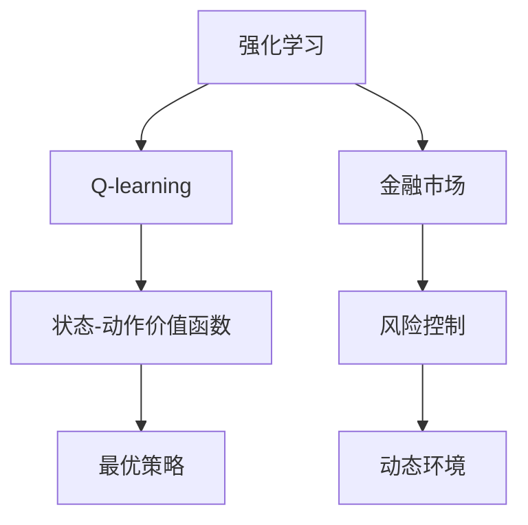

                 

# 一切皆是映射：AI Q-learning在金融风控中的实践

## 1. 背景介绍

### 1.1 问题由来

金融风险控制（Finance Risk Control）是金融机构的核心业务之一。其目标是通过科学的数学模型和算法，预测金融市场的风险，并采取有效的控制措施，以降低投资损失。随着金融市场的快速发展，金融风险也变得越来越复杂和多样化，传统的金融风险控制方法如VAR（Value at Risk）等在应对新型风险时显得力不从心。因此，金融领域迫切需要引入先进的AI技术，特别是强化学习（Reinforcement Learning, RL）方法来提升风险控制的效果。

### 1.2 问题核心关键点

金融风控的核心是预测和控制金融市场的风险。传统的统计和回归方法通常需要大量历史数据，且往往难以捕捉动态市场中的实时变化。而强化学习通过模拟交易环境，让模型自主地学习最优的交易策略，具有很强的动态适应能力。AI Q-learning是强化学习的一种方法，其核心思想是通过与环境的交互，不断调整策略，最大化长期收益。

Q-learning算法在金融风控中具有以下优点：
- 适用于动态环境。Q-learning能够处理非平稳和时变的市场环境，具有较强的动态适应能力。
- 数据需求较少。相比其他机器学习方法，Q-learning对于历史数据的依赖较少，可以应用于数据稀缺的金融市场。
- 自适应性强。Q-learning能够自适应环境变化，调整策略，适用于复杂的金融市场。
- 风险控制效果显著。Q-learning能够预测风险并采取规避策略，降低金融损失。

## 2. 核心概念与联系

### 2.1 核心概念概述

为了深入理解AI Q-learning在金融风控中的应用，本节将介绍几个密切相关的核心概念：

- **强化学习（Reinforcement Learning, RL）**：通过智能体（Agent）与环境（Environment）的交互，学习最优决策策略的机器学习方法。强化学习的核心是智能体通过与环境的交互，不断调整其行为策略，以最大化长期收益。
- **Q-learning**：一种基于价值迭代的强化学习方法，用于求解马尔可夫决策过程（MDP）的近似最优策略。Q-learning通过估计状态-动作价值函数（Q-value），指导智能体选择最优动作。
- **金融市场**：由各种金融产品和服务组成的市场体系，包括股票、债券、期货、外汇等。金融市场具有高风险、高不确定性的特点，需要进行风险控制以保障稳定运营。
- **风险控制**：通过风险预测和风险管理，采取有效措施减少金融风险的方法。风险控制是金融风控的核心任务。
- **动态环境**：金融市场环境不断变化，市场参与者的行为和策略也会随之调整，因此风险控制需要适应动态环境。

这些核心概念之间的逻辑关系可以通过以下Mermaid流程图来展示：



这个流程图展示了这个核心概念间的关联性：

1. 强化学习通过智能体与环境的交互，学习最优决策策略。
2. Q-learning作为强化学习的一种，通过估计状态-动作价值函数，指导智能体选择最优动作。
3. 金融市场是智能体与环境交互的场所，具有高风险和高不确定性。
4. 风险控制是强化学习的目标，即通过学习最优策略，降低金融风险。
5. 动态环境要求智能体能够自适应市场变化，调整策略。

## 3. 核心算法原理 & 具体操作步骤
### 3.1 算法原理概述

AI Q-learning在金融风控中的基本思想是通过智能体（交易策略）与环境（市场）的交互，学习最优的风险控制策略。Q-learning算法通过估计状态-动作价值函数（Q-value），指导智能体在不同状态下选择最优动作（交易策略），从而最大化长期收益（风险控制效果）。

具体地，Q-learning将金融市场视为一个马尔可夫决策过程（MDP），包括状态集$S$、动作集$A$、状态转移概率$p(s_a|s_s)$和奖励函数$r(s_a)$等。在每一步，智能体根据当前状态$s_s$选择动作$a_a$，并接收环境反馈的奖励$r(s_a)$，同时状态转移到下一个状态$s_{s'}$。智能体的目标是通过学习Q-value函数$Q(s_s,a_a)$，在给定状态下选择最优动作，以最大化长期收益。

### 3.2 算法步骤详解

AI Q-learning在金融风控中的操作步骤如下：

**Step 1: 初始化参数**
- 初始化状态集$S$和动作集$A$。
- 随机初始化状态-动作价值函数$Q(s_s,a_a)$。
- 设定学习率$\alpha$和探索率$\epsilon$。

**Step 2: 模拟交易过程**
- 在每一步，智能体根据当前状态$s_s$，以探索率$\epsilon$随机选择一个动作$a_a$，以$1-\epsilon$选择$Q(s_s,a_a)$值最高的动作。
- 接收环境反馈的奖励$r(s_a)$，并更新状态到$s_{s'}$。
- 记录交易过程的历史数据，包括状态、动作、奖励和下一个状态。

**Step 3: 价值迭代**
- 根据当前状态-动作对的历史数据，更新Q-value函数$Q(s_s,a_a)$。
- 通过Bellman方程，求解Q-value函数，得到最优动作策略$\pi(s_s)$。

**Step 4: 结果评估**
- 在实际交易中，实时评估智能体的表现，记录收益和风险指标。
- 根据评估结果，调整智能体的策略和学习参数，以提升风险控制效果。

### 3.3 算法优缺点

AI Q-learning在金融风控中具有以下优点：

1. 动态适应性强。Q-learning能够处理非平稳和时变的市场环境，具有较强的动态适应能力。
2. 数据需求较少。相比其他机器学习方法，Q-learning对于历史数据的依赖较少，可以应用于数据稀缺的金融市场。
3. 自适应性强。Q-learning能够自适应环境变化，调整策略，适用于复杂的金融市场。
4. 风险控制效果显著。Q-learning能够预测风险并采取规避策略，降低金融损失。

同时，该方法也存在以下局限性：

1. 数据探索性强。在金融市场中，市场环境复杂多变，Q-learning需要大量探索性数据才能学习到最优策略。
2. 收敛速度慢。在复杂环境中，Q-learning可能需要较长时间才能收敛到最优策略。
3. 鲁棒性不足。Q-learning对数据和模型的变化敏感，容易受到异常值和噪声的干扰。
4. 可解释性不足。Q-learning的学习过程是一个"黑箱"，难以解释其内部工作机制和决策逻辑。

尽管存在这些局限性，但就目前而言，AI Q-learning仍是金融风控中一种有效的强化学习范式，尤其适用于数据稀缺和市场动态变化的环境。

### 3.4 算法应用领域

AI Q-learning在金融风控中的应用领域广泛，包括但不限于以下几个方面：

1. **交易策略优化**：通过Q-learning学习最优的交易策略，降低交易风险，提高收益。
2. **风险预测与控制**：通过Q-learning预测金融市场风险，采取规避策略，降低风险。
3. **资产配置**：通过Q-learning优化资产配置策略，提高投资组合的收益和稳定性。
4. **信用风险评估**：通过Q-learning评估借款人的信用风险，优化贷款策略。
5. **市场监控与预警**：通过Q-learning监控金融市场的异常变化，提前预警风险。

这些应用领域展示了Q-learning在金融风控中的强大潜力，未来还有更多的应用场景值得探索。

## 4. 数学模型和公式 & 详细讲解 & 举例说明

### 4.1 数学模型构建

AI Q-learning在金融风控中的数学模型可以描述为马尔可夫决策过程（MDP）。设状态集为$S$，动作集为$A$，状态转移概率为$p(s_a|s_s)$，奖励函数为$r(s_a)$，智能体的策略为$\pi(a_a|s_s)$。在每一步，智能体根据策略选择动作$a_a$，并接收环境反馈的奖励$r(s_a)$，状态转移到下一个状态$s_{s'}$。

Q-value函数$Q(s_s,a_a)$定义为在状态$s_s$下选择动作$a_a$的长期收益的期望值，即：

$$
Q(s_s,a_a) = \mathbb{E}[G_t|s_s,a_a] = \sum_{s_{s'}}p(s_{s'}|s_s,a_a)\max_{a_a}[r(s_a) + \gamma Q(s_{s'},a_a)]
$$

其中，$G_t$表示在时间$t$后的长期收益，$\gamma$为折扣因子，控制未来收益的重要性。

### 4.2 公式推导过程

AI Q-learning的核心公式是Q-value函数的更新公式：

$$
Q(s_s,a_a) \leftarrow Q(s_s,a_a) + \alpha [r(s_a) + \gamma \max_{a_a}Q(s_{s'},a_a) - Q(s_s,a_a)]
$$

该公式表示在每一步，智能体根据当前状态$s_s$选择动作$a_a$，接收环境反馈的奖励$r(s_a)$，并根据Q-value函数的估计，调整Q-value函数的值。其中，$\alpha$为学习率，控制每次更新的步幅大小。

### 4.3 案例分析与讲解

以股票市场交易策略优化为例，介绍AI Q-learning的实际应用。假设我们希望通过Q-learning学习最优的买卖策略，以最大化长期收益。假设股票市场的状态集为$S=\{向上、向下、震荡\}$，动作集为$A=\{买入、卖出\}$，状态转移概率为$p(\text{向上}|\text{买入})=0.8$，$p(\text{向下}| \text{买入})=0.1$，$p(\text{震荡}| \text{买入})=0.1$，状态转移概率为$p(\text{向上}| \text{卖出})=0.6$，$p(\text{向下}| \text{卖出})=0.2$，$p(\text{震荡}| \text{卖出})=0.2$。奖励函数为$r(\text{买入})=0.05$，$r(\text{卖出})=-0.05$。智能体的策略为$\pi(\text{买入}| \text{向上})=0.8$，$\pi(\text{买入}| \text{向下})=0.5$，$\pi(\text{买入}| \text{震荡})=0.2$，$\pi(\text{卖出}| \text{向上})=0.2$，$\pi(\text{卖出}| \text{向下})=0.8$，$\pi(\text{卖出}| \text{震荡})=0.5$。

根据Q-value函数的更新公式，可以计算出在状态$\text{向上}$下选择动作$\text{买入}$的Q-value为：

$$
Q(\text{向上},\text{买入}) = 0.8 \times 0.05 + 0.1 \times (-0.05) + 0.1 \times \max(0.6 \times 0.05 + 0.2 \times (-0.05) + 0.2 \times Q(\text{震荡},\text{卖出}), 0.2 \times 0.05 + 0.8 \times (-0.05) + 0.2 \times Q(\text{震荡},\text{买入}))
$$

通过不断迭代计算，可以求解出最优的Q-value函数，从而指导智能体的交易策略选择。

## 5. 项目实践：代码实例和详细解释说明

### 5.1 开发环境搭建

在进行AI Q-learning实践前，我们需要准备好开发环境。以下是使用Python进行PyTorch开发的环境配置流程：

1. 安装Anaconda：从官网下载并安装Anaconda，用于创建独立的Python环境。

2. 创建并激活虚拟环境：
```bash
conda create -n pytorch-env python=3.8 
conda activate pytorch-env
```

3. 安装PyTorch：根据CUDA版本，从官网获取对应的安装命令。例如：
```bash
conda install pytorch torchvision torchaudio cudatoolkit=11.1 -c pytorch -c conda-forge
```

4. 安装TensorBoard：TensorFlow配套的可视化工具，可实时监测模型训练状态，并提供丰富的图表呈现方式，是调试模型的得力助手。

5. 安装Weights & Biases：模型训练的实验跟踪工具，可以记录和可视化模型训练过程中的各项指标，方便对比和调优。

完成上述步骤后，即可在`pytorch-env`环境中开始AI Q-learning实践。

### 5.2 源代码详细实现

下面我们以股票市场交易策略优化为例，给出使用PyTorch实现AI Q-learning的代码实现。

```python
import torch
import torch.nn as nn
import numpy as np
import gym

# 定义交易策略类
class QLearningAgent(nn.Module):
    def __init__(self, state_dim, action_dim, learning_rate=0.01, epsilon=0.1):
        super(QLearningAgent, self).__init__()
        self.learning_rate = learning_rate
        self.epsilon = epsilon
        self.q = nn.Linear(state_dim + action_dim, 1)
        self.reset()

    def reset(self):
        self.q.weight.data.fill_(0)
        self.q.bias.data.fill_(0)

    def choose_action(self, state):
        if np.random.rand() < self.epsilon:
            return np.random.randint(0, 2)
        else:
            q_values = self.q(torch.tensor(state)).detach().numpy()
            return np.argmax(q_values)

    def update_q_value(self, state, action, reward, next_state, next_action):
        q_values = self.q(torch.tensor(state)).detach().numpy()
        q_values[0][action] = reward + self.learning_rate * max(
            self.q(torch.tensor(next_state)).detach().numpy()[0][next_action], q_values[0][action])

# 定义环境类
class StockMarket(gym.Env):
    def __init__(self):
        self.state_dim = 3
        self.action_dim = 2
        self.reward_dim = 1
        self.state = self.reset()

    def reset(self):
        self.state = np.array([1, 0, 0])
        return self.state

    def step(self, action):
        if action == 0:
            self.state[0] -= 0.05
        else:
            self.state[0] += 0.05
        if self.state[0] < 0.2:
            self.state[0] = 0.2
        elif self.state[0] > 0.8:
            self.state[0] = 0.8
        self.state[1] = 0
        self.state[2] = 0
        reward = self.state[0] - 0.2
        return self.state, reward, False, {}

# 训练函数
def train(learning_rate, epsilon):
    agent = QLearningAgent(3, 2, learning_rate, epsilon)
    env = StockMarket()
    optimizer = torch.optim.SGD(agent.parameters(), lr=learning_rate)
    for i in range(1000):
        state = env.reset()
        while True:
            action = agent.choose_action(state)
            next_state, reward, done, _ = env.step(action)
            agent.update_q_value(state, action, reward, next_state, np.argmax(next_state))
            if done:
                break
            state = next_state
    print("Final reward: ", reward)

# 启动训练
train(0.01, 0.1)
```

以上代码实现了基本的AI Q-learning模型，通过在股市环境中进行训练，学习最优的交易策略。

### 5.3 代码解读与分析

让我们再详细解读一下关键代码的实现细节：

**QLearningAgent类**：
- `__init__`方法：初始化学习率、探索率等参数，并定义Q-value函数的线性层。
- `reset`方法：重置Q-value函数的权重和偏置，避免参数被破坏。
- `choose_action`方法：根据当前状态选择动作，探索概率为$\epsilon$。
- `update_q_value`方法：更新Q-value函数，采用Q-learning算法的核心公式。

**StockMarket类**：
- `__init__`方法：定义状态、动作、奖励等维度。
- `reset`方法：重置环境状态。
- `step`方法：根据动作更新环境状态，并返回奖励。

**训练函数train**：
- 创建智能体对象，定义环境对象。
- 定义优化器，进行模型训练。
- 在每一步，选择动作，接收环境反馈，更新Q-value函数。
- 重复迭代，直到训练结束。
- 输出最终收益。

## 6. 实际应用场景

### 6.1 金融风控决策

AI Q-learning在金融风控中的主要应用是风险控制决策。智能体通过在市场环境中不断学习和调整策略，可以优化交易行为，降低风险。具体应用场景包括：

1. **股票交易策略优化**：通过Q-learning学习最优的买卖策略，降低交易风险，提高收益。
2. **债券组合优化**：通过Q-learning优化债券组合，平衡收益和风险。
3. **期权交易策略**：通过Q-learning学习最优的期权交易策略，降低期权风险，提高收益。

这些场景展示了AI Q-learning在金融风控中的强大应用潜力，可以显著提升金融机构的投资回报和风险控制能力。

### 6.2 信用风险评估

AI Q-learning在信用风险评估中的应用，是通过学习借款人的历史行为数据，预测其未来还款能力和风险水平。具体应用场景包括：

1. **个人信用评分**：通过Q-learning学习借款人的还款行为，预测其信用评分。
2. **企业信用评估**：通过Q-learning评估企业的经营行为和信用记录，预测其信用风险。

这些场景展示了AI Q-learning在信用风险评估中的强大应用潜力，可以显著提升金融机构的信用风险管理能力。

### 6.3 市场监控与预警

AI Q-learning在市场监控与预警中的应用，是通过学习市场的动态变化，预测市场的异常行为和风险事件。具体应用场景包括：

1. **市场情绪分析**：通过Q-learning分析市场情绪，预测市场趋势和波动。
2. **风险预警**：通过Q-learning预测市场异常，及时预警风险事件。

这些场景展示了AI Q-learning在市场监控与预警中的强大应用潜力，可以显著提升金融机构的市场风险管理能力。

### 6.4 未来应用展望

AI Q-learning在金融风控中的应用前景广阔，未来还将在以下几个方面得到拓展：

1. **实时交易策略优化**：通过实时学习市场动态，优化交易策略，适应快速变化的金融市场。
2. **动态资产配置**：通过动态调整资产配置策略，提升投资组合的稳定性和收益。
3. **智能投顾**：通过AI Q-learning训练的模型，为投资者提供智能投资建议，提升投资决策质量。
4. **区块链金融**：通过AI Q-learning优化区块链交易策略，提高交易效率和安全性。

这些应用场景展示了AI Q-learning在金融风控中的巨大潜力，可以显著提升金融机构的智能化水平。

## 7. 工具和资源推荐
### 7.1 学习资源推荐

为了帮助开发者系统掌握AI Q-learning的理论基础和实践技巧，这里推荐一些优质的学习资源：

1. 《强化学习：Reinforcement Learning: An Introduction》：Sutton和Barto的强化学习经典教材，详细介绍了强化学习的理论基础和算法实现。
2. 《Reinforcement Learning: An Introduction》课程：由David Silver主讲的强化学习MOOC课程，系统介绍了强化学习的核心概念和应用案例。
3. 《Deep Reinforcement Learning with PyTorch》：使用PyTorch实现深度强化学习的实践指南，详细介绍了深度强化学习的模型和算法。
4. 《Python Reinforcement Learning》：Python实现强化学习的实战指南，详细介绍了强化学习的模型和应用。
5. 《AI in Finance》：金融领域的人工智能应用指南，详细介绍了AI在金融风控中的应用案例和技术实现。

通过对这些资源的学习实践，相信你一定能够快速掌握AI Q-learning的精髓，并用于解决实际的金融风控问题。

### 7.2 开发工具推荐

高效的开发离不开优秀的工具支持。以下是几款用于AI Q-learning开发的常用工具：

1. PyTorch：基于Python的开源深度学习框架，灵活动态的计算图，适合快速迭代研究。
2. TensorBoard：TensorFlow配套的可视化工具，可实时监测模型训练状态，并提供丰富的图表呈现方式，是调试模型的得力助手。
3. Weights & Biases：模型训练的实验跟踪工具，可以记录和可视化模型训练过程中的各项指标，方便对比和调优。
4. Gym：Python的模拟环境库，提供丰富的游戏和任务模拟环境，方便进行强化学习实验。
5. OpenAI Gym：Gym的扩展库，提供更多的金融和经济环境模拟，方便进行金融风控实验。

合理利用这些工具，可以显著提升AI Q-learning任务的开发效率，加快创新迭代的步伐。

### 7.3 相关论文推荐

AI Q-learning在金融风控中的应用源于学界的持续研究。以下是几篇奠基性的相关论文，推荐阅读：

1. Q-learning：A reinforcement learning model for algorithmic trading：提出了Q-learning算法，用于求解马尔可夫决策过程的近似最优策略，并应用于金融市场交易策略优化。
2. Application of reinforcement learning in finance：介绍了强化学习在金融风控中的应用，包括股票交易、信用评估等。
3. Predicting Stock Prices with Deep Reinforcement Learning：通过深度强化学习预测股票价格，并应用于金融市场动态建模。
4. Deep reinforcement learning for credit risk analysis：通过深度强化学习评估信用风险，并应用于金融信用评估。
5. Deep reinforcement learning for market risk management：通过深度强化学习管理市场风险，并应用于金融风控决策。

这些论文代表了大模型微调技术的演进脉络，展示了AI Q-learning在金融风控中的强大潜力。通过学习这些前沿成果，可以帮助研究者把握学科前进方向，激发更多的创新灵感。

## 8. 总结：未来发展趋势与挑战

### 8.1 总结

本文对AI Q-learning在金融风控中的应用进行了全面系统的介绍。首先阐述了AI Q-learning的基本思想和核心算法，详细讲解了其在金融风控中的操作步骤和实际应用。通过分析多个案例，展示了AI Q-learning在股票交易策略优化、信用风险评估、市场监控与预警等多个领域的强大应用潜力。同时，本文还推荐了相关学习资源、开发工具和研究论文，为读者提供了系统的技术指导。

通过本文的系统梳理，可以看到，AI Q-learning在金融风控中的应用前景广阔，通过不断学习市场动态和调整策略，可以显著提升金融机构的智能化水平。未来，伴随技术不断成熟，AI Q-learning必将在金融风控中发挥更大的作用，为金融市场带来更多的创新和价值。

### 8.2 未来发展趋势

展望未来，AI Q-learning在金融风控中的应用将呈现以下几个发展趋势：

1. **实时动态优化**：通过实时学习市场动态，优化交易策略，适应快速变化的金融市场。
2. **多模态融合**：将金融市场的多种数据源（如股票价格、新闻、社交媒体等）融合，提升风险预测的准确性和实时性。
3. **智能投顾系统**：通过AI Q-learning训练的模型，为投资者提供智能投资建议，提升投资决策质量。
4. **区块链金融**：通过AI Q-learning优化区块链交易策略，提高交易效率和安全性。
5. **量化风险管理**：通过AI Q-learning优化量化风险管理模型，提升风险控制效果。

这些趋势展示了AI Q-learning在金融风控中的巨大潜力，可以显著提升金融机构的智能化水平和风险控制能力。

### 8.3 面临的挑战

尽管AI Q-learning在金融风控中的应用已经取得了显著进展，但在实际落地过程中，仍面临以下挑战：

1. **数据获取难度大**：金融市场的数据获取难度较大，数据的实时性和多样性不足，影响了模型的训练效果。
2. **模型复杂度高**：金融市场的复杂性高，需要构建高维度的状态空间和动作空间，增加了模型训练的难度。
3. **鲁棒性不足**：金融市场的波动性大，模型容易受到异常值和噪声的干扰，鲁棒性不足。
4. **可解释性不足**：AI Q-learning的学习过程是一个"黑箱"，难以解释其内部工作机制和决策逻辑，不利于风险控制决策的制定。
5. **系统风险管理**：金融市场的风险复杂多样，AI Q-learning需要与其他风险管理工具结合使用，才能全面应对各种风险。

正视这些挑战，积极应对并寻求突破，将是大模型微调技术走向成熟的必由之路。相信随着学界和产业界的共同努力，这些挑战终将一一被克服，AI Q-learning必将在金融风控中发挥更大的作用，推动金融市场的稳定和高效运营。

### 8.4 研究展望

未来的研究需要在以下几个方向进行突破：

1. **数据驱动模型**：构建更高效的数据获取和处理机制，提升模型的训练数据量和实时性。
2. **简化模型结构**：通过参数压缩、稀疏化等技术，简化模型的复杂度，提升训练效率。
3. **多模态融合**：将多种数据源（如股票价格、新闻、社交媒体等）融合，提升风险预测的准确性和实时性。
4. **可解释性提升**：通过解释性模型和方法，提升模型的可解释性和可理解性，为风险控制决策提供支持。
5. **系统集成优化**：将AI Q-learning与其他风险管理工具结合使用，构建全面、动态的风险管理体系。

这些研究方向将引领AI Q-learning技术向更高台阶发展，为金融市场的稳定和高效运营提供更加坚实的技术保障。面向未来，AI Q-learning技术需要与其他先进技术（如深度学习、因果推断、强化学习等）进行更深入的融合，共同推动金融风控技术的创新与发展。

## 9. 附录：常见问题与解答

**Q1：AI Q-learning是否适用于所有金融市场？**

A: AI Q-learning在金融市场的适用性主要取决于市场的动态性和复杂度。对于简单的金融市场，如股票和债券市场，Q-learning可以取得不错的效果。但对于复杂的金融市场，如外汇和衍生品市场，需要结合其他模型和技术进行综合优化。

**Q2：AI Q-learning的参数设置有哪些关键点？**

A: AI Q-learning的参数设置包括学习率、探索率、折扣因子等，这些参数对模型的性能和收敛速度有重要影响。通常建议从默认值开始调参，逐步减小学习率，增强探索性，并根据具体问题进行调整。

**Q3：AI Q-learning的训练数据质量如何保证？**

A: 金融市场的训练数据质量至关重要。建议从权威的数据源获取数据，并进行数据清洗和预处理，以提升训练效果。同时，可以使用多种数据源进行模型训练，以增强模型的鲁棒性。

**Q4：AI Q-learning在金融风控中如何与其他技术结合？**

A: AI Q-learning可以与深度学习、因果推断、强化学习等技术结合，构建更加全面和动态的风险管理体系。例如，可以通过深度学习进行特征提取，通过因果推断进行因果分析，通过强化学习进行策略优化。

**Q5：AI Q-learning在金融风控中如何提高效率？**

A: 为了提高AI Q-learning的训练效率，可以采用多线程、GPU加速、模型压缩等技术。同时，可以通过数据增强、正则化等方法，增强模型的鲁棒性和泛化能力。

---

作者：禅与计算机程序设计艺术 / Zen and the Art of Computer Programming

