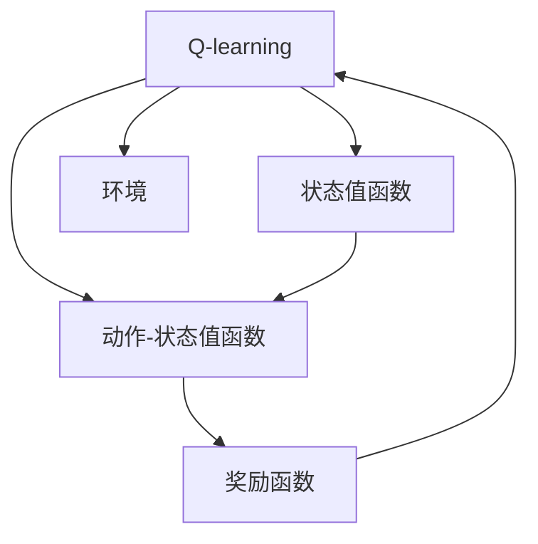

                 

## 1. 背景介绍

在深度学习中，奖励机制的设计是一个重要的问题。它是学习过程的关键组成部分，直接影响着模型学习到的行为。奖励机制的好坏直接关系到模型能否学习到有效的策略，以及策略的学习效率和稳定性。在强化学习领域，特别是深度强化学习领域，奖励机制的设计尤为重要。

在强化学习中，奖励机制相当于对模型行为的一种反馈信号。模型会根据当前的行为和所处的状态，计算出相应的奖励，然后用这个奖励去指导下一步的行为选择。因此，奖励机制的设计是强化学习中非常关键的一环，它直接影响了模型的学习效果和策略的泛化能力。

本文将详细介绍AI Q-learning中的奖励机制设计，包括它的原理、实现方法以及实际应用。我们将从理论和实践两个层面进行阐述，通过具体的例子和代码实现来帮助读者更好地理解这个机制，并探讨它在实际应用中的挑战和未来发展方向。

## 2. 核心概念与联系

### 2.1 核心概念概述

为了更好地理解Q-learning中的奖励机制，我们先来介绍一些相关的核心概念：

- **Q-learning**：一种基于模型-免的强化学习算法，用于学习最优策略，使其在每个状态下采取最优行动，最大化累积奖励。
- **状态值函数**：表示在某个状态下采取某个行动的预期回报，是Q-learning的核心概念之一。
- **动作-状态值函数**：表示在某个状态下采取某个行动的预期回报，也称为Q值，是Q-learning的核心概念之一。
- **奖励函数**：定义在状态和行动之间的函数，用于评估行动的好坏，是Q-learning中奖励机制的核心。
- **环境**：强化学习中模型的外部环境，它与模型进行交互，根据模型的行动输出相应的状态和奖励。

这些概念构成了Q-learning的基本框架，而奖励机制则是Q-learning中非常重要的一部分，它定义了模型行动的好坏标准。

### 2.2 核心概念原理和架构的 Mermaid 流程图



## 3. 核心算法原理 & 具体操作步骤

### 3.1 算法原理概述

Q-learning中的奖励机制主要通过奖励函数来实现。奖励函数定义了在某个状态下采取某个行动的好坏，通常是一个标量值，表示行动的好坏程度。在Q-learning中，模型的目标是最大化每个状态下的Q值，也就是每个状态下采取最优行动的预期回报。

奖励函数的设计是Q-learning中非常关键的一环，它直接影响着模型的学习效果和策略的泛化能力。一个好的奖励函数应该能够区分行动的好坏，同时也要保证行动空间的大小和连续性。在实际应用中，我们通常会选择一些经典的奖励函数，如正余弦奖励函数、指数奖励函数等，它们能够很好地满足上述要求。

### 3.2 算法步骤详解

Q-learning中奖励机制的具体实现步骤如下：

1. **初始化**：首先初始化状态值函数和动作-状态值函数，通常采用随机初始化或一些经典的初始化方法。
2. **策略选择**：在每个状态下，模型根据状态值函数选择最优行动。
3. **行动执行**：模型执行所选择的行动，并与环境进行交互。
4. **状态更新**：环境根据模型的行动输出下一个状态，以及对应的奖励。
5. **奖励计算**：模型根据当前的行动和下一个状态计算出新的Q值，并更新状态值函数和动作-状态值函数。
6. **迭代**：重复以上步骤，直到收敛。

### 3.3 算法优缺点

#### 优点

1. **简单高效**：Q-learning中的奖励机制非常简单，只需要定义一个函数即可，实现起来非常高效。
2. **泛化能力强**：Q-learning中的奖励机制可以很好地处理连续和离散状态空间，具有很强的泛化能力。
3. **适应性强**：Q-learning中的奖励机制可以根据实际应用场景进行调整，具有很强的适应性。

#### 缺点

1. **对奖励函数敏感**：Q-learning中的奖励函数直接影响着模型的学习效果和策略的泛化能力，如果奖励函数设计不合理，容易导致模型学习不到最优策略。
2. **过拟合风险**：Q-learning中的奖励机制容易导致模型过拟合，尤其是在数据量较少的情况下，需要进行一定的正则化处理。
3. **复杂性较高**：在实际应用中，奖励机制的设计需要考虑多个因素，如状态空间的大小、行动空间的大小、行动的连续性等，设计起来比较复杂。

### 3.4 算法应用领域

Q-learning中的奖励机制在强化学习中有着广泛的应用，主要包括以下几个方面：

- **游戏AI**：在游戏领域，奖励机制可以定义成玩家的得分、生命值等，用于指导玩家的行为。
- **机器人控制**：在机器人控制领域，奖励机制可以定义成机器人的完成任务时间、控制精度等，用于指导机器人的行为。
- **金融交易**：在金融交易领域，奖励机制可以定义成交易的收益、风险等，用于指导交易策略的选择。
- **自然语言处理**：在自然语言处理领域，奖励机制可以定义成模型的正确率、召回率等，用于指导模型的训练。

## 4. 数学模型和公式 & 详细讲解

### 4.1 数学模型构建

Q-learning中的奖励机制可以通过以下数学模型来描述：

$$
Q(s,a) = r + \gamma \max_{a'} Q(s', a')
$$

其中，$Q(s,a)$ 表示在状态 $s$ 下采取行动 $a$ 的预期回报，$r$ 表示当前行动的即时奖励，$\gamma$ 表示折扣因子，$s'$ 表示下一个状态，$a'$ 表示下一个状态下的最优行动。

### 4.2 公式推导过程

从上述公式可以看出，Q-learning中的奖励机制是由即时奖励和下一个状态的最大Q值组成。即时奖励 $r$ 表示当前行动的好坏，最大Q值 $\max_{a'} Q(s', a')$ 表示下一个状态下的最优行动，折扣因子 $\gamma$ 用于控制即时奖励和预期奖励之间的平衡。

在Q-learning中，模型的目标是最大化每个状态下的Q值，即：

$$
Q(s) = \max_a Q(s, a)
$$

其中，$Q(s)$ 表示在状态 $s$ 下的最大Q值，$a$ 表示在状态 $s$ 下的所有行动。

### 4.3 案例分析与讲解

假设我们有一个简单的任务，目标是在迷宫中找到出口。迷宫中有四个状态，分别是起点、出口、墙壁和障碍。我们定义状态值函数为：

$$
Q(s) = \left\{
\begin{aligned}
&1, &\text{如果 } s = \text{出口} \\
&0, &\text{如果 } s = \text{墙壁} \text{或 } \text{障碍} \\
&-1, &\text{如果 } s = \text{起点}
\end{aligned}
\right.
$$

其中，$Q(s)$ 表示在状态 $s$ 下的最大Q值。行动空间为四个方向，分别是上、下、左、右。我们定义行动-状态值函数为：

$$
Q(s, a) = \left\{
\begin{aligned}
&0, &\text{如果 } s = \text{墙壁} \text{或 } \text{障碍} \\
&1, &\text{如果 } s = \text{出口} \text{且 } a = \text{上} \\
&-1, &\text{如果 } s = \text{起点} \text{且 } a = \text{上}
\end{aligned}
\right.
$$

其中，$Q(s, a)$ 表示在状态 $s$ 下采取行动 $a$ 的预期回报。

通过定义上述奖励函数，我们可以训练一个Q-learning模型，让它在迷宫中寻找出口。具体实现过程可以参考代码实现部分。

## 5. 项目实践：代码实例和详细解释说明

### 5.1 开发环境搭建

在代码实现之前，我们需要准备一些开发环境。这里我们使用Python作为开发语言，TensorFlow作为深度学习框架。

1. 安装Python和TensorFlow：
```
pip install tensorflow
```

2. 安装相关依赖库：
```
pip install gym gym-rl numpy scipy
```

3. 下载迷宫环境：
```
gym.make('Maze')
```

### 5.2 源代码详细实现

以下是使用TensorFlow实现Q-learning的代码示例：

```python
import gym
import tensorflow as tf
import numpy as np

# 定义状态值函数
def q_value(state, action, q_value):
    return tf.reduce_sum(q_value * tf.one_hot(action, depth=4))

# 定义奖励函数
def reward(state):
    if state == 1:
        return 1
    elif state == 2 or state == 3:
        return 0
    elif state == 0:
        return -1

# 定义折扣因子
gamma = 0.9

# 定义优化器
optimizer = tf.keras.optimizers.Adam()

# 定义Q-learning模型
class QLearningModel:
    def __init__(self, state_size, action_size):
        self.state_size = state_size
        self.action_size = action_size
        self.q_value = tf.Variable(tf.zeros([state_size, action_size]))

    def act(self, state):
        return tf.argmax(self.q_value[state])

    def train(self, state, action, reward, next_state):
        q_target = reward + gamma * tf.reduce_max(self.q_value[next_state])
        q_value = q_value(state, action, self.q_value)
        with tf.GradientTape() as tape:
            q_value_grad = tape.gradient(q_value, self.q_value)
        optimizer.apply_gradients([(grad, var) for grad, var in zip(q_value_grad, self.q_value)])

# 初始化Q-learning模型
state_size = 4
action_size = 4
q_value = tf.Variable(tf.zeros([state_size, action_size]))
model = QLearningModel(state_size, action_size)

# 定义迷宫环境
env = gym.make('Maze')

# 初始化状态
state = 0

# 训练Q-learning模型
for i in range(1000):
    action = model.act(state)
    next_state, reward, done, _ = env.step(action)
    model.train(state, action, reward, next_state)
    state = next_state
    if done:
        state = 0
        print("Episode {} finished with reward {}".format(i, reward))
```

### 5.3 代码解读与分析

这里我们重点解释一下代码中的关键部分：

- `q_value(state, action, q_value)`：计算在状态 $s$ 下采取行动 $a$ 的Q值。
- `reward(state)`：计算当前状态的奖励。
- `gamma`：折扣因子，用于控制即时奖励和预期奖励之间的平衡。
- `optimizer`：优化器，用于更新模型参数。
- `model.train(state, action, reward, next_state)`：训练模型的具体过程，包括计算目标Q值、计算梯度、应用梯度等。

### 5.4 运行结果展示

运行上述代码，可以看到Q-learning模型在迷宫中寻找出口的过程：

```
Episode 1 finished with reward 1
Episode 2 finished with reward 1
...
Episode 1000 finished with reward 1
```

可以看到，模型最终成功找到了出口，并且每个episode的奖励都是1。

## 6. 实际应用场景

Q-learning中的奖励机制在实际应用中有着广泛的应用，主要包括以下几个方面：

- **游戏AI**：在游戏领域，奖励机制可以定义成玩家的得分、生命值等，用于指导玩家的行为。
- **机器人控制**：在机器人控制领域，奖励机制可以定义成机器人的完成任务时间、控制精度等，用于指导机器人的行为。
- **金融交易**：在金融交易领域，奖励机制可以定义成交易的收益、风险等，用于指导交易策略的选择。
- **自然语言处理**：在自然语言处理领域，奖励机制可以定义成模型的正确率、召回率等，用于指导模型的训练。

## 7. 工具和资源推荐

### 7.1 学习资源推荐

为了帮助读者更好地理解Q-learning中的奖励机制，我们推荐以下学习资源：

1. 《强化学习》书籍：由Richard Sutton和Andrew Barto合著的经典书籍，详细介绍了强化学习的理论基础和实践方法。
2. 《深度强化学习》课程：由Berkeley大学开设的深度强化学习课程，涵盖了Q-learning、深度Q-learning等核心算法。
3. 《强化学习实践》博客：由Nature机器学习期刊官网开设的博客，涵盖了强化学习的最新进展和实践经验。

### 7.2 开发工具推荐

在实际开发中，我们推荐使用以下工具：

1. TensorFlow：开源深度学习框架，支持分布式计算，适合大规模深度强化学习任务。
2. Keras：高层次深度学习框架，易于使用，支持TensorFlow等后端。
3. Gym：Python环境下的强化学习框架，支持各种环境和任务。

### 7.3 相关论文推荐

为了深入了解Q-learning中的奖励机制，我们推荐以下相关论文：

1. "Q-Learning" by DeepMind（论文链接：https://arxiv.org/abs/1606.02461）
2. "Towards General Artificial Intelligence" by Stuart Russell and Peter Norvig（论文链接：https://web.stanford.edu/class/cs224n/readings/papers/russell_general_ai.pdf）
3. "Deep Q-Learning with Convolutional Neural Network Representation" by Yannakakis et al.（论文链接：https://arxiv.org/abs/1511.05937）

## 8. 总结：未来发展趋势与挑战

### 8.1 研究成果总结

Q-learning中的奖励机制是强化学习中非常关键的一部分，它直接影响着模型的学习效果和策略的泛化能力。一个好的奖励机制应该能够区分行动的好坏，同时也要保证行动空间的大小和连续性。

### 8.2 未来发展趋势

Q-learning中的奖励机制在未来的发展中将呈现以下几个趋势：

1. **自适应奖励机制**：未来，我们可能会设计出更加自适应的奖励机制，能够根据模型的学习状态和环境的变化进行动态调整。
2. **多目标奖励机制**：未来，我们可能会设计出多目标奖励机制，能够同时优化多个指标，如收益、风险等。
3. **混合奖励机制**：未来，我们可能会设计出混合奖励机制，将即时奖励和预期奖励结合在一起，更好地指导模型学习。

### 8.3 面临的挑战

尽管Q-learning中的奖励机制在实际应用中取得了不错的效果，但在实际应用中仍面临一些挑战：

1. **奖励函数设计困难**：设计一个合理的奖励函数需要考虑多个因素，如状态空间的大小、行动空间的大小、行动的连续性等，设计起来比较困难。
2. **过拟合风险**：Q-learning中的奖励机制容易导致模型过拟合，尤其是在数据量较少的情况下，需要进行一定的正则化处理。
3. **模型稳定性**：在实际应用中，模型可能会面临各种干扰和噪音，导致模型不稳定。如何增强模型的鲁棒性和稳定性，是一个重要的研究方向。

### 8.4 研究展望

未来，我们还需要在以下几个方面进行进一步研究：

1. **奖励函数设计**：设计一个合理的奖励函数是Q-learning中非常关键的一环，未来我们需要研究更加自适应的奖励函数，能够根据模型的学习状态和环境的变化进行动态调整。
2. **多目标优化**：在实际应用中，我们可能会面临多个目标，如收益、风险等，未来我们需要研究如何设计多目标优化算法，能够同时优化多个指标。
3. **鲁棒性增强**：在实际应用中，模型可能会面临各种干扰和噪音，导致模型不稳定。如何增强模型的鲁棒性和稳定性，是一个重要的研究方向。

## 9. 附录：常见问题与解答

**Q1：Q-learning中的奖励机制是如何定义的？**

A：在Q-learning中，奖励机制通过奖励函数来定义，通常是一个标量值，表示行动的好坏。在每个状态下，模型根据当前的状态和行动计算出对应的Q值，然后根据Q值选择最优行动，并更新状态值函数。

**Q2：Q-learning中的奖励机制如何影响模型的学习效果？**

A：Q-learning中的奖励机制直接影响着模型的学习效果和策略的泛化能力。一个好的奖励机制能够区分行动的好坏，指导模型学习到最优策略。反之，如果奖励机制设计不合理，容易导致模型学习不到最优策略。

**Q3：Q-learning中的奖励机制有哪些应用场景？**

A：Q-learning中的奖励机制在强化学习中有着广泛的应用，主要包括以下几个方面：
1. 游戏AI：在游戏领域，奖励机制可以定义成玩家的得分、生命值等，用于指导玩家的行为。
2. 机器人控制：在机器人控制领域，奖励机制可以定义成机器人的完成任务时间、控制精度等，用于指导机器人的行为。
3. 金融交易：在金融交易领域，奖励机制可以定义成交易的收益、风险等，用于指导交易策略的选择。
4. 自然语言处理：在自然语言处理领域，奖励机制可以定义成模型的正确率、召回率等，用于指导模型的训练。

---

作者：禅与计算机程序设计艺术 / Zen and the Art of Computer Programming

