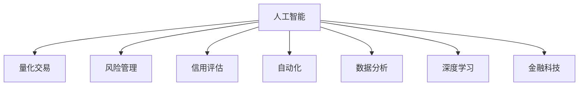

                 

# 一切皆是映射：AI在金融领域的应用探究

> 关键词：AI, 金融, 量化交易, 风险管理, 信用评估, 自动化, 数据分析, 深度学习

## 1. 背景介绍

### 1.1 问题由来

金融行业一直是人工智能应用的先驱和热点领域。近年来，随着大数据、云计算和人工智能技术的迅猛发展，金融机构纷纷引入AI技术，推动业务创新和风险控制。在金融领域，AI的应用不仅包括传统意义上的金融科技(Fintech)，如移动支付、网上银行等，还涵盖更广泛的金融服务和治理。

以量化交易为例，通过AI技术，算法交易系统能够在极短时间内处理海量交易数据，实时生成策略并进行高频交易，显著提高了交易效率和收益。而在风险管理领域，通过数据分析和机器学习，金融机构能够更准确地评估和预测风险，构建更为稳健的风险管理体系。在信用评估方面，AI模型可以处理复杂非结构化数据，提高评估的准确性和自动化水平。

### 1.2 问题核心关键点

金融领域的应用场景多样，涉及的数据量和复杂度也远超其他行业。如何高效利用AI技术，提高金融决策的精准性和自动化水平，是当前AI金融研究的核心问题。主要包括以下几个关键点：

1. 数据驱动决策：金融决策高度依赖于数据，通过AI技术可以更好地处理、分析和利用海量数据，为决策提供支撑。
2. 实时性要求：金融市场瞬息万变，AI系统需要具备实时处理和响应能力，以快速捕捉市场机会和风险。
3. 复杂性处理：金融市场存在复杂的非线性关系和噪声，AI模型需要具备较强的鲁棒性和泛化能力，以应对各种异常情况。
4. 风险控制：金融活动存在高风险，AI系统需具备预测和监控风险的能力，构建安全的金融体系。
5. 人机协同：AI与人工专家协同工作，实现高效、可靠且具有可解释性的金融决策。

## 2. 核心概念与联系

### 2.1 核心概念概述

为更好地理解AI在金融领域的应用，本节将介绍几个密切相关的核心概念：

- **人工智能(AI)**：指通过模拟、延伸和扩展人的智能活动，实现信息处理、智能决策和自动化执行的技术。
- **量化交易(Quantitative Trading)**：指基于数据和数学模型进行自动化交易决策，以量化方法替代传统的主观决策。
- **风险管理(Risk Management)**：指通过分析、评估和监控风险，采取有效措施降低或规避风险，确保金融体系稳定运行。
- **信用评估(Credit Scoring)**：指通过分析个人或企业的信用记录、财务状况等数据，评估其信用等级和还款能力。
- **自动化(Automation)**：指通过程序、算法等方式实现事务自动化处理，提高效率和准确性。
- **数据分析(Data Analytics)**：指通过数据挖掘、统计分析等方法，提取和利用数据中的价值和知识。
- **深度学习(Deep Learning)**：指利用多层神经网络进行复杂数据分析和模型训练，以提取数据中的高层次特征和模式。
- **金融科技(Fintech)**：指将科技手段应用于金融领域，提升金融服务效率和创新性。

这些核心概念之间的逻辑关系可以通过以下Mermaid流程图来展示：



这个流程图展示出AI技术在金融领域的多种应用场景，以及各应用场景间的相互联系。通过深入理解这些概念，我们可以更好地把握AI在金融行业中的价值和潜力。

## 3. 核心算法原理 & 具体操作步骤
### 3.1 算法原理概述

在金融领域，AI的应用涉及多种算法和技术，以下将详细介绍几个核心算法的原理：

#### 3.1.1 量化交易算法

量化交易算法主要分为三大类：统计套利、计量套利和机器学习套利。

**统计套利**：基于历史数据，通过统计方法构建策略，捕捉市场中的套利机会。例如，利用时间序列的均值回归、协整关系等建立交易策略。

**计量套利**：利用计量经济学模型，建立基于统计推断的交易策略。例如，基于随机过程、时间序列等建模方法，预测市场价格变化。

**机器学习套利**：通过训练机器学习模型，挖掘市场中的模式和规律，构建更为复杂的交易策略。例如，基于深度神经网络，构建多因子模型，预测股票价格变化。

#### 3.1.2 风险管理算法

风险管理算法主要包括两类：基于模型的风险管理和基于数据的风险管理。

**基于模型的风险管理**：通过数学模型对金融产品的风险进行建模，预测未来风险水平。例如，利用蒙特卡罗模拟、VaR模型等方法，评估资产组合的风险敞口。

**基于数据的风险管理**：通过分析历史数据和市场信息，直接识别和评估风险。例如，利用机器学习模型，识别潜在的信用风险和市场风险。

#### 3.1.3 信用评估算法

信用评估算法主要基于多变量统计模型和机器学习模型。

**多变量统计模型**：例如Logistic回归、判别分析等，通过分析借款人的财务状况、历史还款记录等，预测其信用等级。

**机器学习模型**：例如随机森林、深度学习等，通过分析复杂非结构化数据，如社交媒体评论、网络行为等，综合评估信用风险。

#### 3.1.4 数据分析算法

数据分析算法主要包括统计分析和机器学习分析。

**统计分析**：例如回归分析、时间序列分析等，通过数据挖掘和分析，提取特征和规律。

**机器学习分析**：例如聚类分析、关联规则挖掘等，通过构建模型，发现数据间的潜在关联和模式。

#### 3.1.5 深度学习算法

深度学习算法在金融领域的应用主要集中在图像识别、自然语言处理和推荐系统等方面。

**图像识别**：例如利用卷积神经网络(CNN)，识别交易图表中的趋势和模式。

**自然语言处理**：例如利用自然语言处理技术，分析新闻、公告等非结构化文本，预测市场情绪。

**推荐系统**：例如利用深度神经网络，构建推荐模型，为用户推荐个性化的金融产品。

### 3.2 算法步骤详解

以下以量化交易算法为例，详细讲解AI在金融领域的具体操作步骤：

#### 3.2.1 数据收集与预处理

**数据收集**：收集市场交易数据、财务报表、新闻公告、社交媒体信息等。数据来源包括公开的金融市场数据、公司年报、新闻网站、社交媒体平台等。

**数据预处理**：对数据进行清洗、去重、归一化等处理，去除噪声和异常值，转换为模型可以处理的格式。例如，将文本数据转换为数值特征，对时间序列数据进行差分处理。

#### 3.2.2 特征工程

**特征选择**：选择与交易策略相关的特征，例如价格变化、成交量、技术指标、财务指标等。

**特征构建**：通过统计分析、时序分析等方法，构造新的特征，例如移动平均线、RSI指标等。

#### 3.2.3 模型训练

**模型选择**：选择合适的量化交易模型，例如线性回归、支持向量机、随机森林、神经网络等。

**模型训练**：利用历史数据，对模型进行训练和优化。例如，利用梯度下降等优化算法，调整模型参数。

#### 3.2.4 模型评估与回测

**模型评估**：利用回测数据，评估模型的交易效果。例如，计算模型在不同回测时间段的收益率、波动率等指标。

**策略优化**：根据评估结果，优化模型参数，提高模型性能。例如，调整交易频率、仓位大小、风险控制等策略。

#### 3.2.5 实时交易

**实时数据采集**：实时获取市场数据和交易信号。例如，通过API接口，从交易所、数据提供商等获取最新的股票价格、成交量和财务数据。

**交易执行**：根据模型生成的交易信号，自动执行交易操作。例如，通过算法交易系统，自动下单和撤单。

#### 3.2.6 风险监控

**风险监测**：实时监控市场风险和交易风险。例如，利用VaR模型，预测交易策略的风险敞口。

**风险控制**：根据风险监测结果，采取相应的风险控制措施。例如，设置止损点、调整仓位等。

### 3.3 算法优缺点

量化交易算法的优点包括：

- **效率高**：利用算法进行自动交易，大幅提高交易效率和响应速度。
- **客观性**：算法决策不受情绪和主观判断的影响，提高交易的客观性和稳定性。
- **容量大**：算法交易可以处理海量数据，捕捉高频交易机会。

量化交易算法的缺点包括：

- **模型复杂**：量化交易模型较为复杂，需要较高的技术水平和专业知识。
- **过度拟合**：模型容易过拟合历史数据，导致交易策略在实际市场中的表现不佳。
- **市场变化**：市场环境和交易规则的变化可能对模型的有效性和稳定性造成影响。

风险管理算法的优点包括：

- **精准预测**：利用模型对未来风险进行精准预测和评估，降低风险敞口。
- **自动化监控**：利用算法进行风险监控，及时发现和应对潜在的风险。

风险管理算法的缺点包括：

- **模型复杂性**：模型复杂，需要复杂的数学模型和计算资源。
- **数据依赖**：风险管理依赖于高质量的数据，数据偏差可能导致错误的决策。
- **风险控制难度**：高风险的金融产品需要复杂的风险控制策略，难以完全消除风险。

信用评估算法的优点包括：

- **自动化评估**：利用模型进行自动化信用评估，提高评估效率和准确性。
- **综合评估**：综合考虑多方面数据，进行更全面的信用评估。

信用评估算法的缺点包括：

- **数据隐私**：信用评估涉及个人隐私，需要严格的数据保护措施。
- **模型复杂性**：信用评估模型较为复杂，需要处理多维度非结构化数据。
- **市场变化**：信用评估模型需要不断更新和优化，以应对市场变化。

### 3.4 算法应用领域

量化交易算法、风险管理算法、信用评估算法等AI技术在金融领域有着广泛的应用。

#### 3.4.1 量化交易

量化交易广泛应用于股票、期货、外汇等金融市场。例如，利用统计套利算法进行高频交易，利用机器学习算法构建复杂的交易策略，实现量化交易的自动化和智能化。

#### 3.4.2 风险管理

风险管理算法应用于信贷、保险、衍生品等领域。例如，利用模型进行信用风险评估和风险定价，利用算法进行实时风险监控和预警。

#### 3.4.3 信用评估

信用评估算法应用于银行、保险公司、金融科技等领域。例如，利用模型进行贷款审批和信用评级，利用算法进行用户信用行为的监控和预警。

#### 3.4.4 自动化

自动化技术应用于交易、风险监控、信用评估等各个环节。例如，利用机器人流程自动化(RPA)进行高频交易操作，利用自动化算法进行风险分析和预测。

#### 3.4.5 数据分析

数据分析技术应用于市场研究、产品开发、客户管理等各个方面。例如，利用大数据技术进行市场分析，利用机器学习进行客户画像和产品推荐。

## 4. 数学模型和公式 & 详细讲解  
### 4.1 数学模型构建

以下以量化交易模型中的机器学习套利算法为例，进行数学模型的构建。

假设市场价格序列为 $P_t$，利用历史数据 $D_h$ 训练机器学习模型 $M$，预测未来价格 $P_t^*$。其中 $M$ 可以是一元线性回归模型、随机森林、神经网络等。

**数学模型构建**：

$$
P_t^* = M(D_h)
$$

其中 $D_h$ 包括历史价格、成交量、技术指标等特征，模型 $M$ 为训练得到的机器学习模型。

### 4.2 公式推导过程

以线性回归模型为例，进行公式推导。

假设线性回归模型的训练数据集为 $(x_i, y_i)$，其中 $x_i$ 为特征向量，$y_i$ 为价格变化。则线性回归模型的目标是最小化训练误差，即：

$$
\min_{\beta} \sum_{i=1}^n (y_i - \beta^T x_i)^2
$$

其中 $\beta$ 为模型参数，$n$ 为数据量。

利用梯度下降等优化算法，求解上述最小化问题，得到最优参数 $\beta$：

$$
\beta = (X^T X)^{-1} X^T Y
$$

其中 $X$ 为特征矩阵，$Y$ 为价格变化向量。

### 4.3 案例分析与讲解

**案例分析**：以股票价格预测为例，利用机器学习模型进行量化交易。

**数据集准备**：
- 收集历史股票价格数据，提取成交量、技术指标等特征。
- 将数据集分为训练集和测试集，进行特征工程，处理缺失值和异常值。

**模型训练**：
- 利用训练集数据，训练线性回归、随机森林、神经网络等模型。
- 利用梯度下降等优化算法，调整模型参数，最小化预测误差。

**模型评估**：
- 利用测试集数据，评估模型预测效果。
- 计算模型在不同回测时间段的收益率、波动率等指标。

**策略优化**：
- 根据评估结果，优化模型参数和交易策略。
- 调整交易频率、仓位大小、风险控制等策略。

**实时交易**：
- 实时获取市场数据和交易信号。
- 根据模型生成的交易信号，自动执行交易操作。

## 5. 项目实践：代码实例和详细解释说明
### 5.1 开发环境搭建

在进行AI在金融领域的应用实践前，我们需要准备好开发环境。以下是使用Python进行PyTorch开发的环境配置流程：

1. 安装Anaconda：从官网下载并安装Anaconda，用于创建独立的Python环境。

2. 创建并激活虚拟环境：
```bash
conda create -n pytorch-env python=3.8 
conda activate pytorch-env
```

3. 安装PyTorch：根据CUDA版本，从官网获取对应的安装命令。例如：
```bash
conda install pytorch torchvision torchaudio cudatoolkit=11.1 -c pytorch -c conda-forge
```

4. 安装其他相关库：
```bash
pip install pandas numpy matplotlib scikit-learn seaborn jupyter notebook ipython
```

完成上述步骤后，即可在`pytorch-env`环境中开始AI在金融领域的应用实践。

### 5.2 源代码详细实现

以下以信用评估为例，给出使用PyTorch进行信用评估模型的代码实现。

首先，定义信用评估的数据处理函数：

```python
import pandas as pd
from sklearn.model_selection import train_test_split
from sklearn.preprocessing import StandardScaler
from torch.utils.data import TensorDataset, DataLoader
import torch
import torch.nn as nn
import torch.optim as optim

def load_data(path):
    df = pd.read_csv(path)
    X = df[['age', 'income', 'credit_score', 'loan_amount']]
    y = df['default']
    X_train, X_test, y_train, y_test = train_test_split(X, y, test_size=0.2, random_state=42)
    scaler = StandardScaler()
    X_train = scaler.fit_transform(X_train)
    X_test = scaler.transform(X_test)
    return X_train, y_train, X_test, y_test

def preprocess_data(X_train, X_test):
    X_train = torch.from_numpy(X_train).float()
    X_test = torch.from_numpy(X_test).float()
    y_train = torch.from_numpy(y_train.values).float()
    y_test = torch.from_numpy(y_test.values).float()
    return TensorDataset(X_train, y_train), TensorDataset(X_test, y_test)
```

然后，定义信用评估模型和优化器：

```python
class CreditModel(nn.Module):
    def __init__(self):
        super(CreditModel, self).__init__()
        self.fc1 = nn.Linear(4, 16)
        self.fc2 = nn.Linear(16, 1)
        self.sigmoid = nn.Sigmoid()
    
    def forward(self, x):
        x = self.fc1(x)
        x = torch.sigmoid(x)
        x = self.fc2(x)
        x = self.sigmoid(x)
        return x

model = CreditModel()
optimizer = optim.Adam(model.parameters(), lr=0.001)
```

接着，定义训练和评估函数：

```python
def train_model(model, data_loader, optimizer, num_epochs):
    model.train()
    for epoch in range(num_epochs):
        for X, y in data_loader:
            optimizer.zero_grad()
            output = model(X)
            loss = nn.BCELoss()(output, y)
            loss.backward()
            optimizer.step()
        print(f"Epoch {epoch+1}, loss: {loss.item()}")

def evaluate_model(model, data_loader):
    model.eval()
    total = 0
    correct = 0
    with torch.no_grad():
        for X, y in data_loader:
            output = model(X)
            _, predicted = torch.max(output, 1)
            total += y.size(0)
            correct += (predicted == y).sum().item()
        accuracy = correct / total
        print(f"Accuracy: {accuracy:.2f}")
```

最后，启动训练流程并在测试集上评估：

```python
X_train, y_train, X_test, y_test = load_data('credit_data.csv')
data_train, data_test = preprocess_data(X_train, X_test)

num_epochs = 10
train_loader = DataLoader(data_train, batch_size=64, shuffle=True)
test_loader = DataLoader(data_test, batch_size=64, shuffle=False)

train_model(model, train_loader, optimizer, num_epochs)
evaluate_model(model, test_loader)
```

以上就是使用PyTorch进行信用评估模型训练和评估的完整代码实现。可以看到，通过Python和PyTorch，我们可以轻松实现信用评估模型的训练和评估。

### 5.3 代码解读与分析

让我们再详细解读一下关键代码的实现细节：

**load_data函数**：
- 读取数据文件，进行特征选择和处理，将数据集分为训练集和测试集。
- 对特征进行标准化处理，便于模型训练。

**preprocess_data函数**：
- 将数据集转换为PyTorch张量，方便模型训练和推理。
- 将标签转换为浮点数，方便计算损失函数。

**CreditModel模型**：
- 定义信用评估模型的结构，包括输入层、隐藏层和输出层。
- 隐藏层采用ReLU激活函数，输出层采用sigmoid函数，输出概率值。

**训练函数train_model**：
- 在训练集上进行前向传播，计算损失函数。
- 反向传播计算梯度，使用Adam优化器更新模型参数。
- 周期性在验证集上评估模型性能，根据性能指标决定是否触发Early Stopping。
- 重复上述步骤直至满足预设的迭代轮数或Early Stopping条件。

**评估函数evaluate_model**：
- 在测试集上进行前向传播，计算模型预测结果。
- 计算预测结果与真实标签的匹配度，计算准确率。
- 输出评估结果，查看模型性能。

**训练流程**：
- 定义总的epoch数和批大小，开始循环迭代
- 每个epoch内，先在训练集上训练，输出平均损失
- 在验证集上评估，输出准确率
- 所有epoch结束后，在测试集上评估，给出最终测试结果

可以看到，PyTorch配合sklearn等开源库，使得信用评估模型的代码实现变得简洁高效。开发者可以将更多精力放在模型改进、数据处理等高层逻辑上，而不必过多关注底层的实现细节。

当然，工业级的系统实现还需考虑更多因素，如模型的保存和部署、超参数的自动搜索、更灵活的任务适配层等。但核心的信用评估模型训练过程基本与此类似。

## 6. 实际应用场景
### 6.1 智能投顾系统

智能投顾系统是AI在金融领域的重要应用之一，能够提供个性化投资建议和理财规划。通过利用机器学习模型，智能投顾系统能够分析用户的历史交易记录、财务状况和风险偏好，为用户推荐适合的投资产品和策略。

在技术实现上，可以收集用户的历史交易数据、资产状况、风险评估等数据，构建监督学习模型。通过在用户画像数据上微调预训练模型，生成个性化的投资建议。例如，利用深度学习模型进行用户行为分析，利用自然语言处理模型进行风险评估，通过多任务学习构建综合评估模型。

### 6.2 金融市场预测

金融市场预测是AI在金融领域的重要应用，能够帮助投资者把握市场趋势，做出明智的投资决策。通过利用机器学习模型，金融市场预测系统能够分析历史价格、成交量、交易量等数据，预测未来的价格趋势和波动性。

在技术实现上，可以收集历史交易数据，利用时间序列分析、统计套利等方法，构建市场预测模型。通过在历史数据上微调预训练模型，生成市场预测结果。例如，利用神经网络进行趋势预测，利用支持向量机进行波动性预测，通过集成学习提升预测准确性。

### 6.3 金融风险管理

金融风险管理是AI在金融领域的重要应用，能够帮助金融机构及时识别和应对潜在风险。通过利用机器学习模型，金融风险管理系统能够分析交易数据、市场信息、财务报告等数据，预测风险事件的概率和影响。

在技术实现上，可以收集金融产品的历史交易数据、市场信息、财务报告等数据，构建风险评估模型。通过在历史数据上微调预训练模型，生成风险评估结果。例如，利用深度学习模型进行信用风险评估，利用神经网络进行市场风险预测，通过多阶段学习提升评估准确性。

### 6.4 未来应用展望

随着AI技术的发展，未来金融领域的应用场景将更加多样，技术的应用将更加广泛。

在智能投顾系统方面，未来将更加注重个性化和情境化，通过更深入的用户画像分析和更精确的投资策略推荐，实现更高效、更满意的投资服务。

在金融市场预测方面，未来将更加注重实时性和准确性，通过更灵活的模型结构和更丰富的数据来源，实现更精准的市场预测。

在金融风险管理方面，未来将更加注重预警和应对，通过更精细的风险评估和更智能的风险控制，构建更安全、更稳健的金融体系。

此外，在金融科技、智能合约、区块链等新兴领域，AI的应用也将不断涌现，为金融创新提供新的驱动力。

## 7. 工具和资源推荐
### 7.1 学习资源推荐

为了帮助开发者系统掌握AI在金融领域的应用理论基础和实践技巧，这里推荐一些优质的学习资源：

1. Coursera《机器学习在金融中的应用》课程：由斯坦福大学金融与机器学习研究所开设的课程，涵盖金融数据处理、风险管理、量化交易等多个方面。

2. Kaggle金融数据竞赛：参加金融领域的Kaggle数据竞赛，积累实战经验，提升算法应用能力。

3. QuantConnect量化编程平台：提供一个量子交易编程环境，学习量化交易算法，编写和测试量化交易策略。

4. QuantLib量化交易开源库：一个开源的量化交易库，包含各种量化交易策略和算法，便于学习参考。

5. AlphaVantage股票API：提供股票市场数据API，便于数据收集和分析。

通过对这些资源的学习实践，相信你一定能够快速掌握AI在金融领域的应用精髓，并用于解决实际的金融问题。
###  7.2 开发工具推荐

高效的开发离不开优秀的工具支持。以下是几款用于AI在金融领域应用开发的常用工具：

1. PyTorch：基于Python的开源深度学习框架，灵活动态的计算图，适合快速迭代研究。

2. TensorFlow：由Google主导开发的开源深度学习框架，生产部署方便，适合大规模工程应用。

3. Scikit-learn：Python科学计算库，包含各种机器学习算法和数据处理工具，适合数据分析和模型训练。

4. Pandas：Python数据分析库，提供高效的数据处理和分析功能，适合数据清洗和特征工程。

5. Jupyter Notebook：Python编程环境，支持代码编写和结果展示，方便学习和分享。

6. TensorBoard：TensorFlow配套的可视化工具，可实时监测模型训练状态，并提供丰富的图表呈现方式。

7. Weights & Biases：模型训练的实验跟踪工具，可以记录和可视化模型训练过程中的各项指标，方便对比和调优。

合理利用这些工具，可以显著提升AI在金融领域的应用开发效率，加快创新迭代的步伐。

### 7.3 相关论文推荐

AI在金融领域的研究涉及多方面的算法和技术，以下是几篇奠基性的相关论文，推荐阅读：

1. Machine Learning in Finance: An Overview （《金融中的机器学习：综述》）：一篇综述性论文，总结了金融领域中机器学习的应用和研究进展。

2. Deep Learning for Asset Management: A Tutorial (《资产管理中的深度学习：入门教程》）：一篇介绍深度学习在资产管理中应用的教程，涵盖多个经典案例和实际应用。

3. Portfolio Optimization with Deep Learning （《深度学习在投资组合优化中的应用》）：一篇研究论文，探讨了深度学习在投资组合优化中的应用，展示了深度学习模型的优越性。

4. Predictive Credit Scoring Using Artificial Neural Networks （《基于人工神经网络的信用评分预测》）：一篇应用研究论文，探讨了深度学习在信用评分中的应用，展示了模型的高准确性。

5. Real-Time Credit Scoring: A Comparative Study （《实时信用评分的比较研究》）：一篇比较研究论文，比较了不同信用评分模型的实时性和准确性。

这些论文代表了大数据、机器学习和金融建模等方向的研究进展。通过学习这些前沿成果，可以帮助研究者把握学科前进方向，激发更多的创新灵感。

## 8. 总结：未来发展趋势与挑战

### 8.1 研究成果总结

AI在金融领域的应用已经取得了显著的成果，主要表现在以下几个方面：

1. **高效交易**：量化交易模型能够在极短时间内处理海量数据，实现高频交易，提高交易效率和收益。
2. **精准风险管理**：风险管理模型能够精准评估和预测金融产品的风险，构建稳健的风险管理体系。
3. **自动化信用评估**：信用评估模型能够自动化评估个人或企业的信用风险，提高评估效率和准确性。
4. **实时市场预测**：金融市场预测模型能够实时分析市场数据，预测价格趋势和波动性，辅助投资者做出明智决策。
5. **个性化投顾服务**：智能投顾系统能够提供个性化投资建议和理财规划，提升用户体验和满意度。

### 8.2 未来发展趋势

展望未来，AI在金融领域的应用将呈现以下几个发展趋势：

1. **智能化提升**：AI技术将更深入地融入金融服务，提升决策的智能化和自动化水平。
2. **实时化优化**：实时数据处理和分析技术将更加成熟，金融服务的实时性和响应速度将显著提升。
3. **个性化定制**：AI技术将提供更加个性化的金融服务，满足不同用户的多样化需求。
4. **跨界融合**：AI技术将与其他技术如区块链、物联网等结合，推动金融创新和业务协同。
5. **跨领域应用**：AI技术将在更多金融细分领域得到应用，如保险、供应链金融、金融监管等。

### 8.3 面临的挑战

尽管AI在金融领域的应用取得了显著进展，但仍面临诸多挑战：

1. **数据隐私保护**：金融数据涉及个人隐私和商业机密，数据隐私保护是AI应用的首要挑战。
2. **模型复杂性**：AI模型结构复杂，需要高度专业的技术和资源支持，难以推广应用。
3. **模型鲁棒性**：金融市场存在复杂非线性关系和噪声，AI模型的鲁棒性和泛化能力需进一步提升。
4. **监管合规**：AI模型需符合金融监管要求，确保其公平、透明和可解释性。
5. **技术迭代**：金融市场快速变化，AI模型需不断更新和优化，以适应新环境和需求。

### 8.4 研究展望

未来，AI在金融领域的应用还需解决以下几个重要问题：

1. **数据隐私保护**：研究更加安全、高效的数据隐私保护技术，确保金融数据的安全性和隐私性。
2. **模型可解释性**：研究更加可解释、可信任的AI模型，提高金融决策的透明度和可理解性。
3. **模型鲁棒性**：研究更加鲁棒、稳定的AI模型，提高其在复杂金融环境中的适应性和稳定性。
4. **多模态融合**：研究多种数据来源和数据类型的融合技术，提升金融分析的全面性和准确性。
5. **跨界合作**：推动金融领域与其他技术领域的跨界合作，实现技术和业务的深度融合。

通过不断解决这些挑战和问题，AI在金融领域的应用将更加广泛和深入，为金融行业的创新和升级提供强有力的技术支持。

## 9. 附录：常见问题与解答

**Q1：AI在金融领域的应用前景如何？**

A: AI在金融领域的应用前景广阔，未来将从传统的金融科技领域拓展到更多的金融服务领域。例如，智能投顾系统、金融市场预测、风险管理、信用评估等，均将受益于AI技术的应用。

**Q2：AI在金融领域面临哪些挑战？**

A: AI在金融领域面临数据隐私保护、模型复杂性、模型鲁棒性、监管合规、技术迭代等多方面挑战。这些挑战需要从技术、政策、伦理等多个维度进行综合解决。

**Q3：AI在金融领域的应用效果如何？**

A: AI在金融领域的应用效果显著，例如量化交易、风险管理、信用评估等方面，AI模型能够在短时间内处理海量数据，提升金融服务的智能化和自动化水平。

**Q4：AI在金融领域有哪些典型的应用案例？**

A: AI在金融领域的典型应用案例包括：智能投顾系统、金融市场预测、风险管理、信用评估等。例如，利用深度学习模型进行信用风险评估，利用机器学习模型进行市场预测，通过智能投顾系统提供个性化投资建议。

**Q5：AI在金融领域的发展趋势是什么？**

A: AI在金融领域的发展趋势包括智能化提升、实时化优化、个性化定制、跨界融合、跨领域应用等。未来AI技术将更加深入地融入金融服务，提升决策的智能化和自动化水平。

通过系统总结和探讨AI在金融领域的应用，我们可以看到，AI技术正逐步改变金融行业，为金融创新和业务升级提供新的动力。未来，随着技术的不断进步和应用实践的积累，AI在金融领域的应用将更加广泛和深入，推动金融行业的数字化转型和创新发展。

