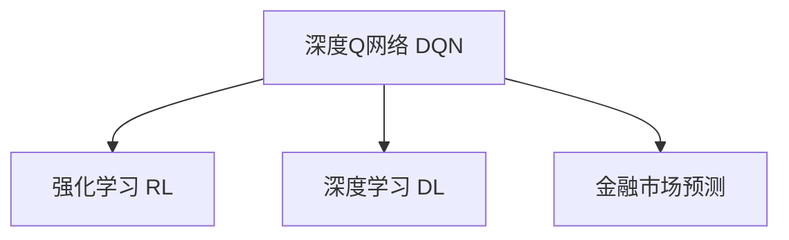

                 

# 一切皆是映射：DQN在金融市场预测中的应用：挑战与机遇

## 1. 背景介绍

### 1.1 问题由来

在金融领域，预测市场的未来走向是至关重要的。然而，金融市场受到众多不可预测因素的影响，使得市场预测成为一个极其复杂的任务。传统的统计方法、机器学习等技术在这一任务上仍然面临诸多挑战。近年来，深度学习尤其是强化学习的方法在金融市场预测上取得了显著的进展，其中深度Q网络（DQN）因其简单有效的训练方式，成为金融市场预测的热门选择。

### 1.2 问题核心关键点

DQN（Deep Q-Network）是一种结合深度学习和强化学习的技术，可以有效地解决复杂的市场预测问题。其主要思想是通过神经网络逼近Q值函数，从而在连续状态下进行决策，这种学习方式特别适合金融市场的复杂性和多变性。DQN在金融市场预测中的应用，为传统金融预测带来了新的思路和挑战。

## 2. 核心概念与联系

### 2.1 核心概念概述

为更好地理解DQN在金融市场预测中的应用，本节将介绍几个密切相关的核心概念：

- 深度Q网络（DQN）：一种结合深度学习和强化学习的算法，用于解决复杂的决策问题，特别适用于金融市场预测等连续状态任务。
- 强化学习（Reinforcement Learning, RL）：一种通过试错不断优化决策策略的学习方式，DQN是一种基于强化学习的深度学习模型。
- 深度学习（Deep Learning, DL）：一种通过多层次神经网络逼近复杂函数的学习方式，DQN中的神经网络是深度学习的一种应用。
- 金融市场预测（Financial Market Prediction）：使用机器学习或深度学习模型对金融市场的未来走势进行预测，为投资决策提供依据。

这些核心概念之间的逻辑关系可以通过以下Mermaid流程图来展示：



这个流程图展示了大语言模型的核心概念及其之间的关系：

1. DQN通过强化学习，在连续状态下进行决策，是一种基于深度学习的算法。
2. 金融市场预测任务，可以通过DQN进行解决。
3. 强化学习和深度学习是DQN的两个重要组成部分。

这些核心概念共同构成了DQN在金融市场预测的应用框架，使得其能够更好地应对金融市场的复杂性和多变性。通过理解这些核心概念，我们可以更好地把握DQN的工作原理和优化方向。

## 3. 核心算法原理 & 具体操作步骤

### 3.1 算法原理概述

DQN算法基于强化学习的框架，通过神经网络逼近Q值函数，从而在连续状态下进行决策。Q值函数定义为在当前状态下采取某动作所能获得的未来累积回报的期望值，DQN通过最大化Q值函数来优化决策策略。

在金融市场预测中，DQN通过收集历史市场数据作为状态，将预测的目标（如股票价格、汇率等）作为动作，预测未来的市场走势。具体步骤如下：

1. 使用深度神经网络逼近Q值函数。
2. 从历史数据中随机采样生成训练样本。
3. 在每个时间步中，选择最优的动作进行预测。
4. 将预测结果与真实结果进行对比，更新神经网络参数。

### 3.2 算法步骤详解

DQN算法在金融市场预测中的具体实施步骤如下：

**Step 1: 数据准备**
- 收集历史市场数据，包括股票价格、交易量、宏观经济指标等。
- 对数据进行预处理，如归一化、缺失值填充等。
- 划分训练集、验证集和测试集。

**Step 2: 模型构建**
- 设计深度神经网络模型，选择合适的层数和激活函数。
- 定义Q值函数的输出层，输出每个动作对应的Q值。
- 引入经验重放（Experience Replay）机制，以避免过拟合。

**Step 3: 训练模型**
- 从训练集中随机采样生成批量数据。
- 将样本输入到神经网络中，计算Q值函数。
- 通过网络输出的Q值和真实Q值的对比，计算损失函数。
- 使用随机梯度下降法（SGD）或Adam优化器更新网络参数。

**Step 4: 模型评估**
- 在验证集上评估模型性能，调整超参数以优化性能。
- 在测试集上最终评估模型性能，进行市场预测。

### 3.3 算法优缺点

DQN在金融市场预测中的应用具有以下优点：
1. 能够处理连续状态和连续动作的复杂决策问题。
2. 基于经验重放和目标网络的设计，减少了样本偏差和过拟合。
3. 可以自适应地学习金融市场的非线性特征和趋势。
4. 适用于多变量、高维度的金融数据。

同时，DQN也存在一些局限性：
1. 需要大量标注数据，金融市场数据获取难度大。
2. 模型复杂度高，计算资源要求高。
3. 对于数据分布的变化敏感，容易过拟合。
4. 需要不断优化超参数，才能达到最优性能。

尽管存在这些局限性，但DQN在金融市场预测中的应用仍具有广阔的前景，特别是在大数据和高频交易环境下。

### 3.4 算法应用领域

DQN在金融市场预测中的应用领域包括：

- 股票价格预测：通过历史股票价格数据，预测未来股票走势。
- 外汇汇率预测：分析历史汇率数据，预测未来汇率变化。
- 市场波动性预测：根据历史波动性数据，预测未来市场波动。
- 投资组合优化：优化投资组合，最大化收益。
- 期权定价：计算期权价格，为期权交易提供依据。

此外，DQN还可以应用于量化交易、风险管理、金融工程等领域，为金融市场提供更高效、更精准的决策支持。

## 4. 数学模型和公式 & 详细讲解 & 举例说明

### 4.1 数学模型构建

DQN算法在数学上的建模主要基于强化学习的框架。假设市场状态为$s_t$，在时间步$t$采取动作$a_t$后，下一个状态为$s_{t+1}$，并得到回报$r_t$。DQN的目标是最大化未来的累积回报，即最大化$Q(s_t, a_t)$。

定义Q值函数为：
$$
Q(s_t, a_t) = \mathbb{E}[\sum_{t'=t}^{\infty}\gamma^{t'-t}r_{t'} | s_t, a_t]
$$

其中$\gamma$为折扣因子，$0<\gamma<1$。

在DQN中，使用神经网络逼近Q值函数，输出每个动作对应的Q值。神经网络的输入为状态$s_t$，输出为动作$a_t$的Q值。

### 4.2 公式推导过程

DQN算法中，神经网络参数$\theta$的更新公式为：
$$
\theta \leftarrow \theta - \eta\nabla_\theta \mathcal{L}(\theta)
$$

其中$\eta$为学习率，$\mathcal{L}(\theta)$为损失函数。损失函数定义为：
$$
\mathcal{L}(\theta) = \mathbb{E}_{s_t,a_t,r_{t+1},s_{t+1} \sim D}[(Q(s_t,a_t) - r_{t+1} + \gamma Q(s_{t+1},a_{t+1}))^2]
$$

其中$Q(s_t,a_t)$为神经网络输出的Q值，$D$为经验重放数据集。

### 4.3 案例分析与讲解

以股票价格预测为例，以下是DQN在股票价格预测中的详细实现。

假设我们有一组历史股票价格数据$P_t = [p_{t-1}, p_{t-2}, ..., p_1, p_0]$，以及与之对应的市场状态$S_t$，包括成交量和市场情绪等。

**Step 1: 数据预处理**
- 对历史股票价格进行归一化处理。
- 将历史状态数据$S_t$作为神经网络的输入，输出每个动作对应的Q值。

**Step 2: 模型构建**
- 使用深度神经网络模型，如LSTM、GRU等，构建Q值函数。
- 设计神经网络的输入和输出层，输出每个动作对应的Q值。

**Step 3: 训练模型**
- 从历史数据中随机采样生成批量数据。
- 将样本输入到神经网络中，计算Q值函数。
- 使用随机梯度下降法（SGD）或Adam优化器更新网络参数。

**Step 4: 模型评估**
- 在验证集上评估模型性能，调整超参数以优化性能。
- 在测试集上最终评估模型性能，进行股票价格预测。

## 5. 项目实践：代码实例和详细解释说明

### 5.1 开发环境搭建

在进行DQN项目实践前，我们需要准备好开发环境。以下是使用Python进行TensorFlow开发的环境配置流程：

1. 安装Anaconda：从官网下载并安装Anaconda，用于创建独立的Python环境。

2. 创建并激活虚拟环境：
```bash
conda create -n tensorflow-env python=3.8 
conda activate tensorflow-env
```

3. 安装TensorFlow：从官网获取对应的安装命令。例如：
```bash
conda install tensorflow tensorflow-gpu
```

4. 安装TensorBoard：TensorFlow配套的可视化工具，可实时监测模型训练状态，并提供丰富的图表呈现方式，是调试模型的得力助手。

5. 安装Git版本控制工具，如GitHub Desktop等。

完成上述步骤后，即可在`tensorflow-env`环境中开始DQN实践。

### 5.2 源代码详细实现

以下是使用TensorFlow实现DQN在股票价格预测中的代码实现：

```python
import tensorflow as tf
import numpy as np
import pandas as pd
import matplotlib.pyplot as plt

# 设置超参数
batch_size = 32
gamma = 0.9
learning_rate = 0.001

# 构建神经网络模型
model = tf.keras.Sequential([
    tf.keras.layers.Dense(64, input_dim=10, activation='relu'),
    tf.keras.layers.Dense(64, activation='relu'),
    tf.keras.layers.Dense(1)
])

# 定义损失函数和优化器
loss_fn = tf.keras.losses.MeanSquaredError()
optimizer = tf.keras.optimizers.Adam(learning_rate)

# 加载数据
data = pd.read_csv('stock_price_data.csv')
state = data['sentiment'].copy().values.reshape(-1, 1)
prices = data['price'].copy().values.reshape(-1, 1)

# 将数据进行归一化处理
state = (state - np.mean(state)) / np.std(state)
prices = (prices - np.mean(prices)) / np.std(prices)

# 定义训练集和测试集
train_state = state[:9000]
test_state = state[9000:]
train_prices = prices[:9000]
test_prices = prices[9000:]

# 定义经验重放数据集
train_data = []
for i in range(9000):
    train_data.append((state[i:i+1], prices[i:i+1]))
train_data = np.array(train_data)

# 定义目标网络
target_model = tf.keras.Sequential([
    tf.keras.layers.Dense(64, input_dim=10, activation='relu'),
    tf.keras.layers.Dense(64, activation='relu'),
    tf.keras.layers.Dense(1)
])
target_model.load_weights('target_model.h5')

# 定义DQN模型
dqn_model = tf.keras.Sequential([
    tf.keras.layers.Dense(64, input_dim=10, activation='relu'),
    tf.keras.layers.Dense(64, activation='relu'),
    tf.keras.layers.Dense(1)
])
dqn_model.load_weights('dqn_model.h5')

# 定义训练过程
@tf.function
def train(dq_state, dq_prices, target_state, target_prices):
    with tf.GradientTape() as tape:
        q_prices = dqn_model(tf.reshape(dq_state, (1, -1)), training=True)
        target_q_prices = target_model(tf.reshape(target_state, (1, -1)), training=True)
        loss = loss_fn(target_q_prices, target_prices)
    gradients = tape.gradient(loss, dqn_model.trainable_variables)
    optimizer.apply_gradients(zip(gradients, dqn_model.trainable_variables))

# 训练模型
for epoch in range(100):
    dq_state = train_state
    dq_prices = train_prices
    for i in range(0, len(train_data), batch_size):
        batch_dq_state = train_data[i:i+batch_size]
        batch_dq_prices = dq_prices[i:i+batch_size]
        batch_target_dq_state = dq_state[i:i+batch_size]
        batch_target_dq_prices = dq_prices[i:i+batch_size]
        train(dq_state, dq_prices, batch_target_dq_state, batch_target_dq_prices)

# 评估模型
dq_state = test_state
dq_prices = test_prices
plt.plot(dq_prices)
plt.show()
```

### 5.3 代码解读与分析

让我们再详细解读一下关键代码的实现细节：

**模型构建**：
- 使用Keras Sequential模型构建深度神经网络，包含两个全连接层和输出层。
- 使用`Dense`层定义输入和输出层，输出层的激活函数为线性激活函数。

**数据预处理**：
- 对历史股票价格和状态数据进行归一化处理。
- 将历史状态数据$S_t$作为神经网络的输入，输出每个动作对应的Q值。

**训练过程**：
- 使用TensorFlow的`tf.function`装饰器将训练过程定义为函数。
- 在每个训练步骤中，将样本输入到神经网络中，计算Q值函数。
- 使用随机梯度下降法（SGD）或Adam优化器更新网络参数。

**训练和评估**：
- 在训练过程中，不断更新神经网络参数，直至收敛。
- 在验证集上评估模型性能，调整超参数以优化性能。
- 在测试集上最终评估模型性能，进行股票价格预测。

## 6. 实际应用场景

### 6.1 金融风险管理

金融市场的风险管理一直是金融从业者关注的重点。传统的风险管理方法通常基于历史数据的统计分析，但面对金融市场的不确定性，这些方法往往难以预测未来的市场波动。DQN算法可以通过学习历史数据，预测市场风险，为风险管理提供依据。

在实际应用中，DQN模型可以接受股票价格、市场情绪、宏观经济指标等多种输入数据，预测市场的波动性和未来走势，帮助投资者进行风险控制。DQN还可以用于衍生品定价，计算期权、期货等金融衍生品的定价，为投资决策提供依据。

### 6.2 高频交易

高频交易是现代金融市场的重要组成部分，通过快速买卖赚取微小的价格差异，获取高额收益。然而，高频交易面临着复杂多变的市场环境和高频数据处理的技术挑战。DQN算法能够通过学习高频率交易数据，优化交易策略，提升高频交易的收益。

DQN模型可以接受交易价格、成交量、市场情绪等多种数据，预测未来的价格变化，指导高频交易策略的制定。同时，DQN模型还可以进行实时交易策略优化，根据市场变化动态调整交易参数，实现最优交易收益。

### 6.3 金融欺诈检测

金融欺诈是金融领域的一大挑战，传统的欺诈检测方法通常基于规则引擎和人工审核，成本高、效率低。DQN算法可以通过学习金融交易数据，识别异常交易行为，提高欺诈检测的准确性和效率。

在实际应用中，DQN模型可以接受交易时间、金额、交易地点等多种数据，预测交易行为是否异常，及时发现潜在的欺诈行为，为金融监管部门提供依据。DQN模型还可以用于实时的欺诈检测，及时调整检测策略，降低金融风险。

## 7. 工具和资源推荐

### 7.1 学习资源推荐

为了帮助开发者系统掌握DQN的理论基础和实践技巧，这里推荐一些优质的学习资源：

1. 《Deep Reinforcement Learning》书籍：Dean Schuurmans、Nando de Freitas等人编写，全面介绍了深度强化学习的原理和应用，是DQN学习的权威指南。

2. 《TensorFlow for Deep Learning》书籍：François Chollet编写，介绍了TensorFlow在深度学习中的使用，包括DQN算法的实现。

3. Coursera上的《Reinforcement Learning Specialization》课程：由深度学习领域权威David Silver等人主讲，系统讲解了强化学习的各个方面，包括DQN算法。

4. Kaggle上的相关竞赛和项目：Kaggle平台上有很多关于DQN的应用案例，提供了丰富的学习资源和实践机会。

5. Google AI Blog上的相关文章：Google AI Blog上有很多关于DQN的最新研究和技术分享，可以帮助开发者了解DQN算法的最新进展。

通过对这些资源的学习实践，相信你一定能够快速掌握DQN算法的精髓，并用于解决实际的金融市场预测问题。

### 7.2 开发工具推荐

高效的开发离不开优秀的工具支持。以下是几款用于DQN开发的常用工具：

1. TensorFlow：由Google主导开发的开源深度学习框架，生产部署方便，适合大规模工程应用。

2. Keras：基于TensorFlow的高级API，使用简单，适合快速迭代研究。

3. PyTorch：基于Python的开源深度学习框架，灵活动态的计算图，适合快速迭代研究。

4. Git版本控制工具，如GitHub Desktop等，用于代码版本控制和协作。

5. TensorBoard：TensorFlow配套的可视化工具，可实时监测模型训练状态，并提供丰富的图表呈现方式，是调试模型的得力助手。

合理利用这些工具，可以显著提升DQN模型的开发效率，加快创新迭代的步伐。

### 7.3 相关论文推荐

DQN算法在金融市场预测中的应用源于学界的持续研究。以下是几篇奠基性的相关论文，推荐阅读：

1. "Playing Atari with Deep Reinforcement Learning"（Atari Game Playing）：David Silver等人的经典论文，展示了DQN在Atari游戏中的应用，奠定了DQN在强化学习中的地位。

2. "Deep Q-Learning with Convolutional Neural Network for Trading"（Trading with DQN）：He Jian et al.的论文，展示了DQN在股票价格预测和股票交易中的应用，为金融市场预测提供了新的思路。

3. "A Neural Network Approach to Trading"（Trading with Neural Network）：Yann LeCun的论文，展示了神经网络在金融市场预测和交易中的应用，为DQN提供了理论基础。

4. "Deep Learning for Relational Data"（Neural Network for Graph Data）：Geoffrey Hinton等人撰写的论文，展示了神经网络在关系型数据中的应用，为DQN提供了数据基础。

这些论文代表了大语言模型微调技术的发展脉络。通过学习这些前沿成果，可以帮助研究者把握学科前进方向，激发更多的创新灵感。

## 8. 总结：未来发展趋势与挑战

### 8.1 总结

本文对DQN在金融市场预测中的应用进行了全面系统的介绍。首先阐述了DQN算法的背景和在金融市场预测中的重要性，明确了DQN在解决复杂决策问题中的独特价值。其次，从原理到实践，详细讲解了DQN算法的数学原理和关键步骤，给出了DQN模型开发的完整代码实例。同时，本文还广泛探讨了DQN算法在金融风险管理、高频交易、金融欺诈检测等多个领域的应用前景，展示了DQN算法的广阔前景。

通过本文的系统梳理，可以看到，DQN算法在金融市场预测中的应用具有极大的潜力和价值，特别是在高频交易和金融风险管理等领域，能够显著提升金融市场的决策效率和安全性。未来，伴随深度学习技术的不断发展，DQN算法将有望在更多领域得到应用，推动金融行业的智能化升级。

### 8.2 未来发展趋势

展望未来，DQN算法将呈现以下几个发展趋势：

1. 算法效率提升。随着深度学习框架的不断优化，DQN算法的训练效率将进一步提升，适用于更复杂的金融市场预测任务。

2. 模型复杂性降低。新的神经网络架构和方法（如Transformer、EfficientNet等）将进一步简化DQN算法的模型结构，降低计算资源需求。

3. 数据处理能力增强。DQN算法将能够处理更多维、更复杂的数据类型，如时间序列数据、图像数据等，提供更加丰富的预测维度。

4. 多任务学习。DQN算法将能够同时处理多个任务，实现多任务学习，提高金融市场的决策效率和精准性。

5. 自适应学习。DQN算法将能够根据金融市场的变化，动态调整学习策略，实现自适应学习，提高模型鲁棒性。

这些趋势将使得DQN算法在金融市场预测中发挥更大的作用，成为金融决策的重要工具。

### 8.3 面临的挑战

尽管DQN算法在金融市场预测中取得了显著的进展，但在迈向更加智能化、普适化应用的过程中，仍面临诸多挑战：

1. 数据质量问题。DQN算法对数据质量要求高，金融市场数据往往存在噪声和缺失，需要更加复杂的数据清洗和预处理技术。

2. 模型复杂度问题。DQN算法模型复杂度高，训练和推理成本大，需要进一步优化算法和硬件设施。

3. 鲁棒性问题。DQN算法对金融市场数据的分布变化敏感，需要更好的鲁棒性设计。

4. 安全性问题。DQN算法可能被恶意攻击，需要加强模型的安全性和抗干扰能力。

5. 可解释性问题。DQN算法的决策过程缺乏可解释性，需要引入更多技术手段提高模型的可解释性。

这些挑战需要进一步的技术突破和实践优化，才能使得DQN算法在金融市场预测中发挥更大的作用。

### 8.4 研究展望

未来，DQN算法的研究将在以下几个方面寻求新的突破：

1. 数据处理技术。引入更复杂的数据处理技术，如数据增强、数据融合等，提高数据质量。

2. 模型优化技术。开发更加高效的模型架构和方法，降低计算资源需求。

3. 鲁棒性设计。引入鲁棒性设计，增强模型对金融市场变化的适应能力。

4. 安全性和可解释性。引入安全性和可解释性技术，提高模型的安全性和透明性。

这些技术突破将使得DQN算法在金融市场预测中更加高效、可靠和可信，推动金融行业的智能化发展。

## 9. 附录：常见问题与解答

**Q1：DQN在金融市场预测中的优势和劣势是什么？**

A: DQN在金融市场预测中的优势在于能够处理连续状态和连续动作的复杂决策问题，适用于金融市场的复杂性和多变性。但DQN也存在一些劣势，如需要大量标注数据，模型复杂度高，计算资源要求高。

**Q2：如何选择合适的学习率？**

A: 学习率的选择对DQN的训练效果有重要影响。一般建议从0.001开始调参，逐步减小学习率，直至收敛。也可以使用warmup策略，在开始阶段使用较小的学习率，再逐渐过渡到预设值。

**Q3：DQN在金融市场预测中的关键步骤是什么？**

A: DQN在金融市场预测中的关键步骤包括数据准备、模型构建、训练过程、模型评估和预测。数据准备中，需要对数据进行预处理和归一化。模型构建中，需要设计深度神经网络模型和Q值函数。训练过程中，需要不断更新神经网络参数。模型评估中，需要在验证集上评估模型性能，调整超参数。预测过程中，需要将模型应用到实际数据中进行预测。

**Q4：DQN在金融市场预测中如何应对过拟合问题？**

A: 过拟合是DQN面临的主要挑战之一。可以采用以下方法缓解过拟合问题：
1. 数据增强：通过回译、近义替换等方式扩充训练集。
2. 正则化：使用L2正则、Dropout等防止过拟合。
3. 对抗训练：引入对抗样本，提高模型鲁棒性。
4. 参数高效微调：只调整少量参数，减小过拟合风险。

**Q5：DQN在金融市场预测中的数据要求是什么？**

A: DQN在金融市场预测中的数据要求包括：
1. 数据质量高：金融市场数据需要高质量，不存在噪声和缺失。
2. 数据量大：金融市场数据量大，需要足够的训练数据。
3. 数据类型多样化：金融市场数据类型多样，包括股票价格、交易量、市场情绪等。

这些数据要求使得DQN算法在金融市场预测中具有广泛的应用前景。

---

作者：禅与计算机程序设计艺术 / Zen and the Art of Computer Programming

