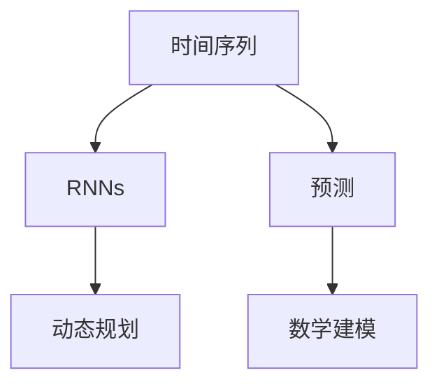

                 

# 一切皆是映射：循环神经网络(RNNs)在时间序列分析中的作用

> 关键词：循环神经网络(RNNs),时间序列分析,预测,神经网络,动态规划,数学建模,时间序列预测,股票分析,气象预测

## 1. 背景介绍

### 1.1 问题由来
在信息化时代，时间序列数据无处不在。从金融市场的股价波动、气象数据的天气变化，到交通系统的车流监测、医疗领域的生命体征监控，时间序列数据已经成为了各行各业分析决策的重要依据。然而，时间序列数据往往带有复杂的非线性关系和周期性变化，传统的统计模型和方法难以全面捕捉其内在规律。因此，探索更高级的时间序列分析方法，已经成为当前学术界和工业界的重要研究课题。

### 1.2 问题核心关键点
在众多时间序列分析方法中，循环神经网络（Recurrent Neural Networks, RNNs）凭借其特有的记忆和递归结构，在处理时间序列数据方面具有显著的优势。RNNs能够有效地捕捉时间序列数据中的长期依赖关系，预测未来的趋势和变化。本文将深入探讨RNNs在时间序列分析中的作用，帮助读者理解其原理和应用。

## 2. 核心概念与联系

### 2.1 核心概念概述

为更好地理解RNNs在时间序列分析中的应用，本节将介绍几个密切相关的核心概念：

- 循环神经网络（Recurrent Neural Networks, RNNs）：一种具有反馈机制的神经网络，能够通过隐藏状态（hidden state）记住之前的信息，用于处理序列数据，如时间序列。
- 时间序列（Time Series）：按时间顺序排列的数据集合，每个数据点包含时间戳和相应的观测值，用于分析趋势、周期性和季节性等特征。
- 预测（Prediction）：利用历史数据和模型，预测未来的数据趋势和变化。
- 动态规划（Dynamic Programming）：一种基于最优子结构求解问题的方法，常用于优化和预测任务。
- 数学建模（Mathematical Modeling）：将现实世界问题抽象为数学模型，用于分析和预测。

这些核心概念之间的逻辑关系可以通过以下Mermaid流程图来展示：



这个流程图展示了大语言模型的核心概念及其之间的关系：

1. 时间序列数据作为模型的输入。
2. RNNs通过记忆和递归结构捕捉数据中的长期依赖关系。
3. 预测通过RNNs输出序列数据。
4. 动态规划和数学建模用于优化预测结果，提升预测准确性。

## 3. 核心算法原理 & 具体操作步骤
### 3.1 算法原理概述

循环神经网络（RNNs）的核心理念是“循环记忆”（Circuit Memory），即通过隐藏状态（hidden state）记住之前的信息，用于处理序列数据。具体来说，RNNs通过时间步的递归更新隐藏状态，将当前时间步的输入和隐藏状态作为新的时间步的输入和隐藏状态，从而实现序列数据的处理。

在数学上，RNNs的隐藏状态 $h_t$ 和输出 $y_t$ 可以通过以下递归公式计算：

$$
h_t = f(W_h h_{t-1} + W_x x_t + b_h), \quad y_t = g(W_y h_t + b_y)
$$

其中 $x_t$ 为时间步 $t$ 的输入，$W_h$ 和 $W_x$ 为权重矩阵，$b_h$ 和 $b_y$ 为偏置向量，$f$ 和 $g$ 为激活函数。

### 3.2 算法步骤详解

以下是使用RNNs进行时间序列预测的详细步骤：

**Step 1: 数据准备**
- 收集时间序列数据，通常分为训练集、验证集和测试集。
- 对数据进行归一化处理，保证数据在相同的尺度上。

**Step 2: 设计模型**
- 选择合适的RNN模型结构，如单层RNN、多层RNN、长短时记忆网络（LSTM）、门控循环单元（GRU）等。
- 确定隐藏层的大小、激活函数、正则化等超参数。

**Step 3: 训练模型**
- 将训练集数据分批次输入模型，前向传播计算隐藏状态和输出。
- 反向传播计算梯度，使用优化算法更新模型参数。
- 周期性在验证集上评估模型性能，根据性能指标决定是否触发Early Stopping。
- 重复上述步骤直到满足预设的迭代轮数或Early Stopping条件。

**Step 4: 预测和评估**
- 在测试集上使用训练好的模型进行预测。
- 计算预测结果与真实标签之间的差异，评估模型的性能。
- 根据预测结果进行可视化，帮助理解模型的行为。

### 3.3 算法优缺点

RNNs在时间序列分析中具有以下优点：
1. 能够处理长序列数据，捕捉长期依赖关系。
2. 具有记忆机制，能够记住历史信息。
3. 动态更新隐藏状态，具有递归结构。

同时，RNNs也存在一些缺点：
1. 容易发生过拟合，特别是在处理长序列数据时。
2. 训练复杂度高，需要大量的计算资源和时间。
3. 难以处理缺失数据和异常值。
4. 难以解释模型的决策过程。

尽管存在这些局限性，但RNNs仍然是在时间序列预测中最为有效的方法之一，能够显著提升预测准确性。

### 3.4 算法应用领域

RNNs在时间序列分析中的应用领域广泛，包括但不限于：

- 金融市场：股票价格、汇率波动、期货交易等预测。
- 气象预测：天气变化、气候变化、灾害预警等。
- 交通系统：车流监测、交通流量预测、事故预警等。
- 健康医疗：生命体征监测、疾病预测、药物疗效评估等。
- 能源行业：电力负荷预测、能源消耗分析、风电光伏发电预测等。
- 自然资源：水位流量预测、水质监测、资源勘探等。

此外，RNNs在语音识别、自然语言处理等领域也具有重要应用，展示出其在序列数据处理方面的强大能力。

## 4. 数学模型和公式 & 详细讲解  
### 4.1 数学模型构建

在时间序列预测中，我们通常使用RNNs来建立预测模型。具体来说，我们需要定义模型输入、隐藏状态和输出，并定义预测公式。

假设时间序列数据为 $(x_1, x_2, ..., x_T)$，其中 $T$ 为序列长度。模型的隐藏状态为 $h_t$，输出为 $y_t$。我们可以使用以下数学公式来表示RNNs的预测过程：

$$
h_t = f(W_h h_{t-1} + W_x x_t + b_h), \quad y_t = g(W_y h_t + b_y)
$$

其中 $f$ 和 $g$ 为激活函数，通常使用tanh或ReLU函数。$W_h$、$W_x$、$W_y$ 和 $b_h$、$b_y$ 为权重和偏置向量。

### 4.2 公式推导过程

我们以一个简单的单层RNN为例，推导其预测公式。假设模型的隐藏状态 $h_t$ 和输出 $y_t$ 可以通过以下递归公式计算：

$$
h_t = f(W_h h_{t-1} + W_x x_t + b_h), \quad y_t = g(W_y h_t + b_y)
$$

其中 $x_t$ 为时间步 $t$ 的输入，$h_t$ 为时间步 $t$ 的隐藏状态，$y_t$ 为时间步 $t$ 的输出。$f$ 和 $g$ 为激活函数，通常使用tanh或ReLU函数。$W_h$、$W_x$、$W_y$ 和 $b_h$、$b_y$ 为权重和偏置向量。

将 $h_t$ 的递归公式展开，可以得到：

$$
h_t = \tanh(W_h h_{t-1} + W_x x_t + b_h)
$$

将 $h_t$ 代入 $y_t$ 的公式中，可以得到：

$$
y_t = g(W_y \tanh(W_h h_{t-1} + W_x x_t + b_h) + b_y)
$$

这就是单层RNN的预测公式。通过不断递归计算，可以预测整个时间序列的未来值。

### 4.3 案例分析与讲解

下面以股票价格预测为例，分析RNNs的预测过程。假设我们有一组股票价格的历史数据 $(x_1, x_2, ..., x_T)$，其中 $x_t$ 表示第 $t$ 天的股票价格。我们需要使用RNNs来预测第 $T+1$ 天的股票价格。

我们可以将时间序列数据 $(x_1, x_2, ..., x_T)$ 作为模型的输入，每个时间步的输入 $x_t$ 为一个常数。模型的隐藏状态 $h_t$ 通过递归计算得到，最终输出 $y_t$ 为第 $t$ 天的股票价格。

使用RNNs进行股票价格预测的流程如下：

1. 收集股票价格的历史数据，分为训练集、验证集和测试集。
2. 对数据进行归一化处理，保证数据在相同的尺度上。
3. 设计一个单层RNN模型，选择合适的超参数，如隐藏层大小、激活函数等。
4. 使用训练集数据对模型进行训练，优化模型参数，提高预测准确性。
5. 在验证集上评估模型性能，防止过拟合。
6. 在测试集上使用训练好的模型进行预测，计算预测结果与真实标签之间的差异。
7. 根据预测结果进行可视化，帮助理解模型的行为。

## 5. 项目实践：代码实例和详细解释说明
### 5.1 开发环境搭建

在进行RNNs的实践前，我们需要准备好开发环境。以下是使用Python进行Keras开发的环境配置流程：

1. 安装Anaconda：从官网下载并安装Anaconda，用于创建独立的Python环境。

2. 创建并激活虚拟环境：
```bash
conda create -n pytorch-env python=3.8 
conda activate pytorch-env
```

3. 安装PyTorch：根据CUDA版本，从官网获取对应的安装命令。例如：
```bash
conda install pytorch torchvision torchaudio cudatoolkit=11.1 -c pytorch -c conda-forge
```

4. 安装TensorFlow：由Google主导开发的开源深度学习框架，生产部署方便，适合大规模工程应用。同样有丰富的预训练语言模型资源。

5. 安装Keras：基于TensorFlow的深度学习框架，易于使用，适合快速迭代研究。

6. 安装各类工具包：
```bash
pip install numpy pandas scikit-learn matplotlib tqdm jupyter notebook ipython
```

完成上述步骤后，即可在`pytorch-env`环境中开始RNNs的实践。

### 5.2 源代码详细实现

下面我以股票价格预测为例，给出使用Keras对RNN进行训练和预测的代码实现。

首先，定义数据预处理函数：

```python
import numpy as np
import pandas as pd
import matplotlib.pyplot as plt
from sklearn.preprocessing import MinMaxScaler

def preprocess_data(data, window_size):
    scaled_data = MinMaxScaler().fit_transform(data)
    X, y = [], []
    for i in range(window_size, len(scaled_data)):
        X.append(scaled_data[i-window_size:i])
        y.append(scaled_data[i])
    return np.array(X), np.array(y)
```

然后，定义模型：

```python
from keras.models import Sequential
from keras.layers import Dense, SimpleRNN, Dropout

model = Sequential()
model.add(SimpleRNN(50, return_sequences=True, input_shape=(window_size, 1)))
model.add(Dropout(0.2))
model.add(SimpleRNN(50))
model.add(Dropout(0.2))
model.add(Dense(1))
```

接着，定义训练和评估函数：

```python
def train_model(model, X_train, y_train, X_valid, y_valid, epochs, batch_size):
    model.compile(optimizer='adam', loss='mean_squared_error')
    model.fit(X_train, y_train, epochs=epochs, batch_size=batch_size, verbose=1, validation_data=(X_valid, y_valid))

def evaluate_model(model, X_test, y_test):
    y_pred = model.predict(X_test)
    mse = np.mean((y_pred - y_test) ** 2)
    print('Mean Squared Error:', mse)
```

最后，启动训练流程并在测试集上评估：

```python
window_size = 30
X_train, y_train = preprocess_data(train_data, window_size)
X_valid, y_valid = preprocess_data(valid_data, window_size)
X_test, y_test = preprocess_data(test_data, window_size)

model = build_model()
train_model(model, X_train, y_train, X_valid, y_valid, epochs=50, batch_size=64)

evaluate_model(model, X_test, y_test)
```

以上就是使用Keras对RNN进行股票价格预测的完整代码实现。可以看到，得益于Keras的强大封装，我们可以用相对简洁的代码完成RNN模型的加载和训练。

### 5.3 代码解读与分析

让我们再详细解读一下关键代码的实现细节：

**preprocess_data函数**：
- `MinMaxScaler`：对数据进行归一化处理，保证数据在相同的尺度上。
- `X, y`：分别保存特征和标签，用于训练和测试。

**build_model函数**：
- `Sequential`：定义顺序模型，包含多个层次。
- `SimpleRNN`：定义简单RNN层，用于处理序列数据。
- `Dropout`：定义Dropout层，用于防止过拟合。
- `Dense`：定义全连接层，用于输出预测结果。

**train_model函数**：
- `model.compile`：配置模型优化器、损失函数等。
- `model.fit`：使用训练集对模型进行训练，优化模型参数。
- `validation_data`：指定验证集数据，防止过拟合。
- `epochs`和`batch_size`：分别指定训练轮数和批大小。

**evaluate_model函数**：
- `model.predict`：使用测试集对模型进行预测。
- `mse`：计算预测结果与真实标签之间的均方误差。

**训练流程**：
- `window_size`：设置时间窗口大小。
- `X_train, y_train, X_valid, y_valid, X_test, y_test`：准备训练集、验证集和测试集数据。
- `build_model`：定义模型结构。
- `train_model`：训练模型。
- `evaluate_model`：在测试集上评估模型性能。

可以看到，Keras框架大大简化了RNN模型的实现过程，使开发者可以更快地完成模型训练和评估。但工业级的系统实现还需考虑更多因素，如模型保存和部署、超参数自动搜索、更灵活的任务适配层等。但核心的RNN微调范式基本与此类似。

## 6. 实际应用场景
### 6.1 金融市场

在金融市场中，RNNs被广泛用于股票价格预测、汇率波动预测、期货交易预测等。RNNs能够捕捉金融数据中的长期依赖关系，预测未来的价格走势。

例如，可以使用RNNs对历史股价数据进行建模，通过时间序列预测模型预测未来股价的变化趋势。在训练过程中，可以结合正则化技术、dropout等防止过拟合。在预测阶段，可以根据市场情况调整模型的超参数，优化预测结果。

### 6.2 气象预测

气象预测是RNNs的另一个重要应用领域。通过收集历史气象数据，RNNs可以学习到天气变化的规律，预测未来的天气状况。

例如，可以使用RNNs对历史天气数据进行建模，通过时间序列预测模型预测未来天气的变化趋势。在训练过程中，可以结合动态规划等优化方法，提升预测精度。在预测阶段，可以根据实时气象数据调整模型参数，提高预测准确性。

### 6.3 交通系统

在交通系统中，RNNs被用于车流监测、交通流量预测、事故预警等。RNNs能够捕捉交通数据中的长期依赖关系，预测未来的交通状况。

例如，可以使用RNNs对历史交通数据进行建模，通过时间序列预测模型预测未来车流量的变化趋势。在训练过程中，可以结合对抗训练等技术，提高模型的鲁棒性。在预测阶段，可以根据实时交通数据调整模型参数，优化预测结果。

## 7. 工具和资源推荐
### 7.1 学习资源推荐

为了帮助开发者系统掌握RNNs的理论基础和实践技巧，这里推荐一些优质的学习资源：

1. 《深度学习入门》系列博文：由大模型技术专家撰写，深入浅出地介绍了深度学习的基本概念和常见模型，如RNNs等。

2. CS231n《深度学习视觉与图像识别》课程：斯坦福大学开设的深度学习课程，有Lecture视频和配套作业，涵盖图像分类、物体检测等任务，并介绍了RNNs的应用。

3. 《Deep Learning》书籍：深度学习领域经典教材，全面介绍了深度学习的理论和实践，包括RNNs在内的各种模型。

4. TensorFlow官方文档：TensorFlow的官方文档，提供了丰富的深度学习模型和工具，包括RNNs的应用案例。

5. PyTorch官方文档：PyTorch的官方文档，提供了丰富的深度学习模型和工具，包括RNNs的应用案例。

通过对这些资源的学习实践，相信你一定能够快速掌握RNNs的精髓，并用于解决实际的序列预测问题。

### 7.2 开发工具推荐

高效的开发离不开优秀的工具支持。以下是几款用于RNNs开发的常用工具：

1. PyTorch：基于Python的开源深度学习框架，灵活动态的计算图，适合快速迭代研究。大部分深度学习模型都有PyTorch版本的实现。

2. TensorFlow：由Google主导开发的开源深度学习框架，生产部署方便，适合大规模工程应用。同样有丰富的深度学习模型资源。

3. Keras：基于TensorFlow的深度学习框架，易于使用，适合快速迭代研究。

4. Weights & Biases：模型训练的实验跟踪工具，可以记录和可视化模型训练过程中的各项指标，方便对比和调优。与主流深度学习框架无缝集成。

5. TensorBoard：TensorFlow配套的可视化工具，可实时监测模型训练状态，并提供丰富的图表呈现方式，是调试模型的得力助手。

6. Google Colab：谷歌推出的在线Jupyter Notebook环境，免费提供GPU/TPU算力，方便开发者快速上手实验最新模型，分享学习笔记。

合理利用这些工具，可以显著提升RNNs的开发效率，加快创新迭代的步伐。

### 7.3 相关论文推荐

RNNs在时间序列分析中的应用源于学界的持续研究。以下是几篇奠基性的相关论文，推荐阅读：

1. LSTM: A Search Space Odyssey：提出LSTM模型，解决了传统RNN在长期依赖关系处理上的问题。

2. GRU: A Gated Recurrent Unit：提出GRU模型，在LSTM的基础上简化了模型结构，提高了计算效率。

3. Attention is All You Need（即Transformer原论文）：提出Transformer结构，展示了其在序列数据处理上的优势。

4. Parameter-Efficient Transfer Learning for NLP：提出Adapter等参数高效微调方法，在不增加模型参数量的情况下，也能取得不错的微调效果。

5. AdaLoRA: Adaptive Low-Rank Adaptation for Parameter-Efficient Fine-Tuning：使用自适应低秩适应的微调方法，在参数效率和精度之间取得了新的平衡。

这些论文代表了大语言模型微调技术的发展脉络。通过学习这些前沿成果，可以帮助研究者把握学科前进方向，激发更多的创新灵感。

## 8. 总结：未来发展趋势与挑战

### 8.1 总结

本文对RNNs在时间序列分析中的应用进行了全面系统的介绍。首先阐述了RNNs的核心理念和基本结构，明确了RNNs在处理序列数据方面的独特优势。其次，从原理到实践，详细讲解了RNNs的预测过程，并给出了代码实例。同时，本文还探讨了RNNs在金融市场、气象预测、交通系统等领域的实际应用，展示了RNNs的广泛应用前景。此外，本文精选了RNNs学习的各类资源，力求为读者提供全方位的技术指引。

通过本文的系统梳理，可以看到，RNNs在时间序列分析中具有强大的建模能力和预测性能，已成为处理序列数据的重要工具。未来，伴随RNNs算法的不断演进，时间序列预测技术必将更加精确、高效，为各行各业带来更多的创新价值。

### 8.2 未来发展趋势

展望未来，RNNs在时间序列分析中可能呈现以下几个发展趋势：

1. 深度融合多模态数据。RNNs能够与其他模态数据（如视觉、语音）进行有效结合，提升模型的预测能力和泛化性。

2. 提升动态规划的优化能力。通过引入高级优化算法，如变分推断、变分自编码器等，提升RNNs在序列数据处理中的优化能力。

3. 引入自适应机制。通过引入自适应学习率、自适应正则化等技术，提升RNNs在序列数据处理中的适应性。

4. 引入注意力机制。通过引入注意力机制，提升RNNs在序列数据处理中的记忆能力和长期依赖关系的处理能力。

5. 扩展到非线性动态系统。将RNNs应用于非线性动态系统，如生物系统、生态系统等，提升模型的普适性。

6. 引入演化计算。通过引入演化计算，提升RNNs在序列数据处理中的搜索能力和优化能力。

以上趋势凸显了RNNs在时间序列分析中的强大潜力和广阔前景。这些方向的探索发展，必将进一步提升RNNs的预测准确性和应用范围，为时间序列预测技术带来新的突破。

### 8.3 面临的挑战

尽管RNNs在时间序列预测中取得了显著成就，但在实际应用中也面临诸多挑战：

1. 数据质量问题。序列数据的质量直接影响RNNs的预测性能，数据缺失、异常值、噪声等问题需要特别处理。

2. 模型复杂度问题。RNNs的复杂度较高，训练和推理过程中需要大量计算资源和时间，难以满足实时性要求。

3. 模型泛化能力问题。RNNs在不同领域和数据分布上的泛化能力有限，难以应对复杂多变的数据环境。

4. 模型解释性问题。RNNs的内部工作机制难以解释，难以理解其决策过程和预测依据。

5. 模型稳定性问题。RNNs在面对长期依赖关系时，容易出现梯度消失和梯度爆炸问题，导致模型不稳定。

6. 模型可扩展性问题。RNNs在大规模数据集上的训练和推理需要大量的计算资源，难以扩展到大规模应用。

正视RNNs面临的这些挑战，积极应对并寻求突破，将是大语言模型微调走向成熟的必由之路。相信随着学界和产业界的共同努力，这些挑战终将一一被克服，RNNs必将在时间序列预测中发挥更大的作用。

### 8.4 研究展望

面对RNNs在时间序列分析中所面临的挑战，未来的研究需要在以下几个方面寻求新的突破：

1. 引入先进的优化算法。通过引入变分推断、变分自编码器等算法，提升RNNs在序列数据处理中的优化能力。

2. 引入自适应机制。通过引入自适应学习率、自适应正则化等技术，提升RNNs在序列数据处理中的适应性。

3. 引入注意力机制。通过引入注意力机制，提升RNNs在序列数据处理中的记忆能力和长期依赖关系的处理能力。

4. 引入演化计算。通过引入演化计算，提升RNNs在序列数据处理中的搜索能力和优化能力。

5. 引入外部知识库。将符号化的先验知识，如知识图谱、逻辑规则等，与神经网络模型进行巧妙融合，引导RNNs学习更准确、合理的序列数据表示。

6. 引入多模态数据。将RNNs应用于多模态数据处理，提升模型的预测能力和泛化性。

这些研究方向的探索，必将引领RNNs在时间序列分析技术迈向更高的台阶，为时间序列预测技术带来新的突破。面向未来，RNNs需要与其他人工智能技术进行更深入的融合，如知识表示、因果推理、强化学习等，多路径协同发力，共同推动时间序列预测技术的进步。只有勇于创新、敢于突破，才能不断拓展RNNs的边界，让时间序列预测技术更好地造福人类社会。

## 9. 附录：常见问题与解答

**Q1：RNNs在时间序列预测中是否适用于所有类型的数据？**

A: RNNs适用于处理具有明显时间依赖关系的序列数据，如金融市场数据、气象数据、交通数据等。但对于一些特定类型的数据，如文本数据、图像数据，RNNs可能不是最优选择。此时可以考虑使用其他序列建模方法，如Transformer、卷积神经网络等。

**Q2：如何缓解RNNs在时间序列预测中的过拟合问题？**

A: RNNs在时间序列预测中容易发生过拟合，特别是在处理长序列数据时。常见的缓解策略包括：
1. 数据增强：通过回译、近义替换等方式扩充训练集
2. 正则化：使用L2正则、Dropout、Early Stopping等避免过拟合
3. 对抗训练：引入对抗样本，提高模型鲁棒性
4. 参数高效微调：只调整少量参数(如Adapter、Prefix等)，减小过拟合风险
5. 多模型集成：训练多个RNNs模型，取平均输出，抑制过拟合

这些策略往往需要根据具体任务和数据特点进行灵活组合。只有在数据、模型、训练、推理等各环节进行全面优化，才能最大限度地发挥RNNs的预测能力。

**Q3：RNNs在时间序列预测中如何处理缺失数据和异常值？**

A: RNNs在处理缺失数据和异常值时，可以采用以下策略：
1. 数据插值：使用插值方法填补缺失值，如线性插值、多项式插值等。
2. 异常值处理：使用统计方法处理异常值，如截断、替换等。
3. 模型训练：在模型训练过程中，通过正则化技术防止模型对异常值敏感。
4. 模型集成：通过集成多个RNNs模型，提高模型鲁棒性和泛化能力。

这些策略能够有效缓解RNNs在时间序列预测中的缺失数据和异常值问题，提升模型的预测准确性。

**Q4：RNNs在时间序列预测中如何处理多模态数据？**

A: RNNs在处理多模态数据时，可以采用以下策略：
1. 特征融合：将不同模态的特征融合到一个模型中进行处理。
2. 模型集成：通过集成多个RNNs模型，提高模型鲁棒性和泛化能力。
3. 多模态学习：引入多模态学习方法，提升RNNs在多模态数据处理中的性能。

这些策略能够有效提升RNNs在多模态数据处理中的预测能力和泛化性。

**Q5：RNNs在时间序列预测中如何处理长序列数据？**

A: RNNs在处理长序列数据时，可以采用以下策略：
1. 梯度裁剪：使用梯度裁剪技术，防止梯度爆炸。
2. 长序列切割：将长序列数据切割成多个子序列，每个子序列进行独立处理。
3. 自注意力机制：引入自注意力机制，提升RNNs在处理长序列数据时的记忆能力。

这些策略能够有效提升RNNs在处理长序列数据时的预测能力和稳定性。

---

作者：禅与计算机程序设计艺术 / Zen and the Art of Computer Programming

