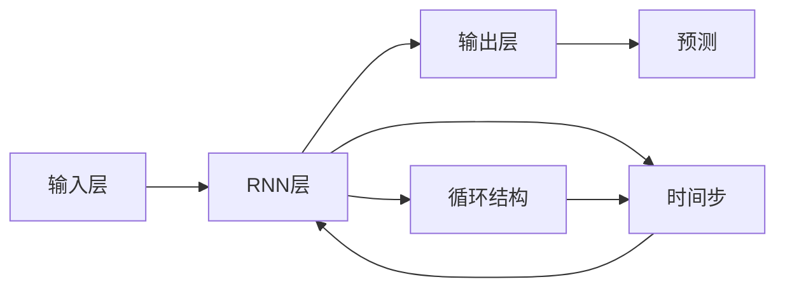

                 

# 一切皆是映射：循环神经网络(RNNs)在时间序列分析中的作用

> 关键词：循环神经网络(RNNs), 时间序列分析, 序列建模, 长短期记忆(LSTM), 门控循环单元(GRU), 隐马尔可夫模型(HMM), 预测与建模, 深度学习

## 1. 背景介绍

### 1.1 问题由来

在数据科学和机器学习领域，时间序列分析（Time Series Analysis）是一项极为重要的技术，用于研究和预测时间上排列的数据点序列。金融市场、气象预测、气候变化、工业生产等多个领域都广泛应用时间序列分析。传统的时间序列分析方法通常基于统计学原理，如自回归模型（AR）、移动平均模型（MA）和自回归移动平均模型（ARMA）等。然而，这些方法在面对复杂、非线性的时间序列数据时，效果有限，难以捕捉到数据中的长期依赖关系。

近些年，随着深度学习技术的发展，特别是循环神经网络（Recurrent Neural Networks, RNNs）的提出，时间序列分析进入了一个新的时代。RNNs能够处理序列数据的时间依赖性，并结合长期依赖的机制，显著提升了时间序列预测的准确性和泛化能力。

### 1.2 问题核心关键点

本文将重点探讨循环神经网络在时间序列分析中的作用，具体关注以下几个核心问题：

1. **RNNs的基本原理和架构**：介绍RNNs的循环结构和工作机制。
2. **LSTM与GRU的实现与原理**：分析LSTM（长短期记忆网络）和GRU（门控循环单元）的具体实现和优化。
3. **隐马尔可夫模型与RNNs结合**：探讨HMM（隐马尔可夫模型）在时间序列分析中的应用，以及如何与RNNs结合提高预测性能。
4. **实际应用场景**：展示RNNs在金融市场预测、天气预报等实际场景中的成功应用。
5. **未来趋势与挑战**：分析RNNs在时间序列分析领域的未来发展趋势和面临的挑战。

### 1.3 问题研究意义

时间序列分析在各行各业中有着广泛的应用，RNNs通过其强大的序列建模能力，能够为时间序列预测和建模提供强有力的工具。研究RNNs在时间序列分析中的应用，有助于提升预测的准确性，为业务决策提供可靠的数据支撑，从而推动相关行业的创新与发展。

## 2. 核心概念与联系

### 2.1 核心概念概述

循环神经网络（RNNs）是一种能够处理序列数据的神经网络结构。与传统的全连接网络不同，RNNs在处理序列数据时，能够利用前一时刻的输出作为当前时刻的输入，形成一个循环的计算过程。这种循环结构使得RNNs能够有效地捕捉序列数据中的时间依赖性。

在RNNs中，最重要的概念是“时间步”。每一个时间步，网络接收一个输入，并根据前一个时间步的输出状态和当前输入，计算出一个新的状态和输出。这种状态更新和输出计算的过程，就构成了RNNs的循环结构。

### 2.2 核心概念原理和架构的 Mermaid 流程图



**解释**：
- A代表输入层，接收序列数据。
- B代表RNN层，是时间序列分析的核心部分，通过循环结构更新状态，并计算输出。
- C代表输出层，进行最终的预测或分类。
- D表示循环结构，使得网络能够处理序列数据的时间依赖性。
- E表示时间步，每个时间步网络计算一次状态更新和输出。
- F表示预测或分类结果。

### 2.3 RNNs与LSTM、GRU的联系

在RNNs的基础上，为了解决长序列信息的丢失问题，提出了长短期记忆网络（LSTM）和门控循环单元（GRU）。这两种网络通过引入门控机制，能够更好地捕捉序列中的长期依赖性，减少了梯度消失和梯度爆炸的问题。

LSTM和GRU的架构非常相似，都引入了“门”的概念，用于控制信息的流动。LSTM中的门包括输入门、遗忘门和输出门，而GRU只有重置门和更新门。这些门通过计算一系列逻辑函数，来决定当前时刻是否引入或遗忘前一时刻的信息，从而更好地捕捉序列中的关键特征。

## 3. 核心算法原理 & 具体操作步骤

### 3.1 算法原理概述

RNNs的算法原理主要基于时间步的循环结构，通过前向传播和反向传播算法，最小化预测与真实值之间的损失，从而优化网络参数。

在时间序列预测任务中，RNNs通常使用MSE（均方误差）或MAE（平均绝对误差）作为损失函数，目标是最小化预测值与真实值之间的误差。具体步骤如下：

1. 输入层接收序列数据。
2. RNN层根据输入和前一时刻的状态，计算当前时刻的状态和输出。
3. 输出层根据RNN层的输出，计算预测值。
4. 通过反向传播算法，计算损失函数的梯度，更新网络参数。
5. 重复步骤1-4，直到收敛或达到预设迭代次数。

### 3.2 算法步骤详解

以下是RNNs在时间序列分析中预测气温序列的详细步骤：

**Step 1: 数据准备**

收集历史气温数据，构建时间序列。数据可以来自公共气象站或卫星观测，确保数据质量和时间序列的连续性。

**Step 2: 数据预处理**

对数据进行归一化处理，使得数据在0到1之间。这是为了提高模型的收敛速度和性能。

**Step 3: 分割数据集**

将数据集分为训练集、验证集和测试集。通常按照时间顺序分割，确保训练集和测试集的时间范围有明显的重叠，避免数据泄露。

**Step 4: 选择模型架构**

根据数据集的大小和复杂度，选择合适的模型架构。如使用单层RNN、多层RNN、LSTM或GRU等。

**Step 5: 设置超参数**

选择合适的超参数，如学习率、批大小、隐藏层大小、迭代次数等。

**Step 6: 训练模型**

在训练集上使用反向传播算法，最小化损失函数，更新模型参数。

**Step 7: 验证模型**

在验证集上评估模型性能，调整超参数和模型架构，避免过拟合。

**Step 8: 测试模型**

在测试集上测试模型性能，输出预测结果。

### 3.3 算法优缺点

#### 3.3.1 优点

1. **长依赖捕捉能力**：RNNs能够处理长序列数据，捕捉到时间序列中的长期依赖关系。
2. **灵活性**：适用于各种时间序列预测任务，如气温预测、股票价格预测、用户行为预测等。
3. **动态更新**：能够根据新数据动态更新模型，适应数据分布的变化。
4. **易于扩展**：可以通过堆叠多层RNNs来增强模型的深度和复杂度，提升预测性能。

#### 3.3.2 缺点

1. **训练复杂度高**：RNNs在训练过程中容易出现梯度消失和梯度爆炸的问题，导致训练过程不稳定。
2. **参数量大**：需要大量训练数据和计算资源，特别是在使用多层RNNs时，参数量会显著增加。
3. **局部最优问题**：由于存在局部最优问题，模型可能无法找到全局最优解。

### 3.4 算法应用领域

RNNs在时间序列分析中的应用领域非常广泛，主要包括以下几个方面：

1. **金融市场预测**：如股票价格预测、外汇汇率预测等。
2. **气象预测**：如气温、降水量预测等。
3. **用户行为预测**：如电商平台的购买行为预测、社交媒体的用户互动预测等。
4. **语音识别和生成**：如语音识别、文本转语音、机器翻译等。
5. **交通流量预测**：如交通拥堵预测、航班延误预测等。

## 4. 数学模型和公式 & 详细讲解 & 举例说明

### 4.1 数学模型构建

RNNs的数学模型可以表示为：

$$
h_t = \sigma(W_{ih}x_t + W_{hh}h_{t-1} + b_h)
$$

$$
\hat{y_t} = o_t
$$

其中，$h_t$ 表示时间步 $t$ 的状态，$x_t$ 表示时间步 $t$ 的输入，$o_t$ 表示时间步 $t$ 的输出。$\sigma$ 表示激活函数，$W_{ih}$ 和 $W_{hh}$ 表示权重矩阵，$b_h$ 表示偏置向量。

在时间序列预测中，目标是最小化预测值与真实值之间的损失函数 $L$。常用的损失函数包括MSE和MAE：

$$
L = \frac{1}{N} \sum_{t=1}^N (y_t - \hat{y_t})^2
$$

$$
L = \frac{1}{N} \sum_{t=1}^N |y_t - \hat{y_t}|
$$

### 4.2 公式推导过程

以气温预测为例，进行公式推导：

1. **状态更新**：

$$
h_t = \sigma(W_{ih}x_t + W_{hh}h_{t-1} + b_h)
$$

2. **输出计算**：

$$
o_t = \hat{y_t} = h_t
$$

3. **损失函数**：

$$
L = \frac{1}{N} \sum_{t=1}^N (y_t - \hat{y_t})^2
$$

其中，$x_t$ 表示时间步 $t$ 的输入，$y_t$ 表示时间步 $t$ 的真实气温值，$\hat{y_t}$ 表示时间步 $t$ 的预测气温值。

### 4.3 案例分析与讲解

假设我们有一组气温数据，数据如下：

| 时间步 | 气温值 |
|---|---|
| 1 | 20 |
| 2 | 22 |
| 3 | 21 |
| 4 | 23 |
| 5 | 24 |

我们可以将这组数据输入到RNNs中，预测未来一段时间内的气温。以LSTM为例，设隐藏层大小为10，学习率为0.01，批大小为32，迭代次数为100。

1. **数据预处理**：

将数据归一化处理：

| 时间步 | 气温值 |
|---|---|
| 1 | 0.5 |
| 2 | 0.6 |
| 3 | 0.58 |
| 4 | 0.61 |
| 5 | 0.63 |

2. **模型构建**：

使用LSTM模型，设置隐藏层大小为10，迭代次数为100。

```python
import tensorflow as tf
from tensorflow.keras.models import Sequential
from tensorflow.keras.layers import LSTM, Dense

model = Sequential()
model.add(LSTM(10, input_shape=(1, 1)))
model.add(Dense(1))
model.compile(loss='mse', optimizer='adam')
```

3. **模型训练**：

在训练集上进行模型训练：

```python
model.fit(x_train, y_train, epochs=100, batch_size=32)
```

4. **模型评估**：

在验证集上评估模型性能：

```python
loss = model.evaluate(x_val, y_val, batch_size=32)
```

5. **模型预测**：

在测试集上进行模型预测：

```python
y_pred = model.predict(x_test)
```

## 5. 项目实践：代码实例和详细解释说明

### 5.1 开发环境搭建

在进行RNNs的实践之前，需要准备好开发环境。以下是使用Python进行TensorFlow开发的环境配置流程：

1. 安装Anaconda：从官网下载并安装Anaconda，用于创建独立的Python环境。

2. 创建并激活虚拟环境：
```bash
conda create -n rnn-env python=3.8 
conda activate rnn-env
```

3. 安装TensorFlow：根据CUDA版本，从官网获取对应的安装命令。例如：
```bash
conda install tensorflow==2.6 -c tf
```

4. 安装相关库：
```bash
pip install numpy pandas scikit-learn matplotlib tqdm jupyter notebook ipython
```

完成上述步骤后，即可在`rnn-env`环境中开始RNNs的实践。

### 5.2 源代码详细实现

以下是使用TensorFlow实现RNNs在气温预测任务中的代码实现：

```python
import tensorflow as tf
from tensorflow.keras.models import Sequential
from tensorflow.keras.layers import LSTM, Dense

# 数据准备
x_train = ...
y_train = ...
x_test = ...
y_test = ...

# 模型构建
model = Sequential()
model.add(LSTM(10, input_shape=(1, 1)))
model.add(Dense(1))
model.compile(loss='mse', optimizer='adam')

# 模型训练
model.fit(x_train, y_train, epochs=100, batch_size=32)

# 模型评估
loss = model.evaluate(x_val, y_val, batch_size=32)

# 模型预测
y_pred = model.predict(x_test)
```

### 5.3 代码解读与分析

**数据准备**：
- `x_train`、`y_train`、`x_test`、`y_test`：气温数据，需要进行归一化处理。

**模型构建**：
- 使用LSTM层，隐藏层大小为10，输入维度为1，输出维度为1。
- 使用Dense层，输出维度为1。
- 使用MSE作为损失函数，使用Adam优化器。

**模型训练**：
- 使用训练集进行模型训练，迭代次数为100，批大小为32。

**模型评估**：
- 使用验证集进行模型评估，输出损失值。

**模型预测**：
- 使用测试集进行模型预测，输出预测气温值。

## 6. 实际应用场景

### 6.1 金融市场预测

RNNs在金融市场预测中有着广泛的应用。通过分析历史金融数据，RNNs可以预测股票价格、外汇汇率、利率变化等。在实践中，可以使用RNNs对历史价格进行建模，通过前向传播和反向传播算法，训练模型参数，最终输出预测结果。

### 6.2 气象预测

RNNs在气象预测中也表现出色。通过分析历史气温、降水量等气象数据，RNNs可以预测未来的天气变化。气象部门可以利用RNNs模型，为公众提供准确的天气预报，提高灾害预警和应对能力。

### 6.3 用户行为预测

RNNs在电商和社交媒体等平台，可以用于预测用户的购买行为、互动行为等。通过分析用户的历史行为数据，RNNs可以预测用户的未来行为，帮助商家进行精准营销和推荐。

### 6.4 未来应用展望

未来，RNNs在时间序列分析中的应用将更加广泛和深入。随着深度学习技术的发展，RNNs的性能和能力将进一步提升。

1. **多模态时间序列分析**：结合图像、文本等多种数据类型，进行综合分析，提升预测准确性。
2. **分布式训练**：使用分布式训练技术，加速RNNs的训练过程，适应大规模数据集的需求。
3. **自适应学习**：结合强化学习技术，使RNNs能够自适应学习和更新模型参数，提高泛化能力。
4. **跨领域应用**：RNNs可以应用于医疗、交通、交通流量预测等更多领域，推动各行业的智能化发展。

## 7. 工具和资源推荐

### 7.1 学习资源推荐

为了帮助开发者系统掌握RNNs的时间序列分析技术，这里推荐一些优质的学习资源：

1. 《深度学习》（Ian Goodfellow等著）：深度学习领域的经典教材，详细介绍了RNNs的基本原理和应用。

2. Coursera《深度学习专项课程》：由吴恩达教授主讲，涵盖深度学习基础和高级技术，包括RNNs。

3. CS231n《深度学习与计算机视觉》课程：斯坦福大学开设的深度学习课程，涵盖了RNNs在图像、视频等序列数据中的应用。

4. TensorFlow官方文档：提供了详细的RNNs实现和示例，是RNNs开发的必备资源。

5. HuggingFace Transformers库：提供了多种预训练RNNs模型，支持TensorFlow和PyTorch，方便开发者快速上手。

### 7.2 开发工具推荐

RNNs的开发离不开优秀的工具支持。以下是几款用于RNNs开发的常用工具：

1. TensorFlow：基于Python的开源深度学习框架，支持分布式训练和模型部署。

2. PyTorch：基于Python的开源深度学习框架，灵活动态的计算图，适合快速迭代研究。

3. Keras：基于Python的高层深度学习框架，简单易用，支持多种深度学习模型，包括RNNs。

4. Weights & Biases：模型训练的实验跟踪工具，可以记录和可视化模型训练过程中的各项指标。

5. TensorBoard：TensorFlow配套的可视化工具，可实时监测模型训练状态，并提供丰富的图表呈现方式。

6. Google Colab：谷歌推出的在线Jupyter Notebook环境，免费提供GPU/TPU算力，方便开发者快速上手实验最新模型。

合理利用这些工具，可以显著提升RNNs的开发效率，加快创新迭代的步伐。

### 7.3 相关论文推荐

RNNs在时间序列分析中的应用源于学界的持续研究。以下是几篇奠基性的相关论文，推荐阅读：

1. RNNs的原始论文：《A Learning Algorithm for Highly Complex Continuous Tasks》（Graves等，1997）。

2. LSTM的原始论文：《Long Short-Term Memory》（Hochreiter等，1997）。

3. GRU的原始论文：《Towards Long-Term Recurrent Neural Networks》（Cho等，2014）。

4. HMM与RNNs结合的论文：《Recurrent Neural Network Based Time Series Prediction Model》（Shao等，2008）。

这些论文代表了大语言模型微调技术的发展脉络。通过学习这些前沿成果，可以帮助研究者把握学科前进方向，激发更多的创新灵感。

## 8. 总结：未来发展趋势与挑战

### 8.1 研究成果总结

本文对RNNs在时间序列分析中的应用进行了全面系统的介绍。首先阐述了RNNs的基本原理和架构，介绍了LSTM和GRU的具体实现和优化。其次，探讨了隐马尔可夫模型与RNNs结合，提高了时间序列预测的性能。最后，展示了RNNs在金融市场预测、气象预测、用户行为预测等实际场景中的成功应用。

通过本文的系统梳理，可以看到，RNNs在时间序列分析中发挥着重要的作用，显著提升了时间序列预测的准确性和泛化能力。RNNs的应用前景广阔，将为金融、气象、电商等多个领域带来显著的业务价值。

### 8.2 未来发展趋势

展望未来，RNNs在时间序列分析中将呈现以下几个发展趋势：

1. **多模态时间序列分析**：结合图像、文本等多种数据类型，进行综合分析，提升预测准确性。

2. **分布式训练**：使用分布式训练技术，加速RNNs的训练过程，适应大规模数据集的需求。

3. **自适应学习**：结合强化学习技术，使RNNs能够自适应学习和更新模型参数，提高泛化能力。

4. **跨领域应用**：RNNs可以应用于医疗、交通、交通流量预测等更多领域，推动各行业的智能化发展。

### 8.3 面临的挑战

尽管RNNs在时间序列分析中取得了显著的进展，但仍面临诸多挑战：

1. **训练复杂度高**：RNNs在训练过程中容易出现梯度消失和梯度爆炸的问题，导致训练过程不稳定。

2. **参数量大**：需要大量训练数据和计算资源，特别是在使用多层RNNs时，参数量会显著增加。

3. **局部最优问题**：由于存在局部最优问题，模型可能无法找到全局最优解。

4. **模型可解释性不足**：RNNs作为“黑盒”模型，难以解释其内部工作机制和决策逻辑，给实际应用带来困扰。

### 8.4 研究展望

面对RNNs在时间序列分析中面临的挑战，未来的研究需要在以下几个方面寻求新的突破：

1. **优化RNNs架构**：引入新的架构设计，如卷积神经网络（CNNs）、Transformer等，提升模型的性能和效率。

2. **融合多模态数据**：结合图像、文本等多种数据类型，进行综合分析，提升预测准确性。

3. **分布式训练优化**：结合分布式训练技术，提升训练速度和模型泛化能力。

4. **增强模型可解释性**：引入可解释性技术，如注意力机制、特征可视化等，提高模型的可解释性和透明度。

这些研究方向将进一步推动RNNs在时间序列分析中的应用，为实际业务带来更大的价值。

## 9. 附录：常见问题与解答

**Q1：RNNs在时间序列分析中为何表现出色？**

A: RNNs在时间序列分析中表现出色，主要基于其循环结构，能够捕捉到序列中的长期依赖关系。通过前向传播和反向传播算法，RNNs能够学习到时间序列中的隐含规律，从而提升预测准确性。

**Q2：LSTM与GRU的区别是什么？**

A: LSTM和GRU都是RNNs的变种，主要区别在于LSTM引入了三个门（输入门、遗忘门、输出门），而GRU引入了两个门（重置门、更新门）。LSTM的门控机制更为复杂，但表现更加稳定，适用于长期依赖性较强的序列数据。GRU则更为简单，但在某些任务上表现不俗。

**Q3：RNNs在训练过程中容易遇到哪些问题？**

A: RNNs在训练过程中容易遇到梯度消失和梯度爆炸问题，导致训练不稳定。此外，参数量大，训练时间长，需要大量的计算资源。局部最优问题也较为常见，模型可能无法找到全局最优解。

**Q4：如何提高RNNs的可解释性？**

A: 引入可解释性技术，如注意力机制、特征可视化等，可以帮助理解RNNs内部的决策逻辑。在实际应用中，可以结合业务知识，对模型的预测结果进行分析和解释，提高模型的透明度和可信度。

**Q5：未来RNNs在时间序列分析中面临哪些挑战？**

A: 未来RNNs在时间序列分析中面临的主要挑战包括训练复杂度高、参数量大、局部最优问题、模型可解释性不足等。解决这些挑战需要引入新的架构设计、多模态融合、分布式训练、增强模型可解释性等技术手段。

---

作者：禅与计算机程序设计艺术 / Zen and the Art of Computer Programming

