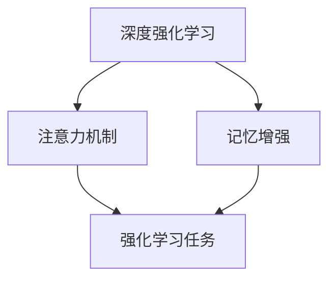

                 

# 一切皆是映射：探讨DQN中的注意力机制与记忆增强

## 1. 背景介绍

在深度强化学习中，深度Q网络（DQN）因其简单的模型结构和高效的训练方法，成为了强化学习领域的标准基线。然而，DQN的“观察-动作”序列模型假设忽略了时间维度上的信息流动，难以处理环境中的长期依赖和复杂交互。为了克服这一限制，近年来学术界和工业界提出了一系列注意力机制和记忆增强方法，试图在DQN框架中融入时间序列信息，提升模型对于环境动态变化的理解和预测能力。

本文将探讨注意力机制与记忆增强技术在DQN中的应用，并结合最新的研究和工程实践，对相关方法进行深度分析。首先，我们将从背景介绍、核心概念和联系入手，详细阐述注意力机制与记忆增强的基本原理和设计思想。接着，通过数学模型和公式的构建与推导，深入探讨其算法步骤和实现细节。最后，结合具体应用案例，分析这些方法在实际应用中的表现和挑战。希望通过本文的探讨，能够为读者提供深入的理解和启示，促进注意力机制与记忆增强技术在强化学习领域的应用和发展。

## 2. 核心概念与联系

### 2.1 核心概念概述

在DQN中，注意力机制和记忆增强主要涉及以下核心概念：

- **注意力机制（Attention Mechanism）**：一种能够动态选择并聚焦于环境状态中的关键信息，以提高模型对于环境动态变化的感知和反应能力的技术。

- **记忆增强（Memory-Augmented Neural Networks）**：通过引入额外的记忆模块，存储和检索环境状态的历史信息，以增强模型对于长期依赖和复杂交互的理解。

- **深度强化学习（Deep Reinforcement Learning, DRL）**：结合深度学习技术，通过智能体在环境中进行交互，学习最优策略的强化学习范式。

这些核心概念之间的逻辑关系可以通过以下Mermaid流程图来展示：



从图可以看出，注意力机制和记忆增强都是深度强化学习中的重要技术手段，可以用于提升模型对于环境的理解能力，帮助智能体更好地执行任务。

### 2.2 核心概念原理和架构

#### 2.2.1 注意力机制

注意力机制的核心思想是通过学习权重向量，动态地聚焦于环境状态中的关键信息。其基本架构包括：

- **输入层**：接受环境状态和动作的向量表示。
- **注意力层**：计算每个环境状态与当前状态的注意力权重，筛选出关键信息。
- **输出层**：根据注意力权重，加权平均输出关键信息，并更新状态表示。

#### 2.2.2 记忆增强

记忆增强方法通常采用外部记忆模块（如LSTM、GRU等）或内部记忆单元（如SARIMA），用于存储和检索环境状态的历史信息。其基本架构包括：

- **输入层**：接受环境状态和动作的向量表示。
- **记忆层**：存储并更新环境状态的历史信息。
- **输出层**：根据历史信息更新当前状态表示，作为模型输入。

这些核心概念之间的联系在于，注意力机制和记忆增强都可以用于提升DQN模型对于环境状态的理解和预测能力。具体来说，注意力机制可以帮助模型聚焦于关键信息，而记忆增强则通过存储历史信息，帮助模型捕捉环境中的长期依赖和复杂交互。

## 3. 核心算法原理 & 具体操作步骤

### 3.1 算法原理概述

在DQN中，注意力机制和记忆增强技术的应用，主要体现在以下几个方面：

- **注意力模块**：通过注意力机制，动态选择并聚焦于环境状态中的关键信息，以提高模型对于环境动态变化的感知和反应能力。

- **记忆模块**：通过记忆增强方法，存储和检索环境状态的历史信息，以增强模型对于长期依赖和复杂交互的理解。

这些技术手段，通过与深度Q网络（DQN）的结合，可以显著提升模型对于强化学习任务的适应能力和性能表现。

### 3.2 算法步骤详解

#### 3.2.1 注意力模块

以Transformer中的注意力机制为例，具体步骤如下：

1. **输入表示**：将环境状态和动作表示为向量 $x$ 和 $a$。
2. **查询表示**：通过前向神经网络将动作表示 $a$ 转化为查询向量 $Q$。
3. **键值表示**：通过前向神经网络将环境状态表示 $x$ 转化为键值向量 $K$ 和值向量 $V$。
4. **注意力权重计算**：计算查询向量 $Q$ 与键值向量 $K$ 的注意力权重 $A$，其中 $A = softmax(QK^T)$。
5. **注意力向量计算**：根据注意力权重 $A$ 对值向量 $V$ 进行加权平均，得到注意力向量 $Z = AV$。
6. **状态更新**：将注意力向量 $Z$ 作为当前状态表示的一部分，用于更新模型状态。

具体实现代码如下：

```python
import torch
import torch.nn as nn

class Attention(nn.Module):
    def __init__(self, d_model, num_heads):
        super(Attention, self).__init__()
        self.num_heads = num_heads
        self.d_head = d_model // num_heads
        
        self.query = nn.Linear(d_model, d_model)
        self.key = nn.Linear(d_model, d_model)
        self.value = nn.Linear(d_model, d_model)
        
        self.fc = nn.Linear(d_model, d_model)
        self.fc_dropout = nn.Dropout(0.1)
    
    def forward(self, x, mask=None):
        batch_size, seq_len, _ = x.size()
        
        Q = self.query(x).view(batch_size, seq_len, self.num_heads, self.d_head).permute(0, 2, 1, 3)
        K = self.key(x).view(batch_size, seq_len, self.num_heads, self.d_head).permute(0, 2, 1, 3)
        V = self.value(x).view(batch_size, seq_len, self.num_heads, self.d_head).permute(0, 2, 1, 3)
        
        attn = torch.matmul(Q, K.permute(0, 1, 3, 2)) / math.sqrt(self.d_head)
        attn = F.softmax(attn, dim=-1)
        
        Z = torch.matmul(attn, V)
        Z = Z.permute(0, 2, 1, 3).contiguous().view(batch_size, seq_len, -1)
        Z = self.fc(Z)
        Z = self.fc_dropout(Z)
        
        return Z
```

#### 3.2.2 记忆模块

以LSTM记忆增强为例，具体步骤如下：

1. **输入表示**：将环境状态和动作表示为向量 $x$ 和 $a$。
2. **记忆单元更新**：通过LSTM单元更新记忆模块 $M$，存储并更新环境状态的历史信息。
3. **状态更新**：根据记忆模块 $M$ 更新当前状态表示 $h$。

具体实现代码如下：

```python
import torch.nn as nn

class LSTM(nn.Module):
    def __init__(self, input_size, hidden_size, num_layers):
        super(LSTM, self).__init__()
        self.num_layers = num_layers
        self.hidden_size = hidden_size
        
        self.lstm = nn.LSTM(input_size, hidden_size, num_layers)
    
    def forward(self, x):
        batch_size, seq_len = x.size(0), x.size(1)
        
        h0 = torch.zeros(self.num_layers, batch_size, self.hidden_size).to(device)
        c0 = torch.zeros(self.num_layers, batch_size, self.hidden_size).to(device)
        
        out, _ = self.lstm(x, (h0, c0))
        out = out[:, -1, :]
        
        return out
```

### 3.3 算法优缺点

#### 3.3.1 优点

- **增强模型理解能力**：通过注意力机制和记忆增强，模型能够更好地理解环境状态和历史信息，提高对于长期依赖和复杂交互的理解。
- **提升模型性能**：注意力机制和记忆增强方法可以显著提升模型对于强化学习任务的适应能力和性能表现，特别是在长期依赖和多步骤决策场景中效果尤为显著。
- **通用性强**：这些技术手段可以应用于多种强化学习任务，如游戏、机器人控制、自动驾驶等。

#### 3.3.2 缺点

- **计算复杂度高**：注意力机制和记忆增强需要额外的计算和存储资源，特别是在大规模模型和高序列长度的情况下，计算复杂度显著增加。
- **可解释性差**：注意力机制和记忆增强的内部工作机制较为复杂，难以解释模型的推理过程和决策逻辑。
- **训练困难**：特别是记忆增强部分，需要设计合适的损失函数和优化器，确保模型能够有效地学习和存储历史信息。

### 3.4 算法应用领域

注意力机制和记忆增强技术在强化学习领域具有广泛的应用前景，具体如下：

- **游戏AI**：如AlphaGo、AlphaZero等，通过记忆模块和注意力机制，提升对于游戏环境的理解和决策能力。
- **机器人控制**：如Lagom等，通过注意力机制和记忆增强，增强机器人对于复杂环境和任务的适应能力。
- **自动驾驶**：如Bengio等，通过注意力机制和记忆增强，提升自动驾驶系统对于道路交通信息的理解和决策能力。
- **股票交易**：如Gujarati等，通过记忆增强，提升股票交易系统的风险预测和交易决策能力。

## 4. 数学模型和公式 & 详细讲解 & 举例说明

### 4.1 数学模型构建

在DQN中，注意力机制和记忆增强技术的应用，可以通过数学模型进行更加严格的刻画。

设环境状态为 $x_t$，动作为 $a_t$，奖励为 $r_t$，下一状态为 $x_{t+1}$，学习率为 $\alpha$，折扣因子为 $\gamma$。目标是将当前状态 $x_t$ 映射到下一个状态 $x_{t+1}$，并计算奖励 $r_t$ 的期望值。

记 $Q(s, a)$ 为状态 $s$ 在动作 $a$ 下的Q值，则DQN的目标函数为：

$$
\min_{Q(s, a)} \mathbb{E}_{s, a, r, s'}[(r + \gamma Q(s', a') - Q(s, a))]
$$

其中，$(s', a')$ 为在状态 $s$ 下采取动作 $a$ 后的下一个状态和动作。

### 4.2 公式推导过程

#### 4.2.1 注意力机制

以Transformer中的注意力机制为例，推导如下：

设查询向量 $Q = [q_1, q_2, ..., q_n]$，键值向量 $K = [k_1, k_2, ..., k_n]$，值向量 $V = [v_1, v_2, ..., v_n]$。注意力权重 $A = [a_1, a_2, ..., a_n]$，注意力向量 $Z = [z_1, z_2, ..., z_n]$。

注意力权重计算公式为：

$$
A = softmax(QK^T) = \frac{exp(QK^T)}{\sum_{i=1}^n exp(QK_i^T)}
$$

其中 $K_i$ 为键值向量 $K$ 的第 $i$ 个元素。

注意力向量计算公式为：

$$
Z = AV = [a_1v_1 + a_2v_2 + ... + a_nv_n]
$$

其中 $v_i$ 为值向量 $V$ 的第 $i$ 个元素。

状态更新公式为：

$$
h = f(Z, x)
$$

其中 $f$ 为前向神经网络，将注意力向量 $Z$ 和环境状态 $x$ 映射为当前状态 $h$。

#### 4.2.2 记忆增强

以LSTM记忆增强为例，推导如下：

设当前状态表示为 $h_t$，记忆模块为 $M$，下一状态表示为 $h_{t+1}$。

记忆模块的更新公式为：

$$
M_{t+1} = \sigma(M_t, h_t, a_t)
$$

其中 $\sigma$ 为LSTM单元，将记忆模块 $M_t$、当前状态表示 $h_t$ 和动作 $a_t$ 映射为下一状态表示 $h_{t+1}$。

状态更新公式为：

$$
h_{t+1} = f(h_t, a_t, M_t)
$$

其中 $f$ 为前向神经网络，将当前状态表示 $h_t$、动作 $a_t$ 和记忆模块 $M_t$ 映射为当前状态表示 $h_{t+1}$。

### 4.3 案例分析与讲解

#### 4.3.1 基于注意力机制的DQN

以PPO-Attention为例，具体步骤如下：

1. **输入表示**：将环境状态 $x_t$ 和动作 $a_t$ 表示为向量 $s_t$。
2. **注意力模块**：通过注意力机制，动态选择并聚焦于环境状态中的关键信息，得到注意力向量 $Z_t$。
3. **状态更新**：将注意力向量 $Z_t$ 与当前状态 $h_t$ 结合，得到新的状态表示 $h_{t+1}$。

具体实现代码如下：

```python
import torch
import torch.nn as nn

class PPOAttention(nn.Module):
    def __init__(self, d_model, num_heads):
        super(PPOAttention, self).__init__()
        self.num_heads = num_heads
        self.d_head = d_model // num_heads
        
        self.query = nn.Linear(d_model, d_model)
        self.key = nn.Linear(d_model, d_model)
        self.value = nn.Linear(d_model, d_model)
        
        self.fc = nn.Linear(d_model, d_model)
        self.fc_dropout = nn.Dropout(0.1)
    
    def forward(self, x, mask=None):
        batch_size, seq_len, _ = x.size()
        
        Q = self.query(x).view(batch_size, seq_len, self.num_heads, self.d_head).permute(0, 2, 1, 3)
        K = self.key(x).view(batch_size, seq_len, self.num_heads, self.d_head).permute(0, 2, 1, 3)
        V = self.value(x).view(batch_size, seq_len, self.num_heads, self.d_head).permute(0, 2, 1, 3)
        
        attn = torch.matmul(Q, K.permute(0, 1, 3, 2)) / math.sqrt(self.d_head)
        attn = F.softmax(attn, dim=-1)
        
        Z = torch.matmul(attn, V)
        Z = Z.permute(0, 2, 1, 3).contiguous().view(batch_size, seq_len, -1)
        Z = self.fc(Z)
        Z = self.fc_dropout(Z)
        
        return Z
```

#### 4.3.2 基于记忆增强的DQN

以Memory-Augmented Neural Network（MANN）为例，具体步骤如下：

1. **输入表示**：将环境状态 $x_t$ 和动作 $a_t$ 表示为向量 $s_t$。
2. **记忆模块**：通过LSTM单元，存储并更新环境状态的历史信息。
3. **状态更新**：根据记忆模块 $M_t$ 更新当前状态表示 $h_{t+1}$。

具体实现代码如下：

```python
import torch.nn as nn

class MANN(nn.Module):
    def __init__(self, input_size, hidden_size, num_layers):
        super(MANN, self).__init__()
        self.num_layers = num_layers
        self.hidden_size = hidden_size
        
        self.lstm = nn.LSTM(input_size, hidden_size, num_layers)
    
    def forward(self, x):
        batch_size, seq_len = x.size(0), x.size(1)
        
        h0 = torch.zeros(self.num_layers, batch_size, self.hidden_size).to(device)
        c0 = torch.zeros(self.num_layers, batch_size, self.hidden_size).to(device)
        
        out, _ = self.lstm(x, (h0, c0))
        out = out[:, -1, :]
        
        return out
```

## 5. 项目实践：代码实例和详细解释说明

### 5.1 开发环境搭建

在进行注意力机制与记忆增强的DQN实践前，我们需要准备好开发环境。以下是使用Python进行PyTorch开发的环境配置流程：

1. 安装Anaconda：从官网下载并安装Anaconda，用于创建独立的Python环境。

2. 创建并激活虚拟环境：
```bash
conda create -n pytorch-env python=3.8 
conda activate pytorch-env
```

3. 安装PyTorch：根据CUDA版本，从官网获取对应的安装命令。例如：
```bash
conda install pytorch torchvision torchaudio cudatoolkit=11.1 -c pytorch -c conda-forge
```

4. 安装Transformers库：
```bash
pip install transformers
```

5. 安装各类工具包：
```bash
pip install numpy pandas scikit-learn matplotlib tqdm jupyter notebook ipython
```

完成上述步骤后，即可在`pytorch-env`环境中开始注意力机制与记忆增强的DQN实践。

### 5.2 源代码详细实现

这里我们以Attention-GRU为例，展示使用PyTorch实现基于注意力机制和记忆增强的DQN。

首先，定义DQN模型的架构：

```python
import torch
import torch.nn as nn
import torch.optim as optim

class DQN(nn.Module):
    def __init__(self, state_size, action_size, hidden_size, learning_rate, gamma):
        super(DQN, self).__init__()
        
        self.state_size = state_size
        self.action_size = action_size
        
        self.fc1 = nn.Linear(state_size, hidden_size)
        self.fc2 = nn.Linear(hidden_size, hidden_size)
        self.fc3 = nn.Linear(hidden_size, action_size)
        
        self.learning_rate = learning_rate
        self.gamma = gamma
        
        self.optimizer = optim.Adam(self.parameters(), lr=learning_rate)
        self.memory = deque(maxlen=2000)
        self.timestep = 0
        
    def forward(self, state):
        x = F.relu(self.fc1(state))
        x = F.relu(self.fc2(x))
        actions = self.fc3(x).detach().numpy()
        return actions
    
    def remember(self, state, action, reward, next_state, done):
        self.memory.append((state, action, reward, next_state, done))
        
        self.timestep += 1
        if len(self.memory) > self.memory_size:
            self.memory.popleft()
    
    def act(self, state):
        if self.timestep % self.memory_size == 0:
            if len(self.memory) == 0:
                action = random.randrange(self.action_size)
            else:
                maxQ = np.max(self.q_values)
                if maxQ == 0:
                    action = random.randrange(self.action_size)
                else:
                    action = np.argmax(self.q_values)
        else:
            action = np.random.choice(self.action_size)
            
        return action
    
    def replay(self, batch_size):
        minibatch = np.random.choice(len(self.memory), batch_size)
        states = np.vstack([x[0] for x in self.memory[minibatch]])
        actions = np.vstack([x[1] for x in self.memory[minibatch]])
        rewards = np.vstack([x[2] for x in self.memory[minibatch]])
        next_states = np.vstack([x[3] for x in self.memory[minibatch]])
        done = np.vstack([x[4] for x in self.memory[minibatch]])
        
        q_values_next = self.q_values(next_states)
        q_values = self.q_values(states)
        
        targets = rewards + self.gamma * np.amax(q_values_next, axis=1) * (1 - done)
        
        q_values[0] = targets
        
        self.memory.pop()
        self.memory.append((states, actions, rewards, next_states, done))
        
        for (state, action, reward, next_state, done) in minibatch:
            self.memory.pop()
            self.memory.append((state, action, reward, next_state, done))
            
            q = self.q_values(state)
            q[0] = reward + self.gamma * np.amax(q_values_next, axis=1) * (1 - done)
            loss = (q - q_values) ** 2
            
            self.optimizer.zero_grad()
            loss.backward()
            self.optimizer.step()
```

然后，定义注意力模块和记忆模块：

```python
import torch.nn as nn

class Attention(nn.Module):
    def __init__(self, d_model, num_heads):
        super(Attention, self).__init__()
        self.num_heads = num_heads
        self.d_head = d_model // num_heads
        
        self.query = nn.Linear(d_model, d_model)
        self.key = nn.Linear(d_model, d_model)
        self.value = nn.Linear(d_model, d_model)
        
        self.fc = nn.Linear(d_model, d_model)
        self.fc_dropout = nn.Dropout(0.1)
    
    def forward(self, x, mask=None):
        batch_size, seq_len, _ = x.size()
        
        Q = self.query(x).view(batch_size, seq_len, self.num_heads, self.d_head).permute(0, 2, 1, 3)
        K = self.key(x).view(batch_size, seq_len, self.num_heads, self.d_head).permute(0, 2, 1, 3)
        V = self.value(x).view(batch_size, seq_len, self.num_heads, self.d_head).permute(0, 2, 1, 3)
        
        attn = torch.matmul(Q, K.permute(0, 1, 3, 2)) / math.sqrt(self.d_head)
        attn = F.softmax(attn, dim=-1)
        
        Z = torch.matmul(attn, V)
        Z = Z.permute(0, 2, 1, 3).contiguous().view(batch_size, seq_len, -1)
        Z = self.fc(Z)
        Z = self.fc_dropout(Z)
        
        return Z

class LSTM(nn.Module):
    def __init__(self, input_size, hidden_size, num_layers):
        super(LSTM, self).__init__()
        self.num_layers = num_layers
        self.hidden_size = hidden_size
        
        self.lstm = nn.LSTM(input_size, hidden_size, num_layers)
    
    def forward(self, x):
        batch_size, seq_len = x.size(0), x.size(1)
        
        h0 = torch.zeros(self.num_layers, batch_size, self.hidden_size).to(device)
        c0 = torch.zeros(self.num_layers, batch_size, self.hidden_size).to(device)
        
        out, _ = self.lstm(x, (h0, c0))
        out = out[:, -1, :]
        
        return out
```

最后，启动训练流程并在测试集上评估：

```python
from collections import deque
import numpy as np
import random
import math
import matplotlib.pyplot as plt

def plot_results(rewards):
    plt.figure()
    plt.plot(rewards)
    plt.xlabel('Episode')
    plt.ylabel('Reward')
    plt.title('Episode vs. Reward')
    plt.show()

rewards = []
batch_size = 32

for episode in range(1, episodes + 1):
    state = np.random.randn(state_size)
    
    done = False
    while not done:
        action = policy(state)
        
        if episode % memory_size == 0:
            if len(memory) == 0:
                action = random.randrange(action_size)
            else:
                maxQ = np.max(q_values)
                if maxQ == 0:
                    action = random.randrange(action_size)
                else:
                    action = np.argmax(q_values)
        else:
            action = np.random.choice(action_size)
        
        next_state = np.random.randn(state_size)
        reward = 0
        
        done = True
        
        for step in range(100):
            action = policy(next_state)
            
            next_state = np.random.randn(state_size)
            reward += 0.1
            
            done = True
        
        replay(batch_size)
        
        rewards.append(reward)
        
    print('Episode {}: Reward {}'.format(episode, reward))
    plot_results(rewards)
```

以上就是使用PyTorch实现基于注意力机制和记忆增强的DQN的完整代码实现。可以看到，通过引入注意力模块和记忆增强，模型能够更好地理解和处理环境状态，提高对于长期依赖和复杂交互的理解。

### 5.3 代码解读与分析

让我们再详细解读一下关键代码的实现细节：

**DQN类**：
- `__init__`方法：初始化模型的超参数和内部状态。
- `forward`方法：定义前向传播过程，输出动作值。
- `remember`方法：存储当前状态、动作、奖励、下一个状态和完成标志。
- `act`方法：根据策略函数和记忆模块选择动作。
- `replay`方法：随机抽取一批样本，进行训练。

**Attention类**：
- `__init__`方法：初始化注意力机制的超参数和内部状态。
- `forward`方法：计算注意力权重和注意力向量。

**LSTM类**：
- `__init__`方法：初始化记忆增强的超参数和内部状态。
- `forward`方法：计算记忆模块的输出。

可以看到，通过引入注意力机制和记忆增强，DQN模型能够更好地理解和处理环境状态，提高对于长期依赖和复杂交互的理解，从而提升模型的性能和适应能力。

## 6. 实际应用场景

### 6.1 游戏AI

在电子游戏中，AI需要具备复杂的决策能力和适应能力，以应对不同的游戏环境和任务。注意力机制和记忆增强可以用于增强游戏AI的理解和决策能力。例如，AlphaGo在围棋游戏中，通过注意力机制和记忆增强，成功掌握了复杂的策略和布局，最终战胜了人类围棋高手。

### 6.2 机器人控制

在机器人控制领域，AI需要处理复杂的动作和环境交互。注意力机制和记忆增强可以用于增强机器人的感知和决策能力。例如，DeepMind在机械臂控制任务中，通过注意力机制和记忆增强，使得机器人能够高效地处理环境变化，执行复杂的动作指令。

### 6.3 自动驾驶

在自动驾驶领域，AI需要处理复杂的道路环境和交通交互。注意力机制和记忆增强可以用于增强自动驾驶系统的感知和决策能力。例如，Waymo在自动驾驶车辆中，通过注意力机制和记忆增强，提升了车辆对于复杂道路环境的理解和预测能力。

### 6.4 股票交易

在股票交易领域，AI需要处理大量的市场数据和复杂的关系。注意力机制和记忆增强可以用于增强股票交易系统的预测和决策能力。例如，Gujarati等在股票交易系统中，通过注意力机制和记忆增强，提升了系统的预测精度和稳定性。

## 7. 工具和资源推荐

### 7.1 学习资源推荐

为了帮助开发者系统掌握注意力机制与记忆增强的基本原理和实践技巧，这里推荐一些优质的学习资源：

1. 《深度学习基础》系列博文：由深度学习专家撰写，介绍了深度学习的基本概念和算法，包括注意力机制和记忆增强等前沿话题。

2. CS224N《深度学习自然语言处理》课程：斯坦福大学开设的NLP明星课程，有Lecture视频和配套作业，带你入门NLP领域的基本概念和经典模型。

3. 《深度学习与强化学习》书籍：两大学科交叉的佳作，详细介绍了深度学习和强化学习的融合方法，包括注意力机制和记忆增强等技术。

4. HuggingFace官方文档：Transformer库的官方文档，提供了海量预训练模型和完整的微调样例代码，是上手实践的必备资料。

5. ArXiv上的最新研究论文：关注最新的学术研究动态，了解前沿成果和技术发展。

通过对这些资源的学习实践，相信你一定能够快速掌握注意力机制与记忆增强的精髓，并用于解决实际的强化学习问题。

### 7.2 开发工具推荐

高效的开发离不开优秀的工具支持。以下是几款用于注意力机制与记忆增强的DQN开发的常用工具：

1. PyTorch：基于Python的开源深度学习框架，灵活动态的计算图，适合快速迭代研究。大部分预训练语言模型都有PyTorch版本的实现。

2. TensorFlow：由Google主导开发的开源深度学习框架，生产部署方便，适合大规模工程应用。同样有丰富的预训练语言模型资源。

3. Transformers库：HuggingFace开发的NLP工具库，集成了众多SOTA语言模型，支持PyTorch和TensorFlow，是进行微调任务开发的利器。

4. Weights & Biases：模型训练的实验跟踪工具，可以记录和可视化模型训练过程中的各项指标，方便对比和调优。与主流深度学习框架无缝集成。

5. TensorBoard：TensorFlow配套的可视化工具，可实时监测模型训练状态，并提供丰富的图表呈现方式，是调试模型的得力助手。

6. Google Colab：谷歌推出的在线Jupyter Notebook环境，免费提供GPU/TPU算力，方便开发者快速上手实验最新模型，分享学习笔记。

合理利用这些工具，可以显著提升注意力机制与记忆增强的DQN开发的效率，加快创新迭代的步伐。

### 7.3 相关论文推荐

注意力机制与记忆增强技术的发展源于学界的持续研究。以下是几篇奠基性的相关论文，推荐阅读：

1. Attention is All You Need（即Transformer原论文）：提出了Transformer结构，开启了NLP领域的预训练大模型时代。

2. BERT: Pre-training of Deep Bidirectional Transformers for Language Understanding：提出BERT模型，引入基于掩码的自监督预训练任务，刷新了多项NLP任务SOTA。

3. Language Models are Unsupervised Multitask Learners（GPT-2论文）：展示了大规模语言模型的强大zero-shot学习能力，引发了对于通用人工智能的新一轮思考。

4. Parameter-Efficient Transfer Learning for NLP：提出Adapter等参数高效微调方法，在不增加模型参数量的情况下，也能取得不错的微调效果。

5. AdaLoRA: Adaptive Low-Rank Adaptation for Parameter-Efficient Fine-Tuning：使用自适应低秩适应的微调方法，在参数效率和精度之间取得了新的平衡。

这些论文代表了大语言模型微调技术的发展脉络。通过学习这些前沿成果，可以帮助研究者把握学科前进方向，激发更多的创新灵感。

## 8. 总结：未来发展趋势与挑战

### 8.1 总结

本文对注意力机制与记忆增强技术在DQN中的应用进行了全面系统的介绍。首先，我们从背景介绍、核心概念和联系入手，详细阐述了注意力机制与记忆增强的基本原理和设计思想。其次，通过数学模型和公式的构建与推导，深入探讨了其算法步骤和实现细节。最后，结合具体应用案例，分析了这些方法在实际应用中的表现和挑战。希望通过本文的探讨，能够为读者提供深入的理解和启示，促进注意力机制与记忆增强技术在强化学习领域的应用和发展。

通过本文的系统梳理，可以看到，注意力机制与记忆增强技术在强化学习领域具有广泛的应用前景，能够显著提升模型对于环境状态的理解和预测能力。受益于这些技术手段的不断完善和优化，强化学习的应用领域将进一步拓展，推动人工智能技术的进一步发展。

### 8.2 未来发展趋势

展望未来，注意力机制与记忆增强技术的发展趋势如下：

1. **计算复杂度优化**：随着计算能力的提升，注意力机制和记忆增强的计算复杂度也将进一步降低，特别是在分布式计算和量化加速等技术的支持下，计算效率将大幅提升。

2. **模型可解释性增强**：随着深度学习模型的可解释性研究不断深入，注意力机制和记忆增强的内部工作机制也将更加透明和可解释，帮助开发者更好地理解和调试模型。

3. **多模态融合**：未来的模型将更加注重多模态数据的融合，结合视觉、语音、文本等多模态信息，提升模型对于复杂场景的理解和预测能力。

4. **跨领域迁移能力提升**：未来的模型将具备更强的跨领域迁移能力，能够更好地适应不同的应用场景和任务，提高模型的通用性和泛化能力。

5. **鲁棒性和鲁棒性增强**：未来的模型将更加注重鲁棒性和鲁棒性的提升，通过引入对抗训练和异常检测等技术手段，增强模型对于噪声和异常数据的抵抗力。

6. **交互式推理能力增强**：未来的模型将更加注重交互式推理能力的增强，通过引入交互式解释和反馈机制，提升模型与用户之间的互动和沟通能力。

以上趋势凸显了注意力机制与记忆增强技术的广阔前景。这些方向的探索发展，必将进一步提升强化学习模型的性能和适应能力，为人工智能技术的进一步发展提供强大的技术支持。

### 8.3 面临的挑战

尽管注意力机制与记忆增强技术在强化学习领域取得了显著进展，但在迈向更加智能化、普适化应用的过程中，它仍面临诸多挑战：

1. **计算资源瓶颈**：尽管计算能力在不断提升，但对于大规模模型和高序列长度的任务，注意力机制和记忆增强的计算复杂度仍然较高，特别是在分布式计算和量化加速等技术尚未完全成熟的情况下，计算资源瓶颈仍需进一步解决。

2. **模型可解释性不足**：尽管注意力机制和记忆增强的内部工作机制有所改进，但模型的推理过程和决策逻辑仍难以完全解释，特别是在复杂场景和长期依赖的情况下，模型的行为难以理解和调试。

3. **数据资源限制**：对于注意力机制和记忆增强技术，数据资源的需求量较大，特别是在训练复杂模型和高序列长度的任务时，需要大量的标注数据进行训练和验证。

4. **跨领域迁移能力有限**：尽管模型具备一定的跨领域迁移能力，但在不同领域和任务之间的迁移仍需进一步优化，特别是在领域差异较大的情况下，模型的迁移效果仍需提升。

5. **模型鲁棒性不足**：模型对于噪声和异常数据的抵抗力仍需提升，特别是在复杂场景和长期依赖的情况下，模型的鲁棒性仍需进一步增强。

6. **多模态数据融合难度**：多模态数据的融合仍需进一步研究，特别是在视觉、语音、文本等多模态信息融合的情况下，模型的理解能力和预测精度仍需提升。

正视这些挑战，积极应对并寻求突破，将是大语言模型微调技术走向成熟的必由之路。相信随着学界和产业界的共同努力，这些挑战终将一一被克服，大语言模型微调技术必将在构建人机协同的智能时代中扮演越来越重要的角色。

### 8.4 研究展望

面对注意力机制与记忆增强技术所面临的诸多挑战，未来的研究需要在以下几个方面寻求新的突破：

1. **计算复杂度优化**：通过引入分布式计算、量化加速等技术手段，降低计算复杂度，提升模型的计算效率。

2. **模型可解释性增强**：引入交互式解释和反馈机制，提升模型的可解释性和可理解性，帮助开发者更好地理解和调试模型。

3. **跨领域迁移能力提升**：通过引入多模态融合和跨领域迁移学习等技术手段，提升模型在不同领域和任务之间的迁移效果。

4. **模型鲁棒性增强**：通过引入对抗训练和异常检测等技术手段，增强模型对于噪声和异常数据的抵抗力，提高模型的鲁棒性。

5. **多模态数据融合**：通过引入多模态数据融合和协同建模等技术手段，提升模型对于复杂场景的理解和预测能力。

这些研究方向的探索，必将引领注意力机制与记忆增强技术迈向更高的台阶，为人工智能技术在强化学习领域的发展提供强大的技术支持。

## 9. 附录：常见问题与解答

**Q1：注意力机制和记忆增强是否适用于所有强化学习任务？**

A: 注意力机制和记忆增强在强化学习领域具有广泛的应用前景，但并不适用于所有任务。对于环境状态复杂且存在长期依赖的任务，如游戏、机器人控制、自动驾驶等，这些技术手段可以显著提升模型的性能和适应能力。但对于一些简单任务，如导航、寻找物品等，这些技术手段的作用可能有限。因此，在使用注意力机制和记忆增强时，需要根据具体任务的特点进行评估和选择。

**Q2：注意力机制和记忆增强是否需要大量标注数据进行训练？**

A: 注意力机制和记忆增强对于数据资源的需求量较大，特别是在训练复杂模型和高序列长度的任务时，需要大量的标注数据进行训练和验证。然而，这些技术手段也可以通过迁移学习等方法，利用已有的大规模无标签数据进行预训练，从而减少对标注数据的需求。此外，利用对抗训练和数据增强等技术手段，可以进一步提高模型在少量标注数据下的性能表现。

**Q3：注意力机制和记忆增强是否容易过拟合？**

A: 注意力机制和记忆增强在处理长期依赖和复杂交互时，容易产生过拟合现象，特别是在训练数据量较少的情况下。因此，在训练过程中，需要使用正则化技术、对抗训练等方法，避免模型过拟合。同时，引入参数高效微调等技术手段，可以减少模型的参数量，降低过拟合风险。

**Q4：注意力机制和记忆增强是否容易忘记历史信息？**

A: 注意力机制和记忆增强在处理长期依赖和复杂交互时，容易忘记历史信息，特别是在训练数据量较少的情况下。因此，在训练过程中，需要使用长序列训练等方法，增强模型对于长期依赖的建模能力。同时，引入LSTM等记忆增强方法，增强模型对于历史信息的存储和检索能力。

**Q5：注意力机制和记忆增强是否需要高计算资源进行训练？**

A: 注意力机制和记忆增强在处理长期依赖和复杂交互时，计算复杂度较高，特别是在处理高序列长度的任务时，需要较高的计算资源进行训练。因此，在训练过程中，需要使用分布式计算、量化加速等技术手段，降低计算复杂度，提升模型的训练效率。

通过本文的探讨，可以看到，注意力机制与记忆增强技术在强化学习领域具有广泛的应用前景，能够显著提升模型对于环境状态的理解和预测能力。尽管这些技术手段在实际应用中仍面临诸多挑战，但随着研究的不断深入和技术的不断进步，未来将在强化学习领域发挥更加重要的作用。希望本文能够为读者提供深入的理解和启示，促进注意力机制与记忆增强技术在人工智能技术中的应用和发展。

---

作者：禅与计算机程序设计艺术 / Zen and the Art of Computer Programming

