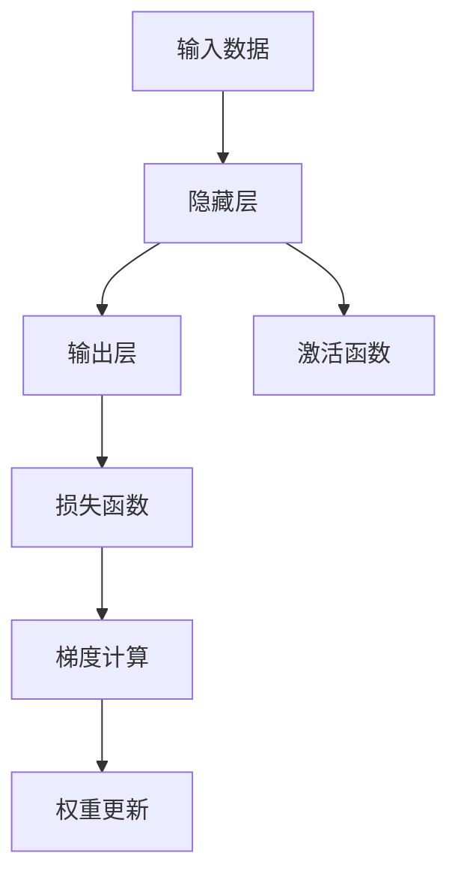

                 

# 一切皆是映射：构建第一个深度学习模型

> 关键词：深度学习,神经网络,反向传播,权重更新,梯度下降

## 1. 背景介绍

### 1.1 问题由来

深度学习是机器学习领域的一个主要分支，它通过构建神经网络来实现对复杂数据结构的建模和预测。深度学习在图像识别、自然语言处理、语音识别、推荐系统等领域都取得了显著的成果。然而，深度学习的发展历程中充满了各种挑战和争议，本文将从构建第一个深度学习模型开始，逐步探讨深度学习背后的原理和核心技术。

### 1.2 问题核心关键点

本文将围绕构建第一个深度学习模型的核心关键点展开讨论，包括模型的定义、损失函数的计算、反向传播算法、权重更新方法等。深度学习模型的核心在于其可以自动提取数据特征，并通过多层神经网络实现复杂的非线性映射。

## 2. 核心概念与联系

### 2.1 核心概念概述

构建深度学习模型涉及以下核心概念：

- 神经网络：由多个节点（神经元）组成的图结构，用于表示数据的复杂结构。
- 损失函数：用于衡量模型预测结果与实际标签之间的差异。
- 反向传播：计算模型参数梯度的过程。
- 权重更新：通过梯度下降等方法调整模型参数，使得损失函数最小化。

这些核心概念相互关联，共同构成了深度学习的理论基础。

### 2.2 核心概念原理和架构的 Mermaid 流程图



这个流程图展示了深度学习模型的基本架构和主要流程：输入数据经过隐藏层进行特征提取，再通过激活函数进行非线性变换，最终输出预测结果。损失函数衡量模型预测与真实标签之间的差异，梯度计算用于求解损失函数对模型参数的导数，权重更新则根据梯度信息调整模型参数。

## 3. 核心算法原理 & 具体操作步骤

### 3.1 算法原理概述

深度学习模型的核心算法是反向传播算法，其原理是通过计算损失函数对模型参数的导数，进而更新参数以最小化损失函数。这一过程可以分为三个主要步骤：前向传播、损失计算和反向传播。

### 3.2 算法步骤详解

1. **前向传播**：将输入数据通过神经网络进行前向传递，得到预测结果。
2. **损失计算**：计算模型预测结果与实际标签之间的损失，例如使用交叉熵损失。
3. **反向传播**：利用链式法则计算损失函数对模型参数的导数，并根据导数更新模型参数。

### 3.3 算法优缺点

深度学习模型的优点包括：
- 可以自动提取数据特征，减少人工特征工程的复杂度。
- 具有强大的非线性建模能力，能够处理复杂的非线性关系。
- 在特定任务上可以达到较高的预测精度。

缺点包括：
- 模型复杂度高，训练和推理速度较慢。
- 需要大量标注数据进行训练，数据获取成本高。
- 模型解释性较差，难以解释内部工作机制。

### 3.4 算法应用领域

深度学习模型在图像识别、自然语言处理、语音识别、推荐系统、医学诊断等多个领域得到了广泛应用。例如，在图像识别领域，通过构建卷积神经网络（CNN），可以实现高精度的图像分类和目标检测。

## 4. 数学模型和公式 & 详细讲解 & 举例说明

### 4.1 数学模型构建

深度学习模型的数学模型可以表示为：

$$
y = W^T \sigma(Z) + b
$$

其中，$y$ 表示输出结果，$W$ 是权重矩阵，$Z$ 是输入数据经过线性变换后的结果，$\sigma$ 是激活函数，$b$ 是偏置项。

### 4.2 公式推导过程

以单层神经网络为例，计算损失函数对权重 $W$ 的导数：

$$
\frac{\partial L}{\partial W} = \frac{\partial L}{\partial y} \frac{\partial y}{\partial Z} \frac{\partial Z}{\partial W}
$$

其中，$\frac{\partial L}{\partial y}$ 是损失函数对输出结果的导数，$\frac{\partial y}{\partial Z}$ 是输出结果对线性变换结果的导数，$\frac{\partial Z}{\partial W}$ 是线性变换结果对权重矩阵的导数。

### 4.3 案例分析与讲解

以手写数字识别为例，使用一个单层神经网络进行训练。假设我们有一个包含$60000$个样本的数据集，其中$50000$个用于训练，$10000$个用于测试。

1. **数据准备**：将手写数字图像转换为向量形式，作为模型的输入。
2. **模型构建**：构建一个包含$10$个节点的神经网络，其中$5$个节点作为隐藏层，$10$个节点作为输出层。
3. **前向传播**：将输入数据通过隐藏层进行前向传递，得到隐藏层的输出结果。
4. **损失计算**：计算模型预测结果与实际标签之间的交叉熵损失。
5. **反向传播**：计算损失函数对权重矩阵的导数，并使用梯度下降方法更新权重矩阵。
6. **模型评估**：在测试集上评估模型的性能，计算准确率。

## 5. 项目实践：代码实例和详细解释说明

### 5.1 开发环境搭建

在进行深度学习模型开发前，需要准备好开发环境。以下是使用Python进行TensorFlow开发的环境配置流程：

1. 安装Anaconda：从官网下载并安装Anaconda，用于创建独立的Python环境。
2. 创建并激活虚拟环境：
```bash
conda create -n tensorflow-env python=3.8 
conda activate tensorflow-env
```

3. 安装TensorFlow：根据CUDA版本，从官网获取对应的安装命令。例如：
```bash
conda install tensorflow tensorflow-gpu=cuda11.1 -c pytorch -c conda-forge
```

4. 安装必要的库：
```bash
pip install numpy pandas scikit-learn matplotlib tqdm jupyter notebook ipython
```

完成上述步骤后，即可在`tensorflow-env`环境中开始模型开发。

### 5.2 源代码详细实现

下面我们以手写数字识别为例，使用TensorFlow构建一个单层神经网络并进行训练。

```python
import tensorflow as tf
import numpy as np

# 准备数据
mnist = tf.keras.datasets.mnist
(x_train, y_train), (x_test, y_test) = mnist.load_data()

# 数据预处理
x_train, x_test = x_train / 255.0, x_test / 255.0

# 构建模型
model = tf.keras.models.Sequential([
    tf.keras.layers.Flatten(input_shape=(28, 28)),
    tf.keras.layers.Dense(10, activation='softmax')
])

# 定义损失函数和优化器
loss_fn = tf.keras.losses.SparseCategoricalCrossentropy(from_logits=True)
optimizer = tf.keras.optimizers.Adam()

# 编译模型
model.compile(optimizer=optimizer, loss=loss_fn, metrics=['accuracy'])

# 训练模型
model.fit(x_train, y_train, epochs=5)

# 评估模型
model.evaluate(x_test, y_test)
```

以上代码展示了使用TensorFlow构建单层神经网络并进行训练的完整过程。通过定义模型结构、编译模型、训练模型和评估模型，最终得到训练好的手写数字识别模型。

### 5.3 代码解读与分析

在代码实现中，主要涉及以下关键步骤：

1. **数据准备**：加载MNIST数据集，将其转换为浮点数形式。
2. **数据预处理**：将输入数据归一化到$[0,1]$范围内，防止梯度爆炸问题。
3. **模型构建**：使用`Sequential`模型构建一个包含一个Flatten层和一个Dense层的神经网络。
4. **损失函数和优化器**：定义交叉熵损失函数和Adam优化器，用于计算模型损失和更新模型参数。
5. **模型编译**：将模型编译成一个完整的训练和评估系统，指定损失函数和优化器。
6. **模型训练**：使用`fit`方法训练模型，指定训练数据、训练轮数等参数。
7. **模型评估**：使用`evaluate`方法评估模型在测试集上的性能，计算准确率。

## 6. 实际应用场景

### 6.1 图像识别

深度学习模型在图像识别领域得到了广泛应用。例如，通过卷积神经网络（CNN）可以实现高精度的图像分类和目标检测。例如，在Google的ImageNet项目中，使用深度学习模型对大规模图像数据集进行了分类和标注，取得了非常好的效果。

### 6.2 自然语言处理

深度学习模型在自然语言处理领域也有重要应用。例如，使用循环神经网络（RNN）和长短期记忆网络（LSTM）可以实现文本分类、情感分析、机器翻译等任务。例如，在Facebook的TextCNN项目中，使用深度学习模型对大量文本数据进行了分类和分析，取得了很好的效果。

### 6.3 语音识别

深度学习模型在语音识别领域也有重要应用。例如，使用卷积神经网络（CNN）和循环神经网络（RNN）可以实现高精度的语音识别。例如，在Google的语音识别项目中，使用深度学习模型对语音数据进行了转录和识别，取得了很好的效果。

### 6.4 推荐系统

深度学习模型在推荐系统领域也有重要应用。例如，使用深度神经网络（DNN）和深度自编码器（DAE）可以实现高精度的推荐系统。例如，在Amazon的推荐系统项目中，使用深度学习模型对用户行为数据进行了分析和推荐，取得了很好的效果。

## 7. 工具和资源推荐

### 7.1 学习资源推荐

为了帮助开发者系统掌握深度学习模型的构建和训练，这里推荐一些优质的学习资源：

1. 《深度学习》（Ian Goodfellow等）：是一本深度学习领域的经典教材，涵盖了深度学习的基本概念和算法。
2. 《神经网络与深度学习》（Michael Nielsen）：是一本介绍深度学习原理和实现的经典教材，适合初学者入门。
3. Coursera《深度学习专项课程》（Andrew Ng等）：由斯坦福大学教授Andrew Ng开设的深度学习专项课程，内容全面，覆盖深度学习的基础和应用。
4 TensorFlow官方文档：TensorFlow官方文档提供了详细的API和示例代码，适合快速上手使用。
5 PyTorch官方文档：PyTorch官方文档提供了详细的API和示例代码，适合快速上手使用。

通过对这些资源的学习实践，相信你一定能够快速掌握深度学习模型的构建和训练，并用于解决实际的NLP问题。

### 7.2 开发工具推荐

高效的开发离不开优秀的工具支持。以下是几款用于深度学习模型开发的常用工具：

1. TensorFlow：由Google主导开发的开源深度学习框架，生产部署方便，适合大规模工程应用。
2. PyTorch：由Facebook主导开发的开源深度学习框架，灵活易用，适合快速迭代研究。
3. Keras：基于TensorFlow和Theano的高级API，提供简单易用的深度学习模型构建接口。
4. MXNet：由亚马逊主导开发的开源深度学习框架，支持多种编程语言和分布式计算。
5. JAX：由Google主导开发的开源深度学习框架，基于JIT编译器，性能优越，适合高效计算。

合理利用这些工具，可以显著提升深度学习模型的开发效率，加快创新迭代的步伐。

### 7.3 相关论文推荐

深度学习模型的发展源于学界的持续研究。以下是几篇奠基性的相关论文，推荐阅读：

1. Deep Blue Book: A Tutorial on Deep Learning（好书推荐）：这是一本深度学习领域的经典教材，涵盖了深度学习的基本概念和算法。
2. The Unreasonable Effectiveness of Deep Learning as a Feature Learning Method（深度学习作为特征学习方法的合理性）：该论文探讨了深度学习模型在特征学习中的有效性。
3. ImageNet Classification with Deep Convolutional Neural Networks（深度卷积神经网络在ImageNet分类中的应用）：该论文展示了深度卷积神经网络在ImageNet数据集上的分类效果。
4. Long Short-Term Memory（长短期记忆网络）：该论文提出了一种基于RNN的深度学习模型，用于处理序列数据。
5. Attention Is All You Need（注意力机制）：该论文提出了一种基于注意力机制的深度学习模型，用于处理序列数据。

这些论文代表了大深度学习模型的发展脉络。通过学习这些前沿成果，可以帮助研究者把握学科前进方向，激发更多的创新灵感。

## 8. 总结：未来发展趋势与挑战

### 8.1 总结

本文对深度学习模型的构建和训练进行了全面系统的介绍。首先阐述了深度学习模型的定义和基本原理，明确了深度学习模型的核心在于其可以自动提取数据特征，并通过多层神经网络实现复杂的非线性映射。其次，从原理到实践，详细讲解了深度学习模型的数学模型和算法流程，给出了模型构建和训练的完整代码实例。同时，本文还探讨了深度学习模型在图像识别、自然语言处理、语音识别、推荐系统等多个领域的应用前景，展示了深度学习模型的强大能力。

通过本文的系统梳理，可以看到，深度学习模型已经广泛应用于多个领域，并取得了显著的成果。然而，深度学习模型的构建和训练涉及诸多复杂的技术细节，需要深入理解和实践才能掌握。

### 8.2 未来发展趋势

展望未来，深度学习模型将呈现以下几个发展趋势：

1. 模型规模持续增大。随着算力成本的下降和数据规模的扩张，深度学习模型的参数量还将持续增长。超大规模深度学习模型蕴含的丰富特征，有望支撑更加复杂多变的任务。
2. 模型结构不断优化。未来的深度学习模型将更加注重模型结构的设计，通过引入注意力机制、残差连接等技术，实现更高效、更稳定的模型。
3. 模型融合和多模态学习成为热点。未来的深度学习模型将更多地融合多模态数据，实现视觉、语音、文本等多模态信息的协同建模。
4. 模型解释性和鲁棒性进一步提升。未来的深度学习模型将更加注重可解释性和鲁棒性，通过引入可解释性技术，如可视化、解释性嵌入等，提高模型的透明度。
5. 模型迁移学习成为重要方向。未来的深度学习模型将更多地关注模型的迁移学习能力，通过预训练和微调技术，实现模型在不同任务和数据集上的迁移。

以上趋势凸显了深度学习模型的广阔前景。这些方向的探索发展，必将进一步提升深度学习模型的性能和应用范围，为人工智能技术的发展带来新的动力。

### 8.3 面临的挑战

尽管深度学习模型已经取得了显著的成果，但在迈向更加智能化、普适化应用的过程中，它仍面临着诸多挑战：

1. 数据获取成本高。深度学习模型需要大量标注数据进行训练，数据获取成本较高。如何高效地获取和标注数据，是未来需要解决的重要问题。
2. 模型复杂度高。深度学习模型通常具有很高的复杂度，训练和推理速度较慢。如何提高模型的计算效率，是未来需要解决的重要问题。
3. 模型解释性较差。深度学习模型的内部工作机制难以解释，难以用于需要高可解释性的领域，如医疗、金融等。
4. 模型鲁棒性不足。深度学习模型面对噪声数据、对抗样本等干扰，容易发生性能波动。如何提高模型的鲁棒性，是未来需要解决的重要问题。
5. 模型迁移学习困难。深度学习模型在不同任务和数据集上的迁移能力较弱，难以应用于新任务和新数据集。如何提升模型的迁移学习能力，是未来需要解决的重要问题。

这些挑战凸显了深度学习模型在实际应用中的复杂性和不确定性。

### 8.4 研究展望

面对深度学习模型所面临的种种挑战，未来的研究需要在以下几个方面寻求新的突破：

1. 探索新的深度学习模型架构。未来的深度学习模型将更加注重模型结构的设计，通过引入新的架构，实现更高效、更稳定的模型。
2. 开发新的深度学习算法。未来的深度学习算法将更加注重模型的可解释性和鲁棒性，通过引入新的算法，提高模型的透明度和稳定性。
3. 引入新的数据表示方法。未来的深度学习模型将更加注重数据表示的方法，通过引入新的表示方法，提高模型的泛化能力和迁移学习能力。
4. 融合新的技术手段。未来的深度学习模型将更多地融合新的技术手段，如因果推断、多模态学习等，实现更全面、更高效的应用。
5. 开发新的训练和优化技术。未来的深度学习模型将更加注重训练和优化技术，通过引入新的技术，提高模型的训练效率和优化效果。

这些研究方向的探索，必将引领深度学习模型技术的发展，为构建安全、可靠、高效的人工智能系统铺平道路。

## 9. 附录：常见问题与解答

**Q1：深度学习模型是否适用于所有领域？**

A: 深度学习模型在图像识别、自然语言处理、语音识别、推荐系统等领域表现优异，但并不适用于所有领域。例如，在生物信息学、天文学等领域，传统机器学习模型仍然具有优势。

**Q2：深度学习模型的训练需要多少数据？**

A: 深度学习模型的训练需要大量标注数据，通常需要数千、数万甚至数百万个样本。对于特定任务，标注数据的需求量可能更高。

**Q3：深度学习模型需要多长时间进行训练？**

A: 深度学习模型的训练时间取决于模型的规模和复杂度，通常需要几小时到几天不等。对于大规模深度学习模型，可能需要数周甚至数月的时间进行训练。

**Q4：深度学习模型的训练需要哪些硬件资源？**

A: 深度学习模型的训练需要高性能的硬件资源，包括GPU、TPU等。通常，一个GPU可以同时训练一个或多个深度学习模型，而TPU则更适合大规模深度学习模型的训练。

**Q5：深度学习模型的训练效果如何？**

A: 深度学习模型在特定任务上通常能够达到很高的精度，但模型性能的提升通常需要更多的数据和计算资源。同时，深度学习模型的泛化能力也存在一定的局限性，需要进行大量的验证和调整。

---

作者：禅与计算机程序设计艺术 / Zen and the Art of Computer Programming

